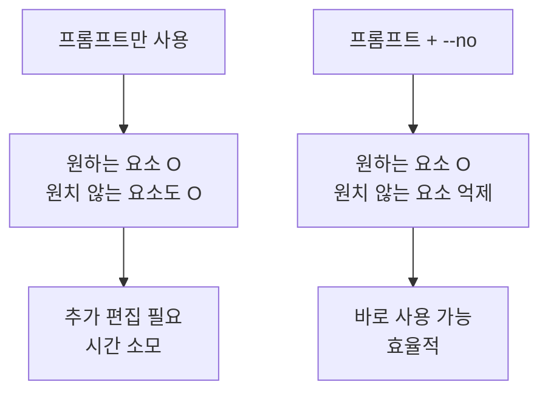
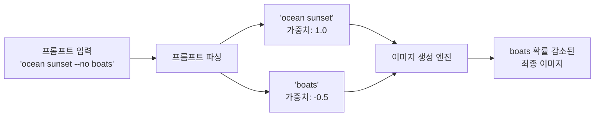
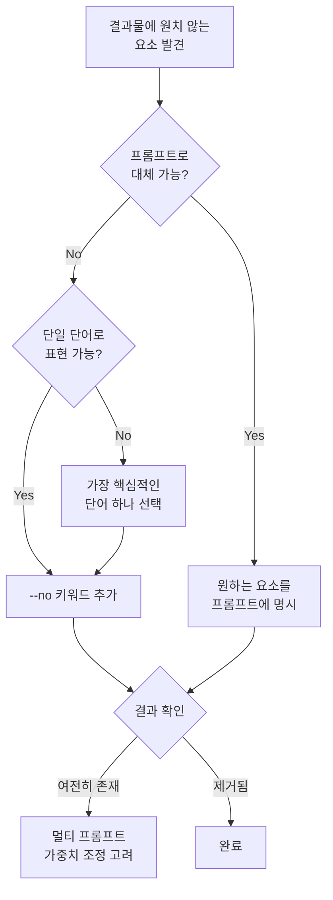
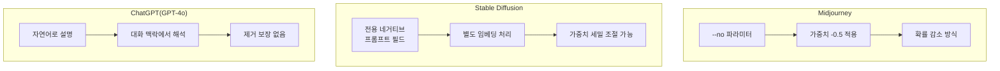
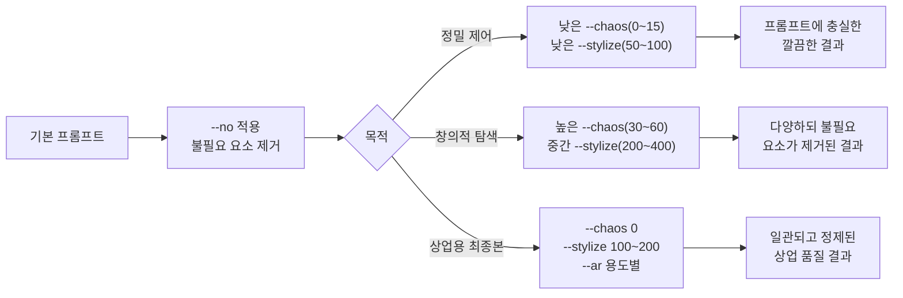
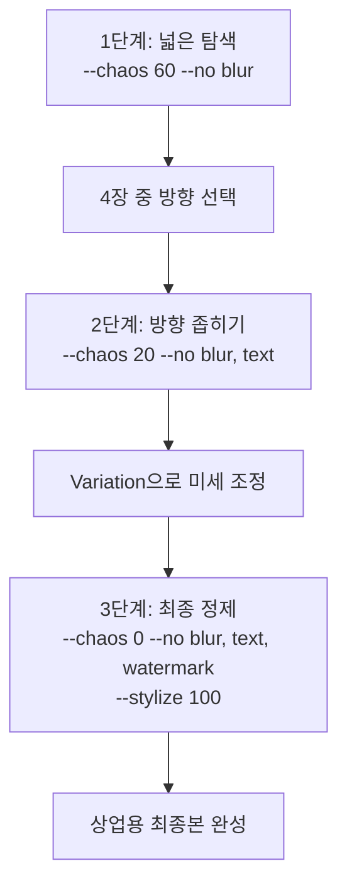
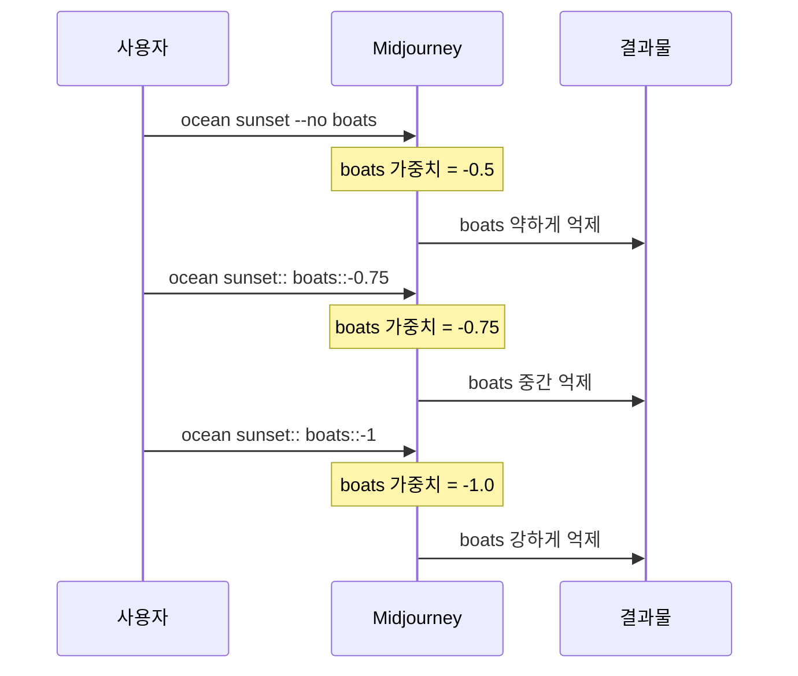

# 네거티브 프롬프트(--no)와 품질 제어

> Midjourney의 --no 파라미터로 원치 않는 요소를 걸러내고, 결과물의 품질을 한 단계 끌어올리는 전략을 배웁니다.

## 개요

이 섹션에서는 Midjourney의 `--no` 파라미터를 중심으로 네거티브 프롬프트의 개념과 활용법을 체계적으로 학습합니다. 지금까지 배운 `--ar`, `--stylize`, `--chaos`가 "어떻게 만들까"를 제어했다면, `--no`는 **"무엇을 빼야 할까"**를 다룹니다. 원하는 것을 말하는 것만큼, 원하지 않는 것을 정확히 제거하는 능력이 결과물의 완성도를 좌우합니다.

**선수 지식**: [프롬프트 해부학 — 6요소 프레임워크](02-ch2-프롬프트-구조-마스터/01-01-프롬프트-해부학-6요소-프레임워크.md)의 기본 구조, [카오스(--chaos)와 다양성 탐색](05-ch5-midjourney-기본과-파라미터-튜닝/04-04-카오스--chaos와-다양성-탐색.md)에서 배운 파라미터 조합 개념

**학습 목표**:
- `--no` 파라미터의 작동 원리(가중치 -0.5 메커니즘)를 이해한다
- 효과적인 네거티브 키워드 전략을 수립할 수 있다
- 플랫폼별 네거티브 프롬프트 방식의 차이를 파악한다
- `--no`와 기존 파라미터를 조합하여 결과물 품질을 정밀 제어한다
- 멀티 프롬프트 가중치(`::`)를 활용한 고급 제거 기법을 적용할 수 있다

## 왜 알아야 할까?

여러분이 클라이언트를 위한 고급 화장품 광고 이미지를 만들고 있다고 상상해보세요. 프롬프트에 "elegant perfume bottle on marble table, soft lighting"이라고 입력했는데, 결과물에 꽃다발, 리본, 배경의 창문 같은 의도하지 않은 요소가 가득합니다. 아무리 프롬프트를 정교하게 써도, AI는 "화장품 광고"라는 맥락에서 자주 등장하는 요소들을 자동으로 추가하는 경향이 있거든요.

이때 필요한 것이 바로 **네거티브 프롬프트**입니다. "이건 넣지 마"라고 명확히 지시하는 도구죠. 실무에서 AI 이미지 생성의 가장 큰 고충 중 하나는 "원하는 건 나오는데, 원하지 않는 것도 같이 나온다"는 점입니다. `--no` 파라미터는 이 문제를 해결하는 핵심 도구입니다.

> 📊 **그림 1**: 네거티브 프롬프트가 작업 품질에 미치는 영향



## 핵심 개념

### 개념 1: --no 파라미터의 작동 원리

> 💡 **비유**: 커피숍에서 주문할 때를 떠올려보세요. "아이스 아메리카노 주세요"만으로는 시럽이 들어올 수도 있고, 휘핑크림이 올라올 수도 있죠. "아이스 아메리카노, 시럽 빼고, 휘핑 빼주세요"라고 말해야 정확히 원하는 음료가 나옵니다. `--no` 파라미터가 바로 이 "빼주세요"의 역할을 합니다.

Midjourney에서 `--no`는 단순히 특정 요소를 차단하는 스위치가 아닙니다. 기술적으로는 **멀티 프롬프트에서 해당 요소의 가중치를 -0.5로 설정**하는 것과 동일하게 작동합니다. 즉, 완전히 제거하는 것이 아니라 해당 요소가 등장할 확률을 크게 낮추는 방식이죠.

**기본 문법**은 매우 간단합니다:

```
프롬프트 텍스트 --no 제거할요소
```

여러 요소를 제거하고 싶다면 쉼표로 구분합니다:

```
vibrant landscape painting --no trees, people, buildings
```

> 📊 **그림 2**: --no 파라미터의 가중치 작동 메커니즘



이 메커니즘을 이해하면 중요한 포인트가 보입니다. 가중치가 -0.5이지 -1.0(완전 제거)이 아니기 때문에, `--no`로 지정한 요소가 **여전히 약하게 등장할 수 있습니다**. 특히 해당 요소가 프롬프트의 주제와 강하게 연결된 경우(예: "ocean"에 대한 "boats")에는 완전한 제거가 어려울 수 있어요. 이런 경우에는 뒤에서 다룰 **멀티 프롬프트 가중치 기법**으로 더 강하게 억제하거나, 아예 프롬프트 자체를 재구성하는 편이 낫습니다.

> ⚠️ **흔한 오해**: "--no를 쓰면 해당 요소가 100% 사라진다"고 생각하기 쉽지만, 실제로는 확률을 낮추는 것입니다. 강하게 연관된 요소는 여전히 등장할 수 있으므로, 프롬프트 자체를 재구성하는 것이 더 효과적인 경우도 있습니다.

### 개념 2: 효과적인 네거티브 키워드 전략

> 💡 **비유**: 조각가가 대리석에서 불필요한 부분을 깎아내듯, 네거티브 프롬프트는 AI가 만드는 이미지에서 군더더기를 깎아내는 조각칼입니다. 하지만 조각칼을 너무 많이 쓰면 작품 자체가 망가지듯, 네거티브 키워드도 적절한 양이 중요합니다.

효과적인 네거티브 키워드 전략은 크게 세 가지 원칙으로 정리할 수 있습니다.

**원칙 1: 한 번에 하나씩 시작하라**

가장 거슬리는 요소 하나만 먼저 `--no`로 제거하고 결과를 확인하세요. 한꺼번에 여러 키워드를 넣으면, 어떤 키워드가 실제로 효과를 냈는지 알 수 없습니다. 또한 너무 많은 제한을 걸면 Midjourney가 선택할 수 있는 범위가 좁아져서 오히려 이미지 품질이 떨어집니다.

**원칙 2: 구체적인 단일 단어를 사용하라**

Midjourney의 모더레이션 시스템은 `--no` 뒤의 모든 단어를 **개별적으로 읽습니다**. 이것은 매우 중요한 특성인데요, 예를 들어 `--no modern clothing`이라고 쓰면 AI는 "no modern"과 "no clothing"을 각각 따로 해석합니다. 의도하지 않은 결과가 나올 수 있죠!

**원칙 3: 제거보다 대체를 먼저 고려하라**

"이걸 빼줘"보다 "이걸 대신 넣어줘"가 더 효과적인 경우가 많습니다. 예를 들어, 인물 사진에서 현대적 옷이 싫다면 `--no modern clothing` 대신 프롬프트에 `wearing traditional hanbok`처럼 원하는 것을 명시하는 게 낫습니다.

> 📊 **그림 3**: 네거티브 키워드 전략 의사결정 플로우



**원칙 4: 카테고리별로 전략을 달리하라**

모든 상황에 같은 접근법이 통하지는 않습니다. 제거하려는 요소의 성격에 따라 전략이 달라져야 합니다:

- **물리적 객체**(사람, 차, 건물): `--no`가 가장 효과적. 단일 명사로 지정
- **스타일/분위기**(만화풍, 어두운 톤): 프롬프트에 원하는 스타일을 명시하는 것이 더 효과적
- **품질 결함**(블러, 노이즈): `--no`와 `--quality 2` 등 품질 파라미터 병행
- **구도 요소**(배경 잡동사니, 프레임): 프롬프트에 "clean composition", "minimalist" 등 추가가 더 나음

**용도별 추천 네거티브 키워드 모음**도 알아두면 유용합니다:

| 카테고리 | 자주 쓰는 --no 키워드 | 효과 |
|----------|----------------------|------|
| 품질 개선 | `blur, noise, grain` | 선명도 향상 |
| 사람 제거 | `people, person, crowd` | 풍경·건축 촬영에 유용 |
| 텍스트 제거 | `text, words, letters, watermark` | 깔끔한 이미지 |
| 배경 정리 | `background, clutter` | 주제에 집중 |
| 스타일 제한 | `cartoon, anime, realistic` | 원하지 않는 스타일 억제 |
| 색감 제어 | `saturated, muted, warm, cold` | 특정 색조 억제 |

### 개념 3: 플랫폼별 네거티브 프롬프트 비교

> 💡 **비유**: 같은 "빼주세요"라도 한국 식당에서는 "고수 빼주세요"라고 말하고, 이탈리안 레스토랑에서는 "올리브 빼주세요"라고 말하듯, AI 플랫폼마다 "원하지 않는 것을 제거하는 방법"이 다릅니다.

[주요 플랫폼 비교](01-ch1-ai-이미지-생성-개론/02-02-주요-플랫폼-비교-chatgpt-vs-gemini-vs-midjourney.md)에서 배운 세 플랫폼의 네거티브 프롬프트 접근법은 상당히 다릅니다. 참고로, Ch3(ChatGPT 심화)와 Ch4(Gemini 심화)에서는 각 플랫폼의 프롬프트 작성법을 중점적으로 다뤘는데, 네거티브 프롬프트는 Midjourney만의 전용 기능이기에 이 섹션에서 집중적으로 비교합니다.

> 📊 **그림 4**: 플랫폼별 네거티브 프롬프트 처리 방식 비교



**Midjourney**: `--no` 파라미터 사용. 간결하고 직관적이지만, 가중치가 -0.5로 고정되어 세밀한 조절이 어렵습니다. 멀티 프롬프트 가중치(`::`)를 활용하면 더 강하게 제거할 수 있지만, 이는 이 섹션의 개념 5와 다음 섹션인 [파라미터 조합과 Remix/Variation 활용](05-ch5-midjourney-기본과-파라미터-튜닝/06-06-파라미터-조합과-remixvariation-활용.md)에서 자세히 다룹니다.

**Stable Diffusion**: 전용 네거티브 프롬프트 입력 필드가 별도로 존재합니다. 가장 강력한 네거티브 프롬프트 시스템으로, 각 키워드의 가중치를 세밀하게 조절할 수 있고, 커뮤니티에서 검증된 "범용 네거티브 프롬프트 세트"가 널리 공유되고 있어요. "ugly, deformed, blurry, bad anatomy, extra limbs" 같은 품질 관련 네거티브 프롬프트가 거의 표준처럼 사용됩니다.

**ChatGPT (GPT-4o)**: 별도의 네거티브 프롬프트 파라미터가 없습니다. 대신 자연어로 "~없이", "~를 포함하지 마" 등으로 표현합니다. GPT-4o에서 이전 DALL-E 3 대비 부정 지시 이행력이 개선되었지만, Midjourney의 `--no`만큼 확실한 메커니즘은 아닙니다. Ch3에서 배운 ChatGPT 프롬프트 전략을 떠올려보면, 자연어 대화의 유연성은 높지만 "확실한 제거"라는 측면에서는 Midjourney가 우위입니다.

**Gemini**: ChatGPT와 유사하게 자연어 기반 제외를 사용합니다. "~without~", "~exclude~" 같은 표현으로 지시하되, 역시 완전한 제거를 보장하지는 않습니다. Ch4에서 다룬 Gemini의 강점은 멀티모달 이해력에 있지, 세밀한 요소 제거에 있지는 않죠.

다음 표로 한눈에 비교해보겠습니다:

| 특성 | Midjourney | Stable Diffusion | ChatGPT | Gemini |
|------|-----------|-----------------|---------|--------|
| 제거 방식 | `--no` 파라미터 | 전용 입력 필드 | 자연어 지시 | 자연어 지시 |
| 가중치 조절 | 고정(-0.5) 또는 `::` | 자유 조절 | 불가 | 불가 |
| 제거 확실성 | 중상 | 높음 | 중하 | 중하 |
| 범용 세트 필요 | 불필요 | 거의 필수 | 해당 없음 | 해당 없음 |
| 학습 난이도 | 낮음 | 높음 | 매우 낮음 | 매우 낮음 |

> 🔥 **실무 팁**: 플랫폼을 넘나드는 워크플로우에서는 Midjourney의 `--no`로 1차 결과물을 정제한 뒤, ChatGPT나 Gemini에서 자연어 대화로 세부 수정을 하는 하이브리드 전략이 효과적입니다. 각 플랫폼의 강점을 살리는 거죠.

### 개념 4: --no와 다른 파라미터의 조합 전략

> 💡 **비유**: 요리에서 소금(--stylize)으로 간을 맞추고, 후추(--chaos)로 풍미를 더하고, 마지막에 불필요한 재료를 골라내는(--no) 것처럼, 파라미터 조합은 순서와 역할이 있습니다.

[스타일라이즈(--stylize)와 미학 제어](05-ch5-midjourney-기본과-파라미터-튜닝/03-03-스타일라이즈--stylize와-미학-제어.md)와 [카오스(--chaos)와 다양성 탐색](05-ch5-midjourney-기본과-파라미터-튜닝/04-04-카오스--chaos와-다양성-탐색.md)에서 배운 파라미터들과 `--no`를 어떻게 조합하면 좋을까요?

> 📊 **그림 5**: 파라미터 조합별 결과물 특성 매트릭스



**조합 전략 1: 탐색 단계** — `--chaos 50 --no blur, text`
높은 chaos로 다양한 변형을 탐색하되, 기본적인 품질 저하 요소는 미리 제거합니다.

**조합 전략 2: 정제 단계** — `--stylize 150 --chaos 5 --no` + 구체적 제거 대상
마음에 드는 방향을 찾은 후, 낮은 chaos와 적절한 stylize로 안정시키면서 특정 요소를 제거합니다.

**조합 전략 3: 최종 생산** — `--ar 16:9 --stylize 100 --chaos 0 --no watermark, text`
상업용 최종 결과물을 뽑을 때는 모든 파라미터를 보수적으로 설정하고, 워터마크나 텍스트 같은 실무적 방해 요소만 제거합니다.

이 조합 전략은 [카오스(--chaos)와 다양성 탐색](05-ch5-midjourney-기본과-파라미터-튜닝/04-04-카오스--chaos와-다양성-탐색.md)에서 배운 **깔때기 전략**과 완벽하게 연동됩니다. 높은 chaos에서 시작해 점진적으로 좁혀가면서, `--no`의 키워드도 단계별로 추가하는 거죠.

> 📊 **그림 6**: 깔때기 전략과 --no 키워드의 단계별 적용



### 개념 5: 멀티 프롬프트 가중치를 활용한 고급 제거

`--no`의 고정 가중치(-0.5)로 부족하다고 느낄 때가 있습니다. 프롬프트 주제와 강하게 연결된 요소(예: "kitchen"에서 "stove", "ocean"에서 "boats")는 -0.5 정도로는 억제가 안 되거든요. 이럴 때 멀티 프롬프트 문법으로 더 강력한 제거가 가능합니다.

```
ocean sunset:: boats::-1
```

이 문법에서 `::` 뒤의 숫자가 가중치입니다. `-1`로 설정하면 `--no`의 `-0.5`보다 두 배 강하게 억제합니다.

> 📊 **그림 7**: --no vs 멀티 프롬프트 가중치 강도 비교



**멀티 프롬프트 가중치 활용 시 핵심 규칙**을 정리하면:

| 가중치 범위 | 효과 | 사용 시나리오 |
|------------|------|-------------|
| -0.5 (`--no`와 동일) | 약한 억제 | 약하게 연관된 요소 제거 |
| -0.75 | 중간 억제 | 중간 연관도 요소 제거 |
| -1.0 | 강한 억제 | 강하게 연관된 요소 제거 |
| -1.5 이하 | 과도한 억제 | 비추천 — 이미지 왜곡 위험 |

단, 가중치를 너무 낮추면 이미지 전체의 일관성이 무너질 수 있으니 주의하세요. `-1.5` 이하로 내리면 해당 요소를 "빼려는" 의도가 오히려 이미지에 이상한 아티팩트를 만들어내기도 합니다. 마치 "코끼리를 생각하지 마세요"라고 하면 더 코끼리가 떠오르는 것처럼, AI도 지나친 억제에는 역효과가 날 수 있거든요.

**멀티 프롬프트 + 네거티브의 고급 조합 예시:**

```
fantasy castle on mountain:: modern buildings::-0.8:: cars::-1:: power lines::-0.7
```

이렇게 하면 각 요소별로 억제 강도를 다르게 설정할 수 있습니다. `--no`가 "일괄 제거"라면, 멀티 프롬프트 가중치는 "정밀 수술"인 셈이죠. 이 기법은 [파라미터 조합과 Remix/Variation 활용](05-ch5-midjourney-기본과-파라미터-튜닝/06-06-파라미터-조합과-remixvariation-활용.md)에서 더 다양한 실전 사례와 함께 깊이 다룹니다.

## 실습: 적용해보기

### 활동 1: 네거티브 키워드 진단 워크시트

아래 시나리오에서 어떤 `--no` 키워드를 사용할지 작성해보세요:

| 시나리오 | 프롬프트 | 문제 요소 | 추천 --no 키워드 |
|----------|---------|----------|----------------|
| 미니멀 제품 사진 | `white sneakers on clean background, studio lighting` | 배경에 그림자, 소품이 등장 | ? |
| 판타지 풍경 | `enchanted forest with glowing mushrooms, ethereal` | 사람/동물이 자꾸 등장 | ? |
| 건축 외관 | `modern glass building, blue sky` | 차량, 행인이 포함됨 | ? |
| 음식 사진 | `sushi platter, top view, warm lighting` | 젓가락, 간장 등 소품 과다 | ? |

**힌트**: 원칙 2(구체적 단일 단어)와 원칙 3(제거보다 대체)을 모두 고려하세요. 예를 들어 첫 번째 시나리오에서 "소품"보다는 프롬프트에 "plain white background, nothing else"를 추가하는 것이 더 나을 수 있습니다.

### 활동 2: 단계별 정제 실험

하나의 프롬프트를 점진적으로 정제하는 실험을 설계해보세요:

1. **기본 생성**: `futuristic cityscape at sunset, cinematic --ar 16:9`
2. **1차 정제**: 위 결과에서 가장 거슬리는 요소 1개를 `--no`로 제거
3. **2차 정제**: 추가로 거슬리는 요소 1개를 쉼표로 추가
4. **3차 정제**: 멀티 프롬프트 가중치로 전환 — `futuristic cityscape at sunset, cinematic:: [문제요소]::-0.8 --ar 16:9`
5. **비교 분석**: 각 단계의 결과물을 비교하며, `--no` 대비 멀티 프롬프트 가중치의 효과 차이도 관찰

### 활동 3: 플랫폼 비교 토론

같은 이미지를 Midjourney(`--no`)와 ChatGPT(자연어 제외)로 만들 때 차이를 생각해보세요:

- "도시 야경에서 자동차 없는 거리"를 각 플랫폼에서 어떻게 프롬프트할까?
  - Midjourney: `city nightscape, empty street --no cars, vehicles`
  - ChatGPT: "도시 야경을 그려줘. 거리에 자동차가 없는 모습으로."
  - Gemini: "Generate a city nightscape with empty streets, exclude all vehicles"
- 어떤 플랫폼이 "제외" 지시를 더 잘 따를까?
- 각 방식의 장단점은 무엇일까?

### 활동 4: 네거티브 키워드 강도 비교 실험 설계

멀티 프롬프트 가중치의 강도별 효과를 체계적으로 비교하는 실험을 설계해보세요:

| 실험 번호 | 프롬프트 | 예상 결과 |
|----------|---------|----------|
| A | `cozy kitchen interior --no stove` | stove 약하게 억제 |
| B | `cozy kitchen interior:: stove::-0.75` | stove 중간 억제 |
| C | `cozy kitchen interior:: stove::-1.0` | stove 강하게 억제 |
| D | `cozy kitchen interior:: stove::-1.5` | 이미지 왜곡 가능성 |

각 결과를 비교하며 "적정 가중치"의 감을 잡아보세요. 같은 요소라도 프롬프트 주제와의 연관도에 따라 필요한 가중치가 달라집니다.

## 더 깊이 알아보기

### 네거티브 프롬프트의 탄생 이야기

네거티브 프롬프트의 개념은 **Stable Diffusion** 커뮤니티에서 시작되었습니다. 2022년 Stable Diffusion이 오픈소스로 공개된 직후, 초기 사용자들은 생성 결과의 품질 문제(왜곡된 손, 흐릿한 얼굴 등)에 골머리를 앓았어요. 프롬프트를 아무리 정교하게 써도 해결되지 않는 문제들이었죠.

그때 커뮤니티의 누군가가 **CLIP 모델의 텍스트 인코딩 과정에서 특정 토큰의 가중치를 음수로 설정하면 어떨까?**라는 아이디어를 냈습니다. 처음에는 비공식 해킹에 가까웠지만, 효과가 극적이었기에 곧바로 Stable Diffusion WebUI에 정식 기능으로 통합되었습니다. "ugly, deformed, blurry, bad anatomy, extra limbs"라는 유명한 네거티브 프롬프트 세트가 이때 탄생했고, 이 조합은 지금까지도 Stable Diffusion 사용자들 사이에서 거의 "국민 레시피"처럼 사용되고 있습니다.

Midjourney는 이 개념을 더 단순화하여 `--no` 파라미터 하나로 압축했습니다. Stable Diffusion처럼 세밀한 가중치 조절은 포기했지만, 코딩 경험이 없는 크리에이터도 직관적으로 사용할 수 있게 한 거죠. 이 "간결함 vs 세밀함"의 트레이드오프는 Midjourney의 전반적인 설계 철학과도 일맥상통합니다.

> 💡 **알고 계셨나요?**: Stable Diffusion 커뮤니티에서는 "유니버설 네거티브 프롬프트"라는 개념이 있습니다. 거의 모든 이미지에 적용하면 품질이 좋아지는 범용 키워드 세트인데요, Midjourney에서는 이런 범용 세트가 필요 없습니다. Midjourney의 내부 모델이 이미 기본적인 품질 필터링을 해주기 때문이에요. `--no`는 정말로 "특정 요소 제거"에만 집중하면 됩니다.

## 흔한 오해와 팁

> ⚠️ **흔한 오해**: "--no에 많은 키워드를 넣을수록 좋다"고 생각하기 쉽습니다. 하지만 실제로는 정반대입니다. 네거티브 키워드가 많아질수록 Midjourney가 선택할 수 있는 범위가 극도로 좁아져서, 전혀 의도하지 않은 기이한 결과물이 나올 수 있습니다. 3~5개 이내로 유지하세요.

> ⚠️ **흔한 오해**: "--no 뒤에 여러 단어로 된 구문을 쓸 수 있다"고 착각합니다. 예를 들어 `--no dark background`는 "dark"와 "background"를 각각 개별 키워드로 해석합니다. 어두운 배경을 원하지 않는다면, 프롬프트에 `bright white background`처럼 원하는 배경을 직접 명시하는 것이 훨씬 정확합니다.

> ⚠️ **흔한 오해**: "멀티 프롬프트 가중치를 -2나 -3으로 하면 확실히 사라지겠지?"라고 생각할 수 있습니다. 하지만 지나친 음수 가중치는 이미지에 예상치 못한 아티팩트(색 반전, 왜곡된 형태)를 만들어냅니다. -1.0을 넘기지 않는 것이 안전합니다.

> 💡 **알고 계셨나요?**: `--no` 파라미터는 한 프롬프트에 **한 번만** 사용할 수 있습니다. `--no trees --no people`처럼 두 번 쓰면, 마지막 `--no`만 적용됩니다. 반드시 `--no trees, people`처럼 쉼표로 연결하세요.

> 🔥 **실무 팁**: 상업 프로젝트에서 가장 자주 쓰이는 `--no` 키워드는 `text, watermark, logo`입니다. AI가 이미지에 의미 없는 텍스트나 워터마크 형태를 자동 생성하는 경우가 잦기 때문이에요. 상업용 이미지를 만들 때는 이 세 키워드를 기본으로 포함시키는 습관을 들이세요.

> 🔥 **실무 팁**: `--no`로 해결이 안 되는 요소는 **Vary Region**을 활용하세요. [Midjourney 인터페이스와 기본 생성](05-ch5-midjourney-기본과-파라미터-튜닝/01-01-midjourney-인터페이스와-기본-생성.md)에서 배운 Vary Region 기능으로 특정 영역만 선택하여 재생성하면, 전체 이미지를 유지하면서 문제 부분만 수정할 수 있습니다.

> 🔥 **실무 팁**: `--no`와 멀티 프롬프트 가중치를 동시에 쓰지 마세요. `ocean sunset:: boats::-1 --no boats`처럼 같은 요소를 두 방식으로 억제하면, 가중치가 합산되어 예측 불가능한 결과가 나옵니다. 하나의 방식만 선택하세요.

## 핵심 정리

| 개념 | 설명 |
|------|------|
| --no 파라미터 | 원치 않는 요소의 가중치를 -0.5로 낮추어 등장 확률을 감소시키는 파라미터 |
| 기본 문법 | `프롬프트 --no 키워드1, 키워드2` (쉼표 구분, 한 번만 사용) |
| 단어 개별 해석 | --no 뒤의 각 단어는 개별 키워드로 처리됨. 구문 단위 제거 불가 |
| 네거티브 키워드 전략 | 한 번에 하나씩, 구체적 단일 단어, 제거보다 대체 우선, 카테고리별 차별화 |
| 적정 키워드 수 | 3~5개 이내 권장. 과다 사용 시 이미지 품질 저하 |
| 멀티 프롬프트 대안 | `요소::-1` 문법으로 -0.5보다 강한 억제 가능 (-1.0 이하 비추천) |
| 플랫폼 차이 | Midjourney(--no), Stable Diffusion(전용 필드), ChatGPT/Gemini(자연어 제외) |
| 상업용 기본 세트 | `--no text, watermark, logo`를 기본 포함 추천 |
| 깔때기 전략 연동 | 탐색→정제→최종 단계별로 --no 키워드도 점진적으로 추가 |

## 다음 섹션 미리보기

지금까지 `--ar`, `--stylize`, `--chaos`, `--no`를 각각 개별적으로 배웠습니다. 다음 섹션 [파라미터 조합과 Remix/Variation 활용](05-ch5-midjourney-기본과-파라미터-튜닝/06-06-파라미터-조합과-remixvariation-활용.md)에서는 이 모든 파라미터를 **하나의 통합 워크플로우**로 묶어, Remix 모드와 Variation 기능까지 결합한 실전 생산 파이프라인을 완성합니다. 특히 이 섹션에서 배운 멀티 프롬프트 가중치 기법이 Remix 모드와 결합되면 어떤 시너지가 나는지, 실전 사례로 확인해볼 예정입니다.

## 참고 자료

- [No — Midjourney 공식 문서](https://docs.midjourney.com/hc/en-us/articles/32173351982093-No) - `--no` 파라미터의 공식 레퍼런스. 문법과 작동 원리를 가장 정확하게 확인할 수 있습니다
- [Parameter List — Midjourney 공식 문서](https://docs.midjourney.com/hc/en-us/articles/32859204029709-Parameter-List) - Midjourney의 전체 파라미터 목록. `--no`와 다른 파라미터의 호환성을 확인할 때 유용합니다
- [Multi-Prompts & Weights — Midjourney 공식 문서](https://docs.midjourney.com/hc/en-us/articles/32658968492557-Multi-Prompts-Weights) - 멀티 프롬프트 가중치 문법의 공식 가이드. 고급 네거티브 프롬프트 기법의 기반입니다
- [Guide to Negative Prompts in Stable Diffusion — getimg.ai](https://getimg.ai/guides/guide-to-negative-prompts-in-stable-diffusion) - Stable Diffusion 기반의 네거티브 프롬프트 상세 가이드. 플랫폼 간 비교 시 참고하면 좋습니다
- [How to Use MidJourney Negative Prompts Like a Pro — ClickUp](https://clickup.com/blog/midjourney-negative-prompts/) - 실무 활용 중심의 Midjourney 네거티브 프롬프트 가이드

---
### 🔗 Related Sessions
- [4장 그리드](05-ch5-midjourney-기본과-파라미터-튜닝/01-01-midjourney-인터페이스와-기본-생성.md) (prerequisite)
- [vary region](05-ch5-midjourney-기본과-파라미터-튜닝/01-01-midjourney-인터페이스와-기본-생성.md) (prerequisite)
- [깔때기 전략](05-ch5-midjourney-기본과-파라미터-튜닝/04-04-카오스--chaos와-다양성-탐색.md) (prerequisite)
