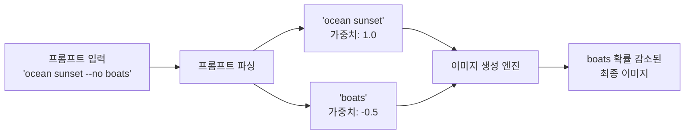
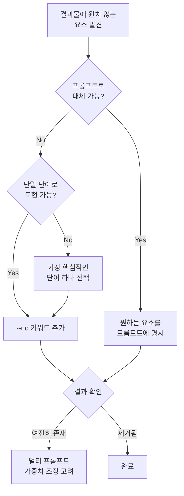
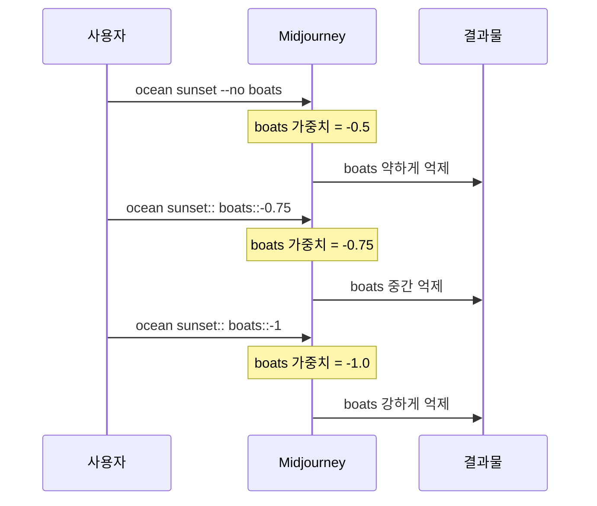

# 네거티브 프롬프트(--no)와 품질 제어

> Midjourney의 --no 파라미터로 원치 않는 요소를 걸러내고, 결과물의 품질을 한 단계 끌어올리는 전략을 배웁니다.

## 개요

지금까지 배운 `--ar`, `--stylize`, `--chaos`가 "어떻게 만들까"를 제어했다면, `--no`는 **"무엇을 빼야 할까"**를 다룹니다. AI 이미지 생성에서 가장 흔한 고충은 "원하는 건 나오는데, 원하지 않는 것도 같이 나온다"는 점입니다. 아무리 프롬프트를 정교하게 써도 AI는 맥락에서 자주 등장하는 요소를 자동으로 추가하는 경향이 있기 때문입니다. `--no` 파라미터는 이 문제를 해결하는 핵심 도구이며, 원하지 않는 것을 정확히 제거하는 능력이 결과물의 완성도를 좌우합니다.

## 핵심 개념

### --no 파라미터의 작동 원리

Midjourney에서 `--no`는 단순히 특정 요소를 차단하는 스위치가 아닙니다. 기술적으로는 **멀티 프롬프트에서 해당 요소의 가중치를 -0.5로 설정**하는 것과 동일하게 작동합니다. 완전히 제거하는 것이 아니라 해당 요소가 등장할 확률을 크게 낮추는 방식입니다.

> 커피숍에서 "아이스 아메리카노 주세요"만으로는 시럽이나 휘핑크림이 따라올 수 있습니다. "시럽 빼고, 휘핑 빼주세요"라고 말해야 정확히 원하는 음료가 나오죠. `--no`가 바로 이 "빼주세요"의 역할입니다.

**기본 문법:**

```
프롬프트 텍스트 --no 제거할요소
```

여러 요소를 제거하려면 쉼표로 구분합니다:

```
vibrant landscape painting --no trees, people, buildings
```



가중치가 -0.5이지 -1.0(완전 제거)이 아니므로, `--no`로 지정한 요소가 **여전히 약하게 등장할 수 있습니다**. 특히 프롬프트 주제와 강하게 연결된 경우(예: "ocean"에 대한 "boats")에는 완전한 제거가 어렵습니다. 이런 경우 뒤에서 다룰 **멀티 프롬프트 가중치 기법**으로 더 강하게 억제할 수 있습니다.

### 효과적인 네거티브 키워드 전략

**원칙 1: 한 번에 하나씩 시작하라** -- 가장 거슬리는 요소 하나만 먼저 `--no`로 제거하고 결과를 확인하세요. 한꺼번에 여러 키워드를 넣으면 어떤 키워드가 효과를 냈는지 알 수 없고, 너무 많은 제한은 오히려 이미지 품질을 떨어뜨립니다.

**원칙 2: 구체적인 단일 단어를 사용하라** -- `--no` 뒤의 모든 단어는 **개별적으로 해석**됩니다. 예를 들어 `--no modern clothing`은 "no modern"과 "no clothing"으로 각각 처리됩니다.

**원칙 3: 제거보다 대체를 먼저 고려하라** -- 인물 사진에서 현대적 옷이 싫다면 `--no modern clothing` 대신 프롬프트에 `wearing traditional hanbok`처럼 원하는 것을 명시하는 게 더 정확합니다.



**용도별 추천 네거티브 키워드:**

| 카테고리 | 자주 쓰는 --no 키워드 | 효과 |
|----------|----------------------|------|
| 품질 개선 | `blur, noise, grain` | 선명도 향상 |
| 사람 제거 | `people, person, crowd` | 풍경/건축 촬영에 유용 |
| 텍스트 제거 | `text, words, letters, watermark` | 깔끔한 이미지 |
| 배경 정리 | `background, clutter` | 주제에 집중 |
| 스타일 제한 | `cartoon, anime, realistic` | 원하지 않는 스타일 억제 |
| 색감 제어 | `saturated, muted, warm, cold` | 특정 색조 억제 |

### 멀티 프롬프트 가중치를 활용한 고급 제거

`--no`의 고정 가중치(-0.5)로 부족할 때, 멀티 프롬프트 문법(`::`)으로 더 강력한 제거가 가능합니다.

```
ocean sunset:: boats::-1
```

`::` 뒤의 숫자가 가중치입니다. `-1`로 설정하면 `--no`의 `-0.5`보다 두 배 강하게 억제합니다.

| 가중치 범위 | 효과 | 사용 시나리오 |
|------------|------|-------------|
| -0.5 (`--no`와 동일) | 약한 억제 | 약하게 연관된 요소 제거 |
| -0.75 | 중간 억제 | 중간 연관도 요소 제거 |
| -1.0 | 강한 억제 | 강하게 연관된 요소 제거 |
| -1.5 이하 | 과도한 억제 | 비추천 -- 이미지 왜곡 위험 |



여러 요소를 각각 다른 강도로 억제하는 고급 조합도 가능합니다:

```
fantasy castle on mountain:: modern buildings::-0.8:: cars::-1:: power lines::-0.7
```

## 실전 프롬프트 예제

### 예제 1: 기본 --no 사용 (Before/After)

**Before** (--no 없이):

```
/imagine elegant perfume bottle on marble table, soft lighting, studio photography --ar 3:4
```


**After** (--no 적용):

```
/imagine elegant perfume bottle on marble table, soft lighting, studio photography --ar 3:4 --no flowers, ribbon, decoration
```


### 예제 2: 풍경에서 사람 제거

```
/imagine serene mountain lake at dawn, misty atmosphere, reflection on water --ar 16:9 --no people, boats, buildings
```


### 예제 3: 제품 사진에서 배경 잡동사니 제거

```
/imagine white sneakers floating on clean white background, studio lighting, product photography --no shadow, props, floor
```


### 예제 4: 텍스트/워터마크 제거 (상업용 기본)

```
/imagine cozy coffee shop interior, warm lighting, rustic wood furniture --ar 16:9 --no text, watermark, logo, sign
```


### 예제 5: 음식 사진 소품 제어

**Before:**

```
/imagine sushi platter, top view, warm lighting, professional food photography --ar 1:1
```


**After:**

```
/imagine sushi platter, top view, warm lighting, professional food photography --ar 1:1 --no chopsticks, sauce, garnish
```


### 예제 6: 판타지 장면에서 현대적 요소 제거

```
/imagine medieval village marketplace, bustling crowd, stone buildings, fantasy setting --ar 16:9 --no cars, electricity, modern
```


### 예제 7: 멀티 프롬프트 가중치 비교

**--no 사용 (약한 억제):**

```
/imagine cozy kitchen interior, morning sunlight --no stove
```

")

**멀티 프롬프트 (강한 억제):**

```
/imagine cozy kitchen interior, morning sunlight:: stove::-1
```


### 예제 8: 멀티 프롬프트 복합 제거

```
/imagine futuristic cityscape at sunset, cinematic:: cars::-1:: billboards::-0.8:: aircraft::-0.7 --ar 16:9
```


### 예제 9: 건축 사진 정리

```
/imagine modern glass building facade, blue sky, architectural photography --ar 9:16 --no cars, people, trees, wires
```


### 예제 10: 스타일 억제

```
/imagine portrait of a warrior, detailed armor, dramatic lighting:: cartoon::-0.8:: anime::-0.8 --ar 2:3
```


## 파라미터 조합 전략

`--no`는 다른 파라미터와 조합할 때 더 강력해집니다. 단계별 워크플로우를 따라가 보세요.

**탐색 단계:** `--chaos 50 --no blur, text`
높은 chaos로 다양한 변형을 탐색하되, 기본 품질 저하 요소는 미리 제거합니다.

**정제 단계:** `--stylize 150 --chaos 5 --no` + 구체적 제거 대상
마음에 드는 방향을 찾은 후, 낮은 chaos로 안정시키면서 특정 요소를 제거합니다.

**최종 생산:** `--ar 16:9 --stylize 100 --chaos 0 --no watermark, text`
상업용 최종 결과물에서는 모든 파라미터를 보수적으로 설정하고, 워터마크나 텍스트만 제거합니다.

## 팁과 주의사항

- `--no`로 지정해도 해당 요소가 100% 사라지지는 않습니다. 확률을 낮추는 것이므로, 강하게 연관된 요소는 프롬프트 자체를 재구성하는 것이 더 효과적입니다.
- `--no` 뒤에 여러 단어 구문을 쓰면 각 단어가 개별 키워드로 해석됩니다. `--no dark background`는 "dark"와 "background" 각각을 억제합니다.
- 네거티브 키워드는 **3~5개 이내**로 유지하세요. 과다 사용 시 Midjourney의 선택 범위가 극도로 좁아져 기이한 결과물이 나올 수 있습니다.
- `--no` 파라미터는 한 프롬프트에 **한 번만** 사용 가능합니다. `--no trees --no people`처럼 두 번 쓰면 마지막 것만 적용됩니다. 반드시 `--no trees, people`처럼 쉼표로 연결하세요.
- 멀티 프롬프트 가중치는 **-1.0을 넘기지 마세요**. 지나친 음수 가중치는 색 반전, 왜곡 등 아티팩트를 유발합니다.
- `--no`와 멀티 프롬프트 가중치를 **같은 요소에 동시 적용하지 마세요**. 가중치가 합산되어 예측 불가능한 결과가 나옵니다.
- 상업 프로젝트에서는 `--no text, watermark, logo`를 기본 포함시키는 습관을 들이세요.
- `--no`로 해결이 안 되는 요소는 **Vary Region**으로 특정 영역만 재생성하는 방법을 활용하세요.

## 핵심 정리

| 개념 | 설명 |
|------|------|
| --no 파라미터 | 원치 않는 요소의 가중치를 -0.5로 낮추어 등장 확률을 감소시키는 파라미터 |
| 기본 문법 | `프롬프트 --no 키워드1, 키워드2` (쉼표 구분, 한 번만 사용) |
| 단어 개별 해석 | --no 뒤의 각 단어는 개별 키워드로 처리됨. 구문 단위 제거 불가 |
| 네거티브 키워드 전략 | 한 번에 하나씩, 구체적 단일 단어, 제거보다 대체 우선 |
| 적정 키워드 수 | 3~5개 이내 권장. 과다 사용 시 이미지 품질 저하 |
| 멀티 프롬프트 대안 | `요소::-1` 문법으로 -0.5보다 강한 억제 가능 (-1.0 이하 비추천) |
| 상업용 기본 세트 | `--no text, watermark, logo`를 기본 포함 추천 |
| 깔때기 전략 연동 | 탐색 -> 정제 -> 최종 단계별로 --no 키워드 점진적 추가 |

## 다음 섹션 미리보기

다음 섹션에서는 `--ar`, `--stylize`, `--chaos`, `--no`를 **하나의 통합 워크플로우**로 묶어, Remix 모드와 Variation 기능까지 결합한 실전 생산 파이프라인을 완성합니다. 특히 이 섹션에서 배운 멀티 프롬프트 가중치 기법이 Remix 모드와 결합되면 어떤 시너지가 나는지 실전 사례로 확인합니다.
