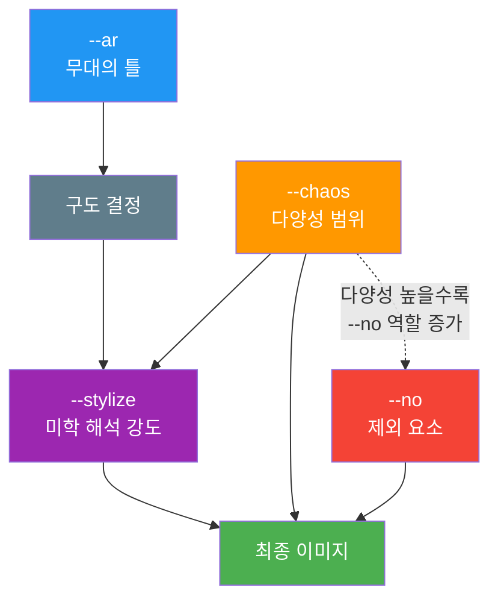
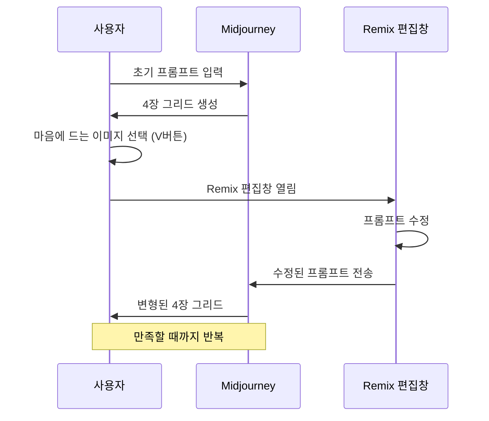

# 파라미터 조합과 Remix·Variation 활용

> 개별 파라미터를 넘어, 조합과 반복 워크플로우로 원하는 이미지를 정밀하게 완성하는 통합 가이드

## 개요

Ch5에서 배운 --ar, --stylize, --chaos, --no를 동시에 조합하면 개별 파라미터와는 전혀 다른 시너지가 발생합니다. 여기에 Remix 모드와 Variation을 더하면 한 장의 이미지에서 출발해 점진적으로 최적의 결과를 찾아가는 체계적인 반복 워크플로우를 설계할 수 있습니다.

## 파라미터 상호작용 원리

파라미터를 조합할 때 핵심은 **파라미터 간 상호작용**입니다. 각 파라미터는 독립적으로 작동하지 않고, 서로의 효과를 증폭하거나 상쇄합니다.

| 조합 | 시너지 효과 | 실무 활용 |
|------|-----------|----------|
| --ar + --stylize | 종횡비가 구도를 결정, stylize가 그 안에서 미학 강도 조절 | 인스타그램 포스트(1:1, --s 200) |
| --stylize + --chaos | stylize가 미학의 중심을 잡고, chaos가 벗어나는 범위 결정 | 무드보드 탐색(--s 300 --c 50) |
| --chaos + --no | chaos가 높으면 의도치 않은 요소 증가, --no로 제어 | 자유 탐색 + 안전장치(--c 70 --no text) |
| --ar + --no | 특정 종횡비에서 자주 등장하는 기본 요소 제거 | 와이드(16:9)에서 검은 바 제거 |



**권장 작성 순서**: `프롬프트 본문 --ar 비율 --s 값 --c 값 --no 제외어 --seed 값` (무대 → 미학 → 다양성 → 제거 → 재현)

## 용도별 파라미터 프리셋

| 용도 | 프리셋 |
|------|--------|
| 인스타그램 피드 | `--ar 1:1 --s 150 --c 10 --no text, watermark` |
| 인스타그램 스토리 | `--ar 9:16 --s 200 --c 15` |
| YouTube 썸네일 | `--ar 16:9 --s 250 --c 5 --no blurry` |
| 로고 컨셉 | `--ar 1:1 --s 50 --c 20 --no realistic, photo` |
| 패키지 디자인 | `--ar 3:4 --s 200 --c 10 --no text` |
| 웹 히어로 이미지 | `--ar 16:9 --s 300 --c 5` |
| 초기 무드보드 | `--ar 1:1 --s 300 --c 80` |
| 스타일 탐색 | `--ar 1:1 --s 500 --c 60` |

프리셋 적용 예시:

```
a minimalist coffee shop interior, scandinavian design, morning light --ar 1:1 --s 150 --c 10 --no text, watermark
```

으로 생성한 카페 인테리어")

```
futuristic vehicle concept art, metallic surface, dramatic studio lighting --ar 16:9 --s 300 --c 5
```

으로 생성한 컨셉 아트")

## Remix 모드 — 이미지를 대화하듯 다듬기

Remix 모드를 활성화하면 Variation 버튼(V1~V4)을 누를 때 프롬프트 편집 창이 열립니다. 원본의 구도와 분위기를 유지하면서 프롬프트, 스타일, 파라미터를 직접 수정할 수 있습니다.

**활성화**: Settings > Remix Mode ON (Discord: `/prefer remix`)

**Remix로 변경 가능한 것**: 프롬프트 텍스트, 파라미터 값, 스타일 전환, 요소 추가/제거



### 4단계 Remix 워크플로우 실습

Remix의 핵심 전략은 **점진적 빌딩** — 한 번에 하나의 요소만 바꾸며 쌓아가는 것입니다. 실제 프롬프트로 시연합니다.

**1단계 — 기본 장면 확립:**

```
a cozy japanese cafe interior, wooden furniture, plants on shelves
```


**2단계 (Remix) — 조명과 분위기 추가:**

```
a cozy japanese cafe interior, wooden furniture, plants on shelves, golden hour sunlight streaming through large windows, warm atmosphere
```


**3단계 (Remix) — 스타일 적용:**

```
a cozy japanese cafe interior, wooden furniture, plants on shelves, golden hour sunlight streaming through large windows, warm atmosphere, studio ghibli animation style, soft watercolor textures
```


**4단계 (Remix) — 파라미터 최적화:**

```
a cozy japanese cafe interior, wooden furniture, plants on shelves, golden hour sunlight streaming through large windows, warm atmosphere, studio ghibli animation style, soft watercolor textures --ar 16:9 --s 350 --no text, realistic
```


> **팁**: Remix에서 프롬프트를 대폭 수정하면 시각적 일관성이 깨질 수 있습니다. 급격한 변경이 필요하다면 차라리 새 프롬프트로 시작하는 것이 더 효율적입니다.

## Variation 전략 — Subtle, Strong, Region

이미지를 U 버튼으로 분리한 뒤, 세 가지 Variation 옵션을 선택할 수 있습니다.

| 유형 | 변화 범위 | 용도 | 사용 시점 |
|------|----------|------|----------|
| **Vary Subtle** | 5~15% | 색조, 질감, 미세 디테일 조정 | 거의 완성된 이미지에서 최적 버전 탐색 |
| **Vary Strong** | 30~60% | 구성 요소 재배치, 색 배합 변경 | 방향은 맞지만 다른 가능성 탐색 |
| **Vary Region** | 선택 영역만 | 특정 부분만 변형, 나머지 유지 | 배경은 좋은데 특정 요소만 교체 |

**Variation 활용 예시** — Vary Strong으로 대안 탐색 후 Vary Region으로 부분 수정:

```
cyberpunk street market at night, neon signs in korean, rain-soaked pavement, cinematic --ar 16:9 --s 200
```


> **Remix + Variation 조합**: Remix 모드가 켜진 상태에서 Variation을 사용하면, 변형 정도(Subtle/Strong)를 제어하면서 동시에 프롬프트까지 수정할 수 있습니다. 이것이 Midjourney에서 가장 강력한 이미지 제어 방법입니다.

## 보조 파라미터 — --seed, --repeat, --weird

| 파라미터 | 기능 | 핵심 활용 |
|---------|------|----------|
| `--seed 값` | 생성 출발점 고정 (0~4294967295) | 시드 고정 후 --s 값만 변경하면 stylize 효과만 순수 비교 가능 |
| `--repeat N` (`--r`) | 동일 프롬프트 N회 반복 (Fast/Turbo 전용) | `--c 50 --r 4`로 16장 한 번에 생성, 초기 탐색에 강력 |
| `--weird 값` (`--w`) | 기이함 추가 | 실험적 아트에 적합, 상업용은 0~100 권장 |

시드를 활용한 파라미터 비교 실험:

```
portrait of an elderly craftsman in workshop, dramatic side lighting --seed 42 --s 50
```


```
portrait of an elderly craftsman in workshop, dramatic side lighting --seed 42 --s 500
```


> **팁**: 시드의 영향력은 제한적입니다. 모델 버전이나 파라미터가 조금만 달라져도 결과가 크게 변할 수 있으므로, "정확한 재현 도구"가 아닌 "비슷한 방향의 출발점"으로 이해하세요.

## 팁과 주의사항

- 파라미터를 많이 넣을수록 좋은 것이 아닙니다. 핵심 2~3개에 집중하고 나머지는 기본값으로 두세요.
- `--repeat`와 `--chaos`를 함께 사용하면 초기 탐색이 강력합니다. `--c 60 --r 3`으로 12장을 한 번에 얻은 뒤 Remix로 정제하는 것이 "깔때기 전략"의 정석입니다.
- 프리셋은 메모장이나 노션에 저장해두세요. 외부에 정리해두고 복사-붙여넣기하는 것이 가장 빠릅니다.
- Remix에서 한 번에 하나만 바꾸는 원칙을 지키세요. 스타일과 조명을 동시에 바꾸면 어떤 변경이 효과를 낸 건지 판단하기 어렵습니다.

## 핵심 정리

| 개념 | 설명 |
|------|------|
| 파라미터 상호작용 | --ar → --stylize → --chaos → --no 순으로 효과 중첩 |
| 프리셋 | 프로젝트 유형별 파라미터 조합을 미리 저장해 효율 극대화 |
| Remix 모드 | Variation 시 프롬프트 수정 가능. 점진적 빌딩의 핵심 |
| Vary Subtle/Strong/Region | 미세 변형(5~15%) / 강한 변형(30~60%) / 선택 영역만 변형 |
| --seed, --repeat, --weird | 재현 출발점 / 대량 탐색 / 기이함 추가 |
| 깔때기 전략 | chaos+repeat → 선택 → Remix → Vary Subtle로 정제 |

## 실전 프로젝트: 블룸 베이커리 브랜드 이미지 제작

Remix와 파라미터 조합을 활용해 하나의 프롬프트에서 멀티 플랫폼 에셋까지 완성합니다.

**프로젝트 브리프:**

| 항목 | 내용 |
|------|------|
| **브랜드** | 블룸 베이커리(Bloom Bakery) — 꽃과 빵이 어우러진 동네 베이커리 |
| **캠페인** | "오늘의 꽃빵" 봄 시즌 프로모션 |
| **톤앤매너** | 따뜻한 자연광, 파스텔톤, 정성스러운 수공예 느낌 |
| **납품물** | 인스타그램 피드 1장, 스토리 1장, YouTube 썸네일 1장 |

### Step 1: 초기 탐색 — chaos + repeat로 방향 잡기

```
artisan bakery with fresh flower arrangements, morning sunlight, rustic wooden shelves, pastel color palette --ar 1:1 --s 200 --c 60 --r 3
```


12장 중 최적의 이미지를 선택합니다.

### Step 2: Remix로 디테일 추가

V 버튼 → Remix 편집창에서 디테일을 추가합니다:

```
artisan bakery with fresh flower arrangements, morning sunlight streaming through vintage windows, rustic wooden shelves lined with sourdough loaves and dried lavender, pastel color palette, soft film photography --ar 1:1 --s 250 --c 10 --no text, watermark
```


### Step 3: Vary Subtle로 최적 버전 선정

U 버튼으로 분리 후 **Vary Subtle**을 2~3회 실행하여 미세한 색감, 질감 차이를 비교합니다.


### Step 4: Remix로 인스타그램 스토리 변환

Remix로 종횡비와 구도를 스토리용으로 변환합니다:

```
artisan bakery with fresh flower arrangements, morning sunlight streaming through vintage windows, rustic wooden shelves lined with sourdough loaves and dried lavender, pastel color palette, soft film photography, vertical composition with top space for text overlay --ar 9:16 --s 250 --c 5 --no text, watermark
```


### Step 5: Remix로 YouTube 썸네일 변환

다시 Remix로 와이드 비율과 강한 스타일을 적용합니다:

```
artisan bakery with fresh flower arrangements, dramatic morning sunlight, rustic wooden shelves lined with sourdough loaves and dried lavender, warm pastel color palette, cinematic wide shot, high contrast --ar 16:9 --s 350 --c 5 --no text, watermark, blurry
```


### Step 6: Vary Region으로 최종 보정

썸네일 좌측 빈 공간에 빵 클로즈업을 추가하려면 Vary Region으로 해당 영역만 선택:

```
close-up of freshly baked croissant with golden crust, flour dusting
```


**최종 납품물 요약:**

| 플랫폼 | 비율 | 핵심 파라미터 | 생성 경로 |
|--------|------|-------------|----------|
| 인스타그램 피드 | 1:1 | --s 250 --c 10 | 탐색 → Remix → Vary Subtle |
| 인스타그램 스토리 | 9:16 | --s 250 --c 5 | 피드 이미지 → Remix 비율 변환 |
| YouTube 썸네일 | 16:9 | --s 350 --c 5 | 피드 이미지 → Remix 비율+스타일 → Vary Region |

다음 챕터 [Ch6. 이미지 편집 기법](06-ch6-이미지-편집-기법-img2img인페인팅아웃페인팅/01-01-img2img-이미지-기반-변환의-원리.md)에서는 img2img, 인페인팅, 아웃페인팅 등 플랫폼을 넘나드는 본격적인 이미지 편집의 세계로 확장합니다.
