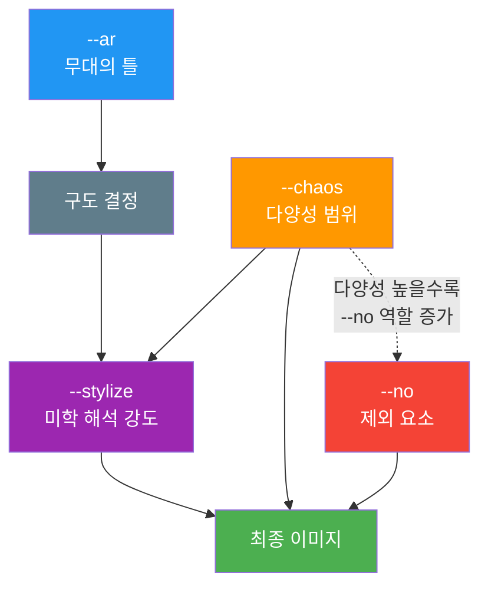
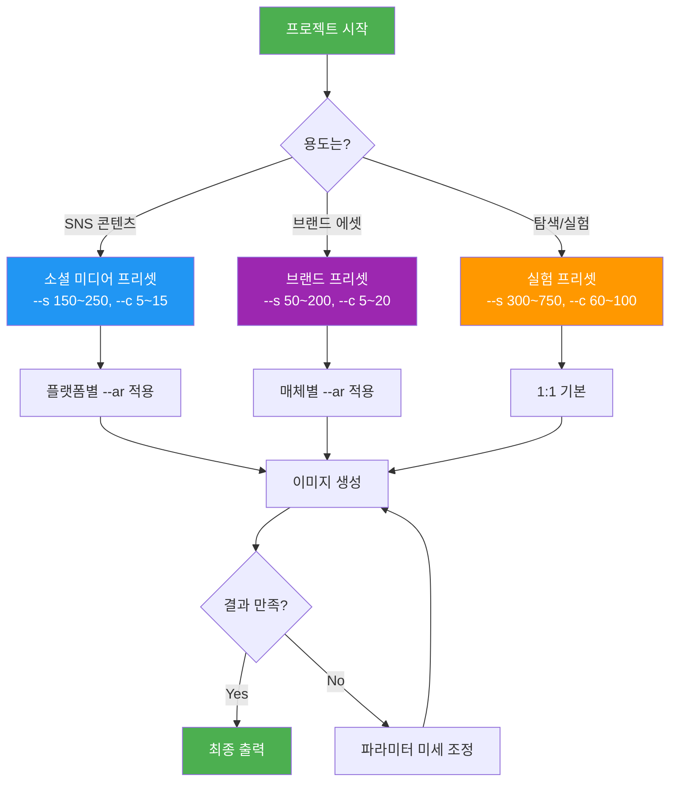
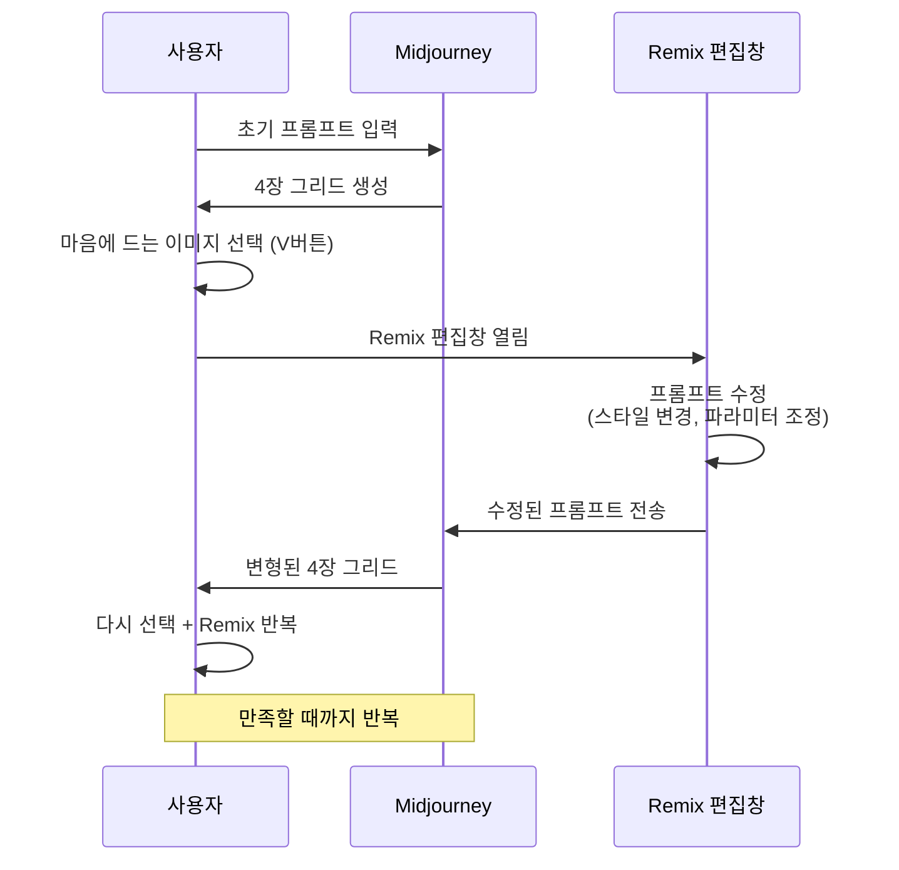
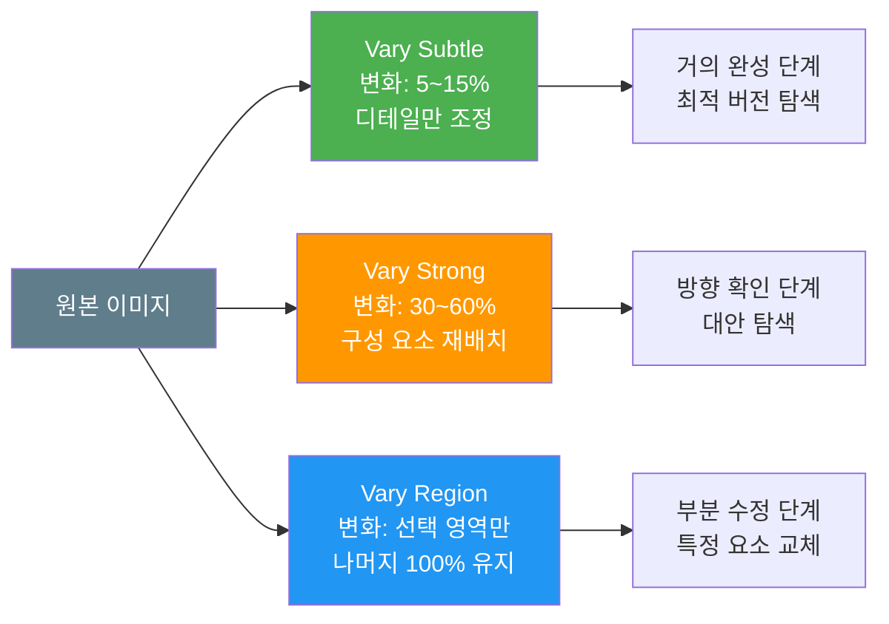
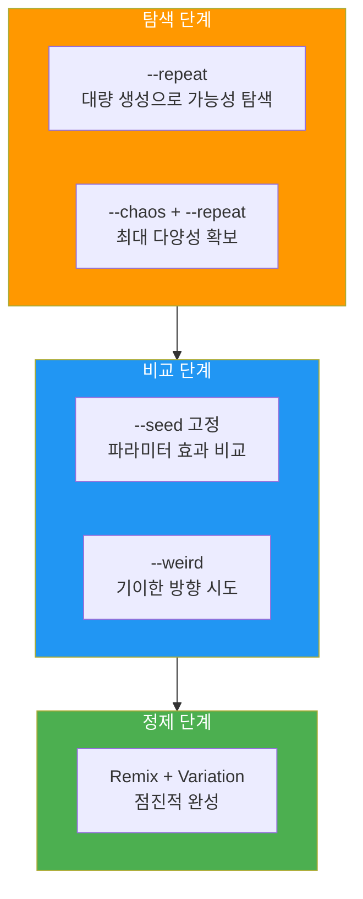

# 파라미터 조합과 Remix·Variation 활용

> 개별 파라미터를 넘어, 조합의 시너지로 원하는 이미지를 정밀하게 빚어내는 통합 워크플로우

## 개요

이 섹션에서는 Ch5 전체를 관통하며 배운 모든 파라미터를 하나로 엮습니다. 개별 파라미터의 효과를 이해하는 것과, 여러 파라미터를 동시에 조합하여 시너지를 만드는 것은 전혀 다른 차원의 기술인데요. 여기에 Remix 모드와 Variation 기능까지 더하면, 한 장의 이미지를 출발점으로 무한히 가지치기하며 최적의 결과를 찾아가는 **반복 워크플로우**를 설계할 수 있습니다.

**선수 지식**: [--ar 파라미터](05-ch5-midjourney-기본과-파라미터-튜닝/02-02-종횡비--ar와-구도-제어.md), [--stylize 파라미터](05-ch5-midjourney-기본과-파라미터-튜닝/03-03-스타일라이즈--stylize와-미학-제어.md), [--chaos 파라미터](05-ch5-midjourney-기본과-파라미터-튜닝/04-04-카오스--chaos와-다양성-탐색.md), [--no 파라미터](05-ch5-midjourney-기본과-파라미터-튜닝/05-05-네거티브-프롬프트--no와-품질-제어.md)

**학습 목표**:
- 여러 파라미터를 동시에 사용할 때의 상호작용 원리를 이해한다
- Remix 모드로 프롬프트를 수정하며 이미지를 점진적으로 발전시킬 수 있다
- Vary Subtle/Strong/Region을 상황에 맞게 사용할 수 있다
- --seed, --repeat 등 보조 파라미터로 워크플로우 효율을 높일 수 있다
- 기획부터 최종 출력까지 체계적인 반복 워크플로우를 설계할 수 있다

## 왜 알아야 할까?

요리에 비유해볼까요? 소금, 후추, 올리브오일, 레몬즙을 각각 아는 것과, 이 재료들을 **어떤 순서로, 어떤 비율로** 넣어야 완성된 요리가 되는지 아는 것은 완전히 다릅니다. 지금까지 우리는 개별 양념의 특성을 배웠고, 이제 드디어 **레시피를 짜는 법**을 배울 차례입니다.

실무에서 AI 이미지를 사용할 때, 한 번에 완벽한 결과가 나오는 경우는 거의 없습니다. "방향은 좋은데 분위기가 다르다", "구도는 맞는데 색감이 아쉽다" — 이런 미세한 조정이 필요한 순간에 Remix와 Variation이 빛을 발하거든요. 파라미터 조합과 반복 워크플로우를 마스터하면, **우연에 기대던 이미지 생성이 체계적인 크리에이티브 프로세스**로 바뀝니다.

## 핵심 개념

### 개념 1: 파라미터 상호작용 — 오케스트라의 악기처럼

> 💡 **비유**: 파라미터 조합은 오케스트라 연주와 같습니다. 바이올린(--ar)이 무대의 틀을 잡고, 첼로(--stylize)가 감성의 깊이를 더하며, 타악기(--chaos)가 예측 불가능한 리듬을 만들고, 지휘자(--no)가 불필요한 소리를 통제합니다. 각 악기가 따로 연습하는 것과 합주하는 것은 완전히 다른 차원이죠.

파라미터를 조합할 때 가장 중요한 원리는 **파라미터 간 상호작용**입니다. 각 파라미터는 독립적으로 작동하지 않고, 서로의 효과를 증폭하거나 상쇄합니다.

**핵심 조합 매트릭스:**

| 조합 | 시너지 효과 | 실무 활용 |
|------|-----------|----------|
| --ar + --stylize | 종횡비가 구도를 결정하고, stylize가 그 구도 안에서 미학적 해석 강도를 조절 | 인스타그램 포스트(1:1, --s 200) |
| --stylize + --chaos | stylize가 미학의 "중심"을 잡고, chaos가 그 중심에서 얼마나 벗어날지 결정 | 무드보드 탐색(--s 300 --c 50) |
| --chaos + --no | chaos가 다양성을 높이면 의도치 않은 요소 등장 확률 증가, --no로 이를 제어 | 자유로운 탐색 + 안전장치(--c 70 --no text) |
| --ar + --no | 특정 종횡비에서 자주 등장하는 기본 구성 요소를 제거 | 와이드(16:9)에서 검은 바 제거 |

> 📊 **그림 1**: 4대 파라미터의 상호작용 구조



**파라미터 작성 순서**: Midjourney는 파라미터의 **작성 순서에 상관없이** 동일하게 처리합니다. 하지만 가독성과 관리를 위해 일관된 순서를 유지하는 것이 좋은데요. 추천하는 순서는 다음과 같습니다:

```
프롬프트 본문 --ar 비율 --s 값 --c 값 --no 제외어 --seed 값
```

이 순서는 "무대 → 미학 → 다양성 → 제거 → 재현"이라는 논리적 흐름을 따릅니다.

### 개념 2: 용도별 파라미터 프리셋 — 나만의 레시피 카드

> 💡 **비유**: 카페 바리스타가 "아메리카노", "카페라떼", "바닐라라떼"처럼 정해진 레시피를 갖고 있듯이, Midjourney 작업에서도 프로젝트 유형별로 미리 정해둔 파라미터 조합 — **프리셋**을 만들어두면 효율이 크게 올라갑니다.

실무에서 자주 사용되는 프리셋을 상황별로 정리하면 다음과 같습니다:

**소셜 미디어 콘텐츠 프리셋**
- 인스타그램 피드: `--ar 1:1 --s 150 --c 10 --no text, watermark`
- 인스타그램 스토리/릴스: `--ar 9:16 --s 200 --c 15`
- YouTube 썸네일: `--ar 16:9 --s 250 --c 5 --no blurry`
- 링크드인 배너: `--ar 4:1 --s 100 --c 5`

**브랜드 디자인 프리셋**
- 로고 컨셉: `--ar 1:1 --s 50 --c 20 --no realistic, photo`
- 패키지 디자인: `--ar 3:4 --s 200 --c 10 --no text`
- 웹 히어로 이미지: `--ar 16:9 --s 300 --c 5`

**탐색·실험 프리셋**
- 초기 무드보드: `--ar 1:1 --s 300 --c 80`
- 스타일 탐색: `--ar 1:1 --s 500 --c 60`
- 예상 밖의 영감: `--ar 1:1 --s 750 --c 100`

> 📊 **그림 2**: 프로젝트 유형별 파라미터 프리셋 선택 흐름



> 🔥 **실무 팁**: 프리셋을 메모장이나 노션에 저장해두세요. Midjourney 웹 인터페이스에서는 자주 쓰는 세팅을 저장하는 기능이 제한적이기 때문에, 외부에 정리해두고 복사-붙여넣기하는 것이 가장 빠릅니다.

### 개념 3: Remix 모드 — 이미지를 대화하듯 다듬기

> 💡 **비유**: Remix는 도자기 물레 위의 작품을 돌려가며 조금씩 형태를 바꾸는 것과 같습니다. 처음부터 새 흙덩이를 올리는 게 아니라, 이미 만들어진 형태를 유지하면서 세부를 다듬어가는 거죠. 프롬프트를 통째로 바꿔도 원본의 구도와 분위기가 어느 정도 남아 있기 때문에, 점진적인 변화가 가능합니다.

**Remix 모드란?**

Remix 모드를 활성화하면, Variation 버튼(V1~V4)을 누를 때 프롬프트 편집 창이 나타납니다. 일반 Variation은 원본 프롬프트를 그대로 유지한 채 AI가 자동으로 변형하지만, Remix에서는 **프롬프트를 직접 수정**할 수 있습니다. 스타일을 바꾸거나, 새로운 요소를 추가하거나, 파라미터를 조정할 수 있죠.

**Remix 활성화 방법:**
1. 웹 인터페이스: Settings에서 Remix Mode 토글 ON
2. Discord: `/settings` 입력 후 Remix Mode 버튼 클릭
3. Discord: `/prefer remix` 명령으로 빠르게 전환

**Remix로 할 수 있는 변경:**
- 프롬프트 텍스트 전체 수정 (주제, 스타일, 분위기 등)
- 파라미터 변경 (--ar, --s, --c 등)
- 요소 추가 또는 제거
- 스타일 전환 (예: 수채화 → 유화)

> 📊 **그림 3**: Remix 모드의 반복 워크플로우



**Remix 활용의 핵심 전략 — 점진적 빌딩(Incremental Building):**

한 번에 복잡한 프롬프트를 입력하는 대신, 단계별로 요소를 쌓아가는 방법입니다. 예를 들어:

| 단계 | 프롬프트 | 목적 |
|------|---------|------|
| 1단계 | `a cozy cafe interior` | 기본 장면 확립 |
| 2단계 (Remix) | `a cozy cafe interior, morning sunlight through windows` | 조명 추가 |
| 3단계 (Remix) | `a cozy cafe interior, morning sunlight through windows, watercolor illustration style` | 스타일 적용 |
| 4단계 (Remix) | 위 + `--ar 16:9 --s 300` | 파라미터 최적화 |

이 방법이 효과적인 이유는, AI가 이전 생성 결과의 구도와 분위기를 참조하면서 새로운 요소를 자연스럽게 녹여내기 때문입니다. 처음부터 모든 요소를 한 줄에 넣으면 AI가 우선순위를 혼동할 수 있지만, 점진적으로 쌓으면 각 요소가 제자리를 잡을 가능성이 높아집니다.

> ⚠️ **흔한 오해**: "Remix에서 프롬프트를 완전히 바꾸면 전혀 다른 이미지가 나온다"고 생각하기 쉽지만, 실제로는 원본 이미지의 구도와 색감이 상당 부분 유지됩니다. 다만, 너무 급격한 변경은 시각적 일관성을 깨뜨릴 수 있으므로, **한 번에 하나의 요소만 바꾸는 것**이 안전합니다.

### 개념 4: Variation 전략 — Subtle, Strong, Region의 삼각 편대

> 💡 **비유**: 사진 편집에 비유하면, Vary Subtle은 밝기와 대비를 살짝 조정하는 것이고, Vary Strong은 필터를 바꾸는 것이며, Vary Region은 특정 부분만 포토샵으로 수정하는 것입니다. 세 도구의 특성을 알면, 상황에 따라 가장 효율적인 도구를 고를 수 있죠.

이미지를 4장 그리드에서 분리(U 버튼)한 뒤, 세 가지 Variation 옵션이 나타납니다:

**Vary Subtle (미세 변형)**
- 원본과 매우 유사한 변형 생성
- 색조, 질감, 미세한 디테일만 변화
- **활용**: 거의 완성된 이미지에서 최적의 버전을 찾을 때

**Vary Strong (강한 변형)**
- 전체 주제와 분위기는 유지하되, 구성 요소가 상당히 달라짐
- 포즈, 배경 요소, 색 배합이 크게 변할 수 있음
- **활용**: 방향은 맞지만 다른 가능성을 더 보고 싶을 때

**Vary Region (영역 변형)**
- 이미지의 특정 부분만 선택하여 변형
- 선택하지 않은 영역은 완벽하게 유지
- 선택 영역에 새 프롬프트를 적용할 수 있음 (Remix 활성화 시)
- **활용**: 배경은 좋은데 인물의 표정만 바꾸고 싶을 때, 특정 소품만 교체할 때

> 📊 **그림 4**: Variation 세 유형의 변화 범위 비교



**Variation + Remix 조합의 위력:**

Remix 모드가 켜진 상태에서 Variation을 사용하면, 변형의 정도를 Subtle/Strong으로 제어하면서 동시에 프롬프트까지 수정할 수 있습니다. 이것이 Midjourney에서 가장 강력한 이미지 제어 방법입니다.

### 개념 5: 보조 파라미터 — --seed, --repeat, --weird

앞서 배운 4대 파라미터 외에도, 워크플로우 효율을 높여주는 보조 파라미터들이 있습니다.

**--seed (시드): 재현의 열쇠**

시드는 이미지 생성의 출발점이 되는 숫자값(0~4294967295)입니다. 같은 프롬프트와 같은 시드를 사용하면, 유사한(완벽히 동일하지는 않은) 결과를 얻을 수 있습니다.

- **활용 1**: 파라미터 비교 실험 — 시드를 고정하고 --stylize 값만 바꾸면, stylize의 순수한 효과를 비교할 수 있음
- **활용 2**: 마음에 든 결과 재현 — 좋은 결과의 시드를 확인하여 비슷한 분위기의 이미지를 추가 생성

> 💡 **알고 계셨나요?**: 시드가 이미지에 미치는 영향은 실제로는 상당히 제한적입니다. 프롬프트, 모델 버전, 파라미터 중 하나라도 바뀌면 결과가 크게 달라질 수 있어요. 시드는 "고정 변수"라기보다 "출발점의 힌트" 정도로 이해하는 것이 정확합니다.

**--repeat (--r): 대량 탐색의 도구**

같은 프롬프트를 여러 번 반복 실행합니다. `--r 4`를 넣으면 동일 프롬프트로 4번 생성하여 총 16장(4장 × 4회)을 한 번에 얻을 수 있습니다.

- Fast/Turbo 모드에서만 사용 가능
- 초기 방향 탐색에 유용: `--c 50 --r 4`로 다양한 가능성을 한꺼번에 확인

**--weird (--w): 의도된 기이함**

결과에 예상 밖의 기묘한 요소를 추가합니다. --chaos가 "다양성"을 높인다면, --weird는 "기이함"을 높입니다.

- 값이 높을수록 비현실적이고 초현실적인 결과
- 아트 프로젝트, 실험적 비주얼에 적합
- 상업용 작업에서는 낮은 값(0~100)을 권장

> 📊 **그림 5**: 보조 파라미터의 역할과 워크플로우 내 위치



## 실습: 적용해보기

### 활동 1: 파라미터 프리셋 설계

아래 시나리오 각각에 대해, 최적의 파라미터 조합을 설계해보세요.

| 시나리오 | --ar | --s | --c | --no | 이유 |
|---------|------|-----|-----|------|------|
| 카페 브랜드 인스타그램 피드 이미지 | ? | ? | ? | ? | |
| 뮤직 앨범 커버 (실험적 느낌) | ? | ? | ? | ? | |
| 부동산 매물 소개 이미지 (사실적) | ? | ? | ? | ? | |
| 어린이 동화책 일러스트레이션 | ? | ? | ? | ? | |

**참고 가이드:**
- 브랜드 일관성이 중요하면 → --c 낮게, --s 중간
- 실험적 느낌이라면 → --c 높게, --s 높게 또는 매우 낮게
- 사실적이어야 하면 → --s 낮게(50 이하), --c 0~10
- 일러스트라면 → --s 200~400, 스타일 키워드 병행

### 활동 2: Remix 점진적 빌딩 워크플로우 설계

다음 최종 목표를 달성하기 위한 4단계 Remix 워크플로우를 설계해보세요.

**최종 목표**: "비 오는 도쿄 골목, 네온사인 불빛이 젖은 바닥에 반사되는, 신해성(Makoto Shinkai) 스타일 일러스트레이션, 16:9 시네마틱"

| 단계 | 프롬프트 | 변경 의도 |
|------|---------|----------|
| 1단계 (기본) | | 기본 장면 확립 |
| 2단계 (Remix) | | 분위기/조명 추가 |
| 3단계 (Remix) | | 스타일 적용 |
| 4단계 (Remix) | | 파라미터 최적화 |

**핵심 원칙**: 한 단계에서 한 가지만 변경합니다. 장면 → 분위기 → 스타일 → 파라미터 순서로 쌓아올리세요.

### 활동 3: Variation 의사결정 트리

아래 상황에서 어떤 Variation 옵션을 선택할지 판단하고 이유를 적어보세요.

1. 배경 산의 모양이 살짝 아쉽지만, 전체적으로 95% 만족스러운 풍경화 → **( ) Subtle / Strong / Region**
2. 인물의 포즈는 좋은데, 배경을 실내에서 야외로 바꾸고 싶다 → **( ) Subtle / Strong / Region**
3. 전체 분위기는 좋지만, 색감을 따뜻한 톤에서 차가운 톤으로 바꾸고 싶다 → **( ) Subtle / Strong / Region + Remix**
4. 이미지가 마음에 들지만, 왼쪽 하단 구석에 있는 불필요한 물체를 제거하고 싶다 → **( ) Subtle / Strong / Region**

## 더 깊이 알아보기

### Remix 모드의 탄생 스토리

Midjourney의 Remix 모드는 2022년 11월, V4 알고리즘 공개 테스트와 함께 등장했습니다. 당시 AI 이미지 생성은 "한 번 생성하면 끝"이라는 한계가 있었는데요. 사용자들이 "이 이미지에서 조금만 바꾸고 싶은데, 처음부터 다시 해야 하나?"라는 불만을 쏟아냈고, Midjourney 팀은 이에 대한 답으로 Remix를 내놓았습니다.

출시 직후, 텔레그램 채널 @strangedalle에서 Remix로 두 이미지를 합성한 7장의 이미지 시리즈가 이틀 만에 5만 뷰를 돌파하며 화제가 되었습니다. 사람들은 한 이미지에서 다른 이미지로 자연스럽게 변형되는 과정에 매료되었죠.

흥미로운 점은, 초기 V3에서의 Remix가 오히려 V4보다 더 유연하게 작동했다는 사용자 보고입니다. V3에서는 97단계 이상의 연속 변형도 가능했지만, V4에서는 종종 "막다른 길"에 다다르는 현상이 보고되었거든요. 이후 V5, V6를 거치며 Remix 엔진이 대폭 개선되었고, 2025년 V7에서는 웹 인터페이스에서 시각적으로 파라미터를 조정할 수 있는 모달 토글까지 추가되어, Remix의 접근성과 정밀도가 한 단계 더 올라갔습니다.

### 왜 "반복"이 창의성의 핵심인가

"첫 번째 시도에서 완벽한 결과를 만들어야 한다"는 생각은 AI 이미지 생성에서 가장 위험한 함정입니다. 실제로 프로 크리에이터들의 워크플로우를 보면, 하나의 최종 이미지를 위해 평균 15~30번의 반복 생성을 거칩니다. Remix, Variation, 파라미터 조정을 반복하면서 점진적으로 비전에 가까워지는 것이 정상적인 프로세스입니다.

이는 전통적인 디자인 프로세스와 정확히 일치합니다. 스케치 → 러프 → 컬러 스터디 → 정밀 렌더링으로 이어지는 단계적 완성 과정이, AI에서는 초기 생성 → Chaos 탐색 → Remix 정제 → Vary Subtle 마무리로 대응되는 셈이죠.

## 흔한 오해와 팁

> ⚠️ **흔한 오해**: "파라미터를 많이 넣을수록 좋은 결과가 나온다"고 생각하기 쉽지만, 실제로는 정반대입니다. 파라미터가 많아질수록 AI가 처리해야 할 조건이 늘어나 예상치 못한 충돌이 발생할 수 있습니다. 핵심 파라미터 2~3개에 집중하고, 나머지는 기본값으로 두는 것이 더 좋은 결과를 낳는 경우가 많습니다.

> 💡 **알고 계셨나요?**: Midjourney에서 시드(--seed)의 영향력은 생각보다 약합니다. 같은 시드를 사용해도 모델 버전이 바뀌거나 파라미터가 조금만 달라지면 완전히 다른 결과가 나올 수 있습니다. 시드는 "정확한 재현 도구"가 아니라 "비슷한 방향의 출발점"이라고 이해하는 것이 맞습니다.

> 🔥 **실무 팁**: Remix에서 프롬프트를 대폭 수정하면 시각적 일관성이 깨질 수 있습니다. "한 번에 하나만 바꾼다"는 원칙을 지키세요. 스타일을 바꿀 때는 스타일만, 조명을 바꿀 때는 조명만 수정하는 것이 안전합니다. 급격한 변경이 필요하다면 차라리 새 프롬프트로 시작하는 것이 더 효율적일 수 있습니다.

> 🔥 **실무 팁**: `--repeat`와 `--chaos`를 함께 사용하면 초기 탐색 단계에서 매우 강력합니다. 예를 들어 `--c 60 --r 3`으로 총 12장의 다양한 결과를 한 번에 얻은 뒤, 마음에 드는 것을 골라 Remix로 정제하는 것이 "깔때기 전략"의 정석입니다. [앞서 배운 깔때기 전략](05-ch5-midjourney-기본과-파라미터-튜닝/04-04-카오스--chaos와-다양성-탐색.md)의 실전 적용이죠.

## 핵심 정리

| 개념 | 설명 |
|------|------|
| 파라미터 상호작용 | --ar(틀) → --stylize(미학) → --chaos(다양성) → --no(제거) 순으로 효과가 중첩 |
| 파라미터 프리셋 | 프로젝트 유형별로 미리 정해둔 파라미터 조합. 작업 효율 극대화 |
| Remix 모드 | Variation 시 프롬프트를 수정할 수 있는 모드. 점진적 빌딩에 핵심 |
| 점진적 빌딩 | 한 번에 하나의 요소만 추가/변경하며 복잡한 이미지를 단계적으로 완성 |
| Vary Subtle | 5~15% 미세 변형. 거의 완성된 이미지의 최적 버전 탐색 |
| Vary Strong | 30~60% 강한 변형. 같은 방향에서 다른 가능성 탐색 |
| Vary Region | 선택 영역만 변형. 부분 수정에 최적 |
| --seed | 생성 출발점 고정. 파라미터 비교 실험에 유용 (재현력은 제한적) |
| --repeat | 동일 프롬프트 반복 실행. 대량 탐색에 효율적 (Fast/Turbo 전용) |
| --weird | 기이함 추가. 실험적 아트에 적합 |
| 깔때기 전략 실전 | chaos 높게 + repeat → 선택 → Remix → Vary Subtle로 정제 |

## 다음 섹션 미리보기

Ch5에서 Midjourney의 기본 인터페이스부터 핵심 파라미터 조합, Remix·Variation 워크플로우까지 체계적으로 마스터했습니다. 다음 챕터 [Ch6. 이미지 편집 기법](06-ch6-이미지-편집-기법-img2img인페인팅아웃페인팅/01-01-img2img-이미지-기반-변환의-원리.md)에서는 이미 생성된 이미지를 **변환하고 편집하는** 차원으로 넘어갑니다. img2img로 기존 이미지를 새로운 스타일로 변환하고, 인페인팅으로 특정 부분만 수정하며, 아웃페인팅으로 캔버스를 확장하는 기법을 배우게 됩니다. Midjourney의 Vary Region이 "Midjourney 안에서의 부분 편집"이었다면, Ch6는 **플랫폼을 넘나드는 본격적인 이미지 편집의 세계**로의 확장입니다.

## 참고 자료

- [Midjourney 공식 파라미터 목록](https://docs.midjourney.com/hc/en-us/articles/32859204029709-Parameter-List) - 모든 파라미터의 공식 레퍼런스. 최신 지원 범위와 기본값 확인에 필수
- [Midjourney Remix 공식 문서](https://docs.midjourney.com/hc/en-us/articles/32799074515213-Remix) - Remix 모드 활성화 방법과 공식 사용 가이드
- [Midjourney Variations 공식 문서](https://docs.midjourney.com/hc/en-us/articles/32692978437005-Variations) - Vary Subtle, Vary Strong의 공식 설명과 차이점
- [Midjourney Vary Region 공식 문서](https://docs.midjourney.com/hc/en-us/articles/32794723105549-Vary-Region) - Vary Region의 영역 선택과 프롬프트 적용 방법
- [Midjourney V6 파라미터 심층 가이드 (Midlibrary)](https://midlibrary.io/midguide/midjourney-v6-in-depth-review-part-3-parameters) - Stylize, Chaos, Weird, No 파라미터의 상호작용을 시각적으로 비교한 심층 가이드
- [Midjourney 파라미터 비주얼 가이드 (Tory Barber)](https://torybarber.com/midjourney-parameter-visual-guide/) - 파라미터별 효과를 이미지로 비교한 실용적 치트시트

---
### 🔗 Related Sessions
- [4장 그리드](05-ch5-midjourney-기본과-파라미터-튜닝/01-01-midjourney-인터페이스와-기본-생성.md) (prerequisite)
- [u 버튼(upscale)](05-ch5-midjourney-기본과-파라미터-튜닝/01-01-midjourney-인터페이스와-기본-생성.md) (prerequisite)
- [vary region](05-ch5-midjourney-기본과-파라미터-튜닝/01-01-midjourney-인터페이스와-기본-생성.md) (prerequisite)
- [깔때기 전략](05-ch5-midjourney-기본과-파라미터-튜닝/04-04-카오스--chaos와-다양성-탐색.md) (prerequisite)
- [--no 파라미터](05-ch5-midjourney-기본과-파라미터-튜닝/05-05-네거티브-프롬프트--no와-품질-제어.md) (prerequisite)
- [vary subtle](05-ch5-midjourney-기본과-파라미터-튜닝/01-01-midjourney-인터페이스와-기본-생성.md) (prerequisite)
- [vary strong](05-ch5-midjourney-기본과-파라미터-튜닝/01-01-midjourney-인터페이스와-기본-생성.md) (prerequisite)
- [v 버튼(variation)](05-ch5-midjourney-기본과-파라미터-튜닝/01-01-midjourney-인터페이스와-기본-생성.md) (prerequisite)
