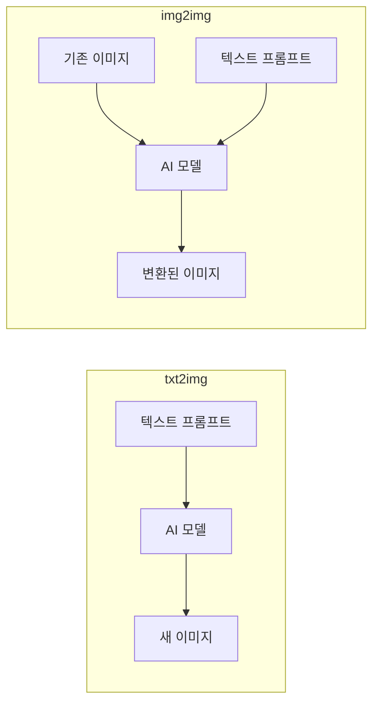
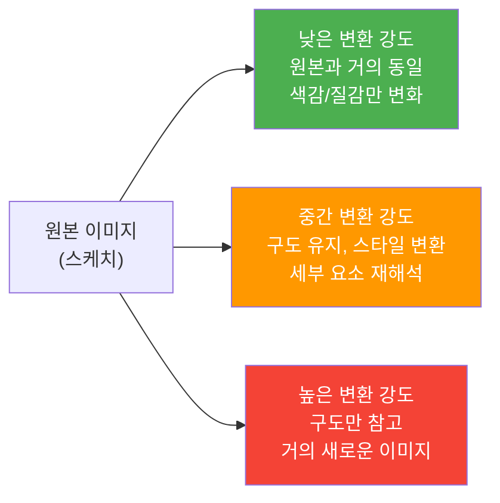
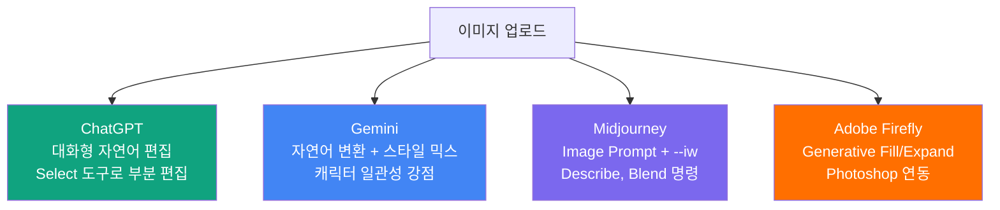

# img2img — 이미지 기반 변환의 원리

> 기존 이미지를 출발점으로 새로운 이미지를 만드는 img2img의 원리와 플랫폼별 활용법을 배웁니다.

## 개요

txt2img가 백지에서 시작하는 창작이라면, img2img는 **기존 이미지를 발전시키는 기법**입니다. 실무에서는 참고 이미지를 기반으로 변형하거나 스타일을 바꾸는 작업이 압도적으로 많기 때문에, img2img를 익히면 디자인 작업의 속도와 유연성이 크게 향상됩니다. 이번 섹션에서는 img2img의 핵심 원리, 변환 강도 조절법, 그리고 ChatGPT/Gemini/Midjourney/Adobe에서의 실전 프롬프트를 다룹니다.

## txt2img vs img2img

img2img(Image-to-Image)는 기존 이미지를 **출발점**으로 삼아, 텍스트 프롬프트에 따라 새로운 이미지를 생성하는 기법입니다. AI가 입력 이미지의 구도, 색감, 형태를 참고하면서 프롬프트 방향으로 변환합니다.



| 구분 | txt2img | img2img |
|------|---------|---------|
| **입력** | 텍스트만 | 이미지 + 텍스트 |
| **출발점** | 완전한 백지(랜덤 노이즈) | 기존 이미지의 구조 |
| **결과 예측성** | 불확실, 매번 다름 | 원본 기반이라 방향 예측 가능 |
| **제어 수준** | 프롬프트 텍스트로만 제어 | 이미지 + 텍스트 + 강도 파라미터 |
| **적합 시나리오** | 새로운 콘셉트 탐색 | 기존 작업물 발전, 스타일 변환 |

## 변환 강도 — AI에게 자유를 얼마나 줄 것인가

> 변환 강도는 트레이싱 페이퍼의 투명도와 같습니다. 원본을 얼마나 충실하게 따를지, 자유롭게 재해석할지를 조절합니다.

플랫폼마다 변환 강도를 제어하는 방식이 다릅니다:

- **Midjourney**: `--iw`(Image Weight) 0~3, 기본값 1
- **Stable Diffusion**: Denoising Strength 0~1
- **ChatGPT/Gemini**: 자연어로 "원본과 비슷하게" 또는 "자유롭게 변형해서" 등으로 제어



Midjourney `--iw`를 예로 들면, V7에서 `--iw 3`은 원본에 매우 충실하고, `--iw 0`은 텍스트 프롬프트 위주로 생성합니다. 소수점 단위(`--iw 0.5`, `--iw 1.5`)로 미세 조절이 가능합니다.

## 4가지 핵심 활용 시나리오

**1. 스케치를 완성 이미지로** — 러프 드로잉을 업로드하고 완성도 높은 이미지로 변환합니다.

```
이 스케치를 기반으로 정교한 디지털 일러스트로 변환해줘. 깔끔한 선화와 부드러운 셀 셰이딩 스타일로, 캐릭터의 포즈와 구도는 그대로 유지해줘.
```


**2. 스타일 변환** — 사진을 수채화, 유화, 애니메이션 등 다른 스타일로 전환합니다.

```
이 도시 풍경 사진을 Studio Ghibli 애니메이션 스타일로 변환해줘. 따뜻한 색감과 부드러운 빛 표현을 살려줘.
```


**3. 무드/분위기 변경** — 같은 장면의 시간대, 계절, 날씨를 전환합니다.

```
이 낮 풍경 사진을 밤 장면으로 바꿔줘. 건물 창문에 따뜻한 불빛이 켜져 있고, 하늘에 별이 떠 있는 분위기로 만들어줘.
```


**4. 바리에이션 탐색** — 하나의 시안에서 색상, 질감을 달리한 여러 버전을 빠르게 생성합니다.

## 플랫폼별 img2img 활용법



### ChatGPT — 대화형 img2img

이미지를 업로드한 뒤 자연어로 변환을 지시합니다. 유지할 요소와 변경할 요소를 분리해서 말하면 정확도가 올라갑니다.

```
[이미지 업로드 후]
이 제품 사진의 구도와 제품은 그대로 유지하되, 배경을 미니멀한 흰색 스튜디오에서 따뜻한 나무 테이블 위로 바꿔줘. 자연광이 왼쪽에서 들어오는 느낌으로.
```


```
[이미지 업로드 후]
이 인물 사진을 빈티지 필름 카메라로 촬영한 것처럼 변환해줘. 약간의 필름 그레인과 따뜻한 색조를 추가하고, 인물의 표정과 포즈는 완전히 동일하게 유지해줘.
```


### Gemini — 크로스 스타일 트랜스퍼

Gemini는 한 이미지의 스타일을 다른 대상에 적용하는 크로스 스타일 트랜스퍼가 강점입니다.

```
[꽃 사진 업로드 후]
이 꽃의 색감과 질감 패턴을 적용해서 운동화 디자인을 만들어줘. 꽃잎의 그라데이션이 운동화 전체에 자연스럽게 퍼지는 느낌으로.
```


```
[인물 사진 업로드 후]
이 인물을 르네상스 시대 유화 초상화 스타일로 그려줘. 인물의 얼굴 특징과 표정은 유지하면서, 배경은 어두운 고전 회화 느낌으로.
```


### Midjourney — Image Prompt와 --iw 제어

이미지 URL을 프롬프트 앞에 넣고 `--iw`로 원본 영향력을 제어합니다. Describe(이미지→프롬프트 역변환)와 Blend(이미지 혼합)도 활용 가능합니다.

```
[이미지URL] watercolor painting, soft brushstrokes, delicate colors --iw 2 --ar 16:9
```


```
[이미지URL] cyberpunk city, neon lights, futuristic atmosphere --iw 0.5 --ar 16:9
```


```
[이미지URL] same composition, autumn forest, golden leaves, warm sunlight --iw 2.5
```


### Adobe Firefly — 전문 편집 도구 연동

Photoshop Generative Fill/Expand와 Firefly 웹앱의 참조 이미지 스타일 변환을 활용합니다. 상업적 안전성(Content Credentials)이 보장됩니다.

| 플랫폼 | 입력 방식 | 강도 제어 | 주요 강점 |
|--------|----------|----------|----------|
| ChatGPT | 이미지 업로드 + 자연어 | 자연어로 간접 제어 | 직관적 대화형 편집 |
| Gemini | 이미지 업로드 + 자연어 | 자연어로 간접 제어 | 크로스 스타일 트랜스퍼 |
| Midjourney | Image Prompt(URL) | `--iw` 0~3 수치 제어 | 미학적 완성도, 정밀 제어 |
| Adobe Firefly | 이미지 업로드 + 선택 영역 | 자연어 + 도구 조합 | 전문 편집 도구 연동 |

## 실습

### 단계 1: ChatGPT 스타일 변환

아래 프롬프트를 복사하여, 원하는 사진을 업로드한 후 실행해 보세요.

```
이 사진을 수채화 스타일의 일러스트로 변환해줘. 원본의 구도와 주요 요소는 유지하되, 부드러운 붓 터치와 은은한 색번짐 효과를 적용해줘.
```

### 단계 2: Midjourney --iw 비교 실험

같은 이미지에 동일한 프롬프트를 사용하되, `--iw` 값만 바꿔가며 결과를 비교해 보세요.

```
[이미지URL] oil painting, impressionist style, thick brushstrokes --iw 0.5
```

```
[이미지URL] oil painting, impressionist style, thick brushstrokes --iw 1.5
```

```
[이미지URL] oil painting, impressionist style, thick brushstrokes --iw 2.5
```


## 팁과 주의사항

- **유지/변경 분리 지시**: ChatGPT에서 "구도와 인물 포즈는 유지하되, 배경을 열대 해변으로 바꿔줘"처럼 유지할 요소와 변경할 요소를 명확히 분리하면 정확도가 높아집니다.
- **--iw 조절은 1.0에서 시작**: Midjourney에서 기본값 1.0부터 0.5 단위로 올리거나 내리며 실험하세요. V7에서는 작은 변화에도 결과가 크게 달라집니다.
- **구도가 해상도보다 중요**: 고해상도 사진보다 구도와 형태가 명확한 이미지가 의도한 방향으로 변환되기 쉽습니다. 단순한 스케치가 복잡한 사진보다 좋은 결과를 내는 경우가 많습니다.
- **Blend로 무드보드 융합**: Midjourney Blend 명령은 2~5개 이미지를 텍스트 없이 혼합합니다. 무드보드의 여러 참고 이미지를 하나로 합치는 데 효과적입니다.
- **필터와의 차이 인식**: img2img는 포토샵 필터(픽셀 수학 변환)와 다릅니다. AI가 이미지의 의미와 맥락을 이해한 뒤 완전히 새로운 이미지를 생성하는 과정입니다.

## 핵심 정리

| 개념 | 설명 |
|------|------|
| img2img | 기존 이미지를 입력으로 받아, 텍스트 프롬프트에 따라 새로운 이미지로 변환하는 기법 |
| 변환 강도 | 원본 이미지의 영향력을 조절하는 파라미터. 낮으면 원본에 충실, 높으면 자유로운 재해석 |
| Image Weight (--iw) | Midjourney에서 이미지 프롬프트의 영향력을 0~3으로 제어하는 파라미터 |
| Describe | Midjourney에서 이미지를 분석하여 텍스트 프롬프트로 역변환하는 기능 |
| Blend | Midjourney에서 2~5개 이미지를 혼합하여 새 이미지를 만드는 기능 |
| 스타일 변환 | 사진을 일러스트, 유화, 애니메이션 등 다른 시각적 스타일로 전환하는 활용 |

## 다음 섹션 미리보기

img2img가 이미지 전체를 변환하는 기법이라면, 다음에 배울 [인페인팅](06-ch6-이미지-편집-기법-img2img인페인팅아웃페인팅/02-02-인페인팅-기초-부분-수정의-기술.md)은 이미지의 **특정 부분만 골라서 수정**하는 기법입니다. 두 기법을 조합하면 AI 이미지 편집의 자유도가 비약적으로 높아집니다.
