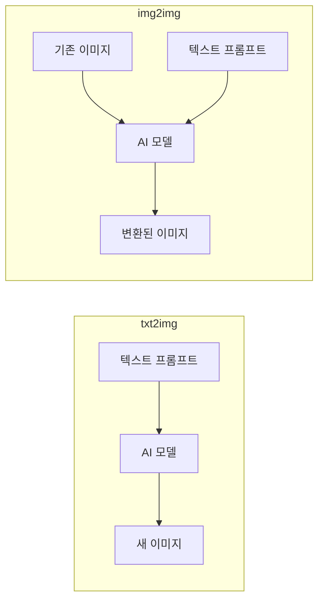
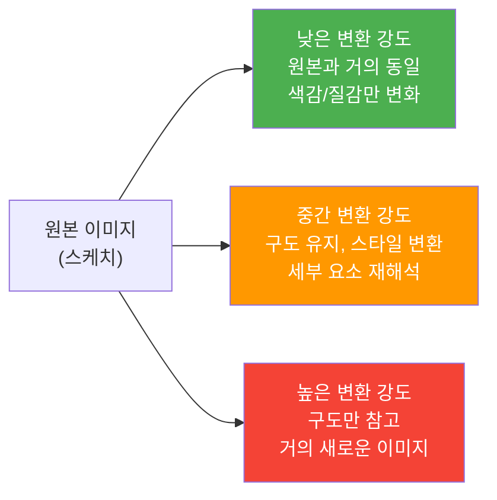
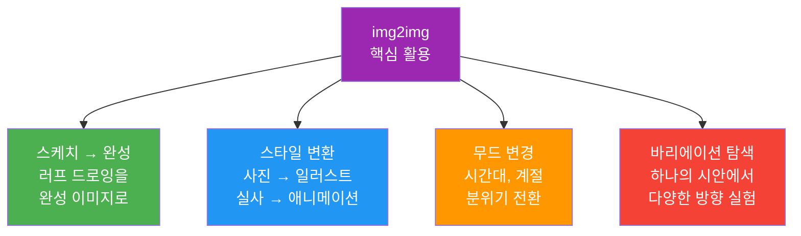
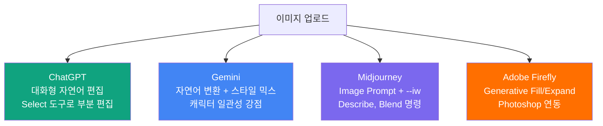
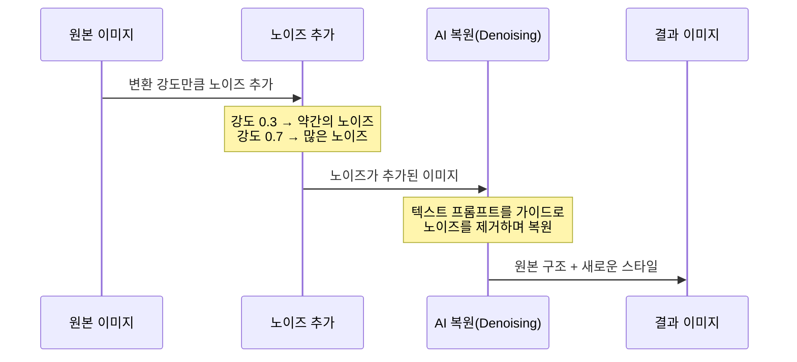

# img2img — 이미지 기반 변환의 원리

> 기존 이미지를 출발점으로 새로운 이미지를 만드는 img2img의 원리와 플랫폼별 활용법을 배웁니다.

## 개요

지금까지 우리는 텍스트만으로 이미지를 생성하는 txt2img 방식을 집중적으로 다뤘습니다. 이번 섹션부터는 한 단계 더 나아가, **기존 이미지를 입력으로 활용**하여 새로운 이미지를 만들어내는 편집 기법들을 배워볼 건데요. 그 첫 번째 주인공이 바로 img2img(이미지 투 이미지)입니다.

**선수 지식**: [프롬프트 6요소 프레임워크](02-ch2-프롬프트-구조-마스터/01-01-프롬프트-해부학-6요소-프레임워크.md)의 기본 구조, [ChatGPT](03-ch3-chatgpt-이미지-생성-실전/01-01-gpt-4o-이미지-생성의-특징과-강점.md)·[Gemini](04-ch4-gemini-이미지-생성-실전/01-01-gemini-이미지-생성의-특징과-접근법.md)·[Midjourney](05-ch5-midjourney-기본과-파라미터-튜닝/01-01-midjourney-인터페이스와-기본-생성.md) 각 플랫폼의 기본 사용법

**학습 목표**:
- img2img의 핵심 원리를 비유를 통해 직관적으로 이해할 수 있다
- txt2img과 img2img의 차이점과 각각의 적합한 사용 시나리오를 구분할 수 있다
- ChatGPT, Gemini, Midjourney, Adobe Firefly에서 img2img를 수행하는 방법을 설명할 수 있다
- 실무에서 img2img가 필요한 상황을 판단하고 적절한 플랫폼을 선택할 수 있다

## 왜 알아야 할까?

디자이너의 작업 과정을 떠올려 보세요. 클라이언트가 "이런 느낌으로 해주세요"라며 참고 이미지를 보내오는 경우가 대부분이죠? 또는 종이에 대충 그린 스케치를 정교한 시안으로 발전시켜야 하는 상황도 흔합니다.

txt2img는 "백지에서 시작하는 것"이라면, img2img는 **"이미 있는 것을 발전시키는 것"**입니다. 실무에서는 아무것도 없는 상태에서 이미지를 만드는 것보다, 기존 자료를 기반으로 변형하거나 발전시키는 작업이 압도적으로 많거든요.

- **스케치를 완성 이미지로**: 손 그림이나 러프 시안을 프로페셔널한 결과물로 변환
- **스타일 변환**: 사진을 일러스트로, 실사를 애니메이션 스타일로
- **무드 변경**: 같은 장면을 낮에서 밤으로, 여름에서 겨울로
- **다양한 바리에이션 탐색**: 하나의 시안에서 여러 방향의 디자인을 빠르게 실험

이 기법을 익히면 디자인 작업의 속도와 유연성이 비약적으로 향상됩니다.

## 핵심 개념

### 개념 1: img2img란 무엇인가?

> 💡 **비유**: img2img는 **트레이싱 페이퍼(먹지)**와 비슷합니다. 원본 그림 위에 반투명한 종이를 올리고, 원본의 구도와 형태를 참고하면서 새로운 스타일로 다시 그리는 거죠. 원본을 얼마나 충실하게 따를지, 아니면 자유롭게 재해석할지를 조절할 수 있다는 점이 핵심입니다.

img2img(Image-to-Image)는 기존 이미지를 **출발점(Starting Point)**으로 삼아, 텍스트 프롬프트의 지시에 따라 새로운 이미지를 생성하는 기법입니다. AI는 입력 이미지의 구도, 색감, 형태 등 시각적 정보를 "참고"하면서, 프롬프트가 요구하는 방향으로 변환합니다.

> 📊 **그림 1**: txt2img vs img2img 비교 — 입력과 출력의 차이

핵심적인 차이를 정리하면 이렇습니다:

| 구분 | txt2img | img2img |
|------|---------|---------|
| **입력 형태** | 텍스트만 | 이미지 + 텍스트 |
| **출발점** | 완전한 백지(랜덤 노이즈) | 기존 이미지의 구조 |
| **출력 특성** | 매번 완전히 새로운 이미지 생성 | 원본의 구도·형태를 계승한 변형 이미지 |
| **결과 예측성** | 상대적으로 불확실, 동일 프롬프트도 매번 다름 | 원본 기반이라 결과 방향 예측 가능 |
| **제어 수준** | 프롬프트 텍스트로만 제어 | 이미지(구도) + 텍스트(스타일) + 강도 파라미터로 다층 제어 |
| **구도 제어** | 프롬프트로만 가능 (불안정) | 원본 이미지로 자연스럽게 유지 |
| **적합 시나리오** | 새로운 콘셉트 탐색, 아이디어 발산 | 기존 작업물 발전·변형, 시안 바리에이션, 스타일 변환 |
| **주요 용도** | 완전 신규 창작, 레퍼런스 없는 작업 | 스케치 완성, 리터칭, 무드보드 기반 작업 |

> ⚠️ **흔한 오해**: "img2img는 단순히 포토샵 필터 같은 거 아닌가요?" — 아닙니다. 필터는 픽셀 단위의 수학적 변환(밝기, 대비 조정)이지만, img2img는 AI가 이미지의 **의미와 맥락을 이해**한 뒤 완전히 새로운 이미지를 생성하는 것입니다. 고양이 사진에 "수채화 스타일"을 적용하면, 필터는 사진 위에 수채화 텍스처를 씌우지만, img2img는 수채화 화가가 그 고양이를 보고 직접 그린 것 같은 결과를 만들어냅니다.

### 개념 2: 변환 강도 — AI에게 자유를 얼마나 줄 것인가

> 💡 **비유**: 변환 강도는 **요리 레시피의 자유도**와 같습니다. "이 된장찌개 레시피를 정확히 따라 만들어줘"(낮은 강도)부터, "이 된장찌개에서 영감을 받아 너만의 퓨전 요리를 만들어봐"(높은 강도)까지 다양한 수준을 지정할 수 있는 거죠.

모든 img2img 시스템에는 **원본 이미지의 영향력을 조절하는 파라미터**가 있습니다. 이를 "변환 강도(Transformation Strength)"라고 부르는데, 플랫폼마다 이름이 다릅니다:

- **Stable Diffusion**: Denoising Strength (0~1)
- **Midjourney**: Image Weight `--iw` (0~3, 기본값 1)
- **ChatGPT/Gemini**: 자연어로 "원본과 비슷하게" 또는 "자유롭게 변형해서" 등으로 제어

> 📊 **그림 2**: 변환 강도에 따른 결과물 변화 스펙트럼

Midjourney의 `--iw` 파라미터를 예로 들면, V7 기준으로 0에서 3까지 설정할 수 있습니다. `--iw 3`이면 원본 이미지에 매우 충실하게, `--iw 0`이면 이미지를 거의 무시하고 텍스트 프롬프트 위주로 생성하죠. 재미있는 점은 소수점 단위로도 조절 가능하다는 것인데요, `--iw 0.5`와 `--iw 1.5` 사이에서 미세한 차이를 실험할 수 있습니다.

### 개념 3: img2img의 4가지 핵심 활용 시나리오

실무에서 img2img가 빛을 발하는 대표적인 시나리오를 살펴보겠습니다.

> 📊 **그림 3**: img2img 4대 활용 시나리오

**1. 스케치 → 완성 이미지**

가장 직관적인 활용법입니다. 태블릿이나 종이에 대충 그린 러프 스케치를 업로드하고, "realistic digital painting, detailed lighting" 같은 프롬프트와 함께 변환하면, AI가 스케치의 구도를 유지하면서 완성도 높은 이미지를 만들어냅니다. 디자이너에게는 **아이디어 시각화 속도를 10배 이상 높이는** 핵심 워크플로우입니다.

**2. 스타일 변환**

사진을 수채화, 유화, 애니메이션, 픽셀 아트 등 다양한 스타일로 변환합니다. 제품 사진을 일러스트 스타일로 바꿔 SNS 콘텐츠를 만들거나, 실제 풍경을 판타지 배경으로 변환하는 식이죠.

**3. 무드/분위기 변경**

같은 장면의 시간대를 바꾸거나(낮→밤), 계절을 전환하거나(여름→겨울), 날씨를 변경하는(맑음→안개) 작업입니다. 건축 시각화나 영상 콘셉트 아트에서 특히 유용합니다.

**4. 바리에이션 탐색**

하나의 기본 시안에서 색상, 질감, 세부 요소를 조금씩 달리하며 여러 버전을 빠르게 생성합니다. 클라이언트에게 다양한 선택지를 제시해야 할 때 시간을 대폭 절약할 수 있습니다.

### 개념 4: 플랫폼별 img2img 지원 현황

각 플랫폼마다 img2img를 다루는 방식이 상당히 다릅니다. 어떤 플랫폼이 어떤 상황에서 강점을 가지는지 파악해 두면 작업 효율이 크게 올라갑니다.

> 📊 **그림 4**: 플랫폼별 img2img 접근 방식 비교

#### ChatGPT (GPT-4o / GPT Image 1.5)

ChatGPT의 img2img는 **대화형**이라는 것이 가장 큰 특징입니다. 이미지를 업로드한 뒤 "이 사진을 수채화 스타일로 변환해줘", "배경은 유지하고 인물의 옷 색을 빨간색으로 바꿔줘"처럼 자연어로 지시하면 됩니다. GPT-4o는 텍스트와 이미지를 같은 신경망에서 처리하기 때문에, 업로드된 이미지의 구도, 색감, 분위기를 정확히 파악한 뒤 요청한 변환을 수행합니다. Select 도구로 이미지의 특정 영역만 선택하여 편집하는 것도 가능하죠.

**강점**: 코딩 경험 없이도 자연어만으로 직관적 편집 가능, 맥락을 이해한 정밀한 변환
**약점**: 세밀한 수치 제어가 어려움, 미학적 스타일 다양성은 Midjourney에 비해 제한적

#### Google Gemini (Nano Banana)

Gemini의 최신 이미지 모델인 Nano Banana는 img2img에서 독특한 강점을 보여줍니다. 업로드한 이미지의 스타일을 다른 대상에 적용하는 **크로스 스타일 트랜스퍼**가 뛰어난데요, 예를 들어 꽃잎의 색감과 질감을 장화 디자인에 적용하거나, 나비 날개의 패턴을 드레스 디자인에 입히는 것이 가능합니다. 또한 인물 사진의 **캐릭터 일관성**을 유지하면서 다양한 스타일로 변환하는 기능이 강화되었습니다.

**강점**: 크로스 스타일 트랜스퍼, 캐릭터 일관성, 무료 사용 범위 넓음
**약점**: 결과물의 예술적 완성도는 Midjourney에 비해 아쉬울 수 있음

#### Midjourney

Midjourney에서의 img2img는 **Image Prompt** 방식으로 작동합니다. 이미지 URL을 프롬프트 앞에 넣고 텍스트를 추가하면, Midjourney가 이미지의 핵심 요소를 참고하여 새로운 이미지를 생성합니다. `--iw`(Image Weight) 파라미터로 원본 이미지의 영향력을 0에서 3까지 정밀하게 제어할 수 있죠.

추가로 **Describe** 명령(이미지를 분석하여 프롬프트 텍스트로 변환)과 **Blend** 명령(2~5개 이미지를 혼합하여 새 이미지 생성)도 img2img의 확장된 형태입니다.

**강점**: `--iw`로 정밀한 강도 제어, 미학적 완성도 최고, Blend로 이미지 믹싱
**약점**: 자연어 편집 지시 불가, 이미지 URL 필요(직접 업로드 후 URL 복사)

#### Adobe Firefly / Photoshop

Adobe의 접근법은 **전문 편집 도구 안에서의 AI 통합**입니다. Photoshop의 Generative Fill과 Generative Expand가 대표적인데, 이는 엄밀히 말하면 인페인팅/아웃페인팅에 더 가깝습니다. 하지만 Firefly 웹앱에서는 참조 이미지를 활용한 스타일 변환도 가능합니다. 기존 포토샵 워크플로우와 자연스럽게 연결된다는 것이 최대 장점이죠.

**강점**: 전문 편집 도구 연동, 정밀한 영역 선택, 상업적 안전성(Content Credentials)
**약점**: 유료 구독 필요, 독립적 img2img보다 편집 보조에 가까움

| 플랫폼 | 입력 방식 | 강도 제어 | 주요 강점 |
|--------|----------|----------|----------|
| ChatGPT | 이미지 업로드 + 자연어 | 자연어로 간접 제어 | 직관적 대화형 편집 |
| Gemini | 이미지 업로드 + 자연어 | 자연어로 간접 제어 | 크로스 스타일 트랜스퍼 |
| Midjourney | Image Prompt(URL) | `--iw` 0~3 수치 제어 | 미학적 완성도, 정밀 제어 |
| Adobe Firefly | 이미지 업로드 + 선택 영역 | 자연어 + 도구 조합 | 전문 편집 도구 연동 |

## 실습: 적용해보기

### 활동 1: img2img 활용 시나리오 판단 연습

아래 각 상황에서 **(1) txt2img와 img2img 중 어떤 접근이 더 적합한지**, **(2) 적합한 플랫폼은 무엇인지** 판단해 보세요.

| 상황 | txt2img vs img2img? | 추천 플랫폼 | 이유 |
|------|---------------------|------------|------|
| 클라이언트가 경쟁사 제품 사진을 보내며 "이런 톤으로" 요청 | ? | ? | |
| 완전히 새로운 판타지 캐릭터 콘셉트가 필요 | ? | ? | |
| 손 그림 스케치를 깔끔한 디지털 일러스트로 만들고 싶다 | ? | ? | |
| 제품 사진의 배경을 자연 풍경으로 교체하고 싶다 | ? | ? | |
| 하나의 로고 시안에서 5가지 색상 바리에이션이 필요 | ? | ? | |

### 활동 2: 변환 강도 실험 계획 세우기

하나의 이미지(예: 도시 풍경 사진)를 선택하고, 아래 표에 따라 실험 계획을 세워보세요.

| 실험 번호 | 변환 목표 | 프롬프트 키워드 | 예상 변환 강도 |
|-----------|----------|---------------|--------------|
| 1 | 약한 변환: 색감만 변경 | "warm sunset tones" | 낮음 |
| 2 | 중간 변환: 스타일 전환 | "watercolor painting style" | 중간 |
| 3 | 강한 변환: 완전히 다른 세계관 | "cyberpunk city, neon lights, futuristic" | 높음 |

실제로 ChatGPT나 Midjourney에서 같은 이미지로 위 실험을 수행해 보고, 각 결과의 차이를 관찰해 보세요.

### 토론 질문

1. "스케치를 업로드해서 완성 이미지를 만드는 것"과 "텍스트로만 상세하게 묘사하는 것" 중 어떤 방법이 더 효율적일까요? 각각 어떤 상황에서 유리한지 토론해 보세요.
2. img2img가 디자이너의 창작 능력을 강화한다고 생각하나요, 아니면 오히려 참고 이미지에 의존하게 만든다고 생각하나요?

## 더 깊이 알아보기

### img2img의 탄생 — "이미지에 지우개질을 하면 어떨까?"

img2img의 핵심 아이디어는 2021년 스탠포드 대학교 연구팀에서 시작되었습니다. 이 아이디어를 이해하는 데는 어려운 수학이 필요 없어요. 일상적인 비유로 충분합니다.

> 💡 **비유**: 연필로 그린 그림을 떠올려 보세요. 지우개로 **살짝만** 문지르면 세부 디테일은 흐려지지만 큰 윤곽은 남아있죠? 그 상태에서 다른 사람에게 "이 흐린 윤곽을 보고 수채화로 다시 그려줘"라고 하면, 원래 구도는 유지하면서도 완전히 다른 스타일의 그림이 탄생합니다. 지우개로 **많이** 문지르면? 윤곽마저 거의 사라져서 그리는 사람의 자유도가 훨씬 높아지겠죠. 이것이 바로 img2img의 원리입니다.

기존의 이미지 편집 기술은 매번 복잡한 준비 과정이 필요했습니다. 하지만 이 연구팀은 "이미지를 일부러 흐릿하게 만든 뒤(노이즈 추가), AI에게 다시 선명하게 복원하라고 시키면 되지 않을까?"라는 발상의 전환을 이뤄냈죠. 별도의 학습이나 복잡한 설정 없이도 이미지를 자유롭게 편집할 수 있는 길이 열린 겁니다.

이 아이디어는 2022년 Stable Diffusion이 오픈소스로 공개되면서 폭발적으로 확산됩니다. "Denoising Strength"라는 슬라이더 하나로 **지우개질의 강도**를 조절하는 직관적인 인터페이스가 전 세계 크리에이터들을 매료시켰죠.

> 💡 **심화 — SDEdit란?**: 이 기술의 학술적 이름은 **SDEdit(Stochastic Differential Editing)**으로, "확률적 미분 방정식을 활용한 편집"이라는 뜻입니다. 이름이 어렵게 느껴지지만, 핵심은 위의 "지우개질 비유"와 정확히 같습니다. 이미지에 수학적 노이즈를 추가(= 지우개질)한 뒤, 확산 모델(Diffusion Model)이 텍스트 프롬프트를 가이드 삼아 복원(= 새로 그리기)하는 과정이죠. 이 논문 덕분에 지금 우리가 쓰는 모든 img2img 기능이 존재한다고 해도 과언이 아닙니다.

> 💡 **알고 계셨나요?**: Midjourney의 초기 버전(V1~V3)에는 img2img 기능이 없었습니다. 순수한 txt2img 도구로 시작했죠. Image Prompt 기능이 추가된 것은 V4부터였는데, 당시 커뮤니티에서 가장 많이 요청된 기능이 바로 "내 이미지를 참고해서 만들어줘"였다고 합니다. 사용자들의 실전 필요가 기술 발전을 이끈 대표적 사례입니다.

### 확산 모델에서 img2img가 작동하는 원리

기술적으로 한 단계 더 들어가 볼까요? txt2img에서 AI는 **완전한 랜덤 노이즈**(TV 지직거림 같은 화면)에서 출발하여 이미지를 만듭니다. 이때 전체 "Denoising Step"(예: 50단계)을 모두 거치죠.

반면 img2img에서는 입력 이미지에 **일부분의 노이즈만 추가**합니다. 변환 강도가 0.5라면 전체 50단계 중 25단계에 해당하는 노이즈만 추가하고, 나머지 25단계의 복원 과정만 수행하는 겁니다. 이렇게 하면 원본의 큰 구조(구도, 형태)는 보존되면서 세부 스타일만 바뀌게 됩니다.

> 📊 **그림 5**: img2img의 내부 동작 — 노이즈 추가와 복원 과정

변환 강도가 1.0(최대)이면? 원본에 완전한 노이즈가 추가되어 사실상 txt2img와 동일해집니다. 반대로 0.0이면? 노이즈가 전혀 추가되지 않으니 원본 그대로 나오겠죠. 이 두 극단 사이에서 **최적의 균형점을 찾는 것**이 img2img 활용의 핵심입니다.

## 흔한 오해와 팁

> ⚠️ **흔한 오해**: "img2img에 고해상도 사진을 넣으면 결과도 더 좋겠지?" — 반드시 그렇지 않습니다. img2img에서 중요한 것은 해상도가 아니라 **구도와 형태의 명확성**입니다. 오히려 단순하고 깔끔한 스케치가 복잡한 고해상도 사진보다 의도한 방향으로 변환되기 쉬운 경우가 많습니다.

> 💡 **알고 계셨나요?**: Midjourney의 Blend 명령은 img2img의 응용인데, 최대 5개의 이미지를 혼합할 수 있습니다. 이때 텍스트 프롬프트 없이 이미지만으로 작동하기 때문에, **무드보드의 여러 참고 이미지를 하나로 융합**하는 데 매우 효과적입니다.

> 🔥 **실무 팁**: ChatGPT에서 img2img를 할 때, "이 이미지를 변환해줘"라고 막연하게 말하기보다 **구체적으로 유지할 요소와 변경할 요소를 분리**해서 지시하세요. 예를 들어 "구도와 인물 포즈는 유지하되, 배경을 열대 해변으로 바꾸고, 전체적으로 따뜻한 일몰 색감을 적용해줘"처럼요. 유지/변경을 명확히 할수록 결과의 정확도가 올라갑니다.

> 🔥 **실무 팁**: Midjourney에서 Image Prompt를 사용할 때, `--iw` 값은 **1.0에서 시작하여 0.5 단위로 조절**해 보세요. 급격한 변화를 원하면 0.5로 낮추고, 원본에 충실한 결과를 원하면 2.0~2.5로 올리는 식입니다. V7에서는 작은 `--iw` 변화에도 결과가 꽤 달라지니, 미세 조정이 중요합니다.

## 핵심 정리

| 개념 | 설명 |
|------|------|
| img2img | 기존 이미지를 입력으로 받아, 텍스트 프롬프트에 따라 새로운 이미지로 변환하는 기법 |
| 변환 강도 | 원본 이미지의 영향력을 조절하는 파라미터. 낮으면 원본에 충실, 높으면 자유로운 재해석 |
| Image Weight (--iw) | Midjourney에서 이미지 프롬프트의 영향력을 0~3으로 제어하는 파라미터 |
| Describe | Midjourney에서 이미지를 분석하여 텍스트 프롬프트로 역변환하는 기능 |
| Blend | Midjourney에서 2~5개 이미지를 혼합하여 새 이미지를 만드는 기능 |
| 스케치 → 완성 | img2img의 대표 활용 — 러프 드로잉을 완성도 높은 이미지로 변환 |
| 스타일 변환 | 사진 → 일러스트, 실사 → 애니메이션 등 시각적 스타일을 전환하는 활용 |
| SDEdit | img2img의 기술적 기원이 된 2021년 스탠포드 대학교의 확산 모델 기반 편집 기법. 이미지에 노이즈를 추가한 뒤 복원하는 "지우개질 원리"로 작동 |

## 다음 섹션 미리보기

img2img가 **이미지 전체를 변환**하는 기법이라면, 다음에 배울 [인페인팅](06-ch6-이미지-편집-기법-img2img인페인팅아웃페인팅/02-02-인페인팅-기초-부분-수정의-기술.md)은 이미지의 **특정 부분만 골라서 수정**하는 기법입니다. 배경은 그대로 두고 인물의 표정만 바꾸거나, 제품 사진에서 특정 요소만 교체하는 등 더 정밀한 편집이 가능해지죠. img2img와 인페인팅을 조합하면 AI 이미지 편집의 자유도가 비약적으로 높아집니다.

## 참고 자료

- [Midjourney Image Prompts 공식 문서](https://docs.midjourney.com/hc/en-us/articles/32040250122381-Image-Prompts) - Image Prompt의 사용법, `--iw` 파라미터 상세 설명
- [OpenAI — Introducing 4o Image Generation](https://openai.com/index/introducing-4o-image-generation/) - GPT-4o의 네이티브 이미지 생성/편집 기능 소개
- [Editing Your Images with ChatGPT Images (OpenAI Help)](https://help.openai.com/en/articles/9055440-editing-your-images-with-chatgpt-images) - ChatGPT에서 이미지 업로드 후 편집하는 방법 안내
- [Google — Upload and Edit Images in Gemini](https://blog.google/products-and-platforms/products/gemini/image-editing/) - Gemini의 이미지 업로드 및 편집 기능 소개
- [Midjourney Blend 공식 문서](https://docs.midjourney.com/hc/en-us/articles/32635189884557-Blend-Images-on-Discord) - Blend 명령어 사용법과 옵션 설명
- [Midjourney --iw 파라미터 가이드 (mjsplitter)](https://www.mjsplitter.com/blog/how-to-adjust-image-weight-midjourney-iw) - Image Weight 값별 결과 비교와 실전 팁
- [Stable Diffusion Art — Inpainting Basics](https://stable-diffusion-art.com/inpainting_basics/) - img2img와 인페인팅의 기술적 차이 이해에 도움