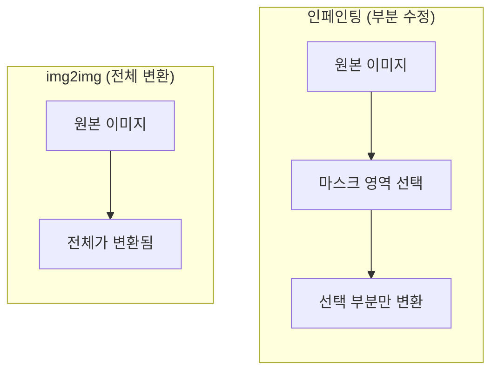
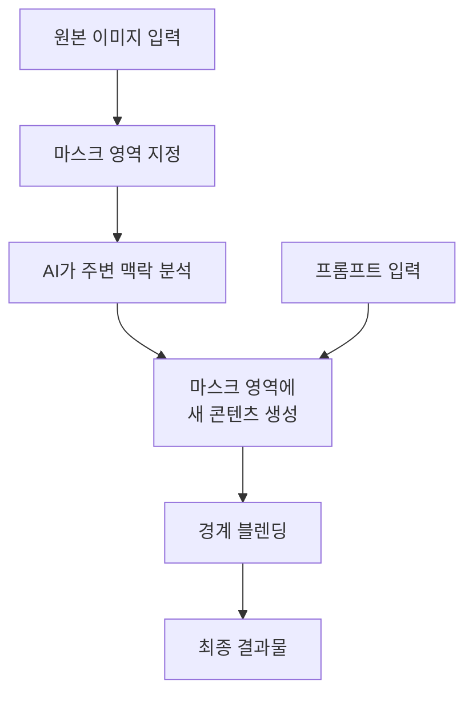
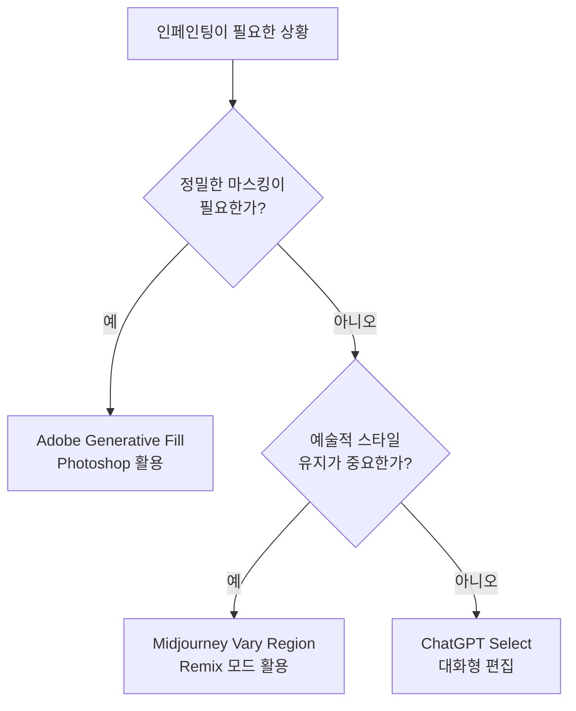

# 인페인팅 기초 — 부분 수정의 기술

> AI 이미지의 특정 부분만 골라서 수정하는 인페인팅의 원리와 플랫폼별 실전 활용법을 익힙니다.

## 개요

[이전 섹션](06-ch6-이미지-편집-기법-img2img인페인팅아웃페인팅/01-01-img2img-이미지-기반-변환의-원리.md)에서 img2img가 이미지 **전체**를 변환하는 기법이라는 것을 배웠습니다. 하지만 실무에서는 "배경은 완벽한데 셔츠 색상만 바꾸고 싶다"는 상황이 훨씬 많죠. 이럴 때 필요한 것이 바로 **인페인팅(Inpainting)** — 이미지의 특정 영역만 선택적으로 수정하는 기술입니다. 이 기법 하나만 잘 익혀도 전체를 다시 생성하는 비효율을 없앨 수 있으며, AI 이미지 편집에서 가장 실용적인 기법이라 할 수 있습니다.

> 📊 **그림 1**: img2img vs 인페인팅 — 편집 범위 비교

## 핵심 개념

### 마스크 — 인페인팅의 핵심 도구

인페인팅에서 **마스크(Mask)**란 이미지 위에 그리는 선택 영역입니다. 마스크로 덮인 부분만 AI가 새로 생성하고, 마스크 바깥은 원본 그대로 유지됩니다. 마스크의 품질이 곧 결과의 품질을 결정합니다.

> 💡 **비유**: 마스크는 **마스킹 테이프**와 같습니다. 벽을 페인트칠할 때 창문 테두리에 테이프를 붙여 보호하듯, "여기만 수정하고, 나머지는 건드리지 마"라고 AI에게 알려주는 역할입니다.

| 원칙 | 설명 | 예시 |
|------|------|------|
| **충분한 여백** | 수정 대상보다 10-20% 넓게 선택 | 셔츠를 바꿀 때 셔츠 경계 바깥까지 |
| **경계 자연스럽게** | 날카로운 직선보다 부드러운 곡선 | 인물 윤곽을 따라 자연스럽게 |
| **맥락 포함** | 주변 요소를 약간 포함하면 블렌딩 향상 | 목걸이를 수정할 때 목선 일부 포함 |
| **경계 블렌딩** | 마스크 가장자리에 페더링 적용 | Photoshop에서 Feather 5-15px 적용 |
| **적정 비율** | 전체 이미지의 20-50%가 이상적 | 너무 작으면 변화 미미, 너무 크면 일관성 저하 |

> 📊 **그림 2**: 인페인팅의 작동 원리

### ChatGPT Select 도구 — 대화하듯 수정하기

ChatGPT에서 이미지를 생성하거나 업로드한 후, **Select 도구(브러시 아이콘)**를 클릭하면 인페인팅 모드로 진입합니다. 원하는 영역을 브러시로 칠한 뒤, 자연어로 지시하면 됩니다. 결과가 마음에 안 들면 대화를 이어가며 점진적으로 수정할 수 있다는 것이 가장 큰 장점입니다.

**실전 프롬프트 — ChatGPT Select 대화 예시:**

**예시 1: 의상 색상 변경**

> 사용자: (셔츠 영역을 Select 도구로 선택)
> "이 셔츠를 네이비 블루 린넨 셔츠로 바꿔줘"

> 사용자: "소매를 반팔로 줄여줘"

**예시 2: 테이블 소품 교체**

> 사용자: (커피잔 영역 선택)
> "이 커피잔을 라떼아트가 있는 카푸치노로 바꿔줘. 하트 모양 라떼아트."

**예시 3: 배경 요소 추가**

> 사용자: (빈 벽면 영역 선택)
> "이 벽에 빈티지 액자 두 개를 걸어줘. 식물 그림과 풍경 사진."

> 사용자: "액자 크기를 좀 더 크게, 간격은 좁혀줘"

### Adobe Generative Fill — 전문가의 정밀함

Adobe Photoshop의 Generative Fill은 Firefly AI 모델 기반 인페인팅 기능입니다. Photoshop의 강력한 선택 도구들(올가미, 빠른 선택, 피사체 선택, 펜 도구 등)과 결합되어 가장 정밀한 마스킹이 가능합니다. 결과가 별도 **생성 레이어(Generative Layer)**에 담기므로 원본은 항상 안전한 **비파괴 편집** 방식입니다.

**실전 프롬프트 — Generative Fill 워크플로우:**

**예시 4: 객체 제거 (빈 프롬프트 기법)**

> 올가미 도구로 배경의 불필요한 전봇대 선택 → Generative Fill 클릭 → 프롬프트 비움 → 생성

> 💡 **팁**: 프롬프트를 **비워두는 것**이 의외로 강력합니다. AI가 주변 맥락을 분석해 자연스럽게 채워주며, Remove 도구보다 더 자연스러운 결과를 얻는 경우가 많습니다.

**예시 5: 제품 배경 교체**

> 피사체 선택 → 선택 반전(Ctrl+Shift+I) → Generative Fill:
> "soft gradient studio background, warm lighting"

**예시 6: 질감 변경**

> 빠른 선택으로 소파 선택 → Generative Fill:
> "dark green velvet texture"

**예시 7: 인물 소품 추가**

> 올가미로 인물 머리 위쪽 영역 선택 → Generative Fill:
> "straw sun hat"

### Midjourney Vary Region — 창작자의 유연함

Midjourney에서 인페인팅을 수행하는 방법은 **Vary (Region)** 기능과 웹 기반 **Editor**입니다. Vary Region 사용 시 **Remix 모드를 반드시 켜세요**. Remix 없이는 원래 프롬프트가 그대로 적용되어 의도한 수정이 불가능합니다.

> 📊 **그림 3**: 프로젝트 유형별 플랫폼 선택 가이드

**실전 프롬프트 — Vary Region + Remix 예시:**

**예시 8: 하늘 분위기 변경**

> /imagine prompt: mountain landscape, clear blue sky, cinematic --ar 16:9
> U1 → Vary (Region) → 하늘 영역 선택 → Remix 프롬프트:
> "dramatic storm clouds, golden hour lighting, rays of light breaking through"

**예시 9: 캐릭터 의상 변경**

> Vary (Region) → 캐릭터 상체 선택 → Remix 프롬프트:
> "wearing silver armor with dragon emblem"

**예시 10: 배경에 요소 추가**

> Vary (Region) → 배경 빈 공간 선택 (전체의 약 30%) → Remix 프롬프트:
> "ancient stone castle in the distance, misty"

**예시 11: Editor로 정밀 수정**

> 웹 Editor → 스마트 선택 브러시로 인물 헤어 선택 → 프롬프트:
> "flowing red hair, windswept"

### 플랫폼별 인페인팅 비교

| 기준 | ChatGPT Select | Adobe Generative Fill | Midjourney Vary Region |
|------|---------------|----------------------|----------------------|
| **진입 장벽** | 매우 낮음 | 중간 (PS 필요) | 낮음 |
| **마스킹 정밀도** | 중간 (브러시) | 매우 높음 (다양한 선택 도구) | 중간 (사각형/자유형) |
| **프롬프트 방식** | 자연어 대화 | 짧은 키워드 | Remix로 프롬프트 수정 |
| **반복 편집** | 대화로 즉시 반복 | 레이어 기반 비파괴 | 새로 생성 필요 |
| **결과 미학** | 사실적 | 사실적 + 상업용 안전 | 예술적/미학적 |
| **해상도** | 중간 | 높음 (2K) | 높음 |
| **추천 용도** | 빠른 수정, 아이디어 탐색 | 상업 디자인, 정밀 편집 | 예술적 스타일 유지 편집 |

## 실습: 적용해보기

### 활동 1: 플랫폼별 인페인팅 실전

아래 프롬프트를 각 플랫폼에서 직접 시도해보세요.

**ChatGPT Select 실습:**

> "카페 인테리어 사진을 만들어줘. 나무 테이블 위에 커피잔, 창가에 따뜻한 햇살."

생성된 이미지에서 Select 도구로 커피잔을 선택한 뒤:

> "이 커피잔을 아이스 아메리카노로 바꿔줘. 투명한 유리잔에 얼음이 보이게."

**Adobe Generative Fill 실습:**

위에서 만든 이미지를 Photoshop에 열고, 빠른 선택으로 배경 벽면 선택:

> "exposed brick wall with hanging plants"

### 활동 2: 마스크 범위 비교

같은 이미지에 대해 세 가지 다른 마스크 범위로 인페인팅을 시도해보세요:

| 시도 | 마스크 범위 | 평가 기준 |
|------|-----------|----------|
| 1회차 | 대상만 꼭 맞게 (10% 이하) | 경계 자연스러움 1-5점 |
| 2회차 | 여유 있게 (20-30%) | 원본과의 일관성 1-5점 |
| 3회차 | 넓게 (40-50%) | 프롬프트 반영도 1-5점 |

## 팁과 주의사항

> ⚠️ **마스크를 너무 정확하게 그리지 마세요.** 대상보다 **10-20% 넓게** 잡아야 AI가 경계를 자연스럽게 블렌딩합니다. 너무 타이트한 마스크는 부자연스러운 경계선의 주요 원인입니다.

> 🔥 **Midjourney 선택 범위**: Vary Region에서 선택 영역이 전체 이미지의 **20% 미만**이면 변화가 거의 눈에 띄지 않고, **50% 이상**이면 img2img에 가까운 전체 변환이 됩니다. Remix 모드에서 프롬프트는 **짧고 직접적**으로 작성하세요.

> 🔥 **ChatGPT 반복 수정**: 결과가 마음에 안 들면 새로 시작하지 말고 **대화를 이어가세요**. "좀 더 밝게", "크기를 줄여줘"처럼 반복 지시하면 점진적으로 원하는 결과에 도달할 수 있습니다.

## 핵심 정리

| 개념 | 설명 |
|------|------|
| 인페인팅(Inpainting) | 이미지의 특정 영역을 마스크로 선택해 해당 부분만 AI로 수정하는 기법 |
| 마스크(Mask) | AI에게 "여기만 수정하라"고 알려주는 선택 영역. 결과 품질의 핵심 |
| 마스크 여백 원칙 | 대상보다 10-20% 넓게, 전체의 20-50% 범위가 이상적 |
| 비파괴 편집 | 원본을 직접 변경하지 않고 별도 레이어에 수정 사항을 저장하는 편집 방식 |
| ChatGPT Select | 자연어 대화로 인페인팅. 반복 수정이 쉽고 진입 장벽 최저 |
| Adobe Generative Fill | 최고의 마스킹 정밀도. 빈 프롬프트로 객체 제거에 효과적 |
| Midjourney Vary Region | 미학적 스타일을 유지한 부분 수정. Remix 모드 필수 |

## 다음 섹션 미리보기

이번 섹션에서 인페인팅의 기초 — 마스크 원칙과 플랫폼별 실전 워크플로우를 익혔습니다. [다음 섹션](06-ch6-이미지-편집-기법-img2img인페인팅아웃페인팅/03-03-인페인팅-고급-복잡한-편집-시나리오.md)에서는 **복잡한 편집 시나리오**를 다룹니다. 여러 영역을 동시에 수정하기, 인물의 포즈나 표정 변경, 배경과 전경의 조화를 유지하면서 대규모 수정을 수행하는 고급 기법으로 이어집니다.
