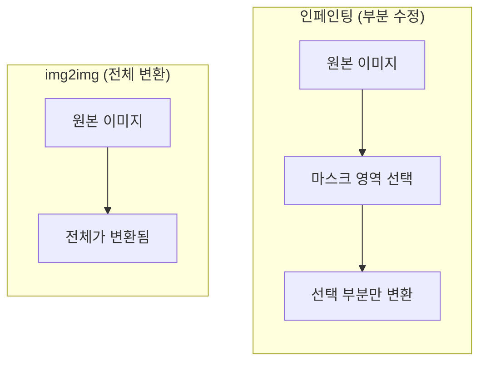
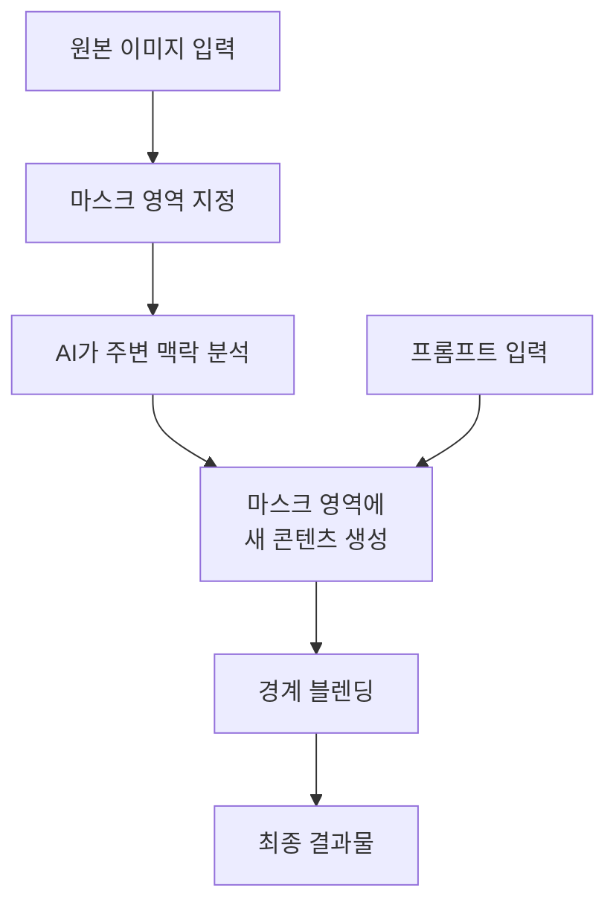
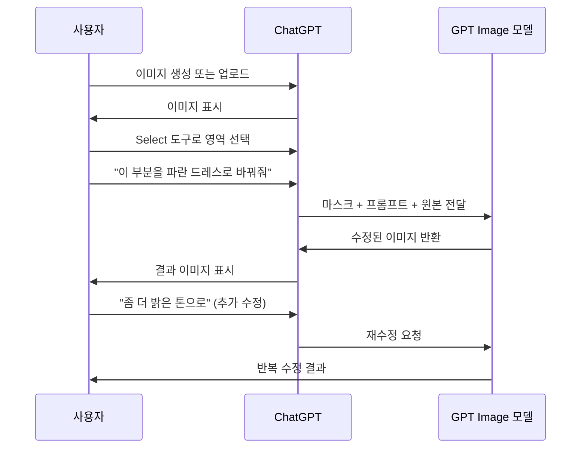
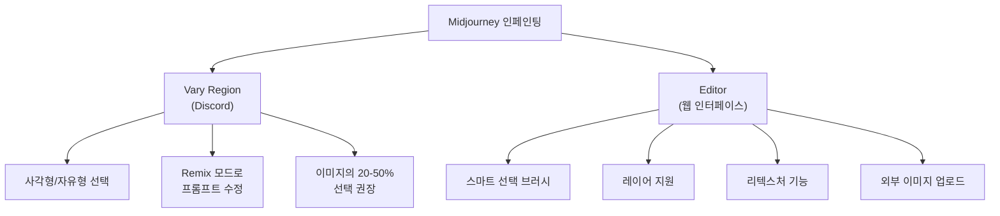
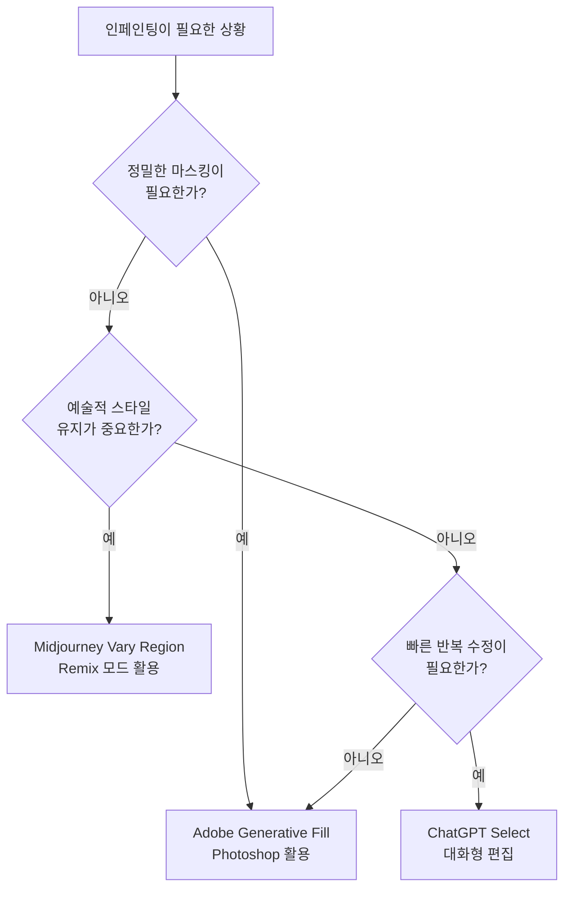

# 인페인팅 기초 — 부분 수정의 기술

> AI 이미지의 특정 부분만 골라서 수정하는 인페인팅의 원리와 플랫폼별 실전 활용법을 익힙니다.

## 개요

[이전 섹션](06-ch6-이미지-편집-기법-img2img인페인팅아웃페인팅/01-01-img2img-이미지-기반-변환의-원리.md)에서 img2img가 이미지 **전체**를 변환하는 기법이라는 것을 배웠습니다. 하지만 실무에서는 "배경은 완벽한데 인물의 옷 색상만 바꾸고 싶다"거나 "로고 위치만 수정하고 싶다"는 상황이 훨씬 많죠. 이럴 때 필요한 것이 바로 **인페인팅(Inpainting)** — 이미지의 특정 영역만 선택적으로 수정하는 기술입니다.

**선수 지식**: img2img의 기본 개념과 변환 강도([6.1 섹션](06-ch6-이미지-편집-기법-img2img인페인팅아웃페인팅/01-01-img2img-이미지-기반-변환의-원리.md) 참조), [프롬프트 6요소 프레임워크](02-ch2-프롬프트-구조-마스터/01-01-프롬프트-해부학-6요소-프레임워크.md)

**학습 목표**:
- 인페인팅의 원리와 마스크의 역할을 설명할 수 있다
- ChatGPT Select 도구, Adobe Generative Fill, Midjourney Vary Region의 차이를 비교할 수 있다
- 자연스러운 결과를 위한 마스크 범위와 프롬프트 전략을 적용할 수 있다

## 왜 알아야 할까?

디자인 작업에서 "거의 완벽한데 한 군데만 아쉬운" 순간은 생각보다 자주 찾아옵니다. 클라이언트가 "배경은 좋은데 모델의 셔츠 색을 파란색으로 바꿔주세요"라고 요청하면 어떻게 할까요? img2img로 전체를 다시 생성하면 마음에 들었던 배경까지 바뀌어 버립니다.

인페인팅은 이런 문제를 해결하는 **외과의사 같은 도구**입니다. 수술이 필요한 부위만 정밀하게 절개하고, 나머지는 그대로 보존하죠. AI 이미지 편집의 가장 실용적인 기법이라 할 수 있으며, 이 기술 하나만 잘 익혀도 작업 효율이 몇 배로 뛰어오릅니다.

> 📊 **그림 1**: img2img vs 인페인팅 — 편집 범위 비교

## 핵심 개념

### 개념 1: 마스크 — 인페인팅의 핵심 도구

> 💡 **비유**: 마스크는 **마스킹 테이프**와 같습니다. 벽을 페인트칠할 때 창문 테두리에 테이프를 붙여 보호하듯, 인페인팅에서 마스크는 "여기만 수정하고, 나머지는 건드리지 마"라고 AI에게 알려주는 역할을 합니다.

인페인팅에서 **마스크(Mask)**란 이미지 위에 그리는 선택 영역입니다. 마스크로 덮인 부분만 AI가 새로 생성하고, 마스크 바깥은 원본 그대로 유지됩니다.

마스크의 품질이 곧 결과의 품질을 결정합니다. 너무 작으면 AI가 충분히 새로운 내용을 생성할 공간이 없고, 너무 크면 원본과의 일관성이 깨지기 쉽죠.

> 📊 **그림 2**: 인페인팅의 작동 원리

마스크 작업에서 기억해야 할 핵심 원칙이 있습니다:

| 원칙 | 설명 | 예시 |
|------|------|------|
| **충분한 여백** | 수정 대상보다 10-20% 넓게 선택 | 셔츠를 바꿀 때 셔츠 경계 바깥까지 |
| **경계 자연스럽게** | 날카로운 직선보다 부드러운 곡선 | 인물 윤곽을 따라 자연스럽게 |
| **맥락 포함** | 주변 요소를 약간 포함하면 블렌딩 향상 | 목걸이를 수정할 때 목선 일부 포함 |
| **경계 블렌딩** | 마스크 가장자리에 페더링(부드러운 전환)을 적용하면 수정 영역과 원본의 경계가 자연스럽게 녹아듦 | Photoshop에서 선택 영역에 Feather 5-15px 적용 |
| **적정 비율** | 전체 이미지의 20-50%가 이상적 | 너무 작으면 변화 미미, 너무 크면 일관성 저하 |

### 개념 2: ChatGPT Select 도구 — 대화하듯 수정하기

> 💡 **비유**: ChatGPT의 Select 도구는 **친구에게 사진 편집을 부탁하는 것**과 같습니다. "여기 이 부분 있잖아, 이걸 이렇게 바꿔줘"라고 말하면 알아서 처리해주죠. 전문 용어나 복잡한 설정 없이 자연어로 소통합니다.

ChatGPT에서 이미지를 생성하거나 업로드한 후, **Select 도구(브러시 아이콘)**를 클릭하면 인페인팅 모드로 진입합니다. 원하는 영역을 브러시로 칠한 뒤, "이 부분을 빨간 가죽 재킷으로 바꿔줘"처럼 자연어로 지시하면 됩니다.

> 📊 **그림 3**: ChatGPT Select 도구 인페인팅 워크플로우

**ChatGPT Select 도구의 강점:**
- **자연어 프롬프트**: "이 꽃을 해바라기로 바꿔줘"처럼 일상 언어 사용
- **대화형 반복**: 결과가 마음에 안 들면 바로 "좀 더 크게", "색을 따뜻하게" 등 추가 지시
- **맥락 유지**: 이전 대화를 기억하므로 연속 편집이 자연스러움
- **진입 장벽 최저**: 별도 설정이나 파라미터 조절 불필요

> ⚠️ **흔한 오해**: "ChatGPT Select 도구는 정밀하지 않다"고 생각하는 분들이 많습니다. 사실 2025년 말 GPT Image 1.5 업데이트 이후 정밀도가 크게 향상되었고, 브러시 크기 조절과 세밀한 선택이 가능해졌습니다. 다만, 픽셀 단위의 정밀 마스킹이 필요하다면 Photoshop이 여전히 더 적합합니다.

### 개념 3: Adobe Generative Fill — 전문가의 정밀함

> 💡 **비유**: Generative Fill은 **전문 미술 복원가의 도구**와 같습니다. 박물관에서 손상된 명화를 복원할 때 섬세한 붓과 정밀한 도구를 쓰듯, Photoshop의 다양한 선택 도구로 픽셀 단위의 정밀한 마스킹이 가능합니다.

Adobe Photoshop의 Generative Fill은 Firefly AI 모델을 기반으로 한 인페인팅 기능입니다. Photoshop의 강력한 선택 도구들(올가미, 빠른 선택, 피사체 선택, 펜 도구 등)과 결합되어 가장 정밀한 마스킹이 가능하죠.

**Generative Fill 워크플로우:**
1. **영역 선택**: 올가미 도구, 빠른 선택, 또는 "피사체 선택"으로 편집할 영역을 지정
2. **Generative Fill 클릭**: 하단 컨텍스트 도구 모음에서 버튼 클릭
3. **프롬프트 입력** (선택사항): 원하는 내용을 텍스트로 설명. 비워두면 AI가 자동으로 주변과 자연스럽게 채움
4. **변형 선택**: 3개의 변형이 생성되며, 마음에 드는 것을 선택
5. **비파괴 편집(Non-destructive Editing)**: 결과가 별도 레이어에 생성되어 원본 이미지는 전혀 손상되지 않으며, 언제든 수정 사항을 끄거나 되돌릴 수 있음

**비파괴 편집**이란 원본 데이터를 직접 변경하지 않고, 수정 사항을 별도의 레이어나 기록으로 분리하여 저장하는 편집 방식입니다. 포토샵에서 레이어를 쌓아 작업하는 것이 대표적인 예인데요, 마치 원본 사진 위에 투명 필름을 올려놓고 그 위에서만 작업하는 것과 같습니다. 실수하면 해당 필름만 떼어내면 되니 원본은 항상 안전하죠. AI 인페인팅에서도 이 원칙이 적용되어, Generative Fill의 결과는 별도 **생성 레이어(Generative Layer)**에 담기므로 언제든 삭제하거나 다시 시도할 수 있습니다.

2026년 초 업데이트에서는 **2K 해상도 출력**, **참조 이미지 기능 강화**, 그리고 Firefly 외에도 Google Gemini, Black Forest Labs FLUX 등 **멀티 모델 지원**이 추가되어 선택의 폭이 더 넓어졌습니다.

> 🔥 **실무 팁**: Generative Fill에서 프롬프트를 **비워두는 것**이 의외로 강력한 전략입니다. 불필요한 요소를 제거할 때 영역을 선택하고 프롬프트 없이 생성하면, AI가 주변 맥락을 분석해 자연스럽게 채워줍니다. "Remove tool"보다 더 자연스러운 결과를 얻는 경우가 많습니다.

### 개념 4: Midjourney Vary Region — 창작자의 유연함

> 💡 **비유**: Midjourney의 Vary Region은 **스케치북의 지우개와 연필**과 같습니다. 그림의 한 부분을 지우개로 지운 뒤, 같은 스타일로 다시 그려 넣는 것처럼, Midjourney의 미학적 감각을 유지하면서 부분만 새로 생성합니다.

Midjourney에서 인페인팅을 수행하는 방법은 **Vary (Region)** 기능과 2025년 도입된 **Editor**입니다.

**Vary Region 사용법 (Discord):**
1. `/imagine` 으로 이미지 생성
2. U1~U4 버튼으로 원하는 이미지 업스케일
3. 🖌️ **Vary (Region)** 버튼 클릭
4. 사각형 또는 자유형 도구로 영역 선택
5. (Remix 모드 ON 시) 프롬프트 수정 가능
6. Submit으로 제출

> 📊 **그림 4**: Midjourney 인페인팅 — Vary Region과 Editor 비교

**Midjourney Editor**는 2025년 4월 이후 웹 인터페이스에 도입된 더 강력한 도구입니다. 스마트 선택 브러시로 정밀한 마스킹이 가능하고, 레이어, 리텍스처(Retexture) 기능까지 지원하여 Photoshop에 가까운 편집 경험을 제공합니다.

**핵심 팁**: Midjourney에서 Vary Region을 사용할 때 **Remix 모드를 반드시 켜세요**. Remix 없이는 원래 프롬프트가 그대로 적용되어 AI가 "대충 비슷하게" 다시 그릴 뿐이지만, Remix 모드에서는 선택 영역에 대한 구체적인 지시를 내릴 수 있습니다.

### 개념 5: 플랫폼별 인페인팅 비교

세 플랫폼의 인페인팅 기능을 비교하면, 각자의 강점이 명확합니다.

| 기준 | ChatGPT Select | Adobe Generative Fill | Midjourney Vary Region |
|------|---------------|----------------------|----------------------|
| **진입 장벽** | 매우 낮음 | 중간 (PS 필요) | 낮음 |
| **마스킹 정밀도** | 중간 (브러시) | 매우 높음 (다양한 선택 도구) | 중간 (사각형/자유형) |
| **프롬프트 방식** | 자연어 대화 | 짧은 키워드 | Remix로 프롬프트 수정 |
| **반복 편집** | 대화로 즉시 반복 | 레이어 기반 비파괴 | 새로 생성 필요 |
| **결과 미학** | 사실적 | 사실적 + 상업용 안전 | 예술적/미학적 |
| **해상도** | 중간 | 높음 (2K) | 높음 |
| **추천 용도** | 빠른 수정, 아이디어 탐색 | 상업 디자인, 정밀 편집 | 예술적 스타일 유지 편집 |

> 📊 **그림 5**: 프로젝트 유형별 플랫폼 선택 가이드

## 실습: 적용해보기

### 활동 1: 인페인팅 시나리오 분석

아래 시나리오를 읽고, 각각에 가장 적합한 플랫폼과 마스크 전략을 결정해보세요.

**시나리오 A**: 카페 인테리어 사진에서 테이블 위의 커피잔을 라떼아트가 있는 커피잔으로 교체
- 추천 플랫폼: ?
- 마스크 범위: ?
- 프롬프트 전략: ?

**시나리오 B**: Midjourney로 생성한 판타지 풍경에서 하늘에 용을 추가
- 추천 플랫폼: ?
- 마스크 범위: ?
- 프롬프트 전략: ?

**시나리오 C**: 제품 사진에서 배경의 특정 소품만 제거하되, 제품의 그림자는 보존
- 추천 플랫폼: ?
- 마스크 범위: ?
- 프롬프트 전략: ?

### 활동 2: 마스크 범위 비교 워크시트

같은 이미지에 대해 세 가지 다른 마스크 범위로 인페인팅을 시도해보세요:

| 시도 | 마스크 범위 | 예상 결과 | 실제 결과 | 메모 |
|------|-----------|----------|----------|------|
| 1회차 | 대상만 꼭 맞게 (10% 이하) | | | |
| 2회차 | 여유 있게 (20-30%) | | | |
| 3회차 | 넓게 (40-50%) | | | |

각 시도의 결과를 비교하며, **경계의 자연스러움**, **원본과의 일관성**, **프롬프트 반영도**를 1-5점으로 평가해보세요.

### 토론 질문

- img2img로 전체를 재생성하는 것과 인페인팅으로 부분 수정하는 것, 각각 언제 더 효율적일까요?
- 마스크를 그릴 때 "너무 정확하게 그리려는 것"이 왜 오히려 결과를 나쁘게 만들 수 있을까요?

## 더 깊이 알아보기

### 인페인팅의 탄생 — 미술 복원에서 AI로

"인페인팅"이라는 용어가 컴퓨터 과학에 처음 등장한 것은 2000년 SIGGRAPH 학회에서입니다. 우루과이 출신의 연구자 **마르셀로 베르탈미오(Marcelo Bertalmio)**와 동료들이 발표한 논문 *"Image Inpainting"*이 시초였죠.

흥미로운 점은 이 기술의 이름이 **미술 복원(Art Restoration)**에서 왔다는 것입니다. 이탈리아어로 미술 복원 기법을 뜻하는 "il ritocco inpittura"에서 따온 것인데, 르네상스 시대부터 손상된 프레스코화나 유화를 복원할 때 주변의 색감과 질감을 분석해 빈 부분을 채워 넣는 기법이 있었습니다. 베르탈미오 팀은 이 수백 년 된 복원사들의 기법을 수학적으로 모델링한 것이죠.

초기 알고리즘은 **편미분방정식(PDE)**을 사용해 마스크 영역 주변의 픽셀 정보를 안쪽으로 "확산"시키는 방식이었습니다. 마치 물감이 천천히 번지듯 주변 색상과 텍스처가 빈 영역으로 퍼져나가는 원리였죠.

이후 2014년 딥러닝의 등장, 특히 **GAN(Generative Adversarial Network)**의 발전과 함께 인페인팅의 품질이 비약적으로 향상되었고, 2022년 이후 **디퓨전 모델** 기반의 인페인팅이 현재 우리가 사용하는 ChatGPT, Firefly, Midjourney 등에 적용되었습니다.

> 💡 **알고 계셨나요?**: 베르탈미오의 2000년 원본 논문은 25년이 지난 지금도 인페인팅 연구의 기초 참고 문헌으로 인용됩니다. "주변 맥락을 분석해 빈 부분을 채운다"는 핵심 원리는 PDE에서 딥러닝으로 도구가 바뀌었을 뿐, 근본적으로 동일하기 때문입니다.

## 흔한 오해와 팁

> ⚠️ **흔한 오해**: "마스크를 최대한 정확하게 대상에 딱 맞게 그려야 한다." 사실은 그 반대입니다! 마스크를 대상보다 **10-20% 넓게** 잡아야 AI가 경계를 자연스럽게 블렌딩할 여유가 생깁니다. 너무 타이트한 마스크는 경계선이 부자연스럽게 보이는 주요 원인입니다.

> 💡 **알고 계셨나요?**: Adobe Generative Fill에서 프롬프트를 비워두고 생성하면, AI가 주변 맥락만으로 자연스럽게 채워줍니다. 이 기법은 불필요한 객체를 "지우는" 데 특히 효과적이며, 전용 Remove 도구보다 더 자연스러운 결과를 내는 경우가 종종 있습니다.

> 🔥 **실무 팁**: Midjourney Vary Region에서 선택 영역이 전체 이미지의 **20% 미만**이면 변화가 거의 눈에 띄지 않고, **50% 이상**이면 img2img에 가까운 전체 변환이 됩니다. 가장 효과적인 범위는 **20-50%**입니다. 또한 Remix 모드를 켠 상태에서 프롬프트를 **짧고 직접적**으로 작성하는 것이 긴 설명보다 훨씬 좋은 결과를 냅니다.

> 🔥 **실무 팁**: ChatGPT에서 인페인팅 후 결과가 마음에 안 들면, 새로 시작하지 말고 **대화를 이어가세요**. "좀 더 밝게", "크기를 줄여줘", "스타일을 좀 더 사실적으로"처럼 반복 지시를 내리면 점진적으로 원하는 결과에 도달할 수 있습니다. 이 대화형 반복이 ChatGPT 인페인팅의 가장 큰 장점입니다.

## 핵심 정리

| 개념 | 설명 |
|------|------|
| 인페인팅(Inpainting) | 이미지의 특정 영역을 마스크로 선택해 해당 부분만 AI로 수정하는 기법 |
| 마스크(Mask) | AI에게 "여기만 수정하라"고 알려주는 선택 영역. 결과 품질의 핵심 |
| 마스크 여백 원칙 | 대상보다 10-20% 넓게, 전체의 20-50% 범위가 이상적 |
| 경계 블렌딩 | 마스크 가장자리를 부드럽게 처리(페더링)하여 수정 영역과 원본이 자연스럽게 이어지게 하는 기법 |
| 비파괴 편집(Non-destructive Editing) | 원본을 직접 변경하지 않고 별도 레이어에 수정 사항을 저장하는 편집 방식. 언제든 되돌리기 가능 |
| ChatGPT Select 도구 | 자연어 대화로 인페인팅. 반복 수정이 쉽고 진입 장벽 최저 |
| Adobe Generative Fill | Photoshop의 선택 도구와 결합해 최고의 마스킹 정밀도. 비파괴 레이어 편집 |
| Midjourney Vary Region | 미학적 스타일을 유지한 부분 수정. Remix 모드 필수 |
| 프롬프트 없는 인페인팅 | Generative Fill에서 프롬프트를 비워두면 주변 맥락으로 자동 채움 (객체 제거에 효과적) |

## 다음 섹션 미리보기

이번 섹션에서 인페인팅의 기초 — 마스크 선택법과 플랫폼별 워크플로우를 익혔습니다. [다음 섹션](06-ch6-이미지-편집-기법-img2img인페인팅아웃페인팅/03-03-인페인팅-고급-복잡한-편집-시나리오.md)에서는 **복잡한 편집 시나리오**를 다룹니다. 여러 영역을 동시에 수정하기, 인물의 포즈나 표정 변경, 배경과 전경의 조화를 유지하면서 대규모 수정을 수행하는 고급 기법으로 이어집니다.

## 참고 자료

- [Beginner's Guide to Inpainting — Stable Diffusion Art](https://stable-diffusion-art.com/inpainting_basics/) - 인페인팅의 기술적 원리와 마스크 전략을 체계적으로 설명하는 가이드
- [Creating Images in ChatGPT — OpenAI Help Center](https://help.openai.com/en/articles/8932459-dall-e-in-chatgpt) - ChatGPT 이미지 생성 및 편집 기능의 공식 사용법
- [Photoshop Generative Fill — Adobe](https://www.adobe.com/products/photoshop/generative-fill.html) - Adobe Generative Fill의 공식 소개와 사용 가이드
- [Vary Region — Midjourney Documentation](https://docs.midjourney.com/hc/en-us/articles/32794723105549-Vary-Region) - Midjourney Vary Region 인페인팅의 공식 문서
- [Midjourney Editor — Midjourney Documentation](https://docs.midjourney.com/hc/en-us/articles/32764383466893-Editor) - Midjourney 웹 에디터의 스마트 선택과 리텍스처 기능
- [Image Inpainting — Bertalmio et al. (SIGGRAPH 2000)](https://dl.acm.org/doi/10.1145/344779.344972) - 디지털 인페인팅의 기초를 세운 원본 논문

---
### 🔗 Related Sessions
- [img2img](06-ch6-이미지-편집-기법-img2img인페인팅아웃페인팅/01-01-img2img-이미지-기반-변환의-원리.md) (prerequisite)
- [프롬프트](01-ch1-ai-이미지-생성-개론/01-01-생성형-ai가-바꾸는-디자인-워크플로우.md) (prerequisite)
- [6요소 프레임워크](02-ch2-프롬프트-구조-마스터/01-01-프롬프트-해부학-6요소-프레임워크.md) (prerequisite)
- [변환 강도(transformation strength)](06-ch6-이미지-편집-기법-img2img인페인팅아웃페인팅/01-01-img2img-이미지-기반-변환의-원리.md) (prerequisite)
