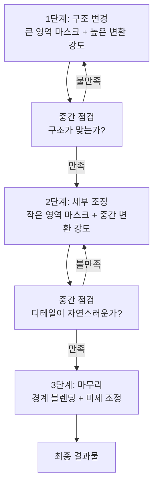
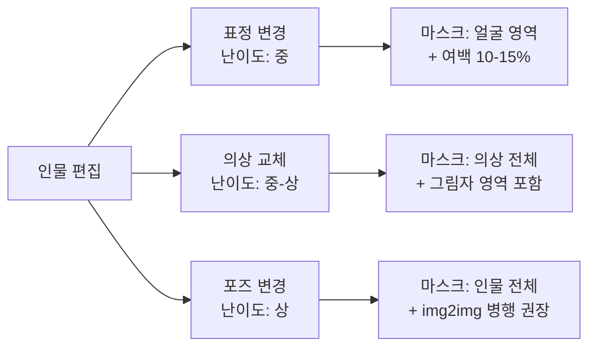
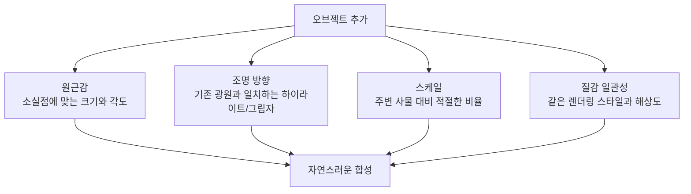
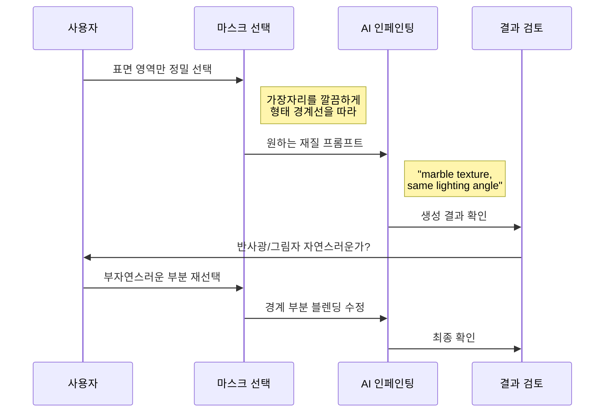
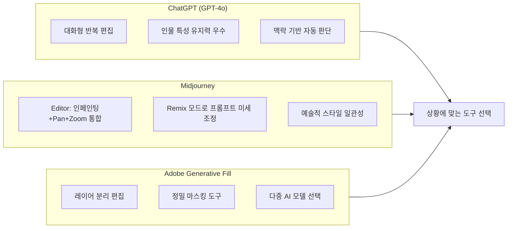

# 인페인팅 고급 — 복잡한 편집 시나리오

> 인물 표정·포즈 변경부터 의상 교체, 배경 오브젝트 조작까지 — 반복 인페인팅으로 완벽에 가까워지는 고급 편집 전략

## 개요

이 섹션에서는 [인페인팅 기초](06-ch6-이미지-편집-기법-img2img인페인팅아웃페인팅/02-02-인페인팅-기초-부분-수정의-기술.md)에서 배운 마스크 선택과 기본 수정을 넘어, 실무에서 마주하는 **복잡한 편집 시나리오**를 다룹니다. 한 번의 인페인팅으로 완벽한 결과를 기대하기보다, 여러 단계에 걸쳐 점진적으로 이미지를 개선하는 **반복 인페인팅(Iterative Inpainting)** 전략이 핵심입니다.

**선수 지식**: 인페인팅의 기본 개념(마스크, 부분 수정), ChatGPT Select 도구, Midjourney Vary Region, Adobe Generative Fill의 기초 사용법
**학습 목표**:
- 인물의 표정, 포즈, 의상을 자연스럽게 변경할 수 있다
- 배경 오브젝트를 추가하거나 제거하면서 전체 조화를 유지할 수 있다
- 반복 인페인팅 전략으로 복잡한 편집을 단계적으로 완성할 수 있다
- 플랫폼별 고급 인페인팅 기능의 장단점을 비교하고 적합한 도구를 선택할 수 있다

## 왜 알아야 할까?

기초 인페인팅은 "배경의 물체 하나를 지우기"처럼 단순한 작업에 적합합니다. 하지만 실무에서는 훨씬 까다로운 요구가 쏟아지죠.

"이 모델의 표정을 밝은 미소로 바꿔주세요", "의상을 여름 컬렉션으로 교체해주세요", "배경에 카페 인테리어를 추가하되 조명은 유지해주세요" — 이런 요청은 단순 마스킹만으로는 해결하기 어렵습니다. 영역 간의 **조명 일관성**, **그림자와 반사**, **질감의 연속성**까지 고려해야 하거든요.

고급 인페인팅은 디자이너에게 "포토샵 전문가 수준의 리터치를 AI 대화 한두 번으로 끝내는 능력"을 선사합니다. 촬영을 다시 하지 않고도, 외주를 맡기지 않고도, 복잡한 이미지 편집을 스스로 해결할 수 있게 되는 거죠.

## 핵심 개념

### 개념 1: 반복 인페인팅 전략 — 한 입씩 먹는 코끼리

> 💡 **비유**: 코끼리를 한 입에 삼킬 수 없듯이, 복잡한 이미지 편집도 한 번에 완성할 수 없습니다. "큰 뼈대부터 잡고 → 세부 사항을 다듬고 → 마무리를 가다듬는" 3단계 접근이 핵심이에요. 마치 화가가 밑그림을 그리고, 채색하고, 디테일을 잡는 과정과 같습니다.

반복 인페인팅(Iterative Inpainting)은 하나의 복잡한 편집을 **여러 번의 작은 편집**으로 나누어 진행하는 전략입니다. AI 인페인팅 기술의 내부 구조도 실제로 이 원리를 따르는데요 — 최신 연구에 따르면 고품질 인페인팅 모델은 "coarse-to-fine(거칠게→세밀하게)" 프레임워크를 사용하여, 먼저 전체적인 구조를 채운 뒤 텍스처 디테일을 반복적으로 최적화합니다.

> 📊 **그림 1**: 반복 인페인팅의 3단계 전략

**3단계 실전 프로세스:**

| 단계 | 목표 | 마스크 크기 | 프롬프트 스타일 |
|------|------|------------|----------------|
| **1단계 — 구조 잡기** | 전체적인 형태·포즈·배치 변경 | 이미지의 30-50% | 구체적이고 서술적 |
| **2단계 — 세부 다듬기** | 디테일, 질감, 색상 조정 | 이미지의 10-20% | 짧고 명확 |
| **3단계 — 경계 정리** | 편집 영역과 원본의 자연스러운 블렌딩, 경계선 매끄럽게 연결 | 이미지의 5-10% | 최소한의 지시 또는 빈 프롬프트 |

> 🔥 **실무 팁**: Midjourney에서 반복 인페인팅을 할 때는 **Remix 모드를 켜두세요**. 각 단계에서 프롬프트를 수정할 수 있어, 점진적 개선이 훨씬 수월합니다. 짧고 직접적인 프롬프트가 기존 이미지와 잘 어우러집니다.

---

### 개념 2: 인물 편집 — 표정, 포즈, 의상 변경

> 💡 **비유**: 인물 편집은 인형에 옷을 갈아입히는 것과 비슷하지만, 한 가지 더 어려운 점이 있습니다. 옷을 바꾸면 그림자도 바뀌고, 주름 방향도 달라지고, 피부에 비치는 색 반사까지 변해야 자연스럽거든요. AI 인페인팅은 이 모든 것을 **맥락을 이해하며** 처리합니다.

인물 편집은 고급 인페인팅에서 가장 자주 요청되는 시나리오입니다. 크게 세 가지 유형으로 나뉘는데요.

> 📊 **그림 2**: 인물 편집의 3대 유형과 난이도

**표정 변경**

표정 변경은 상대적으로 안전한 편집입니다. 얼굴 영역만 마스크하면 되고, 나머지 이미지는 그대로 유지되니까요.

- **ChatGPT**: "이 사람의 표정을 밝은 미소로 바꿔주세요. 눈과 입 주변을 자연스럽게 변경해주세요"처럼 자연어로 지시합니다. GPT-4o의 네이티브 이미지 생성은 인물의 얼굴 특징(likeness)을 유지하면서 표정만 변경하는 데 뛰어납니다.
- **Adobe Generative Fill**: 올가미 도구로 얼굴을 정밀하게 선택한 뒤, "warm smile, natural lighting"처럼 프롬프트를 입력합니다. 생성된 결과가 별도 레이어에 나타나므로 불투명도를 조절하며 자연스러움을 미세 조정할 수 있어요.

**의상 교체**

의상 교체는 표정 변경보다 까다롭습니다. 의상의 실루엣, 질감, 그림자가 모두 바뀌어야 하거든요.

- 마스크를 의상 영역보다 **15-20% 넓게** 잡으세요. 특히 소매와 어깨 라인, 그림자가 드리워지는 영역까지 포함해야 합니다.
- "blue silk dress with subtle pleats, soft shadows" 같은 프롬프트에서 **재질과 조명 힌트**를 함께 넣으면 훨씬 자연스럽습니다.
- 한 번에 완전한 의상 교체보다는, **상의 → 하의 → 악세서리** 순서로 나누어 인페인팅하면 각 단계의 일관성을 유지하기 쉽습니다.

**포즈 변경**

포즈 변경은 가장 어려운 편집 유형입니다. 인물 전체의 형태가 바뀌므로, 인페인팅만으로는 한계가 있을 수 있어요.

- 작은 포즈 변경(팔 각도, 고개 방향)은 인페인팅으로 가능합니다.
- 전체 포즈 변경은 [img2img 변환](06-ch6-이미지-편집-기법-img2img인페인팅아웃페인팅/01-01-img2img-이미지-기반-변환의-원리.md)과 인페인팅을 **조합**하는 것이 효과적입니다.
- Midjourney에서는 포즈 참조 이미지를 활용하는 것이 더 나은 결과를 만들어 냅니다. [Ch7의 포즈 제어](07-ch7-controlnet과-참조-이미지-활용/03-03-포즈-제어-openpose와-인물-생성.md)에서 이 기법을 자세히 다룹니다.

---

### 개념 3: 배경 오브젝트 조작 — 추가와 제거의 기술

> 💡 **비유**: 무대 위에 소품을 놓거나 치우는 것과 같습니다. 하지만 무대와 달리, AI 이미지에서는 소품을 놓으면 바닥에 그림자가 자동으로 생기고, 주변 물체에 반사광이 비쳐야 자연스러워요. AI 인페인팅은 이런 "물리적 일관성"을 이해하고 처리합니다.

**오브젝트 제거 — "없었던 것처럼"**

오브젝트 제거는 인페인팅의 가장 클래식한 활용입니다. 핵심은 **제거 후 빈 공간을 무엇으로 채울지** AI에게 충분한 맥락을 주는 것이에요.

- 마스크를 오브젝트보다 **약간 넓게** 잡아야 오브젝트의 그림자와 반사까지 깨끗하게 제거됩니다.
- ChatGPT에서는 "이 테이블 위의 컵을 제거하고, 나무 테이블 표면이 자연스럽게 이어지게 해주세요"처럼 **채울 내용을 명시**하면 결과가 좋습니다.
- Adobe Generative Fill에서 프롬프트를 **비워두고** 생성하면 주변 맥락에 맞춰 자동으로 채웁니다.

**오브젝트 추가 — "원래 있었던 것처럼"**

오브젝트 추가가 제거보다 까다로운 이유는 새 오브젝트가 기존 장면의 **원근감, 조명 방향, 스케일**과 맞아야 하기 때문입니다.

> 📊 **그림 3**: 오브젝트 추가 시 고려해야 할 4가지 요소

**플랫폼별 오브젝트 추가 전략:**

| 플랫폼 | 접근법 | 장점 |
|--------|--------|------|
| **ChatGPT** | 자연어로 위치·크기·스타일 설명 | 복잡한 설명을 대화로 점진적 조정 |
| **Midjourney Vary Region** | 영역 선택 + Remix 프롬프트 | 예술적 스타일 일관성 우수 |
| **Adobe Generative Fill** | 정밀 마스크 + 참조 이미지 | 레이어 분리, 후처리 유연성 |

---

### 개념 4: 텍스처와 재질 수정 — 표면을 바꾸는 마법

> 💡 **비유**: 집 인테리어에서 벽지를 바꾸는 것과 비슷합니다. 벽지만 바꿨는데 방의 전체 분위기가 달라지죠? 이미지에서 텍스처를 바꾸는 것도 마찬가지예요. 벽돌 벽을 대리석으로, 가죽 소파를 벨벳으로 바꾸면 전체 이미지의 무드가 변합니다.

텍스처 수정은 오브젝트의 **형태는 유지하면서 표면 질감만 변경**하는 기법입니다. 인페인팅의 강점이 가장 빛나는 영역이기도 하죠.

> 📊 **그림 4**: 텍스처 수정의 워크플로우

**텍스처 수정의 핵심 원칙:**

1. **형태 경계선을 정확하게 따르세요**: 마스크가 오브젝트의 윤곽을 벗어나면 형태 자체가 변형됩니다.
2. **조명 방향을 프롬프트에 포함하세요**: "same lighting direction", "consistent highlights" 같은 힌트가 자연스러운 결과를 만듭니다.
3. **반복 수정으로 경계를 다듬으세요**: 첫 번째 인페인팅 후 텍스처 경계가 부자연스럽다면, 경계 영역만 좁게 마스크하여 2차 인페인팅을 합니다.

---

### 개념 5: 플랫폼별 고급 기능 비교

각 플랫폼은 고급 인페인팅에서 서로 다른 강점을 보입니다. 어떤 편집이냐에 따라 최적의 도구가 달라지죠.

> 📊 **그림 5**: 플랫폼별 고급 인페인팅 강점 비교

**ChatGPT (GPT-4o)**: 2025년부터 GPT-4o의 네이티브 이미지 생성 엔진(gpt-image-1)은 편집 시 인물의 외모 일관성을 유지하면서도 요청한 부분만 정확히 변경하는 능력이 크게 향상되었습니다. 대화 맥락을 유지하므로, "조금 더 밝게", "그림자를 자연스럽게" 같은 반복 수정이 매우 직관적이에요.

**Midjourney Editor**: Midjourney의 웹 에디터(Editor)는 Remix, 인페인팅(Vary Region), Pan, Zoom Out을 **하나의 통합 작업 공간**에서 조합하여 사용할 수 있는 도구입니다. 여러 편집 도구를 연속으로 적용할 수 있어, 복잡한 편집 워크플로우에 강점을 보여요. 여기서는 인페인팅 관점에서 간략히 소개하지만, Editor의 Pan·Zoom Out 기능을 활용한 캔버스 확장은 [아웃페인팅](06-ch6-이미지-편집-기법-img2img인페인팅아웃페인팅/04-04-아웃페인팅-캔버스-확장과-구도-재구성.md)에서 더 자세히 다룹니다.

**Adobe Generative Fill**: 2026년 초 업데이트로 Generative Fill에 **다중 AI 모델**(Firefly, Flux, Gemini 기반 등)을 선택할 수 있게 되었습니다. 리얼리스틱한 텍스처에는 Flux, 스타일라이즈된 출력에는 다른 모델을 쓰는 식으로 시나리오에 최적화할 수 있죠. 모든 생성 결과가 **별도 레이어**에 나타나므로 불투명도, 블렌딩 모드 조절이 가능합니다.

| 편집 시나리오 | 추천 플랫폼 | 이유 |
|--------------|------------|------|
| 인물 표정/의상 변경 | **ChatGPT** | 인물 특성 유지력, 대화형 반복 수정 |
| 예술적 이미지의 부분 수정 | **Midjourney** | 스타일 일관성, Remix 모드 |
| 정밀한 오브젝트 조작 | **Adobe** | 레이어 분리, 정밀 마스킹, 후처리 유연성 |
| 텍스처/재질 변경 | **Adobe** | 정밀한 경계 선택, 다중 모델 |
| 복잡한 다단계 편집 | **ChatGPT + Adobe 조합** | 초안은 ChatGPT, 정밀 마무리는 Adobe |

> ⚠️ **흔한 오해**: "Midjourney Vary Region은 기본 인페인팅이라 고급 편집에 부적합하다" — 실제로는 Remix 모드와 Editor를 조합하면 매우 정밀한 편집이 가능합니다. 핵심은 영역을 20-50% 범위로 잡고, 짧고 직접적인 프롬프트를 사용하는 것이에요.

## 실습: 적용해보기

### 활동 1: 반복 인페인팅 실전 — "인물 리스타일링"

다음 시나리오를 3단계 반복 인페인팅으로 실행해 보세요.

**시나리오**: 캐주얼 복장의 인물 사진을 비즈니스 프로필 사진으로 변환

| 단계 | 작업 | 플랫폼 | 프롬프트 예시 |
|------|------|--------|-------------|
| 1단계 | 의상을 비즈니스 정장으로 교체 | ChatGPT 또는 Adobe | "네이비 비즈니스 수트, 화이트 셔츠, 자연스러운 주름" |
| 2단계 | 배경을 오피스 환경으로 변경 | 동일 플랫폼 | "모던 오피스 배경, 소프트 보케, 전문적 느낌" |
| 3단계 | 조명과 색감 통일 | Adobe | 경계 영역 재선택 → 블렌딩 수정 |

**평가 체크리스트:**
- [ ] 의상의 그림자가 조명 방향과 일치하는가?
- [ ] 인물의 얼굴과 손이 변형 없이 유지되었는가?
- [ ] 배경과 인물 사이의 경계가 자연스러운가?
- [ ] 전체 이미지의 색온도가 일관적인가?

### 활동 2: 비교 분석 — "같은 편집, 다른 도구"

하나의 이미지에 동일한 편집(예: 테이블 위 꽃병 추가)을 세 플랫폼에서 각각 시도하고, 아래 표를 채워보세요.

| 평가 기준 | ChatGPT | Midjourney | Adobe |
|-----------|---------|------------|-------|
| 오브젝트 품질 (1-5) | | | |
| 조명 일관성 (1-5) | | | |
| 그림자 자연스러움 (1-5) | | | |
| 작업 시간 | | | |
| 추가 수정 필요 여부 | | | |

### 토론 질문

1. 의상 교체 인페인팅에서 "그림자 영역까지 마스크에 포함하라"는 원칙이 왜 중요한지, 포함하지 않았을 때 어떤 문제가 발생하는지 구체적으로 설명해보세요.
2. 반복 인페인팅에서 "큰 변경 먼저, 작은 변경 나중에" 순서가 반대가 되면 어떤 문제가 생길까요?

## 더 깊이 알아보기

### 인페인팅의 학술적 진화 — "빈 캔버스를 채우는 AI의 역사"

인페인팅이라는 용어는 원래 미술 복원 분야에서 왔습니다. 손상된 프레스코화나 유화의 빈 부분을 원본과 구분할 수 없게 복원하는 기술이었죠. 르네상스 시대 이탈리아의 복원가들이 이 기법을 처음 체계화했는데, "inpainting"이라는 영어 단어 자체가 "안쪽을 채워 그리다(painting inward)"에서 유래했습니다.

디지털 인페인팅의 역사적 전환점은 2000년 마르첼로 베르탈미오(Marcelo Bertalmio)와 동료들이 발표한 논문 "Image Inpainting"입니다. 이 논문은 편미분 방정식(PDE)을 사용해 이미지의 빈 영역을 수학적으로 채우는 방법을 제안했고, 이후 모든 디지털 인페인팅 연구의 토대가 되었죠.

2020년대에 들어서면서 딥러닝 기반 인페인팅은 "two-stage(2단계)" 프레임워크가 주류가 되었습니다. 첫 번째 단계에서 거친 구조를 채우고, 두 번째 단계에서 텍스처 디테일을 정교하게 만드는 방식이에요. 지금 ChatGPT나 Midjourney에서 "한 번의 클릭으로" 인페인팅을 하는 것도, 내부적으로는 이 다단계 파이프라인이 자동으로 돌아가고 있는 겁니다.

> 💡 **알고 계셨나요?**: Adobe의 Content-Aware Fill(2010년 Photoshop CS5)은 상용 소프트웨어 최초의 AI 인페인팅 기능이었습니다. 당시 시연 영상이 YouTube에서 수백만 조회를 기록하며 "마법 같다"는 반응을 얻었죠. 지금의 Generative Fill은 그 Content-Aware Fill의 정신적 후계자이면서도, 텍스트 프롬프트로 **무엇을 채울지 지정**할 수 있다는 혁신적 차이가 있습니다.

## 흔한 오해와 팁

> ⚠️ **흔한 오해**: "마스크를 최대한 정확하게, 딱 맞게 그려야 좋은 결과가 나온다" — 사실은 반대입니다! 마스크를 대상보다 **10-20% 넓게** 잡아야 AI가 주변 맥락을 참고하여 자연스러운 경계를 만들 수 있어요. 너무 딱 맞게 그리면 오히려 편집 경계가 눈에 띄는 "가위로 오린 듯한" 결과가 나옵니다.

> 💡 **알고 계셨나요?**: Midjourney의 "빈 캔버스에서 시작하기" 테크닉이 인페인팅 고수들 사이에서 화제입니다. 거의 빈 이미지에서 시작하여, Vary Region으로 대형 요소를 먼저 배치하고, 점점 작은 디테일(반사, 그림자까지)을 추가하는 방식으로 한 장의 복잡한 이미지를 단계적으로 "조립"하는 거예요. 마치 레고 블록을 쌓듯 이미지를 만드는 새로운 창작 방법론입니다.

> 🔥 **실무 팁**: 복잡한 편집을 할 때는 **편집 순서가 결과를 좌우합니다**. 항상 "뒤에서 앞으로(back-to-front)" 순서를 지키세요. 배경 먼저 수정하고 → 중경의 오브젝트를 다루고 → 마지막에 전경의 인물을 편집하는 겁니다. 전경을 먼저 수정하면, 이후 배경 수정 시 전경 요소와의 조명 불일치가 발생할 수 있어요.

> 🔥 **실무 팁**: Adobe Generative Fill을 사용할 때 결과가 마음에 들지 않으면, 같은 프롬프트로 **3번까지 바리에이션**을 생성해보세요. 각 바리에이션이 별도 레이어에 생성되므로, 서로 다른 바리에이션의 장점을 레이어 마스킹으로 조합할 수도 있습니다.

## 핵심 정리

| 개념 | 설명 |
|------|------|
| **반복 인페인팅** | 복잡한 편집을 구조→세부→마무리 3단계로 나누어 점진적으로 완성하는 전략 |
| **인물 표정 변경** | 얼굴 영역 마스크 + 여백 10-15%. ChatGPT가 인물 특성 유지에 강점 |
| **의상 교체** | 의상+그림자 영역까지 마스크. 상의→하의→악세서리 순서로 분할 편집 |
| **포즈 변경** | 작은 변경은 인페인팅, 큰 변경은 img2img + 인페인팅 조합 |
| **오브젝트 제거** | 대상보다 넓은 마스크 + 채울 내용 명시 또는 빈 프롬프트 |
| **오브젝트 추가** | 원근감, 조명 방향, 스케일, 질감 일관성 4요소 확인 |
| **텍스처 수정** | 형태 경계선 정확히 따르기 + 조명 방향 프롬프트에 포함 |
| **편집 순서 원칙** | 뒤(배경)에서 앞(전경)으로, 큰 변경에서 작은 변경으로 |

## 다음 섹션 미리보기

인페인팅이 이미지 "안쪽"을 수정하는 기법이라면, 다음에 배울 [아웃페인팅](06-ch6-이미지-편집-기법-img2img인페인팅아웃페인팅/04-04-아웃페인팅-캔버스-확장과-구도-재구성.md)은 이미지 "바깥쪽"으로 확장하는 기법입니다. 좁은 구도의 인물 사진을 와이드 풍경으로 확장하거나, 세로 이미지를 가로 배너로 변환하는 등 — 캔버스의 경계를 넘어서는 창의적 편집을 다룹니다.

## 참고 자료

- [Midjourney Vary Region 공식 문서](https://docs.midjourney.com/hc/en-us/articles/32794723105549-Vary-Region) - Vary Region의 기능, 선택 크기 권장 사항, Remix 모드 연동 방법
- [Midjourney Editor 공식 문서](https://docs.midjourney.com/hc/en-us/articles/32764383466893-Editor) - 인페인팅, Pan, Zoom Out을 통합한 웹 에디터의 모든 기능
- [Adobe Generative Fill 공식 페이지](https://www.adobe.com/products/photoshop/generative-fill.html) - Generative Fill의 최신 기능, 다중 모델 지원, 레이어 기반 편집
- [Beginner's Guide to Inpainting — Stable Diffusion Art](https://stable-diffusion-art.com/inpainting_basics/) - 인페인팅의 기초부터 고급 기법까지 포괄적인 가이드
- [ChatGPT Image Generation Complete Guide — Superhuman AI](https://www.superhuman.ai/c/a-complete-guide-to-chatgpt-image-generation-in-2025) - GPT-4o 이미지 편집 기능의 전체 가이드
- [Deep Learning-based Image and Video Inpainting: A Survey (2024)](https://arxiv.org/html/2401.03395v1) - 딥러닝 인페인팅의 학술적 발전사와 최신 프레임워크 정리

---
### 🔗 Related Sessions
- [img2img](06-ch6-이미지-편집-기법-img2img인페인팅아웃페인팅/01-01-img2img-이미지-기반-변환의-원리.md) (prerequisite)
- [vary region](05-ch5-midjourney-기본과-파라미터-튜닝/01-01-midjourney-인터페이스와-기본-생성.md) (prerequisite)
- [generative fill](06-ch6-이미지-편집-기법-img2img인페인팅아웃페인팅/02-02-인페인팅-기초-부분-수정의-기술.md) (prerequisite)
