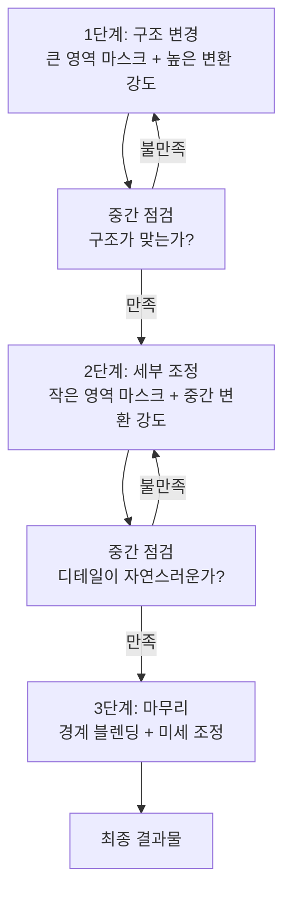
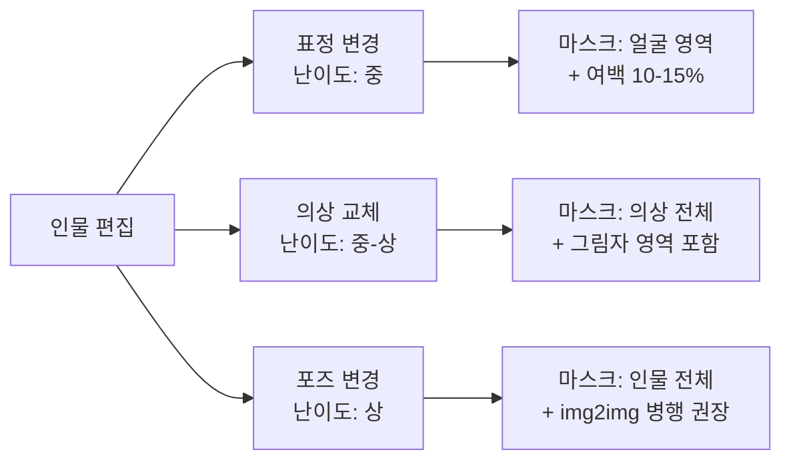

# 인페인팅 고급 — 복잡한 편집 시나리오

> 인물 표정·포즈 변경부터 의상 교체, 배경 오브젝트 조작까지 — 반복 인페인팅으로 완벽에 가까워지는 고급 편집 전략

## 개요

[인페인팅 기초](06-ch6-이미지-편집-기법-img2img인페인팅아웃페인팅/02-02-인페인팅-기초-부분-수정의-기술.md)에서 배운 마스크 선택과 기본 수정을 넘어, 실무에서 마주하는 **복잡한 편집 시나리오**를 다룹니다. "표정을 밝은 미소로 바꿔주세요", "의상을 여름 컬렉션으로 교체해주세요" 같은 요청은 영역 간의 **조명 일관성**, **그림자와 반사**, **질감의 연속성**까지 고려해야 하므로, 한 번의 인페인팅으로 완벽한 결과를 기대하기보다 여러 단계에 걸쳐 점진적으로 이미지를 개선하는 **반복 인페인팅(Iterative Inpainting)** 전략이 핵심입니다.

## 핵심 개념

### 반복 인페인팅 전략

> 비유: 화가가 밑그림을 그리고, 채색하고, 디테일을 잡는 과정처럼 — 복잡한 이미지 편집도 "큰 뼈대 → 세부 사항 → 마무리" 3단계로 나누어야 합니다.



| 단계 | 목표 | 마스크 크기 | 프롬프트 스타일 |
|------|------|------------|----------------|
| **1단계 — 구조 잡기** | 전체적인 형태·포즈·배치 변경 | 이미지의 30-50% | 구체적이고 서술적 |
| **2단계 — 세부 다듬기** | 디테일, 질감, 색상 조정 | 이미지의 10-20% | 짧고 명확 |
| **3단계 — 경계 정리** | 편집 영역과 원본의 자연스러운 블렌딩 | 이미지의 5-10% | 최소한의 지시 또는 빈 프롬프트 |

**반복 인페인팅 실전 예시 — 캐주얼 인물을 비즈니스 프로필로 변환:**

1단계: 의상 구조 변경

```
이 인물의 캐주얼 티셔츠를 네이비 비즈니스 수트와 화이트 셔츠로 교체해주세요.
자연스러운 주름과 어깨 라인을 유지해주세요.
```


2단계: 배경 교체

```
배경을 모던 오피스 환경으로 변경해주세요.
유리 파티션과 소프트 보케 효과, 자연광이 들어오는 전문적인 느낌으로.
```


3단계: 경계 블렌딩

```
인물과 배경 사이의 경계를 자연스럽게 다듬어주세요.
색온도와 조명 방향을 통일해주세요.
```


---

### 인물 편집 — 표정, 의상, 포즈



**표정 변경** — 얼굴 영역만 마스크하며, 나머지는 그대로 유지합니다.

```
이 사람의 표정을 밝고 자신감 있는 미소로 바꿔주세요.
눈과 입 주변을 자연스럽게 변경하고, 나머지 얼굴 특징은 유지해주세요.
```


```
이 인물의 시선을 카메라 정면으로 바꾸고, 살짝 미소 짓는 표정으로 변경해주세요.
피부톤과 조명은 그대로 유지해주세요.
```


**의상 교체** — 마스크를 의상보다 15-20% 넓게 잡고, 그림자 영역까지 포함합니다.

```
이 인물의 상의를 아이보리 실크 블라우스로 교체해주세요.
부드러운 주름과 자연스러운 그림자를 포함하고, 기존 조명 방향을 유지해주세요.
```


```
하의를 차콜 슬랙스로 변경해주세요. 상의와 어울리는 톤으로,
허리 라인과 주름이 자연스럽게 이어지도록 해주세요.
```


**포즈 변경** — 작은 변경(팔 각도, 고개 방향)은 인페인팅으로 가능하지만, 전체 포즈 변경은 [img2img 변환](06-ch6-이미지-편집-기법-img2img인페인팅아웃페인팅/01-01-img2img-이미지-기반-변환의-원리.md)과 조합하는 것이 효과적입니다.

```
이 인물의 오른팔을 자연스럽게 허리에 올린 포즈로 변경해주세요.
손 모양과 소매 주름이 자연스럽게 보이도록 해주세요.
```


---

### 배경 오브젝트 조작 — 추가와 제거

**오브젝트 제거** — 마스크를 대상보다 약간 넓게 잡아 그림자와 반사까지 제거합니다.

```
이 테이블 위의 커피잔과 접시를 제거하고,
나무 테이블 표면이 자연스럽게 이어지도록 해주세요.
```


Adobe Generative Fill에서는 프롬프트를 **비워두고** 생성하면 주변 맥락에 맞춰 자동으로 채웁니다.

**오브젝트 추가** — 원근감, 조명 방향, 스케일, 질감 일관성을 맞춰야 합니다.

```
테이블 오른쪽에 작은 화분을 추가해주세요.
다육식물이 심긴 흰색 세라믹 화분으로, 기존 조명 방향에 맞는 그림자를 포함해주세요.
```


```
벽면에 미니멀한 액자를 2개 추가해주세요.
흑백 사진이 들어간 얇은 검정 프레임으로, 벽면 질감과 어울리게 해주세요.
```


---

### 텍스처와 재질 수정

텍스처 수정은 오브젝트의 **형태는 유지하면서 표면 질감만 변경**하는 기법입니다. 핵심 원칙 세 가지:

1. **형태 경계선을 정확하게 따르세요** — 마스크가 윤곽을 벗어나면 형태가 변형됩니다
2. **조명 방향을 프롬프트에 포함하세요** — "same lighting direction" 같은 힌트가 자연스러운 결과를 만듭니다
3. **경계를 반복 수정하세요** — 텍스처 경계가 부자연스러우면 그 영역만 좁게 마스크하여 2차 인페인팅

```
이 소파의 재질을 가죽에서 네이비 벨벳으로 변경해주세요.
기존 조명 방향과 일치하는 하이라이트를 유지하고, 벨벳 특유의 부드러운 광택을 표현해주세요.
```


```
바닥의 원목 마루를 대리석 타일로 변경해주세요.
흰색 대리석에 은은한 회색 결이 있는 패턴으로, 기존 공간의 조명 반사를 유지해주세요.
```


---

### 플랫폼별 고급 기능 비교

**ChatGPT (GPT-4o)**: 대화 맥락을 유지하므로 "조금 더 밝게", "그림자를 자연스럽게" 같은 반복 수정이 직관적입니다. 인물의 외모 일관성 유지에 강합니다.

**Midjourney Editor**: Remix, Vary Region, Pan, Zoom Out을 하나의 통합 작업 공간에서 조합할 수 있습니다. 영역을 20-50% 범위로 잡고 짧은 프롬프트를 쓰는 것이 핵심입니다.

**Adobe Generative Fill**: 다중 AI 모델 선택이 가능하고, 모든 결과가 별도 레이어에 생성되어 불투명도와 블렌딩 모드 조절이 가능합니다.

| 편집 시나리오 | 추천 플랫폼 | 이유 |
|--------------|------------|------|
| 인물 표정/의상 변경 | **ChatGPT** | 인물 특성 유지력, 대화형 반복 수정 |
| 예술적 이미지의 부분 수정 | **Midjourney** | 스타일 일관성, Remix 모드 |
| 정밀한 오브젝트 조작 | **Adobe** | 레이어 분리, 정밀 마스킹 |
| 텍스처/재질 변경 | **Adobe** | 정밀한 경계 선택, 다중 모델 |
| 복잡한 다단계 편집 | **ChatGPT + Adobe** | 초안은 ChatGPT, 정밀 마무리는 Adobe |

## 팁과 주의사항

- **마스크는 10-20% 넓게** 잡으세요. 너무 딱 맞게 그리면 "가위로 오린 듯한" 경계가 생깁니다.
- **편집 순서는 뒤에서 앞으로**: 배경 → 중경 오브젝트 → 전경 인물 순서를 지키세요. 전경을 먼저 수정하면 이후 배경 수정 시 조명 불일치가 발생합니다.
- **Midjourney Remix 모드를 켜두세요**: 반복 인페인팅 시 각 단계에서 프롬프트를 수정할 수 있어 점진적 개선이 수월합니다.
- **Adobe에서는 같은 프롬프트로 3번까지 바리에이션**을 생성해보세요. 각 바리에이션의 장점을 레이어 마스킹으로 조합할 수 있습니다.
- **의상 교체 시 그림자 영역까지 마스크에 포함**하세요. 포함하지 않으면 이전 의상의 그림자가 남아 부자연스럽습니다.

## 핵심 정리

| 개념 | 설명 |
|------|------|
| **반복 인페인팅** | 복잡한 편집을 구조 → 세부 → 마무리 3단계로 나누어 점진적으로 완성 |
| **인물 표정 변경** | 얼굴 영역 마스크 + 여백 10-15%. ChatGPT가 인물 특성 유지에 강점 |
| **의상 교체** | 의상 + 그림자 영역까지 마스크. 상의 → 하의 → 악세서리 순서로 분할 편집 |
| **포즈 변경** | 작은 변경은 인페인팅, 큰 변경은 img2img + 인페인팅 조합 |
| **오브젝트 제거** | 대상보다 넓은 마스크 + 채울 내용 명시 또는 빈 프롬프트 |
| **오브젝트 추가** | 원근감, 조명 방향, 스케일, 질감 일관성 4요소 확인 |
| **텍스처 수정** | 형태 경계선 정확히 따르기 + 조명 방향 프롬프트에 포함 |
| **편집 순서 원칙** | 뒤(배경)에서 앞(전경)으로, 큰 변경에서 작은 변경으로 |

## 다음 섹션 미리보기

인페인팅이 이미지 "안쪽"을 수정하는 기법이라면, 다음에 배울 [아웃페인팅](06-ch6-이미지-편집-기법-img2img인페인팅아웃페인팅/04-04-아웃페인팅-캔버스-확장과-구도-재구성.md)은 이미지 "바깥쪽"으로 확장하는 기법입니다. 좁은 구도의 인물 사진을 와이드 풍경으로 확장하거나, 세로 이미지를 가로 배너로 변환하는 등 캔버스의 경계를 넘어서는 창의적 편집을 다룹니다.
