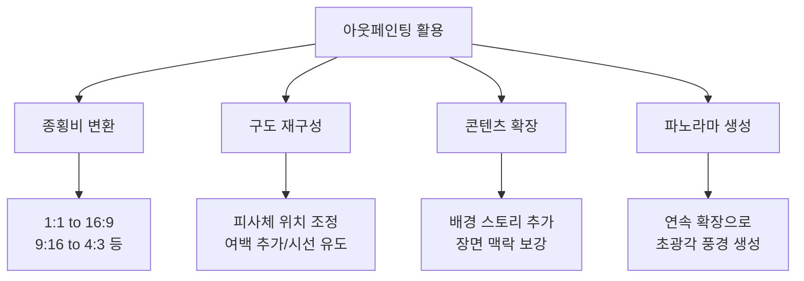
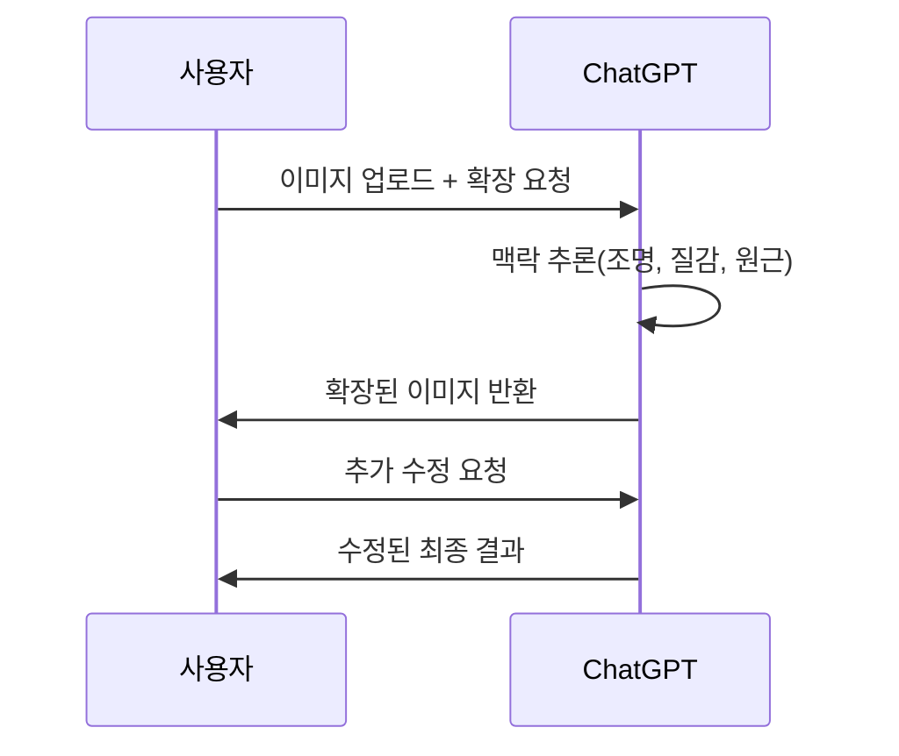
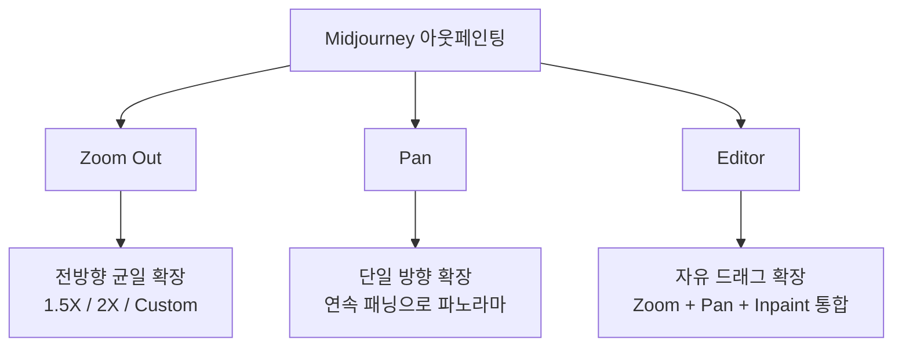

# 아웃페인팅 — 캔버스 확장과 구도 재구성

> 이미지 경계 너머의 세계를 AI로 그려내는 캔버스 확장 기법

## 개요

아웃페인팅(Outpainting)은 이미지의 경계를 넘어 캔버스를 확장하며, 기존 이미지와 자연스럽게 연결되는 새로운 콘텐츠를 생성하는 기법입니다. 인페인팅이 이미지 **내부**를 수정한다면, 아웃페인팅은 이미지 **바깥**으로 확장합니다. 멀티 플랫폼 시대에 하나의 비주얼 에셋을 다양한 크기로 변환해야 하는 디자이너에게 필수 기술이며, AI가 색감, 조명, 질감, 원근감을 이해하고 경계 너머를 자연스럽게 그려주므로 종횡비 변환과 구도 재구성이 몇 번의 클릭으로 가능해집니다.

## 핵심 개념

### AI가 분석하는 요소

아웃페인팅이 자연스러운 결과를 만들기 위해 AI가 분석하는 요소들입니다:

| 분석 요소 | 설명 | 예시 |
|-----------|------|------|
| **원근감(Perspective)** | 소실점과 깊이감 연장 | 도로가 멀어지는 방향 유지 |
| **조명(Lighting)** | 광원의 방향과 강도 | 그림자 방향 일관성 |
| **질감(Texture)** | 표면 패턴의 연속성 | 벽돌 패턴이 자연스럽게 이어짐 |
| **색상 팔레트** | 색조, 채도, 명도의 전체 흐름 | 하늘 그라데이션 연장 |
| **대기 원근** | 거리에 따른 색감/선명도 변화 | 먼 산일수록 흐릿하고 푸르게 |
| **의미(Semantics)** | 장면의 맥락과 논리적 일관성 | 실내라면 벽과 가구, 해변이면 모래와 파도 |

### 4대 활용 시나리오

> 비유: 아웃페인팅은 영화 촬영에서 "카메라를 뒤로 빼주세요"라고 말하는 것과 같습니다. 같은 장면이지만 더 넓은 시야를 보여주는 것이죠.

**1. 종횡비 변환**: 인스타그램 정사각형(1:1)을 유튜브 썸네일(16:9)로, 세로 사진을 가로 배너로 변환할 때 빈 영역을 AI가 채웁니다.

**2. 구도 재구성**: 피사체가 너무 가운데 있거나 여백이 부족할 때, 한쪽 방향으로 확장하여 삼분법에 맞는 구도로 재배치합니다.

**3. 콘텐츠 확장**: 인물 클로즈업에서 주변 환경을 보여주거나, 정물 사진에 더 넓은 장면을 추가합니다.

**4. 파노라마 생성**: 한 방향으로 반복 확장하여 초광각 파노라마를 만듭니다.

## ChatGPT 아웃페인팅

ChatGPT의 GPT-4o는 오토리그레시브 방식으로 이미지의 맥락을 깊이 이해하고 확장합니다. 자연어로 원하는 확장을 설명하면 되므로 가장 직관적입니다.

**실전 프롬프트 예시**:

**프롬프트 1** — 기본 종횡비 변환:

> "이 정사각형 이미지를 16:9 가로 비율로 확장해주세요. 양쪽 배경을 같은 스타일과 조명을 유지하면서 자연스럽게 이어주세요."

**프롬프트 2** — 스토리 확장:

> "이 인물 사진을 왼쪽으로 확장해서, 인물이 앉아 있는 카페의 넓은 내부가 보이도록 해주세요. 따뜻한 조명과 나무 인테리어 스타일을 유지해주세요."

**프롬프트 3** — 텍스트 여백 확보:

> "이 제품 사진 상단에 텍스트를 넣을 수 있도록 여백 공간을 만들어주세요. 배경 색감과 그라데이션을 자연스럽게 이어주세요."

**프롬프트 4** — 반복 수정 대화:

> 1차: "이 풍경 사진을 오른쪽으로 확장해주세요."
> 2차: "오른쪽 확장 부분에 작은 등대를 하나 추가해주세요."
> 3차: "등대 주변에 갈매기 두세 마리를 날려주세요."

## Midjourney 아웃페인팅 — Zoom Out, Pan, Editor

Midjourney는 세 가지 전문 도구를 제공합니다.

**Zoom Out**: 이미지 생성 후 전방향 균일 확장. 1.5X, 2X, 또는 Custom(1.0~2.0) 배율 선택 가능. Custom Zoom에서 프롬프트 변경으로 확장 영역 내용을 유도할 수 있습니다.

**Pan**: 특정 방향(상/하/좌/우)으로만 확장. 연속 패닝으로 파노라마 제작에 최적입니다.

**Editor**: midjourney.com 웹 에디터에서 Zoom Out, Pan, Vary Region을 한 화면에서 사용. 캔버스 모서리를 드래그하여 자유롭게 확장 범위를 지정합니다.

**실전 프롬프트 예시**:

**프롬프트 5** — Custom Zoom으로 장면 전환:

> 인물 클로즈업 생성 후 Custom Zoom 2X 적용, 프롬프트를 다음으로 변경:
> `a woman standing in a medieval castle courtyard, dramatic lighting --zoom 2`

**프롬프트 6** — Pan으로 파노라마 제작:

> 초기 프롬프트: `sunset over coastal cliffs, golden hour, wide landscape photography --ar 16:9`
> 이후 좌측 Pan 3회 + 우측 Pan 3회 연속 적용

**프롬프트 7** — Zoom Out으로 컨텍스트 추가:

> 초기 프롬프트: `close-up of a steaming coffee cup on a wooden table, morning light`
> Zoom Out 1.5X 적용 → 카페 테이블 전체가 드러남
> 다시 Zoom Out 1.5X → 카페 내부 전경 표시

**프롬프트 8** — Editor에서 비대칭 확장:

> Editor에서 오른쪽 모서리만 드래그하여 확장, 프롬프트에 추가:
> `extending into a lush garden with blooming flowers`

> 여러 번 Zoom Out하면 원본 영역도 재생성되어 디테일이 변할 수 있습니다. 중요한 디테일은 **2~3회 이내**에서 작업하세요.

## Photoshop Generative Expand

Adobe Photoshop의 Generative Expand는 Firefly AI 기반으로, Crop 도구와 결합된 정밀한 아웃페인팅을 제공합니다.

**사용 순서**: Crop 도구(C) 선택 → 경계 바깥으로 핸들 드래그 → Fill을 "Generative Expand"로 설정 → 프롬프트 입력(선택) → Generate 클릭 → 3개 변형 중 선택

| 특징 | 설명 |
|------|------|
| **비파괴 편집** | 원본 데이터 완전 보존 |
| **정밀 비율 제어** | 프리셋 종횡비 또는 픽셀 단위 지정 |
| **3개 변형 생성** | 매 생성마다 3가지 옵션 제공 |
| **2K 해상도** | 인쇄물에도 활용 가능 |
| **레이어 분리** | 확장 영역이 별도 레이어로 생성 |

**실전 워크플로우 예시**:

**프롬프트 9** — 정밀 종횡비 변환:

> Crop 도구에서 비율을 16:9로 설정 → 양쪽으로 확장 → 프롬프트 비워두고 Generate
> (풍경/패턴 기반 배경은 프롬프트 없는 자동 확장이 더 자연스러운 경우가 많음)

**프롬프트 10** — 프롬프트로 오브젝트 추가:

> 오른쪽으로 캔버스 확장 후 프롬프트: `a bookshelf filled with old books and warm lamp`

**프롬프트 11** — 세로→가로 변환 워크플로우:

> 9:16 세로 인물 사진 → Crop 비율 16:9 설정 → 양쪽 확장 → 프롬프트: `urban street background, same lighting and atmosphere` → 3개 변형 중 최적 선택 → 이음새 부분 Generative Fill로 미세 보정

## 종횡비 변환 실전 예시

**프롬프트 12** — 1:1 → 16:9 (ChatGPT):

> "이 정사각형 인물 사진을 16:9로 확장해주세요. 인물을 왼쪽 1/3 지점에 배치하고, 오른쪽에는 인물이 바라보는 방향으로 도시 풍경이 이어지도록 해주세요. 같은 조명과 색감을 유지해주세요."

**프롬프트 13** — 9:16 → 16:9 (Photoshop):

> 9:16 세로 풍경 사진 → Crop에서 16:9 설정 → 좌우 대폭 확장 → 프롬프트 없이 Generate → 3개 변형 비교 후 선택

## 플랫폼 선택 가이드

| 상황 | 최적 플랫폼 | 이유 |
|------|-----------|------|
| 빠른 종횡비 변환 | Photoshop | 정확한 비율 지정, 3가지 변형 |
| 예술적 배경 확장 | Midjourney | 뛰어난 미학적 품질 |
| 스토리가 있는 장면 확장 | ChatGPT | 자연어로 세밀한 내용 지정 |
| 파노라마 풍경 제작 | Midjourney Pan | 연속 확장에 최적화 |
| 인쇄용 고해상도 확장 | Photoshop | 2K 해상도 + 후편집 가능 |
| 확장 내용 반복 수정 | ChatGPT | 대화형으로 점진적 개선 |
| 확장 + 부분 수정 동시 | Midjourney Editor | Zoom + Pan + Inpaint 통합 |

## 팁과 주의사항

- **피사체 시선 방향으로 확장**하면 자연스럽고, 반대 방향은 어색합니다. 인물이 오른쪽을 바라보면 오른쪽으로 확장하세요.
- 복잡한 구조(건축물, 기하학적 패턴, 텍스트)가 경계에 걸쳐 있으면 이음새가 눈에 띕니다. **작은 단위로 여러 번** 나눠 확장하면 훨씬 자연스럽습니다.
- ChatGPT에서는 **"같은 스타일과 조명을 유지하면서"**를 항상 포함하세요. 경계선 이음새를 크게 줄여줍니다.
- Photoshop에서 단순 풍경/패턴 배경은 **프롬프트 없는 자동 확장**이 더 나은 결과를 내는 경우가 많습니다.
- Midjourney Custom Zoom에서 프롬프트를 바꾸면 **장면 전환 효과**를 낼 수 있습니다(예: 인물 줌 아웃 + "standing on the surface of Mars").

## 핵심 정리

| 개념 | 설명 |
|------|------|
| **아웃페인팅** | 이미지 경계 바깥으로 캔버스를 확장하며 새 콘텐츠를 생성하는 기법 |
| **AI 분석 요소** | 원근감, 조명, 질감, 색상 팔레트, 대기 원근, 의미론적 맥락 |
| **ChatGPT 방식** | 자연어 프롬프트로 확장 지시. 반복 대화형 수정에 강점 |
| **Midjourney Zoom Out** | 전방향 균일 확장 (1.5X, 2X, Custom). 프롬프트 변경 가능 |
| **Midjourney Pan** | 단일 방향 확장. 연속 패닝으로 파노라마 제작에 최적 |
| **Midjourney Editor** | Zoom + Pan + Inpaint 통합 웹 에디터 |
| **Photoshop Generative Expand** | Crop 도구 결합, 정밀 비율 제어, 비파괴 편집, 2K, 3개 변형 |
| **확장 핵심 원칙** | 시선 방향으로 확장, 작은 단위 반복, 스타일/조명 일관성 유지 |

## 다음 섹션 미리보기

다음 섹션 [편집 기법 조합 실전 프로젝트](06-ch6-이미지-편집-기법-img2img인페인팅아웃페인팅/05-05-편집-기법-조합-실전-프로젝트.md)에서는 img2img, 인페인팅, 아웃페인팅을 **하나의 워크플로우로 조합**하여 실전 프로젝트를 완성합니다.
