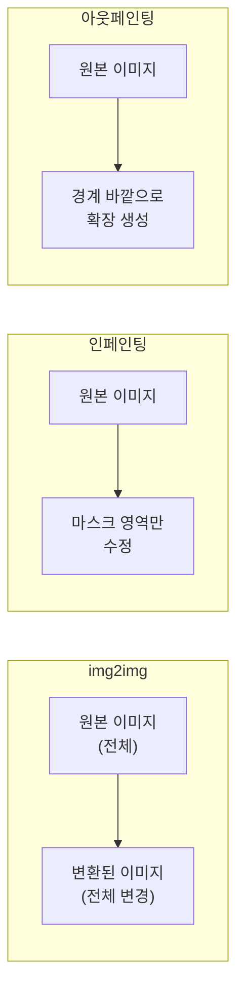
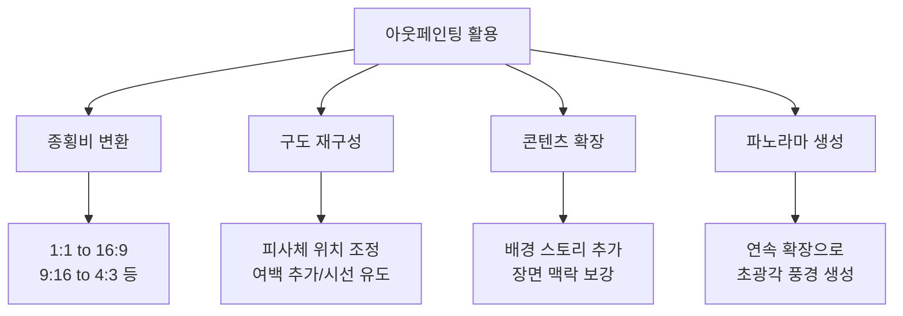
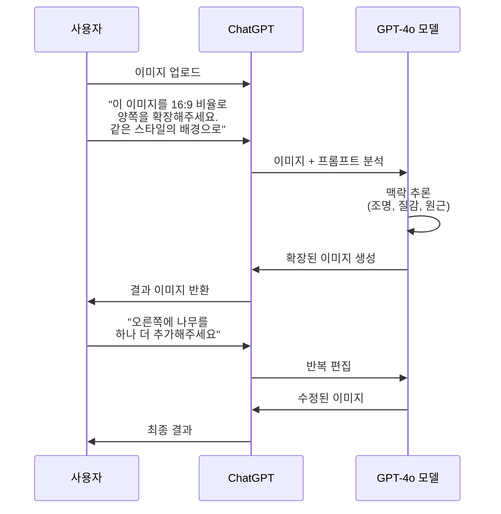
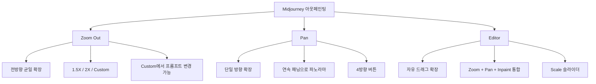
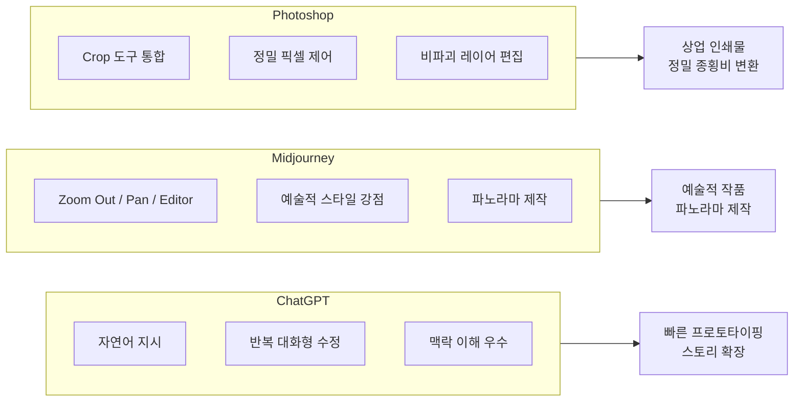

# 아웃페인팅 — 캔버스 확장과 구도 재구성

> 이미지 경계 너머의 세계를 AI로 그려내는 캔버스 확장 기법

## 개요

이 섹션에서는 AI 이미지 편집의 세 번째 핵심 기법인 **아웃페인팅(Outpainting)**을 다룹니다. 앞서 [인페인팅 기초](06-ch6-이미지-편집-기법-img2img인페인팅아웃페인팅/02-02-인페인팅-기초-부분-수정의-기술.md)와 [인페인팅 고급](06-ch6-이미지-편집-기법-img2img인페인팅아웃페인팅/03-03-인페인팅-고급-복잡한-편집-시나리오.md)에서 이미지 **내부**를 수정하는 방법을 배웠다면, 이번에는 이미지 **바깥**으로 확장하는 기술을 익힙니다.

**선수 지식**: 인페인팅의 마스크 개념, 각 플랫폼(ChatGPT, Midjourney, Adobe Photoshop)의 기본 인터페이스

**학습 목표**:
- 아웃페인팅의 원리와 인페인팅과의 차이를 설명할 수 있다
- 아웃페인팅으로 이미지의 종횡비를 자유롭게 변경할 수 있다
- ChatGPT, Midjourney, Adobe Photoshop 각 플랫폼에서 아웃페인팅을 실행할 수 있다
- 확장 시 구도를 의도적으로 재구성하는 전략을 적용할 수 있다

## 왜 알아야 할까?

디자인 실무에서 이런 상황을 겪어본 적 있으신가요?

- 세로로 찍은 인물 사진을 가로형 배너에 넣어야 할 때
- 인스타그램용 정사각형 이미지를 유튜브 썸네일(16:9)로 바꿔야 할 때
- 클라이언트가 "배경을 좀 더 넓게 보여주세요"라고 요청할 때
- 멋진 AI 생성 이미지인데 구도가 너무 타이트해서 여백이 필요할 때

전통적으로 이런 문제를 해결하려면 포토샵에서 수동으로 배경을 그리거나, 아예 새로 촬영해야 했습니다. 하지만 아웃페인팅은 AI가 기존 이미지의 맥락—색감, 조명, 질감, 원근감—을 이해하고 경계 너머를 자연스럽게 그려줍니다. 종횡비 변환, 구도 재구성, 콘텐츠 확장이 몇 번의 클릭으로 가능해지는 거죠.

특히 멀티 플랫폼 시대에 하나의 비주얼 에셋을 다양한 크기로 변환해야 하는 디자이너에게, 아웃페인팅은 필수 기술이 되었습니다.

## 핵심 개념

### 개념 1: 아웃페인팅이란 — 액자 바깥의 풍경

> 💡 **비유**: 미술관에서 액자 속 그림을 보면서 "이 풍경의 왼쪽에는 뭐가 있을까?"라고 궁금했던 적 없나요? 아웃페인팅은 마치 화가가 캔버스를 더 넓게 펼쳐서 액자 밖의 풍경까지 그려넣는 것과 같습니다. AI가 기존 그림의 스타일, 색감, 원근감을 분석해서 "이 그림이 계속된다면 이렇게 보일 것이다"를 추론하는 거죠.

아웃페인팅(Outpainting)은 이미지의 경계를 넘어 캔버스를 확장하며, 기존 이미지와 자연스럽게 연결되는 새로운 콘텐츠를 생성하는 기법입니다. [img2img](06-ch6-이미지-편집-기법-img2img인페인팅아웃페인팅/01-01-img2img-이미지-기반-변환의-원리.md)가 이미지 전체를 변환하고, 인페인팅이 내부 일부를 수정한다면, 아웃페인팅은 **이미지 외부를 새로 창조**합니다.

> 📊 **그림 1**: img2img, 인페인팅, 아웃페인팅 비교

아웃페인팅이 자연스러운 결과를 만들기 위해 AI가 분석하는 요소들이 있습니다:

| 분석 요소 | 설명 | 예시 |
|-----------|------|------|
| **원근감(Perspective)** | 소실점과 깊이감 연장 | 도로가 멀어지는 방향 유지 |
| **조명(Lighting)** | 광원의 방향과 강도 | 그림자 방향 일관성 |
| **질감(Texture)** | 표면 패턴의 연속성 | 벽돌 패턴이 자연스럽게 이어짐 |
| **색상 팔레트(Color Palette)** | 색조, 채도, 명도의 전체 흐름 | 하늘 그라데이션 연장, 따뜻한/차가운 톤 유지 |
| **반복 패턴(Repetition)** | 규칙적 구조물의 연속성 | 창문 간격, 타일 배치가 일정하게 이어짐 |
| **대기 원근(Atmospheric Depth)** | 거리에 따른 색감·선명도 변화 | 먼 산일수록 흐릿하고 푸르게 |
| **노이즈와 그레인(Noise/Grain)** | 원본의 질감·필름 그레인 특성 | 빈티지 사진의 거친 입자감 유지 |
| **의미(Semantics)** | 장면의 맥락과 논리적 일관성 | 실내라면 벽과 가구 추가, 해변이면 모래와 파도 |

### 개념 2: 아웃페인팅의 핵심 활용 시나리오

> 💡 **비유**: 아웃페인팅은 마치 영화 촬영에서 "카메라를 뒤로 빼주세요"라고 말하는 것과 같습니다. 같은 장면이지만 더 넓은 시야를 보여주는 거죠. 때로는 와이드 샷이, 때로는 특정 방향으로의 확장이 필요합니다.

아웃페인팅은 크게 네 가지 시나리오에서 활용됩니다.

> 📊 **그림 2**: 아웃페인팅 4대 활용 시나리오

**1. 종횡비 변환**: 가장 실용적인 활용입니다. 인스타그램 정사각형(1:1) 이미지를 유튜브 썸네일(16:9)로, 세로 촬영 사진을 가로 배너로 변환할 때 빈 영역을 AI가 채워줍니다.

**2. 구도 재구성**: 피사체가 너무 가운데 있거나 여백이 부족할 때, 한쪽 방향으로 확장하여 삼분법에 맞는 구도로 재배치할 수 있습니다. [구도와 앵글](02-ch2-프롬프트-구조-마스터/03-03-구도와-앵글-시선을-이끄는-프레이밍.md)에서 배운 프레이밍 원칙을 아웃페인팅으로 사후 적용하는 셈이죠.

**3. 콘텐츠 확장**: 이미지의 스토리를 확장합니다. 인물 클로즈업에서 주변 환경을 보여주거나, 정물 사진에 더 넓은 테이블 장면을 추가하는 식입니다.

**4. 파노라마 생성**: 한 방향으로 반복 확장하여 초광각 파노라마 이미지를 만들 수 있습니다. Midjourney의 Pan 기능이 이 용도에 특히 강합니다.

### 개념 3: ChatGPT 아웃페인팅 — 대화로 캔버스 넓히기

> 💡 **비유**: ChatGPT의 아웃페인팅은 "이 사진 왼쪽으로 좀 더 보여줘"라고 친구에게 말하는 것처럼 자연스럽습니다. 기술적 파라미터 없이 자연어로 원하는 확장을 설명하면 됩니다.

ChatGPT의 GPT-4o 이미지 생성 모델은 기존 디퓨전 방식이 아닌 **오토리그레시브 트랜스포머** 방식으로 작동합니다. 이미지를 순차적으로 예측하며 생성하기 때문에, 기존 이미지의 맥락을 깊이 이해하고 확장할 수 있습니다.

> 📊 **그림 3**: ChatGPT 아웃페인팅 워크플로우

**ChatGPT 아웃페인팅 프롬프트 전략**:

| 목적 | 프롬프트 예시 |
|------|-------------|
| 종횡비 변환 | "이 이미지를 16:9 가로 비율로 확장해주세요. 양쪽 배경을 자연스럽게 이어주세요" |
| 한 방향 확장 | "이미지의 왼쪽으로 캔버스를 넓혀서 더 넓은 풍경을 보여주세요" |
| 스토리 확장 | "이 인물 주변에 카페 내부 풍경이 보이도록 확장해주세요" |
| 여백 추가 | "텍스트를 넣을 수 있도록 상단에 여백 공간을 만들어주세요" |

**ChatGPT 아웃페인팅의 강점과 한계**:

- **강점**: 자연어로 세밀한 지시 가능, 반복 대화로 점진적 수정, 맥락 이해력 우수
- **한계**: 정밀한 확장 비율 제어 어려움, 고해상도 출력 제한, 방향별 개별 확장 인터페이스 없음

> 🔥 **실무 팁**: ChatGPT에서 아웃페인팅할 때는 "같은 스타일과 조명을 유지하면서"라는 문구를 항상 포함하세요. 이 한 마디가 경계선의 부자연스러운 이음새를 크게 줄여줍니다.

### 개념 4: Midjourney 아웃페인팅 — Zoom Out과 Pan

> 💡 **비유**: Midjourney의 아웃페인팅 도구들은 카메라 장비와 비슷합니다. Zoom Out은 광각 렌즈로 교체하는 것이고, Pan은 삼각대 위에서 카메라를 특정 방향으로 돌리는 것이며, Editor는 이 모든 조작을 한 화면에서 할 수 있는 편집 스튜디오입니다.

Midjourney는 아웃페인팅을 위한 세 가지 전문 도구를 제공합니다.

**1. Zoom Out (줌 아웃)**

이미지를 생성한 후 Zoom Out 버튼으로 캔버스를 확장합니다.

- **Zoom Out 2X**: 원본 대비 2배 넓은 시야
- **Zoom Out 1.5X**: 원본 대비 1.5배 넓은 시야
- **Custom Zoom**: 1.0~2.0 사이의 원하는 배율 지정 가능. 프롬프트도 함께 수정 가능

Custom Zoom에서 프롬프트를 변경하면 확장 영역의 내용을 유도할 수 있습니다. 예를 들어, 인물 클로즈업에서 줌 아웃하면서 "standing in a medieval castle courtyard"로 프롬프트를 바꾸면 인물 주변에 중세 성곽 안뜰이 생성됩니다.

**2. Pan (팬)**

특정 방향으로만 캔버스를 확장합니다. ⬅️ ➡️ ⬆️ ⬇️ 네 방향 버튼으로 한쪽 방향 확장이 가능하며, 연속 패닝으로 파노라마를 만들 수 있습니다.

**3. Editor (에디터)**

midjourney.com의 웹 에디터에서 Zoom Out, Pan, Vary Region(인페인팅), Remix를 **한 화면에서 동시에** 사용할 수 있습니다. 캔버스 모서리를 드래그하여 자유롭게 확장 범위를 지정하고, Scale 슬라이더로 배율을 미세 조정합니다.

> 📊 **그림 4**: Midjourney 아웃페인팅 도구 비교

> ⚠️ **흔한 오해**: "Zoom Out을 많이 하면 원본 이미지가 계속 선명하게 남아 있다"고 생각하기 쉽지만, 실제로는 여러 번 줌 아웃하면 원본 영역도 재생성 과정을 거치면서 디테일이 변할 수 있습니다. 중요한 디테일은 **최대 2~3회** 줌 아웃 이내에서 작업하는 것이 좋습니다.

### 개념 5: Adobe Photoshop Generative Expand — 프로 편집 워크플로우

> 💡 **비유**: Photoshop의 Generative Expand는 마치 전문 무대 세트 디자이너가 무대를 넓히는 것과 같습니다. 기존 무대(이미지)의 조명, 색감, 분위기를 정확히 분석해서 확장 부분이 원본과 완벽하게 어울리도록 설계합니다. 게다가 원본 무대는 그대로 보존한 채로요.

Adobe Photoshop의 Generative Expand는 Firefly AI 모델을 기반으로, Crop 도구와 결합된 직관적인 아웃페인팅 경험을 제공합니다. 2025~2026년 업데이트에서 2K 해상도 출력, 더 날카로운 디테일, 적은 아티팩트, 자연스러운 조명과 깊이감을 지원하도록 크게 개선되었습니다.

**Generative Expand 사용법**:

1. **Crop 도구 선택**: 도구 패널에서 Crop 도구(C)를 선택합니다
2. **캔버스 확장**: 원본 이미지 경계 바깥으로 Crop 핸들을 드래그합니다
3. **Fill 옵션 설정**: 옵션 바에서 Fill을 "Generative Expand"로 설정합니다
4. **프롬프트 입력(선택)**: Contextual Task Bar에서 확장 영역에 원하는 내용을 텍스트로 입력하거나, 비워두면 AI가 자동으로 맥락에 맞게 채웁니다
5. **Generate 클릭**: 3개의 변형(Variation)이 생성되어 선택할 수 있습니다

**Photoshop 아웃페인팅의 차별점**:

| 특징 | 설명 |
|------|------|
| **비파괴 편집** | "Delete Cropped Pixels" 해제 시 원본 데이터 완전 보존 |
| **정밀 비율 제어** | 프리셋 종횡비 또는 픽셀 단위 커스텀 크기 지정 |
| **3개 변형 생성** | 매 생성마다 3가지 옵션 제공, 최적의 결과 선택 |
| **2K 해상도** | 고해상도 출력으로 인쇄물에도 활용 가능 |
| **레이어 분리** | 확장 영역이 별도 레이어로 생성되어 후편집 용이 |

> 💡 **알고 계셨나요?**: Photoshop에서 Generative Expand를 프롬프트 없이 사용하면, AI가 원본 이미지만으로 맥락을 추론하여 확장합니다. 놀랍게도 단순한 풍경이나 패턴 기반 배경에서는 프롬프트 없는 자동 확장이 더 자연스러운 결과를 내는 경우가 많습니다. 프롬프트는 특정 오브젝트를 추가하고 싶을 때만 사용하는 것이 팁입니다.

### 개념 6: 플랫폼별 아웃페인팅 비교와 선택 전략

세 플랫폼은 각각 다른 접근 방식과 강점을 가지고 있습니다. 상황에 따라 최적의 도구를 선택하는 것이 중요합니다.

> 📊 **그림 5**: 플랫폼별 아웃페인팅 특성 비교

**상황별 플랫폼 선택 가이드**:

| 상황 | 최적 플랫폼 | 이유 |
|------|-----------|------|
| 빠른 종횡비 변환 | Photoshop | 정확한 비율 지정, 3가지 변형 |
| 예술적 배경 확장 | Midjourney | 뛰어난 미학적 품질 |
| 스토리가 있는 장면 확장 | ChatGPT | 자연어로 세밀한 내용 지정 |
| 파노라마 풍경 제작 | Midjourney Pan | 연속 확장에 최적화 |
| 인쇄용 고해상도 확장 | Photoshop | 2K 해상도 + 후편집 가능 |
| 확장 내용 반복 수정 | ChatGPT | 대화형으로 점진적 개선 |
| 확장 + 부분 수정 동시 | Midjourney Editor | Zoom + Pan + Inpaint 통합 |

## 실습: 적용해보기

### 실습 1: 종횡비 변환 워크시트

아래 시나리오에 대해 어떤 플랫폼과 어떤 프롬프트/설정을 사용할지 계획해보세요.

**시나리오**: 정사각형(1:1) AI 생성 인물 포트레이트를 다음 3가지 용도로 변환해야 합니다.

| 용도 | 목표 비율 | 선택할 플랫폼 | 확장 방향 | 프롬프트/설정 전략 |
|------|----------|-------------|----------|------------------|
| 유튜브 썸네일 | 16:9 | ? | ? | ? |
| 인스타그램 스토리 | 9:16 | ? | ? | ? |
| A4 포스터 | 약 3:4 | ? | ? | ? |

**분석 포인트**:
- 각 변환에서 피사체의 위치가 어떻게 변하는지 생각해보세요
- 가로 확장 vs 세로 확장에서 배경 일관성 유지가 더 어려운 쪽은?
- 왜 특정 플랫폼이 특정 용도에 더 적합한지 근거를 적어보세요

### 실습 2: 구도 재구성 사례 분석

아래 사례를 읽고 토론 질문에 답해보세요.

**사례**: 한 디자이너가 AI로 생성한 카페 인테리어 이미지가 있습니다. 피사체(커피잔과 디저트)가 정중앙에 위치해 있어 구도가 밋밋합니다. 이 이미지를 SNS 배너로 사용하면서 왼쪽에 텍스트 공간을 확보하고 싶습니다.

**토론 질문**:
1. 오른쪽으로 확장해서 피사체를 왼쪽 1/3 지점에 배치하는 것과, 왼쪽으로 확장해서 여백을 만드는 것 중 어느 전략이 나을까요? 각각의 장단점은?
2. 확장된 영역에 카페의 어떤 요소가 자연스럽게 이어져야 할까요? (조명, 테이블, 벽면 등)
3. ChatGPT에게 이 작업을 요청한다면 프롬프트를 어떻게 작성하시겠습니까?

### 실습 3: 파노라마 제작 플래닝

Midjourney의 Pan 기능으로 파노라마를 만드는 시퀀스를 계획해보세요.

**주제**: "일몰의 해안 절벽 풍경"

1. 초기 이미지 프롬프트를 작성하세요 ([프롬프트 6요소 프레임워크](02-ch2-프롬프트-구조-마스터/01-01-프롬프트-해부학-6요소-프레임워크.md) 활용)
2. 왼쪽으로 3회, 오른쪽으로 3회 Pan할 때 각 단계에서 기대하는 장면을 적어보세요
3. 연속 확장 시 일관성을 유지하기 위한 전략은 무엇일까요?

## 더 깊이 알아보기

### 아웃페인팅의 탄생 — "모나리자 너머의 세계"

아웃페인팅이라는 개념이 대중에게 처음 알려진 것은 **2022년 8월 31일**, OpenAI가 DALL-E 2에 아웃페인팅 기능을 공식 발표한 날이었습니다. 발표와 함께 공개된 데모가 큰 화제를 모았는데, 바로 요하네스 베르메르(Johannes Vermeer)의 명화 **「진주 귀걸이를 한 소녀」**(Girl with a Pearl Earring, 1665)를 아웃페인팅한 타임랩스 영상이었습니다.

원래 45cm × 39cm의 작은 초상화였던 이 그림이 AI에 의해 원본의 약 20배 크기로 확장되었습니다. 소녀 뒤로는 어수선한 네덜란드 가정집 내부가 펼쳐졌고, 테이블 위의 정물, 창문으로 들어오는 빛까지 17세기 네덜란드 화풍에 맞게 생성되었습니다. 이 데모 하나가 "AI가 화가의 의도를 이해하고 확장할 수 있다"는 가능성을 전 세계에 보여준 순간이었죠.

흥미로운 점은, 아웃페인팅의 기술적 뿌리가 인페인팅에 있다는 것입니다. 인페인팅이 "빈 영역을 채우는" 기술이라면, 아웃페인팅은 캔버스 자체를 넓혀 새로운 빈 영역을 만든 뒤 같은 원리로 채우는 것입니다. 빈 영역이 이미지 안에 있느냐 밖에 있느냐의 차이일 뿐, 근본적으로는 같은 기술이 작동합니다.

### 아웃페인팅 vs 단순 리사이즈

가끔 "그냥 이미지 크기를 늘리면 안 되나요?"라고 묻는 분들이 있습니다. 단순 리사이즈(upscale)는 기존 픽셀을 확대하거나 보간(interpolation)하는 것이고, 아웃페인팅은 **존재하지 않는 새로운 콘텐츠를 생성**하는 것입니다. 리사이즈는 해상도만 높이지만, 아웃페인팅은 시야 자체를 넓힙니다.

## 흔한 오해와 팁

> ⚠️ **흔한 오해**: "아웃페인팅은 항상 자연스러운 결과를 만든다." 실제로는 복잡한 구조(건축물, 기하학적 패턴, 텍스트)가 경계에 걸쳐 있을 때 이음새가 눈에 띄기 쉽습니다. 특히 직선이 많은 건물 사진이나 반복 패턴이 있는 이미지에서 불일치가 두드러집니다. 이런 경우 한 번에 크게 확장하지 말고, **작은 단위로 여러 번** 나눠서 확장하면 훨씬 자연스럽습니다.

> 💡 **알고 계셨나요?**: Midjourney의 Custom Zoom에서 프롬프트를 바꾸면 "장면 전환" 효과를 낼 수 있습니다. 인물 클로즈업에서 줌 아웃하면서 "standing on the surface of Mars"로 프롬프트를 변경하면, 원래 배경과 전혀 다른 화성 표면이 펼쳐집니다. 이 기법은 스토리텔링이나 콘셉트 아트에서 극적인 연출 도구로 활용됩니다.

> 🔥 **실무 팁**: 아웃페인팅으로 종횡비를 변환할 때, 확장 방향을 신중히 결정하세요. **피사체의 시선 방향**으로 확장하면 자연스럽고, 시선 반대 방향으로 확장하면 어색해집니다. 인물이 오른쪽을 바라보고 있다면 오른쪽으로 확장하는 것이 훨씬 자연스러운 결과를 만듭니다. 이것은 [구도와 시선 유도](11-ch11-시각적-스토리텔링과-감정-전달/03-03-구도와-시선-유도로-메시지-강화.md)의 원리와도 일맥상통합니다.

## 핵심 정리

| 개념 | 설명 |
|------|------|
| **아웃페인팅** | 이미지 경계 바깥으로 캔버스를 확장하며 새 콘텐츠를 생성하는 기법 |
| **인페인팅과의 차이** | 인페인팅은 내부 수정, 아웃페인팅은 외부 확장. 기술적 원리는 동일 |
| **AI 분석 요소** | 원근감, 조명, 질감, 색상 팔레트, 반복 패턴, 대기 원근, 노이즈, 의미론적 맥락 |
| **ChatGPT 방식** | 자연어 프롬프트로 확장 방향·내용 지시. 반복 대화형 수정에 강점 |
| **Midjourney Zoom Out** | 전방향 균일 확장 (1.5X, 2X, Custom). Custom에서 프롬프트 변경 가능 |
| **Midjourney Pan** | 단일 방향 확장. 연속 패닝으로 파노라마 제작에 최적 |
| **Midjourney Editor** | Zoom + Pan + Inpaint 통합 웹 에디터. 자유 드래그 확장 |
| **Photoshop Generative Expand** | Crop 도구와 결합. 정밀 비율 제어, 비파괴 편집, 2K 해상도, 3개 변형 |
| **확장 핵심 원칙** | 피사체 시선 방향으로 확장, 작은 단위로 나눠 확장, 스타일·조명 일관성 유지 |

## 다음 섹션 미리보기

지금까지 Ch6에서 img2img, 인페인팅, 아웃페인팅을 각각 배웠습니다. 다음 섹션 [편집 기법 조합 실전 프로젝트](06-ch6-이미지-편집-기법-img2img인페인팅아웃페인팅/05-05-편집-기법-조합-실전-프로젝트.md)에서는 이 세 가지 기법을 **하나의 워크플로우로 조합**하여 실전 프로젝트를 완성합니다. img2img로 스타일을 변환하고, 인페인팅으로 세부를 수정하고, 아웃페인팅으로 구도를 완성하는 통합 편집 파이프라인을 경험해보겠습니다.

## 참고 자료

- [DALL·E: Introducing Outpainting — OpenAI](https://openai.com/index/dall-e-introducing-outpainting/) - 아웃페인팅의 탄생을 알린 OpenAI 공식 발표. "진주 귀걸이를 한 소녀" 확장 데모 포함
- [Explore Beyond the Canvas with Generative Expand — Adobe](https://helpx.adobe.com/photoshop/desktop/create-open-import-images/create-images/explore-beyond-the-canvas-with-generative-expand.html) - Photoshop Generative Expand 공식 가이드. Crop 도구 활용법 상세 설명
- [Zoom Out — Midjourney Documentation](https://docs.midjourney.com/hc/en-us/articles/32595476770957-Zoom-Out) - Midjourney Zoom Out 기능 공식 문서. Custom Zoom 파라미터 설명 포함
- [Pan — Midjourney Documentation](https://docs.midjourney.com/hc/en-us/articles/32570788043405-Pan) - Midjourney Pan 기능 공식 문서. 방향별 확장 사용법
- [Editor — Midjourney Documentation](https://docs.midjourney.com/hc/en-us/articles/32764383466893-Editor) - Midjourney 웹 에디터 공식 문서. Zoom + Pan + Inpaint 통합 환경
- [Adobe Firefly Features Overview](https://www.adobe.com/products/firefly/features.html) - Adobe Firefly AI 기능 전체 개요. Generative Expand 포함

---
### 🔗 Related Sessions
- [img2img](06-ch6-이미지-편집-기법-img2img인페인팅아웃페인팅/01-01-img2img-이미지-기반-변환의-원리.md) (prerequisite)
