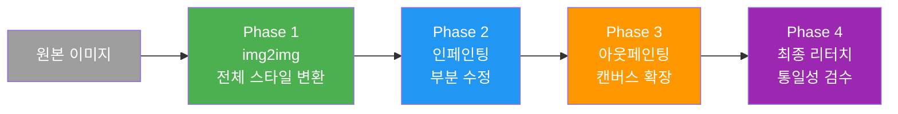
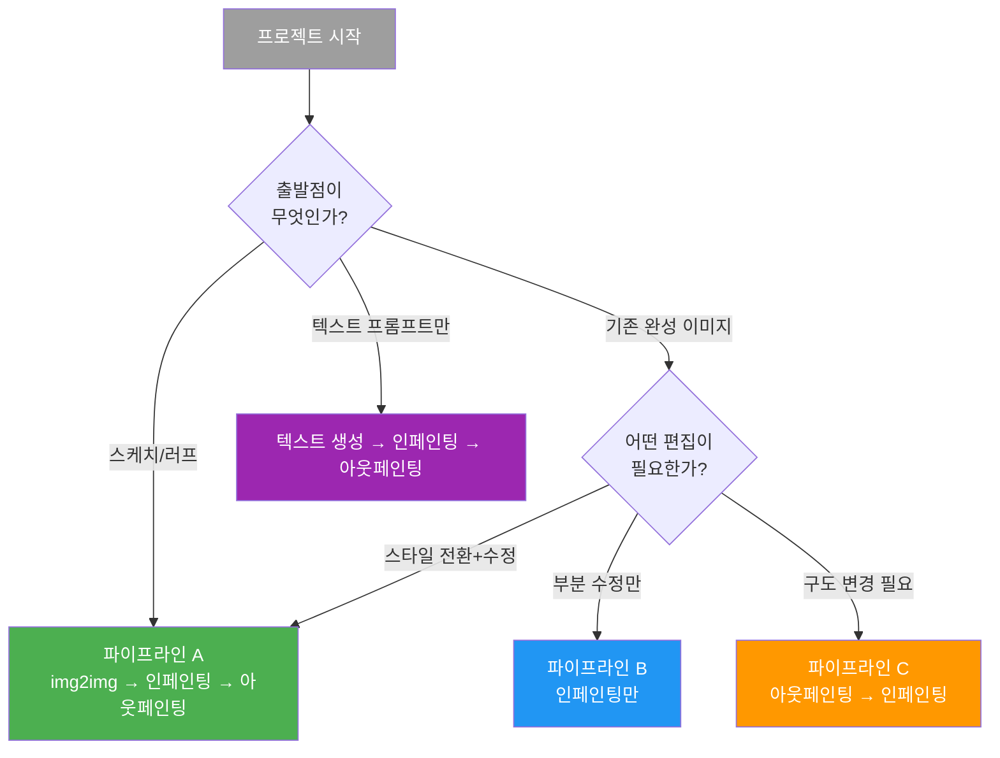
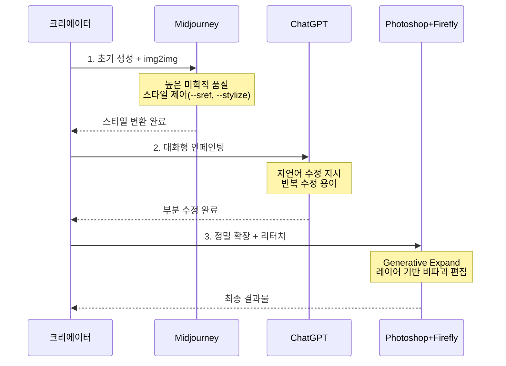
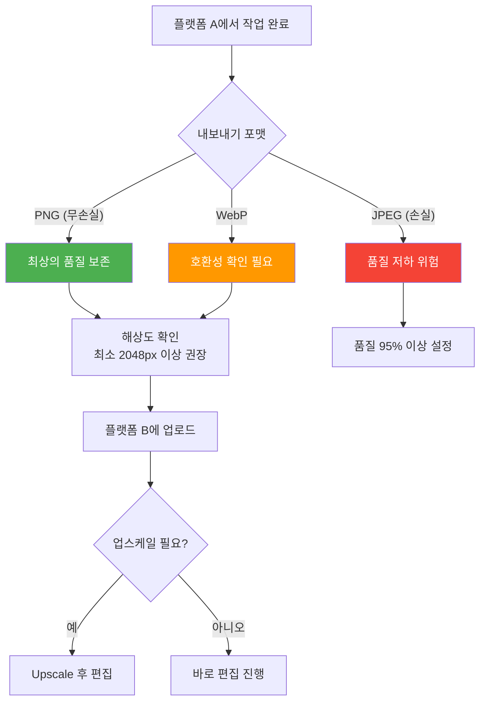
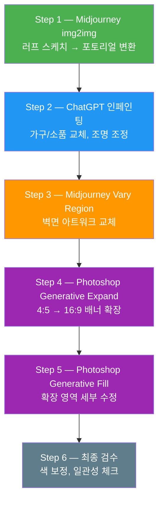

# 편집 기법 조합 실전 프로젝트

> img2img, 인페인팅, 아웃페인팅을 하나의 워크플로우로 엮어 완성도 높은 결과물을 제작하는 멀티 플랫폼 실전 프로젝트

## 개요

이 섹션에서는 Ch6 전체에서 배운 세 가지 핵심 편집 기법 — img2img, 인페인팅, 아웃페인팅 — 을 **하나의 통합 워크플로우**로 조합하여 실전 프로젝트를 진행합니다. 각 기법을 개별적으로 사용하는 것과 전략적으로 조합하는 것은 결과물의 품질과 작업 효율에서 결정적인 차이를 만들어냅니다.

**선수 지식**: [img2img의 원리와 변환 강도](06-ch6-이미지-편집-기법-img2img인페인팅아웃페인팅/01-01-img2img-이미지-기반-변환의-원리.md), [인페인팅 기초·고급 기법](06-ch6-이미지-편집-기법-img2img인페인팅아웃페인팅/02-02-인페인팅-기초-부분-수정의-기술.md), [아웃페인팅과 구도 재구성](06-ch6-이미지-편집-기법-img2img인페인팅아웃페인팅/04-04-아웃페인팅-캔버스-확장과-구도-재구성.md)

**학습 목표**:
- 세 가지 편집 기법의 최적 조합 순서를 설계할 수 있다
- 프로젝트 시나리오에 따라 플랫폼 간 이동 전략을 수립할 수 있다
- 한 장의 이미지를 다단계 편집으로 완성도 높은 결과물로 발전시킬 수 있다
- 실무에서 통합 편집 파이프라인을 독립적으로 설계하고 실행할 수 있다

## 왜 알아야 할까?

실제 디자인 프로젝트에서는 "이미지 하나 만들어 주세요"로 끝나는 경우가 거의 없습니다. 클라이언트가 "이 스케치를 세련된 일러스트로 바꾸고, 배경의 건물을 다른 것으로 교체하고, 왼쪽으로 구도를 넓혀주세요"라고 요청하면 — 이건 img2img + 인페인팅 + 아웃페인팅을 모두 사용해야 하는 작업이죠.

문제는 **순서**입니다. 아웃페인팅을 먼저 하고 인페인팅을 하면 자연스러운데, 반대로 하면 인페인팅한 영역이 아웃페인팅 과정에서 다시 뒤틀릴 수 있습니다. 마치 집을 지을 때 기초 → 골조 → 인테리어 순서가 있듯이, AI 이미지 편집에도 **최적의 작업 순서**가 있습니다. 이 순서를 이해하면 시행착오를 줄이고 작업 시간을 절반 이하로 단축할 수 있습니다.

더 나아가, ChatGPT·Midjourney·Photoshop은 각각 다른 강점을 가지고 있기 때문에, **하나의 프로젝트에서 여러 플랫폼을 오가며 작업**하는 멀티 플랫폼 워크플로우는 프로 크리에이터의 필수 역량이 되었습니다. 2025년 이후 Midjourney V7의 Editor가 레이어와 Retexture(표면 질감 재생성 — 이미지의 텍스처를 유지하면서 소재나 질감만 새롭게 바꾸는 기능)까지 지원하고, Photoshop에 Firefly 외에도 Gemini 등 외부 AI 모델이 통합되면서, 플랫폼 간 경계는 더욱 흐려지고 조합의 가능성은 넓어졌습니다.

## 핵심 개념

### 개념 1: 통합 편집 파이프라인 — 세 기법의 최적 조합 순서

> 💡 **비유**: 요리를 생각해보세요. 재료 손질(img2img) → 양념·조리(인페인팅) → 플레이팅(아웃페인팅) 순서가 자연스럽죠? 양념을 먼저 하고 재료를 손질하면 양념이 다 씻겨 나갑니다. AI 이미지 편집도 마찬가지예요 — "큰 변환 → 부분 수정 → 확장"이 가장 안정적인 순서입니다.

세 기법을 조합할 때 핵심 원칙은 **"전체에서 부분으로, 안에서 밖으로"**입니다. 이 순서를 지키면 각 단계의 결과가 다음 단계에서 훼손되지 않습니다.

> 📊 **그림 1**: 통합 편집 파이프라인의 기본 흐름

**Phase 1 — img2img (전체 변환)**이 가장 먼저 오는 이유가 있습니다. img2img는 이미지의 전체적인 스타일, 색감, 분위기를 한꺼번에 바꾸는 기법이라, 이후에 하는 모든 부분 수정의 "기반"을 형성하거든요. 스케치를 수채화로 바꾸거나, 사진을 애니메이션 스타일로 전환하는 작업이 여기에 해당합니다.

**Phase 2 — 인페인팅 (부분 수정)**은 전체 스타일이 확정된 후에 진행합니다. 특정 오브젝트를 교체하거나, 인물의 표정·의상을 바꾸거나, 불필요한 요소를 제거하는 작업이죠. [인페인팅 고급 세션](06-ch6-이미지-편집-기법-img2img인페인팅아웃페인팅/03-03-인페인팅-고급-복잡한-편집-시나리오.md)에서 배운 coarse-to-fine 프레임워크를 적용하면 됩니다.

**Phase 3 — 아웃페인팅 (캔버스 확장)**은 반드시 마지막에 합니다. 이유는 명확합니다 — 확장된 영역은 기존 이미지의 가장자리 정보를 기반으로 생성되기 때문에, 내부가 완성된 상태에서 확장해야 가장 자연스러운 결과를 얻습니다.

**Phase 4 — 최종 리터치**에서는 전체적인 일관성을 확인하고, 경계가 부자연스러운 부분을 인페인팅으로 다듬습니다.

> ⚠️ **흔한 오해**: "순서는 상관없다"고 생각하는 분이 많은데, 실제로 아웃페인팅을 먼저 하면 확장된 영역의 스타일이 원본과 맞지 않을 수 있고, img2img를 나중에 적용하면 인페인팅으로 정밀하게 수정한 부분까지 함께 변환되어 의도와 다른 결과가 나옵니다.

### 개념 2: 시나리오별 파이프라인 설계 — 유연한 변형

> 💡 **비유**: 모든 요리에 같은 레시피를 쓰지 않듯이, 모든 프로젝트에 같은 파이프라인을 적용할 필요는 없습니다. 한식에는 한식 순서가, 양식에는 양식 순서가 있죠. AI 편집도 시나리오에 따라 파이프라인을 유연하게 변형해야 합니다.

기본 순서(img2img → 인페인팅 → 아웃페인팅)가 항상 정답인 것은 아닙니다. 프로젝트의 출발점과 목표에 따라 파이프라인을 다르게 설계해야 하죠.

> 📊 **그림 2**: 시나리오별 파이프라인 변형

**파이프라인 A (풀 파이프라인)**: 스케치나 러프한 이미지를 완성된 작품으로 발전시킬 때 사용합니다. 가장 많은 단계를 거치지만, 가장 극적인 변환을 만들어냅니다.

**파이프라인 B (인페인팅 중심)**: 이미 완성도가 높은 이미지에서 특정 요소만 수정할 때. 예를 들어 제품 사진에서 배경 소품만 바꾸는 경우죠.

**파이프라인 C (확장 후 수정)**: 구도를 먼저 바꿔야 할 때. 정사각형 이미지를 와이드 배너로 만들 때, 먼저 아웃페인팅으로 확장한 후 확장된 영역의 세부를 인페인팅으로 다듬는 순서가 효율적입니다.

**파이프라인 D (텍스트 시작)**: 아예 새로 생성한 이미지를 편집하는 경우. txt2img로 기본 이미지를 만들고, 인페인팅과 아웃페인팅으로 완성도를 높여갑니다.

각 시나리오에서 핵심은 **"가장 큰 변화를 먼저, 세밀한 수정을 나중에"**라는 원칙입니다.

### 개념 3: 멀티 플랫폼 편집 전략 — 각 플랫폼의 베스트 포지션

> 💡 **비유**: 축구팀에서 수비수, 미드필더, 공격수가 각자 잘하는 포지션이 있듯이, ChatGPT·Midjourney·Photoshop도 각자의 최적 포지션이 있습니다. 한 선수에게 모든 포지션을 맡기면 경기에서 질 수밖에 없죠.

멀티 플랫폼 워크플로우의 핵심은 **각 플랫폼을 가장 잘하는 단계에 배치**하는 것입니다. 2025~2026년 기준으로 각 플랫폼의 강점이 뚜렷하게 갈리거든요.

> 📊 **그림 3**: 멀티 플랫폼 편집 워크플로우

**Midjourney의 베스트 포지션 — 초기 생성과 스타일 변환**

Midjourney는 미학적 품질에서 타의 추종을 불허합니다. `--sref`(스타일 레퍼런스)와 `--stylize` 파라미터로 정확한 스타일을 제어할 수 있고, V7의 Editor는 레이어, Retexture(표면 질감 재생성), Smart Select까지 지원하면서 단순 생성기를 넘어 **크리에이티브 워크스테이션**으로 진화했습니다. img2img에서 `--iw`로 원본 충실도를 미세 조정하는 것도 Midjourney의 고유한 강점이죠.

**ChatGPT의 베스트 포지션 — 대화형 반복 수정**

"이 부분을 좀 더 밝게 해주세요", "배경에 있는 나무를 벚꽃으로 바꿔주세요" — 이런 자연어 지시로 반복 수정을 할 때 ChatGPT가 가장 편리합니다. Select 도구로 영역을 지정하고 대화를 이어가며 점진적으로 완성하는 워크플로우가 직관적이거든요. 특히 비전문가가 AI 편집을 시작하기에 가장 낮은 진입 장벽을 가지고 있습니다.

**Photoshop + Firefly의 베스트 포지션 — 정밀 마무리와 확장**

Generative Fill의 정밀한 마스킹, Generative Expand의 정확한 비율 제어, 레이어 기반 비파괴 편집, 그리고 Enhance Detail로 AI 생성 영역의 텍스처를 개선하는 기능까지 — 최종 결과물의 품질을 극대화하는 마무리 도구로 Photoshop을 능가하는 플랫폼은 없습니다. 2025년 하반기부터는 Firefly 외에 Gemini 2.5 Flash, FLUX.1 Kontext(Black Forest Labs의 오픈소스 이미지 생성 모델로, 빠른 속도와 높은 텍스트 렌더링 품질로 주목받는 모델) 등 외부 모델도 Generative Fill에서 바로 사용할 수 있게 되었습니다.

| 단계 | 최적 플랫폼 | 이유 |
|------|------------|------|
| 초기 생성·img2img | Midjourney | 미학적 품질, --sref/--iw 제어 |
| 빠른 프로토타입 | ChatGPT | 자연어 대화, 즉석 수정 |
| 세밀한 인페인팅 | ChatGPT 또는 Photoshop | 대화형 반복 vs 정밀 마스크 |
| 아웃페인팅 | Photoshop | Generative Expand 비율 제어 |
| 최종 리터치 | Photoshop | 레이어, Enhance Detail |
| 예술적 질감 재생성 | Midjourney | Editor의 Retexture(표면 질감 재생성) 기능 |

> 🔥 **실무 팁**: 반드시 모든 플랫폼을 거칠 필요는 없습니다. 단순한 프로젝트라면 한 플랫폼에서 끝내는 게 효율적이고, 복잡한 프로젝트일수록 멀티 플랫폼의 가치가 올라갑니다. "플랫폼을 바꿀 때마다 이미지를 내보내고 다시 업로드해야 하니까, 플랫폼 이동의 비용도 계산해야 합니다."

### 개념 4: 플랫폼 간 이미지 핸드오프 — 품질 손실 없이 이동하기

> 💡 **비유**: 릴레이 경주에서 바통 전달이 가장 중요하듯이, 멀티 플랫폼 워크플로우에서는 **이미지 핸드오프**(플랫폼 간 이미지 전달)가 결과물 품질을 좌우합니다.

플랫폼을 오갈 때 가장 흔히 발생하는 문제는 **이미지 품질 저하**와 **메타데이터 손실**입니다. 몇 가지 핵심 규칙을 지키면 이를 방지할 수 있습니다.

> 📊 **그림 4**: 핸드오프 시 품질 보존 체크리스트

**핸드오프 핵심 규칙:**

1. **포맷은 PNG가 기본**: JPEG는 압축 과정에서 미세한 디테일이 손실됩니다. 특히 인페인팅 경계면에서 JPEG 아티팩트가 눈에 띄게 보일 수 있어요. 중간 단계에서는 반드시 PNG로 저장하세요.

2. **해상도 유지**: Midjourney 기본 출력은 1024×1024인데, Photoshop에서 작업하려면 Upscale을 먼저 해서 최소 2048px 이상으로 올리는 게 좋습니다. 작은 이미지를 확대하면 편집 여지가 줄어들거든요.

3. **색상 프로파일 주의**: Midjourney/ChatGPT 출력은 sRGB 기본인데, Photoshop에서 CMYK 작업을 하면 색이 달라 보일 수 있습니다. 웹용이면 sRGB를 유지하세요.

4. **편집 히스토리 기록**: 어떤 플랫폼에서 무슨 편집을 했는지 간단히 메모해 두면, 나중에 클라이언트 피드백으로 특정 단계를 다시 수정할 때 효율적입니다.

### 개념 5: 실전 프로젝트 워크스루 — "카페 인테리어 컨셉 비주얼" 제작

> 💡 **비유**: 지금까지 개별 악기 연주법을 배웠다면, 이제 오케스트라 합주를 할 차례입니다. 각 악기가 제 역할을 하면서 하나의 곡을 완성하는 것처럼, 세 기법과 세 플랫폼이 하나의 결과물을 만들어냅니다.

구체적인 프로젝트 시나리오를 통해 전체 파이프라인을 워크스루해 봅시다. 시나리오는 이렇습니다:

**브리프**: 신규 카페 인테리어 컨셉 비주얼 제작. 클라이언트가 "따뜻한 우드톤의 북유럽 감성 카페"를 원하며, 기존에 스케치해 둔 러프 도면이 있습니다. 최종 결과물은 Instagram 피드용(4:5)과 웹사이트 배너용(16:9) 두 가지 비율이 필요합니다.

> 📊 **그림 5**: 카페 컨셉 비주얼 프로젝트 전체 워크플로우

**Step 1 — Midjourney img2img: 스케치를 포토리얼로 변환**

러프 스케치를 Midjourney에 업로드하고, `--iw 0.5` 정도의 중간 가중치로 시작합니다. 프롬프트에는 "Scandinavian cafe interior, warm wood tones, natural light, cozy atmosphere, architectural photography --ar 4:5 --stylize 200"을 넣어요. `--iw`를 0.3~0.7 사이에서 조절하며 원본 레이아웃을 얼마나 살릴지 결정합니다.

여기서 핵심은 **완벽을 추구하지 않는 것**입니다. 전체 분위기와 구조가 80% 정도 마음에 들면 다음 단계로 넘어가세요. 세부 수정은 인페인팅에서 하면 됩니다.

**Step 2 — ChatGPT 인페인팅: 대화형 부분 수정**

Midjourney 결과물을 PNG로 다운로드하여 ChatGPT에 업로드합니다. "이 카페 이미지에서 왼쪽 벽면의 선반을 원목 책장으로 바꿔주세요"처럼 자연어로 지시합니다. Select 도구로 영역을 지정하고, 대화를 이어가며 점진적으로 수정하세요.

카운터의 재질, 바닥 소재, 조명 기구, 창밖 풍경 — 순서대로 하나씩 수정해 나갑니다. ChatGPT의 강점인 **대화형 반복 수정**을 최대한 활용하는 거죠.

**Step 3 — Midjourney Editor: 예술적 요소 교체**

벽에 걸린 아트워크처럼 미학적 감각이 중요한 요소는 Midjourney로 돌아와서 Vary Region(인페인팅)으로 수정합니다. Midjourney의 미학적 품질이 이런 예술적 요소에서 특히 빛을 발하거든요.

**Step 4~5 — Photoshop: 구도 확장과 최종 마무리**

4:5 비율로 완성된 이미지를 Photoshop에 가져와서 Crop 도구로 캔버스를 16:9로 확장합니다. Generative Expand를 적용하면 양쪽으로 자연스럽게 카페 공간이 확장됩니다. 확장된 영역에 부자연스러운 부분이 있으면 Generative Fill로 세부 수정합니다.

**Step 6 — 최종 검수**

전체 이미지를 줌 아웃해서 보면서 색감의 일관성, 조명 방향의 통일, 경계면의 자연스러움을 체크합니다.

## 실습: 적용해보기

### 실습 1: 편집 파이프라인 설계 워크시트

아래 세 가지 시나리오 중 하나를 골라, 최적의 편집 파이프라인을 설계해보세요.

**시나리오 A — 브랜드 제품 배치 변경**
손으로 그린 제품 스케치가 있습니다. 이것을 사실적인 제품 사진으로 변환하고, 배경을 대리석 테이블 위로 바꾸고, 좌우에 라이프스타일 소품을 추가해야 합니다.

**시나리오 B — 여행 포스터 제작**
이미 찍어둔 여행 사진이 있는데, 날씨가 흐렸습니다. 맑은 하늘로 바꾸고, 전경에 불필요한 관광객을 제거하고, 하단으로 캔버스를 확장해서 텍스트 공간을 만들어야 합니다.

**시나리오 C — 캐릭터 일러스트 확장**
AI로 생성한 캐릭터 반신 일러스트가 있습니다. 전신으로 확장하고, 의상 디테일을 수정하고, 판타지 배경을 추가해야 합니다.

**워크시트 항목:**

| 항목 | 나의 설계 |
|------|-----------|
| 선택 시나리오 | A / B / C |
| Step 1: 어떤 기법을, 어떤 플랫폼에서? | |
| Step 2: | |
| Step 3: | |
| Step 4 (필요 시): | |
| 핸드오프 포인트: 어디서 플랫폼을 바꾸나? | |
| 예상되는 주의점: | |

### 실습 2: 플랫폼 선택 판단 연습

아래 각 편집 요구사항에 가장 적합한 플랫폼을 골라보세요.

1. "이 이미지의 전체적인 색감을 가을 톤으로 바꿔주세요" → (  )
2. "오른쪽에 있는 사람을 제거하고 그 자리에 꽃병을 놓아주세요" → (  )
3. "이 정사각형 이미지를 16:9 배너로 만들어야 해요" → (  )
4. "이 수채화 스타일을 유지하면서 벽에 걸린 그림을 모네 풍으로 바꿔주세요" → (  )
5. "3번의 수정을 거쳐 점진적으로 인물의 포즈를 조정하고 싶어요" → (  )

**정답 가이드**: (1) Midjourney img2img 또는 ChatGPT (2) ChatGPT Select 또는 Photoshop Generative Fill (3) Photoshop Generative Expand (4) Midjourney Vary Region (5) ChatGPT 대화형 반복 수정

### 실습 3: 토론 질문

1. 한 플랫폼에서 모든 작업을 끝내는 것과 멀티 플랫폼으로 나누는 것, 각각의 장단점은 무엇일까요?
2. 클라이언트가 "3일 안에 10가지 컨셉을 보여달라"고 요청했습니다. 파이프라인의 어떤 단계를 줄이거나 건너뛸 수 있을까요?
3. Midjourney V7 Editor가 인페인팅·아웃페인팅·레이어를 모두 지원하게 되면서, 앞으로 Photoshop의 역할은 어떻게 변할까요?

## 더 깊이 알아보기

### "워크플로우"라는 개념의 진화

멀티 플랫폼 AI 편집 워크플로우는 사실 **사진 합성(Compositing)**의 오래된 전통에서 비롯되었습니다. 1990년대 Photoshop 3.0에서 레이어 기능이 처음 도입되었을 때, 디자이너들은 여러 이미지를 레이어로 겹치며 합성하는 워크플로우를 발전시켰죠. 2010년대에는 Lightroom → Photoshop → 출력이라는 표준 사진 워크플로우가 자리 잡았습니다.

2022년 Stable Diffusion과 DALL-E가 등장하면서 이 워크플로우에 "AI 생성"이라는 새로운 단계가 추가되었습니다. 처음에는 AI 생성과 기존 편집이 완전히 분리되어 있었는데요 — 2024~2025년에 Midjourney Editor, ChatGPT Select 도구, Photoshop의 Firefly 통합이 이루어지면서 "생성"과 "편집"의 경계가 무너지기 시작했습니다.

흥미로운 점은 이 변화의 속도입니다. 레이어 개념이 나오고 합성 워크플로우가 표준이 되기까지 약 10년이 걸렸지만, AI 편집 워크플로우는 2년 만에 업계 표준으로 자리 잡았습니다. 2025년에는 Midjourney가 Retexture(표면 질감 재생성)와 멀티 레이어를 도입하고, Photoshop이 Firefly 외에 Gemini 등 외부 AI 모델까지 통합하면서, 한 명의 크리에이터가 할 수 있는 작업의 범위가 과거 소규모 스튜디오 팀의 역량을 넘어서게 되었습니다.

> 💡 **알고 계셨나요?**: "From Prompt to Polished"라는 표현은 2024년 AI 아트 커뮤니티에서 자연발생적으로 생겨난 용어입니다. 프롬프트(Prompt)로 시작해서 세련된(Polished) 결과물까지 가는 전체 과정을 가리키죠 — 바로 이 코스의 제목 "Prompt to Pixel"과도 일맥상통하는 철학입니다.

## 흔한 오해와 팁

> ⚠️ **흔한 오해**: "각 플랫폼의 최신 기능을 다 써야 좋은 결과가 나온다"고 생각하기 쉽지만, 실무에서는 **가장 빠르게 목표에 도달하는 경로**가 최선입니다. Midjourney Editor에 레이어·Retexture(표면 질감 재생성)가 생겼다고 해서 모든 프로젝트에 이 기능을 써야 하는 건 아닙니다. 단순한 배경 교체는 ChatGPT Select 한 번이면 충분합니다.

> 💡 **알고 계셨나요?**: Photoshop의 Generative Fill에 2025년 하반기부터 외부 AI 모델(Google Gemini 2.5 Flash, Black Forest Labs FLUX.1 Kontext 등)이 통합되었습니다. 같은 선택 영역에 Firefly와 Gemini를 번갈아 적용해보며 더 나은 결과를 고를 수 있게 된 거죠 — Photoshop 하나 안에서도 "멀티 모델" 워크플로우가 가능해진 셈입니다.

> 🔥 **실무 팁**: 멀티 플랫폼 작업 시 **버전 관리**를 반드시 하세요. 파일명에 단계를 표기하는 습관이 나중에 큰 차이를 만듭니다. 예를 들어 `cafe_01_mj_img2img.png` → `cafe_02_gpt_inpaint.png` → `cafe_03_ps_expand.png` 같은 네이밍 규칙을 만들어 두면, 클라이언트가 "Step 2에서 바꾼 선반, 원래대로 돌려주세요"라고 할 때 해당 단계부터 다시 시작할 수 있습니다.

> 🔥 **실무 팁**: 첫 번째 플랫폼에서 80%의 완성도를 달성하는 데 집중하세요. 90%를 넘기려고 한 플랫폼에서 오래 붙잡고 있는 것보다, 80%에서 다음 플랫폼으로 넘겨서 각 플랫폼의 강점으로 나머지 20%를 채우는 게 총 소요 시간이 더 짧습니다. 이것을 **"80/20 핸드오프 법칙"**이라고 부르는 크리에이터들이 많습니다.

## 핵심 정리

| 개념 | 설명 |
|------|------|
| 통합 파이프라인 순서 | img2img(전체 변환) → 인페인팅(부분 수정) → 아웃페인팅(확장) → 리터치 |
| 핵심 원칙 | "전체에서 부분으로, 안에서 밖으로" — 큰 변화 먼저, 세밀한 수정 나중에 |
| 파이프라인 변형 | 시나리오에 따라 단계 생략·순서 변경 가능 (확장 먼저, 인페인팅 중심 등) |
| Midjourney 최적 단계 | 초기 생성, img2img, 예술적 요소 수정(Vary Region), Retexture(질감 재생성) |
| ChatGPT 최적 단계 | 대화형 반복 인페인팅, 빠른 프로토타입, 자연어 수정 |
| Photoshop 최적 단계 | 정밀 마스킹, Generative Expand(아웃페인팅), 레이어 리터치, 멀티 모델 |
| 핸드오프 규칙 | PNG 포맷, 2048px 이상, sRGB 유지, 버전별 파일 관리 |
| 80/20 핸드오프 법칙 | 한 플랫폼에서 80% 완성 후 다음 플랫폼으로 이동이 가장 효율적 |

## 다음 섹션 미리보기

Ch6에서 배운 이미지 편집 기법의 기반 위에, 다음 챕터 [Ch7. ControlNet과 참조 이미지 활용](07-ch7-controlnet과-참조-이미지-활용/01-01-controlnet-개요-참조-이미지로-제어하기.md)에서는 **구도·포즈·깊이 정보를 이미지에서 추출하여 새 이미지 생성을 정밀하게 제어**하는 ControlNet 기술을 배웁니다. img2img가 전체적인 스타일 변환이었다면, ControlNet은 "구조는 유지하되 내용만 바꾸는" 더 정교한 제어를 가능하게 합니다. 편집을 넘어 **구조적 제어**의 영역으로 나아가는 거죠.

## 참고 자료

- [Beginner's Guide to Inpainting — Stable Diffusion Art](https://stable-diffusion-art.com/inpainting_basics/) - 인페인팅의 기초 원리와 워크플로우를 시각적으로 잘 설명한 가이드
- [How to Use Outpainting to Extend Images — Stable Diffusion Art](https://stable-diffusion-art.com/outpainting/) - 아웃페인팅 기법과 실전 적용을 다룬 포괄적 튜토리얼
- [Adobe Firefly Official Help & Tutorials](https://helpx.adobe.com/firefly/web.html) - Generative Fill/Expand 공식 문서 및 최신 기능 안내
- [Midjourney Editor — Official Documentation](https://docs.midjourney.com/hc/en-us/articles/32764383466893-Editor) - Midjourney Editor의 인페인팅·아웃페인팅·레이어 통합 기능 공식 문서
- [Photoshop Generative Fill & Expand — Adobe Help](https://helpx.adobe.com/photoshop/desktop/create-open-import-images/create-images/edit-images-with-generative-fill.html) - Photoshop AI 편집 기능의 상세 사용법과 워크플로우 가이드
- [Image-to-Image AI Comparison 2025 — Apatero](https://apatero.com/blog/image-to-image-ai-transformation-comparison-2025) - 주요 AI 플랫폼의 img2img 기능 비교 분석

---
### 🔗 Related Sessions
- [img2img](06-ch6-이미지-편집-기법-img2img인페인팅아웃페인팅/01-01-img2img-이미지-기반-변환의-원리.md) (prerequisite)
- [변환 강도(transformation strength)](06-ch6-이미지-편집-기법-img2img인페인팅아웃페인팅/01-01-img2img-이미지-기반-변환의-원리.md) (prerequisite)
- [인페인팅(inpainting)](06-ch6-이미지-편집-기법-img2img인페인팅아웃페인팅/02-02-인페인팅-기초-부분-수정의-기술.md) (prerequisite)
- [vary region](05-ch5-midjourney-기본과-파라미터-튜닝/01-01-midjourney-인터페이스와-기본-생성.md) (prerequisite)
- [generative fill](06-ch6-이미지-편집-기법-img2img인페인팅아웃페인팅/02-02-인페인팅-기초-부분-수정의-기술.md) (prerequisite)
- [generative expand](01-ch1-ai-이미지-생성-개론/03-03-adobe-firefly와-크리에이티브-생태계.md) (prerequisite)
- [image weight(--iw)](06-ch6-이미지-편집-기법-img2img인페인팅아웃페인팅/01-01-img2img-이미지-기반-변환의-원리.md) (prerequisite)
- [마스크(mask)](06-ch6-이미지-편집-기법-img2img인페인팅아웃페인팅/02-02-인페인팅-기초-부분-수정의-기술.md) (prerequisite)
- [아웃페인팅(outpainting)](06-ch6-이미지-편집-기법-img2img인페인팅아웃페인팅/04-04-아웃페인팅-캔버스-확장과-구도-재구성.md) (prerequisite)
- [coarse-to-fine 프레임워크](06-ch6-이미지-편집-기법-img2img인페인팅아웃페인팅/03-03-인페인팅-고급-복잡한-편집-시나리오.md) (prerequisite)
