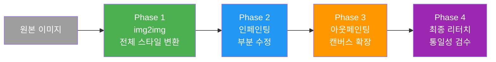
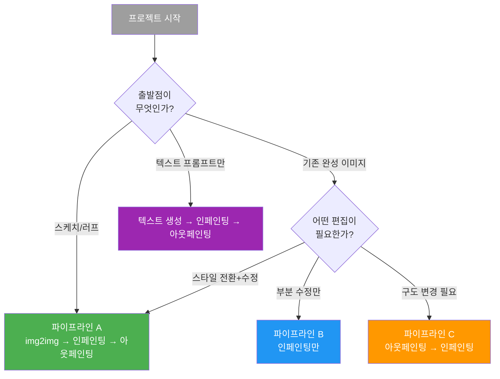
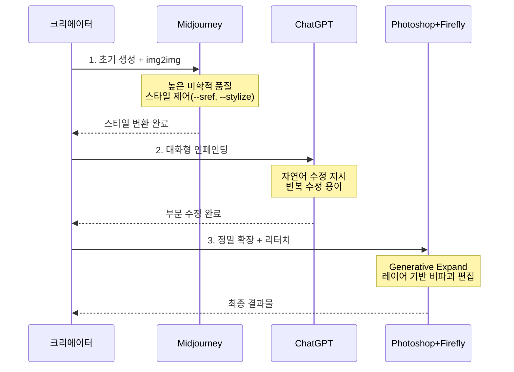

# 편집 기법 조합 실전 프로젝트

> img2img, 인페인팅, 아웃페인팅을 하나의 워크플로우로 엮어 완성도 높은 결과물을 제작하는 멀티 플랫폼 실전 프로젝트

## 개요

이 섹션에서는 Ch6에서 배운 세 가지 편집 기법을 **하나의 통합 워크플로우**로 조합하여 실전 프로젝트를 진행합니다. 실제 디자인 작업에서는 "스케치를 세련된 일러스트로 바꾸고, 배경 요소를 교체하고, 구도를 넓혀달라"는 식의 복합 요청이 대부분이기 때문에, 각 기법의 **최적 조합 순서**를 아는 것이 작업 시간과 품질 모두를 결정합니다.

## 핵심 개념

### 통합 편집 파이프라인 — 최적 조합 순서

세 기법을 조합할 때 핵심 원칙은 **"전체에서 부분으로, 안에서 밖으로"**입니다.



- **Phase 1 — img2img**: 전체 스타일, 색감, 분위기를 한꺼번에 바꿔서 이후 편집의 "기반"을 형성합니다.
- **Phase 2 — 인페인팅**: 전체 스타일이 확정된 후 특정 오브젝트 교체, 표정/의상 수정, 불필요 요소 제거를 진행합니다.
- **Phase 3 — 아웃페인팅**: 내부가 완성된 상태에서 확장해야 가장자리 연결이 자연스럽습니다.
- **Phase 4 — 최종 리터치**: 경계면의 부자연스러운 부분을 인페인팅으로 다듬습니다.

순서를 어기면 문제가 생깁니다. 아웃페인팅을 먼저 하면 확장 영역의 스타일이 원본과 맞지 않고, img2img를 나중에 적용하면 인페인팅으로 정밀하게 수정한 부분까지 함께 변환됩니다.

### 시나리오별 파이프라인 변형

기본 순서가 항상 정답은 아닙니다. 프로젝트의 출발점에 따라 파이프라인을 유연하게 설계합니다.



- **파이프라인 A (풀 파이프라인)**: 스케치를 완성된 작품으로 발전시킬 때
- **파이프라인 B (인페인팅 중심)**: 완성도 높은 이미지에서 특정 요소만 수정할 때
- **파이프라인 C (확장 후 수정)**: 정사각형을 와이드 배너로 만드는 등 구도를 먼저 바꿔야 할 때
- **파이프라인 D (텍스트 시작)**: txt2img로 생성 후 편집으로 완성도를 높일 때

### 멀티 플랫폼 편집 전략

각 플랫폼을 가장 잘하는 단계에 배치하는 것이 핵심입니다.



| 단계 | 최적 플랫폼 | 이유 |
|------|------------|------|
| 초기 생성/img2img | Midjourney | 미학적 품질, --sref/--iw 제어 |
| 빠른 프로토타입 | ChatGPT | 자연어 대화, 즉석 수정 |
| 세밀한 인페인팅 | ChatGPT 또는 Photoshop | 대화형 반복 vs 정밀 마스크 |
| 아웃페인팅 | Photoshop | Generative Expand 비율 제어 |
| 최종 리터치 | Photoshop | 레이어, Enhance Detail |
| 예술적 질감 재생성 | Midjourney | Editor의 Retexture 기능 |

### 핸드오프 규칙 — 품질 손실 없이 이동하기

1. **포맷은 PNG**: JPEG는 인페인팅 경계면에서 압축 아티팩트가 눈에 띕니다. 중간 단계는 반드시 PNG로 저장합니다.
2. **해상도 유지**: Midjourney 출력(1024x1024)을 Photoshop으로 넘길 때는 Upscale로 최소 2048px 이상 확보합니다.
3. **색상 프로파일**: 웹용이면 sRGB를 유지합니다. Photoshop에서 CMYK로 변환하면 색이 달라집니다.
4. **파일 네이밍**: `cafe_01_mj_img2img.png` → `cafe_02_gpt_inpaint.png` → `cafe_03_ps_expand.png` 식으로 단계를 기록합니다.

## 실전 프로젝트 1: 카페 인테리어 컨셉 비주얼

**브리프**: "따뜻한 우드톤의 북유럽 감성 카페" 컨셉 비주얼. 러프 스케치에서 출발하여 Instagram 피드용(4:5)과 웹사이트 배너용(16:9) 두 가지 비율로 제작합니다.

### Step 1 — Midjourney img2img: 스케치를 포토리얼로 변환

러프 스케치를 Midjourney에 업로드하고 img2img를 적용합니다.

```
[스케치 이미지 URL] Scandinavian cafe interior, warm oak wood furniture,
natural daylight through large windows, pendant lights with brass fixtures,
indoor plants, terrazzo floor, architectural photography --ar 4:5 --iw 0.5
--stylize 200
```


`--iw`를 0.3~0.7 사이에서 조절하며 원본 레이아웃을 얼마나 살릴지 결정합니다. 전체 분위기가 80% 정도 마음에 들면 다음 단계로 넘어갑니다.

### Step 2 — ChatGPT 인페인팅: 가구와 소품 교체

Midjourney 결과를 PNG로 다운로드하여 ChatGPT에 업로드합니다. Select 도구로 영역을 지정하고 순서대로 수정합니다.

```
왼쪽 벽면의 선반을 천연 오크 원목 책장으로 바꿔주세요.
커피 관련 서적과 작은 화분이 꽂혀 있는 모습으로요.
```


```
카운터 상판을 흰색 대리석 소재로 바꿔주세요.
위에 에스프레소 머신과 유리 드리퍼 세트가 놓여 있게 해주세요.
```


```
천장 조명을 따뜻한 톤의 라탄 펜던트 조명 3개로 교체해주세요.
높낮이를 다르게 배치해서 리듬감을 주세요.
```


```
창밖 풍경을 가을 단풍이 보이는 조용한 골목길로 바꿔주세요.
부드러운 자연광이 들어오는 느낌으로요.
```


### Step 3 — Midjourney Vary Region: 벽면 아트워크 교체

미학적 감각이 중요한 벽면 아트워크는 Midjourney로 돌아와서 수정합니다.

```
[Step 2 완성 이미지 URL] --ar 4:5
(Vary Region으로 벽면 아트워크 영역 선택)
minimalist botanical line art print in thin oak frame,
Scandinavian aesthetic, muted earth tones
```


### Step 4 — Photoshop Generative Expand: 배너 확장

4:5로 완성된 이미지를 Photoshop에서 16:9로 확장합니다.

```
Crop 도구 → 캔버스를 16:9(2880x1620)로 확장 →
Generative Expand 적용 → 프롬프트:
"continuation of Scandinavian cafe interior,
matching warm oak wood style, more seating area
with cushioned bench along the window"
```


### Step 5 — 최종 리터치

확장 영역에 부자연스러운 부분이 있으면 Generative Fill로 수정합니다.

```
(확장 경계면 선택)
Generative Fill: "seamless wooden floor continuation,
matching terrazzo pattern"
```


전체 이미지를 줌 아웃해서 색감 일관성, 조명 방향 통일, 경계면 자연스러움을 확인합니다.

## 실전 프로젝트 2: 여행 포스터 제작

**브리프**: 흐린 날 찍은 산토리니 여행 사진을 활용하여 맑고 선명한 여행 포스터를 제작합니다. 최종 결과물은 세로형 포스터(3:4) 비율입니다.

### Step 1 — ChatGPT img2img: 날씨 변환

흐린 날의 산토리니 사진을 ChatGPT에 업로드합니다.

```
이 사진의 날씨를 맑은 여름날로 바꿔주세요.
파란 하늘에 뭉게구름이 약간 있고,
햇살이 강하게 비치는 느낌으로요.
산토리니 특유의 파란색과 흰색 건물이 선명하게 보이게 해주세요.
```


### Step 2 — ChatGPT 인페인팅: 관광객 제거 및 요소 정리

```
전경에 보이는 관광객들을 모두 제거해주세요.
그 자리를 돌 계단과 부겐빌레아 꽃으로 자연스럽게 채워주세요.
```


```
왼쪽 아래에 있는 공사 표지판과 쓰레기통을 제거해주세요.
그 자리에 테라코타 화분에 심은 올리브 나무 작은 것을 넣어주세요.
```


### Step 3 — Midjourney img2img: 예술적 색감 강화

포스터다운 강렬한 색감을 위해 Midjourney에서 스타일을 입힙니다.

```
[정리된 산토리니 이미지 URL] vibrant travel poster style,
saturated Mediterranean blue and white, golden hour lighting,
cinematic color grading, editorial photography --ar 3:4
--iw 0.7 --stylize 300
```


### Step 4 — Photoshop: 하단 확장 및 텍스트 공간 확보

```
Crop 도구 → 하단으로 캔버스 20% 확장 →
Generative Expand: "continuation of stone steps leading down,
Mediterranean cobblestone path, bougainvillea flowers"
```


### Step 5 — Photoshop: 텍스트 오버레이 및 최종 마무리

```
텍스트 레이어 추가:
- "SANTORINI" (Didot Bold, 72pt, #FFFFFF, 하단 중앙)
- "Greece · Summer 2026" (Futura Light, 24pt, #FFFFFF, 서브타이틀)
- 반투명 그라데이션 오버레이로 텍스트 가독성 확보
```


## 팁과 주의사항

> 각 플랫폼의 최신 기능을 다 사용할 필요는 없습니다. **가장 빠르게 목표에 도달하는 경로**가 최선입니다. 단순한 배경 교체는 ChatGPT Select 한 번이면 충분합니다.

> 한 플랫폼에서 80% 완성 후 다음 플랫폼으로 이동하세요. 90%를 넘기려고 한 플랫폼에서 오래 붙잡는 것보다, 각 플랫폼의 강점으로 나머지를 채우는 게 총 소요 시간이 짧습니다.

> 멀티 플랫폼 작업 시 **버전 관리**를 반드시 하세요. 파일명에 단계를 표기하면 클라이언트가 "Step 2에서 바꾼 선반, 원래대로 돌려주세요"라고 할 때 해당 단계부터 다시 시작할 수 있습니다.

> 반드시 모든 플랫폼을 거칠 필요는 없습니다. 단순한 프로젝트는 한 플랫폼에서 끝내는 게 효율적이고, 복잡할수록 멀티 플랫폼의 가치가 올라갑니다. 플랫폼을 옮길 때마다 내보내기/업로드 비용이 발생하므로 이동 횟수도 계산하세요.

## 핵심 정리

| 개념 | 설명 |
|------|------|
| 통합 파이프라인 순서 | img2img(전체 변환) → 인페인팅(부분 수정) → 아웃페인팅(확장) → 리터치 |
| 핵심 원칙 | "전체에서 부분으로, 안에서 밖으로" — 큰 변화 먼저, 세밀한 수정 나중에 |
| 파이프라인 변형 | 시나리오에 따라 단계 생략/순서 변경 가능 (확장 먼저, 인페인팅 중심 등) |
| Midjourney 최적 단계 | 초기 생성, img2img, 예술적 요소 수정(Vary Region), Retexture |
| ChatGPT 최적 단계 | 대화형 반복 인페인팅, 빠른 프로토타입, 자연어 수정 |
| Photoshop 최적 단계 | 정밀 마스킹, Generative Expand, 레이어 리터치 |
| 핸드오프 규칙 | PNG 포맷, 2048px 이상, sRGB 유지, 버전별 파일 관리 |

## 다음 섹션 미리보기

다음 챕터 [Ch7. ControlNet과 참조 이미지 활용](07-ch7-controlnet과-참조-이미지-활용/01-01-controlnet-개요-참조-이미지로-제어하기.md)에서는 **구도, 포즈, 깊이 정보를 이미지에서 추출하여 새 이미지 생성을 정밀하게 제어**하는 ControlNet 기술을 배웁니다. img2img가 전체적인 스타일 변환이었다면, ControlNet은 "구조는 유지하되 내용만 바꾸는" 더 정교한 제어를 가능하게 합니다.
