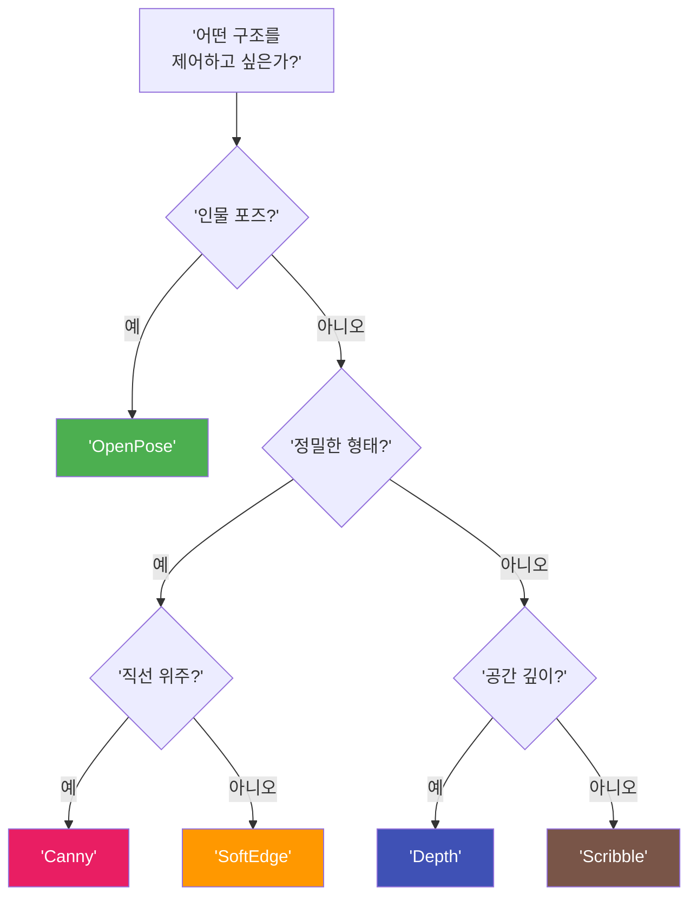

# ControlNet 개요 — 참조 이미지로 제어하기

> 프롬프트만으로는 불가능했던 구도·포즈·깊이 제어, ControlNet이 여는 정밀 제어의 세계

## 개요

ControlNet은 참조 이미지에서 구조 정보(윤곽, 깊이, 포즈 등)를 추출하여 AI 이미지 생성을 정밀하게 제어하는 기술입니다. 텍스트 프롬프트가 "무엇을" 그릴지 전달한다면, ControlNet은 "어디에, 어떤 구도로, 어떤 자세로" 그릴지를 참조 이미지 한 장으로 지정합니다. 이 섹션에서는 5가지 주요 ControlNet 모델의 특성과 선택 기준을 익힙니다.

## 프롬프트의 한계와 ControlNet의 해법

> 인테리어 디자이너에게 전화로 배치를 설명하는 것과 도면을 보여주는 것의 차이 — ControlNet은 AI에게 도면을 건네주는 것과 같습니다.

텍스트 프롬프트는 주제, 스타일, 분위기, 색감은 잘 전달하지만 정확한 구도, 특정 포즈, 공간의 깊이감, 윤곽선의 정밀한 디테일은 전달하기 어렵습니다.

```mermaid
flowchart LR
    A['텍스트 프롬프트'] --> B['AI 모델']
    B --> C['결과: 구도 예측 불가']

    D['텍스트 프롬프트'] --> E['AI 모델']
    F['참조 이미지'] --> G['ControlNet<br/>전처리기']
    G --> H['구조 맵<br/>(엣지/깊이/포즈)']
    H --> E
    E --> I['결과: 구도 정밀 제어']

    style C fill:#FF6B6B,color:#fff
    style I fill:#4CAF50,color:#fff
```

예를 들어 건축 사진의 구도는 유지하면서 수채화 스타일로 변환하고 싶을 때, 프롬프트만으로는 수십 번을 재생성해야 합니다. ControlNet은 첫 시도부터 구조를 정밀하게 재현합니다.

```
건축 사진 → Canny ControlNet 적용
프롬프트: "watercolor painting of a Gothic cathedral, soft washes, artistic brushstrokes"
Control Weight: 0.85
```


## ControlNet 작동 원리

ControlNet은 참조 이미지에서 **구조 정보만** 추출한 뒤, 이 구조를 골격으로 삼아 AI가 새로운 이미지를 생성하도록 안내합니다. 색상, 텍스처, 세부 내용은 프롬프트와 AI 모델이 새롭게 생성합니다.

```mermaid
flowchart TD
    A['참조 이미지<br/>(사진, 스케치 등)'] --> B['전처리기<br/>(Preprocessor)']
    B --> C['구조 맵 생성<br/>(엣지/깊이/포즈 맵)']
    C --> D['ControlNet 모듈']
    E['텍스트 프롬프트'] --> F['Stable Diffusion<br/>U-Net']
    D --> F
    F --> G['최종 이미지']

    style B fill:#FF9800,color:#fff
    style D fill:#2196F3,color:#fff
    style F fill:#9C27B0,color:#fff
```

핵심은 **제로 컨볼루션(Zero Convolution)** 기법입니다. 학습 초기에 ControlNet 출력을 0으로 시작시켜 원본 모델의 생성 품질을 해치지 않으면서 점진적으로 제어 능력을 키워갑니다.

## 전처리기와 구조 맵

전처리기(Preprocessor)는 참조 이미지에서 목적에 맞는 구조만 추출합니다. 같은 사진이라도 전처리기에 따라 완전히 다른 구조 맵이 만들어집니다.

| 전처리기 | 추출하는 것 | 비유 |
|----------|------------|------|
| Canny | 날카로운 윤곽선 | 펜으로 그린 외곽선 |
| Depth | 깊이(거리) 정보 | 지형도의 등고선 |
| OpenPose | 사람의 관절 위치 | 관절 인형의 포즈 |
| SoftEdge | 부드러운 윤곽선 | 연필 스케치 |
| Scribble | 대략적인 스케치 | 냅킨 위의 낙서 |


## 주요 ControlNet 모델 5종

### Canny Edge — 정밀한 윤곽선 제어

건축물의 직선, 제품 외형, 로고 윤곽처럼 정확한 형태가 중요한 작업에 최적입니다.

```
참조: 현대 건축물 사진
모델: Canny
프롬프트: "futuristic cyberpunk building, neon lights, rain-soaked streets, night scene"
Control Weight: 0.9
```

```
참조: 제품 사진 (운동화)
모델: Canny
프롬프트: "transparent crystal sneaker, glass material, studio lighting, product photography"
Control Weight: 0.85
```


### Depth — 공간감과 원근 제어

MiDaS 알고리즘으로 깊이 맵을 추출합니다. 풍경의 원근감 유지, 실내 공간 리디자인에 적합합니다.

```
참조: 산과 호수 풍경 사진
모델: Depth
프롬프트: "impressionist oil painting, Monet style, vibrant colors, thick brushstrokes"
Control Weight: 0.8
```

```
참조: 거실 인테리어 사진
모델: Depth
프롬프트: "minimalist Japanese interior, tatami floor, shoji screens, natural light"
Control Weight: 0.75
```

### OpenPose — 인물 포즈 제어

인물의 관절 위치(키포인트)를 스틱 피겨로 감지합니다. 패션 포즈 재현, 캐릭터 일관성 유지에 필수입니다.

```
참조: 발레리나 포즈 사진
모델: OpenPose
프롬프트: "anime style ballerina, dynamic pose, flowing dress, cherry blossom background"
Control Weight: 0.85
```


### SoftEdge — 부드러운 윤곽 제어

HED 알고리즘 기반으로 자연스러운 그러데이션 경계를 만듭니다. 수채화, 파스텔 풍의 예술적 변환에 적합합니다.

```
참조: 인물 초상화 사진
모델: SoftEdge
프롬프트: "watercolor portrait, soft pastel colors, gentle brush strokes, artistic"
Control Weight: 0.7
```

### Scribble — 러프 스케치 기반 생성

직접 그린 간단한 스케치를 완성된 이미지로 변환합니다. 아이디어 시각화, 디자인 초안 탐색에 유용합니다.

```
참조: 손으로 그린 로봇 스케치
모델: Scribble
프롬프트: "detailed mech robot, metallic surface, sci-fi concept art, dramatic lighting"
Control Weight: 0.75
```

### 모델 선택 가이드



## ControlNet과 다른 제어 방식 비교

| 방식 | 제어 대상 | 정밀도 | 사용 플랫폼 |
|------|----------|--------|------------|
| img2img | 전체 분위기·색감 | 낮음 | Stable Diffusion, 각종 웹 도구 |
| --sref | 스타일·미학 | 중간 | Midjourney |
| --cref | 캐릭터 외형 | 중간 | Midjourney |
| ControlNet | 구도·포즈·깊이·윤곽 | 높음 | Stable Diffusion 생태계, 웹 도구 |

이것들은 경쟁 관계가 아니라 **보완 관계**입니다. ControlNet으로 구도를 잡고, --sref로 스타일을 통일하고, 인페인팅으로 세부를 다듬는 조합이 가능합니다.

## 실습: ControlNet 모델 매칭

아래 시나리오를 읽고, 가장 적합한 ControlNet 모델을 선택해보세요.

| 시나리오 | 적합한 모델 | 이유 |
|----------|------------|------|
| 건축 사진의 구조를 유지하며 고딕 판타지 스타일로 변환 | Canny | 건축물의 날카로운 직선과 구조를 정밀하게 보존 |
| 친구의 댄스 사진 포즈로 애니메이션 캐릭터 생성 | OpenPose | 인물의 관절 위치와 포즈를 정확히 재현 |
| 산과 호수가 있는 풍경을 인상파 회화로 재해석 | Depth | 전경·중경·배경의 깊이감을 유지 |
| 냅킨에 그린 로봇 스케치를 전문 일러스트로 발전 | Scribble | 대략적인 스케치에서 완성 이미지로 발전 |
| 인물 사진을 부드러운 수채화 초상화로 변환 | SoftEdge | 부드러운 경계와 자연스러운 전환이 중요 |

실습 프롬프트 예시:

```
1단계: 참조 이미지 선택 후 Canny 전처리 적용
프롬프트: "oil painting style, dramatic lighting, rich colors"
Control Weight: 0.85, Guidance Scale: 7.5
```

```
2단계: 같은 참조 이미지로 Depth 전처리 적용
프롬프트: "oil painting style, dramatic lighting, rich colors"
Control Weight: 0.8, Guidance Scale: 7.5
→ Canny 결과와 비교하여 차이점 확인
```


## 팁과 주의사항

- **입문 순서**: Canny부터 시작하세요. 입력과 출력의 관계가 가장 직관적이어서 원리를 빠르게 이해할 수 있습니다. 이후 Depth, OpenPose 순서로 확장하면 학습 곡선이 부드럽습니다.
- **Control Weight 조절**: 강도를 낮추면(0.5~0.7) 참조 구조를 느슨하게, 높이면(0.8~1.0) 엄격하게 따릅니다. 보통 0.7~0.85가 최적이며, 너무 높으면 아티팩트가 발생할 수 있습니다.
- **멀티 ControlNet**: 여러 ControlNet을 동시에 적용할 수 있습니다. 예를 들어 Depth로 공간감 + OpenPose로 포즈를 동시에 제어하는 조합이 가능합니다.
- **구조만 제어**: ControlNet은 참조 이미지를 복사하지 않습니다. 같은 구조 맵에 "유화", "수채화", "사이버펑크" 등 다른 프롬프트를 적용하면 전혀 다른 분위기의 결과가 나옵니다.
- **사용 플랫폼**: AUTOMATIC1111/Forge WebUI, ComfyUI(로컬), getimg.ai, Shakker AI(웹 기반) 등에서 사용 가능합니다.

## 핵심 정리

| 개념 | 설명 |
|------|------|
| ControlNet | 참조 이미지의 구조를 추출하여 AI 이미지 생성을 정밀 제어하는 신경망 |
| 전처리기 | 참조 이미지에서 특정 유형의 구조 맵을 추출하는 알고리즘 |
| Canny | 날카로운 윤곽선 추출. 건축, 제품 등 정밀한 형태 유지에 최적 |
| Depth | 깊이 맵 추출. 공간감과 원근 유지에 최적 |
| OpenPose | 인물 관절 위치 추출. 포즈 재현에 최적 |
| SoftEdge | 부드러운 경계선 추출. 예술적 스타일 변환에 최적 |
| Scribble | 러프 스케치 기반 생성. 아이디어를 완성된 이미지로 발전 |
| 구조 맵 | 전처리기가 추출한 중간 결과물. ControlNet의 실질적 입력 |
| Control Weight | 구조 제어 강도. 0.7~0.85가 일반적 최적 범위 |

## 다음 섹션 미리보기

다음 [02. 구도와 깊이 제어 — Canny/Depth 활용](07-ch7-controlnet과-참조-이미지-활용/02-02-구도와-깊이-제어-cannydepth-활용.md)에서는 Canny와 Depth 모델을 실제로 적용하는 구체적인 방법을 다룹니다. 건축물 스타일 변환, 풍경 원근 유지 등 실전 시나리오에서 세부 설정과 최적의 활용법을 익혀보겠습니다.
