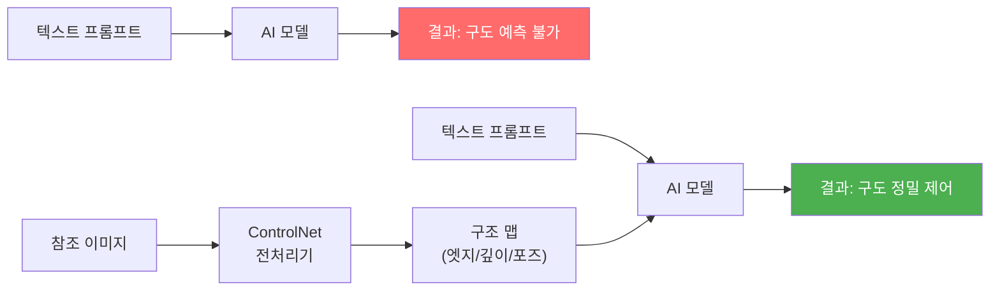
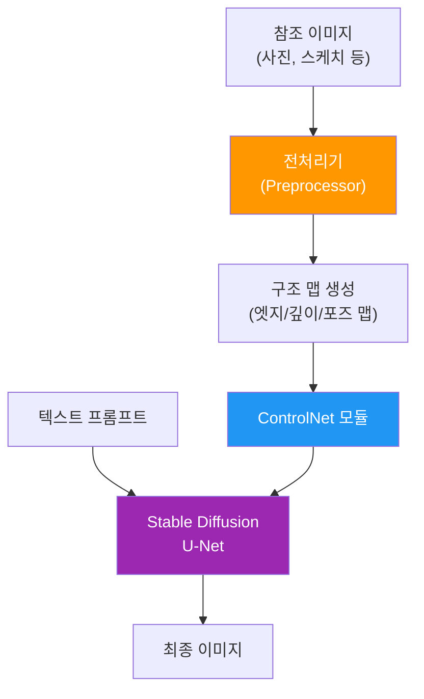
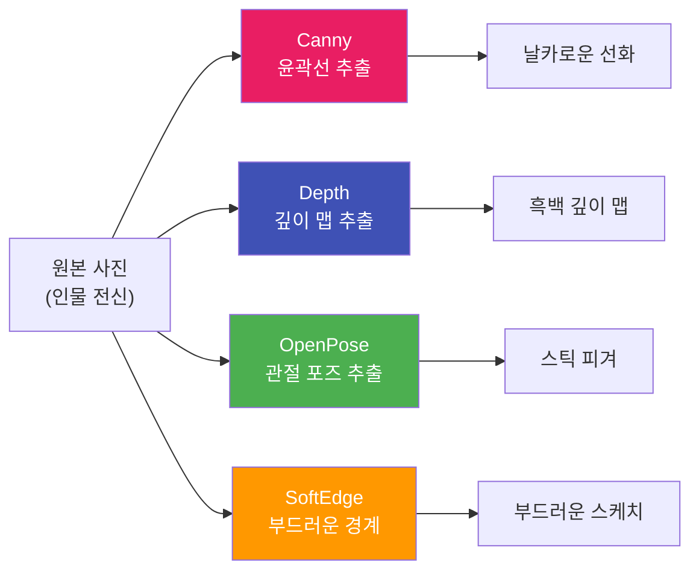
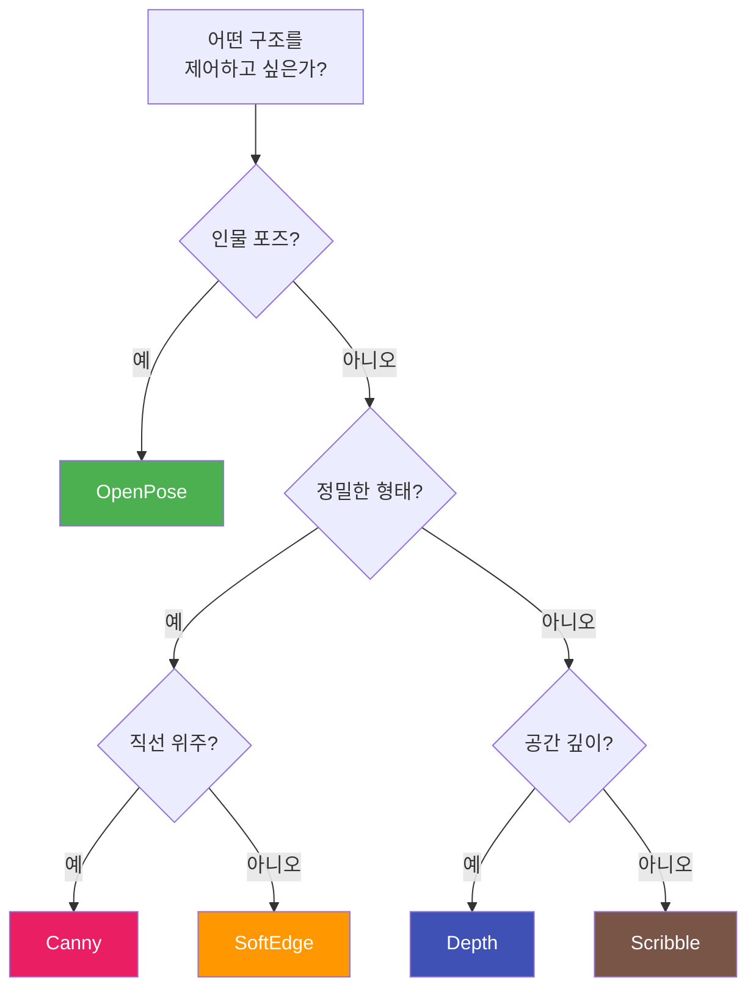
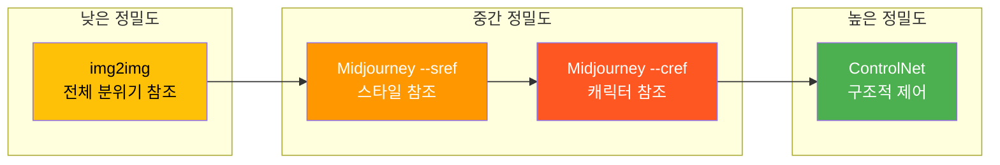

# ControlNet 개요 — 참조 이미지로 제어하기

> 프롬프트만으로는 불가능했던 구도·포즈·깊이 제어, ControlNet이 여는 정밀 제어의 세계

## 개요

이 섹션에서는 ControlNet이 무엇이고, 왜 AI 이미지 생성에서 혁신적인 도구로 자리 잡았는지를 살펴봅니다. 프롬프트만으로는 원하는 구도와 포즈를 정확히 재현하기 어려운 한계를 이해하고, ControlNet의 다양한 모델 유형(Canny, Depth, OpenPose, SoftEdge 등)이 각각 어떤 상황에 적합한지 파악합니다.

**선수 지식**: [Ch6. 이미지 편집 기법](06-ch6-이미지-편집-기법-img2img인페인팅아웃페인팅/01-01-img2img-이미지-기반-변환의-원리.md)에서 배운 img2img의 기본 원리, 그리고 [프롬프트 6요소 프레임워크](02-ch2-프롬프트-구조-마스터/01-01-프롬프트-해부학-6요소-프레임워크.md)에 대한 이해

**학습 목표**:
- ControlNet이 해결하는 핵심 문제를 설명할 수 있다
- ControlNet의 작동 원리를 비유를 통해 직관적으로 이해한다
- 주요 ControlNet 모델 5종(Canny, Depth, OpenPose, SoftEdge, Scribble)의 역할과 적합한 사용 시나리오를 구분할 수 있다
- 작업 목적에 따라 올바른 ControlNet 모델을 선택할 수 있다

## 왜 알아야 할까?

여러분이 멋진 건축 사진을 찾았다고 상상해보세요. 이 건물의 구도와 각도는 그대로 유지하면서, 스타일만 수채화로 바꾸고 싶습니다. 프롬프트에 "같은 구도의 수채화 건축물"이라고 아무리 자세히 적어도, AI는 전혀 다른 구도의 건물을 그려냅니다. 왜 그럴까요?

텍스트 프롬프트는 **"무엇을"** 그릴지는 잘 전달하지만, **"어디에, 어떤 자세로, 어떤 구도로"** 그릴지는 전달하기 어렵습니다. 실제로 특정 구도를 유지하려 할 때 텍스트만으로는 구조적 정확도가 크게 떨어지는 반면, ControlNet을 사용하면 극적으로 향상됩니다. 프롬프트만으로는 원하는 구도가 나올 때까지 수십 번을 재생성해야 하지만, ControlNet은 첫 시도부터 구조를 정밀하게 재현해내죠.

디자이너에게 이것은 게임 체인저입니다. 클라이언트가 "이 포즈 그대로, 스타일만 바꿔주세요"라고 요청할 때, ControlNet 없이는 수십 번 재생성을 반복해야 합니다. ControlNet을 알면, 참조 이미지 한 장으로 원하는 결과를 단번에 얻을 수 있죠.

## 핵심 개념

### 개념 1: 프롬프트의 한계 — 왜 텍스트만으로는 부족한가

> 💡 **비유**: 전화로 인테리어 설명하기 vs 도면 보여주기

인테리어 디자이너에게 전화로 "거실 왼쪽에 소파, 오른쪽에 책장, 중앙에 테이블"이라고 설명한다고 생각해보세요. 디자이너가 그린 결과물은 여러분이 머릿속에 그린 것과 분명히 다를 겁니다. 하지만 도면이나 사진을 보여주면? 한 번에 "아, 이런 느낌이군요!"라고 이해하죠.

AI 이미지 생성도 마찬가지입니다. 텍스트 프롬프트는 전화 통화와 같고, ControlNet은 도면을 건네주는 것과 같습니다.

> 📊 **그림 1**: 텍스트 프롬프트 vs ControlNet 제어 비교

프롬프트만 사용할 경우 AI는 학습 데이터에서 "가장 그럴듯한" 구도를 스스로 결정합니다. "왼쪽을 바라보는 여성 초상화"라고 입력해도, 시선 방향, 고개 기울기, 어깨 위치는 매번 달라지죠. 이것이 바로 프롬프트의 근본적 한계입니다.

**프롬프트가 잘 전달하는 것**:
- 주제 (무엇을 그릴지)
- 스타일 (유화, 수채화, 사진 등)
- 분위기와 조명
- 색감과 톤

**프롬프트가 잘 전달하지 못하는 것**:
- 정확한 구도와 배치
- 특정 포즈와 자세
- 공간의 깊이감과 원근
- 윤곽선과 형태의 정밀한 디테일

### 개념 2: ControlNet의 작동 원리

> 💡 **비유**: 트레이싱 페이퍼(기름종이) 위에 그리기

어렸을 때 좋아하는 그림 위에 트레이싱 페이퍼를 올려놓고 윤곽선만 따라 그린 경험이 있으신가요? 윤곽선은 원본 그림에서 가져오되, 색칠은 자유롭게 — 이것이 바로 ControlNet의 원리입니다.

ControlNet은 참조 이미지에서 **구조 정보**(윤곽, 깊이, 포즈 등)만 추출한 뒤, 이 구조를 "골격"으로 삼아 AI가 새로운 이미지를 생성하도록 안내합니다.

> 📊 **그림 2**: ControlNet 처리 파이프라인

기술적으로 설명하면, ControlNet은 Stable Diffusion의 U-Net(노이즈 예측기) 내부에 부착되는 추가 네트워크입니다. 원본 모델의 가중치는 "잠금(locked)" 상태로 보존하고, 별도의 "학습 가능한(trainable)" 복사본이 참조 이미지의 구조 신호를 주입합니다. 이 구조 덕분에 원래 모델의 생성 품질을 해치지 않으면서도 정밀한 공간 제어가 가능한 거죠.

핵심은 **"제로 컨볼루션(Zero Convolution)"**이라는 기법입니다. 학습 초기에 ControlNet의 출력을 0으로 시작시켜서, 원본 모델에 해를 끼치지 않으면서 점진적으로 제어 능력을 키워가는 영리한 설계입니다.

> ⚠️ **흔한 오해**: "ControlNet은 참조 이미지를 복사하는 거 아닌가요?" — 아닙니다! ControlNet은 참조 이미지의 **구조 정보만** 추출합니다. 색상, 텍스처, 세부 내용은 프롬프트와 AI 모델이 새롭게 생성합니다. 복사가 아니라 "구조적 영감"을 받는 것이죠.

### 개념 3: 전처리기(Preprocessor) — 구조 추출의 핵심

> 💡 **비유**: X선 촬영처럼 내부 구조만 보기

병원에서 X선을 찍으면 피부와 살은 투과하고 뼈만 보이죠? ControlNet의 전처리기도 비슷합니다. 사진의 "겉모습"은 걷어내고, 목적에 맞는 "내부 구조"만 추출합니다.

전처리기의 종류에 따라 추출하는 구조가 달라집니다:

| 전처리기 | 추출하는 것 | 비유 |
|----------|------------|------|
| Canny | 날카로운 윤곽선 | 펜으로 그린 외곽선 |
| Depth | 깊이(거리) 정보 | 지형도의 등고선 |
| OpenPose | 사람의 관절 위치 | 관절 인형의 포즈 |
| SoftEdge | 부드러운 윤곽선 | 연필 스케치 |
| Scribble | 대략적인 스케치 | 냅킨 위의 낙서 |

같은 사진이라도 어떤 전처리기를 사용하느냐에 따라 완전히 다른 구조 맵이 만들어집니다. 이것이 ControlNet의 강력함이자 유연함입니다.

> 📊 **그림 3**: 하나의 참조 이미지에서 다양한 구조 맵 추출

### 개념 4: 주요 ControlNet 모델 5종 상세 가이드

#### Canny Edge — 정밀한 윤곽선 제어

Canny는 이미지에서 명암 대비가 큰 부분의 **날카로운 경계선**을 추출합니다. 건축물의 직선, 제품의 외형, 로고의 윤곽처럼 정확한 형태가 중요한 작업에 최적입니다.

**적합한 사용 시나리오**:
- 건축물 외관의 스타일 변환 (구조는 유지, 재질만 변경)
- 제품 디자인의 변형 (형태 유지, 색상·소재 변경)
- 라인아트 기반의 정밀한 일러스트레이션

**부적합한 경우**: 자연 풍경처럼 유기적이고 부드러운 형태를 다룰 때 (너무 딱딱해 보임)

#### Depth — 공간감과 원근 제어

Depth 모델은 MiDaS 알고리즘을 사용해 이미지의 **깊이 맵**을 추출합니다. 가까운 물체는 밝게, 먼 물체는 어둡게 표현하여 3차원 공간 관계를 평면 위에 담아냅니다.

**적합한 사용 시나리오**:
- 풍경 사진의 원근감을 유지하며 스타일 변환
- 실내 인테리어의 공간 배치를 보존하며 리디자인
- 전경·중경·배경의 레이어 구분이 중요한 장면 구성

**부적합한 경우**: 평면적인 패턴 디자인이나 2D 일러스트 (깊이 정보가 무의미)

#### OpenPose — 인물 포즈 제어

OpenPose는 사진 속 인물의 **관절 위치(키포인트)**를 감지합니다. 머리, 어깨, 팔꿈치, 손목, 엉덩이, 무릎, 발목 등 주요 관절을 스틱 피겨로 시각화하죠. 최근에는 더 정밀한 DWPose 알고리즘도 등장했습니다.

**적합한 사용 시나리오**:
- 패션 모델의 특정 포즈를 다른 스타일로 재현
- 캐릭터 일러스트에서 일관된 포즈 유지
- 댄스 동작이나 운동 자세의 시각화

**부적합한 경우**: 인물이 없는 풍경이나 정물 (감지할 관절이 없음)

#### SoftEdge — 부드러운 윤곽 제어

SoftEdge는 Canny와 달리 **부드럽고 자연스러운 경계선**을 추출합니다. HED(Holistically-Nested Edge Detection) 알고리즘을 기반으로, 딱딱한 선 대신 자연스러운 그러데이션 경계를 만들어냅니다.

**적합한 사용 시나리오**:
- 수채화, 파스텔 풍의 예술적 변환
- 인물 초상화의 부드러운 스타일 변환
- 유기적 형태(식물, 동물)의 자연스러운 재해석

**부적합한 경우**: 건축 도면이나 기계 부품처럼 정밀한 직선이 필요한 경우

#### Scribble — 러프 스케치 기반 생성

Scribble은 대략적인 스케치나 낙서로부터 이미지를 생성하는 모델입니다. 여러분이 직접 그린 간단한 스케치를 입력으로 받을 수도 있고, 기존 이미지에서 대략적인 윤곽을 추출할 수도 있습니다.

**적합한 사용 시나리오**:
- 아이디어 스케치를 완성된 이미지로 변환
- 화이트보드 드로잉을 전문적인 비주얼로 발전
- 디자인 초안에서 다양한 완성 버전 탐색

**부적합한 경우**: 정밀한 구조 재현이 필요한 경우 (Canny가 더 적합)

> 📊 **그림 4**: ControlNet 모델 선택 가이드 — 작업 목적별 의사결정

### 개념 5: ControlNet과 다른 제어 방식 비교

ControlNet만이 참조 이미지를 활용한 유일한 방법은 아닙니다. 앞서 배운 img2img나, Midjourney의 --sref/--cref 같은 파라미터도 참조 기반 제어를 제공하죠. 하지만 제어의 **대상과 정밀도**가 다릅니다.

> 📊 **그림 5**: 참조 이미지 기반 제어 방식 비교

| 방식 | 제어 대상 | 정밀도 | 사용 플랫폼 |
|------|----------|--------|------------|
| img2img | 전체 분위기·색감 | 낮음 | Stable Diffusion, 각종 웹 도구 |
| --sref | 스타일·미학 | 중간 | Midjourney |
| --cref | 캐릭터 외형 | 중간 | Midjourney |
| ControlNet | 구도·포즈·깊이·윤곽 | 높음 | Stable Diffusion 생태계, 웹 도구 |

중요한 점은 이것들이 **경쟁 관계가 아니라 보완 관계**라는 것입니다. ControlNet으로 구도를 잡고, --sref로 스타일을 통일하고, 인페인팅으로 세부를 다듬는 것처럼 조합해서 사용하면 훨씬 강력한 워크플로우가 완성됩니다.

## 실습: 적용해보기

### 활동 1: ControlNet 모델 매칭 워크시트

아래 시나리오를 읽고, 가장 적합한 ControlNet 모델을 선택해보세요.

| 시나리오 | 적합한 모델 | 이유 |
|----------|------------|------|
| 건축 사진의 구조를 유지하며 고딕 판타지 스타일로 변환 | ? | |
| 친구의 댄스 사진 포즈로 애니메이션 캐릭터 생성 | ? | |
| 산과 호수가 있는 풍경을 인상파 회화로 재해석 | ? | |
| 냅킨에 그린 로봇 스케치를 전문 일러스트로 발전 | ? | |
| 인물 사진을 부드러운 수채화 초상화로 변환 | ? | |

**정답 가이드**:
1. **Canny** — 건축물의 날카로운 직선과 구조를 정밀하게 보존해야 함
2. **OpenPose** — 인물의 관절 위치와 포즈를 정확히 재현해야 함
3. **Depth** — 전경(호수)·중경(산)·배경(하늘)의 깊이감을 유지해야 함
4. **Scribble** — 대략적인 스케치에서 완성된 이미지로 발전시키는 작업
5. **SoftEdge** — 부드러운 경계와 자연스러운 전환이 중요한 예술적 스타일

### 활동 2: 비교 분석 토론

다음 질문에 대해 생각해보세요:

1. "같은 참조 사진에 Canny와 SoftEdge를 각각 적용하면, 결과물에서 가장 큰 차이는 무엇일까요?"
2. "실내 인테리어 리디자인 프로젝트에서 Depth가 Canny보다 나은 선택인 이유는 무엇일까요?"
3. "ControlNet 없이 프롬프트만으로 특정 포즈를 재현하려면, 어떤 시행착오를 겪게 될까요?"

### 활동 3: 나의 프로젝트에 적용하기

자신의 디자인 작업 중 하나를 떠올려보세요. 다음 양식을 채워봅시다:

- **프로젝트**: (예: SNS 썸네일 시리즈)
- **참조 이미지 유형**: (예: 기존에 만든 제품 사진)
- **유지하고 싶은 구조**: (예: 제품 배치와 각도)
- **변경하고 싶은 요소**: (예: 배경 스타일을 네온 사이버펑크로)
- **선택할 ControlNet 모델**: (예: Canny)
- **선택 이유**: (예: 제품 외곽선의 정밀한 보존이 필요)

## 더 깊이 알아보기

### ControlNet의 탄생 이야기 — UC San Diego 대학원생이 만든 혁신

ControlNet은 2023년 2월, UC San Diego(캘리포니아 대학교 샌디에이고)의 대학원생 **Lvmin Zhang(장뤼민)**이 Anyi Rao, Maneesh Agrawala와 함께 발표한 논문 "Adding Conditional Control to Text-to-Image Diffusion Models"에서 시작되었습니다.

놀랍게도 이 연구의 핵심 아이디어는 매우 실용적인 불편함에서 출발했습니다. 당시 Stable Diffusion은 텍스트만으로 놀라운 이미지를 생성할 수 있었지만, 디지털 아티스트들은 "이 구도 그대로, 스타일만 바꿔달라"는 간단한 요청조차 수십 번의 시행착오를 반복해야 했거든요.

Zhang이 제안한 **제로 컨볼루션(Zero Convolution)** 아이디어가 핵심이었습니다. 새로운 제어 네트워크를 기존 모델에 연결할 때, 처음에는 출력을 0으로 시작시켜서 원본 모델에 전혀 해를 끼치지 않게 한 것이죠. 마치 기존 건물에 증축을 할 때, 기존 구조를 전혀 건드리지 않고 옆에 새 건물을 붙이는 것과 같습니다.

이 논문은 2023년 10월 파리에서 열린 **ICCV 2023(국제 컴퓨터 비전 학회)**에서 **최우수 논문상(Marr Prize)**을 수상했습니다. 학술적으로 인정받은 것은 물론, GitHub에 오픈소스로 공개되자마자 커뮤니티가 폭발적으로 성장했습니다. 수개월 만에 수십 종의 커스텀 ControlNet 모델이 등장했고, 2023년 5월에는 성능을 개선한 **ControlNet 1.1**이 출시되어 Stable Diffusion 1.5와 2.x를 위한 사전 학습 모델이 제공되었습니다.

> 💡 **알고 계셨나요?**: ControlNet의 개발자 Lvmin Zhang의 GitHub 이름은 "lllyasviel"인데, 이는 일본 애니메이션 캐릭터에서 따온 것입니다. AI 이미지 생성 분야에서 가장 영향력 있는 도구 중 하나를 만든 연구자가 애니메이션 팬이라는 사실이 이 분야의 문화를 잘 보여주죠.

### ControlNet이 사용할 수 있는 플랫폼

ControlNet은 오픈소스 Stable Diffusion 생태계를 중심으로 발전했지만, 이제는 다양한 플랫폼에서 접근할 수 있습니다:

- **Stable Diffusion WebUI (AUTOMATIC1111/Forge)**: 가장 풍부한 ControlNet 옵션. 로컬 설치 필요
- **ComfyUI**: 노드 기반 워크플로우로 ControlNet을 유연하게 조합
- **웹 기반 서비스**: getimg.ai, Shakker AI, SeaArt 등에서 브라우저만으로 사용 가능
- **Midjourney**: ControlNet 자체는 지원하지 않지만, --sref와 --cref로 유사한 참조 기반 제어를 제공 (다음 섹션에서 상세히 다룹니다)

## 흔한 오해와 팁

> ⚠️ **흔한 오해**: "ControlNet을 쓰면 무조건 원본과 똑같은 이미지가 나온다" — ControlNet은 **구조**만 제어합니다. 같은 구조 맵에 "유화", "수채화", "네온 사이버펑크" 등 다른 프롬프트를 적용하면 전혀 다른 분위기의 결과가 나옵니다. 구조적 뼈대만 공유할 뿐이에요.

> ⚠️ **흔한 오해**: "ControlNet 모델은 하나만 선택해야 한다" — 고급 사용자들은 여러 ControlNet을 동시에 적용합니다. 예를 들어 Depth로 공간감을 잡고 + OpenPose로 포즈를 제어하는 **멀티 ControlNet** 조합이 가능합니다. 물론 처음에는 하나씩 익히는 것이 좋습니다.

> 🔥 **실무 팁**: ControlNet을 처음 사용할 때는 **Canny부터 시작**하세요. 입력과 출력의 관계가 가장 직관적이어서 "아, 이렇게 동작하는구나"를 빠르게 이해할 수 있습니다. Canny에 익숙해진 후 Depth → OpenPose 순서로 확장하면 학습 곡선이 부드럽습니다.

> 🔥 **실무 팁**: ControlNet의 **제어 강도(Control Weight)**를 조절할 수 있다는 걸 기억하세요. 강도를 낮추면 참조 구조를 느슨하게 따르고, 높이면 엄격하게 따릅니다. 보통 0.7~1.0 사이가 최적이며, 너무 높으면 아티팩트가 발생할 수 있습니다.

## 핵심 정리

| 개념 | 설명 |
|------|------|
| ControlNet | 참조 이미지의 구조(윤곽, 깊이, 포즈 등)를 추출하여 AI 이미지 생성을 정밀 제어하는 신경망 |
| 전처리기(Preprocessor) | 참조 이미지에서 특정 유형의 구조 맵을 추출하는 알고리즘 |
| Canny | 날카로운 윤곽선 추출. 건축, 제품 등 정밀한 형태 유지에 최적 |
| Depth | 깊이 맵 추출. 공간감과 원근 유지에 최적 |
| OpenPose | 인물 관절 위치 추출. 포즈 재현에 최적 |
| SoftEdge | 부드러운 경계선 추출. 예술적 스타일 변환에 최적 |
| Scribble | 러프 스케치 기반 생성. 아이디어를 완성된 이미지로 발전 |
| 제로 컨볼루션 | ControlNet의 핵심 기법. 기존 모델을 해치지 않으며 제어 능력을 추가 |
| 구조 맵 | 전처리기가 추출한 중간 결과물. ControlNet의 실질적 입력 |

## 다음 섹션 미리보기

이번 섹션에서 ControlNet의 전체 그림을 파악했다면, 다음 [02. 구도와 깊이 제어 — Canny/Depth 활용](07-ch7-controlnet과-참조-이미지-활용/02-02-구도와-깊이-제어-cannydepth-활용.md)에서는 Canny와 Depth 모델을 실제로 적용하는 구체적인 방법을 다룹니다. 건축물 스타일 변환, 풍경 원근 유지 등 실전 시나리오를 통해 두 모델의 세부 설정과 최적의 활용법을 익혀보겠습니다.

## 참고 자료

- [ControlNet: A Complete Guide (Stable Diffusion Art)](https://stable-diffusion-art.com/controlnet/) - ControlNet 모델별 상세 가이드와 사용 예시를 포함한 종합 튜토리얼
- [Adding Conditional Control to Text-to-Image Diffusion Models (arXiv)](https://arxiv.org/abs/2302.05543) - Lvmin Zhang의 원본 논문. ControlNet의 이론적 기반과 제로 컨볼루션 기법 설명
- [ControlNet GitHub Repository (lllyasviel)](https://github.com/lllyasviel/ControlNet) - 공식 오픈소스 코드와 사전 학습 모델
- [The Ultimate Guide to ControlNet (Civitai Education)](https://education.civitai.com/civitai-guide-to-controlnet/) - 커뮤니티 기반의 실용적 ControlNet 활용 가이드
- [ControlNet in Diffusers (Hugging Face)](https://huggingface.co/blog/controlnet) - Hugging Face Diffusers 라이브러리에서의 ControlNet 사용법

---
### 🔗 Related Sessions
- [img2img](06-ch6-이미지-편집-기법-img2img인페인팅아웃페인팅/01-01-img2img-이미지-기반-변환의-원리.md) (prerequisite)
