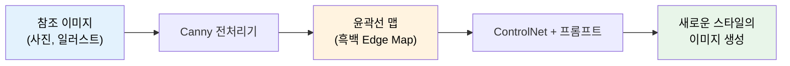
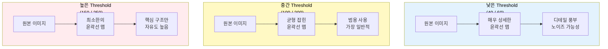
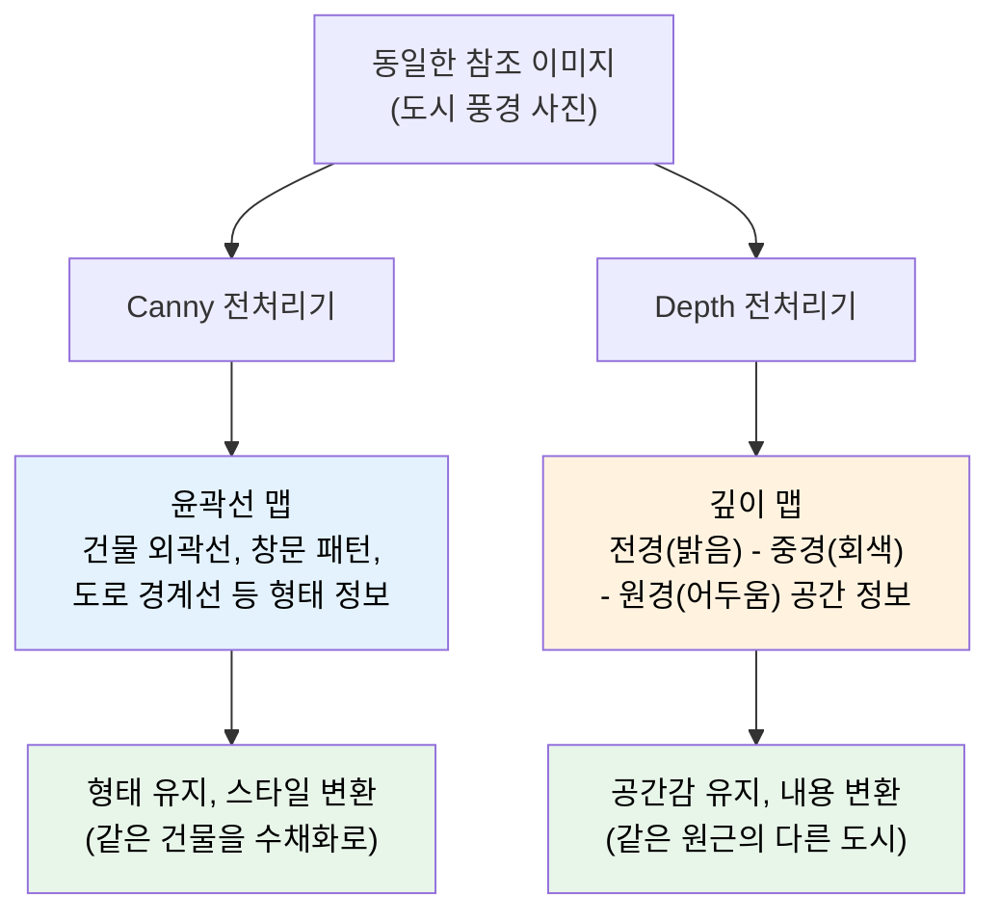
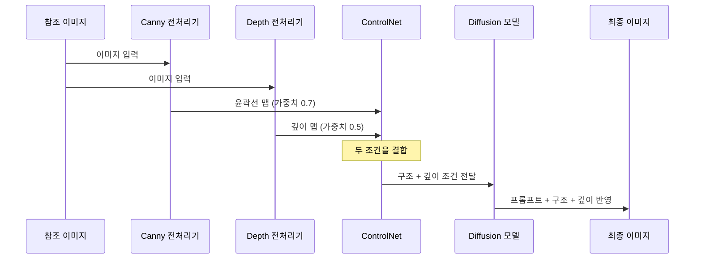
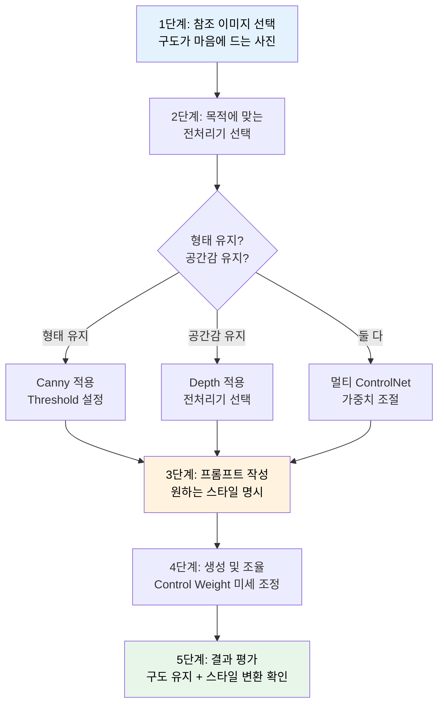

# 구도와 깊이 제어 — Canny·Depth 활용

> 참조 이미지에서 윤곽선과 원근감을 추출하여, 구도는 유지하면서 완전히 새로운 스타일로 이미지를 재탄생시키는 기술을 배웁니다.

## 개요

이 섹션에서는 ControlNet의 가장 널리 쓰이는 두 모델인 **Canny Edge**와 **Depth Map**을 깊이 있게 다룹니다. 이전 섹션에서 ControlNet의 전체 구조와 다양한 모델 유형을 개관했다면, 이번에는 Canny와 Depth를 실제 워크플로우에 적용하는 구체적인 방법을 학습합니다.

**선수 지식**: [01. ControlNet 개요 — 참조 이미지로 제어하기](07-ch7-controlnet과-참조-이미지-활용/01-01-controlnet-개요-참조-이미지로-제어하기.md)에서 배운 ControlNet의 기본 원리, 전처리기 개념, 주요 모델 유형 구분

**학습 목표**:
- Canny Edge 전처리기의 Low/High Threshold가 결과에 미치는 영향을 이해한다
- Depth Map 전처리기(MiDaS, Depth Anything, LeReS, Zoe Depth)의 특징과 적합한 활용 장면을 구분한다
- 참조 이미지에서 구도만 추출하여 완전히 다른 스타일로 재생성하는 워크플로우를 수행할 수 있다
- Canny와 Depth를 조합하여 더 정밀한 구조 제어를 할 수 있다

## 왜 알아야 할까?

디자이너에게 가장 흔한 상황 중 하나를 생각해보세요. 클라이언트가 "이 사진의 구도는 좋은데, 수채화 느낌으로 바꿔주세요"라고 요청합니다. 또는 "이 건축물 사진의 원근감은 유지하되, 사이버펑크 스타일로 만들어주세요"라고 하죠.

[img2img](06-ch6-이미지-편집-기법-img2img인페인팅아웃페인팅/01-01-img2img-이미지-기반-변환의-원리.md)만으로는 구도를 정확히 유지하기 어렵습니다. Denoising Strength를 높이면 구도가 무너지고, 낮추면 스타일 변환이 불충분하거든요. 바로 이 딜레마를 해결하는 것이 Canny와 Depth입니다.

**Canny**는 윤곽선을 추출해서 "무엇이 어디에 있는지"를 정확히 전달하고, **Depth**는 깊이 정보를 추출해서 "무엇이 가깝고 무엇이 먼지"를 전달합니다. 이 두 가지를 적절히 활용하면, 구도와 원근감은 완벽히 보존하면서도 스타일은 완전히 자유롭게 바꿀 수 있죠.

## 핵심 개념

### 개념 1: Canny Edge — 윤곽선으로 구도 잡기

> 💡 **비유**: Canny Edge는 트레이싱지(투사지)와 같습니다. 사진 위에 투사지를 놓고 윤곽선만 따라 그리면, 원본의 구도와 형태는 그대로인데 색감과 스타일은 완전히 새로 칠할 수 있죠. Canny가 바로 이 "디지털 트레이싱"을 해주는 겁니다.

Canny Edge Detection은 1986년 존 캐니(John F. Canny)가 개발한 고전적인 컴퓨터 비전 알고리즘입니다. 이 알고리즘은 이미지에서 밝기가 급격하게 변하는 지점, 즉 **경계선(edge)**을 찾아냅니다.

ControlNet에서 Canny 전처리기는 참조 이미지를 흑백 윤곽선 이미지로 변환합니다. 이 윤곽선 이미지가 AI에게 "이 구조를 따라서 그려라"는 가이드 역할을 하는 거죠.

> 📊 **그림 1**: Canny Edge ControlNet 워크플로우

**핵심은 Threshold(임계값) 조절입니다.** Canny 전처리기에는 두 개의 중요한 파라미터가 있는데요:

| 파라미터 | 역할 | 낮은 값 효과 | 높은 값 효과 |
|----------|------|-------------|-------------|
| **Low Threshold** | 이 값 이하의 약한 에지를 무시 | 더 많은 디테일 감지 | 주요 윤곽만 남김 |
| **High Threshold** | 이 값 이상의 강한 에지를 확정 | 거의 모든 에지 포함 | 매우 뚜렷한 에지만 포함 |

두 임계값 사이에 있는 에지는 **강한 에지와 연결되어 있을 때만** 포함됩니다. 이것을 **히스테리시스 임계처리(Hysteresis Thresholding)**라고 부릅니다.

> 📊 **그림 2**: Threshold 설정에 따른 Canny 결과 비교

**장르별 추천 Threshold 설정**:

- **건축물/제품 사진** → High (150/250): 날카롭고 정밀한 에지로 구조를 정확히 재현
- **인물/초상화** → Low~Mid (50/150): 얼굴의 부드러운 곡선을 충분히 캡처
- **풍경/자연** → Mid (100/200): 적당한 디테일과 자유도의 균형
- **일러스트/만화** → Low (40/100): 이미 선명한 윤곽선이므로 낮아도 충분

> ⚠️ **흔한 오해**: "Threshold를 낮추면 무조건 좋은 결과가 나온다"고 생각하기 쉽지만, 너무 낮으면 노이즈까지 에지로 감지되어 오히려 AI가 혼란스러워합니다. 또한 디테일이 너무 많으면 AI가 스타일을 자유롭게 해석할 여지가 줄어들어요.

### 개념 2: Depth Map — 원근감으로 공간 구성하기

> 💡 **비유**: Depth Map은 극장 무대의 층별 배치도와 같습니다. "이 배우는 무대 앞(가까움), 이 소품은 무대 중간, 저 배경은 무대 맨 뒤"라고 정보를 제공하면, 연출가(AI)는 어떤 장르의 연극이든 같은 공간감으로 무대를 꾸밀 수 있죠. Depth Map이 바로 이 "공간 배치도" 역할을 합니다.

Depth Map은 2D 이미지에서 각 픽셀이 카메라로부터 얼마나 멀리 떨어져 있는지를 추정한 **회색조(grayscale) 이미지**입니다. 밝은 부분이 가까운 곳, 어두운 부분이 먼 곳을 나타내죠.

Canny가 "형태의 경계"를 전달한다면, Depth는 "공간의 깊이"를 전달합니다. 이 둘은 근본적으로 다른 정보를 담고 있어서, 용도도 상당히 다릅니다.

> 📊 **그림 3**: Canny vs Depth가 추출하는 정보 비교

**주요 Depth 전처리기 비교**:

ControlNet에서 사용할 수 있는 깊이 전처리기는 여러 가지가 있는데요, 각각 강점이 다르기 때문에 장면에 맞게 선택하는 것이 중요합니다.

| 전처리기 | 특징 | 적합한 상황 | 참고 |
|----------|------|------------|------|
| **MiDaS** | 클래식, 가까운 피사체에 강함 | 인물, 실내, 정물 | 가장 오래되어 호환성 높음 |
| **Depth Anything** | 최신, 전체적 균형 우수 | 범용, 풍경, 복잡한 장면 | MiDaS를 대체하는 추세 |
| **LeReS** | 먼 거리 디테일에 강함, 기하학적 정확도 높음 | 건축, 도시 풍경, 넓은 공간 | 원거리 깊이 분리가 필요할 때 |
| **Zoe Depth** | 상대적 + 절대적 깊이 동시 추정 가능 | 정밀한 공간 재현, 실내 구조 | 미터 단위 깊이가 필요한 전문 작업 |

**어떤 전처리기를 선택할까?** 일반적인 용도라면 **Depth Anything**이 가장 무난하고, 인물 중심이면 **MiDaS**가 여전히 좋은 선택입니다. 도시 전경처럼 원거리까지 깊이 차이를 정확히 표현해야 한다면 **LeReS**가, 건축 설계나 VFX처럼 실제 거리값이 중요한 전문 작업에는 **Zoe Depth**가 적합합니다.

**Depth Map이 빛나는 활용 시나리오**:

1. **풍경 변환**: 여름 풍경 사진의 원근감을 유지하면서 겨울 장면으로 변환
2. **건축 리디자인**: 실제 건물 사진의 공간감을 유지하면서 미래 도시로 재해석
3. **무드 전환**: 낮 거리 사진의 깊이감을 유지하면서 밤 네온사인 거리로 전환
4. **3D 일러스트**: 사진의 공간 구조를 기반으로 3D 스타일 일러스트 생성

> 💡 **알고 계셨나요?**: MiDaS(Monocular Depth Estimation in Real-time)는 원래 2020년 Intel ISL에서 개발한 모노큘러 깊이 추정 모델입니다. 단안 카메라(mono, 눈 하나) 이미지만으로 깊이를 추정한다는 뜻인데요, 사람도 한쪽 눈을 감으면 거리감이 떨어지잖아요? MiDaS는 AI가 "한쪽 눈"으로 깊이를 파악할 수 있게 훈련시킨 모델입니다. 이후 **LeReS**(2021)가 기하학적 정확도를, **Zoe Depth**(2023)가 절대 깊이 추정을 각각 개선했고, 2024년에 등장한 **Depth Anything**은 라벨 없는 데이터까지 대규모로 활용하여 범용성 면에서 이전 모델들을 크게 뛰어넘었습니다. 이제 ControlNet 커뮤니티에서는 Depth Anything이 기본 깊이 전처리기로 자리잡아가고 있습니다.

### 개념 3: Canny + Depth 조합 — 멀티 ControlNet

> 💡 **비유**: 건축가가 설계를 할 때, 평면도(Canny — 윤곽)와 측면도(Depth — 깊이)를 함께 보면 3D 구조를 훨씬 정확하게 파악할 수 있죠. 하나만 보면 놓치는 정보가 있지만, 둘을 겹치면 거의 완벽한 구조 가이드가 됩니다.

멀티 ControlNet(Multi ControlNet)은 여러 ControlNet 모델을 동시에 적용하는 기능입니다. Canny와 Depth를 함께 사용하면, **형태의 경계**와 **공간의 깊이**를 동시에 제어할 수 있어서 훨씬 정밀한 결과를 얻을 수 있습니다.

> 📊 **그림 4**: 멀티 ControlNet 워크플로우 — Canny + Depth 조합

**멀티 ControlNet 사용 시 핵심 포인트**:

- **Control Weight(제어 가중치)**: 각 ControlNet 모델의 영향력을 0~2 사이로 조절합니다. 기본값은 1.0이지만, 두 모델을 함께 쓸 때는 각각 0.5~0.8 정도로 낮추는 것이 좋습니다.
- **우선순위 설정**: Canny의 가중치를 Depth보다 높게 설정하면 형태가 더 정확하게 유지되고, 반대로 하면 공간감이 더 강조됩니다.
- **Starting/Ending Control Step**: ControlNet이 생성 과정의 어느 단계까지 영향을 줄지 설정합니다. 초반에만 구조를 잡고 후반에는 AI에게 자유를 주면 더 자연스러운 결과가 나옵니다.

| 조합 전략 | Canny 가중치 | Depth 가중치 | 적합한 용도 |
|-----------|-------------|-------------|------------|
| 형태 중심 | 0.8 | 0.4 | 건축물, 제품 디자인 |
| 균형 | 0.6 | 0.6 | 풍경, 도시 전경 |
| 공간감 중심 | 0.4 | 0.8 | 분위기 전환, 무드 변경 |

### 개념 4: 구도 추출 → 스타일 재생성 워크플로우

이 워크플로우는 디자이너가 가장 실용적으로 활용할 수 있는 패턴입니다. "이 사진의 구도가 마음에 드는데, 완전히 다른 분위기로 만들고 싶다"는 요구에 정확히 답할 수 있거든요.

> 📊 **그림 5**: 실전 구도 재생성 워크플로우 단계

**단계별 세부 가이드**:

**1단계 — 참조 이미지 선택**: 구도, 원근, 배치가 마음에 드는 이미지를 고릅니다. 본인이 직접 찍은 사진, 무료 스톡 이미지, 혹은 이전에 AI로 생성한 이미지도 좋습니다.

**2단계 — 전처리기와 모델 선택**:
- 건물, 로고, 제품 등 **정확한 형태**가 중요하면 → **Canny**
- 풍경, 실내 공간 등 **공간감과 분위기**가 중요하면 → **Depth** (범용이면 Depth Anything, 원거리 정밀도가 중요하면 LeReS, 절대 깊이가 필요하면 Zoe Depth)
- 복잡한 장면에서 **둘 다** 필요하면 → **멀티 ControlNet**

**3단계 — 프롬프트 작성**: [프롬프트 6요소 프레임워크](02-ch2-프롬프트-구조-마스터/01-01-프롬프트-해부학-6요소-프레임워크.md)를 활용하되, 구도 관련 키워드는 줄이고 **스타일, 매체, 조명, 분위기** 키워드에 집중합니다. 구도는 ControlNet이 잡아주니까요.

**4단계 — Control Weight 미세 조정**:
- 결과가 참조 이미지에 너무 묶여 있다면 → Weight를 낮추기 (0.5~0.7)
- 구도가 충분히 반영되지 않는다면 → Weight를 높이기 (0.8~1.2)
- Starting/Ending Step을 조정하여 자유도와 정확도의 균형 잡기

**5단계 — 결과 평가**: 참조 이미지와 생성 이미지를 나란히 놓고, 구도가 유지되었는지, 스타일 변환이 충분한지 확인합니다.

> 🔥 **실무 팁**: Control Weight를 1.0 이상으로 올리면 참조 이미지에 과도하게 종속되어 아티팩트가 발생할 수 있습니다. 대부분의 경우 0.6~0.9 사이가 최적입니다. 또한 Starting Control Step을 0.1~0.2로 설정하면 초기 구도만 잡고 이후에는 AI가 자유롭게 그려서 더 자연스러운 결과를 얻을 수 있어요.

## 실습: 적용해보기

### 활동 1: Canny Threshold 분석 워크시트

아래 시나리오 각각에 대해 어떤 Canny Threshold 설정이 적합할지 선택하고, 그 이유를 생각해보세요.

| 시나리오 | 추천 Threshold | 이유 |
|----------|---------------|------|
| 고딕 성당 사진을 판타지 일러스트로 변환 | Low (___) / High (___) | |
| 친구 셀카를 팝아트 스타일로 변환 | Low (___) / High (___) | |
| 제품 사진(운동화)을 네온 사이버펑크 스타일로 변환 | Low (___) / High (___) | |
| 숲속 풍경을 지브리 애니메이션 스타일로 변환 | Low (___) / High (___) | |

**참고 답변 가이드**:
- 성당: 복잡한 고딕 장식의 디테일을 살려야 하므로 100/200 (중간) 또는 그 이하
- 셀카: 얼굴 윤곽만 부드럽게 잡으면 되므로 50/150 (낮음~중간)
- 운동화: 제품 형태의 정밀함이 필요하므로 150/250 (높음)
- 숲속 풍경: 자연의 유기적 형태는 너무 세밀할 필요 없으므로 100/200 (중간)

### 활동 2: Canny vs Depth 선택 판단 연습

다음 실무 요청에 대해 Canny, Depth, 또는 둘 다(멀티 ControlNet)를 선택하고 이유를 정리해보세요.

1. **"이 카페 인테리어 사진의 분위기를 밤 시간대로 바꿔주세요"**
   - 선택: _________ / 이유: _________

2. **"이 로고 시안의 형태를 유지하면서 메탈릭 질감으로 바꿔주세요"**
   - 선택: _________ / 이유: _________

3. **"이 도시 전경 사진을 스팀펑크 세계관으로 재해석해주세요"**
   - 선택: _________ / 이유: _________

4. **"이 꽃다발 사진의 배치는 유지하면서 수채화 스타일로 그려주세요"**
   - 선택: _________ / 이유: _________

### 활동 3: Depth 전처리기 선택 워크시트

다음 시나리오마다 가장 적합한 Depth 전처리기를 선택하고 그 이유를 적어보세요.

| 시나리오 | 추천 전처리기 | 이유 |
|----------|-------------|------|
| 셀카 사진의 배경만 바꾸고 싶다 | _________ | |
| 넓은 도시 전경을 판타지 세계로 변환하고 싶다 | _________ | |
| 실내 인테리어 사진으로 정확한 공간 비율을 재현하고 싶다 | _________ | |
| 다양한 장면을 빠르게 처리해야 하는 범용 작업이다 | _________ | |

**참고 답변 가이드**:
- 셀카 배경 교체: **MiDaS** — 가까운 인물과 배경의 깊이 분리에 강함
- 도시 전경: **LeReS** — 먼 거리의 건물 간 깊이 차이를 정확하게 표현
- 실내 공간 비율: **Zoe Depth** — 절대적 깊이(미터 단위) 추정으로 실제 비율 재현
- 범용 작업: **Depth Anything** — 전체적 균형이 가장 우수, 속도도 빠름

### 활동 4: 토론 질문

> "ControlNet의 Canny와 Depth는 사실 AI에게 '창작의 자유'를 제한하는 도구입니다. 완벽한 통제와 AI의 창의적 해석 사이에서 어떤 균형이 이상적일까요? Control Weight를 어느 수준으로 설정하는 것이 가장 좋은 결과를 만들까요?"

이 질문에 대해 자신의 경험이나 생각을 정리해보세요. "정답"은 없지만, 프로젝트의 목적에 따라 최적 지점이 달라진다는 점이 핵심입니다.

## 더 깊이 알아보기

### Canny Edge Detection의 탄생 — "완벽한 에지를 찾아서"

1986년, MIT 석사과정 학생이던 **존 캐니(John F. Canny)**는 "The Perfect Edge Detector"라는 목표를 세웠습니다. 당시 컴퓨터 비전에서 에지 검출은 가장 기본이면서도 어려운 문제였는데요, 기존 방법들은 노이즈에 취약하거나 중요하지 않은 에지까지 잡아내는 문제가 있었습니다.

캐니는 세 가지 기준을 세웠습니다: (1) 실제 에지를 놓치지 않을 것, (2) 가짜 에지를 검출하지 않을 것, (3) 에지의 위치가 정확할 것. 이 기준을 수학적으로 최적화한 결과가 바로 Canny Edge Detection입니다. 특히 그가 도입한 **히스테리시스 임계처리** — 두 개의 임계값으로 에지를 판별하는 방식 — 는 40년이 지난 지금도 컴퓨터 비전의 표준으로 쓰이고 있죠.

재미있는 점은, 캐니 본인은 이 알고리즘이 AI 이미지 생성에 쓰일 거라곤 상상도 못했다는 겁니다. 그가 석사 논문에서 "에지 검출의 최적 기준"을 정의했을 때, 그건 로봇 비전이나 의료 영상 분석을 위한 것이었습니다. 그로부터 37년 뒤, Lvmin Zhang이 ControlNet 논문에서 Canny를 AI 이미지 생성의 핵심 전처리기로 부활시킨 것이죠.

### 깊이 추정의 진화 — MiDaS에서 Depth Anything까지

단안 깊이 추정(Monocular Depth Estimation)은 "사진 한 장으로 3D 구조를 추론한다"는 본질적으로 불가능에 가까운 문제입니다. 같은 2D 이미지가 무한히 많은 3D 장면에 대응할 수 있기 때문이죠. 하지만 인간은 경험적 지식(하늘은 위에, 바닥은 아래에, 큰 물체는 가까이)으로 이를 해냅니다.

2020년 Intel ISL의 **MiDaS**는 다양한 데이터셋을 혼합 학습하여 범용 깊이 추정을 가능하게 했습니다. 2021년에는 **LeReS**가 등장하여 특히 먼 거리의 기하학적 구조를 더 정확하게 추정하는 데 초점을 맞췄고, 2023년에는 **Zoe Depth**가 상대적 깊이뿐 아니라 미터 단위의 절대적 깊이까지 추정할 수 있는 모델을 선보였습니다. 그리고 2024년 등장한 **Depth Anything**은 라벨 없는 데이터까지 대규모로 활용하여 범용성 면에서 이전 모델들을 크게 뛰어넘는 성능을 보여주었습니다. 이제 ControlNet 커뮤니티에서는 Depth Anything이 기본 깊이 전처리기로 자리잡아가고 있지만, 특수한 용도에서는 LeReS나 Zoe Depth가 여전히 강점을 가집니다.

## 흔한 오해와 팁

> ⚠️ **흔한 오해**: "Canny를 쓰면 원본과 거의 똑같은 이미지가 나온다"고 오해하는 분들이 많습니다. Canny는 윤곽선**만** 전달할 뿐, 색상·질감·조명·스타일은 전혀 제어하지 않습니다. 같은 Canny 맵에 "수채화", "유화", "사이버펑크" 등 다른 프롬프트를 주면 완전히 다른 느낌의 이미지가 생성됩니다.

> 💡 **알고 계셨나요?**: Canny와 Depth를 동시에 사용하는 멀티 ControlNet은 단일 모델 대비 구조 정확도가 크게 향상됩니다. 다만, 두 모델의 Control Weight 합이 1.5를 넘으면 이미지가 부자연스러워지는 경우가 많아서, 실무에서는 합계 1.0~1.4를 권장합니다.

> 🔥 **실무 팁**: Depth Map은 "배경 교체"에 특히 강력합니다. 인물 사진에 Depth를 적용하면 AI가 자연스럽게 전경(인물)과 배경을 분리하여, 배경만 바꾸는 효과를 프롬프트 하나로 쉽게 얻을 수 있어요. [인페인팅](06-ch6-이미지-편집-기법-img2img인페인팅아웃페인팅/02-02-인페인팅-기초-부분-수정의-기술.md)보다 간편한 대안이 될 수 있습니다.

## 핵심 정리

| 개념 | 설명 |
|------|------|
| **Canny Edge** | 참조 이미지의 윤곽선(경계선)을 추출하여 형태와 구도를 제어 |
| **Low/High Threshold** | 에지 감도를 조절하는 두 임계값. 낮을수록 디테일 많음, 높을수록 핵심만 |
| **Depth Map** | 참조 이미지의 깊이 정보(원근감)를 추출하여 공간 구성을 제어 |
| **MiDaS** | 클래식 깊이 추정 모델, 가까운 피사체에 강함 |
| **Depth Anything** | 최신 범용 깊이 추정 모델, MiDaS를 대체하는 추세 |
| **LeReS** | 원거리 기하학적 정확도에 강한 깊이 추정 모델 |
| **Zoe Depth** | 절대적 깊이(미터 단위) 추정이 가능한 정밀 모델 |
| **멀티 ControlNet** | Canny + Depth 등 여러 모델을 동시 적용하여 정밀 제어 |
| **Control Weight** | ControlNet의 영향력 (0~2). 멀티 사용 시 합계 1.0~1.4 권장 |
| **구도 재생성 워크플로우** | 참조 이미지 → 전처리 → 프롬프트(스타일) → 생성 → 평가의 5단계 |

## 다음 섹션 미리보기

Canny와 Depth가 "구도"와 "공간"을 제어했다면, 다음 섹션 [03. 포즈 제어 — OpenPose와 인물 생성](07-ch7-controlnet과-참조-이미지-활용/03-03-포즈-제어-openpose와-인물-생성.md)에서는 **사람의 자세와 동작**을 정밀하게 제어하는 방법을 배웁니다. OpenPose가 감지하는 관절 포인트 체계와, 원하는 포즈를 정확히 재현하는 실전 워크플로우를 다룰 예정입니다.

## 참고 자료

- [ControlNet: A Complete Guide - Stable Diffusion Art](https://stable-diffusion-art.com/controlnet/) - Canny, Depth 포함 ControlNet 전 모델의 상세 가이드와 비교
- [ControlNet GitHub Repository (lllyasviel)](https://github.com/lllyasviel/ControlNet) - Lvmin Zhang의 공식 ControlNet 리포지토리, 논문 링크 및 기술 문서
- [Depth Anything Project](https://depth-anything.github.io/) - MiDaS를 대체하는 최신 깊이 추정 모델의 공식 페이지
- [Civitai Guide to ControlNet (Part 1)](https://education.civitai.com/civitai-guide-to-controlnet/) - ControlNet 실전 활용법과 파라미터 튜닝 가이드
- [Hugging Face - sd-controlnet-canny](https://huggingface.co/lllyasviel/sd-controlnet-canny) - Canny ControlNet 모델 카드 및 사용법
- [FLUX ControlNet Depth & Canny V3 Workflow - RunComfy](https://www.runcomfy.com/comfyui-workflows/comfyui-flux-controlnet-depth-and-canny) - 최신 FLUX 모델에서의 Canny/Depth ControlNet 워크플로우

---
### 🔗 Related Sessions
- [img2img](06-ch6-이미지-편집-기법-img2img인페인팅아웃페인팅/01-01-img2img-이미지-기반-변환의-원리.md) (prerequisite)
- [controlnet](07-ch7-controlnet과-참조-이미지-활용/01-01-controlnet-개요-참조-이미지로-제어하기.md) (prerequisite)
- [전처리기](07-ch7-controlnet과-참조-이미지-활용/01-01-controlnet-개요-참조-이미지로-제어하기.md) (prerequisite)
- [구조 맵](07-ch7-controlnet과-참조-이미지-활용/01-01-controlnet-개요-참조-이미지로-제어하기.md) (prerequisite)
- [canny edge](07-ch7-controlnet과-참조-이미지-활용/01-01-controlnet-개요-참조-이미지로-제어하기.md) (prerequisite)
- [depth map](07-ch7-controlnet과-참조-이미지-활용/01-01-controlnet-개요-참조-이미지로-제어하기.md) (prerequisite)
