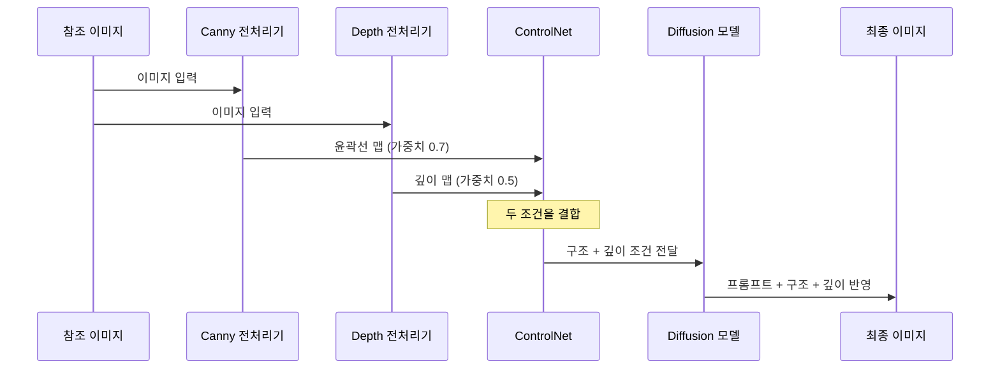

# 구도와 깊이 제어 — Canny·Depth 활용

> 윤곽선과 원근감을 추출하여, 구도는 유지하면서 완전히 새로운 스타일로 이미지를 재탄생시키는 기술을 익힙니다.

## 개요

ControlNet의 가장 널리 쓰이는 두 모델인 **Canny Edge**와 **Depth Map**을 다룹니다. Canny는 윤곽선을 추출해 "형태"를 전달하고, Depth는 깊이 정보를 추출해 "공간감"을 전달합니다. 이 둘을 적절히 활용하면 구도와 원근감은 보존하면서 스타일은 완전히 자유롭게 바꿀 수 있습니다.

## Canny Edge — 윤곽선으로 구도 잡기

Canny Edge Detection은 이미지에서 밝기가 급격하게 변하는 경계선(edge)을 찾아내는 알고리즘입니다. ControlNet에서 Canny 전처리기는 참조 이미지를 흑백 윤곽선 이미지로 변환하여 AI에게 "이 구조를 따라서 그려라"는 가이드를 제공합니다.

> Canny Edge는 디지털 트레이싱지와 같습니다. 사진 위에 투사지를 놓고 윤곽선만 따라 그리면, 원본의 구도는 그대로인데 색감과 스타일은 완전히 새로 칠할 수 있죠.

```mermaid
flowchart LR
    A['참조 이미지'] --> B['Canny 전처리기']
    B --> C['윤곽선 맵<br/>(흑백 Edge Map)']
    C --> D['ControlNet + 프롬프트']
    D --> E['새로운 스타일의<br/>이미지 생성']

    style A fill:#E3F2FD,color:#000
    style C fill:#FFF3E0,color:#000
    style E fill:#E8F5E9,color:#000
```

**핵심은 Threshold(임계값) 조절입니다.** Canny 전처리기에는 두 개의 파라미터가 있습니다.

| 파라미터 | 역할 | 낮은 값 효과 | 높은 값 효과 |
|----------|------|-------------|-------------|
| **Low Threshold** | 이 값 이하의 약한 에지를 무시 | 더 많은 디테일 감지 | 주요 윤곽만 남김 |
| **High Threshold** | 이 값 이상의 강한 에지를 확정 | 거의 모든 에지 포함 | 매우 뚜렷한 에지만 포함 |

두 임계값 사이의 에지는 강한 에지와 연결되어 있을 때만 포함됩니다(히스테리시스 임계처리).

```mermaid
flowchart TD
    subgraph LOW['낮은 Threshold (40/60)']
        L1['원본'] --> L2['매우 상세한 윤곽선<br/>디테일 풍부, 노이즈 가능']
    end

    subgraph MID['중간 Threshold (100/200)']
        M1['원본'] --> M2['균형 잡힌 윤곽선<br/>범용 사용, 가장 일반적']
    end

    subgraph HIGH['높은 Threshold (150/250)']
        H1['원본'] --> H2['최소한의 윤곽선<br/>핵심 구조만, 자유도 높음']
    end

    style LOW fill:#E3F2FD,color:#000
    style MID fill:#FFF9C4,color:#000
    style HIGH fill:#FFEBEE,color:#000
```

**장르별 Canny Threshold 프롬프트 예시**:

건축물/제품 — 정밀한 에지로 구조 재현:

```
a cyberpunk sneaker product shot, neon glow, metallic surface, studio lighting
--controlnet canny --low_threshold 150 --high_threshold 250
```


인물/초상화 — 부드러운 곡선 캡처:

```
pop art portrait, bold colors, halftone dots, Andy Warhol style
--controlnet canny --low_threshold 50 --high_threshold 150
```


풍경/자연 — 디테일과 자유도의 균형:

```
Studio Ghibli animation style, lush green forest, soft sunlight filtering through trees, dreamy atmosphere
--controlnet canny --low_threshold 100 --high_threshold 200
```


## Depth Map — 원근감으로 공간 구성하기

Depth Map은 2D 이미지에서 각 픽셀이 카메라로부터 얼마나 멀리 떨어져 있는지를 추정한 회색조 이미지입니다. 밝은 부분이 가까운 곳, 어두운 부분이 먼 곳을 나타냅니다.

**주요 Depth 전처리기 비교**:

| 전처리기 | 특징 | 적합한 상황 |
|----------|------|------------|
| **MiDaS** | 클래식, 가까운 피사체에 강함 | 인물, 실내, 정물 |
| **Depth Anything** | 최신, 전체적 균형 우수 | 범용, 풍경, 복잡한 장면 |
| **LeReS** | 먼 거리 디테일에 강함 | 건축, 도시 풍경, 넓은 공간 |
| **Zoe Depth** | 절대적 깊이(미터 단위) 추정 | 정밀한 공간 재현, 실내 구조 |

**Depth 활용 프롬프트 예시**:

여름 풍경을 겨울로 변환:

```
snowy winter landscape, frozen lake, bare trees covered in frost, overcast sky, cinematic lighting
--controlnet depth --preprocessor depth_anything
```


낮 거리를 네온 야경으로 전환:

```
cyberpunk night city street, neon signs, wet reflections on road, rain, atmospheric fog
--controlnet depth --preprocessor depth_anything
```


건축물을 미래 도시로 재해석:

```
futuristic sci-fi cityscape, flying vehicles, holographic billboards, glass towers, sunset
--controlnet depth --preprocessor leres
```

## Canny + Depth 조합 — 멀티 ControlNet

멀티 ControlNet은 여러 ControlNet 모델을 동시에 적용하는 기능입니다. Canny와 Depth를 함께 사용하면 형태의 경계와 공간의 깊이를 동시에 제어할 수 있습니다.



| 조합 전략 | Canny 가중치 | Depth 가중치 | 적합한 용도 |
|-----------|-------------|-------------|------------|
| 형태 중심 | 0.8 | 0.4 | 건축물, 제품 디자인 |
| 균형 | 0.6 | 0.6 | 풍경, 도시 전경 |
| 공간감 중심 | 0.4 | 0.8 | 분위기 전환, 무드 변경 |

**멀티 ControlNet 프롬프트 예시**:

도시 전경을 스팀펑크로 재해석:

```
steampunk cityscape, brass and copper buildings, steam pipes, airships in sky, Victorian industrial aesthetic
--controlnet canny --canny_weight 0.6
--controlnet depth --depth_weight 0.6
```


고딕 성당을 판타지 일러스트로:

```
fantasy castle illustration, magical glowing windows, enchanted forest surroundings, dramatic moonlight
--controlnet canny --canny_weight 0.7 --low_threshold 80 --high_threshold 180
--controlnet depth --depth_weight 0.5
```


## 실습: 구도 재생성 워크플로우

실제 작업에서 가장 많이 쓰이는 패턴을 따라 실습합니다.

**1단계 — 참조 이미지 선택**: 구도가 마음에 드는 이미지를 준비합니다.

**2단계 — 전처리기 선택**:
- 정확한 형태가 중요하면 → Canny
- 공간감과 분위기가 중요하면 → Depth
- 복잡한 장면에서 둘 다 필요하면 → 멀티 ControlNet

**3단계 — 프롬프트 작성**: 구도 키워드는 줄이고 스타일·매체·조명·분위기에 집중합니다.

카페 인테리어를 밤 분위기로 (Depth 활용):

```
cozy cafe interior at night, warm candlelight, rain outside windows, soft jazz mood, dim amber lighting
--controlnet depth --preprocessor midas --weight 0.7
```


로고 시안을 메탈릭 질감으로 (Canny 활용):

```
metallic chrome logo, reflective surface, studio lighting, dark background, 3D render
--controlnet canny --weight 0.9 --low_threshold 120 --high_threshold 220
```

꽃다발을 수채화로 (Canny 활용):

```
watercolor painting of flower bouquet, soft pastel colors, wet-on-wet technique, white paper texture
--controlnet canny --weight 0.6 --low_threshold 60 --high_threshold 160
```


**4단계 — Control Weight 미세 조정**:
- 참조 이미지에 너무 묶여 있다면 → Weight를 0.5~0.7로 낮추기
- 구도 반영이 부족하다면 → Weight를 0.8~1.2로 높이기

## 팁과 주의사항

- **Threshold를 무조건 낮추면 좋다는 것은 오해입니다.** 너무 낮으면 노이즈까지 에지로 감지되어 AI가 혼란스러워하고, 스타일 해석 자유도도 줄어듭니다.
- **Canny는 윤곽선만 전달합니다.** 원본과 똑같은 이미지가 나오는 것이 아니라, 같은 Canny 맵에 다른 프롬프트를 주면 완전히 다른 결과가 생성됩니다.
- **Control Weight 1.0 이상은 주의하세요.** 대부분 0.6~0.9가 최적이며, 멀티 ControlNet 사용 시 합계 1.0~1.4를 권장합니다.
- **Starting Control Step을 0.1~0.2로 설정하면** 초기 구도만 잡고 이후 AI가 자유롭게 그려서 더 자연스러운 결과를 얻을 수 있습니다.
- **Depth Map은 배경 교체에 특히 강력합니다.** 인물 사진에 Depth를 적용하면 전경과 배경을 자연스럽게 분리하여 프롬프트만으로 배경을 바꿀 수 있습니다.
- **범용 Depth 전처리기로는 Depth Anything**을 추천하며, 인물 중심이면 MiDaS, 원거리 정밀도가 중요하면 LeReS를 선택하세요.

## 핵심 정리

| 개념 | 설명 |
|------|------|
| **Canny Edge** | 참조 이미지의 윤곽선을 추출하여 형태와 구도를 제어 |
| **Low/High Threshold** | 에지 감도를 조절하는 두 임계값. 낮을수록 디테일 많음, 높을수록 핵심만 |
| **Depth Map** | 참조 이미지의 깊이 정보(원근감)를 추출하여 공간 구성을 제어 |
| **Depth Anything** | 최신 범용 깊이 추정 모델, MiDaS를 대체하는 추세 |
| **멀티 ControlNet** | Canny + Depth 등 여러 모델을 동시 적용하여 정밀 제어 |
| **Control Weight** | ControlNet의 영향력 (0~2). 멀티 사용 시 합계 1.0~1.4 권장 |

## 다음 섹션 미리보기

다음 섹션 [03. 포즈 제어 — OpenPose와 인물 생성](07-ch7-controlnet과-참조-이미지-활용/03-03-포즈-제어-openpose와-인물-생성.md)에서는 사람의 자세와 동작을 정밀하게 제어하는 방법을 배웁니다. OpenPose의 관절 포인트 체계와 원하는 포즈를 정확히 재현하는 실전 워크플로우를 다룹니다.
