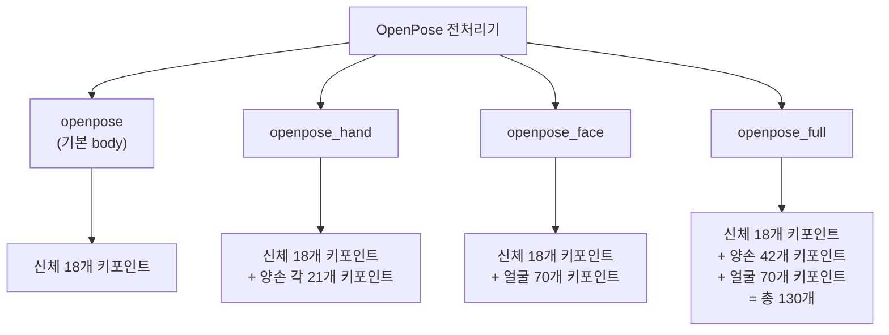
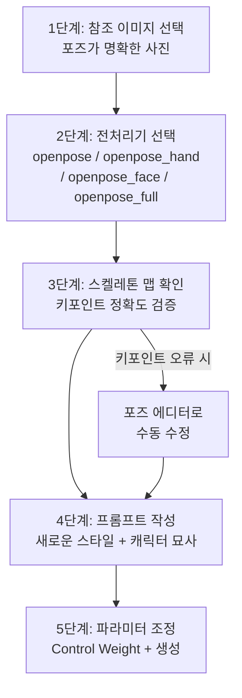
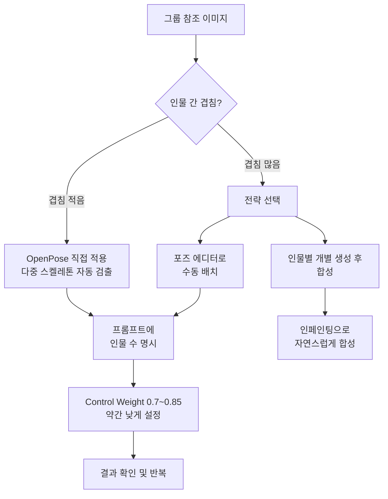
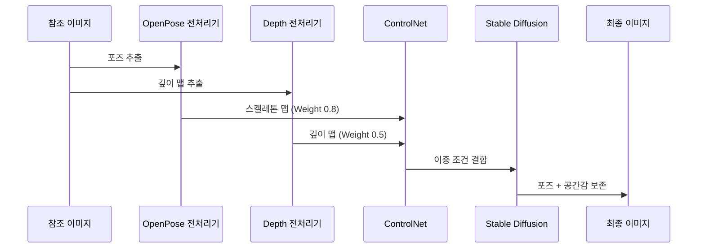

# 포즈 제어 — OpenPose와 인물 생성

> 참조 이미지의 포즈를 추출하여 원하는 스타일과 캐릭터에 정밀하게 적용하는 기술을 마스터합니다.

## 개요

이 섹션에서는 ControlNet의 핵심 모델 중 하나인 OpenPose를 활용하여 인물의 포즈를 정밀하게 제어하는 방법을 배웁니다. 참조 사진에서 관절 포인트를 추출하고, 그 포즈를 전혀 다른 스타일이나 캐릭터에 적용하는 전체 워크플로우를 다룹니다.

**선수 지식**:
- [ControlNet 개요 — 참조 이미지로 제어하기](07-ch7-controlnet과-참조-이미지-활용/01-01-controlnet-개요-참조-이미지로-제어하기.md)에서 배운 ControlNet의 기본 원리
- [구도와 깊이 제어 — Canny·Depth 활용](07-ch7-controlnet과-참조-이미지-활용/02-02-구도와-깊이-제어-cannydepth-활용.md)에서 배운 전처리기와 Control Weight 개념
- [프롬프트 해부학 — 6요소 프레임워크](02-ch2-프롬프트-구조-마스터/01-01-프롬프트-해부학-6요소-프레임워크.md)의 프롬프트 작성 기본기

**학습 목표**:
- OpenPose가 인체에서 추출하는 18개 키포인트 체계를 이해한다
- OpenPose의 4가지 전처리기 변형(openpose, openpose_hand, openpose_face, openpose_full)의 차이와 적합한 용도를 파악한다
- 참조 사진의 포즈를 다른 스타일·캐릭터에 적용하는 워크플로우를 수행할 수 있다
- 그룹 인물과 액션 포즈의 제어 전략을 설계할 수 있다

## 왜 알아야 할까?

"이 포즈 그대로, 다른 느낌으로 만들어줘."

디자이너가 가장 자주 하는 요청 중 하나입니다. 패션 룩북에서 모델의 포즈를 일러스트 스타일로 바꾸고 싶을 때, 스토리보드의 인물 배치를 그대로 살려 다양한 분위기의 씬을 만들고 싶을 때, 혹은 팀원의 포즈 사진을 캐릭터화하고 싶을 때 — 이 모든 상황에서 포즈 제어가 필요합니다.

앞서 배운 Canny는 윤곽선을, Depth는 깊이감을 제어했죠. 하지만 인물 사진에서 중요한 건 "몸이 어떤 자세를 취하고 있는가"입니다. 옷의 주름이나 배경의 깊이가 아니라, **관절의 위치와 신체의 구조** 자체를 캡처해야 합니다. OpenPose는 바로 이 문제를 해결합니다. 인체의 뼈대(Skeleton)만 정확하게 뽑아내서, 스타일과 외형은 완전히 자유롭게 바꿀 수 있게 해주거든요.

## 핵심 개념

### 개념 1: OpenPose 키포인트 체계 — 인체의 뼈대를 읽다

> 💡 **비유**: 미술 시간에 인체를 그릴 때 먼저 막대 인간(Stick Figure)을 그리죠? 관절 위치를 점으로 찍고, 점과 점을 선으로 연결하면 대략적인 포즈가 나옵니다. OpenPose가 하는 일이 정확히 이겁니다 — 사진 속 사람을 보고 "코는 여기, 오른쪽 어깨는 여기, 왼쪽 무릎은 여기"하고 점을 찍는 거예요.

OpenPose는 인체에서 **18개의 키포인트(Keypoint)**를 검출합니다. 이 키포인트들은 COCO 데이터셋 형식을 따르며, 각각 고유한 번호가 부여되어 있습니다.

**COCO 18-포인트 키포인트 체계:**

| 번호 | 키포인트 | 번호 | 키포인트 |
|------|----------|------|----------|
| 0 | 코(Nose) | 9 | 오른쪽 무릎 |
| 1 | 목(Neck) | 10 | 오른쪽 발목 |
| 2 | 오른쪽 어깨 | 11 | 왼쪽 엉덩이 |
| 3 | 오른쪽 팔꿈치 | 12 | 왼쪽 무릎 |
| 4 | 오른쪽 손목 | 13 | 왼쪽 발목 |
| 5 | 왼쪽 어깨 | 14 | 오른쪽 눈 |
| 6 | 왼쪽 팔꿈치 | 15 | 왼쪽 눈 |
| 7 | 왼쪽 손목 | 16 | 오른쪽 귀 |
| 8 | 오른쪽 엉덩이 | 17 | 왼쪽 귀 |

이 18개 점이 선으로 연결되면 우리가 흔히 보는 **스켈레톤 맵(Skeleton Map)**이 완성됩니다. 각 키포인트는 좌표값(x, y)과 함께 **검출 신뢰도(Confidence Score)**를 가지고 있어서, AI가 "이 관절의 위치를 얼마나 확신하는지"도 함께 기록됩니다.

> 📊 **그림 1**: OpenPose 키포인트 검출 흐름

핵심은 이겁니다 — Canny가 "그림의 윤곽선"을 추출했다면, OpenPose는 **"사람의 자세"만** 추출합니다. 배경이 복잡하든, 옷이 화려하든, 조명이 어둡든 상관없이 인체의 관절 위치만 정확하게 잡아내죠. 그래서 원본 이미지의 스타일에 전혀 구애받지 않고 포즈만 가져올 수 있는 겁니다.

> ⚠️ **흔한 오해**: "OpenPose는 사람의 실루엣을 추출한다"고 생각하는 분이 많은데, 사실 실루엣이 아니라 **관절 좌표**를 추출합니다. 체형, 옷, 머리카락 같은 외형 정보는 전혀 포함하지 않아요. 그래서 날씬한 사람의 포즈를 뚱뚱한 캐릭터에 그대로 적용할 수 있는 거죠.

---

### 개념 2: OpenPose 전처리기 4형제 — 상황별 선택 전략

> 💡 **비유**: 카메라 렌즈를 떠올려보세요. 광각 렌즈로 전체 풍경을 찍을 수도 있고, 매크로 렌즈로 꽃잎의 결을 찍을 수도 있죠. OpenPose 전처리기도 마찬가지입니다 — "신체 전체만 볼 것인가, 손가락까지 볼 것인가, 표정까지 볼 것인가"를 선택할 수 있어요.

ControlNet에서 OpenPose를 사용할 때, 4가지 전처리기 변형 중 하나를 선택합니다. 각각이 검출하는 범위가 다르기 때문에, 목적에 맞는 선택이 중요합니다. 전처리기 이름은 ControlNet UI에서 실제로 선택하는 이름 그대로 **openpose**(기본 body), **openpose_hand**, **openpose_face**, **openpose_full**입니다.

> 📊 **그림 2**: OpenPose 전처리기 변형별 검출 범위 비교

**전처리기별 특징과 추천 상황:**

| 전처리기 | 검출 범위 | 키포인트 수 | 추천 상황 |
|----------|-----------|------------|-----------|
| **openpose** (기본 body) | 신체만 | 18개 | 전신 포즈, 액션 장면, 빠른 작업 |
| **openpose_hand** | 신체 + 손 | 18 + 42개 | 손동작이 중요한 장면(가리키기, 잡기) |
| **openpose_face** | 신체 + 얼굴 | 18 + 70개 | 표정이 핵심인 초상화, 감정 표현 |
| **openpose_full** | 신체 + 손 + 얼굴 | 130개 | 최대 정밀도가 필요한 고품질 작업 |

어떤 전처리기를 선택해야 할까요? 핵심 원칙은 **"필요한 만큼만"**입니다. openpose_full이 가장 정밀하지만, 검출할 키포인트가 많을수록 처리 시간이 길어지고, 오검출 가능성도 높아집니다. 특히 손가락 키포인트는 참조 이미지의 손이 선명하지 않으면 엉뚱한 위치를 잡는 경우가 잦거든요.

> 🔥 **실무 팁**: 대부분의 작업에서는 기본 `openpose`(신체만)로 충분합니다. 손이 핵심 요소인 작업에서만 `openpose_hand`를, 초상화 작업에서만 `openpose_face`를 사용하세요. `openpose_full`은 "모든 걸 정밀하게 맞춰야 할 때"의 마지막 카드로 남겨두는 게 좋습니다.

**DWPose — OpenPose의 강력한 대안:**

최근에는 IDEA Research에서 개발한 **DWPose**가 OpenPose의 대안으로 주목받고 있습니다. 2023년 ICCV 워크숍에서 발표된 DWPose는 특히 손과 손가락 검출 정확도가 OpenPose보다 크게 향상되었습니다. ControlNet의 전처리기 목록에서 `dw_openpose_full`로 선택할 수 있으며, 손 표현이 중요한 작업이라면 DWPose를 먼저 시도해 보는 것을 권장합니다.

---

### 개념 3: 포즈 재현 워크플로우 — 참조에서 생성까지

> 💡 **비유**: 연극 연출가를 떠올려보세요. 연출가는 배우에게 "이 장면에서는 이런 자세를 취해주세요"라고 지시합니다. 배우의 외모, 의상, 무대 배경은 달라도 포즈는 정확히 같죠. OpenPose ControlNet이 바로 이 연출가 역할을 합니다 — AI에게 "이 포즈 그대로, 하지만 전혀 다른 캐릭터로 그려줘"라고 지시하는 거예요.

참조 사진의 포즈를 다른 스타일·캐릭터에 적용하는 실전 워크플로우를 단계별로 살펴봅시다.

> 📊 **그림 3**: 포즈 재현 5단계 워크플로우

**1단계: 참조 이미지 선택**

좋은 참조 이미지가 좋은 결과의 절반입니다. 다음 기준으로 참조 이미지를 고르세요:
- 인물이 가려지지 않고 전신이 보일 것
- 관절이 명확하게 구분될 것 (팔짱 낀 포즈는 오검출 위험)
- 배경과 인물의 대비가 충분할 것
- 해상도가 512px 이상일 것

**2단계: 전처리기 선택**

목적에 따라 전처리기를 선택합니다. 전신 액션 포즈라면 `openpose`(기본 body), 손이 중요하면 `openpose_hand`, 초상화라면 `openpose_face`를 선택하세요.

**3단계: 스켈레톤 맵 확인**

이 단계가 가장 중요합니다. 전처리기가 생성한 스켈레톤 맵을 반드시 눈으로 확인하세요. 관절이 엉뚱한 곳에 잡혀 있으면 결과도 엉뚱하게 나옵니다. 특히 팔이 교차하거나 손이 겹치는 포즈에서 오검출이 자주 발생합니다.

오류가 있다면 **OpenPose Editor** 확장(Extension)을 사용해 수동으로 키포인트를 수정할 수 있습니다. 각 관절 점을 드래그해서 정확한 위치로 옮기면 됩니다.

**4단계: 프롬프트 작성**

포즈는 ControlNet이 제어하므로, 프롬프트에서는 포즈를 언급할 필요가 없습니다. 대신 원하는 **스타일, 캐릭터 외형, 의상, 배경, 조명**에 집중하세요.

| 상황 | 프롬프트 전략 |
|------|-------------|
| 패션 일러스트 | 의상 디테일 + 스타일(수채화, 벡터 등) |
| 게임 캐릭터 | 캐릭터 특징 + 장비 + 아트 스타일 |
| 광고 사진 | 인물 특성 + 조명 + 배경 + 분위기 |
| 만화/웹툰 | 캐릭터 디자인 + 화풍 + 표정 |

**5단계: 파라미터 조정**

- **Control Weight**: 0.8~1.0 사이에서 시작. 높을수록 포즈를 엄격히 따름
- **Starting Control Step**: 0.0 (처음부터 포즈 적용)
- **Ending Control Step**: 0.8~1.0 (끝까지 또는 약간 일찍 해제하여 자연스러움 확보)

> 🔥 **실무 팁**: Control Weight를 1.0으로 설정하면 포즈는 정확하지만 이미지가 부자연스러워질 수 있습니다. 0.85 정도에서 시작해서 결과를 보며 조정하세요. Ending Control Step을 0.8로 낮추면 마지막 20% 생성 단계에서 AI가 자유롭게 디테일을 추가하여 더 자연스러운 결과를 얻을 수 있습니다.

---

### 개념 4: 그룹 포즈와 액션 포즈 — 고난도 시나리오 공략

> 💡 **비유**: 단체 사진을 찍을 때를 생각해보세요. 한 명의 포즈를 잡는 건 쉽지만, 여러 사람이 서로 겹치지 않으면서도 자연스럽게 배치되려면 사진가의 세심한 연출이 필요하죠. AI 이미지 생성에서도 마찬가지입니다 — 여러 인물의 포즈를 동시에 제어하는 건 한 명일 때보다 훨씬 까다로운 작업입니다.

**그룹 인물 포즈 제어:**

OpenPose는 원래 **다중 인물 포즈 추정(Multi-Person Pose Estimation)**을 위해 설계된 기술입니다. 한 장의 사진에서 여러 사람의 스켈레톤을 동시에 검출할 수 있죠. 하지만 ControlNet에서 이를 활용할 때는 몇 가지 주의가 필요합니다.

> 📊 **그림 4**: 그룹 포즈 워크플로우와 주의사항

**그룹 포즈 성공 전략:**

| 전략 | 설명 | 적합한 상황 |
|------|------|------------|
| **직접 적용** | 그룹 사진에 OpenPose를 바로 적용 | 2~3인, 겹침 적은 포즈 |
| **포즈 에디터** | 스켈레톤을 수동으로 배치 | 원하는 배치를 직접 디자인할 때 |
| **개별 생성 + 합성** | 인물별로 따로 생성 후 인페인팅으로 합성 | 4인 이상, 복잡한 상호작용 |

**그룹 포즈 주의사항:**
- 프롬프트에 인물 수를 명시하세요 ("two women", "group of three friends")
- Control Weight를 단일 인물보다 낮게(0.7~0.85) 설정하면 더 자연스럽습니다
- AI는 인물 수를 정확히 세는 데 약하므로, 결과에서 인물이 추가되거나 빠질 수 있습니다

**액션 포즈 제어:**

달리기, 점프, 춤 같은 역동적인 액션 포즈는 일반 포즈보다 더 까다롭습니다. 관절이 극단적인 각도를 가지거나, 모션 블러로 키포인트 검출이 어려워지기 때문이죠.

**액션 포즈 팁:**
- 참조 이미지는 **동작의 정점(Peak of Action)**을 포착한 것을 선택하세요 (점프의 최고점, 킥의 뻗은 순간 등)
- 모션 블러가 없는 선명한 이미지가 키포인트 검출에 유리합니다
- 액션 포즈는 해부학적으로 어색해지기 쉬우므로, 네거티브 프롬프트에 "deformed limbs, extra fingers, bad anatomy"를 추가하세요
- Control Weight를 0.9 이상으로 높여야 역동적인 포즈가 유지됩니다

---

### 개념 5: 멀티 ControlNet — OpenPose + Depth 조합 전략

> 💡 **비유**: 건축 설계를 할 때 평면도(위에서 본 배치)와 입면도(앞에서 본 높이)를 함께 보면 건물의 구조를 완전히 이해할 수 있죠. 마찬가지로, OpenPose(포즈) + Depth(깊이)를 함께 사용하면 "이 사람이 어떤 자세를 취하고 있으며, 카메라로부터 얼마나 떨어져 있는지"까지 AI에게 알려줄 수 있습니다.

앞서 [구도와 깊이 제어 — Canny·Depth 활용](07-ch7-controlnet과-참조-이미지-활용/02-02-구도와-깊이-제어-cannydepth-활용.md)에서 멀티 ControlNet을 배웠는데, OpenPose와의 조합은 인물 생성에서 특히 강력합니다.

> 📊 **그림 5**: OpenPose + Depth 멀티 ControlNet 조합

**추천 가중치 조합:**

| 조합 | OpenPose Weight | Depth Weight | 용도 |
|------|----------------|-------------|------|
| **포즈 우선** | 0.9 | 0.4 | 포즈 정확도가 최우선 |
| **균형 조합** | 0.8 | 0.6 | 포즈 + 공간감 모두 중요 |
| **깊이 우선** | 0.6 | 0.8 | 여러 인물의 전후 배치가 핵심 |

이 조합이 특히 유용한 시나리오는 **여러 인물이 전후로 배치된 장면**입니다. OpenPose만으로는 "A가 B 앞에 서 있다"는 깊이 정보를 전달하기 어렵지만, Depth를 함께 쓰면 인물 간의 거리감까지 자연스럽게 표현됩니다.

## 실습: 적용해보기

### 실습 1: 포즈 전환 분석 워크시트

다음 시나리오를 분석하고, 각각에 가장 적합한 설정을 결정해보세요.

**시나리오 A**: 발레리나가 아라베스크 자세를 취한 사진을 → 수채화 스타일의 일러스트로 변환

| 항목 | 당신의 선택 | 이유 |
|------|-----------|------|
| 전처리기 | ____________ | ____________ |
| Control Weight | ____________ | ____________ |
| Ending Control Step | ____________ | ____________ |
| 프롬프트 전략 | ____________ | ____________ |

**시나리오 B**: 3명의 친구가 점프하는 단체 사진을 → 애니메이션 스타일의 캐릭터 일러스트로 변환

| 항목 | 당신의 선택 | 이유 |
|------|-----------|------|
| 전처리기 | ____________ | ____________ |
| 멀티 ControlNet 사용 여부 | ____________ | ____________ |
| Control Weight | ____________ | ____________ |
| 프롬프트에 포함할 핵심 키워드 | ____________ | ____________ |

**시나리오 C**: 손으로 하트를 만드는 포즈 사진을 → 다양한 캐릭터에 적용

| 항목 | 당신의 선택 | 이유 |
|------|-----------|------|
| 전처리기 | ____________ | ____________ |
| DWPose 고려 여부 | ____________ | ____________ |
| 실패 시 대안 전략 | ____________ | ____________ |

### 실습 2: 포즈 에디터 활용 토론

**토론 질문**: 포즈 에디터로 스켈레톤을 직접 그려서 사용하는 방식과, 참조 사진에서 자동 추출하는 방식은 각각 어떤 장단점이 있을까요?

고려할 관점:
- 정확도와 의도 반영
- 작업 속도
- 해부학적 자연스러움
- 창의적 자유도

### 실습 3: 전처리기 비교 사례 분석

같은 참조 이미지에 4가지 전처리기를 각각 적용했다고 가정합니다. 다음 표를 완성해보세요.

| 전처리기 | 검출 정보 | 생성 결과 예상 차이 | 처리 시간 |
|----------|----------|-------------------|----------|
| openpose (기본 body) | 신체 18점 | ____________ | 빠름 |
| openpose_hand | 신체 + 손 60점 | ____________ | 중간 |
| openpose_face | 신체 + 얼굴 88점 | ____________ | 중간 |
| openpose_full | 전체 130점 | ____________ | 느림 |

## 더 깊이 알아보기

### OpenPose의 탄생 — CMU 연구실에서 시작된 혁신

OpenPose는 2017년 **카네기 멜론 대학교(CMU)**의 Perceptual Computing Lab에서 탄생했습니다. 주역은 **Zhe Cao**, Tomas Simon, Shih-En Wei, 그리고 지도교수 **Yaser Sheikh**였죠.

당시 인체 포즈 추정(Pose Estimation)은 이미 연구되고 있었지만, 대부분 **탑다운(Top-down) 방식**이었습니다. 먼저 이미지에서 사람을 검출하고(Person Detection), 각 사람에 대해 개별적으로 포즈를 추정하는 방식이었죠. 문제는? 사람 수가 많아질수록 계산량이 선형으로 증가한다는 것이었습니다.

Zhe Cao의 팀은 완전히 반대 접근을 취했습니다 — **바텀업(Bottom-up) 방식**. 이미지 전체에서 관절 포인트를 먼저 모두 검출하고, **PAF(Part Affinity Fields, 부위 친화도 필드)**라는 혁신적인 개념으로 "이 왼쪽 팔꿈치와 이 왼쪽 손목이 같은 사람의 것"임을 연결하는 방식이었습니다. 이 접근 덕분에 이미지에 사람이 몇 명이든 거의 일정한 속도로 처리할 수 있었고, "실시간(Realtime)" 다중 인물 포즈 추정이라는 제목이 가능했습니다.

이 논문은 **CVPR 2017에서 Oral 발표**로 선정되었고(상위 약 2.5%), 2016 MSCOCO Keypoints Challenge 우승, 2016 ECCV Best Demo Award 수상이라는 화려한 성과를 거두었습니다. 그리고 몇 년 후, Lvmin Zhang이 ControlNet을 발표하면서 OpenPose는 AI 이미지 생성의 핵심 도구로 재탄생하게 됩니다.

> 💡 **알고 계셨나요?**: OpenPose의 PAF 아이디어는 놀랍게도 **열 지도(Heatmap)**에서 영감을 받았습니다. 각 관절의 위치를 히트맵으로 예측하는 것은 기존 연구에서도 했지만, 관절 간의 "연결"을 벡터 필드로 표현한 것은 Zhe Cao 팀의 독창적인 아이디어였습니다. 이 PAF 개념이 없었다면, 복잡한 그룹 사진에서 "누구의 팔이 누구의 팔인지" 구분하는 건 불가능에 가까웠을 겁니다.

### BODY_25 — 더 정밀한 진화

OpenPose는 이후 COCO 18-포인트에서 **BODY_25**로 진화했습니다. 발 키포인트 6개(양발 각 3개)가 추가되어 총 25개 키포인트를 검출합니다. 발의 방향과 무게 중심을 더 정확하게 표현할 수 있어, 서 있는 포즈나 걷는 포즈의 자연스러움이 크게 향상되었습니다.

## 흔한 오해와 팁

> ⚠️ **흔한 오해**: "OpenPose가 포즈를 완벽하게 재현해주니까 프롬프트에서 포즈를 설명할 필요가 없다"고 생각하기 쉽지만, 프롬프트와 ControlNet 신호가 심하게 충돌하면 결과가 이상해질 수 있습니다. 예를 들어, OpenPose로 서 있는 포즈를 전달했는데 프롬프트에 "sitting on a chair"라고 쓰면 AI가 혼란스러워합니다. 포즈 설명은 빼되, 모순되는 설명도 쓰지 마세요.

> 💡 **알고 계셨나요?**: OpenPose는 원래 로보틱스 연구를 위해 만들어졌습니다. 로봇이 사람의 움직임을 인식하고 반응하기 위해 실시간으로 자세를 파악해야 했거든요. AI 이미지 생성에 활용되는 건 원래 개발 의도와는 전혀 다른 응용인 셈이죠.

> 🔥 **실무 팁**: 포즈 결과가 해부학적으로 어색할 때는, 같은 설정으로 **3~5장을 생성**한 후 가장 자연스러운 결과를 고르세요. 시드(Seed) 값에 따라 동일한 포즈 조건에서도 품질 차이가 크게 날 수 있습니다. 좋은 결과가 나왔다면 해당 시드 값을 기록해두는 습관을 들이세요.

> 🔥 **실무 팁**: 팔이 교차하거나 손이 겹치는 포즈에서 OpenPose가 키포인트를 잘못 잡는 경우가 많습니다. 이럴 때는 OpenPose Editor에서 수동으로 교정하거나, 아예 **겹침이 적은 참조 이미지를 다시 찾는 게 더 빠를 수 있습니다**. 5분 고쳐도 안 되면 참조 이미지를 바꿔보세요.

## 핵심 정리

| 개념 | 설명 |
|------|------|
| **OpenPose 키포인트** | COCO 형식 18개 관절 좌표를 추출하여 스켈레톤 맵 생성 |
| **전처리기 4종** | openpose(기본 body), openpose_hand(+손), openpose_face(+얼굴), openpose_full(전체 130점) |
| **DWPose** | OpenPose 대안, 손가락 검출 정확도 향상 (ICCV 2023) |
| **포즈 재현 워크플로우** | 참조 선택 → 전처리기 → 스켈레톤 확인 → 프롬프트 → 파라미터 조정 |
| **그룹 포즈** | 2~3인 직접 적용, 4인 이상은 개별 생성+합성 권장 |
| **액션 포즈** | 동작 정점 이미지 사용, Control Weight 0.9 이상, 네거티브 프롬프트 활용 |
| **멀티 ControlNet 조합** | OpenPose(포즈) + Depth(깊이)로 공간감 있는 인물 생성 |
| **Control Weight** | 0.8~1.0 범위, 그룹은 0.7~0.85로 낮추어 자연스러움 확보 |

## 다음 섹션 미리보기

포즈와 구도를 제어하는 방법을 배웠으니, 이제 **스타일의 일관성**으로 넘어갈 차례입니다. 다음 섹션 [Midjourney --sref 스타일 레퍼런스](07-ch7-controlnet과-참조-이미지-활용/04-04-midjourney---sref-스타일-레퍼런스.md)에서는 ControlNet이 아닌 Midjourney의 `--sref` 파라미터를 활용하여, 참조 이미지의 **색감, 질감, 분위기**를 새로운 이미지에 일관되게 적용하는 방법을 다룹니다. ControlNet의 구조 제어와 Midjourney의 스타일 제어를 함께 이해하면, 비주얼 콘텐츠 제작의 자유도가 크게 넓어질 것입니다.

## 참고 자료

- [ControlNet: A Complete Guide (Stable Diffusion Art)](https://stable-diffusion-art.com/controlnet/) - ControlNet 모델별 상세 가이드, OpenPose 전처리기 비교 포함
- [OpenPose GitHub — CMU Perceptual Computing Lab](https://github.com/CMU-Perceptual-Computing-Lab/openpose) - OpenPose 공식 리포지토리, 키포인트 체계와 기술 문서
- [DWPose — Effective Whole-body Pose Estimation (IDEA Research)](https://github.com/IDEA-Research/DWPose) - OpenPose 대안인 DWPose의 공식 리포지토리
- [Realtime Multi-Person 2D Pose Estimation using Part Affinity Fields (CVPR 2017)](https://openaccess.thecvf.com/content_cvpr_2017/papers/Cao_Realtime_Multi-Person_2D_CVPR_2017_paper.pdf) - Zhe Cao 등의 OpenPose 원본 논문
- [How to Write AI Image Prompts Like a Pro (Let's Enhance)](https://letsenhance.io/blog/article/ai-text-prompt-guide/) - AI 이미지 프롬프트 작성 가이드

---
### 🔗 Related Sessions
- [controlnet](07-ch7-controlnet과-참조-이미지-활용/01-01-controlnet-개요-참조-이미지로-제어하기.md) (prerequisite)
- [구조 맵](07-ch7-controlnet과-참조-이미지-활용/01-01-controlnet-개요-참조-이미지로-제어하기.md) (prerequisite)
- [depth map](07-ch7-controlnet과-참조-이미지-활용/01-01-controlnet-개요-참조-이미지로-제어하기.md) (prerequisite)
- [인페인팅(inpainting)](06-ch6-이미지-편집-기법-img2img인페인팅아웃페인팅/02-02-인페인팅-기초-부분-수정의-기술.md) (prerequisite)
- [control weight](07-ch7-controlnet과-참조-이미지-활용/02-02-구도와-깊이-제어-cannydepth-활용.md) (prerequisite)
- [starting/ending control step](07-ch7-controlnet과-참조-이미지-활용/02-02-구도와-깊이-제어-cannydepth-활용.md) (prerequisite)
- [멀티 controlnet](07-ch7-controlnet과-참조-이미지-활용/01-01-controlnet-개요-참조-이미지로-제어하기.md) (prerequisite)
