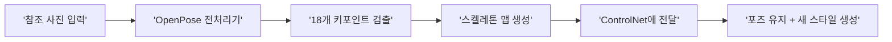
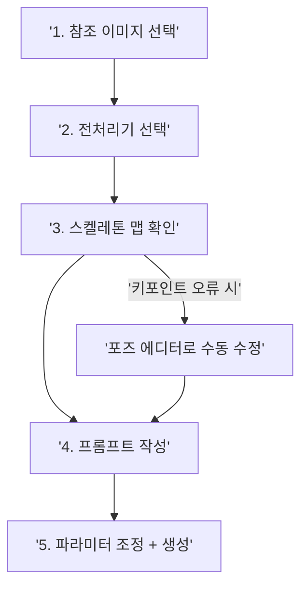

# 포즈 제어 — OpenPose와 인물 생성

> "포즈는 빌려오고, 스타일은 새로 입힌다."

## 개요

OpenPose는 사진 속 인물의 관절 좌표를 추출하여 스켈레톤 맵을 생성하고, 이를 ControlNet에 전달해 동일한 포즈를 전혀 다른 스타일로 재현할 수 있게 합니다. 이 섹션에서는 OpenPose 전처리기 선택부터 그룹 포즈, 멀티 ControlNet 조합까지 인물 포즈 제어의 전체 워크플로우를 다룹니다.

## OpenPose 키포인트 체계

미술 시간에 먼저 막대 인간을 그리듯, OpenPose는 사진 속 인물에서 **18개 키포인트(관절 좌표)**를 검출합니다. 배경, 옷, 조명과 무관하게 신체 자세만 정확히 추출하므로, 원본의 스타일에 구애받지 않고 포즈만 가져올 수 있습니다.

| 번호 | 키포인트 | 번호 | 키포인트 |
|------|----------|------|----------|
| 0 | 코(Nose) | 9 | 오른쪽 무릎 |
| 1 | 목(Neck) | 10 | 오른쪽 발목 |
| 2 | 오른쪽 어깨 | 11 | 왼쪽 엉덩이 |
| 3 | 오른쪽 팔꿈치 | 12 | 왼쪽 무릎 |
| 4 | 오른쪽 손목 | 13 | 왼쪽 발목 |
| 5 | 왼쪽 어깨 | 14 | 오른쪽 눈 |
| 6 | 왼쪽 팔꿈치 | 15 | 왼쪽 눈 |
| 7 | 왼쪽 손목 | 16 | 오른쪽 귀 |
| 8 | 오른쪽 엉덩이 | 17 | 왼쪽 귀 |



핵심 차이: Canny는 윤곽선, Depth는 깊이감을 추출하지만, OpenPose는 **관절 좌표**만 추출합니다. 체형이나 옷 같은 외형 정보는 포함하지 않으므로 날씬한 사람의 포즈를 다른 체형의 캐릭터에 그대로 적용할 수 있습니다.

## 전처리기 4종 — 상황별 선택 전략

```mermaid
graph TD
    ROOT['OpenPose 전처리기'] --> A['openpose<br/>(기본 body)']
    ROOT --> B['openpose_hand']
    ROOT --> C['openpose_face']
    ROOT --> D['openpose_full']
    A --> A1['신체 18개 키포인트']
    B --> B1['신체 18개<br/>+ 양손 각 21개']
    C --> C1['신체 18개<br/>+ 얼굴 70개']
    D --> D1['신체 18개 + 양손 42개<br/>+ 얼굴 70개 = 총 130개']
```

| 전처리기 | 키포인트 수 | 추천 상황 |
|----------|------------|-----------|
| **openpose** (기본) | 18개 | 전신 포즈, 액션 장면, 빠른 작업 |
| **openpose_hand** | 60개 | 손동작이 중요한 장면(가리키기, 잡기) |
| **openpose_face** | 88개 | 표정이 핵심인 초상화, 감정 표현 |
| **openpose_full** | 130개 | 최대 정밀도가 필요한 고품질 작업 |

선택 원칙은 **"필요한 만큼만"**입니다. 키포인트가 많을수록 처리 시간이 길어지고 오검출 가능성도 높아집니다. 대부분의 작업에서는 기본 `openpose`로 충분합니다.

**DWPose**: IDEA Research에서 개발한 대안으로, 특히 손가락 검출 정확도가 OpenPose보다 크게 향상되었습니다. ControlNet에서 `dw_openpose_full`로 선택 가능합니다.

## 포즈 재현 워크플로우



**참조 이미지 선택 기준**: 전신이 보이고, 관절이 명확하며, 배경과 인물 대비가 충분하고, 해상도 512px 이상인 이미지를 고르세요.

**프롬프트 전략**: 포즈는 ControlNet이 제어하므로 프롬프트에서 포즈를 언급할 필요 없이, 스타일/캐릭터/의상/배경/조명에 집중합니다.

기본 포즈 전환 프롬프트:

```
a watercolor illustration of a ballet dancer, elegant tutu dress,
soft pastel colors, artistic brushstrokes, white background
```


게임 캐릭터 변환:

```
fantasy warrior character, full plate armor, glowing sword,
dynamic lighting, digital art style, detailed background
```

패션 일러스트 변환:

```
fashion illustration, haute couture dress, minimalist vector style,
clean lines, muted earth tones, editorial layout
```


**파라미터 설정**:

| 파라미터 | 권장값 | 설명 |
|---------|--------|------|
| Control Weight | 0.8~1.0 | 높을수록 포즈 엄격 준수 |
| Starting Control Step | 0.0 | 처음부터 포즈 적용 |
| Ending Control Step | 0.8~1.0 | 0.8이면 마지막 20%에서 자유 생성 |

## 그룹 포즈와 액션 포즈

**그룹 포즈** - OpenPose는 다중 인물 검출을 지원하지만, 인물이 겹치면 오검출 위험이 커집니다.

| 전략 | 적합한 상황 |
|------|------------|
| 직접 적용 | 2~3인, 겹침 적은 포즈 |
| 포즈 에디터 수동 배치 | 원하는 배치를 직접 디자인할 때 |
| 개별 생성 + 합성 | 4인 이상, 복잡한 상호작용 |

그룹 포즈 프롬프트 (2인):

```
two friends standing side by side, casual streetwear,
urban background, golden hour lighting, photorealistic
```

그룹 포즈 프롬프트 (3인 애니메이션):

```
three anime characters jumping together, colorful school uniforms,
cherry blossom background, vibrant colors, anime art style
```


**액션 포즈** - 달리기, 점프 등 역동적 포즈는 동작 정점(Peak of Action)을 포착한 선명한 참조 이미지를 사용하세요.

액션 포즈 프롬프트:

```
martial arts fighter performing a high kick, dynamic pose,
dramatic side lighting, motion energy, cinematic composition
Negative: deformed limbs, extra fingers, bad anatomy
```

```
professional basketball player mid-jump slam dunk,
sports photography, arena lighting, sharp focus
Negative: deformed limbs, bad anatomy, blurry
```


## 멀티 ControlNet — OpenPose + Depth 조합

OpenPose(포즈) + Depth(깊이)를 함께 사용하면 인물의 자세와 카메라 거리감을 동시에 제어할 수 있습니다. 여러 인물이 전후로 배치된 장면에 특히 효과적입니다.

| 조합 | OpenPose Weight | Depth Weight | 용도 |
|------|----------------|-------------|------|
| 포즈 우선 | 0.9 | 0.4 | 포즈 정확도가 최우선 |
| 균형 조합 | 0.8 | 0.6 | 포즈 + 공간감 모두 중요 |
| 깊이 우선 | 0.6 | 0.8 | 전후 배치가 핵심 |

멀티 ControlNet 조합 프롬프트:

```
two people in conversation, one in foreground one in background,
coffee shop interior, warm ambient lighting, shallow depth of field
ControlNet 1: OpenPose (Weight 0.8)
ControlNet 2: Depth (Weight 0.6)
```


## 실습

### 실습 1: 스타일 전환 비교

동일한 참조 포즈에 아래 세 가지 스타일 프롬프트를 각각 적용하고 결과를 비교해보세요.

```
watercolor painting of a young woman, flowing dress,
soft pastel palette, artistic brush texture
```

```
3D rendered character, Pixar animation style,
vibrant colors, smooth shading, cheerful expression
```

```
ink wash painting, traditional East Asian style,
minimalist composition, black and white with red accents
```


### 실습 2: 전처리기 비교

같은 참조 이미지에 4가지 전처리기를 각각 적용하여 결과 차이를 확인하세요. Control Weight 0.85, 동일 시드 사용을 권장합니다.

```
elegant portrait of a woman making a heart shape with hands,
studio lighting, clean background, photorealistic
Preprocessor: openpose (기본)
```

```
elegant portrait of a woman making a heart shape with hands,
studio lighting, clean background, photorealistic
Preprocessor: openpose_hand
```

## 팁과 주의사항

- **Control Weight 0.85에서 시작**: 1.0은 포즈는 정확하지만 부자연스러울 수 있습니다. 0.85에서 시작해 조정하세요.
- **Ending Control Step 0.8 활용**: 마지막 20% 생성 단계에서 AI가 자유롭게 디테일을 추가하여 자연스러움이 향상됩니다.
- **프롬프트와 포즈 모순 금지**: 서 있는 포즈를 전달하면서 "sitting on a chair"라고 쓰면 결과가 깨집니다. 포즈 설명은 생략하되 모순도 쓰지 마세요.
- **3~5장 생성 후 선택**: 시드 값에 따라 동일 조건에서도 품질 차이가 큽니다. 좋은 결과의 시드를 기록해두세요.
- **겹침 포즈 대응**: 팔 교차, 손 겹침에서 오검출이 잦습니다. 포즈 에디터로 5분 이상 교정해도 안 되면 참조 이미지를 바꾸세요.
- **그룹 포즈 Weight 낮추기**: 다중 인물은 0.7~0.85로 설정하면 더 자연스럽습니다.
- **액션 포즈 네거티브 필수**: `deformed limbs, extra fingers, bad anatomy`를 네거티브에 추가하고, Control Weight 0.9 이상으로 설정하세요.

## 핵심 정리

| 개념 | 설명 |
|------|------|
| **OpenPose 키포인트** | COCO 형식 18개 관절 좌표를 추출하여 스켈레톤 맵 생성 |
| **전처리기 4종** | openpose(기본), openpose_hand(+손), openpose_face(+얼굴), openpose_full(130점) |
| **DWPose** | OpenPose 대안, 손가락 검출 정확도 향상 |
| **포즈 재현 워크플로우** | 참조 선택 - 전처리기 - 스켈레톤 확인 - 프롬프트 - 파라미터 조정 |
| **그룹 포즈** | 2~3인 직접 적용, 4인 이상은 개별 생성+합성 권장 |
| **멀티 ControlNet** | OpenPose(포즈) + Depth(깊이)로 공간감 있는 인물 생성 |
| **Control Weight** | 단일 인물 0.8~1.0, 그룹 0.7~0.85 |

## 다음 섹션 미리보기

다음 섹션에서는 ControlNet이 아닌 Midjourney의 `--sref` 파라미터를 활용하여, 참조 이미지의 색감/질감/분위기를 새로운 이미지에 일관되게 적용하는 **스타일 레퍼런스** 기법을 다룹니다.
