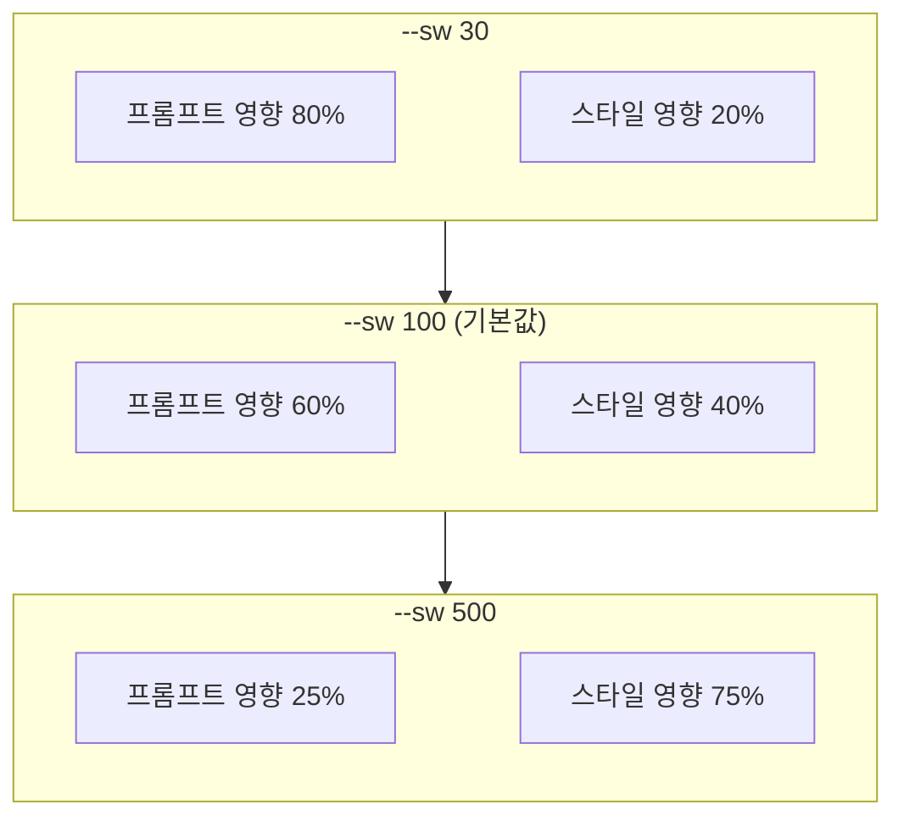
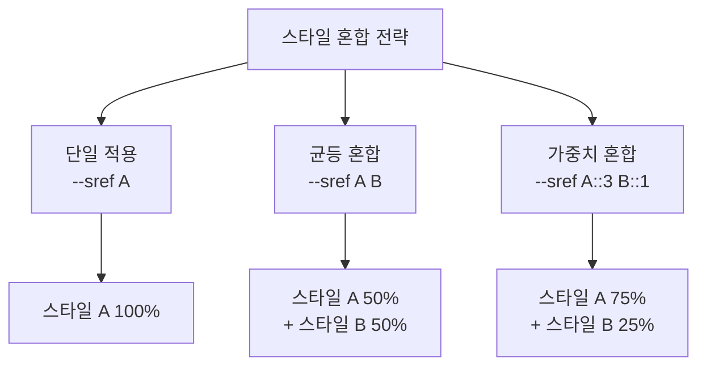
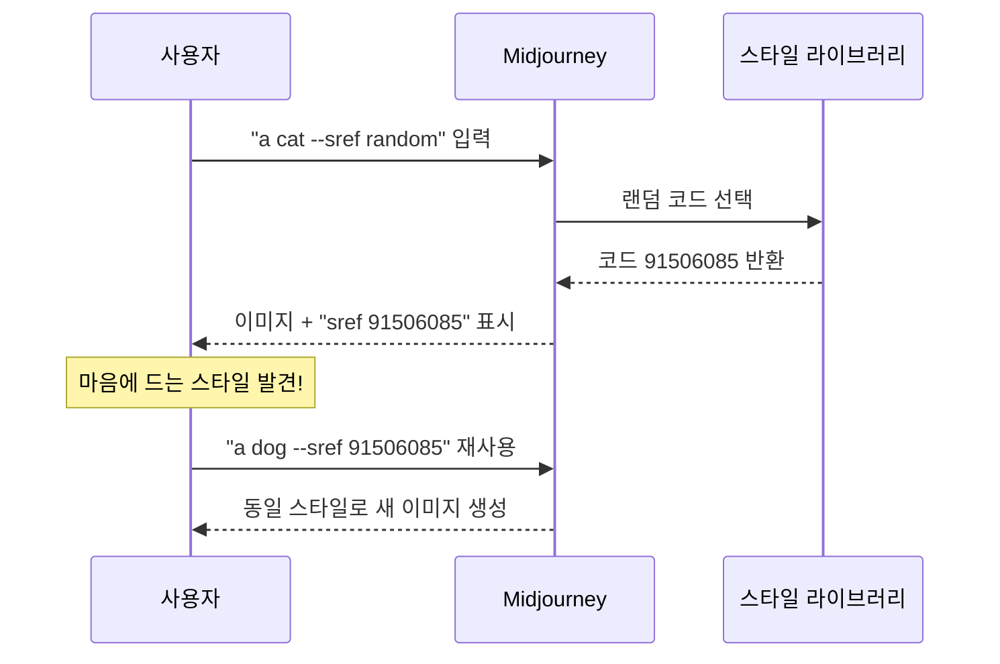
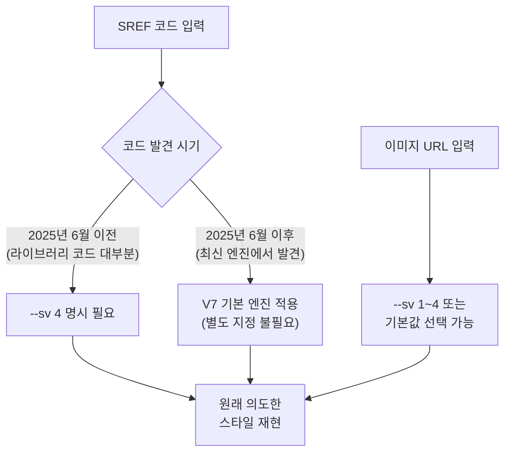

# Midjourney --sref 스타일 레퍼런스

> 하나의 숫자 코드로 일관된 비주얼 스타일을 적용하는 Midjourney의 스타일 레퍼런스 시스템 완전 정복

## 개요

이 섹션에서는 Midjourney의 `--sref` (Style Reference) 파라미터를 깊이 있게 다룹니다.

지금까지 [ControlNet 개요](07-ch7-controlnet과-참조-이미지-활용/01-01-controlnet-개요-참조-이미지로-제어하기.md)에서 [포즈 제어](07-ch7-controlnet과-참조-이미지-활용/03-03-포즈-제어-openpose와-인물-생성.md)까지, **Stable Diffusion 생태계**에서 ControlNet이라는 외부 모듈을 통해 구조적 제어를 달성하는 방법을 배웠습니다. ControlNet은 엣지 맵, 깊이 맵, 포즈 스켈레톤 같은 **시각적 조건**을 추출하고, 이를 확산 모델에 주입하는 아키텍처였죠.

이번 섹션부터는 **Midjourney 생태계**로 무대를 옮깁니다. Midjourney는 ControlNet 같은 별도 모듈을 사용하지 않고, 자체 파라미터 시스템(`--sref`, `--cref` 등)으로 참조 기반 제어를 구현합니다. 접근 방식은 다릅니다 — ControlNet이 "외부 조건 맵을 모델에 주입"하는 구조라면, Midjourney는 "파라미터 하나로 내부 엔진이 알아서 처리"하는 통합형 구조예요. 하지만 **목적은 동일**합니다: 참조 이미지의 특정 속성(구조, 스타일, 캐릭터)을 새로운 이미지 생성에 반영하는 것이죠.

`--sref`는 그중에서도 **스타일 제어**를 담당합니다. 참조 이미지나 숫자 코드를 통해 색감, 질감, 분위기, 조명 톤을 일관되게 적용하는 강력한 도구입니다.

**선수 지식**: [Ch5. Midjourney 기본과 파라미터 튜닝](05-ch5-midjourney-기본과-파라미터-튜닝/01-01-midjourney-인터페이스와-기본-생성.md)의 기본 파라미터 사용법, [스타일라이즈(--stylize)](05-ch5-midjourney-기본과-파라미터-튜닝/03-03-스타일라이즈--stylize와-미학-제어.md) 개념

**학습 목표**:
- `--sref` 파라미터의 원리와 이미지 URL / 숫자 코드 두 가지 사용법을 이해한다
- `--sw` (스타일 가중치)로 스타일 영향력을 세밀하게 조절할 수 있다
- 여러 스타일 레퍼런스를 혼합하여 독창적인 미학을 만들 수 있다
- SREF 코드 라이브러리를 활용하여 효율적으로 스타일을 탐색할 수 있다

## 왜 알아야 할까?

디자이너가 10장의 소셜 미디어 카드를 만든다고 해봅시다. 매번 프롬프트에 "수채화 느낌, 파스텔 톤, 부드러운 그라데이션, 몽환적인 분위기..."를 반복 입력해도 결과가 미묘하게 달라지는 경험, 해보신 적 있으시죠?

`--sref`는 이 문제를 근본적으로 해결합니다. 마음에 드는 스타일을 하나 찾으면, 그 스타일의 "DNA"를 숫자 코드나 이미지 URL로 저장해두고 어떤 프롬프트에든 동일하게 적용할 수 있거든요. 마치 Photoshop의 액션(Action)이나 Lightroom 프리셋처럼, **한 번 정의한 비주얼 톤을 무한히 재사용**할 수 있는 겁니다.

특히 [브랜드 스타일 가이드 구축](08-ch8-캐릭터브랜드-스타일-일관성-유지/03-03-브랜드-스타일-가이드-구축.md)이나 [시리즈 콘텐츠 제작](08-ch8-캐릭터브랜드-스타일-일관성-유지/04-04-시리즈-콘텐츠-제작-워크플로우.md)에서 시각적 일관성은 생명과도 같은데, `--sref`는 그 일관성을 보장하는 가장 직관적인 도구입니다.

## 핵심 개념

### 개념 1: --sref의 원리 — 스타일의 "레시피 카드"

> 💡 **비유**: 요리사가 매번 "소금 약간, 후추 조금, 올리브오일 한 바퀴..."라고 설명하는 대신, 레시피 카드 번호 하나만 말하면 정확히 같은 양념 조합이 적용되는 것을 상상해보세요. `--sref`가 바로 그 레시피 카드입니다.

`--sref`는 **Style Reference**의 약자로, Midjourney에게 "이 스타일을 따라해"라고 지시하는 파라미터입니다. 기존의 `--stylize`가 Midjourney의 **미학적 해석 강도**를 조절하는 볼륨 노브였다면, `--sref`는 **특정 스타일의 방향** 자체를 지정하는 나침반이라고 할 수 있어요.

사용 방법은 크게 두 가지입니다:

**1. 이미지 URL 방식** — 마음에 드는 이미지의 스타일을 추출
```
a serene mountain landscape --sref https://example.com/reference-image.jpg
```

**2. 숫자 코드 방식** — Midjourney 내부 스타일 라이브러리에서 고유 코드 사용
```
a serene mountain landscape --sref 2213253170
```

두 방식 모두 Midjourney가 참조 대상에서 **색감, 질감, 조명 패턴, 전체 분위기**를 추출하여 새로운 이미지에 적용합니다. 핵심은 참조 이미지의 **내용(주제)**이 아니라 **스타일(미학)**만 가져온다는 점이에요.

> 📊 **그림 1**: --sref의 두 가지 입력 방식과 동작 흐름


여기서 중요한 차이를 짚어볼게요. 이미지 URL을 사용하면 **내가 가진 특정 이미지의 스타일**을 그대로 재현할 수 있고, 숫자 코드를 사용하면 **Midjourney가 미리 정의해둔 고유한 미학 조합**을 적용합니다. 코드는 공유가 쉽고 재현성이 완벽하다는 장점이 있어요.

### 개념 2: --sw 스타일 가중치 — 영향력의 볼륨 조절

> 💡 **비유**: 커피에 시럽을 넣는다고 생각해보세요. 한 펌프면 은은한 향, 세 펌프면 달달한 맛이 확 느껴지죠. `--sw`는 스타일 시럽의 펌프 횟수입니다.

`--sw` (Style Weight) 파라미터는 `--sref`로 지정한 스타일이 **얼마나 강하게** 최종 이미지에 반영될지를 조절합니다. 범위는 **0에서 1000**까지이며, 기본값은 **100**입니다.

| --sw 값 | 효과 | 적합한 상황 |
|---------|------|------------|
| 0~50 | 스타일 힌트만 살짝 | 프롬프트 내용 우선, 미묘한 분위기만 차용 |
| 50~100 | 균형 잡힌 적용 | 일반적 사용, 자연스러운 스타일 반영 |
| 100~300 | 강한 스타일 적용 | 스타일 일관성이 중요한 시리즈 작업 |
| 300~1000 | 스타일 지배적 | 스타일 자체가 주인공인 실험적 작업 |

> 📊 **그림 2**: --sw 값에 따른 프롬프트 vs 스타일의 영향력 변화



실무에서 최적의 `--sw` 값은 **65~175** 범위에서 찾을 수 있다는 게 커뮤니티의 경험칙입니다. 너무 낮으면 스타일이 거의 안 보이고, 너무 높으면 프롬프트의 내용 자체가 무시될 수 있거든요.

사용 문법은 간단합니다:

```
a cozy bookstore interior --sref 4114158294 --sw 250
```

> 🔥 **실무 팁**: 새로운 SREF 코드를 처음 테스트할 때는 `--sw 100` (기본값)으로 시작한 뒤, 결과를 보고 올리거나 내리는 게 좋습니다. 한 번에 극단적인 값(900~1000)을 넣으면 프롬프트의 주제가 스타일에 완전히 묻혀버릴 수 있어요.

### 개념 3: 여러 스타일 혼합 — 나만의 미학 칵테일

> 💡 **비유**: 화가가 팔레트에서 파란색과 노란색을 섞어 자신만의 초록색을 만드는 것처럼, 여러 SREF 코드를 조합하면 세상에 없던 고유한 스타일이 탄생합니다.

`--sref` 뒤에 여러 코드를 나열하면 스타일을 혼합할 수 있습니다. 단순 나열은 동일한 비중으로 섞이고, 가중치(`::`)를 부여하면 특정 스타일의 비중을 높일 수 있어요.

**균등 혼합:**
```
a fantasy castle --sref 2213253170 4114158294
```

**가중치 혼합:**
```
a fantasy castle --sref 2213253170::3 4114158294::1
```

위 예시에서 첫 번째 코드(Bold Contrast 스타일)가 두 번째 코드(Purple Fusion 스타일)보다 **3배 강하게** 적용됩니다. 여기서 재미있는 점은 비율만 중요하다는 것이에요. `::3`과 `::1`은 `::300`과 `::100`과 완전히 동일한 결과를 만듭니다.

> 📊 **그림 3**: 스타일 혼합의 세 가지 방식



혼합 전략에 대한 실전 팁을 하나 드리자면, **질감(texture) 코드 + 색상(color) 코드**를 조합하는 방식이 가장 효과적입니다. 예를 들어, 거친 유화 질감을 가진 코드와 파스텔 색감 코드를 섞으면, "파스텔 유화풍"이라는 독특한 스타일이 만들어지죠.

또한 이미지 URL과 숫자 코드를 함께 사용하는 것도 가능합니다:

```
a portrait --sref https://example.com/style.jpg 1225796221
```

### 개념 4: --sref random과 스타일 탐색

> 💡 **비유**: 음악 앱의 "셔플 재생" 버튼을 누르면 예상치 못한 명곡을 발견하듯, `--sref random`은 Midjourney의 방대한 스타일 라이브러리에서 무작위 보석을 건져 올립니다.

스타일을 탐색하는 가장 재미있는 방법은 `--sref random`입니다:

```
a modern city skyline --sref random
```

이 명령을 실행하면 Midjourney가 랜덤한 SREF 코드를 선택하여 적용하고, 결과 이미지와 함께 **실제 사용된 코드 번호를 공개**합니다. 마음에 드는 스타일이 나오면 그 코드를 저장해두고 계속 재사용할 수 있어요.

> 📊 **그림 4**: --sref random을 활용한 스타일 탐색 워크플로우



이 방식의 장점은 **발견(discovery)**에 있습니다. 텍스트 프롬프트만으로는 상상하기 어려운, 기존 예술 사조에 딱 들어맞지 않는 독특한 미학을 우연히 만날 수 있거든요. 커뮤니티에서는 이렇게 발견한 코드를 모아 공유하는 문화가 활발한데, 이것이 바로 SREF 코드 라이브러리의 탄생 배경이기도 합니다.

### 개념 5: SREF 코드 라이브러리와 스타일 버전(--sv)

`--sref random`으로 하나씩 탐색하는 것도 좋지만, 수천 개의 코드를 체계적으로 정리한 **커뮤니티 라이브러리**를 활용하면 훨씬 효율적입니다. 대표적인 라이브러리를 소개합니다:

| 라이브러리 | 특징 |
|-----------|------|
| sref-midjourney.com | 빠른 레퍼런스, 치트시트, 튜토리얼 제공 |
| Midlibrary (midlibrary.io) | 2,800+ 코드, 51개 필터, 16개 벤치마크 프롬프트 |
| SrefHunt (srefhunt.com) | 커뮤니티 기반, 코드 수집 및 공유 플랫폼 |
| PromptsRef (promptsref.com) | 1,500+ 코드, V6/V7/Niji 버전별 분류 |

이 라이브러리들에서 마음에 드는 스타일을 찾았다면, 한 가지 꼭 확인해야 할 것이 있습니다 — **스타일 버전(--sv)** 호환성입니다.

Midjourney의 `--sv` (Style Version) 파라미터는 스타일 레퍼런스 엔진의 버전을 지정합니다. 2025년 6월 V7 업데이트와 함께 스타일 엔진이 크게 개편되었는데요, 핵심 변경 사항은 다음과 같습니다:

- **V7 기본 동작**: V7에서 `--sref`를 사용하면 최신 스타일 엔진이 자동 적용됩니다. Midjourney 공식 문서에서는 이를 명시적으로 `--sv 6`으로 표기하기보다, V7의 기본 동작으로 설명하고 있어요.
- **하위 호환성**: 2025년 6월 이전에 발견된 코드(V6 시대 코드)를 원래 의도한 스타일로 재현하려면, `--sv` 값을 낮춰야 합니다. 공식 문서에서는 `--sv 1`부터 `--sv 4`까지의 이전 버전을 지원하며, 라이브러리 코드 대부분은 `--sv 4`로 재현할 수 있습니다.
- **향상된 기능**: 최신 엔진은 참조 이미지의 스타일 이해도가 향상되었고, "**주제 누출(Subject Leakage)**" — 참조 이미지의 스타일뿐만 아니라 **내용(주제)까지 함께 복사**되는 현상 — 이 크게 감소했습니다.

> 💡 **주제 누출(Subject Leakage)이란?** 예를 들어, 고양이 사진을 `--sref`로 참조했는데 결과 이미지에 고양이의 형태나 실루엣이 은연중 나타나는 현상입니다. `--sref`는 스타일만 추출해야 하지만, 이전 엔진에서는 주제와 스타일의 분리가 불완전하여 이런 누출이 발생했어요. 최신 V7 엔진에서는 이 문제가 상당 부분 해결되었으며, 다음 섹션 [Midjourney --cref 캐릭터 레퍼런스](07-ch7-controlnet과-참조-이미지-활용/05-05-midjourney---cref-캐릭터-레퍼런스.md)에서 주제 누출 방지 전략을 더 자세히 다룹니다.

```
-- V7 기본 (최신 스타일 엔진 자동 적용)
a landscape --sref 91506085

-- 이전 버전 코드를 원래대로 재현할 때
a landscape --sref 91506085 --sv 4
```

> ⚠️ **흔한 오해**: "SREF 코드 라이브러리에서 찾은 코드를 그대로 쓰면 되겠지?"라고 생각하기 쉽지만, 대부분의 라이브러리 코드는 V6 또는 이전 엔진 기준으로 수집된 것입니다. **`--sv 4`를 추가**해야 라이브러리 미리보기와 동일한 결과를 얻을 수 있어요. 이 한 줄을 빼먹으면 "사진에서 본 것과 전혀 다른 스타일이 나왔다"며 혼란스러울 수 있습니다. 단, `--sv`의 지원 범위는 Midjourney 버전에 따라 달라질 수 있으므로, 항상 [공식 파라미터 문서](https://docs.midjourney.com/hc/en-us/articles/32859204029709-Parameter-List)에서 현재 지원 상태를 확인하세요.

> 📊 **그림 5**: 스타일 버전(--sv)과 SREF 코드의 관계



## 실습: 적용해보기

### 활동 1: 나만의 스타일 사전 만들기

아래 표를 복사하여 Midjourney에서 직접 실험하고, 결과를 기록해보세요.

| 순서 | 프롬프트 | SREF 코드 | --sw 값 | 결과 메모 |
|------|---------|-----------|---------|----------|
| 1 | a cozy cafe interior | (--sref random) | 100 | 코드:___, 느낌:___ |
| 2 | a cozy cafe interior | (1번에서 발견한 코드) | 50 | ___ |
| 3 | a cozy cafe interior | (1번에서 발견한 코드) | 300 | ___ |
| 4 | a forest path | (1번에서 발견한 코드) | 100 | 다른 주제에 같은 스타일 적용 → ___ |

**관찰 포인트**: 2번과 3번의 차이에서 `--sw`의 효과를 확인하고, 4번에서 동일 SREF 코드가 다른 주제에도 일관되게 적용되는지 살펴보세요.

### 활동 2: 스타일 블렌딩 실험

두 개의 인기 SREF 코드를 다양한 비율로 혼합해보세요:

| 조합 | 프롬프트 |
|------|---------|
| A 100% | `a portrait --sref 2213253170 --sv 4` |
| A:B = 3:1 | `a portrait --sref 2213253170::3 4114158294::1 --sv 4` |
| A:B = 1:1 | `a portrait --sref 2213253170 4114158294 --sv 4` |
| A:B = 1:3 | `a portrait --sref 2213253170::1 4114158294::3 --sv 4` |
| B 100% | `a portrait --sref 4114158294 --sv 4` |

**분석 질문**: 비율이 변할 때 색감, 질감, 전체 분위기 중 어떤 요소가 가장 먼저 변화하나요?

### 활동 3: --sref vs --stylize 비교 분석

같은 프롬프트에 `--sref`와 `--stylize`를 각각 적용하고, 두 파라미터가 이미지에 미치는 영향의 **차이**를 정리해보세요.

| 비교 항목 | --stylize 500 | --sref (코드 A) + --sw 100 |
|----------|-------------|--------------------------|
| 색감 변화 | ___ | ___ |
| 구도 영향 | ___ | ___ |
| 일관성 (5장 생성 시) | ___ | ___ |
| 프롬프트 충실도 | ___ | ___ |

**토론 질문**: 브랜드 소셜 미디어 콘텐츠 10장을 만들 때, `--stylize`와 `--sref` 중 어떤 것이 더 적합할까요? 그 이유는 무엇인가요?

## 더 깊이 알아보기

### --sref의 탄생 배경

`--sref` 파라미터는 2024년 초, Midjourney V5.2 시대에 처음 등장했습니다. 당시 Midjourney 커뮤니티에서 가장 빈번했던 요청이 바로 "이 이미지의 스타일을 다른 이미지에도 적용하고 싶다"였거든요.

이전에는 스타일 일관성을 유지하려면 매우 구체적인 텍스트 프롬프트를 작성해야 했습니다. "oil painting style, warm golden tones, impasto texture, Rembrandt lighting, muted earth palette..."처럼요. 그런데 문제는 이렇게 길게 써도 결과가 매번 미묘하게 달랐다는 점이에요. 텍스트는 **해석의 여지**가 있으니까요.

Midjourney 팀은 이 문제를 해결하기 위해 **이미지에서 스타일 벡터를 직접 추출하는 방식**을 도입했습니다. 텍스트의 모호함을 건너뛰고, 시각적 특징 자체를 수치화한 거죠. 그리고 여기서 더 나아가, 내부적으로 수많은 스타일 조합을 숫자 코드로 매핑하는 **SREF 코드 시스템**이 탄생했습니다.

2025년 6월, V7 출시와 함께 스타일 엔진이 대대적으로 업그레이드되었는데요. 최신 엔진은 참조 이미지의 스타일을 훨씬 정교하게 이해하며, 이전 버전에서 문제였던 주제 누출(subject leakage) 현상을 크게 줄였습니다.

### SREF 코드 커뮤니티의 성장

SREF 코드 시스템의 가장 흥미로운 점은 **커뮤니티 주도의 탐색 문화**입니다. `--sref random`으로 발견한 코드를 공유하고, 태그를 붙이고, 카탈로그화하는 자발적 프로젝트들이 수십 개 생겨났어요. Midlibrary는 2025년 2월 기준으로 2,800개 이상의 코드를 수작업으로 분류했고, 51개의 필터 카테고리(판타지, 시네마틱, 미니멀, 사이버펑크 등)를 만들었습니다.

이런 커뮤니티 라이브러리는 마치 글꼴(font) 라이브러리와 비슷한 역할을 합니다. 디자이너가 Google Fonts에서 프로젝트에 맞는 서체를 고르듯이, SREF 라이브러리에서 프로젝트에 맞는 시각 스타일을 골라 적용하는 워크플로우가 자리 잡은 거죠.

## 흔한 오해와 팁

> ⚠️ **흔한 오해**: "--sref는 참조 이미지를 복사하는 것이다" — 아닙니다! `--sref`는 참조 이미지의 **스타일(색감, 질감, 분위기)**만 추출합니다. 참조 이미지에 고양이가 있어도 결과에 고양이가 나오지 않아요. 만약 참조 이미지의 **주제(내용)**까지 반영하고 싶다면, [img2img](06-ch6-이미지-편집-기법-img2img인페인팅아웃페인팅/01-01-img2img-이미지-기반-변환의-원리.md)나 `--cref`를 사용해야 합니다.

> 💡 **알고 계셨나요?**: SREF 코드의 숫자는 이론적으로 약 40억 개(2^32)까지 가능합니다. 하지만 모든 숫자가 의미 있는 고유 스타일을 가지는 건 아니에요. 커뮤니티에서 "발견"되어 카탈로그화된 코드는 전체의 극히 일부이며, `--sref random`을 돌릴 때마다 아직 아무도 보지 못한 스타일을 만날 확률이 높습니다.

> 🔥 **실무 팁**: `--sref`와 `--stylize`는 **동시에 사용 가능**합니다. `--sref`가 스타일의 방향을 잡고, `--stylize`가 Midjourney의 미학적 해석 정도를 조절하는 식이죠. 시리즈 작업에서는 `--sref 코드 --sw 150 --stylize 200` 정도의 조합이 일관성과 퀄리티의 균형을 잘 잡아줍니다.

> 🔥 **실무 팁**: 프롬프트에 스타일 관련 단어("watercolor", "cinematic", "vintage" 등)를 넣으면 `--sref`와 **충돌**할 수 있습니다. `--sref`를 사용할 때는 프롬프트를 **내용 중심(무엇을 그릴 것인가)**으로 간결하게 쓰고, 스타일은 전적으로 `--sref`에 맡기는 것이 깔끔합니다.

## 핵심 정리

| 개념 | 설명 |
|------|------|
| --sref (Style Reference) | 이미지 URL이나 숫자 코드로 특정 스타일을 지정하는 파라미터 |
| --sw (Style Weight) | 스타일 영향력 조절 (0~1000, 기본값 100). 높을수록 스타일 지배적 |
| SREF 코드 | Midjourney 내부의 고유 스타일 식별 번호. 공유 및 재현 가능 |
| --sref random | 무작위 스타일 코드를 적용하여 새로운 미학을 탐색 |
| 가중치 혼합 (::) | 여러 SREF 코드의 영향력 비율 조절 (비율만 중요, 절대값 무관) |
| --sv (Style Version) | 스타일 엔진 버전 지정. V7은 최신 엔진 기본 적용, 이전 코드 재현 시 --sv 4 사용 |
| 주제 누출 (Subject Leakage) | 참조 이미지의 스타일뿐 아니라 내용까지 복사되는 현상. 최신 엔진에서 크게 감소 |
| SREF 라이브러리 | 커뮤니티가 수집 및 분류한 SREF 코드 카탈로그 (Midlibrary 등) |
| --sref vs --stylize | --sref는 스타일 방향 지정, --stylize는 미학적 해석 강도 조절 |

## 다음 섹션 미리보기

이번 섹션에서 `--sref`로 **스타일의 일관성**을 다루었다면, 다음 섹션 [Midjourney --cref 캐릭터 레퍼런스](07-ch7-controlnet과-참조-이미지-활용/05-05-midjourney---cref-캐릭터-레퍼런스.md)에서는 **캐릭터의 일관성**을 다룹니다. `--cref`는 참조 이미지의 캐릭터 외형(얼굴, 체형, 의상)을 추출하여 다른 장면에서도 동일 인물을 재현하는 파라미터인데요. `--sref`와 `--cref`를 조합하면 "같은 캐릭터가 같은 스타일로 다양한 상황에 등장하는" 시리즈 콘텐츠를 만들 수 있습니다 — [캐릭터·브랜드 스타일 일관성 유지](08-ch8-캐릭터브랜드-스타일-일관성-유지/01-01-캐릭터-일관성의-도전과-전략.md) 챕터의 핵심 워크플로우이기도 하죠. 또한 이 섹션에서 정의한 **주제 누출** 개념이 `--cref`에서 어떻게 다르게 나타나는지도 살펴봅니다.

## 참고 자료

- [Style Reference – Midjourney 공식 문서](https://docs.midjourney.com/hc/en-us/articles/32180011136653-Style-Reference) - --sref 파라미터의 공식 사용법과 최신 업데이트 내용
- [Midjourney Parameter List – 공식 문서](https://docs.midjourney.com/hc/en-us/articles/32859204029709-Parameter-List) - --sw, --sv 등 관련 파라미터의 공식 레퍼런스
- [SREF Midjourney 코드 라이브러리 & 튜토리얼](https://sref-midjourney.com/tutorial) - SREF 코드 사용법 상세 가이드와 인기 코드 목록
- [SREF Midjourney 치트시트](https://sref-midjourney.com/cheatsheet) - 주요 SREF 코드 빠른 참조 시트
- [Midlibrary: SREF 코드 심층 가이드](https://midlibrary.io/midguide/deep-dive-into-midjourney-sref-codes) - 2,800+ 코드 라이브러리와 필터별 스타일 탐색
- [Style References for V7 – Midjourney 업데이트](https://updates.midjourney.com/style-references-for-v7/) - V7의 스타일 레퍼런스 엔진 업데이트 내용과 --sv 버전 가이드