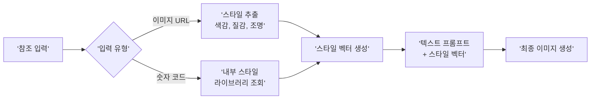
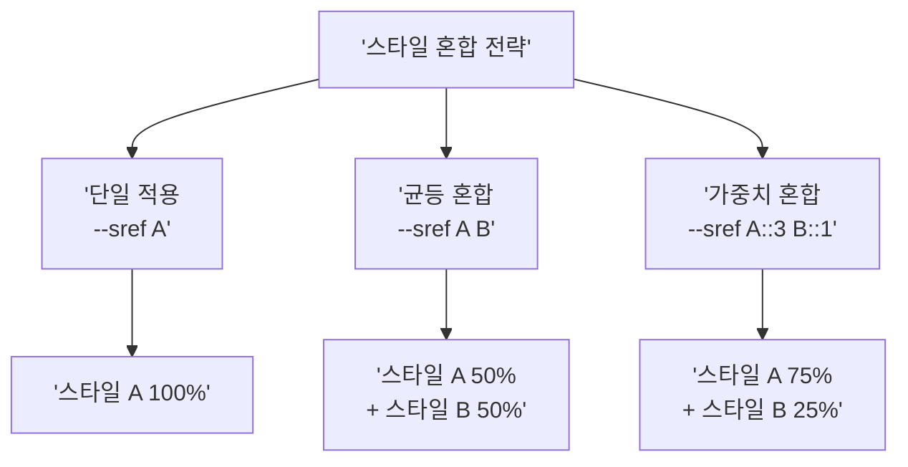

# Midjourney --sref 스타일 레퍼런스

> 숫자 코드 하나로 일관된 비주얼 스타일을 적용하는 Midjourney 스타일 레퍼런스 완전 정복

## 개요

Midjourney의 `--sref`(Style Reference) 파라미터는 참조 이미지나 숫자 코드를 통해 색감, 질감, 분위기, 조명 톤을 일관되게 적용하는 스타일 제어 도구입니다. ControlNet이 외부 조건 맵을 모델에 주입하는 구조라면, Midjourney는 파라미터 하나로 내부 엔진이 처리하는 통합형 구조입니다. `--sref`를 활용하면 한 번 정의한 비주얼 톤을 어떤 프롬프트에든 무한히 재사용할 수 있습니다.

## --sref의 원리와 사용법

> 요리사가 매번 양념 비율을 설명하는 대신 레시피 카드 번호만 전달하면 같은 맛이 재현되듯, `--sref`는 스타일의 레시피 카드입니다.

`--sref`는 Midjourney에게 "이 스타일을 따라해"라고 지시하는 파라미터입니다. 기존의 `--stylize`가 미학적 해석 **강도**를 조절하는 볼륨 노브라면, `--sref`는 스타일의 **방향** 자체를 지정하는 나침반입니다.

**이미지 URL 방식** — 특정 이미지의 스타일을 추출:

```
a serene mountain landscape --sref https://example.com/reference-image.jpg
```


**숫자 코드 방식** — Midjourney 내부 스타일 라이브러리의 고유 코드 사용:

```
a serene mountain landscape --sref 2213253170
```


두 방식 모두 참조 대상에서 **색감, 질감, 조명 패턴, 전체 분위기**를 추출하여 적용합니다. 핵심은 참조 이미지의 내용(주제)이 아니라 **스타일(미학)**만 가져온다는 점입니다.



## --sw 스타일 가중치 조절

`--sw`(Style Weight)는 `--sref`로 지정한 스타일이 **얼마나 강하게** 반영될지 조절합니다. 범위는 0~1000, 기본값은 100입니다.

| --sw 값 | 효과 | 적합한 상황 |
|---------|------|------------|
| 0~50 | 스타일 힌트만 살짝 | 프롬프트 내용 우선, 미묘한 분위기만 차용 |
| 50~100 | 균형 잡힌 적용 | 일반적 사용, 자연스러운 스타일 반영 |
| 100~300 | 강한 스타일 적용 | 스타일 일관성이 중요한 시리즈 작업 |
| 300~1000 | 스타일 지배적 | 스타일 자체가 주인공인 실험적 작업 |

```mermaid
flowchart TD
    subgraph LOW['--sw 30']
        A1['프롬프트 영향 80%'] ~~~ A2['스타일 영향 20%']
    end
    subgraph MID['--sw 100 (기본값)']
        B1['프롬프트 영향 60%'] ~~~ B2['스타일 영향 40%']
    end
    subgraph HIGH['--sw 500']
        C1['프롬프트 영향 25%'] ~~~ C2['스타일 영향 75%']
    end
    LOW --> MID --> HIGH
```

실무에서 최적의 `--sw` 값은 **65~175** 범위가 경험적으로 효과적입니다. 기본값으로 시작하여 결과를 보고 조절하세요.

```
a cozy bookstore interior --sref 4114158294 --sw 50
```

```
a cozy bookstore interior --sref 4114158294 --sw 150
```

```
a cozy bookstore interior --sref 4114158294 --sw 400
```


## 여러 스타일 혼합

`--sref` 뒤에 여러 코드를 나열하면 스타일을 혼합할 수 있습니다. 가중치(`::`)를 부여하면 특정 스타일의 비중을 조절할 수 있습니다.

**균등 혼합:**
```
a fantasy castle --sref 2213253170 4114158294
```

**가중치 혼합 (3:1 비율):**
```
a fantasy castle --sref 2213253170::3 4114158294::1
```

**이미지 URL + 숫자 코드 혼합:**
```
a portrait --sref https://example.com/style.jpg 1225796221
```


비율만 중요하며 절대값은 무관합니다. `::3`과 `::1`은 `::300`과 `::100`과 동일한 결과를 만듭니다. 질감 코드 + 색상 코드를 조합하는 방식이 특히 효과적입니다.



## --sref random과 스타일 탐색

`--sref random`은 Midjourney가 무작위 SREF 코드를 선택하여 적용하고, 결과와 함께 실제 코드 번호를 공개합니다.

```
a modern city skyline --sref random
```

```
a cat sitting on a windowsill --sref random
```


마음에 드는 스타일이 나오면 코드를 저장하여 재사용합니다:

```
a dog in a garden --sref 91506085
```

커뮤니티에서는 이렇게 발견한 코드를 모아 공유하는 라이브러리가 활발합니다:

| 라이브러리 | 특징 |
|-----------|------|
| sref-midjourney.com | 빠른 레퍼런스, 치트시트, 튜토리얼 제공 |
| Midlibrary (midlibrary.io) | 2,800+ 코드, 51개 필터, 16개 벤치마크 프롬프트 |
| SrefHunt (srefhunt.com) | 커뮤니티 기반 코드 수집 및 공유 플랫폼 |
| PromptsRef (promptsref.com) | 1,500+ 코드, V6/V7/Niji 버전별 분류 |

## 스타일 버전(--sv)과 호환성

Midjourney V7(2025년 6월)과 함께 스타일 엔진이 크게 개편되었습니다. 라이브러리에서 찾은 대부분의 코드는 V6 이전 엔진 기준이므로, 원래 의도한 스타일을 재현하려면 `--sv 4`를 명시해야 합니다.

```
-- V7 기본 (최신 스타일 엔진 자동 적용)
a landscape --sref 91506085
```

```
-- 이전 버전 코드를 원래대로 재현할 때
a landscape --sref 91506085 --sv 4
```

최신 V7 엔진은 **주제 누출(Subject Leakage)** — 참조 이미지의 스타일뿐 아니라 내용까지 복사되는 현상 — 이 크게 감소했습니다. `--sv`의 지원 범위는 버전에 따라 달라질 수 있으므로 공식 문서를 확인하세요.

## 실습: 스타일 사전 만들기

### 활동 1: --sw 값 변화 체험

아래 프롬프트를 순서대로 실행하며 `--sw` 값에 따른 변화를 관찰하세요.

```
a cozy cafe interior --sref random
```

발견한 코드를 기록한 뒤, 같은 코드로 가중치를 변경합니다:

```
a cozy cafe interior --sref [발견한 코드] --sw 50
```

```
a cozy cafe interior --sref [발견한 코드] --sw 300
```

다른 주제에 같은 코드를 적용하여 스타일 일관성을 확인합니다:

```
a forest path --sref [발견한 코드] --sw 100
```


### 활동 2: 스타일 블렌딩 실험

두 개의 SREF 코드를 다양한 비율로 혼합합니다:

```
a portrait --sref 2213253170 --sv 4
```

```
a portrait --sref 2213253170::3 4114158294::1 --sv 4
```

```
a portrait --sref 2213253170 4114158294 --sv 4
```

```
a portrait --sref 2213253170::1 4114158294::3 --sv 4
```

```
a portrait --sref 4114158294 --sv 4
```


**관찰 포인트**: 비율이 변할 때 색감, 질감, 전체 분위기 중 어떤 요소가 가장 먼저 변화하는지 기록하세요.

## 팁과 주의사항

- `--sref`는 참조 이미지를 **복사하지 않습니다**. 스타일(색감, 질감, 분위기)만 추출합니다. 참조 이미지의 내용까지 반영하려면 `--cref`나 img2img를 사용하세요.
- 프롬프트에 스타일 단어("watercolor", "cinematic" 등)를 넣으면 `--sref`와 충돌할 수 있습니다. 프롬프트는 **내용 중심**으로 간결하게, 스타일은 `--sref`에 맡기세요.
- `--sref`와 `--stylize`는 **동시 사용 가능**합니다. 시리즈 작업에서는 `--sref 코드 --sw 150 --stylize 200` 조합이 일관성과 퀄리티의 균형을 잡아줍니다.
- 새 SREF 코드를 테스트할 때는 `--sw 100`(기본값)으로 시작하세요. 극단적인 값(900~1000)은 프롬프트 주제를 완전히 묻어버릴 수 있습니다.
- 라이브러리 코드를 사용할 때는 **`--sv 4`를 추가**해야 미리보기와 동일한 결과를 얻습니다. 빼먹으면 전혀 다른 스타일이 나올 수 있습니다.
- SREF 코드는 이론적으로 약 40억 개(2^32)가 가능하지만, 카탈로그화된 코드는 극히 일부입니다. `--sref random`으로 아직 아무도 보지 못한 스타일을 발견할 확률이 높습니다.

## 핵심 정리

| 개념 | 설명 |
|------|------|
| --sref (Style Reference) | 이미지 URL이나 숫자 코드로 특정 스타일을 지정하는 파라미터 |
| --sw (Style Weight) | 스타일 영향력 조절 (0~1000, 기본값 100). 높을수록 스타일 지배적 |
| SREF 코드 | Midjourney 내부의 고유 스타일 식별 번호. 공유 및 재현 가능 |
| --sref random | 무작위 스타일 코드를 적용하여 새로운 미학을 탐색 |
| 가중치 혼합 (::) | 여러 SREF 코드의 영향력 비율 조절 (비율만 중요, 절대값 무관) |
| --sv (Style Version) | 스타일 엔진 버전 지정. 이전 코드 재현 시 --sv 4 사용 |
| 주제 누출 (Subject Leakage) | 참조 이미지의 내용까지 복사되는 현상. 최신 엔진에서 크게 감소 |

## 다음 섹션 미리보기

다음 섹션 [Midjourney --cref 캐릭터 레퍼런스](07-ch7-controlnet과-참조-이미지-활용/05-05-midjourney---cref-캐릭터-레퍼런스.md)에서는 **캐릭터의 일관성**을 다룹니다. `--cref`는 참조 이미지의 캐릭터 외형(얼굴, 체형, 의상)을 추출하여 동일 인물을 재현하는 파라미터입니다. `--sref`와 `--cref`를 조합하면 "같은 캐릭터가 같은 스타일로 다양한 상황에 등장하는" 시리즈 콘텐츠를 만들 수 있습니다.
