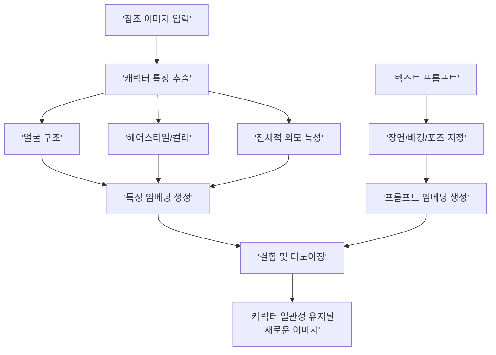
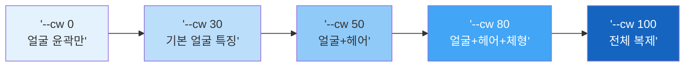

# Midjourney --cref 캐릭터 레퍼런스

> 한 장의 참조 이미지로 캐릭터의 정체성을 지키며 무한한 장면을 만드는 Midjourney의 핵심 기능

## 개요

Midjourney의 `--cref`(Character Reference) 파라미터는 참조 이미지에서 캐릭터의 정체성 특징을 추출하여 새로운 이미지에 반영합니다. 이 섹션에서는 `--cref`의 작동 원리, `--cw` 가중치 제어, `--sref`와의 조합 전략, 그리고 V7의 `--oref` 확장까지 다룹니다.

## --cref의 작동 원리

`--cref`는 참조 이미지에서 얼굴 구조, 피부색, 헤어스타일 등 캐릭터의 정체성 특징을 추출하여 새로운 이미지 생성에 반영합니다. IP-Adapter가 이미지 전체의 스타일과 구도를 참조하는 것과 달리, `--cref`는 **캐릭터의 정체성에 특화**되어 있습니다.



기본 사용법은 간단합니다:

```
/imagine prompt: a warrior in a forest --cref [이미지 URL]
```


여러 장의 참조 이미지를 동시에 사용하면 더 안정적인 결과를 얻을 수 있습니다:

```
/imagine prompt: a character smiling --cref [URL1] [URL2] [URL3]
```

같은 캐릭터의 정면, 측면, 3/4 뷰를 함께 넣으면 캐릭터 재현 안정성이 크게 향상됩니다.

## --cw(Character Weight)로 재현 범위 제어

`--cw`는 0에서 100 사이의 값으로, 참조 캐릭터의 특징을 얼마나 강하게 반영할지 결정합니다.

| --cw 값 | 반영 범위 | 활용 상황 |
|---------|----------|----------|
| **100** (기본값) | 얼굴 + 헤어 + 의상 + 체형 전체 | 동일 캐릭터 다른 장면 |
| **50~80** | 얼굴 + 헤어 위주, 의상 변경 가능 | 의상 변경 촬영 |
| **10~30** | 얼굴 특징만 약하게 참조 | 영감만 받고 싶을 때 |
| **0** | 얼굴 구조만 미세하게 참조 | 분위기만 참고 |



실전 활용 패턴별 프롬프트를 살펴봅시다:

```
/imagine prompt: a female knight in a snowy mountain --cref [URL] --cw 100 --ar 16:9
```


```
/imagine prompt: the character in casual streetwear, urban background --cref [URL] --cw 60
```


```
/imagine prompt: a mysterious figure in fog --cref [URL] --cw 20
```

## --sref + --cref 조합 전략

> 영화에서 배우(캐릭터)와 촬영 감독(스타일)이 따로 있는 것과 같습니다. `--cref`가 '누가 출연하는지'를 결정하고, `--sref`는 '어떤 분위기로 찍을지'를 결정합니다.

```
/imagine prompt: a character walking in rain --cref [캐릭터 URL] --sref [스타일 URL] --cw 80 --sw 60
```


```
/imagine prompt: portrait of the character, oil painting style --cref [캐릭터 URL] --sref [유화 스타일 URL] --cw 90 --sw 40
```

```
/imagine prompt: the character in anime style, cherry blossom background --cref [캐릭터 URL] --sref [애니메 스타일 URL] --cw 70 --sw 80
```

두 파라미터가 충돌할 수 있으므로, 가중치 조합 전략이 중요합니다:

| 조합 전략 | --cw | --sw | 결과 |
|----------|------|------|------|
| 캐릭터 우선 | 80-100 | 20-40 | 캐릭터 정확도 높음, 스타일 약하게 |
| 균형 | 50-70 | 50-70 | 적절한 타협 |
| 스타일 우선 | 20-40 | 80-100 | 스타일 강하게, 캐릭터 느낌만 |

## V7의 --oref: 객체 참조 시스템

Midjourney V7은 캐릭터를 넘어 **모든 객체**로 참조 범위를 확장한 `--oref`(Object Reference)를 도입했습니다.

```
/imagine prompt: a red sports car on a mountain road --oref [자동차 URL] --ow 80
```


`--oref`와 `--cref`는 동시에 사용할 수 있습니다:

```
/imagine prompt: a detective stepping out of a vintage car, noir style --cref [인물 URL] --oref [차량 URL] --cw 90 --ow 80
```

| 특성 | --cref (V6+) | --oref (V7) |
|------|------------|------------|
| 대상 | 캐릭터(사람/의인화) | 모든 객체 |
| 추출 특징 | 얼굴, 헤어, 체형 | 형태, 색상, 디테일 |
| 가중치 | --cw (0-100) | --ow (0-100) |
| 조합 | --sref와 조합 | --cref, --sref와 모두 조합 가능 |

```mermaid
flowchart TD
    subgraph V6['Midjourney V6 (2024)']
        A['--sref<br/>스타일 참조']
        B['--cref<br/>캐릭터 참조']
    end
    subgraph V7['Midjourney V7 (2025)']
        C['--sref<br/>스타일 참조']
        D['--cref<br/>캐릭터 참조']
        E['--oref<br/>객체 참조']
        F['--pref<br/>개인화']
    end
    A --> C
    B --> D
    B -.->|'확장'| E
    style V6 fill:#e3f2fd,color:#333
    style V7 fill:#e8f5e9,color:#333
    style E fill:#ff9800,color:#fff
```

## 실습: 캐릭터 시트 워크플로우

캐릭터 시트(Character Sheet)를 제작하는 실전 워크플로우를 따라해 보세요.

**Step 1: 마스터 캐릭터 생성**

```
/imagine prompt: character design sheet, front view, a young female warrior with short silver hair and blue eyes, detailed face, white background, studio lighting --ar 1:1 --s 200
```


**Step 2: 다양한 장면 생성**

```
/imagine prompt: the character in a medieval tavern, warm lighting, sitting at a wooden table --cref [마스터 URL] --cw 100 --ar 16:9
```

**Step 3: 표정 시트 제작**

```
/imagine prompt: character expression sheet, 6 different emotions, happy sad angry surprised thoughtful confident, white background --cref [마스터 URL] --cw 100 --ar 3:2
```


**Step 4: 의상 변형**

```
/imagine prompt: the character wearing casual modern clothes, streetwear style --cref [마스터 URL] --cw 60 --ar 1:1
```

**--cw 비교 실험**: 같은 참조 이미지에 대해 `--cw` 값을 변경하며 결과를 비교해 보세요:

| 시도 | --cw 값 | 프롬프트 | 관찰 포인트 |
|------|---------|---------|----------|
| 1 | 100 | a warrior in snow | 얼굴/헤어/의상 유사도 |
| 2 | 70 | a warrior in snow | 의상 변화 시작점 |
| 3 | 40 | a warrior in snow | 헤어스타일 변화 |
| 4 | 10 | a warrior in snow | 얼굴 유사도 임계점 |

## 팁과 주의사항

- `--cref`는 캐릭터의 정체성 특징을 **추출**하여 새로 생성하는 것이지, 사진을 픽셀 단위로 복제하지 않습니다. `--cw 100`이라도 완전히 동일한 사진은 나오지 않습니다.
- 의상만 바꾸고 싶을 때는 `--cw 50~60`이 최적입니다. 100에서는 원본 의상이 너무 강하게 유지되고, 30 이하에서는 얼굴까지 변하기 시작합니다. 프롬프트에서 의상 설명을 상세히 적으세요.
- 실존 인물 사진을 `--cref`에 넣어도 Midjourney가 정책적으로 제한하여 "영감을 받은" 정도의 결과만 나옵니다.
- `--oref`에서 `--ow 30` 정도로 낮추면 원본 객체의 느낌만 가져오면서 프롬프트가 더 강하게 반영됩니다. 제품 변형 디자인 탐색에 유용합니다.
- 멀티 참조 시 최대 3개 이미지를 제공할 수 있으며, 정면/측면/3/4 뷰를 함께 넣으면 안정성이 향상됩니다.

## 핵심 정리

| 개념 | 설명 |
|------|------|
| **--cref** | 캐릭터 참조 파라미터. 참조 이미지에서 캐릭터 정체성을 추출하여 새 이미지에 반영 |
| **--cw (0-100)** | Character Weight. 캐릭터 특징 반영 강도 (100=전체 복제, 0=얼굴 윤곽만) |
| **--sref + --cref** | 스타일과 캐릭터를 동시에 제어. --sw와 --cw로 각각 강도 조절 |
| **--oref (V7)** | Object Reference. 캐릭터를 넘어 모든 객체로 참조 확장 |
| **--ow (0-100)** | Object Weight. --oref의 반영 강도 조절 |
| **멀티 참조** | 최대 3개 참조 이미지 동시 사용으로 안정성 향상 |
| **캐릭터 시트** | 마스터 이미지 -> 다양한 장면/표정/의상으로 확장하는 워크플로우 |

## 다음 섹션 미리보기

다음 챕터 [Ch8. 캐릭터·브랜드 스타일 일관성 유지](08-ch8-캐릭터브랜드-스타일-일관성-유지/01-01-캐릭터-일관성의-도전과-전략.md)에서는 `--cref`와 `--sref`를 활용한 캐릭터 일관성 전략, 브랜드 스타일 가이드 구축, 시리즈 콘텐츠 워크플로우까지 실전 프로젝트로 다룹니다.
