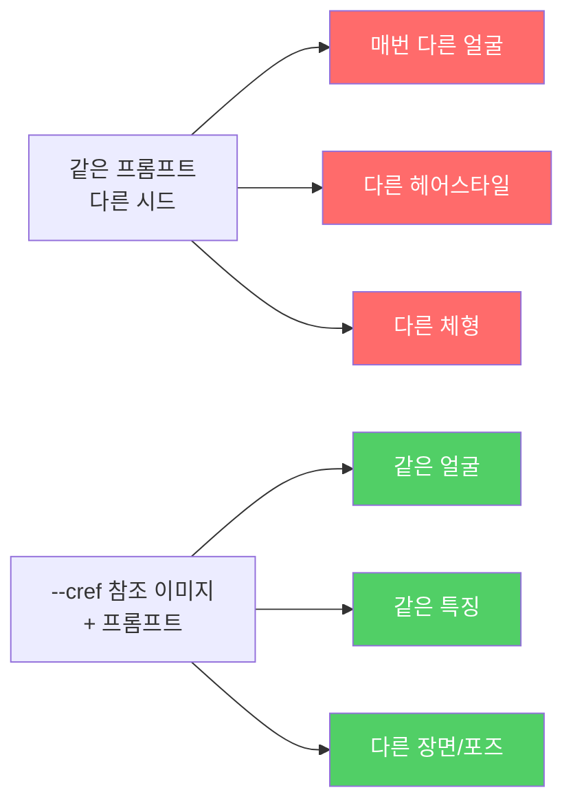
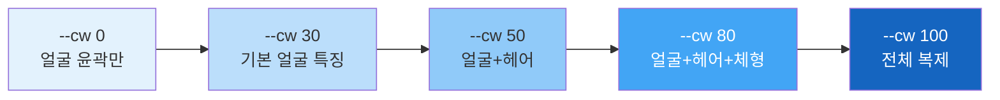
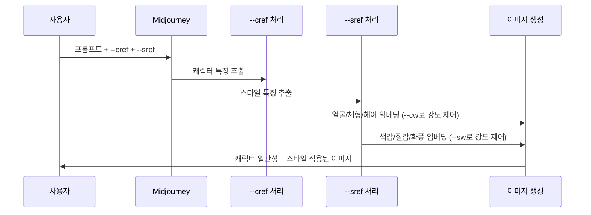
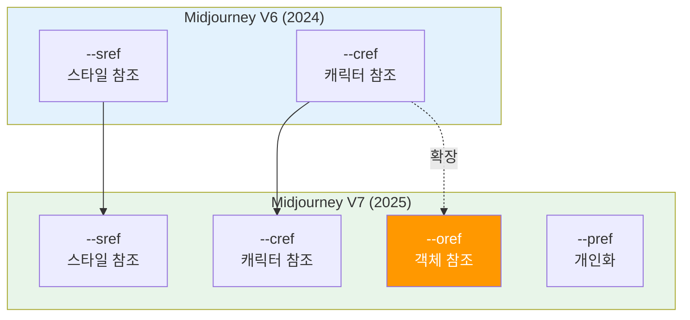

# Midjourney --cref 캐릭터 레퍼런스

> 한 장의 참조 이미지로 캐릭터의 정체성을 지키며 무한한 장면을 만드는 Midjourney의 핵심 기능

## 개요

이 섹션에서는 Midjourney의 `--cref`(Character Reference) 파라미터를 활용하여 일관된 캐릭터를 다양한 장면과 스타일로 확장하는 방법을 배웁니다.

**선수 지식**: [04. IP-Adapter와 스타일 전이](07-controlnet과-참조-이미지-활용/04-ip-adapter와-스타일-전이.md)에서 배운 참조 이미지 기반 생성 개념
**학습 목표**:
- `--cref` 파라미터의 작동 원리와 내부 메커니즘 이해
- `--cw`(Character Weight) 값에 따른 캐릭터 재현 범위 제어
- `--sref`와 `--cref`의 조합 전략 습득
- V7의 `--oref`(Object Reference) 진화 이해
- 실전 캐릭터 시트 제작 워크플로우 구축

## 왜 알아야 할까?

웹툰 작가가 100화 분량의 연재를 한다고 상상해 보세요. 주인공의 얼굴이 매 화마다 조금씩 달라진다면 독자들은 금방 알아차리겠죠? AI 이미지 생성에서도 마찬가지입니다. 한 번 만든 캐릭터를 다른 포즈, 다른 배경, 다른 의상에서도 **같은 사람**으로 유지하는 것—이것이 캐릭터 일관성(Character Consistency)의 핵심 과제입니다.

> 📊 **그림 1**: 캐릭터 일관성 없는 생성 vs --cref 활용 생성



2024년 이전까지 Midjourney 사용자들은 캐릭터 일관성을 위해 시드(seed) 고정, 상세한 외모 묘사, 이미지 프롬프팅 등 온갖 우회 방법을 동원해야 했습니다. 하지만 이 방법들은 불안정하고 한계가 뚜렷했죠. `--cref`는 이 문제를 근본적으로 해결한 게임 체인저입니다.

## 핵심 개념

### 개념 1: --cref의 작동 원리—"얼굴 기억 장치"

> 💡 **비유**: 사진관에서 증명사진을 찍을 때를 떠올려 보세요. 사진사가 여러분의 얼굴을 한 번 보고, 이후에는 조명을 바꾸고, 배경을 바꾸고, 포즈를 달리해도 **같은 사람의 사진**을 찍어줍니다. `--cref`는 Midjourney에게 "이 사람의 얼굴을 기억해"라고 말하는 것과 같습니다.

`--cref`는 Character Reference의 약자로, 참조 이미지에서 캐릭터의 정체성 특징(얼굴 구조, 피부색, 헤어스타일, 전반적인 외모)을 추출하여 새로운 이미지 생성에 반영합니다.

**기본 사용법:**

```
/imagine prompt: a warrior in a forest --cref [이미지 URL]
```

> 📊 **그림 2**: --cref 처리 파이프라인


IP-Adapter가 이미지 전체의 스타일과 구도를 참조하는 것과 달리, `--cref`는 **캐릭터의 정체성에 특화**되어 있다는 점이 핵심입니다. 배경이나 구도는 무시하고, 오직 "이 캐릭터가 누구인지"에 집중합니다.

> 💡 **알고 계셨나요?**: `--cref`는 2024년 3월 Midjourney V6와 함께 출시되었습니다. 당시 Midjourney 팀의 David Holz는 "사용자들이 가장 많이 요청한 기능"이라며, 내부적으로 2년 넘게 개발했다고 밝혔습니다. 출시 첫 주에 전체 생성량의 30% 이상이 `--cref`를 사용할 정도로 폭발적인 반응을 얻었죠.

**멀티 참조 이미지 활용:**

한 장이 아닌 여러 장의 참조 이미지를 동시에 사용할 수도 있습니다:

```
/imagine prompt: a character smiling --cref [URL1] [URL2] [URL3]
```

여러 이미지를 제공하면 Midjourney가 각 이미지에서 캐릭터 특징의 평균을 추출합니다. 같은 캐릭터의 다양한 각도 사진을 넣을수록 더 안정적인 결과를 얻을 수 있습니다.

### 개념 2: --cw(Character Weight)로 재현 범위 제어하기

> 💡 **비유**: 카페에서 "지난번에 마신 거랑 비슷한 걸로 주세요"라고 말할 때, "완전히 똑같이"부터 "대충 그 느낌으로"까지 다양한 정도가 있잖아요? `--cw`는 바로 그 "비슷함의 정도"를 숫자로 조절하는 다이얼입니다.

`--cw`(Character Weight)는 0에서 100 사이의 값으로, 참조 캐릭터의 특징을 얼마나 강하게 반영할지 결정합니다.

| --cw 값 | 반영 범위 | 활용 상황 |
|---------|----------|----------|
| **100** (기본값) | 얼굴 + 헤어 + 의상 + 체형 전체 | 동일 캐릭터 다른 장면 |
| **50~80** | 얼굴 + 헤어 위주, 의상 변경 가능 | 의상 변경 촬영 |
| **10~30** | 얼굴 특징만 약하게 참조 | 영감만 받고 싶을 때 |
| **0** | 얼굴 구조만 미세하게 참조 | 분위기만 참고 |

> 📊 **그림 3**: --cw 값에 따른 캐릭터 재현 스펙트럼



**실전 활용 패턴:**

- **웹툰/만화 제작**: `--cw 100`으로 시작하되, 의상 변경이 필요한 장면에서는 `--cw 50~60`으로 낮추고 프롬프트에서 의상을 지정
- **캐릭터 변형 탐색**: `--cw 20~30`으로 "이 캐릭터에서 영감받은 새로운 캐릭터" 생성
- **가족/관련 캐릭터**: `--cw 10~20`으로 비슷하지만 다른 인물 만들기

> ⚠️ **흔한 오해**: "--cref는 사진을 그대로 복제한다"고 생각하는 분이 많지만, 실제로는 **캐릭터의 정체성 특징을 추출**하여 새로 생성하는 것입니다. 증명사진을 넣고 `--cw 100`을 해도 완전히 동일한 사진이 나오지는 않습니다. AI가 해석한 "이 사람의 본질적 특징"을 바탕으로 새로운 이미지를 만드는 겁니다.

### 개념 3: --sref + --cref 조합 전략—"스타일과 캐릭터 동시 제어"

> 💡 **비유**: 영화 촬영에서 배우(캐릭터)와 촬영 감독(스타일)이 따로 있는 것과 같습니다. `--cref`가 "누가 출연하는지"를 결정한다면, `--sref`(Style Reference)는 "어떤 분위기로 찍을지"를 결정합니다. 둘을 함께 쓰면 같은 배우를 다양한 장르의 영화에 캐스팅할 수 있습니다.

```
/imagine prompt: a character walking in rain 
  --cref [캐릭터 이미지 URL] 
  --sref [스타일 이미지 URL] 
  --cw 80 --sw 60
```

> 📊 **그림 4**: --cref와 --sref 조합 시 영향 범위



**조합 시 주의사항:**

두 파라미터가 충돌할 수 있는 영역이 존재합니다. 예를 들어 캐릭터 참조 이미지는 사실적인 사진인데, 스타일 참조가 수채화라면 얼굴 재현도가 다소 떨어질 수 있습니다. 이럴 때는 `--cw`를 높이고 `--sw`를 낮춰서 캐릭터 우선순위를 확보하세요.

| 조합 전략 | --cw | --sw | 결과 |
|----------|------|------|------|
| 캐릭터 우선 | 80-100 | 20-40 | 캐릭터 정확도 높음, 스타일 약하게 |
| 균형 | 50-70 | 50-70 | 적절한 타협 |
| 스타일 우선 | 20-40 | 80-100 | 스타일 강하게, 캐릭터 느낌만 |

> ⚠️ **흔한 오해**: "연예인이나 실존 인물 사진을 --cref에 넣으면 그 사람이 나온다"고 생각하시는 분들이 있는데, Midjourney는 실존 인물 생성을 정책적으로 제한합니다. 실존 인물 사진을 넣어도 "영감을 받은" 정도의 결과만 나오며, 유명인의 경우 더욱 강하게 필터링됩니다.

### 개념 4: V7의 --oref—객체로 확장된 참조 시스템

2025년, Midjourney V7은 캐릭터를 넘어 **모든 객체**로 참조 범위를 확장한 `--oref`(Object Reference)를 도입했습니다. 이것은 단순한 파라미터 추가가 아니라, 참조 시스템의 패러다임 전환이었습니다.

> 💡 **비유**: `--cref`가 "이 배우를 캐스팅해 주세요"였다면, `--oref`는 "이 소품/차량/건물도 같은 걸로 써 주세요"까지 확장된 것입니다. 영화에서 배우뿐 아니라 특정 자동차, 특정 건물, 특정 로봇이 시리즈 내내 일관되게 등장해야 하는 것처럼요.

```
/imagine prompt: a red sports car on a mountain road --oref [자동차 이미지 URL] --ow 80
```

**--cref vs --oref 비교:**

| 특성 | --cref (V6+) | --oref (V7) |
|------|------------|------------|
| 대상 | 캐릭터(사람/의인화) | 모든 객체 |
| 추출 특징 | 얼굴, 헤어, 체형 | 형태, 색상, 디테일 |
| 가중치 | --cw (0-100) | --ow (0-100) |
| 조합 | --sref와 조합 | --cref, --sref와 모두 조합 가능 |
| 적합한 대상 | 인물 캐릭터 | 제품, 차량, 건물, 로봇, 동물 등 |

> 📊 **그림 5**: V6에서 V7로의 참조 시스템 진화



> 🔥 **실무 팁**: `--oref`와 `--cref`는 동시에 사용할 수 있습니다! 예를 들어 "같은 캐릭터가 같은 차를 타고 있는 시리즈"를 만들 때, `--cref [인물]` `--oref [차량]`을 함께 사용하면 두 요소 모두 일관성을 유지합니다.

### 개념 5: 실전 캐릭터 시트 워크플로우

프로 크리에이터들이 사용하는 실전 워크플로우를 살펴보겠습니다. 캐릭터 시트(Character Sheet)는 게임, 애니메이션, 웹툰 제작에서 캐릭터의 다양한 모습을 한눈에 정리한 참조 문서입니다.

**Step 1: 마스터 캐릭터 생성**

```
/imagine prompt: character design sheet, front view, a young female warrior 
with short silver hair and blue eyes, detailed face, white background, 
studio lighting --ar 1:1 --s 200
```

**Step 2: 마스터 이미지로 다양한 장면 생성**

```
/imagine prompt: the character in a medieval tavern, warm lighting, 
sitting at a wooden table --cref [마스터 이미지 URL] --cw 100 --ar 16:9
```

**Step 3: 표정 시트 제작**

```
/imagine prompt: character expression sheet, 6 different emotions, 
happy sad angry surprised thoughtful confident, white background 
--cref [마스터 이미지 URL] --cw 100 --ar 3:2
```

**Step 4: 의상 변형**

```
/imagine prompt: the character wearing casual modern clothes, 
streetwear style --cref [마스터 이미지 URL] --cw 60 --ar 1:1
```

> 🔥 **실무 팁**: `--ow` 파라미터로 `--oref`의 강도를 조절할 때, 스타일 전이와 유사한 효과를 낼 수 있습니다. `--ow 30` 정도로 낮추면 원본 객체의 "느낌"만 가져오면서 프롬프트의 새로운 설명이 더 강하게 반영됩니다. 제품 라인업의 변형 디자인을 탐색할 때 유용합니다.

## 실습: 캐릭터 일관성 마스터하기

### 활동 1: 캐릭터 시트 기획 워크시트

아래 템플릿을 채워 자신만의 캐릭터를 기획해 보세요:

| 항목 | 내용 |
|------|------|
| **캐릭터 이름** | (예: Luna) |
| **성별/나이대** | (예: 여성, 20대 중반) |
| **핵심 외모 특징** | (예: 은색 단발, 파란 눈, 날카로운 턱선) |
| **세계관/장르** | (예: 사이버펑크 도시) |
| **기본 의상** | (예: 검정 가죽 재킷, 네온 액세서리) |
| **성격 키워드** | (예: 냉철, 유머러스, 정의로운) |

이 정보를 바탕으로 마스터 프롬프트를 작성하고, `--cref`로 5개 이상의 다른 장면을 생성해 보세요.

### 활동 2: --cw 값 비교 분석

같은 참조 이미지에 대해 `--cw` 값을 변경하며 결과를 비교하세요:

| 시도 | --cw 값 | 프롬프트 | 관찰 결과 |
|------|---------|---------|----------|
| 1 | 100 | a warrior in snow | 얼굴/헤어/의상 모두 유사 |
| 2 | 70 | a warrior in snow | (관찰 기록) |
| 3 | 40 | a warrior in snow | (관찰 기록) |
| 4 | 10 | a warrior in snow | (관찰 기록) |

**분석 질문**: 
- 어떤 `--cw` 값에서 의상이 프롬프트를 따르기 시작했나요?
- 얼굴 유사도가 크게 떨어지는 임계점은 어디였나요?

### 활동 3: V6 → V7 마이그레이션 체크리스트

기존 V6에서 `--cref`를 사용하던 워크플로우를 V7으로 전환할 때 확인할 사항:

- [ ] 기존 `--cref` 프롬프트가 V7에서도 정상 작동하는지 확인
- [ ] 비인물 객체에 `--cref`를 사용하던 경우 → `--oref`로 전환
- [ ] `--cw` 값 재조정 (V7에서 같은 값이 약간 다르게 동작할 수 있음)
- [ ] `--oref` + `--cref` 조합 활용 가능성 탐색
- [ ] 기존 참조 이미지 라이브러리 정리 및 라벨링

## 더 깊이 알아보기

### --cref 탄생의 뒷이야기

Midjourney의 `--cref` 기능은 하루아침에 만들어진 것이 아닙니다. 2022년부터 Midjourney 커뮤니티에서는 "같은 캐릭터를 다른 장면에서 그리고 싶다"는 요청이 끊임없이 올라왔습니다. 당시 사용자들은 시드 고정(`--seed`), 이미지 프롬프팅, 심지어 외부 도구인 InsightFace를 이용한 얼굴 교체(face swap) 봇까지 동원하며 우회하고 있었죠.

David Holz와 Midjourney 팀은 이 문제를 "이미지 프롬프팅의 확장"이 아니라 "캐릭터 정체성 임베딩"이라는 새로운 관점에서 접근했습니다. 단순히 픽셀을 복사하는 것이 아니라, 캐릭터의 "본질"을 이해하는 모델을 별도로 훈련시킨 것입니다. 이는 앞서 [04. IP-Adapter와 스타일 전이](07-controlnet과-참조-이미지-활용/04-ip-adapter와-스타일-전이.md)에서 배운 이미지 임베딩 기술과 근본적으로 같은 뿌리에서 나왔지만, 캐릭터의 정체성 특징에 특화되었다는 점에서 차별화됩니다.

### --oref로의 진화: "만약 사람만이 아니라면?"

`--oref`의 탄생은 하나의 질문에서 시작되었습니다: "캐릭터 참조가 가능하다면, 왜 다른 객체는 안 되지?" V7 개발 과정에서 Midjourney 팀은 캐릭터 특징 추출 파이프라인을 일반화하여 모든 시각적 객체의 정체성을 임베딩할 수 있도록 확장했습니다. 이로써 제품 디자인, 건축 시각화, 게임 에셋 제작 등 더 넓은 분야에서 일관성 있는 시리즈 이미지 생성이 가능해졌습니다.

## 흔한 오해와 팁

> ⚠️ **흔한 오해**: "--cref는 초상화를 복제하는 딥페이크 도구다"라고 오해하시는 분이 있습니다. 실제로 `--cref`는 참조 이미지의 **스타일화된 특징**을 추출하는 것이지, 픽셀 단위 복제가 아닙니다. 사실적 사진을 넣어도 Midjourney의 미적 해석이 가해진 결과가 나옵니다.

> 💡 **알고 계셨나요?**: Midjourney의 멀티 참조 기능에서 최대 3개의 `--cref` 이미지를 동시에 제공할 수 있습니다. 같은 캐릭터의 정면, 측면, 3/4 뷰를 함께 넣으면 더 안정적인 캐릭터 재현이 가능합니다. 이는 게임 업계의 "턴어라운드 시트(turnaround sheet)" 개념에서 영감받은 접근입니다.

> 🔥 **실무 팁**: 캐릭터의 의상만 바꾸고 싶을 때는 `--cw 50~60`이 스위트 스팟입니다. 100에서는 원본 의상이 너무 강하게 유지되고, 30 이하에서는 얼굴까지 변하기 시작합니다. 또한 프롬프트에서 의상 설명을 상세히 적는 것이 핵심입니다.

> 🔥 **실무 팁**: `--oref`에서 `--ow`(Object Weight)를 활용한 스타일 전이 효과도 알아두세요. `--ow 30` 정도로 낮추면 원본 객체의 "느낌"만 가져오면서 프롬프트의 새로운 설명이 더 강하게 반영됩니다. 제품 라인업의 변형 디자인을 탐색할 때 특히 유용합니다.

## 핵심 정리

| 개념 | 설명 |
|------|------|
| **--cref** | 캐릭터 참조 파라미터. 참조 이미지에서 캐릭터 정체성을 추출하여 새 이미지에 반영 |
| **--cw (0-100)** | Character Weight. 캐릭터 특징 반영 강도 (100=전체 복제, 0=얼굴 윤곽만) |
| **--sref + --cref** | 스타일과 캐릭터를 동시에 제어. --sw와 --cw로 각각 강도 조절 |
| **--oref (V7)** | Object Reference. 캐릭터를 넘어 모든 객체로 참조 확장 |
| **--ow (0-100)** | Object Weight. --oref의 반영 강도 조절 |
| **멀티 참조** | 최대 3개 참조 이미지 동시 사용으로 안정성 향상 |
| **캐릭터 시트** | 마스터 이미지 → 다양한 장면/표정/의상으로 확장하는 워크플로우 |

## 다음 섹션 미리보기

지금까지 ControlNet의 다양한 조건부 생성 기법과 참조 이미지 활용법을 배웠습니다. 다음 챕터 [Ch8. 프롬프트 엔지니어링 심화](08-프롬프트-엔지니어링-심화/01-프롬프트-해부학-구조적-프롬프트-작성법.md)에서는 이 모든 도구를 더 효과적으로 활용하기 위한 **프롬프트 작성의 고급 기법**을 다룹니다. 특히 구조적 프롬프트 작성법은 `--cref`와 결합했을 때 캐릭터 일관성을 극대화하는 핵심 스킬이 됩니다.

## 참고 자료

- [Midjourney Character Reference Documentation](https://docs.midjourney.com/docs/character-reference) - 공식 --cref 파라미터 문서
- [Midjourney Style Reference Guide](https://docs.midjourney.com/docs/style-reference) - --sref와의 조합을 위한 공식 가이드
- [Midjourney V7 Release Notes](https://docs.midjourney.com/docs/v7) - V7의 --oref 포함 신기능 안내
- [Midjourney Parameter List](https://docs.midjourney.com/docs/parameter-list) - 전체 파라미터 종합 레퍼런스
- [Character Consistency in AI Art: A Practical Guide](https://www.whytryai.com/p/midjourney-character-reference) - 실전 캐릭터 일관성 가이드

---
### 🔗 Related Sessions
- [--sref (style reference)](07-ch7-controlnet과-참조-이미지-활용/04-04-midjourney---sref-스타일-레퍼런스.md) (prerequisite)
- [--sw (style weight)](07-ch7-controlnet과-참조-이미지-활용/04-04-midjourney---sref-스타일-레퍼런스.md) (prerequisite)
