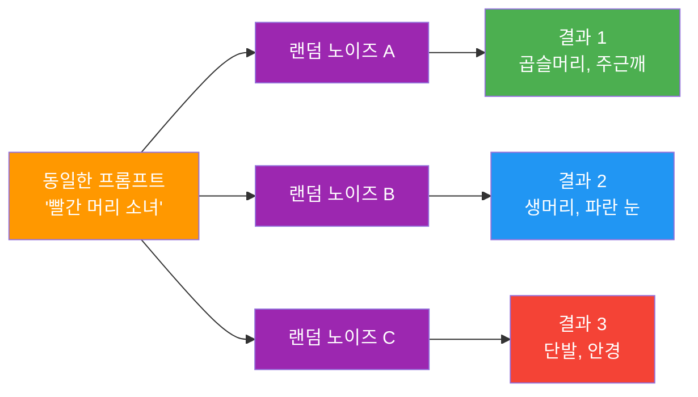
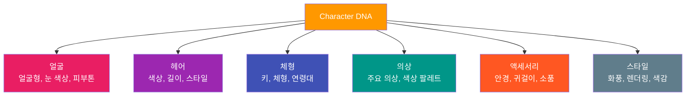
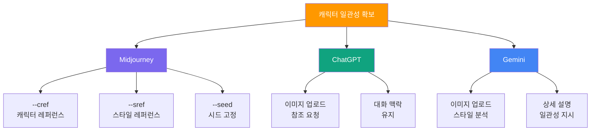

# 캐릭터 일관성의 도전과 전략

> "AI에게 '같은 캐릭터'라는 개념을 전달하는 것은 매번 다른 화가에게 같은 인물화를 주문하는 것과 같다."

## 개요

AI 이미지 생성에서 동일한 캐릭터를 여러 장면에 걸쳐 일관되게 유지하는 것은 가장 까다로운 과제입니다. 이 섹션에서는 AI가 캐릭터를 "기억"하지 못하는 구조적 원인을 이해하고, Character DNA 정의부터 골든 레퍼런스 확보, 플랫폼별 참조 기능까지 실전 전략을 학습합니다.

## AI가 캐릭터를 "기억"하지 못하는 이유

AI 이미지 생성 모델은 **확률 기반**으로 작동합니다. 같은 프롬프트라도 매번 다른 **랜덤 노이즈(Random Noise)**에서 시작하기 때문에 결과가 달라집니다.



| 원인 | 설명 | 예시 |
|------|------|------|
| **랜덤 초기 노이즈** | 매 생성마다 다른 시작점 | 같은 프롬프트에서 완전히 다른 얼굴 |
| **프롬프트 모호성** | "귀여운 소녀"는 해석 범위가 넓음 | 헤어스타일, 체형, 의상이 제각각 |
| **세션 독립성** | AI에 "이전 그림" 기억 없음 | 2번째 생성 시 1번째와 무관한 결과 |
| **스타일 불확정성** | 화풍이 매번 미세하게 변동 | 수채화풍에서 유화풍으로 변동 |

## Character DNA — 상세 외형 설명 전략

**Character DNA**란 캐릭터의 시각적 특성을 체계적으로 정의한 텍스트 설명입니다. 이 설명을 매 프롬프트마다 일관되게 포함하면 AI가 비슷한 결과를 생성할 확률이 크게 높아집니다.



모호한 프롬프트 예시:

```
귀여운 여자 캐릭터가 카페에서 커피를 마시고 있다
```

Character DNA가 적용된 프롬프트:

```
Luna — 20대 초반 여성, 연보라색 웨이브 단발(어깨 길이), 큰 보라색 눈,
둥근 얼굴형, 작은 코, 왼쪽 귀에 별 모양 귀걸이, 흰색 터틀넥 니트와
라벤더 오버사이즈 가디건 착용, 고양이 파우치 소지.
Style: pastel-toned anime, soft cel shading.
카페에서 커피를 마시며 창밖을 바라보고 있다
```


핵심은 **고정 요소**와 **가변 요소**를 구분하는 것입니다:

| 구분 | 요소 | 예시 |
|------|------|------|
| **고정 요소** (항상 포함) | 얼굴, 헤어, 체형, 고유 특징 | 보라색 웨이브 단발, 별 귀걸이 |
| **반고정 요소** (대부분 유지) | 기본 의상, 색상 팔레트 | 라벤더 계열 의상 |
| **가변 요소** (장면마다 변경) | 포즈, 표정, 배경, 소품 | 카페, 공원, 도서관 |

## 시드(Seed) — 랜덤성을 길들이는 숫자

**시드(Seed)**는 AI 이미지 생성의 랜덤 노이즈를 결정하는 숫자 값입니다. 동일한 프롬프트 + 동일한 시드 = 동일한(또는 매우 유사한) 결과가 됩니다.

**플랫폼별 시드 사용법:**

| 플랫폼 | 시드 사용법 | 재현성 |
|--------|-----------|--------|
| **Midjourney** | `--seed 12345` 파라미터 추가 | 높음 (같은 버전 내) |
| **ChatGPT** | 대화 맥락으로 간접 제어 | 제한적 |
| **Stable Diffusion** | Seed 필드에 숫자 입력 | 매우 높음 |

Midjourney에서 시드를 활용한 캐릭터 고정 예시:

```
Luna — 20대 초반 여성, 연보라색 웨이브 단발, 큰 보라색 눈,
별 모양 귀걸이, 흰색 터틀넥, 라벤더 가디건.
Style: pastel anime, soft cel shading.
standing in a flower garden, smiling --seed 48271 --ar 3:4
```


시드만으로는 완벽한 일관성을 보장할 수 없습니다. 모델 업데이트, 프롬프트 변경, 플랫폼 차이 등으로 결과가 달라질 수 있으므로 Character DNA와 함께 사용해야 합니다.

## 플랫폼별 참조 기능 활용



**Midjourney --cref 활용 프롬프트:**

```
Luna walking through a busy city street, evening lighting,
pastel anime style --cref [골든 레퍼런스 URL] --cw 80 --sref [스타일 URL] --ar 16:9
```


`--cw` 값에 따른 참조 강도 차이:

```
--cw 100: 얼굴 + 헤어 + 의상 모두 복제 (의상 변경 불가)
--cw 60~85: 자연스러운 균형점 (캐릭터 유지 + 장면 유연성)
--cw 0: 얼굴만 집중 (의상/헤어 자유 변경 가능)
```

**ChatGPT 대화형 일관성 유지:**

```
[이미지 업로드 후]
이 캐릭터와 동일한 인물입니다. 같은 얼굴, 같은 헤어스타일,
같은 아트 스타일을 유지하면서 도서관에서 책을 읽는 장면을 그려주세요.
캐릭터 특징: 연보라색 웨이브 단발, 큰 보라색 눈, 별 모양 귀걸이
```


## 골든 레퍼런스와 레이어드 전략

**골든 레퍼런스**란 시리즈 전체의 기준이 되는 **가장 이상적인 캐릭터 이미지**입니다. Character DNA를 바탕으로 여러 장을 생성한 뒤, 최적의 한 장을 공식 기준점으로 확정합니다.

**골든 레퍼런스 생성 프롬프트 (Midjourney):**

```
Luna, early 20s female, shoulder-length wavy lavender hair,
large purple eyes, round face, small nose, star-shaped earring on left ear,
white turtleneck knit, oversized lavender cardigan, cat pouch.
Front-facing, neutral expression, white background,
full body, character reference sheet style.
Pastel-toned anime, soft cel shading --ar 3:4 --s 200
```


골든 레퍼런스 확정 후 다양한 장면 프롬프트:

```
Luna sitting at a cozy cafe, drinking latte, looking out the window,
warm afternoon light, pastel anime style
--cref [골든 레퍼런스 URL] --cw 75 --seed 48271 --ar 16:9
```

```
Luna in a library, reading a thick book, focused expression,
soft indoor lighting, pastel anime style
--cref [골든 레퍼런스 URL] --cw 75 --seed 48271 --ar 3:4
```

```
Luna surprised expression, close-up portrait, sparkle in eyes,
pastel anime style
--cref [골든 레퍼런스 URL] --cw 85 --ar 1:1
```


## 실습: 나만의 캐릭터 일관성 테스트

**Step 1**: Character DNA 워크시트를 작성합니다.

| 카테고리 | 항목 | 나의 캐릭터 |
|----------|------|------------|
| **이름** | 캐릭터 이름 | (작성) |
| **얼굴** | 얼굴형, 눈 색상/크기, 특별한 표식 | (작성) |
| **헤어** | 색상, 길이, 스타일, 앞머리 | (작성) |
| **체형** | 키, 체형, 연령대 | (작성) |
| **기본 의상** | 상의, 하의, 색상 팔레트 | (작성) |
| **고유 특징** | 액세서리, 소품 | (작성) |
| **화풍** | 아트 스타일, 색감 톤 | (작성) |

**Step 2**: 작성한 DNA로 아래 프롬프트 패턴을 활용해 5개 장면을 생성합니다.

```
[Character DNA] + standing, front-facing, full body, white background --ar 3:4
```

```
[Character DNA] + sitting at a cafe, drinking coffee, upper body --ar 16:9
```

```
[Character DNA] + walking in a park, autumn leaves, full body --ar 3:4
```

**Step 3**: 5장의 결과를 비교하여 얼굴형, 헤어, 고유 특징, 화풍의 일관성을 체크합니다.

## 팁과 주의사항

- **골든 레퍼런스에 시간을 투자하라**: 첫 이미지를 만드는 데 전체 시간의 30~40%를 쓰세요. 기준 이미지가 완벽할수록 이후 작업이 기하급수적으로 쉬워집니다.
- **"같은 프롬프트 = 같은 결과"는 오해**: 시드 값이 다르면 완전히 다른 이미지가 생성됩니다. AI에게 프롬프트는 "방향"일 뿐 "설계도"가 아닙니다.
- **--cref만으로는 부족하다**: 참조 이미지의 품질, 프롬프트의 구체성, --cw 값에 따라 결과가 크게 달라집니다. Character DNA 텍스트와 반드시 함께 사용하세요.
- **참조 이미지 품질이 핵심**: 단일 인물, 정면, 좋은 조명의 이미지가 --cref에 최적입니다.
- **크로스 플랫폼 전략**: Midjourney에서 --cref로 기본 이미지를 확립한 뒤, 그 이미지를 ChatGPT나 Gemini에 업로드하여 참조하면 플랫폼 간 일관성을 확보할 수 있습니다.
- **ChatGPT 세션 유지**: 같은 대화 세션 내에서 이전 이미지의 맥락을 활용하면 별도 파라미터 없이도 일관성을 유지할 수 있습니다.

## 핵심 정리

| 개념 | 설명 |
|------|------|
| **캐릭터 일관성의 어려움** | AI는 매번 새로운 랜덤 노이즈에서 시작하므로 같은 프롬프트로도 다른 결과를 생성함 |
| **Character DNA** | 캐릭터의 얼굴, 헤어, 체형, 의상, 고유 특징, 화풍을 체계적으로 텍스트 정의 |
| **시드(Seed)** | 랜덤 노이즈의 시작점을 고정하는 숫자값. 같은 시드 + 같은 프롬프트 = 같은 결과 |
| **골든 레퍼런스** | 시리즈 전체의 기준이 되는 가장 이상적인 캐릭터 이미지 |
| **--cref / --cw** | Midjourney의 캐릭터 참조 기능. --cw로 참조 강도(0~100) 조절 |
| **레이어드 전략** | DNA + 골든 레퍼런스 + 시드 + 플랫폼 기능 + 스타일 고정을 층층이 적용 |

## 다음 섹션 미리보기

Character DNA와 골든 레퍼런스로 캐릭터의 "정체성"을 정의하는 법을 배웠습니다. 다음 섹션 [캐릭터 시트와 턴어라운드 제작](08-ch8-캐릭터브랜드-스타일-일관성-유지/02-02-캐릭터-시트와-턴어라운드-제작.md)에서는 이 정체성을 **시각적으로 문서화**하는 방법을 다룹니다. 정면, 측면, 후면을 한 장에 담는 턴어라운드 시트를 만들어봅시다.
