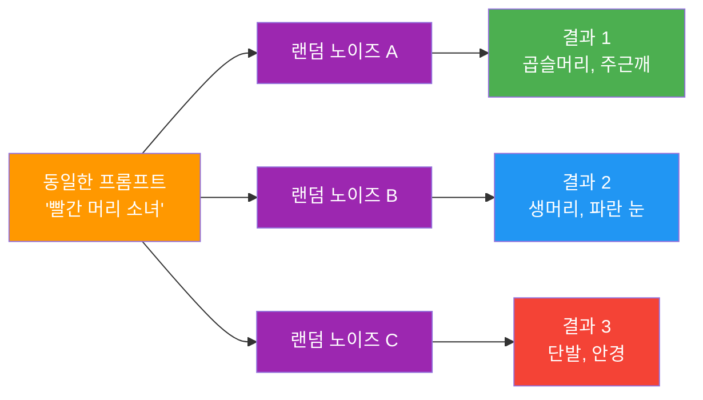
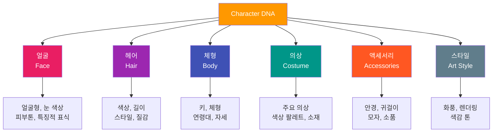
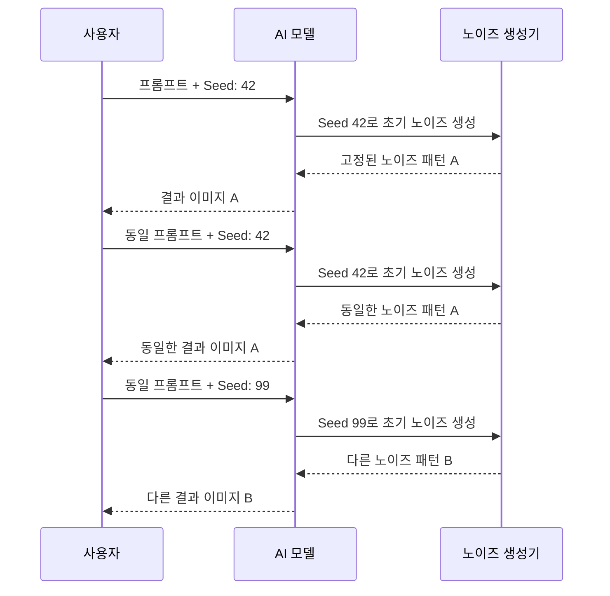
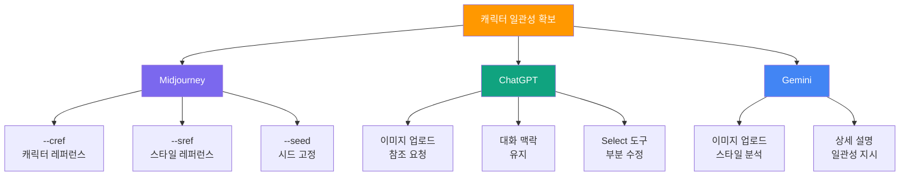
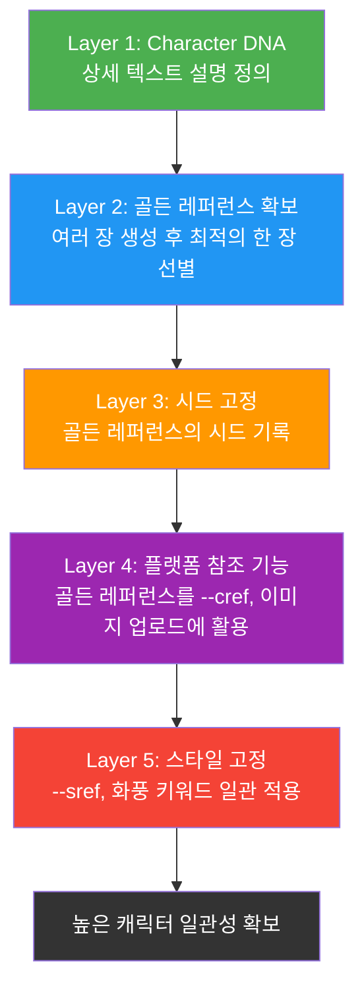

# 캐릭터 일관성의 도전과 전략

> AI 이미지 생성에서 동일한 캐릭터를 여러 장면에 걸쳐 일관되게 유지하는 것이 왜 어렵고, 어떤 전략으로 해결할 수 있는지 알아봅니다.

## 개요

이 섹션에서는 AI 이미지 생성의 가장 큰 난제 중 하나인 **캐릭터 일관성(Character Consistency)** 문제를 다룹니다. 왜 AI는 같은 캐릭터를 두 번 그리기 어려워하는지 그 원리를 이해하고, 프롬프트 기반 전략부터 플랫폼별 참조 기능까지 일관성을 확보하는 핵심 기법들을 학습합니다.

**선수 지식**: 
- [프롬프트 6요소 프레임워크](02-ch2-프롬프트-구조-마스터/01-01-프롬프트-해부학-6요소-프레임워크.md)의 기본 구조
- [Midjourney --sref 스타일 레퍼런스](07-ch7-controlnet과-참조-이미지-활용/04-04-midjourney---sref-스타일-레퍼런스.md) 기초 개념
- [Midjourney --cref 캐릭터 레퍼런스](07-ch7-controlnet과-참조-이미지-활용/05-05-midjourney---cref-캐릭터-레퍼런스.md) 기본 사용법

**학습 목표**:
- AI가 캐릭터 일관성을 유지하기 어려운 구조적 원인을 설명할 수 있다
- 상세 외형 설명(Character DNA) 기법으로 캐릭터를 정의할 수 있다
- 시드(Seed) 값을 활용한 재현성 확보 전략을 이해한다
- 골든 레퍼런스의 개념을 이해하고 이를 기준점으로 활용할 수 있다
- 플랫폼별 참조 기능(--cref, 이미지 업로드 등)을 일관성 유지에 활용할 수 있다

## 왜 알아야 할까?

웹툰 작가가 주인공을 10화에 걸쳐 그린다고 상상해보세요. 매 화마다 머리 색이 바뀌고, 얼굴형이 달라지고, 키가 들쭉날쭉하다면 독자는 혼란에 빠질 겁니다. 전통 일러스트레이션에서는 작가의 손과 기억이 이 일관성을 보장하지만, AI는 매번 "처음부터" 그리기 때문에 이 문제가 훨씬 심각합니다.

실무에서 캐릭터 일관성이 필요한 상황은 아주 많습니다:
- **브랜드 마스코트**: SNS 콘텐츠, 광고, 굿즈에 걸쳐 동일한 캐릭터 사용
- **동화책/웹툰**: 여러 장면에서 주인공이 같은 인물로 인식되어야 함
- **마케팅 캠페인**: 시리즈 광고에서 캐릭터가 브랜드 아이덴티티를 대표
- **교육 콘텐츠**: 튜토리얼 시리즈의 가이드 캐릭터

이번 챕터 전체를 관통하는 핵심 질문은 하나입니다: **"AI에게 '같은 캐릭터'라는 개념을 어떻게 전달할 수 있을까?"** 이 첫 번째 섹션에서 그 도전의 본질과 기본 전략을 확실히 잡아두면, 이후의 캐릭터 시트, 브랜드 가이드, 시리즈 제작이 훨씬 수월해집니다.

## 핵심 개념

### 개념 1: AI가 캐릭터를 "기억"하지 못하는 이유

> 💡 **비유**: 매번 다른 화가에게 같은 인물화를 주문하는 상황을 떠올려보세요. 첫 번째 화가는 갈색 머리에 둥근 얼굴로, 두 번째 화가는 검은 머리에 각진 얼굴로 그립니다. 각 화가에게 "귀여운 여자아이"라고만 말했기 때문이죠. AI 이미지 생성도 정확히 이런 상황입니다 — 매번 새로운 "화가"가 그리는 셈이거든요.

AI 이미지 생성 모델은 본질적으로 **확률 기반**으로 작동합니다. "빨간 머리 소녀"라는 프롬프트를 받으면, 학습 데이터에서 "빨간 머리"와 "소녀"의 패턴을 조합하여 이미지를 만드는데, 이 조합 과정에 **랜덤 노이즈(Random Noise)**가 개입합니다. 같은 프롬프트로도 매번 다른 초기 노이즈에서 시작하기 때문에 결과가 달라지는 거죠.

> 📊 **그림 1**: AI 이미지 생성의 랜덤성 — 같은 프롬프트, 다른 결과

일관성이 깨지는 주요 원인을 정리하면 이렇습니다:

| 원인 | 설명 | 예시 |
|------|------|------|
| **랜덤 초기 노이즈** | 매 생성마다 다른 시작점 | 같은 프롬프트에서 완전히 다른 얼굴 |
| **프롬프트 모호성** | "귀여운 소녀"는 해석 범위가 넓음 | 헤어스타일, 체형, 의상이 제각각 |
| **세션 독립성** | AI에 "이전 그림" 기억 없음 | 2번째 생성 시 1번째와 무관한 결과 |
| **스타일 불확정성** | 화풍이 매번 미세하게 변동 | 수채화풍 → 유화풍으로 변동 |

> ⚠️ **흔한 오해**: "같은 프롬프트를 쓰면 비슷한 결과가 나올 것이다" — 실제로는 프롬프트가 동일해도 시드 값이 다르면 완전히 다른 이미지가 생성됩니다. AI에게 프롬프트는 "방향"일 뿐, "설계도"가 아닙니다.

### 개념 2: Character DNA — 상세 외형 설명 전략

> 💡 **비유**: 경찰이 목격자에게 범인의 인상착의를 물을 때 "평범한 남자"라고 하면 수사가 불가능하지만, "175cm, 검은 단발, 각진 턱, 왼쪽 볼에 점, 남색 후드티"라고 하면 정확한 몽타주를 그릴 수 있죠. AI에게도 이렇게 구체적인 "몽타주"를 제공해야 합니다.

**Character DNA(캐릭터 DNA)**란 캐릭터의 시각적 특성을 체계적으로 정의한 텍스트 설명입니다. 이 설명을 매 프롬프트마다 일관되게 포함하면, AI가 비슷한 결과를 생성할 확률이 크게 높아집니다.

> 📊 **그림 2**: Character DNA 구성 요소

**Character DNA 작성 예시:**

좋지 않은 프롬프트:
> "귀여운 여자 캐릭터가 카페에서 커피를 마시고 있다"

Character DNA가 적용된 프롬프트:
> "**Luna** — 20대 초반 여성, 연보라색 웨이브 단발(어깨 길이), 큰 보라색 눈, 둥근 얼굴형, 작은 코, 왼쪽 귀에 별 모양 귀걸이, 흰색 터틀넥 니트와 라벤더 오버사이즈 가디건 착용, 항상 들고 다니는 고양이 파우치. **스타일: 파스텔 톤 애니메이션, 부드러운 셀 셰이딩**. 카페에서 커피를 마시며 창밖을 바라보고 있다"

핵심은 **변하지 않는 요소**와 **변할 수 있는 요소**를 구분하는 것입니다:

| 구분 | 요소 | 예시 |
|------|------|------|
| **고정 요소** (항상 포함) | 얼굴, 헤어, 체형, 고유 특징 | 보라색 웨이브 단발, 별 귀걸이 |
| **반고정 요소** (대부분 유지) | 기본 의상, 색상 팔레트 | 라벤더 계열 의상 |
| **가변 요소** (장면마다 변경) | 포즈, 표정, 배경, 소품 | 카페, 공원, 도서관 |

Character DNA를 한번 정의해두면, 이후 모든 장면에서 고정 요소를 복사-붙여넣기 하고 가변 요소만 바꾸면 됩니다. 이 접근법은 ChatGPT, Gemini, Midjourney 등 **모든 플랫폼에서 공통으로 사용** 가능하다는 것이 가장 큰 장점이에요.

### 개념 3: 시드(Seed) — 랜덤성을 길들이는 숫자

> 💡 **비유**: 시드는 마치 "레시피 번호"와 같습니다. 같은 재료(프롬프트)에 같은 레시피 번호(시드)를 사용하면 같은 요리(이미지)가 나오는 원리죠. 레시피 번호를 바꾸면 같은 재료로도 전혀 다른 요리가 탄생합니다.

**시드(Seed)**는 AI 이미지 생성의 랜덤 노이즈를 결정하는 숫자 값입니다. 동일한 프롬프트 + 동일한 시드 = 동일한(또는 매우 유사한) 결과가 나옵니다. 이 원리를 활용하면 캐릭터의 기본 형태를 "고정"할 수 있습니다.

> 📊 **그림 3**: 시드 값에 따른 이미지 생성 과정

**플랫폼별 시드 활용법:**

| 플랫폼 | 시드 사용법 | 재현성 |
|--------|-----------|--------|
| **Midjourney** | `--seed 12345` 파라미터 추가 | 높음 (같은 버전 내) |
| **ChatGPT** | 대화 맥락으로 간접 제어 | 제한적 (시드 직접 제어 불가) |
| **Stable Diffusion** | Seed 필드에 숫자 입력 | 매우 높음 |

시드의 한계도 알아야 합니다. 시드가 완벽한 복제를 보장하는 것은 아닙니다:
- **모델 업데이트** 시 같은 시드라도 결과가 달라질 수 있음
- **프롬프트를 조금만 변경**해도 결과가 크게 바뀔 수 있음
- **플랫폼 간 호환 불가** — Midjourney의 시드를 Stable Diffusion에 쓸 수 없음

그래서 시드는 "캐릭터 일관성의 보조 도구"이지, 이것만으로 완벽한 일관성을 기대하기는 어렵습니다. Character DNA와 함께 사용할 때 진가를 발휘하죠.

### 개념 4: 플랫폼별 참조 기능 활용

각 AI 플랫폼은 캐릭터 일관성을 위한 고유한 기능을 제공합니다. 이 기능들을 적절히 조합하면 프롬프트만으로는 달성하기 어려운 수준의 일관성을 확보할 수 있습니다.

> 📊 **그림 4**: 플랫폼별 캐릭터 일관성 도구 비교

**Midjourney --cref (Character Reference)**

[Ch7에서 배운](07-ch7-controlnet과-참조-이미지-활용/05-05-midjourney---cref-캐릭터-레퍼런스.md) `--cref` 파라미터는 캐릭터 일관성을 위한 가장 강력한 도구입니다. 참조 이미지에서 얼굴 특징, 헤어스타일, 의상까지 분석하여 새 이미지에 적용합니다.

핵심 사용 전략:
- **--cw (Character Weight)**: 0~100 범위로 참조 강도 조절. `--cw 100`은 얼굴+헤어+의상 모두 복제, `--cw 0`은 얼굴만 집중
- **실전 팁**: `--cw 60~85` 정도가 자연스러운 균형점 — 캐릭터는 유지하되 장면에 맞게 유연하게 변형
- **참조 이미지 품질이 핵심**: 단일 인물, 정면, 좋은 조명의 이미지가 최적
- **--sref와 조합**: `--cref`로 "누구"를, `--sref`로 "어떤 스타일로"를 분리 제어

**ChatGPT 이미지 생성**

ChatGPT는 전용 참조 파라미터 없이 **대화형 접근**으로 일관성을 유지합니다:
- **이미지 업로드 후 참조 지시**: "이 캐릭터와 동일한 인물을 다른 장면에서 그려줘"
- **같은 대화 세션 유지**: 세션 내에서 이전 이미지의 맥락을 기억
- **점진적 수정**: 한 번에 큰 변화 대신 작은 조정을 반복
- **Character DNA 텍스트 제공**: 상세 설명을 대화 초반에 제시하고 반복 참조

**Gemini**

Gemini는 이미지 업로드와 상세한 텍스트 지시를 조합하여 일관성을 추구합니다. 스타일 분석 능력이 뛰어나 "이 이미지와 같은 스타일로"라는 지시가 효과적입니다.

> 🔥 **실무 팁**: 하나의 캐릭터를 여러 플랫폼에서 사용해야 할 때는 **Midjourney에서 --cref로 기본 이미지를 확립**한 뒤, 그 이미지를 ChatGPT나 Gemini에 업로드하여 참조하는 **크로스 플랫폼 전략**이 효과적입니다.

### 개념 5: 골든 레퍼런스와 통합 일관성 전략

지금까지 배운 기법들을 개별적으로 쓰는 것보다 **층층이 쌓아 올리는(Layered)** 접근이 훨씬 효과적입니다. 이 전략의 핵심에는 **골든 레퍼런스(Golden Reference)**라는 개념이 있습니다.

**골든 레퍼런스**란, 시리즈 전체의 기준이 되는 **가장 이상적인 캐릭터 이미지**를 말합니다. Character DNA를 바탕으로 여러 장의 이미지를 생성한 뒤, 캐릭터의 외형·비율·분위기가 가장 완벽하게 구현된 한 장을 골라 "이것이 이 캐릭터의 공식 모습이다"라고 확정하는 것이죠. 마치 애니메이션 스튜디오에서 캐릭터의 **공식 설정화**를 확정하는 것과 같은 원리입니다. 이후 모든 이미지 생성은 이 골든 레퍼런스를 기준점으로 삼아 진행됩니다.

> 📊 **그림 5**: 골든 레퍼런스 기반 레이어드 일관성 전략

**실전 워크플로우:**

1. **Character DNA 작성** → 캐릭터의 모든 시각적 특성을 텍스트로 정의
2. **골든 레퍼런스 선정** → DNA를 기반으로 여러 장 생성 후, 가장 이상적인 한 장을 골든 레퍼런스로 확정. 이 이미지가 시리즈 전체의 기준이 됨
3. **시드 기록** → 골든 레퍼런스 이미지의 시드 값 저장 (Midjourney: `/describe` 또는 반응 이모지)
4. **참조 이미지로 등록** → 골든 레퍼런스를 이후 모든 생성의 `--cref` 참조로 활용
5. **스타일 통일** → `--sref`나 스타일 키워드를 매번 동일하게 적용

이 워크플로우의 핵심은 **"골든 레퍼런스를 한 번 확립하고, 계속 참조한다"**는 원칙입니다. 매번 처음부터 만드는 것이 아니라, 확립된 기준점을 반복 활용하는 것이죠. 골든 레퍼런스의 품질이 이후 모든 파생 이미지의 일관성을 좌우하기 때문에, 이 단계에 충분한 시간을 투자하는 것이 중요합니다.

## 실습: 적용해보기

### 활동 1: 나만의 Character DNA 작성하기

아래 템플릿을 활용하여 여러분만의 캐릭터 DNA를 작성해보세요.

**Character DNA 워크시트:**

| 카테고리 | 항목 | 나의 캐릭터 |
|----------|------|------------|
| **이름** | 캐릭터 이름 | (작성) |
| **얼굴** | 얼굴형, 눈 색상/크기, 코, 입, 특별한 표식 | (작성) |
| **헤어** | 색상, 길이, 스타일(웨이브/스트레이트/컬), 앞머리 | (작성) |
| **체형** | 키(상대적), 체형, 연령대 | (작성) |
| **기본 의상** | 상의, 하의, 신발, 색상 팔레트 | (작성) |
| **고유 특징** | 액세서리, 소품, 버릇이 드러나는 요소 | (작성) |
| **화풍** | 아트 스타일, 렌더링 방식, 색감 톤 | (작성) |

### 활동 2: 일관성 테스트 시나리오

작성한 Character DNA로 아래 5개 장면을 생성해보고, 일관성을 비교 분석해보세요:

1. **정면 포즈** — 캐릭터가 정면을 바라보며 서 있는 전신 이미지
2. **카페 장면** — 캐릭터가 카페에서 음료를 마시는 상반신
3. **야외 장면** — 캐릭터가 공원에서 산책하는 전신
4. **감정 변화** — 캐릭터가 놀란 표정을 짓는 클로즈업
5. **다른 의상** — 캐릭터가 정장을 입은 전신 (기본 의상 변경)

**비교 체크리스트:**
- [ ] 얼굴형이 5장 모두 일관되는가?
- [ ] 헤어 색상과 스타일이 유지되는가?
- [ ] 고유 특징(액세서리 등)이 보존되는가?
- [ ] 전체적인 화풍이 통일되는가?
- [ ] 의상 변경 장면에서도 캐릭터 정체성이 유지되는가?

### 토론 질문

- Character DNA에서 가장 중요한 요소 3가지를 꼽는다면? 그 이유는?
- 시드 고정 vs 참조 이미지 사용, 어떤 상황에서 각각이 더 유리할까요?
- "80% 일관성"이면 충분한 경우와 "99% 일관성"이 필요한 경우는 각각 언제일까요?

## 더 깊이 알아보기

### 캐릭터 일관성 문제의 역사 — AI 아트의 오랜 숙제

캐릭터 일관성은 AI 이미지 생성이 등장한 초기부터 커뮤니티의 가장 큰 불만이었습니다. 2022년 Stable Diffusion과 Midjourney가 대중화되었을 때, 사용자들은 금방 이 한계에 부딪혔죠. "AI로 웹툰을 만들겠다"던 열정적인 크리에이터들이 주인공의 얼굴이 매 컷마다 달라지는 현실에 좌절했습니다.

이 문제를 해결하기 위한 커뮤니티의 노력은 인상적이었습니다. **LoRA(Low-Rank Adaptation)** 파인튜닝을 통해 특정 캐릭터를 학습시키는 방법이 Stable Diffusion 커뮤니티에서 먼저 등장했고, 이는 효과적이었지만 기술적 장벽이 높았습니다. 수십~수백 장의 학습 이미지가 필요했고, GPU와 시간도 상당히 소모되었죠.

전환점은 2024년 초, Midjourney가 `--cref` 파라미터를 도입하면서 찾아왔습니다. 참조 이미지 한 장만으로 캐릭터의 핵심 특성을 전달할 수 있게 된 것입니다. 이전에는 LoRA 학습에 몇 시간이 걸리던 작업을 파라미터 하나로 해결할 수 있게 된 셈이죠. 이후 ChatGPT의 GPT-4o 이미지 생성도 대화 맥락 기반의 일관성 유지를 강화하며, 캐릭터 일관성의 접근성이 크게 향상되었습니다.

> 💡 **알고 계셨나요?**: Midjourney의 `--cref` 기능이 출시되었을 때, 커뮤니티에서는 "드디어 AI 웹툰 시대가 열렸다"는 반응이 폭발적이었습니다. 출시 첫 주에 관련 Discord 채널의 게시물이 평소의 5배 이상 증가했다고 합니다. 그만큼 캐릭터 일관성은 크리에이터들이 간절히 원하던 기능이었던 거죠.

### "시드"라는 이름의 유래

시드(Seed)라는 용어는 컴퓨터 과학의 **의사난수 생성기(Pseudo-Random Number Generator, PRNG)**에서 유래했습니다. 식물의 씨앗(Seed)이 특정 식물로 자라나듯, 숫자 하나가 특정한 난수 시퀀스 전체를 결정한다는 비유에서 이름이 붙었습니다. 1940년대 존 폰 노이만이 최초의 의사난수 생성 알고리즘을 고안한 이래로 사용된 유서 깊은 개념이, 이제 AI 아트의 핵심 도구가 된 것은 꽤 흥미로운 역사적 연결이에요.

## 흔한 오해와 팁

> ⚠️ **흔한 오해**: "--cref만 쓰면 100% 동일한 캐릭터가 나온다" — `--cref`는 강력하지만 완벽하지 않습니다. 참조 이미지의 품질, 프롬프트의 구체성, --cw 값에 따라 결과가 크게 달라집니다. 특히 복잡한 포즈 변화나 극단적인 앵글 변경 시 일관성이 떨어질 수 있어요. Character DNA 텍스트와 반드시 함께 사용하세요.

> 💡 **알고 계셨나요?**: ChatGPT의 GPT-4o 모델은 이미지 생성이 모델 내부에 통합(native)되어 있어, 대화 맥락을 자연스럽게 활용할 수 있습니다. 같은 대화 세션 내에서 "아까 그 캐릭터를 다른 장면에 넣어줘"라고 하면, 이전 생성 결과의 맥락을 참고하여 유사한 캐릭터를 만들어주죠. 별도의 파라미터 없이 "대화"만으로 일관성을 추구할 수 있는 독특한 접근법입니다.

> 🔥 **실무 팁**: 캐릭터 일관성 작업을 시작할 때, 첫 이미지를 만드는 데 전체 시간의 30~40%를 투자하세요. 기준 이미지가 완벽할수록 이후 작업이 기하급수적으로 쉬워집니다. 여러 변형을 생성하고(Midjourney의 경우 V 버튼 활용), 가장 마음에 드는 것을 **골든 레퍼런스** — 즉 시리즈 전체의 기준이 되는 가장 이상적인 캐릭터 이미지 — 로 확정한 뒤, 이후 모든 작업의 기준점으로 사용하세요. 골든 레퍼런스는 다음 섹션에서 다룰 캐릭터 시트와 턴어라운드의 출발점이 되기도 합니다.

## 핵심 정리

| 개념 | 설명 |
|------|------|
| **캐릭터 일관성의 어려움** | AI는 매번 새로운 랜덤 노이즈에서 시작하므로 같은 프롬프트로도 다른 결과를 생성함 |
| **Character DNA** | 캐릭터의 얼굴, 헤어, 체형, 의상, 고유 특징, 화풍을 체계적으로 텍스트 정의 |
| **시드(Seed)** | 랜덤 노이즈의 시작점을 고정하는 숫자값. 같은 시드 + 같은 프롬프트 = 같은 결과 |
| **골든 레퍼런스** | 시리즈 전체의 기준이 되는 가장 이상적인 캐릭터 이미지. 모든 파생 이미지의 기준점 |
| **--cref / --cw** | Midjourney의 캐릭터 참조 기능. --cw로 참조 강도(0~100) 조절 |
| **대화 맥락 활용** | ChatGPT에서 같은 세션 내 이전 이미지 맥락을 참조하여 일관성 유지 |
| **레이어드 전략** | DNA + 골든 레퍼런스 + 시드 + 플랫폼 기능 + 스타일 고정을 층층이 적용 |

## 다음 섹션 미리보기

Character DNA와 프롬프트 전략으로 캐릭터의 "정체성"을 정의하는 법을 배웠으니, 다음 섹션 [캐릭터 시트와 턴어라운드 제작](08-ch8-캐릭터브랜드-스타일-일관성-유지/02-02-캐릭터-시트와-턴어라운드-제작.md)에서는 이 정체성을 **시각적으로 문서화**하는 방법을 다룹니다. 골든 레퍼런스를 바탕으로 정면·측면·후면을 한 장에 담는 턴어라운드 시트를 만들고, 이를 이후 모든 이미지 생성의 확실한 참조 자료로 활용하는 법을 익혀봅시다.

## 참고 자료

- [Character Consistency in AI: Cohesive IP Design Guide 2025 (Lovart)](https://www.lovart.ai/blog/ai-character-consistency) - AI 캐릭터 일관성의 종합 가이드, IP 디자인 관점에서의 접근법
- [Midjourney Character Reference 공식 문서](https://docs.midjourney.com/hc/en-us/articles/32162917505293-Character-Reference) - --cref 파라미터의 공식 사용법과 --cw 설정 가이드
- [How to Create Consistent Characters in Midjourney (Aiarty)](https://www.aiarty.com/midjourney-guide/midjourney-consistent-character.htm) - Midjourney에서 일관된 캐릭터를 만드는 실전 기법 총정리
- [Introducing 4o Image Generation (OpenAI)](https://openai.com/index/introducing-4o-image-generation/) - GPT-4o의 네이티브 이미지 생성 기능과 대화 맥락 기반 일관성
- [Understanding Seeds in AI: The Key to Reproducibility (Medium)](https://medium.com/@nikunj.vaghasiya2050/understanding-seeds-in-ai-the-key-to-reproducibility-and-creativity-edcfd3bf649c) - 시드 값의 원리와 재현성에 대한 상세 설명
- [How to Keep Characters Consistent Across AI Scenes (Skywork)](https://skywork.ai/blog/how-to-consistent-characters-ai-scenes-prompt-patterns-2025/) - 2025년 기준 캐릭터 일관성을 위한 프롬프트 패턴 가이드