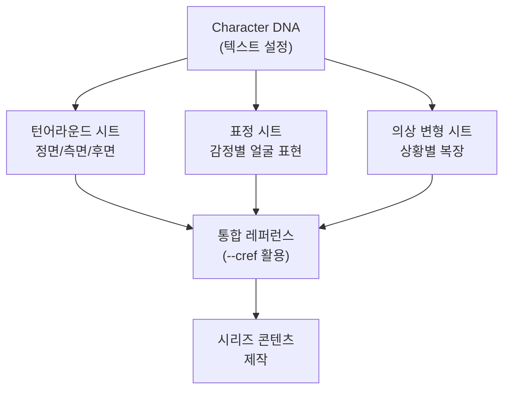
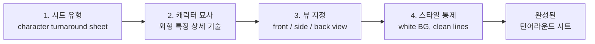
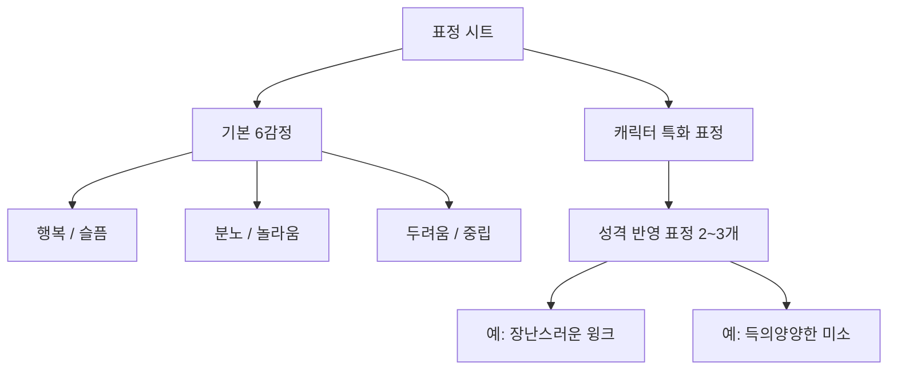

# 캐릭터 시트와 턴어라운드 제작

> Character DNA를 시각적 레퍼런스 시트로 구체화하는 실전 워크플로우

## 개요

텍스트로 정의한 캐릭터 설정을 정면/측면/후면 턴어라운드, 표정 시트, 의상 변형 시트로 만들어 '비주얼 사전'을 완성합니다. 캐릭터 시트는 처음 1시간의 투자로, 이후 수십 장의 이미지에서 일관성 유지 시간을 극적으로 줄여주는 핵심 자산입니다.

## 캐릭터 시트의 종류와 역할

> 캐릭터 시트는 AI에게 보여주는 캐릭터의 여권입니다. 정면 사진, 신체 정보, 특이사항이 기록된 여권처럼, 세계 어디서든 '이 캐릭터가 맞다'고 확인할 수 있게 해줍니다.

캐릭터 시트는 하나의 캐릭터를 다양한 각도, 표정, 상황에서 보여주는 참조 이미지 모음입니다.

- **턴어라운드 시트**: 정면, 3/4 측면, 측면, 후면 등 여러 각도에서 캐릭터의 실루엣과 비율을 확인
- **표정 시트**: 기쁨, 슬픔, 분노, 놀라움 등 핵심 감정 표현을 정리하여 스토리텔링 일관성 확보
- **의상 변형 시트**: 일상복, 정장, 계절별 복장 등 상황별 의상을 미리 정의



## 턴어라운드 시트 프롬프트 설계

턴어라운드 시트 프롬프트는 4가지 레이어로 구성됩니다.

1. **시트 유형 선언**: "character turnaround sheet", "multiple views"
2. **캐릭터 묘사**: Character DNA 기반 외형 특징
3. **뷰 지정**: "front view, three-quarter view, side view, back view"
4. **스타일/배경 통제**: "white background", "clean lines", "consistent lighting"



**플랫폼별 접근법 비교**:

| 요소 | Midjourney | ChatGPT | Gemini |
|------|-----------|---------|--------|
| 키워드 | "character turnaround sheet" + --ar 16:9 | 대화로 "정면, 측면, 후면을 한 장에" 요청 | "캐릭터 시트를 만들어줘" 자연어 요청 |
| 강점 | 시각적 퀄리티, --cref 연동 | 반복 수정 용이, 맥락 유지 | 자연어 이해력, 무료 접근성 |
| 주의점 | 각도별 분리가 안 될 수 있음 | 캐릭터 변형 가능성 | 스타일 일관성 약함 |
| 추천 비율 | --ar 16:9 또는 --ar 3:2 | 가로형 요청 | 가로형 요청 |

**Midjourney 턴어라운드 프롬프트**:

```
character turnaround sheet, young woman with shoulder-length dark blue hair, amber eyes, round face, wearing white lab coat over teal turtleneck, front view, three-quarter view, side view, back view, white background, clean lines, full body, concept art style --ar 16:9 --s 200
```


**ChatGPT 턴어라운드 프롬프트**:

```
다음 캐릭터의 턴어라운드 시트를 한 장에 그려줘. 정면, 3/4 측면, 측면, 후면 총 4개 뷰를 왼쪽에서 오른쪽으로 배치하고, 흰색 배경에 깔끔한 라인으로.
캐릭터: 어깨 길이 짙은 파란 머리, 호박색 눈, 둥근 얼굴, 흰색 실험복 안에 틸 터틀넥
```

**각도별 개별 생성 프롬프트 (Midjourney)**:

```
character design, young woman with shoulder-length dark blue hair, amber eyes, round face, wearing white lab coat, side view, full body, white background, concept art --cref [골든 레퍼런스 URL] --ar 2:3 --s 150
```

```
character design, young woman with shoulder-length dark blue hair, amber eyes, round face, wearing white lab coat, back view, full body, white background, concept art --cref [골든 레퍼런스 URL] --ar 2:3 --s 150
```


## 표정 시트와 의상 변형 시트

### 표정 시트

기본 6가지 감정(행복, 슬픔, 분노, 놀라움, 두려움, 중립)에 캐릭터 성격에 맞는 특화 표정 2~3개를 추가합니다.



**Midjourney 표정 시트 프롬프트**:

```
expression sheet, young woman with dark blue hair and amber eyes, multiple facial expressions, happy, sad, angry, surprised, neutral, mischievous wink, white background, portrait close-up, 2 rows of 3 --ar 3:2 --s 150
```


**ChatGPT 표정 시트 프롬프트**:

```
이 캐릭터의 표정 시트를 그려줘. 2행 3열로 배치하고, 얼굴 클로즈업으로. 감정: 행복, 슬픔, 분노, 놀라움, 중립, 장난스러운 윙크. 흰색 배경, 깔끔한 라인.
```

표정 시트에서는 **close-up** 키워드가 중요합니다. 전신이 나오면 표정이 작게 보여서 레퍼런스로서의 가치가 떨어집니다.

### 의상 변형 시트

의상 변형의 핵심은 **--cw 파라미터**(Character Weight)입니다.

| --cw 값 | 효과 | 용도 |
|---------|------|------|
| --cw 100 (기본값) | 얼굴 + 머리 + 의상 모두 유지 | 동일 의상으로 장면만 바꿀 때 |
| --cw 50 | 얼굴 + 머리 유지, 의상 부분 변경 | 유사 스타일 의상 변형 |
| --cw 0 | 얼굴만 유지, 머리/의상 자유 변경 | 완전히 다른 의상/스타일 |

**의상 변형 프롬프트 (Midjourney)**:

```
character design, young woman with dark blue hair and amber eyes, wearing casual summer outfit, yellow sundress, sandals, full body, white background, concept art --cref [골든 레퍼런스 URL] --cw 0 --ar 2:3
```

```
character design, young woman with dark blue hair and amber eyes, wearing formal business suit, navy blazer, pencil skirt, full body, white background, concept art --cref [골든 레퍼런스 URL] --cw 0 --ar 2:3
```


## 골든 레퍼런스에서 시트까지 — 워크플로우

캐릭터 시트는 5단계로 순차 진행합니다. 한 번에 모든 시트를 만들려 하면 품질이 떨어집니다.

**Step 1 — 골든 레퍼런스 생성**: 2:3 세로 비율, 단일 캐릭터, 심플 포즈, 단색 배경으로 완벽한 정면 이미지를 만듭니다.

```
character design, young woman with shoulder-length dark blue hair, amber eyes, round face, wearing white lab coat over teal turtleneck, standing neutral pose, full body, front view, white background, clean lines, concept art style --ar 2:3 --s 150
```


**Step 2 — 턴어라운드 시트**: 골든 레퍼런스를 --cref로 참조하며 각도별로 따로 생성합니다. 한 장에 모든 뷰를 넣는 것보다 각도별 개별 생성이 품질이 더 높습니다.

**Step 3 — 표정 시트**: --cref + --cw 100으로 얼굴을 유지하면서 감정 키워드로 표정만 변경합니다.

**Step 4 — 의상 변형 시트**: --cw 0으로 전환하여 얼굴만 유지하고 새 의상을 기술합니다.

**Step 5 — 검증**: 생성된 시트를 나란히 놓고 얼굴 특징, 머리카락, 체형이 일관되는지 확인합니다.

## 실습: 적용해보기

### 실습 1: 골든 레퍼런스 만들기

아래 템플릿을 채운 후 실제 프롬프트를 작성해보세요.

| 항목 | 내용 |
|------|------|
| 캐릭터 이름 | |
| 핵심 외형 특징 3가지 | 1. / 2. / 3. |
| 시그니처 색상 | |
| 성격 키워드 | |

작성 후 아래 두 프롬프트를 비교해보세요.

**프롬프트 A**:
```
cute girl character, anime style
```

**프롬프트 B**:
```
character design, young woman with shoulder-length dark blue hair, amber eyes, round face, wearing a white lab coat over a teal turtleneck, standing in a neutral pose, full body, front view, white background, clean lines, concept art style --ar 2:3 --s 150
```

프롬프트 A는 구체적 외형 정보가 없어 매번 다른 캐릭터가 생성됩니다. 프롬프트 B처럼 "neutral pose"와 "white background"를 포함해야 레퍼런스 활용도가 높아집니다.

### 실습 2: 플랫폼 조합 시트 제작

Midjourney로 골든 레퍼런스와 턴어라운드를, ChatGPT로 표정 시트를 만들어보세요.

```
[ChatGPT] 이 캐릭터 이미지를 참고해서 같은 캐릭터의 표정 시트를 만들어줘. 2행 3열, 얼굴 클로즈업. 감정: 행복, 슬픔, 분노, 놀라움, 중립, 그리고 이 캐릭터만의 특화 표정 하나를 네가 골라서 추가해줘.
```


## 팁과 주의사항

- **각도별 개별 생성 추천**: 한 장에 4개 뷰를 넣으면 각 뷰의 캐릭터가 미묘하게 달라집니다. 따로 생성한 뒤 합치는 방식이 일관성 면에서 안정적입니다.
- **골든 레퍼런스는 단일 캐릭터**: --cref는 참조 이미지에 한 명만 있을 때 가장 잘 작동합니다. 두 명 이상이면 특징이 섞입니다.
- **세로 비율(2:3) 사용**: 세로 구도가 얼굴 특징을 크고 선명하게 담아 --cref 인식률이 높아집니다.
- **--cw 0의 한계**: 얼굴만 고정하면 체형/비율이 달라질 수 있습니다. "same body proportions, same height"을 프롬프트에 추가하세요.
- **stylize 중간 값**: --s 150~200이 시트에 적합합니다. 너무 높으면 과도한 장식이 추가되어 일관성이 깨집니다.

## 핵심 정리

| 개념 | 설명 |
|------|------|
| 턴어라운드 시트 | 캐릭터의 정면/측면/후면을 보여주는 참조 시트. 각도별 실루엣과 비율의 기준 |
| 표정 시트 | 기본 6감정 + 캐릭터 특화 표정을 모아놓은 시트. 스토리텔링의 감정 표현 기준 |
| 의상 변형 시트 | 상황별 복장을 정리한 시트. --cw 0으로 얼굴만 유지하면서 의상 변경 |
| 골든 레퍼런스 | 모든 시트의 출발점이 되는 완벽한 정면 이미지. 2:3 세로 비율, 단일 캐릭터, 심플 배경 |
| --cref / --cw | 캐릭터 참조 파라미터. --cw 100은 전체 유지, --cw 0은 얼굴만 유지 |
| 5단계 워크플로우 | 골든 레퍼런스 -> 턴어라운드 -> 표정 -> 의상 변형 -> 검증 순서로 진행 |

## 다음 섹션 미리보기

다음에 배울 [브랜드 스타일 가이드 구축](08-ch8-캐릭터브랜드-스타일-일관성-유지/03-03-브랜드-스타일-가이드-구축.md)에서는 캐릭터를 넘어 색상 팔레트, 타이포그래피, 레이아웃 규칙까지 통합 관리하는 프로젝트 전체의 비주얼 가이드를 구축합니다.
