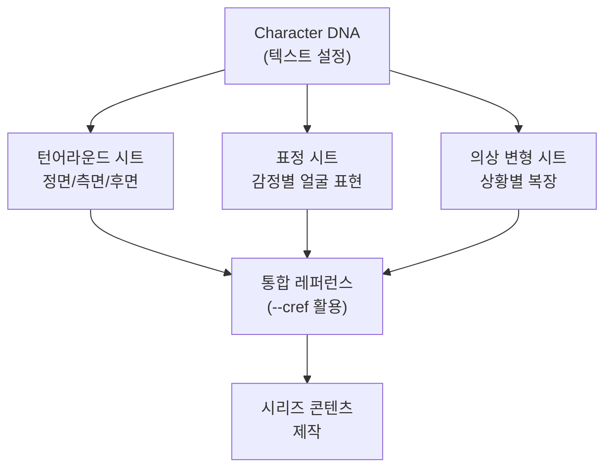
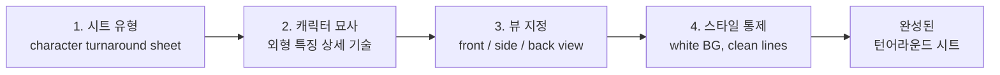
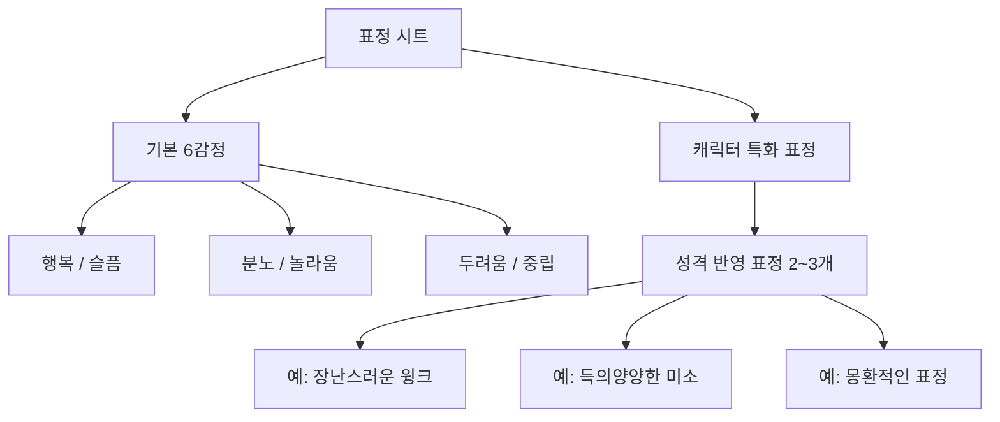
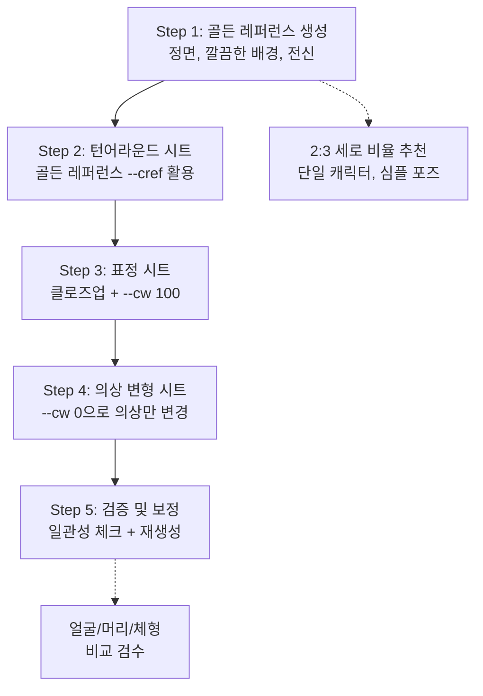
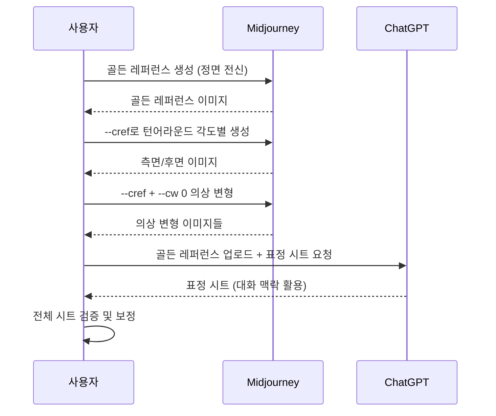

# 캐릭터 시트와 턴어라운드 제작

> AI로 캐릭터의 정면·측면·후면 시트를 만들고, 표정과 의상 변형까지 체계적으로 문서화하는 실전 가이드

## 개요

이 섹션에서는 [이전 섹션](08-ch8-캐릭터브랜드-스타일-일관성-유지/01-01-캐릭터-일관성의-도전과-전략.md)에서 작성한 Character DNA를 **시각적 레퍼런스 시트**로 구체화합니다. 텍스트로만 존재하던 캐릭터 설정을 정면·측면·후면 턴어라운드, 표정 시트, 의상 변형 시트로 만들어 누구나 참고할 수 있는 '비주얼 사전'을 완성하는 과정을 배웁니다.

**선수 지식**: Character DNA 작성법 ([이전 섹션](08-ch8-캐릭터브랜드-스타일-일관성-유지/01-01-캐릭터-일관성의-도전과-전략.md) 참조), --cref/--cw 파라미터 기본 개념 ([ChatGPT-Midjourney 연동 전략](07-ch7-멀티-플랫폼-워크플로우와-도구-통합/02-02-chatgpt-midjourney-연동-전략.md)에서 학습한 --cref 캐릭터 레퍼런스 참조)

**학습 목표**:
- 캐릭터 턴어라운드 시트(정면/측면/후면)를 생성하는 프롬프트를 작성할 수 있다
- 표정 시트와 의상 변형 시트를 제작할 수 있다
- 생성된 시트를 --cref 레퍼런스로 활용하는 실전 워크플로우를 구축할 수 있다

## 왜 알아야 할까?

캐릭터를 한 장의 멋진 그림으로 만드는 것은 어렵지 않습니다. 하지만 그 캐릭터가 옆을 보고, 뒤를 돌고, 웃고, 화내고, 다른 옷을 입었을 때도 **'같은 사람'**으로 보여야 한다면요? 이건 완전히 다른 차원의 문제입니다.

전통적으로 애니메이션 스튜디오나 게임 회사에서는 캐릭터 시트(Character Sheet)를 먼저 만들고 나서야 본격적인 작업에 들어갔습니다. 디즈니에서 픽사까지, 모든 캐릭터는 수십 장의 레퍼런스 시트를 거쳐 탄생했거든요. AI 이미지 생성에서도 마찬가지입니다. 캐릭터 시트 없이 시리즈 콘텐츠를 만들면, 매번 "이 캐릭터 맞나?"라는 의문이 생기고, 결국 처음부터 다시 만들게 됩니다.

캐릭터 시트는 **시간을 절약하는 투자**입니다. 처음에 1시간을 들여 시트를 만들어두면, 이후 수십 장의 이미지에서 일관성을 유지하는 데 드는 시간이 극적으로 줄어듭니다.

## 핵심 개념

### 개념 1: 캐릭터 시트의 종류와 역할

> 💡 **비유**: 캐릭터 시트는 여권 사진과 같습니다. 여권에는 정면 사진, 신체 정보, 특이사항이 기록되어 있어서 세계 어디서든 '이 사람이 맞다'고 확인할 수 있죠. 캐릭터 시트는 AI에게 보여주는 캐릭터의 여권입니다.

캐릭터 시트(Character Sheet)는 하나의 캐릭터를 다양한 각도, 표정, 상황에서 보여주는 참조 이미지 모음입니다. 용도에 따라 세 가지 핵심 시트가 있습니다.

**턴어라운드 시트(Turnaround Sheet)**: 캐릭터를 정면, 3/4 측면, 측면, 후면 등 여러 각도에서 보여줍니다. 캐릭터의 전체적인 실루엣과 비율을 확인할 수 있어서, 어떤 각도에서든 일관된 이미지를 만드는 기준이 됩니다.

**표정 시트(Expression Sheet)**: 같은 캐릭터의 다양한 감정 표현을 모아놓은 시트입니다. 기쁨, 슬픔, 분노, 놀라움 등 핵심 감정을 정리해두면, 스토리텔링 콘텐츠에서 캐릭터의 얼굴이 매번 달라지는 문제를 방지합니다.

**의상 변형 시트(Costume Variation Sheet)**: 캐릭터의 다양한 복장을 보여주는 시트입니다. 일상복, 정장, 계절별 옷차림 등을 미리 정의해두면, 상황에 맞는 의상을 입힌 이미지를 일관되게 만들 수 있습니다.

> 📊 **그림 1**: 캐릭터 시트의 세 가지 유형과 역할

각 시트는 독립적으로도 유용하지만, 세 가지를 함께 갖추면 캐릭터의 '완전한 비주얼 사전'이 완성됩니다. 이 사전이 있으면 어떤 장면이든 일관된 캐릭터를 만들 수 있죠.

---

### 개념 2: 턴어라운드 시트 프롬프트 설계

> 💡 **비유**: 턴어라운드 시트를 만드는 건 캐릭터에게 "제자리에서 천천히 한 바퀴 돌아봐"라고 요청하는 것과 같습니다. 카메라는 고정하고, 캐릭터만 회전시켜 모든 면을 기록하는 거죠.

턴어라운드 시트를 AI로 생성할 때는 프롬프트에 몇 가지 핵심 요소를 반드시 포함해야 합니다.

**프롬프트 구조의 4가지 레이어**:

1. **시트 유형 선언**: "character turnaround sheet", "character reference sheet", "multiple views" 같은 키워드로 AI에게 시트 형태를 요청
2. **캐릭터 묘사**: Character DNA에서 정의한 외형 특징을 상세히 기술
3. **뷰 지정**: "front view, three-quarter view, side view, back view"처럼 원하는 각도를 명시
4. **스타일/배경 통제**: "white background", "clean lines", "consistent lighting"으로 시트의 깔끔함 확보

> 📊 **그림 2**: 턴어라운드 시트 프롬프트의 4단계 레이어 구조

**플랫폼별 접근법 비교**:

| 요소 | Midjourney | ChatGPT | Gemini |
|------|-----------|---------|--------|
| 키워드 | "character turnaround sheet" + --ar 16:9 | 대화로 "정면, 측면, 후면을 한 장에" 요청 | "캐릭터 시트를 만들어줘" 자연어 요청 |
| 강점 | 시각적 퀄리티, --cref 연동 | 반복 수정 용이, 맥락 유지 | 자연어 이해력, 무료 접근성 |
| 주의점 | 각도별 분리가 안 될 수 있음 | 캐릭터 변형 가능성 | 스타일 일관성 약함 |
| 추천 비율 | --ar 16:9 또는 --ar 3:2 | 가로형 요청 | 가로형 요청 |

**Midjourney 턴어라운드 프롬프트 예시**:

> character turnaround sheet, [캐릭터 묘사], front view, three-quarter view, side view, back view, white background, clean lines, full body, concept art style --ar 16:9 --s 200

여기서 `--s 200` (stylize)을 중간 정도로 설정하는 이유가 있습니다. 너무 낮으면 밋밋하고, 너무 높으면 AI가 과도한 장식을 추가해서 각도별 일관성이 깨질 수 있거든요. [스타일라이즈 파라미터](05-ch5-midjourney-기본과-파라미터-튜닝/03-03-스타일라이즈--stylize와-미학-제어.md)에서 배운 것처럼, 레퍼런스 시트에는 중간 값이 적합합니다.

**ChatGPT 턴어라운드 프롬프트 예시**:

> "다음 캐릭터의 턴어라운드 시트를 한 장에 그려줘. 정면, 3/4 측면, 측면, 후면 총 4개 뷰를 왼쪽에서 오른쪽으로 배치하고, 흰색 배경에 깔끔한 라인으로. 캐릭터: [Character DNA 설명]"

ChatGPT는 대화 맥락을 기억하므로, 첫 결과가 마음에 들지 않으면 "측면 뷰의 머리카락 길이를 좀 더 길게"처럼 자연스럽게 수정 요청이 가능합니다.

---

### 개념 3: 표정 시트와 의상 변형 시트

> 💡 **비유**: 표정 시트는 배우의 오디션 테이프와 같습니다. 배우가 희노애락을 연기하는 모습을 미리 찍어두면, 감독은 어떤 장면에 캐스팅할지 바로 판단할 수 있죠. AI 캐릭터도 마찬가지로, 표정 레퍼런스가 있으면 원하는 감정을 정확하게 표현할 수 있습니다.

**표정 시트 핵심 구성**:

기본 6가지 감정(행복, 슬픔, 분노, 놀라움, 두려움, 중립)을 포함하되, 캐릭터의 성격에 맞는 특화 표정을 2~3개 추가하는 것이 좋습니다. 예를 들어 장난기 많은 캐릭터라면 "장난스러운 윙크", "득의양양한 미소" 같은 표정을 추가하면 캐릭터성이 더 살아납니다.

> 📊 **그림 3**: 표정 시트 구성 — 기본 감정 + 특화 표정

**표정 시트 프롬프트 패턴**:

> expression sheet, [캐릭터 묘사], multiple facial expressions, happy, sad, angry, surprised, neutral, mischievous, white background, portrait close-up, 2 rows of 3 --ar 3:2

표정 시트에서는 **클로즈업(close-up)** 키워드가 중요합니다. 전신이 나오면 표정이 작게 보여서 레퍼런스로서의 가치가 떨어지거든요.

**의상 변형 시트 제작 전략**:

의상 변형은 **--cw 파라미터**를 활용하는 것이 핵심입니다. --cw는 Character Weight의 약자로, 0~100 사이의 값을 지정할 수 있습니다.

| --cw 값 | 효과 | 용도 |
|---------|------|------|
| --cw 100 (기본값) | 얼굴 + 머리 + 의상 모두 유지 | 동일 의상으로 장면만 바꿀 때 |
| --cw 50 | 얼굴 + 머리 유지, 의상 부분 변경 | 유사 스타일 의상 변형 |
| --cw 0 | 얼굴만 유지, 머리·의상 자유 변경 | 완전히 다른 의상/스타일 |

의상을 바꾸고 싶을 때는 `--cw 0`으로 설정하고, 프롬프트에 새 의상을 상세히 기술하면 됩니다. 이렇게 하면 얼굴은 동일하게 유지하면서 의상만 자유롭게 바꿀 수 있죠.

**의상 변형 시트 프롬프트 예시 (Midjourney)**:

> [캐릭터 묘사 - 얼굴 특징만], wearing [새 의상 묘사], full body, white background, concept art --cref [골든 레퍼런스 URL] --cw 0 --ar 2:3

---

### 개념 4: 골든 레퍼런스에서 시트까지 — 워크플로우

> 💡 **비유**: 요리 레시피를 생각해보세요. 맛있는 요리를 하려면 '기본 육수'를 먼저 만들고, 그 육수를 기반으로 다양한 요리를 파생시키죠. 골든 레퍼런스는 이 '기본 육수'와 같습니다. 하나의 완벽한 정면 이미지에서 모든 시트가 파생됩니다.

실제로 캐릭터 시트를 만드는 과정은 단계적으로 진행해야 합니다. 한 번에 모든 시트를 만들려고 하면 품질이 떨어지거든요.

> 📊 **그림 4**: 캐릭터 시트 제작 5단계 워크플로우

**Step 1 — 골든 레퍼런스 생성**: 가장 중요한 단계입니다. 이 한 장이 이후 모든 시트의 기준이 되므로, 충분한 시간을 들여 완벽에 가까운 정면 이미지를 만들어야 합니다. 포인트는 2:3 세로 비율로 단일 캐릭터를 심플한 포즈로 생성하는 것입니다. 배경은 단색(흰색 또는 밝은 회색)이 가장 좋습니다.

**Step 2 — 턴어라운드 시트**: 골든 레퍼런스를 --cref로 참조하면서, "같은 캐릭터의 측면 뷰", "같은 캐릭터의 후면 뷰"를 각각 생성합니다. 한 장에 모든 뷰를 넣는 방법과 각도별로 따로 생성하는 방법이 있는데, 따로 생성한 후 합치는 방식이 각 뷰의 품질이 더 높습니다.

**Step 3 — 표정 시트**: 골든 레퍼런스의 얼굴을 --cref + --cw 100으로 유지하면서, 프롬프트에 감정 키워드를 넣어 표정만 바꿉니다.

**Step 4 — 의상 변형 시트**: --cw 0으로 전환하여 얼굴만 유지하고, 프롬프트에 새로운 의상을 기술합니다.

**Step 5 — 검증**: 생성된 시트들을 나란히 놓고, 얼굴 특징(눈 모양, 코, 턱선), 머리카락(색상, 길이, 스타일), 체형(비율, 키)이 일관되는지 확인합니다. 차이가 나는 부분이 있으면 해당 뷰만 재생성합니다.

> 📊 **그림 5**: 플랫폼별 시트 제작 시퀀스

이 워크플로우에서 주목할 점은, **Midjourney와 ChatGPT를 조합**해서 사용한다는 것입니다. 턴어라운드와 의상 변형은 --cref가 있는 Midjourney가 강력하고, 표정 시트는 대화로 세밀하게 조정할 수 있는 ChatGPT가 편리합니다. [플랫폼별 특징](01-ch1-ai-이미지-생성-개론/02-02-주요-플랫폼-비교-chatgpt-vs-gemini-vs-midjourney.md)에서 배운 각 플랫폼의 강점을 전략적으로 활용하는 셈이죠.

## 실습: 적용해보기

### 실습 1: 나만의 캐릭터 시트 기획서 작성

아래 워크시트를 채워 캐릭터 시트 제작 계획을 세워보세요.

**캐릭터 기본 정보**:
| 항목 | 내용 |
|------|------|
| 캐릭터 이름 | |
| 연령대/성별 | |
| 핵심 외형 특징 3가지 | 1. / 2. / 3. |
| 시그니처 색상 | |
| 성격 키워드 | |

**턴어라운드 시트 계획**:
| 뷰 | 프롬프트 핵심 키워드 | 비율 |
|----|---------------------|------|
| 정면 (골든 레퍼런스) | | --ar 2:3 |
| 3/4 측면 | | --ar 2:3 |
| 측면 | | --ar 2:3 |
| 후면 | | --ar 2:3 |

**표정 시트 계획**:
| 감정 | 프롬프트 키워드 | 캐릭터 특화 이유 |
|------|---------------|-----------------|
| 기본 6감정 | happy, sad, angry, surprised, fearful, neutral | 필수 |
| 특화 표정 1 | | |
| 특화 표정 2 | | |

### 실습 2: 골든 레퍼런스 프롬프트 작성 & 비교

아래 두 가지 프롬프트를 비교 분석해보세요. 어떤 것이 더 좋은 골든 레퍼런스를 만들 수 있을까요?

**프롬프트 A**: "cute girl character, anime style"

**프롬프트 B**: "character design, young woman with shoulder-length dark blue hair, amber eyes, round face, wearing a white lab coat over a teal turtleneck, standing in a neutral pose, full body, front view, white background, clean lines, concept art style --ar 2:3 --s 150"

**분석 질문**:
1. 프롬프트 A로 골든 레퍼런스를 만들면 어떤 문제가 생길까요?
2. 프롬프트 B에서 "neutral pose"와 "white background"가 중요한 이유는?
3. 프롬프트 B를 ChatGPT 스타일로 바꾼다면 어떻게 작성하시겠습니까?

### 토론 질문

"캐릭터 시트를 만들 때 한 장에 모든 뷰를 넣는 방식과, 각도별로 따로 생성한 후 합치는 방식 중 어떤 것이 더 효과적일까요? 각각의 장단점을 생각해보세요."

## 더 깊이 알아보기

### 모델 시트의 역사 — 디즈니에서 AI까지

캐릭터 모델 시트(Model Sheet)의 역사는 1930년대 디즈니 스튜디오로 거슬러 올라갑니다. 당시 「백설 공주와 일곱 난쟁이」(1937)를 제작하면서 수백 명의 애니메이터가 동일한 캐릭터를 그려야 했는데, 사람마다 그리는 스타일이 달라서 큰 문제가 됐습니다.

디즈니의 수석 애니메이터였던 프레드 무어(Fred Moore)는 미키 마우스의 '표준 도면'을 만들어 모든 애니메이터에게 배포했습니다. 정면, 측면, 3/4 뷰, 다양한 표정과 포즈가 담긴 이 한 장의 시트가 바로 최초의 모델 시트였죠. 이 단순한 아이디어가 이후 모든 애니메이션 스튜디오의 표준 작업 프로세스가 되었습니다.

놀랍게도 90년이 지난 지금, AI 이미지 생성에서도 똑같은 문제를 같은 방식으로 해결하고 있습니다. AI 모델도 '개별 애니메이터'처럼 매번 다르게 그리는 경향이 있고, 이를 통제하기 위해 레퍼런스 시트를 먼저 만드는 거죠. 기술은 완전히 달라졌지만, '일관성을 위한 시각적 기준'이 필요하다는 근본적인 원리는 변하지 않았습니다.

### --cref 탄생 비화

Midjourney의 --cref 파라미터는 2024년 초에 도입되었습니다. 그 전까지는 캐릭터 일관성을 위해 시드 고정, 프롬프트 복사, 이미지 프롬프트 등 다양한 우회 방법을 써야 했는데, 모두 한계가 있었습니다. 사용자 커뮤니티에서 "같은 캐릭터를 다른 장면에 넣고 싶다"는 요청이 폭발적으로 늘어나면서, Midjourney 팀이 이를 공식 기능으로 개발한 것이죠.

--cref가 흥미로운 점은, 참조 이미지에서 캐릭터의 '정체성'을 추출하는 방식이 사람의 인식과 유사하다는 것입니다. 우리가 친구를 알아볼 때 옷이나 헤어스타일이 바뀌어도 얼굴로 알아보는 것처럼, --cw 0으로 설정하면 AI도 얼굴 특징만으로 캐릭터를 식별합니다.

## 흔한 오해와 팁

> ⚠️ **흔한 오해**: "한 장에 4개 뷰가 들어간 턴어라운드 시트를 한 번에 만들면 된다"라고 생각하기 쉽습니다. 하지만 실제로 AI가 한 장에 여러 뷰를 넣으면, 각 뷰의 캐릭터가 미묘하게 달라지는 경우가 많습니다. 각도별로 **따로 생성한 뒤 이미지 편집 도구로 합치는 방식**이 일관성 면에서 훨씬 안정적입니다.

> 💡 **알고 계셨나요?**: Midjourney --cref는 참조 이미지에 한 명의 캐릭터만 있을 때 가장 잘 작동합니다. 두 명 이상이 있으면 특징이 섞여서(blending) 의도치 않은 결과가 나올 수 있어요. 골든 레퍼런스는 반드시 **단일 캐릭터**로 만드세요.

> 🔥 **실무 팁**: 골든 레퍼런스를 만들 때 **세로 비율(2:3 또는 4:5)**을 사용하세요. 세로 구도가 얼굴 특징을 더 크고 선명하게 담아서, 이후 --cref로 참조할 때 인식률이 높아집니다. 가로 구도의 전신 샷은 얼굴이 작아져서 레퍼런스 정확도가 떨어질 수 있습니다.

> 🔥 **실무 팁**: 의상 변형 시트를 만들 때 `--cw 0`이 만능은 아닙니다. 얼굴만 고정하다 보면 체형이나 비율이 달라질 수 있어요. 이럴 때는 프롬프트에 "same body proportions, same height"을 명시적으로 추가하면 도움이 됩니다.

## 핵심 정리

| 개념 | 설명 |
|------|------|
| 턴어라운드 시트 | 캐릭터의 정면/측면/후면을 보여주는 참조 시트. 각도별 실루엣과 비율의 기준 |
| 표정 시트 | 기본 6감정 + 캐릭터 특화 표정을 모아놓은 시트. 스토리텔링의 감정 표현 기준 |
| 의상 변형 시트 | 상황별 복장을 정리한 시트. --cw 0으로 얼굴만 유지하면서 의상 변경 |
| 골든 레퍼런스 | 모든 시트의 출발점이 되는 완벽한 정면 이미지. 2:3 세로 비율, 단일 캐릭터, 심플 배경 |
| --cref | Midjourney의 캐릭터 참조 파라미터. 이전 이미지의 캐릭터를 새 이미지에 유지 |
| --cw (0~100) | 캐릭터 참조 강도. 100은 전체 유지, 0은 얼굴만 유지 |
| 5단계 워크플로우 | 골든 레퍼런스 → 턴어라운드 → 표정 → 의상 변형 → 검증 순서로 진행 |

## 다음 섹션 미리보기

캐릭터 시트가 개별 캐릭터의 '여권'이라면, 다음에 배울 [브랜드 스타일 가이드](08-ch8-캐릭터브랜드-스타일-일관성-유지/03-03-브랜드-스타일-가이드-구축.md)는 프로젝트 전체의 '비주얼 헌법'입니다. 캐릭터뿐 아니라 색상 팔레트, 타이포그래피, 레이아웃 규칙까지 통합적으로 관리하는 브랜드 스타일 가이드를 구축하는 방법을 알아봅니다.

## 참고 자료

- [Character Reference — Midjourney 공식 문서](https://docs.midjourney.com/hc/en-us/articles/32162917505293-Character-Reference) - --cref와 --cw 파라미터의 공식 사용법과 제한사항
- [Character Consistency in AI: Cohesive IP Design Guide 2025 (Lovart)](https://www.lovart.ai/blog/ai-character-consistency) - 캐릭터 일관성을 위한 종합 가이드. Identity Blueprint, Reference Sheet 제작법 포함
- [The Ultimate Guide to Midjourney Character Reference (ImaginePro)](https://www.imaginepro.ai/blog/2025/7/midjourney-character-reference-guide) - --cref 활용 워크플로우와 캐릭터 시트 제작 실전 팁
- [How to Create Consistent Characters in Midjourney: The Complete Guide for 2026 (Medium)](https://medium.com/@impijushsaha/how-to-create-consistent-characters-in-midjourney-the-complete-guide-for-2026-405c3bfbb4e1) - 최신 Midjourney 캐릭터 일관성 기법 총정리
- [Crafting Consistent Characters with Midjourney (TitanXT)](https://www.titanxt.io/post/crafting-consistent-characters-with-midjourney) - 캐릭터 시트 기반 일관성 유지 전략

---
### 🔗 Related Sessions
- [character dna](08-ch8-캐릭터브랜드-스타일-일관성-유지/01-01-캐릭터-일관성의-도전과-전략.md) (prerequisite)
- [골든 레퍼런스](08-ch8-캐릭터브랜드-스타일-일관성-유지/01-01-캐릭터-일관성의-도전과-전략.md) (prerequisite)
