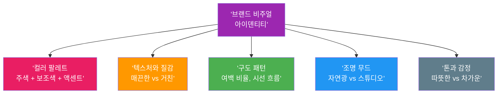
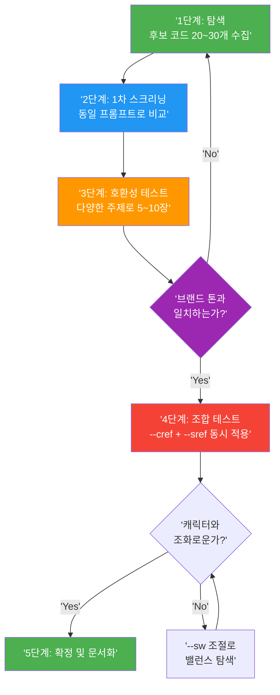

# 브랜드 스타일 가이드 구축

> 여러 이미지에 걸쳐 통일된 브랜드 비주얼을 유지하기 위한 AI 스타일 가이드 시스템을 구축합니다

## 개요

개별 캐릭터의 일관성을 넘어, **프로젝트 전체의 비주얼 아이덴티티**를 체계적으로 관리하는 브랜드 스타일 가이드를 구축합니다. Midjourney의 `--sref` 코드를 중심으로, 플랫폼별 스타일 고정 전략과 팀 공유가 가능한 프롬프트 프리셋 체계를 설계합니다.

## 브랜드 비주얼 아이덴티티의 5대 요소

AI 브랜드 스타일 가이드는 다섯 가지 핵심 요소로 구성됩니다. 전통적인 로고/폰트/컬러 가이드라인을 **AI가 이해하고 재현할 수 있는 언어**로 번역하는 것이 핵심입니다.



| 요소 | AI 프롬프트 키워드 예시 |
|------|----------------------|
| 컬러 팔레트 | `muted navy blue, warm beige background, coral accent` |
| 텍스처/질감 | `watercolor paper texture`, `smooth digital render` |
| 구도 패턴 | `centered composition, generous negative space` |
| 조명 무드 | `soft golden hour lighting`, `diffused natural light` |
| 톤/감정 | `cheerful and playful`, `moody and contemplative` |

5대 요소를 정의할 때 DO/DON'T를 함께 기록하면 팀원 누구나 판단하기 쉽습니다.

```
브랜드 비주얼 DNA 워크시트 예시:
컬러: 따뜻한 테라코타, 크림 베이지 (O) / 네온 핑크, 형광 그린 (X)
질감: 수채화 느낌, 종이 텍스처 (O) / 3D 렌더, 광택 플라스틱 (X)
구도: 중앙 배치, 넓은 여백 (O) / 복잡한 콜라주, 어안 렌즈 (X)
조명: 골든아워 자연광 (O) / 네온 조명, 강한 플래시 (X)
톤: 따뜻하고 편안한 (O) / 차갑고 공격적인 (X)
```


## --sref 코드: AI 스타일의 DNA

Midjourney의 `--sref`(Style Reference) 파라미터는 브랜드 스타일 가이드의 핵심 도구입니다. 이미지 URL 참조와 스타일 코드, 두 가지 방식으로 사용합니다.

```
이미지 URL 참조 방식:
a cozy cafe interior, warm lighting --sref https://example.com/brand-ref.jpg
```

```
스타일 코드 방식:
a cozy cafe interior, warm lighting --sref 123456789
```

`--sw`(Style Weight)로 스타일 적용 강도를 0~1000 범위에서 조절합니다.

```mermaid
flowchart LR
    A['--sw 0<br/>스타일 무시'] --> B['--sw 50<br/>은은한 힌트']
    B --> C['--sw 100<br/>기본값(균형)']
    C --> D['--sw 300<br/>강한 적용']
    D --> E['--sw 1000<br/>스타일 지배']

    style A fill:#E0E0E0,color:#333
    style B fill:#90CAF9,color:#333
    style C fill:#2196F3,color:#fff
    style D fill:#1565C0,color:#fff
    style E fill:#0D47A1,color:#fff
```

| --sw 값 | 효과 | 브랜드 활용 시나리오 |
|---------|------|---------------------|
| 0 | 스타일 참조 무시 | 스타일 비교 테스트의 기준점 |
| 50~80 | 은은한 스타일 힌트 | 사진 위주 콘텐츠에 살짝 브랜드 톤 입히기 |
| 100 | 기본 균형 | 대부분의 브랜드 콘텐츠 |
| 200~400 | 강한 스타일 적용 | 일러스트, 아트워크 등 스타일이 핵심인 콘텐츠 |
| 500~1000 | 스타일 지배적 | 추상적 배경, 패턴, 텍스처 생성 |

```
--sw 강도별 비교 프롬프트:
a woman walking through a sunlit garden --sref 987654321 --sw 50
a woman walking through a sunlit garden --sref 987654321 --sw 150
a woman walking through a sunlit garden --sref 987654321 --sw 400
```


## --sref 코드 선정 워크플로우

14억 개 이상의 스타일 코드에서 브랜드에 맞는 코드를 찾으려면 체계적 접근이 필요합니다.



**코드를 찾는 세 가지 경로:**

- **`--sref random`**: 무작위 스타일 코드 적용. 마음에 드는 결과의 코드를 기록
- **커뮤니티 라이브러리**: sref-midjourney.com(5,600+), Midlibrary.io(4,000+)에서 키워드 검색
- **Style Creator**: Midjourney 공식 웹 도구. 이미지 그리드에서 선택하면 5~10라운드 후 맞춤형 코드 생성

**1차 스크리닝 프롬프트** — 동일 프롬프트에 코드만 교체합니다:

```
a woman sitting in a cozy reading nook --sref [코드A] --sw 150
a woman sitting in a cozy reading nook --sref [코드B] --sw 150
a woman sitting in a cozy reading nook --sref [코드C] --sw 150
```


**호환성 테스트** — 최종 후보 5~7개로 다양한 주제를 시도합니다:

```
인물: a woman reading a book in soft light --sref [코드] --sw 150
풍경: a quiet countryside path in autumn --sref [코드] --sw 150
제품: artisan ceramic coffee mug on wooden table --sref [코드] --sw 150
```

**조합 테스트** — `--cref`와 함께 사용했을 때 캐릭터가 변형되지 않는지 확인합니다:

```
a cheerful girl exploring a market --cref [캐릭터URL] --sref [코드] --sw 200
```

## 플랫폼별 스타일 고정 전략

Midjourney에서는 `--sref` 코드가 있지만, ChatGPT나 Gemini에는 이런 파라미터가 없습니다. 각 플랫폼별 전략은 다음과 같습니다.

| 플랫폼 | 스타일 고정 방법 | 핵심 전략 |
|--------|----------------|----------|
| Midjourney | `--sref` 코드 + `--sw` 강도 조절 | 코드로 90% 확보, 키워드로 미세 조정 |
| ChatGPT | 스타일 서술문 + 참조 이미지 업로드 | 세션 시작 시 스타일 가이드 전달 |
| Gemini | 키워드 표준화 + 참조 이미지 | 모든 프롬프트 끝에 스타일 블록 추가 |

**ChatGPT 스타일 서술문 예시:**

```
모든 이미지에 다음 스타일을 적용해 주세요:
- 색감: 따뜻한 오렌지-베이지 톤, 채도 낮은 파스텔
- 조명: 부드러운 자연광, 골든아워 분위기
- 질감: 수채화 느낌의 부드러운 가장자리
- 톤: 따뜻하고 nostalgic한 분위기
```

**Gemini 스타일 블록 예시:**

```
[주제 프롬프트], warm earthy color palette, soft diffused
natural lighting, watercolor texture edges, cozy nostalgic mood,
muted pastel tones
```

## 프롬프트 프리셋 체계

브랜드 스타일 가이드의 최종 산출물은 **팀 누구나 참고할 수 있는 프롬프트 프리셋 문서**입니다.

| 구성 요소 | 역할 | 예시 |
|----------|------|------|
| **스타일 블록** | 브랜드 톤, 색감, 질감 | `warm earthy tones, soft natural lighting, watercolor edges` |
| **주제 슬롯** | 이미지마다 달라지는 부분 | `a cozy cafe interior` |
| **파라미터 블록** | 고정 파라미터 | `--sref 123456789 --sw 200 --ar 4:3` |

**Midjourney 완성 프리셋 예시:**

```
[스타일 블록] warm earthy tones, soft natural lighting,
watercolor texture, muted palette,
[주제] a woman enjoying afternoon tea in a garden,
[파라미터] --sref 123456789 --sw 200 --ar 4:3 --stylize 150
```


스타일 문서에는 DNA 선언문, DO/DON'T 갤러리, 플랫폼별 프리셋, --sref 카탈로그, 유형별 템플릿, QA 체크리스트를 포함합니다.

## 실습: 브랜드 스타일 가이드 구축

**Step 1**: 가상 브랜드의 비주얼 DNA 워크시트를 작성합니다.

**Step 2**: --sref 코드 3~5개를 선정하고 동일 프롬프트로 비교합니다:

```
a young artist painting in a studio --sref [코드] --sw 150 --ar 4:3
```

**Step 3**: 최종 코드로 다양한 주제를 테스트합니다:

```
a cat sleeping on a windowsill --sref [최종코드] --sw 200 --ar 4:3
a rustic kitchen with morning light --sref [최종코드] --sw 200 --ar 4:3
hand-crafted pottery on display shelf --sref [최종코드] --sw 200 --ar 4:3
```


**Step 4**: --cref와 조합하여 캐릭터 호환성을 검증합니다:

```
a cheerful girl at a flower market --cref [캐릭터URL] --sref [최종코드] --sw 200
```

**Step 5**: ChatGPT용 스타일 서술문을 작성하고 동일 주제로 비교합니다.

## 팁과 주의사항

- `--sw` 500 이상에서는 프롬프트의 내용(주제, 구도)이 무시되고 스타일만 남는 경우가 많습니다. 브랜드 콘텐츠에서는 **100~300**이 실용적인 범위입니다.
- `--sref` 코드 하나만으로는 구도, 조명 각도, 피사체 스타일링까지 통제할 수 없습니다. 코드는 **기초(Base Layer)**이고, 프롬프트 키워드와 함께 써야 완성됩니다.
- 복수 코드 혼합(`--sref 111111 222222`)으로 독특한 스타일을 만들 수 있지만, 3개 이상은 결과 예측이 어려우므로 **2개 조합까지**가 실용적입니다.
- `--sref` 코드는 Midjourney 버전별로 다르게 해석됩니다. 스타일 문서에 반드시 `--sv` 버전을 기록하고, 새 버전 출시 시 재테스트하세요.
- 스타일 문서는 **최소 분기 1회** 업데이트하세요. AI 플랫폼이 계속 변화하므로 기존 프리셋의 재검증이 필요합니다.

## 핵심 정리

| 개념 | 설명 |
|------|------|
| 비주얼 아이덴티티 5대 요소 | 컬러, 텍스처, 구도, 조명, 톤 — AI 프롬프트 언어로 번역하여 정의 |
| --sref 코드 | 스타일을 숫자 코드로 압축. 이미지 URL 또는 코드 번호로 사용 |
| --sw 파라미터 | 스타일 적용 강도(0~1000, 기본값 100). 브랜드 콘텐츠는 100~300 권장 |
| Style Creator | Midjourney 공식 웹 도구. 취향 학습 후 맞춤형 --sref 코드 생성 |
| 5단계 선정 워크플로우 | 탐색 → 스크리닝 → 호환성 테스트 → 조합 테스트 → 문서화 |
| 플랫폼별 전략 | Midjourney: --sref / ChatGPT: 스타일 서술문 / Gemini: 키워드 표준화 |
| 프리셋 3단 구조 | 스타일 블록 + 주제 슬롯 + 파라미터 블록 |

## 다음 섹션 미리보기

다음 [시리즈 콘텐츠 제작 워크플로우](08-ch8-캐릭터브랜드-스타일-일관성-유지/04-04-시리즈-콘텐츠-제작-워크플로우.md)에서는 캐릭터 시트(`--cref`) + 브랜드 스타일 가이드(`--sref`) + 프롬프트 프리셋을 통합하여, 일관된 세계관 속에서 다양한 장면을 만드는 실전 워크플로우를 익힙니다.
