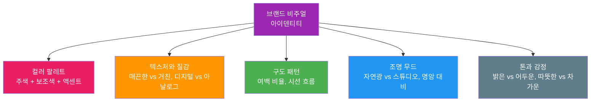
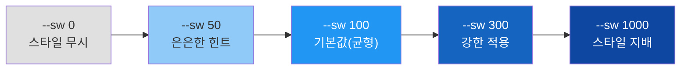
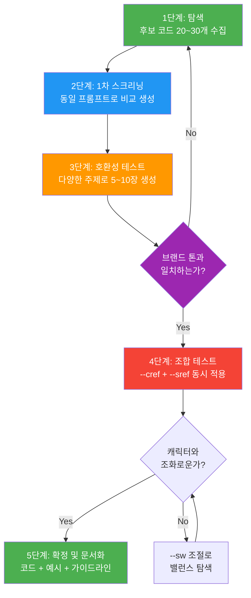
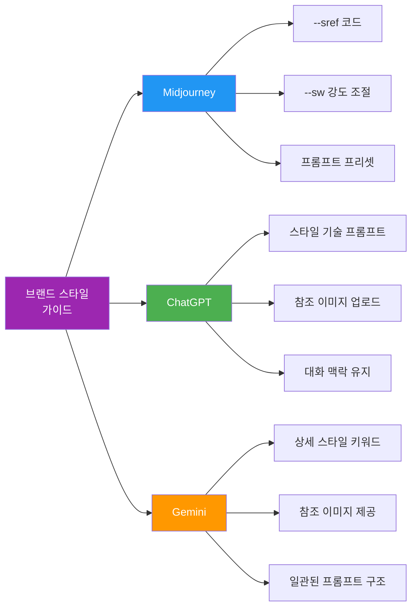
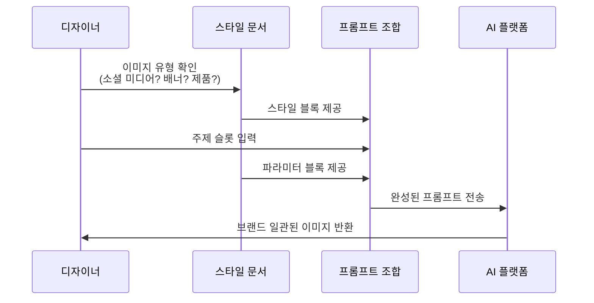

# 브랜드 스타일 가이드 구축

> 여러 이미지에 걸쳐 통일된 브랜드 비주얼을 유지하기 위한 AI 스타일 가이드 시스템을 구축합니다

## 개요

이 섹션에서는 개별 캐릭터의 일관성을 넘어, **프로젝트 전체의 비주얼 아이덴티티**를 체계적으로 관리하는 브랜드 스타일 가이드를 구축하는 방법을 배웁니다. Midjourney의 `--sref` 코드를 중심으로, 플랫폼별 스타일 고정 전략과 팀 공유가 가능한 프롬프트 프리셋 체계를 설계합니다.

**선수 지식**: [캐릭터 일관성의 도전과 전략](08-ch8-캐릭터브랜드-스타일-일관성-유지/01-01-캐릭터-일관성의-도전과-전략.md)에서 배운 Character DNA 개념, [캐릭터 시트와 턴어라운드 제작](08-ch8-캐릭터브랜드-스타일-일관성-유지/02-02-캐릭터-시트와-턴어라운드-제작.md)에서 다룬 `--cref` 워크플로우

**학습 목표**:
- 브랜드 비주얼 아이덴티티의 핵심 요소를 정의하고 문서화할 수 있다
- `--sref` 코드를 선정, 테스트, 관리하는 체계적 워크플로우를 수립할 수 있다
- 플랫폼별(ChatGPT, Gemini, Midjourney) 스타일 고정 전략을 구사할 수 있다
- 팀과 공유 가능한 프롬프트 프리셋 문서를 작성할 수 있다

## 왜 알아야 할까?

인스타그램 피드를 스크롤하다가, 어떤 브랜드의 게시물은 썸네일만 봐도 "아, 이 브랜드다"라고 알아보신 적 있나요? 반면 매번 다른 느낌의 이미지를 올리는 계정은 기억에 남지 않죠. AI로 이미지를 생성할 때도 마찬가지입니다. 하나의 멋진 이미지를 만드는 건 어렵지 않지만, **10장, 50장, 100장의 이미지가 모두 같은 세계관에서 나온 것처럼 보이게** 만드는 건 완전히 다른 차원의 도전입니다.

전통적인 디자인에서는 브랜드 가이드라인 PDF가 이 역할을 했습니다. 하지만 AI 이미지 생성에서는 "Pantone 485C를 사용하세요"라고 말해봐야 AI가 정확히 그 색을 재현하리라는 보장이 없죠. 대신 우리에게는 `--sref` 코드, 프롬프트 프리셋, 참조 이미지 라이브러리라는 새로운 도구가 있습니다. 이 섹션에서는 이 도구들을 체계적으로 조합하여 **AI 시대의 브랜드 스타일 가이드**를 구축하는 방법을 배웁니다.

## 핵심 개념

### 개념 1: 브랜드 비주얼 아이덴티티의 5대 요소

> 💡 **비유**: 브랜드 비주얼 아이덴티티는 사람의 "분위기"와 같습니다. 누군가가 방에 들어왔을 때, 옷 색깔, 말투, 향수, 자세, 표정이 종합적으로 어우러져 그 사람만의 분위기를 만들죠. 브랜드도 마찬가지로 색상, 질감, 구도, 조명, 톤이 어우러져 고유한 비주얼 분위기를 형성합니다.

전통적인 브랜드 가이드라인에서는 로고, 폰트, 컬러 팔레트를 정의합니다. 하지만 AI 이미지 생성에서는 이를 **AI가 이해하고 재현할 수 있는 언어**로 번역해야 합니다. AI 브랜드 스타일 가이드의 핵심 요소는 다음 다섯 가지입니다.

> 📊 **그림 1**: 브랜드 비주얼 아이덴티티를 구성하는 5대 요소

**1. 컬러 팔레트**: 단순히 "파란색"이 아니라, "채도가 낮은 먹빛 남색, 따뜻한 베이지 톤 배경, 산호색 액센트"처럼 구체적으로 정의합니다. AI 프롬프트에서는 `muted navy blue`, `warm beige background`, `coral accent` 같은 키워드로 변환됩니다.

**2. 텍스처와 질감**: 브랜드가 매끈하고 미래적인 느낌인지, 종이 질감의 따뜻한 느낌인지를 결정합니다. `smooth digital render`, `watercolor paper texture`, `grainy film photography` 같은 매체 키워드가 여기에 해당합니다.

**3. 구도 패턴**: 이미지에 여백이 많은 미니멀한 구도인지, 빽빽하게 채워진 맥시멀리스트 구도인지. [구도와 앵글](02-ch2-프롬프트-구조-마스터/03-03-구도와-앵글-시선을-이끄는-프레이밍.md)에서 배운 프레이밍 기법이 여기에 적용됩니다.

**4. 조명 무드**: 부드러운 자연광인지, 극적인 렘브란트 조명인지. [조명과 매체](02-ch2-프롬프트-구조-마스터/04-04-조명과-매체-빛과-질감으로-깊이-더하기.md)에서 배운 조명 키워드를 브랜드 수준으로 표준화합니다.

**5. 톤과 감정**: 전체적인 분위기를 결정하는 감정 키워드. `cheerful and playful`, `moody and contemplative`, `luxurious and refined` 등이 해당합니다.

> 🔥 **실무 팁**: 5대 요소를 정의할 때, 각 요소별로 "이것이다(DO)" 예시와 "이것은 아니다(DON'T)" 예시를 함께 기록하세요. "따뜻한 자연광"만 적는 것보다, "따뜻한 자연광 O / 차가운 형광등 X / 네온 조명 X"처럼 경계를 명확히 하면 팀원 누구나 판단하기 쉬워집니다.

### 개념 2: --sref 코드 — AI 스타일의 DNA

> 💡 **비유**: `--sref` 코드는 음악의 "장르 코드"와 같습니다. "재즈"라고 말하면 스윙 리듬, 즉흥 연주, 특정 악기 편성이 떠오르듯이, `--sref 123456789`라고 입력하면 특정 색감, 질감, 분위기가 자동으로 적용됩니다. 직접 하나하나 설명하지 않아도 "이 스타일 전체"를 한 번에 불러올 수 있는 마법의 번호표인 셈이죠.

Midjourney의 `--sref`(Style Reference) 파라미터는 브랜드 스타일 가이드의 **핵심 무기**입니다. [--sref 스타일 레퍼런스](07-ch7-controlnet과-참조-이미지-활용/04-04-midjourney---sref-스타일-레퍼런스.md)에서 기본 사용법을 배웠다면, 이제 이것을 **브랜드 관리 도구**로 활용하는 전략을 익힐 차례입니다.

**--sref의 두 가지 사용법:**

1. **이미지 URL 참조**: 기존 이미지의 스타일을 새 이미지에 적용
   - 사용법: `프롬프트 --sref [이미지 URL]`
   - 장점: 이미 확보한 브랜드 레퍼런스 이미지를 직접 활용 가능
   
2. **스타일 코드**: 고유 숫자 코드로 특정 스타일 적용
   - 사용법: `프롬프트 --sref 123456789`
   - 장점: URL 없이도 일관된 스타일 재현, 팀 공유가 간편

**--sw(Style Weight)로 강도 조절:**

`--sw` 파라미터는 스타일 참조의 영향력을 0~1000 범위에서 조절합니다. 기본값은 `--sw 100`입니다.

> 📊 **그림 2**: --sw 값에 따른 스타일 적용 강도 변화

| --sw 값 | 효과 | 브랜드 활용 시나리오 |
|---------|------|---------------------|
| 0 | 스타일 참조 무시 | 스타일 비교 테스트의 기준점 |
| 50~80 | 은은한 스타일 힌트 | 사진 위주 콘텐츠에 살짝 브랜드 톤 입히기 |
| 100 | 기본 균형 | 대부분의 브랜드 콘텐츠 |
| 200~400 | 강한 스타일 적용 | 일러스트, 아트워크 등 스타일이 핵심인 콘텐츠 |
| 500~1000 | 스타일 지배적 | 추상적 배경, 패턴, 텍스처 생성 |

> ⚠️ **흔한 오해**: "--sw 값이 높을수록 좋다"고 생각하기 쉽지만, 500 이상에서는 프롬프트의 내용(주제, 구도)이 무시되고 스타일만 남는 경우가 많습니다. 브랜드 콘텐츠에서는 100~300 사이가 가장 실용적인 범위입니다.

### 개념 3: --sref 코드 선정과 관리 워크플로우

> 💡 **비유**: 좋은 --sref 코드를 찾는 과정은 와인 테이스팅과 비슷합니다. 수백 가지 와인 중에서 우리 레스토랑의 메뉴와 잘 어울리는 하우스 와인을 고르려면, 체계적인 시음과 기록이 필요하죠. 무작정 마시다가는 모든 와인이 비슷해 보이기 시작합니다.

Midjourney에는 14억 개 이상의 스타일 코드가 존재합니다. 이 방대한 코드 풀에서 우리 브랜드에 딱 맞는 코드를 찾으려면 체계적인 접근이 필요합니다.

**1단계: 탐색 — 후보 코드 수집**

코드를 찾는 세 가지 경로가 있습니다:

- **`--sref random` 활용**: Midjourney에 `--sref random`을 붙이면 무작위 스타일 코드가 적용됩니다. 생성 후 코드 번호가 표시되므로, 마음에 드는 결과의 코드를 기록해 두세요.
- **커뮤니티 라이브러리 검색**: sref-midjourney.com에 5,600개 이상, Midlibrary.io에 4,000개 이상의 코드가 카테고리별로 정리되어 있습니다. "watercolor", "cyberpunk", "minimalist" 같은 키워드로 검색하면 됩니다.
- **Style Creator 활용**: Style Creator는 **Midjourney가 공식으로 제공하는 웹 기반 도구**로, midjourney.com에 로그인하면 사용할 수 있습니다. 여러 장의 이미지 그리드 중 마음에 드는 것을 선택해 나가면, Midjourney의 AI가 당신의 미학적 취향을 학습하여 맞춤형 `--sref` 코드를 생성해 줍니다. 5~10라운드 정도면 스타일이 안정화됩니다. 커뮤니티가 만든 서드파티 사이트(sref-midjourney.com, Midlibrary.io 등)와는 달리, Style Creator는 Midjourney 플랫폼 자체에 내장된 공식 기능이라는 점이 중요합니다.

> 📊 **그림 3**: --sref 코드 선정 워크플로우

**2단계: 1차 스크리닝**

수집한 후보 코드들을 **동일한 프롬프트**로 테스트합니다. 이때 핵심은 프롬프트를 완전히 똑같이 유지하고 `--sref` 코드만 바꾸는 것입니다. 이렇게 해야 코드 간의 순수한 스타일 차이를 비교할 수 있습니다.

**3단계: 호환성 테스트**

1차에서 걸러진 5~7개 코드로, 이번에는 **다양한 주제의 프롬프트**를 테스트합니다. 인물, 풍경, 제품, 추상 — 실제 브랜드에서 사용할 이미지 유형을 모두 시도해 보세요. 어떤 코드는 인물에는 멋지지만 풍경에서는 어색할 수 있습니다.

**4단계: 조합 테스트**

최종 후보 2~3개로, `--cref`(캐릭터 참조)와 함께 사용했을 때의 결과를 확인합니다. 스타일 코드가 캐릭터의 외형을 지나치게 변형시키지 않는지 점검하세요.

**5단계: 확정 및 문서화**

선정된 코드를 브랜드 스타일 문서에 기록합니다. 코드 번호, 예시 이미지, 적용 시나리오, 권장 --sw 값을 함께 기록하세요.

### 개념 4: 플랫폼별 스타일 고정 전략

> 💡 **비유**: 같은 레시피라도 가스레인지, 인덕션, 오븐에서 조리법이 조금씩 다르듯이, 동일한 브랜드 스타일이라도 각 AI 플랫폼에서 구현하는 방법이 다릅니다. 핵심은 "같은 맛"을 내는 것이지, 똑같은 조리법을 고집하는 게 아닙니다.

Midjourney에서는 `--sref` 코드가 있지만, ChatGPT나 Gemini에는 이런 파라미터가 없습니다. 각 플랫폼에서 브랜드 스타일을 유지하는 전략이 다릅니다.

> 📊 **그림 4**: 플랫폼별 스타일 고정 전략 비교

**Midjourney: --sref 코드 + 프리셋**

Midjourney는 가장 정밀한 스타일 제어를 제공합니다. `--sref` 코드로 스타일의 90%를 잡고, 나머지는 프롬프트 키워드로 미세 조정합니다. 복수의 `--sref` 코드를 혼합하거나, `--sref` 이미지 URL과 코드를 동시에 사용하는 것도 가능합니다. 여기에 **Midjourney 공식 기능인 Style Creator**를 활용하면, 처음부터 브랜드 취향에 최적화된 코드를 효율적으로 확보할 수 있습니다.

**ChatGPT(GPT-4o): 스타일 서술 + 대화 맥락**

ChatGPT에는 `--sref` 같은 파라미터가 없으므로, **상세한 스타일 서술문(Style Descriptor)**을 작성합니다. "모든 이미지는 따뜻한 오렌지-베이지 톤, 부드러운 자연광, 수채화 느낌의 가장자리 처리를 적용해 주세요"처럼 구체적으로 기술합니다. 대화가 이어지는 동안 맥락이 유지되므로, 세션 시작 시 스타일 가이드를 한 번 전달하면 이후 이미지들에 적용됩니다. 이전에 생성한 이미지를 참조 이미지로 업로드하면 더 효과적입니다.

**Gemini: 키워드 표준화 + 참조 이미지**

Gemini에서도 ChatGPT와 유사한 전략을 사용합니다. 일관된 스타일 키워드 블록을 모든 프롬프트 끝에 붙이는 방식이 효과적입니다. Gemini의 이미지 편집 기능을 활용해 스타일 변환을 적용할 수도 있습니다.

> 💡 **알고 계셨나요?**: Midjourney의 **Style Creator**는 Midjourney가 2025년에 공식 도입한 웹 기반 기능입니다. midjourney.com에 로그인한 뒤 접근할 수 있는 이 도구는 일종의 "AI 스타일리스트"로, 이미지 그리드에서 마음에 드는 것을 고르기만 하면 5~10라운드 후에 당신의 미학적 취향을 반영한 맞춤형 `--sref` 코드를 생성해 줍니다. 이 공식 기능 덕분에, 더 이상 수천 개의 랜덤 코드를 일일이 테스트하거나 커뮤니티 라이브러리에만 의존할 필요가 없어졌습니다.

### 개념 5: 프롬프트 프리셋 체계와 스타일 문서 작성

> 💡 **비유**: 프롬프트 프리셋은 카페의 "레시피 매뉴얼"과 같습니다. 아메리카노의 원두 종류, 물 온도, 추출 시간을 표준화해 두면, 어떤 바리스타가 만들어도 같은 맛이 나죠. 프롬프트 프리셋도 마찬가지로, 누가 이미지를 생성하든 같은 브랜드 느낌이 나도록 표준화하는 것입니다.

브랜드 스타일 가이드의 최종 산출물은 **팀 누구나 참고할 수 있는 문서**입니다. 이 문서에는 다음 요소들이 포함되어야 합니다.

**프롬프트 프리셋의 3단 구조:**

| 구성 요소 | 역할 | 예시 |
|----------|------|------|
| **스타일 블록** | 브랜드 톤, 색감, 질감 | `warm earthy tones, soft natural lighting, watercolor edges, muted palette` |
| **주제 슬롯** | 이미지마다 달라지는 부분 | `a cozy cafe interior`, `a woman reading a book` |
| **파라미터 블록** | 고정 파라미터 | `--sref 123456789 --sw 200 --ar 4:3 --stylize 150` |

**프리셋 예시 — "브랜드 A" 소셜 미디어용:**

> 📊 **그림 5**: 프롬프트 프리셋의 3단 구조와 조합 방식

**스타일 문서에 포함할 핵심 항목:**

1. **브랜드 비주얼 DNA 선언문**: 5대 요소를 한 문단으로 요약
2. **DO / DON'T 이미지 갤러리**: 브랜드에 맞는 / 맞지 않는 예시 이미지
3. **플랫폼별 프리셋 목록**: Midjourney, ChatGPT, Gemini 각각의 표준 프롬프트
4. **--sref 코드 카탈로그**: 확정된 코드 목록 + 예시 이미지 + 용도 설명
5. **이미지 유형별 템플릿**: 소셜 미디어, 배너, 제품 사진, 일러스트 등
6. **QA 체크리스트**: 생성된 이미지가 브랜드 가이드에 부합하는지 확인 기준

> ⚠️ **흔한 오해**: "스타일 문서는 한 번 만들면 끝"이라고 생각하기 쉽지만, AI 플랫폼은 계속 업데이트됩니다. Midjourney의 `--sref` 코드는 버전에 따라 다르게 렌더링될 수 있고(`--sv 4`와 `--sv 6`의 결과가 다릅니다), 새 모델이 출시되면 기존 프리셋을 재검증해야 합니다. 최소 분기마다 한 번은 스타일 문서를 업데이트하세요.

## 실습: 적용해보기

### 활동 1: 나만의 브랜드 비주얼 DNA 작성

가상의 브랜드(또는 자신의 프로젝트)를 하나 선정하고, 아래 워크시트를 채워보세요.

**브랜드 비주얼 DNA 워크시트:**

| 요소 | DO (이것이다) | DON'T (이것은 아니다) |
|------|-------------|---------------------|
| 컬러 팔레트 | (예: 따뜻한 테라코타, 크림 베이지) | (예: 네온 핑크, 형광 그린) |
| 텍스처/질감 | (예: 수채화 느낌, 종이 텍스처) | (예: 3D 렌더, 광택 플라스틱) |
| 구도 패턴 | (예: 중앙 배치, 넓은 여백) | (예: 복잡한 콜라주, 어안 렌즈) |
| 조명 무드 | (예: 골든아워 자연광) | (예: 네온 조명, 강한 플래시) |
| 톤/감정 | (예: 따뜻하고 편안한, nostalgic) | (예: 차갑고 미래적인, 공격적인) |

### 활동 2: --sref 코드 스크리닝 시뮬레이션

아래 절차를 따라 브랜드에 맞는 --sref 코드를 선정하는 과정을 연습해 보세요.

1. sref-midjourney.com이나 Midlibrary.io에서 자신의 브랜드 톤과 관련된 키워드로 검색하여 코드 5개를 선정합니다
2. 다음 프롬프트를 각 코드에 적용해 비교합니다:
   - 인물: `a woman sitting in a cozy reading nook --sref [코드] --sw 150`
   - 풍경: `a quiet countryside path in autumn --sref [코드] --sw 150`
   - 제품: `artisan ceramic coffee mug on wooden table --sref [코드] --sw 150`
3. 각 코드의 결과를 비교하며 평가표를 작성합니다:

| 코드 | 인물 적합도(1~5) | 풍경 적합도(1~5) | 제품 적합도(1~5) | 브랜드 톤 일치(1~5) | 총점 |
|------|-----------------|-----------------|-----------------|-------------------|------|
| sref A | | | | | |
| sref B | | | | | |
| sref C | | | | | |

### 토론 질문

- 동일한 --sref 코드를 사용해도 프롬프트 주제에 따라 결과가 크게 달라지나요? 어떤 유형의 이미지에서 차이가 가장 크던가요?
- ChatGPT나 Gemini에서 Midjourney의 --sref 코드 없이 스타일 일관성을 유지하려면, 스타일 서술문에 어떤 요소를 반드시 포함해야 할까요?
- 브랜드 스타일 가이드를 팀원에게 전달할 때, 텍스트 설명만으로 충분할까요? 예시 이미지가 왜 중요한지 이유를 토론해 보세요.

## 더 깊이 알아보기

### 브랜드 가이드라인의 진화: PDF에서 --sref 코드까지

브랜드 비주얼 가이드라인의 역사는 1950년대로 거슬러 올라갑니다. 1956년 폴 랜드(Paul Rand)가 IBM을 위해 디자인한 로고와 함께 최초의 체계적인 브랜드 가이드라인이 등장했습니다. 이후 수십 년간 브랜드 가이드라인은 **정적인 PDF 문서**의 형태를 유지했습니다 — 로고 최소 크기, 금지 사용 예시, Pantone 컬러 코드가 빼곡히 적힌 수백 페이지짜리 책이었죠.

2010년대에 들어 Figma 같은 도구가 등장하면서 브랜드 가이드라인은 "살아 있는 문서"로 진화했습니다. 컴포넌트 라이브러리와 디자인 토큰이 정적인 색상 코드를 대체했죠.

그리고 2023~2024년, AI 이미지 생성의 폭발적 성장과 함께 브랜드 가이드라인은 또 한 번의 패러다임 전환을 맞이합니다. Midjourney가 `--sref` 파라미터를 도입하면서, 수백 페이지의 스타일 규정이 **하나의 숫자 코드**로 압축될 수 있게 된 것입니다. Typeface AI 같은 기업은 아예 브랜드 가이드라인을 AI가 이해할 수 있는 "Brand Kit"으로 변환하는 서비스를 제공하기 시작했습니다.

의외의 사실은, `--sref random` 기능의 탄생 배경입니다. Midjourney 팀은 원래 내부 테스트용으로 스타일 코드 시스템을 개발했는데, 커뮤니티에서 "랜덤 스타일을 적용해 보고 싶다"는 요청이 쏟아지면서 `--sref random`이 공개되었고, 이것이 14억 개 이상의 스타일 코드 우주를 탐험하는 거대한 커뮤니티 활동으로 발전했습니다. sref-midjourney.com 같은 코드 라이브러리 사이트들은 모두 커뮤니티 기여로 만들어진 것입니다. 이후 Midjourney는 이런 커뮤니티 수요를 공식 기능으로 흡수하여, 2025년에 **Style Creator**를 midjourney.com에 공식 탑재했습니다 — 랜덤 코드를 무작정 테스트하는 대신, AI가 사용자의 취향을 학습하여 맞춤형 코드를 생성해 주는 것이죠.

## 흔한 오해와 팁

> ⚠️ **흔한 오해**: "--sref 코드 하나만 있으면 브랜드 일관성이 완벽하다"고 생각하기 쉽습니다. 하지만 --sref는 색감과 전반적 분위기를 잡아줄 뿐, 구도, 라이팅 각도, 피사체의 스타일링까지 통제하지는 못합니다. --sref 코드는 브랜드 가이드의 **기초(Base Layer)**이지, 전부가 아닙니다. 프롬프트 키워드와 함께 사용해야 완성됩니다.

> 💡 **알고 계셨나요?**: Midjourney의 `--sref` 코드는 버전별로 다르게 해석됩니다. `--sv 6`(기본값)과 `--sv 4`는 같은 코드라도 다른 결과를 만들어냅니다. 브랜드 스타일 문서에는 반드시 사용한 `--sv` 버전을 함께 기록해야 합니다. 새 버전이 출시되면 기존 코드를 재테스트하는 것도 잊지 마세요.

> 🔥 **실무 팁**: 복수의 --sref 코드를 혼합하면 독특한 브랜드 스타일을 만들 수 있습니다. `--sref 111111 222222`처럼 공백으로 구분하여 두 코드를 조합하세요. 각 코드의 비중은 `::` 구문으로 조절 가능합니다. 하지만 3개 이상 혼합하면 결과가 예측하기 어려워지므로, 2개 조합까지가 실용적입니다.

## 핵심 정리

| 개념 | 설명 |
|------|------|
| 비주얼 아이덴티티 5대 요소 | 컬러, 텍스처, 구도, 조명, 톤 — AI 프롬프트 언어로 번역하여 정의 |
| --sref 코드 | 스타일을 숫자 코드로 압축. 이미지 URL 또는 코드 번호로 사용 |
| --sw 파라미터 | 스타일 적용 강도(0~1000, 기본값 100). 브랜드 콘텐츠는 100~300 권장 |
| Style Creator | Midjourney 공식 웹 기반 도구. 취향 학습 후 맞춤형 --sref 코드 생성 (5~10라운드) |
| 5단계 코드 선정 워크플로우 | 탐색 → 스크리닝 → 호환성 테스트 → 조합 테스트 → 문서화 |
| 플랫폼별 전략 | Midjourney: --sref / ChatGPT: 스타일 서술문 / Gemini: 키워드 표준화 |
| 프롬프트 프리셋 3단 구조 | 스타일 블록 + 주제 슬롯 + 파라미터 블록 |
| 스타일 문서 필수 항목 | DNA 선언문, DO/DON'T 갤러리, 프리셋 목록, --sref 카탈로그, QA 체크리스트 |

## 다음 섹션 미리보기

브랜드 스타일 가이드를 구축했으니, 이제 이것을 실전에 적용할 차례입니다. [시리즈 콘텐츠 제작 워크플로우](08-ch8-캐릭터브랜드-스타일-일관성-유지/04-04-시리즈-콘텐츠-제작-워크플로우.md)에서는 여러 장의 이미지가 하나의 이야기를 구성하는 시리즈 콘텐츠를 제작합니다. 캐릭터 시트(`--cref`) + 브랜드 스타일 가이드(`--sref`) + 프롬프트 프리셋을 통합하여, 일관된 세계관 속에서 다양한 장면을 만들어 내는 실전 워크플로우를 익힙니다.

## 참고 자료

- [Midjourney Style Reference 공식 문서](https://docs.midjourney.com/hc/en-us/articles/32180011136653-Style-Reference) - --sref 파라미터의 공식 사용법, --sw 범위, 복수 참조 사용법을 확인할 수 있는 필수 레퍼런스
- [Midjourney Style Creator 공식 문서](https://docs.midjourney.com/hc/en-us/articles/41308374558221-Style-Creator) - Midjourney 공식 웹 기반 도구인 Style Creator의 사용법과 라운드별 프로세스 안내
- [sref-midjourney.com — SREF 코드 라이브러리](https://sref-midjourney.com/) - 5,600개 이상의 --sref 코드를 카테고리별로 탐색할 수 있는 커뮤니티 라이브러리
- [Midlibrary.io — SREF 코드 및 스타일 가이드](https://midlibrary.io/midguide/deep-dive-into-midjourney-sref-codes) - --sref 코드의 작동 원리와 활용 전략을 깊이 있게 다루는 가이드
- [Character Consistency in AI: Cohesive IP Design Guide (Lovart)](https://www.lovart.ai/blog/ai-character-consistency) - 캐릭터와 브랜드 일관성을 유지하는 포괄적인 전략을 다루는 실전 가이드

---
### 🔗 Related Sessions
- [6요소 프레임워크](02-ch2-프롬프트-구조-마스터/01-01-프롬프트-해부학-6요소-프레임워크.md) (prerequisite)
- [character dna](08-ch8-캐릭터브랜드-스타일-일관성-유지/01-01-캐릭터-일관성의-도전과-전략.md) (prerequisite)
