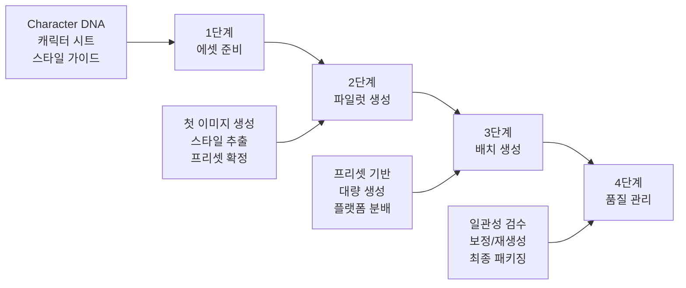
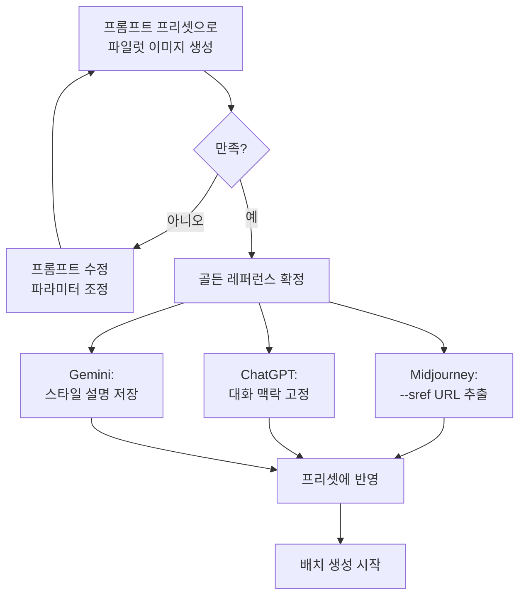
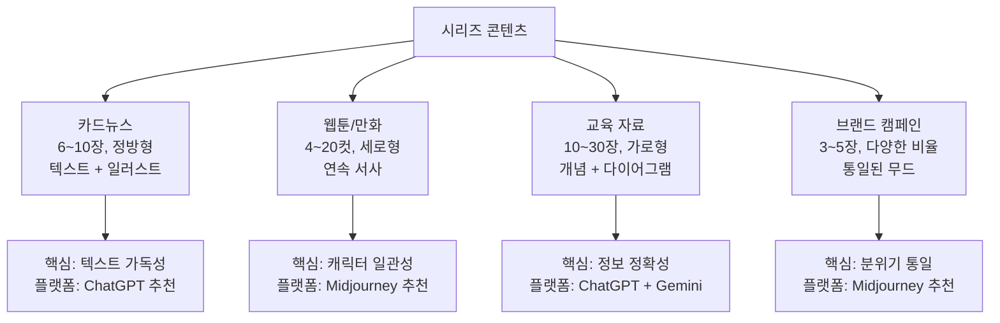
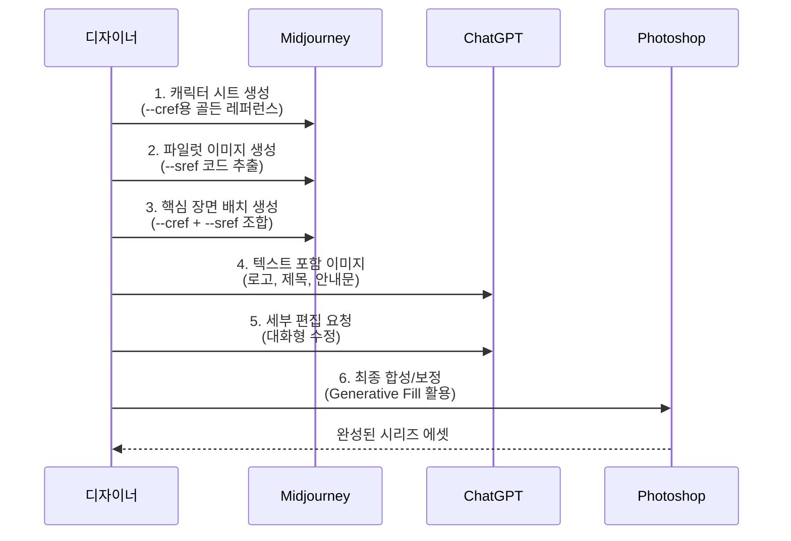
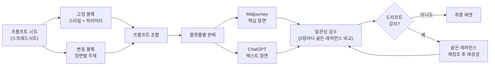

# 시리즈 콘텐츠 제작 워크플로우

> 캐릭터 시트, 브랜드 스타일 가이드, 프롬프트 프리셋을 통합하여 일관된 시리즈 콘텐츠를 제작하는 실전 워크플로우를 익힙니다.

## 개요

앞선 세 섹션에서 우리는 강력한 무기 세 가지를 만들었습니다. [캐릭터 일관성의 도전과 전략](08-ch8-캐릭터브랜드-스타일-일관성-유지/01-01-캐릭터-일관성의-도전과-전략.md)에서 Character DNA를, [캐릭터 시트와 턴어라운드 제작](08-ch8-캐릭터브랜드-스타일-일관성-유지/02-02-캐릭터-시트와-턴어라운드-제작.md)에서 시각적 레퍼런스를, [브랜드 스타일 가이드 구축](08-ch8-캐릭터브랜드-스타일-일관성-유지/03-03-브랜드-스타일-가이드-구축.md)에서 프롬프트 프리셋을 만들었죠. 특히 이전 섹션에서 잠깐 언급했던 **스타일 드리프트(Style Drift)** — 시리즈가 길어질수록 스타일이 조금씩 변해가는 현상 — 을 이번 섹션에서 본격적으로 다루며, 이 세 가지를 하나로 합쳐서 **실제 시리즈 콘텐츠를 제작하는 워크플로우**를 완성할 차례입니다.

**선수 지식**: Character DNA 작성법, 캐릭터 시트 제작, --cref/--sref 파라미터, 프롬프트 프리셋 3단 구조, 스타일 드리프트 개념(8.3에서 소개)

**학습 목표**:
- 시리즈 콘텐츠 제작의 4단계 워크플로우를 설계할 수 있다
- 첫 이미지에서 스타일을 추출하여 시리즈 전체에 적용할 수 있다
- 카드뉴스, 웹툰, 교육 자료 등 포맷별 제작 전략을 수립할 수 있다
- Midjourney, ChatGPT, Gemini를 조합한 멀티 플랫폼 워크플로우를 구성할 수 있다

## 왜 알아야 할까?

한 장의 멋진 이미지를 만드는 것과 **10장, 20장, 100장이 모두 같은 세계관에 속하는 것처럼 보이게** 만드는 것은 완전히 다른 문제입니다. SNS 카드뉴스, 브랜드 캠페인, 교육 콘텐츠, 웹툰 — 실무에서 필요한 것은 거의 항상 "시리즈"입니다.

실제로 AI 생성 콘텐츠 시장은 빠르게 성장하고 있습니다. AI를 활용한 만화, 웹툰, 일러스트 시리즈 제작은 이미 상업적 규모로 확대되고 있으며, 크리에이터 이코노미와 맞물려 그 수요는 해마다 가파르게 증가하는 추세입니다. 이 시장에서 경쟁력을 갖추려면 "한 장의 예쁜 그림"이 아니라 **"일관된 시리즈를 빠르게 제작하는 시스템"**이 핵심이거든요.

이번 섹션에서는 지금까지 배운 모든 기법을 하나의 워크플로우로 통합합니다.

## 핵심 개념

### 개념 1: 시리즈 콘텐츠 제작의 4단계 파이프라인

> 💡 **비유**: 영화 제작을 떠올려 보세요. 영화는 "기획(프리 프로덕션) → 촬영(프로덕션) → 편집(포스트 프로덕션) → 배급"이라는 파이프라인을 따릅니다. 시리즈 콘텐츠 제작도 마찬가지입니다. 즉흥적으로 하나씩 만드는 게 아니라, **체계적인 파이프라인**을 따라야 100장이든 1000장이든 일관성을 유지할 수 있죠.

시리즈 콘텐츠 제작은 크게 네 단계로 구성됩니다.

> 📊 **그림 1**: 시리즈 콘텐츠 제작 4단계 파이프라인



**1단계 — 에셋 준비**: Character DNA 문서, 캐릭터 시트(턴어라운드/표정/의상), 브랜드 스타일 가이드, 프롬프트 프리셋을 모두 정리합니다. 이전 세 섹션에서 만든 산출물이 바로 이 단계의 결과물이에요.

**2단계 — 파일럿 생성**: 시리즈의 첫 1~3장을 만들며 스타일을 확정합니다. 이 단계에서 가장 마음에 드는 결과물이 "골든 레퍼런스"가 되고, 여기서 --sref 코드를 추출하거나 대화 맥락의 기준점을 설정합니다.

**3단계 — 배치 생성**: 확정된 프리셋과 레퍼런스를 기반으로 나머지 이미지를 대량 생성합니다. 이때 각 플랫폼의 강점에 따라 작업을 분배하는 것이 핵심이죠.

**4단계 — 품질 관리**: 생성된 이미지들의 일관성을 검수하고, 필요시 인페인팅이나 재생성으로 보정합니다. 특히 이 단계에서 [브랜드 스타일 가이드 구축](08-ch8-캐릭터브랜드-스타일-일관성-유지/03-03-브랜드-스타일-가이드-구축.md)에서 소개한 **스타일 드리프트**를 집중적으로 점검해야 합니다. 최종 패키징까지 포함됩니다.

> ⚠️ **흔한 오해**: "에셋 준비 없이 바로 생성을 시작해도 된다"고 생각하기 쉽지만, 에셋 준비 없이 시작하면 3~4장째부터 캐릭터가 달라지기 시작합니다. 10장짜리 시리즈에서 7장을 버리고 다시 만드는 것보다, 처음에 1시간 투자해서 에셋을 준비하는 게 훨씬 효율적입니다.

### 개념 2: 첫 이미지에서 스타일 추출 — 파일럿 프로세스

> 💡 **비유**: 요리사가 새 메뉴를 개발할 때, 처음부터 100인분을 만들지 않습니다. 먼저 **시식용 1인분**을 만들어 맛을 확인하고, 레시피를 확정한 뒤에 대량 조리에 들어가죠. 파일럿 프로세스는 바로 이 "시식용 1인분"입니다.

파일럿 프로세스는 시리즈의 톤을 잡는 가장 중요한 단계입니다. 여기서 만들어진 결과물이 나머지 모든 이미지의 기준이 되니까요.

> 📊 **그림 2**: 파일럿 프로세스의 스타일 추출 흐름



**플랫폼별 스타일 추출 방법이 다릅니다:**

**Midjourney에서의 스타일 추출**: 파일럿 이미지가 마음에 들면, 그 이미지 URL을 `--sref`로 사용합니다. 동시에 `--cref`로 캐릭터 시트의 골든 레퍼런스 이미지를 지정하면, **캐릭터 + 스타일 모두 잠긴 상태**로 나머지를 생성할 수 있습니다.

프롬프트 예시:
```
a girl reading a book in a cozy library --cref [캐릭터URL] --cw 80 --sref [파일럿URL] --sw 60 --ar 3:4 --s 200
```

이때 `--cw`(Character Weight)와 `--sw`(Style Weight) 값의 균형이 중요한데요. --cw가 너무 높으면 포즈까지 고정되어 부자연스러워지고, --sw가 너무 높으면 캐릭터 얼굴이 변형될 수 있습니다. 보통 **--cw 70~90, --sw 40~70** 범위에서 시작하는 것을 추천합니다.

**ChatGPT에서의 스타일 추출**: GPT-4o의 강점은 대화 맥락(Visual Memory)입니다. 파일럿 이미지를 생성한 뒤 "이 스타일을 유지해줘"라고 말하면, 같은 대화 내에서 후속 이미지들이 일관된 스타일로 생성됩니다. 핵심은 **하나의 대화 스레드 안에서 작업하는 것**이에요.

**Gemini에서의 스타일 추출**: 파일럿 이미지의 스타일 특징을 텍스트로 상세히 기록해두고, 매 프롬프트에 이 설명을 포함시킵니다. "부드러운 수채화 질감, 파스텔 톤, 선이 부드러운 카툰 스타일" 같은 식으로요.

### 개념 3: 포맷별 시리즈 제작 전략

> 💡 **비유**: 같은 음악이라도 콘서트홀에서 연주할 때와 클럽에서 틀 때는 편곡이 달라야 하잖아요? 마찬가지로, 같은 캐릭터와 브랜드 스타일이라도 **카드뉴스, 웹툰, 교육 자료** 등 포맷에 따라 제작 전략이 달라져야 합니다.

> 📊 **그림 3**: 포맷별 시리즈 콘텐츠 특성 비교



**카드뉴스 제작 전략**

카드뉴스는 SNS에서 가장 흔한 시리즈 포맷이에요. 보통 6~10장으로 구성되며, 각 장에 핵심 메시지 하나와 일러스트가 들어갑니다.

- **종횡비**: 1:1(인스타그램) 또는 4:5(피드 최적화). Midjourney에서 `--ar 1:1` 또는 `--ar 4:5` 사용
- **텍스트 공간 확보**: 프롬프트에 "with blank space for text on the top/bottom" 같은 지시를 추가해서 텍스트 영역을 남겨둡니다
- **추천 플랫폼**: ChatGPT(GPT-4o)가 텍스트 렌더링에 강하므로, 텍스트가 포함된 카드뉴스에 유리합니다. 순수 일러스트 카드뉴스라면 Midjourney가 더 좋은 결과를 냅니다

**웹툰/만화 제작 전략**

웹툰은 캐릭터 일관성이 가장 중요한 포맷입니다. 주인공이 컷마다 다르게 보이면 독자가 혼란스러워지거든요.

- **종횡비**: 세로형 스크롤(3:4 또는 2:3)이 기본. 각 컷을 개별 이미지로 생성 후 세로로 이어붙입니다
- **워크플로우**: Midjourney로 기본 컷 생성(--cref + --sref) → 인페인팅으로 표정/세부 조정 → Photoshop에서 말풍선/효과 추가
- **핵심 팁**: 한 에피소드(4~8컷)를 한 번에 모든 프롬프트를 작성해두고 연속 생성하면 세션 내 일관성이 높아집니다

**교육 자료 제작 전략**

교육 자료는 정보 전달이 핵심이므로, 일러스트가 내용을 보조하는 역할을 합니다.

- **종횡비**: 16:9(프레젠테이션) 또는 3:2(자료집). Midjourney에서 `--ar 16:9`
- **일관성 포인트**: 캐릭터보다는 **색상 팔레트와 일러스트 스타일**의 통일이 중요합니다
- **추천 조합**: 개념 설명 일러스트는 ChatGPT, 분위기 있는 배경이나 인물 그림은 Midjourney로 분담

### 개념 4: 멀티 플랫폼 조합 전략 — 각자의 강점을 살리기

> 💡 **비유**: 밴드를 생각해보세요. 보컬, 기타, 베이스, 드럼이 각자 역할이 있듯이, ChatGPT, Midjourney, Gemini도 각자 잘하는 영역이 다릅니다. 혼자 다 하는 "원맨밴드"보다, **각 악기의 강점을 살린 밴드**가 더 좋은 음악을 만들죠.

> 📊 **그림 4**: 멀티 플랫폼 조합 워크플로우



각 플랫폼의 역할을 명확히 분담하는 것이 핵심입니다:

| 작업 유형 | 추천 플랫폼 | 이유 |
|-----------|------------|------|
| 캐릭터 시트/턴어라운드 | Midjourney | --cref로 일관성 유지 최강 |
| 스타일 기준 이미지 | Midjourney | --sref로 스타일 코드 추출 가능 |
| 텍스트 포함 이미지 | ChatGPT (GPT-4o) | 텍스트 렌더링 정확도 최고 |
| 대화형 반복 수정 | ChatGPT / Gemini | 자연어로 "여기만 바꿔줘" 가능 |
| 배경/풍경 대량 생성 | Midjourney | 미학적 품질과 --sref 일관성 |
| 결함 보정/합성 | Photoshop + Firefly | Generative Fill로 정밀 편집 |

**실전 조합 예시 — 10장짜리 카드뉴스 제작:**

1. **Midjourney**: 표지 이미지 + 핵심 일러스트 5장 생성 (--cref + --sref)
2. **ChatGPT**: 텍스트가 들어간 제목 카드 1장 + 요약 카드 2장 생성 (텍스트 렌더링 활용)
3. **Photoshop**: 모든 이미지에 브랜드 로고 삽입, 색보정, 텍스트 오버레이 통일
4. **최종 검수**: 10장을 나란히 놓고 색감/스타일 일관성 확인

이렇게 분업하면, 단일 플랫폼으로 모든 것을 해결하려고 할 때보다 **품질은 높고 작업 시간은 단축**됩니다.

### 개념 5: 배치 생성과 버전 관리 — 스타일 드리프트 방지의 핵심

> 💡 **비유**: 사진작가가 행사 촬영을 할 때, 수백 장을 찍고 나서 **라이트룸에서 동일한 색보정 프리셋을 일괄 적용**하잖아요? 배치 생성도 같은 원리입니다. 개별 이미지를 하나씩 만드는 게 아니라, 프리셋을 기반으로 **시스템적으로 대량 생성**하는 거예요.

[브랜드 스타일 가이드 구축](08-ch8-캐릭터브랜드-스타일-일관성-유지/03-03-브랜드-스타일-가이드-구축.md)에서 소개한 **스타일 드리프트(Style Drift)**를 기억하시죠? 시리즈가 길어질수록 스타일이 조금씩 변해가는 현상인데요. 배치 생성에서 이 드리프트를 체계적으로 방지하는 도구가 바로 **프롬프트 시트**입니다. 시리즈의 모든 이미지에 대한 프롬프트를 미리 작성해두는 건데요, 스프레드시트 형태로 관리하면 효율적입니다.

**프롬프트 시트 구조:**

| 번호 | 장면 설명 | 고정 블록(스타일) | 변동 블록(주제) | 파라미터 | 상태 |
|------|----------|------------------|----------------|----------|------|
| 01 | 카페에서 독서 | soft watercolor, pastel palette | girl reading a book in a cozy cafe | --cref URL --sref URL --ar 1:1 | 완료 |
| 02 | 공원 산책 | soft watercolor, pastel palette | girl walking in a sunny park with a dog | --cref URL --sref URL --ar 1:1 | 생성중 |
| 03 | 비 오는 창가 | soft watercolor, pastel palette | girl sitting by a rainy window, holding tea | --cref URL --sref URL --ar 1:1 | 대기 |

이전 섹션에서 배운 프롬프트 프리셋 3단 구조(스타일 블록 + 주제 슬롯 + 파라미터 블록)가 여기서 빛을 발합니다. 스타일 블록과 파라미터 블록은 고정하고, **주제 슬롯만 바꿔가며** 생성하면 되니까요. 고정 블록이 "앵커" 역할을 해서 스타일 드리프트를 원천적으로 억제합니다.

> 📊 **그림 5**: 프롬프트 시트 기반 배치 생성과 스타일 드리프트 방지 흐름



**버전 관리 팁:**

- 모든 생성 결과물을 `v1`, `v2` 폴더로 구분하여 저장합니다
- Midjourney의 경우, 마음에 드는 결과의 **시드(Seed) 값**을 반드시 기록해두세요. `/imagine prompt --seed 12345`로 비슷한 결과를 재현할 수 있습니다
- ChatGPT의 경우, **해당 대화 스레드의 URL을 북마크**해두면 나중에 같은 맥락에서 추가 생성이 가능합니다

**스타일 드리프트 방지를 위한 체크포인트 전략:**

스타일 드리프트는 한 번에 크게 변하지 않고 조금씩 누적되기 때문에 알아채기 어렵습니다. 이를 방지하려면 **5장마다 골든 레퍼런스와 나란히 비교 검수**하는 체크포인트를 두세요. 구체적으로:

1. **5장 생성 → 골든 레퍼런스와 썸네일 비교** → 색감/선 굵기/질감 확인
2. **10장 생성 → 1번과 10번을 나란히 배치** → 드리프트 여부 판정
3. **드리프트 감지 시** → 골든 레퍼런스를 다시 --sref로 참조하거나, ChatGPT에서 원본 이미지를 다시 업로드하여 맥락 재설정

## 실습: 적용해보기

### 활동 1: 6장짜리 카드뉴스 시리즈 기획

아래 시나리오 중 하나를 선택하고, 프롬프트 시트를 완성해보세요.

**시나리오 A**: "건강한 아침 습관 5가지" — 라이프스타일 브랜드용 인스타그램 카드뉴스
**시나리오 B**: "우리 동네 카페 투어" — 지역 커뮤니티 SNS 시리즈
**시나리오 C**: "신입사원 생존 가이드" — 기업 내부 교육 콘텐츠

**작성할 내용:**

1. **캐릭터 설정**: 시리즈의 주인공 캐릭터 Character DNA를 3줄로 작성
2. **스타일 키워드**: 시리즈 전체에 적용할 스타일 블록 작성 (색감, 질감, 분위기)
3. **프롬프트 시트**: 6장 각각의 장면 설명과 변동 블록 작성
4. **플랫폼 분배**: 6장 중 어떤 이미지를 어떤 플랫폼으로 만들지 결정하고 이유 기록

### 활동 2: 일관성 검수 체크리스트 만들기

아래 항목을 기준으로 자신만의 검수 체크리스트를 만들어보세요:

- **캐릭터 검수**: 얼굴 특징 일치도 (95% 이상), 헤어스타일 일관성 (90% 이상), 체형/의상 정확도 (85% 이상)
- **스타일 검수**: 색상 팔레트 통일성, 선 굵기/질감 일관성, 조명 방향 통일성
- **포맷 검수**: 종횡비 통일, 텍스트 영역 위치 일관성, 여백/마진 규격 통일

> 🔥 **실무 팁**: 검수할 때 모든 이미지를 한 화면에 썸네일로 나열하면 불일치가 한눈에 보입니다. 특히 색감 차이는 개별적으로 보면 놓치기 쉽지만, 나란히 놓으면 바로 드러나요. Photoshop의 "Contact Sheet" 기능이나, 단순히 프레젠테이션 슬라이드에 모두 배치하는 것도 효과적입니다.

### 토론 질문

1. 단일 플랫폼만 사용하는 것과 멀티 플랫폼을 조합하는 것, 각각 어떤 상황에서 유리할까요?
2. 20장 이상의 대규모 시리즈를 제작할 때, 중간에 스타일이 미세하게 변하는 "스타일 드리프트"를 어떻게 방지할 수 있을까요? (힌트: 이번 섹션에서 배운 체크포인트 전략과 골든 레퍼런스 재참조를 활용해보세요)

## 더 깊이 알아보기

### 디즈니의 "모델 시트"에서 AI 시리즈 워크플로우까지

시리즈 콘텐츠의 일관성 문제는 사실 AI가 등장하기 훨씬 전부터 존재했습니다. 1930년대 디즈니 스튜디오에서 수백 명의 애니메이터가 미키 마우스를 그렸는데, 사람마다 미키가 다르게 생기는 문제가 발생했거든요. 이를 해결하기 위해 만든 것이 바로 **"모델 시트(Model Sheet)"**입니다.

모델 시트에는 캐릭터의 정면, 측면, 후면, 다양한 표정, 비율 가이드라인이 포함되어 있었어요. 모든 애니메이터가 이 시트를 책상 앞에 붙여두고 작업했습니다. 놀랍지 않나요? 우리가 이전 섹션에서 만든 **턴어라운드 시트와 표정 시트**가 바로 이 모델 시트의 AI 버전인 셈입니다.

90여 년이 지난 지금, 수백 명의 애니메이터 대신 AI가 이미지를 생성하지만, **"기준이 되는 레퍼런스를 만들고 그것을 일관되게 따르게 한다"**는 원리는 정확히 동일합니다. --cref는 디지털 모델 시트이고, --sref는 디지털 스타일 가이드인 셈이죠.

### 생산 효율성의 혁명

전통적인 웹툰 제작은 한 에피소드(20~30컷)에 보통 3~5일이 걸렸습니다. 배경 작화, 캐릭터 작화, 채색, 효과를 모두 사람이 했으니까요. AI 워크플로우를 도입한 크리에이터들은 이 과정을 **1~2일로 단축**하고 있습니다. 중국의 일부 AI 드라마 제작팀은 10명이 100분짜리 드라마를 10일 만에 완성하기도 했는데, 비용은 전통 방식의 1/5 수준이었다고 합니다.

물론 AI만으로 모든 것을 해결할 수는 없고, 최종적인 감수와 편집은 여전히 사람의 몫이에요. 하지만 "시작부터 끝까지 사람이 다 하는 것"에서 "AI가 초안을 만들고 사람이 다듬는 것"으로 워크플로우가 바뀌고 있다는 건 분명합니다.

## 흔한 오해와 팁

> ⚠️ **흔한 오해**: "한 플랫폼에서 모든 시리즈를 만들어야 일관성이 유지된다." 오히려 반대입니다. 각 플랫폼의 강점이 다르기 때문에, 적재적소에 활용하는 편이 전체 품질과 일관성 모두 높아집니다. 다만 **스타일 가이드라는 공통 기준**이 있어야 해요. 기준 없이 여러 플랫폼을 혼용하면 정말로 엉망이 됩니다.

> 💡 **알고 계셨나요?**: Midjourney에서 --sref와 --cref를 동시에 사용할 때, 각각의 가중치(--sw, --cw)를 조절할 수 있습니다. 또한 여러 개의 --sref 코드를 블렌딩할 수도 있어요. 예를 들어 `--sref 12345::2 67890::1`처럼 가중치를 주면 첫 번째 스타일에 더 비중을 두면서도 두 번째 스타일의 요소를 살짝 섞을 수 있습니다.

> 🔥 **실무 팁**: ChatGPT에서 시리즈를 만들 때, 첫 이미지를 생성한 뒤 반드시 "이 캐릭터의 외형 특징을 정리해줘"라고 요청하세요. ChatGPT가 텍스트로 정리해준 설명을 이후 프롬프트에 매번 붙여넣으면, 대화가 길어져도 일관성이 크게 향상됩니다. Visual Memory가 있어도, 명시적 텍스트 설명이 추가되면 더 안정적이거든요.

> 🔥 **실무 팁**: 대규모 시리즈(15장 이상)를 만들 때 "스타일 드리프트"를 방지하려면, 5장마다 골든 레퍼런스와 나란히 비교 검수하세요. 드리프트는 한 번에 크게 변하지 않고 조금씩 누적되기 때문에, 중간중간 기준점과 비교하는 것이 핵심입니다.

## 핵심 정리

| 개념 | 설명 |
|------|------|
| 4단계 파이프라인 | 에셋 준비 → 파일럿 생성 → 배치 생성 → 품질 관리 |
| 파일럿 프로세스 | 첫 1~3장으로 스타일을 확정하고 골든 레퍼런스를 추출하는 단계 |
| 스타일 추출 | Midjourney(--sref URL), ChatGPT(대화 맥락), Gemini(텍스트 설명) |
| 프롬프트 시트 | 고정 블록(스타일) + 변동 블록(주제) + 파라미터를 표로 관리 |
| 멀티 플랫폼 분업 | 캐릭터/미학은 Midjourney, 텍스트는 ChatGPT, 보정은 Photoshop |
| 포맷별 전략 | 카드뉴스(1:1), 웹툰(3:4), 교육 자료(16:9) 등 포맷에 맞는 접근 |
| 스타일 드리프트 방지 | 5장마다 골든 레퍼런스 비교, 고정 블록으로 앵커링, 체크포인트 전략 |
| 일관성 검수 | 캐릭터(95%) + 스타일(90%) + 포맷(100%) 기준으로 일괄 비교 |
| 버전 관리 | 시드 기록, 대화 URL 저장, v1/v2 폴더 분리 |

## 다음 섹션 미리보기

지금까지 배운 모든 기법을 하나의 완성된 프로젝트로 만들어볼 시간입니다. [일관성 실전 프로젝트 — 캐릭터 스토리북](08-ch8-캐릭터브랜드-스타일-일관성-유지/05-05-일관성-실전-프로젝트-캐릭터-스토리북.md)에서는 하나의 캐릭터가 주인공인 8페이지 스토리북을 처음부터 끝까지 제작합니다. Character DNA 작성부터 캐릭터 시트, 브랜드 스타일 가이드, 시리즈 워크플로우까지 — 이 챕터의 모든 기법이 하나로 합쳐지는 최종 프로젝트입니다.

## 참고 자료

- [Character Consistency in AI: Cohesive IP Design Guide 2025 (Lovart)](https://www.lovart.ai/blog/ai-character-consistency) - 캐릭터 일관성 유지를 위한 6단계 프레임워크와 멀티미디어 일관성 전략을 체계적으로 정리한 가이드
- [Midjourney Style Reference 공식 문서](https://docs.midjourney.com/hc/en-us/articles/32180011136653-Style-Reference) - --sref 파라미터의 공식 사용법과 가중치 조절 방법
- [Midjourney Character Reference 공식 문서](https://docs.midjourney.com/hc/en-us/articles/32162917505293-Character-Reference) - --cref 파라미터의 공식 사용법과 --cw 옵션 설명
- [Midjourney SREF Codes Library](https://sref-midjourney.com/) - 커뮤니티가 수집한 --sref 코드 라이브러리와 스타일 탐색 도구
- [Introducing 4o Image Generation (OpenAI)](https://openai.com/index/introducing-4o-image-generation/) - GPT-4o의 이미지 생성 기능과 대화 맥락 기반 일관성 유지에 대한 공식 소개

---
### 🔗 Related Sessions
- [character dna](08-ch8-캐릭터브랜드-스타일-일관성-유지/01-01-캐릭터-일관성의-도전과-전략.md) (prerequisite)
- [골든 레퍼런스](08-ch8-캐릭터브랜드-스타일-일관성-유지/01-01-캐릭터-일관성의-도전과-전략.md) (prerequisite)
- [브랜드 비주얼 dna](08-ch8-캐릭터브랜드-스타일-일관성-유지/03-03-브랜드-스타일-가이드-구축.md) (prerequisite)
