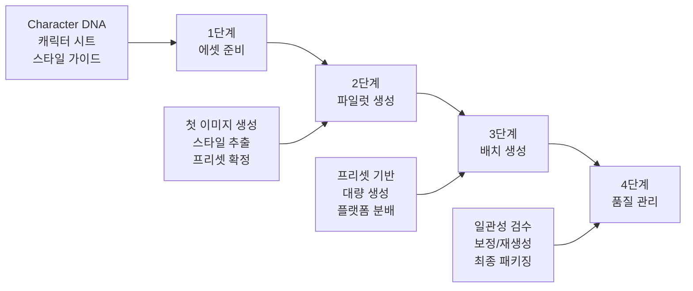
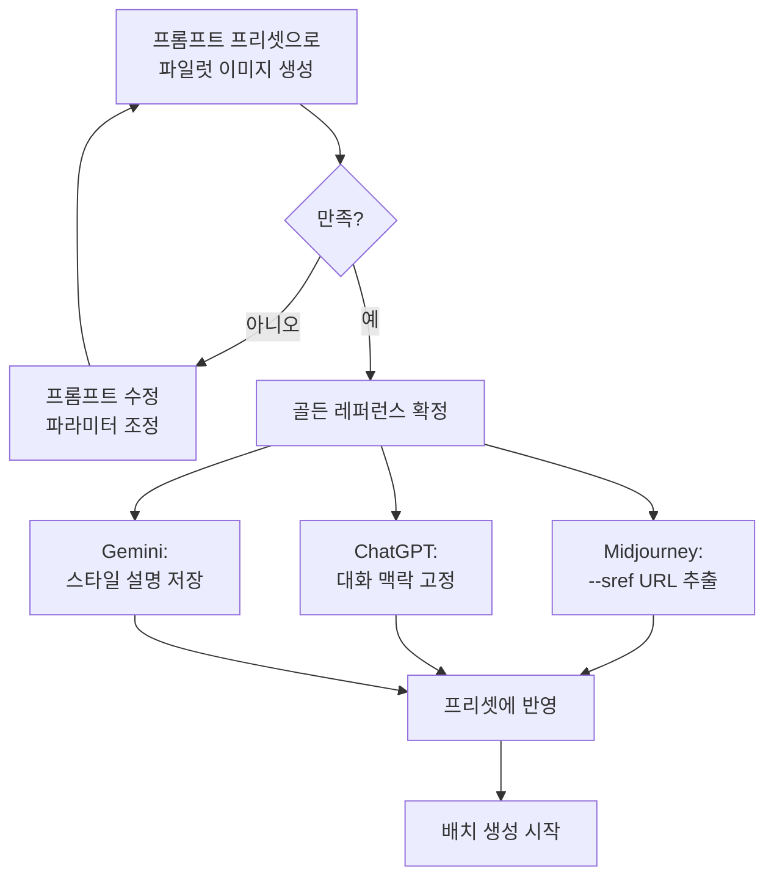
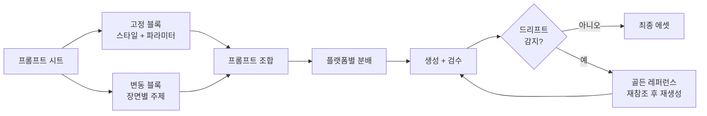

# 시리즈 콘텐츠 제작 워크플로우

> Character DNA, 캐릭터 시트, 프롬프트 프리셋을 하나로 통합하여 일관된 시리즈를 대량 생산하는 실전 파이프라인을 구축합니다.

## 개요

한 장의 멋진 이미지를 만드는 것과 10장, 20장이 모두 같은 세계관에 속하는 것처럼 보이게 만드는 것은 완전히 다른 문제입니다. 이번 섹션에서는 앞서 만든 Character DNA, 캐릭터 시트, 브랜드 스타일 가이드를 하나의 워크플로우로 통합하여 **시리즈 콘텐츠를 체계적으로 제작하는 방법**을 다룹니다. 특히 시리즈가 길어질수록 스타일이 조금씩 변해가는 **스타일 드리프트(Style Drift)**를 방지하는 전략을 중점적으로 살펴봅니다.

## 시리즈 제작 4단계 파이프라인

영화가 프리 프로덕션에서 배급까지 체계적인 파이프라인을 따르듯, 시리즈 콘텐츠도 즉흥적으로 하나씩 만들면 3~4장째부터 캐릭터가 달라지기 시작합니다. 처음에 1시간 투자해서 에셋을 준비하는 것이 훨씬 효율적입니다.



- **1단계 — 에셋 준비**: Character DNA 문서, 캐릭터 시트, 브랜드 스타일 가이드, 프롬프트 프리셋을 모두 정리합니다.
- **2단계 — 파일럿 생성**: 시리즈의 첫 1~3장을 만들며 스타일을 확정합니다. 가장 마음에 드는 결과물이 "골든 레퍼런스"가 됩니다.
- **3단계 — 배치 생성**: 확정된 프리셋과 레퍼런스를 기반으로 나머지 이미지를 대량 생성합니다.
- **4단계 — 품질 관리**: 생성된 이미지들의 일관성을 검수하고, 필요시 인페인팅이나 재생성으로 보정합니다.

## 파일럿 프로세스 — 스타일 추출과 확정

파일럿 프로세스는 시리즈의 톤을 잡는 가장 중요한 단계입니다. 여기서 만들어진 결과물이 나머지 모든 이미지의 기준이 됩니다.



### Midjourney 파일럿 프롬프트

파일럿 이미지가 마음에 들면, 그 이미지 URL을 `--sref`로 사용합니다. `--cref`로 캐릭터 시트의 골든 레퍼런스를 함께 지정하면 캐릭터와 스타일 모두 잠긴 상태로 생성할 수 있습니다.

```
a girl reading a book in a cozy library --cref [캐릭터시트URL] --cw 80 --sref [파일럿이미지URL] --sw 60 --ar 3:4 --s 200
```


`--cw`(Character Weight)와 `--sw`(Style Weight)의 균형이 핵심입니다. --cw가 너무 높으면 포즈까지 고정되어 부자연스럽고, --sw가 너무 높으면 캐릭터 얼굴이 변형됩니다. **--cw 70~90, --sw 40~70** 범위에서 시작하세요.

```
a girl walking in a sunny park with her dog --cref [캐릭터시트URL] --cw 75 --sref [파일럿이미지URL] --sw 50 --ar 3:4 --s 200
```

### ChatGPT 파일럿 프롬프트

GPT-4o의 강점은 대화 맥락(Visual Memory)입니다. 하나의 대화 스레드 안에서 작업하는 것이 핵심입니다.

```
파스텔 톤의 부드러운 수채화 스타일로 갈색 단발머리 소녀가 아늑한 카페에서 책을 읽는 장면을 그려줘. 따뜻한 조명, 부드러운 선, 1:1 비율로.
```

```
이 캐릭터의 외형 특징을 정리해줘. 이후 이미지에서 동일한 캐릭터를 유지할 거야.
```


```
같은 캐릭터가 비 오는 창가에서 차를 마시는 장면을 그려줘. 앞의 스타일을 정확히 유지해줘.
```

### Gemini 파일럿 프롬프트

파일럿 이미지의 스타일 특징을 텍스트로 상세히 기록해두고, 매 프롬프트에 포함시킵니다.

```
부드러운 수채화 질감, 파스텔 톤, 선이 부드러운 카툰 스타일로 갈색 단발머리 소녀가 공원 벤치에서 독서하는 장면을 그려줘. 따뜻한 오후 햇살, 1:1 비율.
```

## 포맷별 시리즈 제작 전략

같은 캐릭터와 브랜드 스타일이라도 포맷에 따라 제작 전략이 달라야 합니다.

| 포맷 | 장수 | 종횡비 | 핵심 포인트 | 추천 플랫폼 |
|------|------|--------|------------|------------|
| 카드뉴스 | 6~10장 | 1:1 또는 4:5 | 텍스트 가독성 | ChatGPT |
| 웹툰/만화 | 4~20컷 | 3:4 또는 2:3 | 캐릭터 일관성 | Midjourney |
| 교육 자료 | 10~30장 | 16:9 또는 3:2 | 정보 정확성 | ChatGPT + Gemini |
| 브랜드 캠페인 | 3~5장 | 다양 | 분위기 통일 | Midjourney |

**카드뉴스 프롬프트 예시:**

```
cute illustration of a girl doing morning yoga on a balcony, with blank space for text on the top, soft pastel colors --cref [URL] --sref [URL] --ar 1:1 --s 200
```


**웹툰 프롬프트 예시:**

```
a girl surprised by a cute cat jumping on her desk, expressive manga style, clean lines --cref [URL] --cw 85 --sref [URL] --sw 50 --ar 3:4
```

**교육 자료 프롬프트 예시:**

```
a friendly girl character explaining a concept with a whiteboard behind her, simple flat illustration style, bright colors --ar 16:9 --sref [URL]
```

## 멀티 플랫폼 조합 전략

각 플랫폼의 역할을 명확히 분담하는 것이 핵심입니다.

| 작업 유형 | 추천 플랫폼 | 이유 |
|-----------|------------|------|
| 캐릭터 시트/턴어라운드 | Midjourney | --cref로 일관성 유지 최강 |
| 스타일 기준 이미지 | Midjourney | --sref로 스타일 코드 추출 가능 |
| 텍스트 포함 이미지 | ChatGPT (GPT-4o) | 텍스트 렌더링 정확도 최고 |
| 대화형 반복 수정 | ChatGPT / Gemini | 자연어로 세부 수정 가능 |
| 배경/풍경 대량 생성 | Midjourney | 미학적 품질과 --sref 일관성 |
| 결함 보정/합성 | Photoshop + Firefly | Generative Fill로 정밀 편집 |

**실전 조합 — 10장짜리 카드뉴스:**

1. **Midjourney**: 표지 + 핵심 일러스트 5장 (--cref + --sref)
2. **ChatGPT**: 텍스트 포함 제목 카드 1장 + 요약 카드 2장
3. **Photoshop**: 브랜드 로고 삽입, 색보정, 텍스트 오버레이 통일
4. **최종 검수**: 10장을 나란히 놓고 색감/스타일 일관성 확인

## 배치 생성과 스타일 드리프트 방지

프롬프트 시트를 스프레드시트 형태로 관리하면 스타일 드리프트를 원천적으로 억제할 수 있습니다. 고정 블록(스타일)과 파라미터 블록은 유지하고, **주제 슬롯만 교체**합니다.

| 번호 | 장면 설명 | 고정 블록(스타일) | 변동 블록(주제) | 파라미터 | 상태 |
|------|----------|------------------|----------------|----------|------|
| 01 | 카페에서 독서 | soft watercolor, pastel palette | girl reading a book in a cozy cafe | --cref URL --sref URL --ar 1:1 | 완료 |
| 02 | 공원 산책 | soft watercolor, pastel palette | girl walking in a sunny park with a dog | --cref URL --sref URL --ar 1:1 | 생성중 |
| 03 | 비 오는 창가 | soft watercolor, pastel palette | girl sitting by a rainy window, holding tea | --cref URL --sref URL --ar 1:1 | 대기 |



**스타일 드리프트 체크포인트:**

1. **5장 생성** → 골든 레퍼런스와 썸네일 비교 → 색감/선 굵기/질감 확인
2. **10장 생성** → 1번과 10번을 나란히 배치 → 드리프트 여부 판정
3. **드리프트 감지 시** → 골든 레퍼런스를 다시 --sref로 참조하거나, ChatGPT에서 원본 이미지를 다시 업로드하여 맥락 재설정

**버전 관리**: 결과물을 `v1`, `v2` 폴더로 구분 저장하고, Midjourney는 시드(Seed) 값을, ChatGPT는 대화 스레드 URL을 반드시 기록해두세요.

## 실습: 6장짜리 카드뉴스 시리즈 제작

아래 시나리오 중 하나를 선택하고, 전체 워크플로우를 실행해보세요.

- **시나리오 A**: "건강한 아침 습관 5가지" — 라이프스타일 브랜드 인스타그램
- **시나리오 B**: "우리 동네 카페 투어" — 지역 커뮤니티 SNS
- **시나리오 C**: "신입사원 생존 가이드" — 기업 내부 교육 콘텐츠

**실습 순서:**

1. 주인공 캐릭터 Character DNA를 3줄로 작성
2. 스타일 블록 작성 (색감, 질감, 분위기)
3. 프롬프트 시트 6장 작성 (고정 블록 + 변동 블록 + 파라미터)
4. 파일럿 이미지 1장 생성 → 골든 레퍼런스 확정
5. 나머지 5장 배치 생성 → 5장째에서 골든 레퍼런스와 비교 검수


## 팁과 주의사항

- **멀티 플랫폼 혼용 시 반드시 스타일 가이드라는 공통 기준을 먼저 확립**하세요. 기준 없이 여러 플랫폼을 혼용하면 일관성이 무너집니다.
- Midjourney에서 `--sref`와 `--cref`를 동시에 사용할 때, 여러 --sref 코드를 블렌딩할 수 있습니다: `--sref 12345::2 67890::1`처럼 가중치를 주면 스타일을 섞을 수 있습니다.
- ChatGPT에서 시리즈를 만들 때, 첫 이미지 생성 후 반드시 **"이 캐릭터의 외형 특징을 정리해줘"**라고 요청하세요. 텍스트로 정리된 설명을 이후 프롬프트에 매번 붙여넣으면 대화가 길어져도 일관성이 크게 향상됩니다.
- 대규모 시리즈(15장 이상)에서는 **5장마다 골든 레퍼런스와 비교 검수**를 반드시 수행하세요. 드리프트는 조금씩 누적되어 알아채기 어렵습니다.
- 검수할 때 모든 이미지를 한 화면에 썸네일로 나열하면 불일치가 한눈에 보입니다. Photoshop의 "Contact Sheet" 기능이나 프레젠테이션 슬라이드에 모두 배치하는 것도 효과적입니다.
- 에셋 준비 없이 바로 생성을 시작하면 3~4장째부터 캐릭터가 달라집니다. 10장 중 7장을 버리는 것보다 처음에 1시간 투자하세요.

## 핵심 정리

| 개념 | 설명 |
|------|------|
| 4단계 파이프라인 | 에셋 준비 → 파일럿 생성 → 배치 생성 → 품질 관리 |
| 파일럿 프로세스 | 첫 1~3장으로 스타일을 확정하고 골든 레퍼런스를 추출하는 단계 |
| 스타일 추출 | Midjourney(--sref URL), ChatGPT(대화 맥락), Gemini(텍스트 설명) |
| 프롬프트 시트 | 고정 블록(스타일) + 변동 블록(주제) + 파라미터를 표로 관리 |
| 멀티 플랫폼 분업 | 캐릭터/미학은 Midjourney, 텍스트는 ChatGPT, 보정은 Photoshop |
| 포맷별 전략 | 카드뉴스(1:1), 웹툰(3:4), 교육 자료(16:9) 등 포맷에 맞는 접근 |
| 스타일 드리프트 방지 | 5장마다 골든 레퍼런스 비교, 고정 블록으로 앵커링, 체크포인트 전략 |

## 다음 섹션 미리보기

다음 섹션 [일관성 실전 프로젝트 — 캐릭터 스토리북](08-ch8-캐릭터브랜드-스타일-일관성-유지/05-05-일관성-실전-프로젝트-캐릭터-스토리북.md)에서는 하나의 캐릭터가 주인공인 8페이지 스토리북을 처음부터 끝까지 제작합니다. 이 챕터의 모든 기법이 하나로 합쳐지는 최종 프로젝트입니다.
