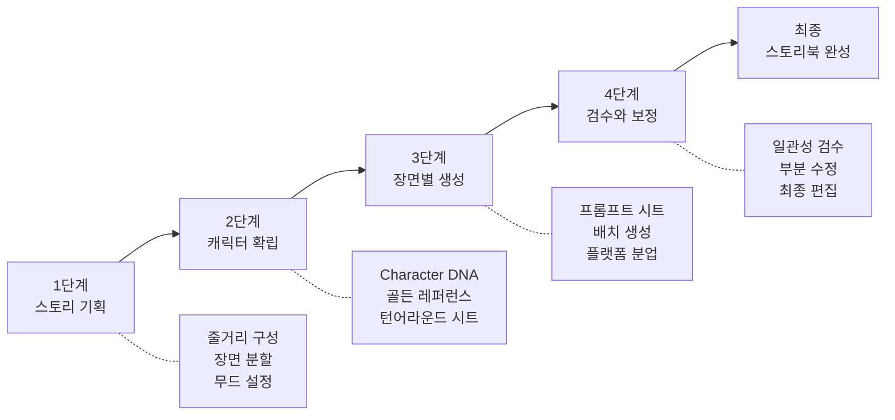
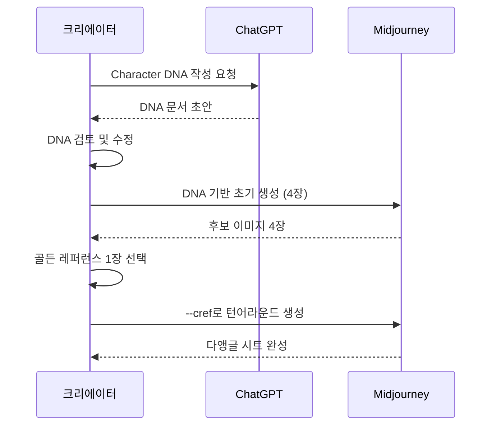
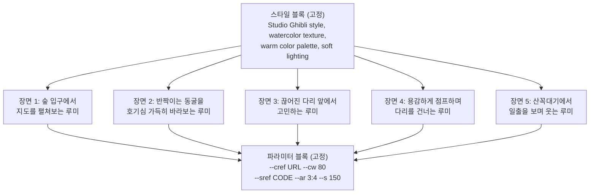

# 일관성 실전 프로젝트 — 캐릭터 스토리북

> 하나의 캐릭터, 5개의 장면, 하나의 이야기 — 챕터 8의 모든 기법을 통합하는 종합 프로젝트입니다.

## 개요

이번 프로젝트에서는 Character DNA, 턴어라운드 시트, --cref/--sref, 프롬프트 프리셋을 하나의 워크플로우로 엮어 미니 스토리북을 완성합니다. 개별 기술을 아는 것과 실제 프로젝트에서 동시에 적용하는 것은 완전히 다른 경험이므로, 전체 파이프라인을 직접 실행하며 실전 감각을 익히는 것이 이 세션의 핵심입니다. 처음이라면 3~5시간, 숙련되면 1~2시간 정도 소요됩니다.

---

## 프로젝트 전체 파이프라인



> 영화 제작에 비유하면, 시나리오(기획) - 캐스팅 및 의상(캐릭터 확립) - 장면 촬영(배치 생성) - 편집 및 색보정(검수)의 흐름입니다.

---

## 1단계: 스토리 기획

5개 장면이라는 제한 안에서 기승전결을 담으려면 **장면 분할**이 핵심입니다.

| 장면 | 역할 | 서사적 기능 |
|------|------|------------|
| 장면 1 | 도입 | 캐릭터 소개, 일상/배경 설정 |
| 장면 2 | 전개 | 사건 발생, 캐릭터의 반응 |
| 장면 3 | 위기/전환 | 갈등의 정점 또는 중요한 발견 |
| 장면 4 | 클라이맥스 | 문제 해결 또는 변화의 순간 |
| 장면 5 | 결말 | 성장/변화 후의 새로운 일상 |

장면 기획 시 고려할 시각적 요소:

- **배경 다양성**: 최소 2~3개의 다른 배경 사용
- **감정 곡선**: 장면마다 캐릭터의 감정 변화 (평온 - 놀람 - 고민 - 결의 - 기쁨)
- **구도 변화**: 전신, 반신, 클로즈업을 섞어 시각적 리듬 확보
- **시간대/조명**: 아침, 낮, 저녁 등 시간 변화로 서사에 깊이 추가

ChatGPT를 활용하면 스토리 기획을 가속할 수 있습니다.

```
8세 아동을 위한 5장면 미니 스토리를 기획해줘.
주인공은 호기심 많은 여우 캐릭터이고, 숲속 모험을 주제로 해줘.
각 장면의 배경, 감정, 구도를 함께 제안해줘.
```


---

## 2단계: 캐릭터 확립

이 단계가 전체 프로젝트의 **성패를 결정**합니다. 전체 시간의 30~40%를 투자하는 것이 정상입니다.



### 2-1. Character DNA 작성

스토리북용 Character DNA에는 **감정 표현 범위**를 추가합니다. 5개 장면에서 최소 3가지 이상의 감정을 표현해야 하기 때문입니다.

| 항목 | 예시 (모험가 여우 루미) |
|------|------|
| 종류/성별 | 의인화된 여우, 여성형 |
| 체형 | 작고 날씬한 체형, 큰 눈, 긴 꼬리 |
| 색상 | 주황빛 오렌지 털, 크림색 배, 에메랄드 그린 눈 |
| 의상 | 남색 망토, 갈색 가죽 배낭, 빨간 스카프 |
| 특징 요소 | 왼쪽 귀에 작은 별 모양 무늬 |
| 감정 범위 | 평온-호기심-놀람-걱정-기쁨 |
| 스타일 | Studio Ghibli 느낌, 수채화 텍스처, 따뜻한 톤 |

### 2-2. 골든 레퍼런스 확보

단순한 배경에서 캐릭터를 또렷하게 뽑는 것이 핵심입니다.

```
A small anthropomorphic fox girl with orange fur, cream belly, emerald green eyes,
wearing a navy cloak and red scarf, small star mark on left ear,
Studio Ghibli style, watercolor texture, warm tones,
simple clean background, character design sheet style --ar 3:4 --stylize 100
```


4장의 결과물 중 **특징 요소가 가장 또렷한 1장**을 골든 레퍼런스로 선택합니다. "가장 예쁜 이미지"가 아니라, 별 무늬, 스카프 등 핵심 요소가 명확한 이미지를 골라야 이후 일관성 유지가 수월합니다.

### 2-3. 턴어라운드 시트 생성

```
A small anthropomorphic fox girl with orange fur, navy cloak, red scarf,
front view and three-quarter view and side view,
character turnaround sheet, white background
--cref [골든 레퍼런스 URL] --cw 100 --ar 16:9
```


Midjourney V7에서는 --oref(Omni Reference)로 --cref를 대체할 수 있습니다. --ow(omni weight) 100~150 사이를 권장합니다.

```
A small anthropomorphic fox girl, front and side and back view,
character turnaround sheet, white background
--oref [골든 레퍼런스 URL] --ow 120 --ar 16:9
```

---

## 3단계: 장면별 생성

**프롬프트 시트**를 먼저 완성한 뒤 순서대로 생성합니다. 스타일 블록(고정) + 주제 슬롯(장면별) + 파라미터 블록(고정)의 3단 구조를 따릅니다.



### 장면별 프롬프트

**장면 1 — 도입 (설렘/전신 미디엄 샷)**:

```
Studio Ghibli style, watercolor texture, warm color palette, soft morning light,
a small fox girl in navy cloak standing at the entrance of a lush green forest,
holding an old map with both hands, looking ahead with excited eyes,
full body medium shot, detailed forest background with sunlight filtering through trees
--cref [URL] --cw 90 --sref [CODE] --ar 3:4 --s 150
```


**장면 2 — 전개 (호기심/반신 로우앵글)**:

```
Studio Ghibli style, watercolor texture, warm color palette, mystical blue glow,
a small fox girl discovering a sparkling crystal cave entrance,
looking up with wide curious eyes, mouth slightly open in wonder,
half body low angle shot, glowing crystals reflecting on her face
--cref [URL] --cw 85 --sref [CODE] --ar 3:4 --s 150
```

**장면 3 — 위기 (걱정/클로즈업)**:

```
Studio Ghibli style, watercolor texture, muted color palette, overcast lighting,
a small fox girl standing before a broken wooden bridge over a deep ravine,
worried expression, ears slightly drooped, clutching her red scarf,
close-up portrait shot, dramatic depth of field
--cref [URL] --cw 90 --sref [CODE] --ar 3:4 --s 150
```


**장면 4 — 클라이맥스 (결의/와이드 다이내믹 샷)**:

```
Studio Ghibli style, watercolor texture, warm color palette, golden hour light,
a small fox girl bravely leaping across a gap in a broken bridge,
determined expression, cloak flowing in the wind, dynamic action pose,
wide dynamic shot, dramatic perspective from below
--cref [URL] --cw 70 --sref [CODE] --ar 3:4 --s 150
```

**장면 5 — 결말 (기쁨/반신 백라이트)**:

```
Studio Ghibli style, watercolor texture, warm golden color palette, sunrise backlight,
a small fox girl standing on a mountain summit watching the sunrise,
gentle happy smile, wind softly blowing her cloak, peaceful atmosphere,
half body shot with beautiful sunrise backlighting, panoramic mountain view
--cref [URL] --cw 85 --sref [CODE] --ar 3:4 --s 150
```


### 배치 생성 전략

1. **장면 1을 먼저 생성하고 확인** — 골든 레퍼런스와 --cref 조합이 의도대로 작동하는지 검증
2. **문제가 없으면 2~5를 연속 생성** — 동일한 스타일 블록 + 파라미터 블록 유지
3. **각 장면마다 4장씩 생성** — 최선의 결과물을 선택하기 위해

---

## 4단계: 검수와 보정

5장의 이미지를 나란히 놓고 일관성을 점검합니다.

| 카테고리 | 체크 항목 | 목표 일치율 |
|----------|----------|------------|
| 얼굴/외형 | 눈 색상, 얼굴형, 특징 마크 | 95%+ |
| 헤어/털 | 색상 톤, 길이, 스타일 | 90%+ |
| 의상 | 핵심 아이템, 색상 | 85%+ |
| 체형 | 머리-몸 비율, 실루엣 | 85%+ |
| 스타일 | 화풍, 색감, 선의 질감 | 90%+ |

**문제별 보정 방법**:

- **얼굴이 달라졌을 때**: --cw 값을 90~100으로 올려 재생성하거나, 인페인팅으로 얼굴 부분만 수정
- **색감이 장면마다 다를 때**: Photoshop의 색조/채도 조정 레이어로 캐릭터 색상 통일
- **스타일 드리프트**: --sref 코드와 --sw 값을 확인 후 재적용

---

## 실습: 나만의 5장면 캐릭터 스토리북

아래 시나리오 중 하나를 선택하거나 자유롭게 기획하세요.

| 시나리오 | 캐릭터 | 주제 |
|----------|--------|------|
| A. 카페 고양이의 하루 | 카페를 운영하는 고양이 | 특별한 손님을 맞이하는 이야기 |
| B. 우주 탐험가 로봇 | 작은 로봇 탐험가 | 미지의 행성에서 친구를 찾는 이야기 |
| C. 꽃집 소녀의 마법 | 꽃집을 가꾸는 소녀 | 시든 정원을 되살리는 이야기 |

**Step 1: Character DNA 작성** (15분)

캐릭터 이름, 종류/성별, 체형, 핵심 색상 3가지, 의상 핵심 아이템, 고유 특징 1가지, 5장면 감정 순서, 목표 스타일을 정리합니다.

**Step 2: 골든 레퍼런스 확보** (30분)

```
[캐릭터 상세 묘사], [스타일 키워드],
simple clean background, character design sheet style
--ar 3:4 --stylize 100
```

**Step 3: 프롬프트 시트 완성** (20분)

스타일 블록과 파라미터 블록을 고정하고, 장면별 주제 슬롯만 변경합니다.

```
[스타일 블록 - 고정],
[장면별 주제 슬롯 - 캐릭터 행동, 감정, 배경 묘사],
[구도 지시 - 전신/반신/클로즈업]
--cref [URL] --cw [80-100] --sref [CODE] --ar 3:4 --s 150
```

**Step 4: 배치 생성 및 선별** (60분)

장면 1 생성 후 골든 레퍼런스와 비교하고, 문제 없으면 장면 2~5를 순차 생성합니다. 장면당 4장 중 최선의 1장을 선택합니다.

**Step 5: 검수와 보정** (30분)

5장을 나란히 놓고 일관성 체크리스트를 점검하고, 문제가 있는 장면을 재생성하거나 부분 보정합니다.


---

## 팁과 주의사항

- **골든 레퍼런스 선택 기준**: "예쁜 이미지"가 아니라 "특징이 또렷한 이미지"를 선택하세요. 별 무늬가 보이지 않거나 스카프가 빠져 있으면 이후 일관성 유지가 어렵습니다.
- **--cw 값 조절**: 정적 장면은 --cw 90~100, 역동적/감정 변화가 큰 장면은 --cw 60~80으로 낮추면 포즈와 의상에 자연스러운 변화를 줄 수 있습니다.
- **보조 레퍼런스 활용**: 특정 장면이 반복 실패하면 턴어라운드 시트에서 해당 앵글 이미지를 보조 --cref로 사용하세요.
- **북엔드 기법**: 첫 장면과 마지막 장면을 비슷한 구도로 구성하면, --cref 일관성이 높아지고 성장과 변화를 대비시키는 서사 효과도 있습니다.
- **플랫폼 분업**: Midjourney(메인 생성), ChatGPT(스토리 기획/프롬프트 초안), Photoshop+Firefly(색감 통일/미세 보정)를 조합하면 효율적입니다.
- **장면 기획 단계에서 간단한 썸네일 스케치**(스토리보드)를 그려보면 구도와 배치를 시각화할 수 있어 프롬프트 작성이 수월해집니다.

---

## 핵심 정리

| 개념 | 설명 |
|------|------|
| 4단계 파이프라인 | 스토리 기획 - 캐릭터 확립 - 장면별 생성 - 검수와 보정 |
| 골든 레퍼런스 | 모든 장면의 기준이 되는 캐릭터 대표 이미지. 특징이 또렷한 이미지를 선택 |
| 프롬프트 시트 | 스타일 블록(고정) + 주제 슬롯(장면별) + 파라미터 블록(고정)의 3단 구조 |
| --cw 조절 전략 | 정적 장면은 90~100, 역동적 장면은 60~80으로 유연하게 |
| Omni Reference | Midjourney V7의 --oref. 모든 시각 대상에 적용 가능. --ow 100~150 권장 |
| 일관성 검수 4대 카테고리 | 얼굴, 색상, 스타일, 비율 — 각각 85~95% 일치 목표 |
| 보정 전략 | 재생성, 인페인팅, 색상 보정, --sref 재적용 등 문제별 최적 방법 선택 |
| 북엔드 기법 | 첫/마지막 장면을 유사 구도로 구성하여 일관성과 서사 동시 강화 |

## 다음 섹션 미리보기

다음 챕터 [Ch9. Adobe Photoshop + Firefly 리터치 워크플로우](09-ch9-adobe-photoshop-firefly-리터치-워크플로우/01-01-adobe-firefly-웹앱-핵심-기능.md)에서는 AI로 생성한 이미지를 전문가 수준으로 다듬는 후처리 기법을 본격적으로 배웁니다. 이번 프로젝트의 "검수와 보정" 단계에서 사용한 Photoshop 기능들을 훨씬 깊이 있게 다루게 됩니다.
