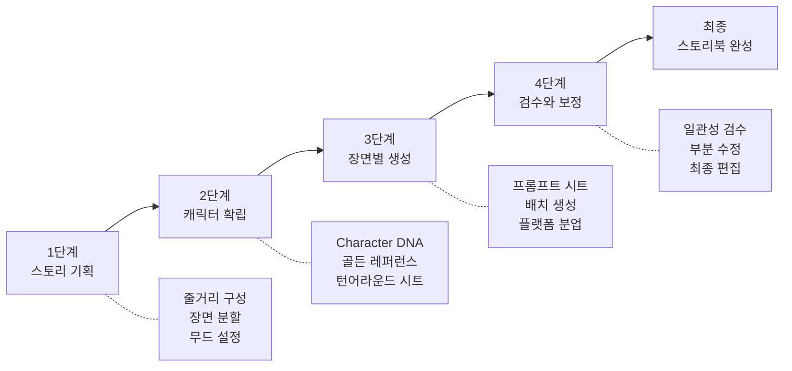
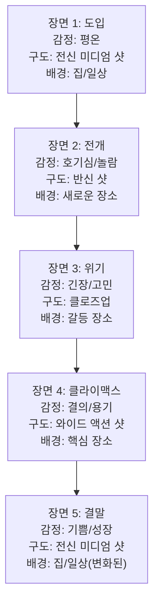
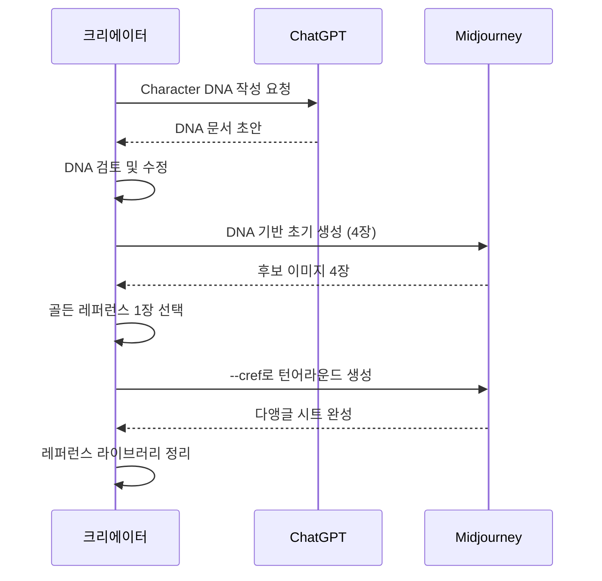
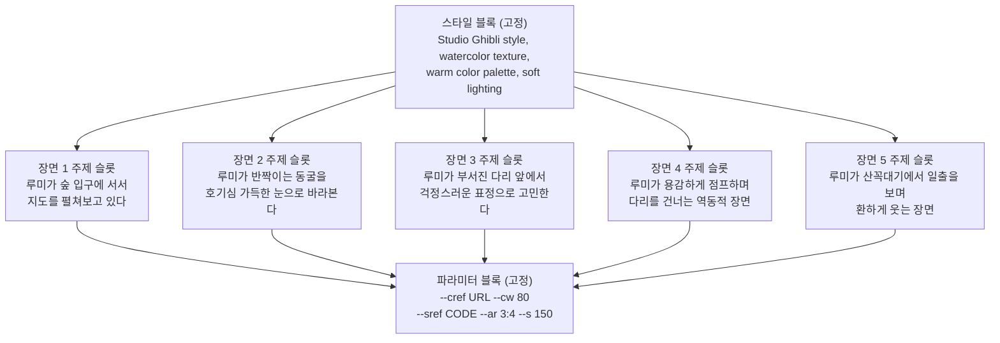
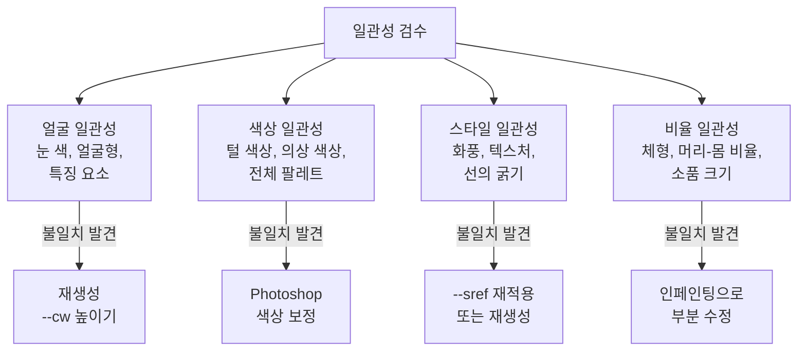

# 일관성 실전 프로젝트 — 캐릭터 스토리북

> 챕터 8에서 배운 모든 기법을 통합하여, 하나의 캐릭터가 5개 장면에 일관되게 등장하는 미니 스토리북을 완성합니다.

## 개요

이 섹션은 챕터 8의 종합 프로젝트입니다. [캐릭터 일관성 전략](08-ch8-캐릭터브랜드-스타일-일관성-유지/01-01-캐릭터-일관성의-도전과-전략.md)에서 배운 Character DNA, [캐릭터 시트 제작](08-ch8-캐릭터브랜드-스타일-일관성-유지/02-02-캐릭터-시트와-턴어라운드-제작.md)의 턴어라운드 기법, [브랜드 스타일 가이드](08-ch8-캐릭터브랜드-스타일-일관성-유지/03-03-브랜드-스타일-가이드-구축.md)의 --sref 코드 관리, 그리고 [시리즈 콘텐츠 워크플로우](08-ch8-캐릭터브랜드-스타일-일관성-유지/04-04-시리즈-콘텐츠-제작-워크플로우.md)의 4단계 파이프라인을 하나의 프로젝트로 엮어 실전 경험을 쌓습니다.

**선수 지식**: Ch8의 1~4 섹션 전체 (Character DNA, 캐릭터 시트, 스타일 가이드, 시리즈 워크플로우)
**학습 목표**:
- Character DNA 작성부터 최종 시퀀스 완성까지 전체 파이프라인을 직접 실행할 수 있다
- 5개 장면에 걸쳐 캐릭터와 스타일의 일관성을 90% 이상 유지할 수 있다
- 일관성 검수 체크리스트로 결과물을 자가 평가하고 개선할 수 있다

## 왜 알아야 할까?

지금까지 Character DNA, 턴어라운드 시트, --cref/--sref, 프롬프트 프리셋을 개별적으로 배웠는데요. 문제는 이 기법들을 **따로따로** 연습하는 것과 **하나의 프로젝트에서 동시에** 적용하는 것이 완전히 다른 경험이라는 점입니다.

마치 요리를 배울 때, 칼질·양념·화력 조절을 각각 연습하는 것과 실제로 코스 요리를 처음부터 끝까지 만드는 것이 다른 것처럼요. 개별 기술을 알아도 순서, 타이밍, 조합을 모르면 결과물이 들쑥날쑥해집니다.

실제 현업에서도 "캐릭터 일러스트 5장 만들어주세요"라는 의뢰는 매우 흔합니다. SNS 카드뉴스, 아동용 그림책, 브랜드 마스코트 시리즈 등 **일관된 캐릭터가 여러 장면에 등장하는 콘텐츠**는 수요가 끊이지 않거든요. 이 프로젝트를 완성하면 그런 실무 의뢰에 바로 대응할 수 있는 역량을 갖추게 됩니다.

## 핵심 개념

### 프로젝트 전체 파이프라인

이번 프로젝트는 [시리즈 콘텐츠 워크플로우](08-ch8-캐릭터브랜드-스타일-일관성-유지/04-04-시리즈-콘텐츠-제작-워크플로우.md)에서 배운 4단계 파이프라인을 스토리북에 맞게 확장한 것입니다.

> 💡 **비유**: 영화 제작에 비유하면 이해가 쉽습니다. 시나리오 작성(기획) → 배우 캐스팅 및 의상 피팅(캐릭터 확립) → 장면별 촬영(배치 생성) → 편집 및 색보정(검수·보정)으로 이어지는 흐름이죠.

> 📊 **그림 1**: 캐릭터 스토리북 프로젝트 전체 파이프라인



전체 소요 시간은 숙련도에 따라 다르지만, 처음이라면 **3~5시간** 정도를 잡는 것이 현실적입니다. 숙련되면 1~2시간까지 단축할 수 있어요.

---

### 1단계: 스토리 기획 — 이야기의 뼈대 만들기

> 💡 **비유**: 건축에서 설계도 없이 건물을 짓지 않듯, 스토리 기획 없이 이미지를 생성하면 장면 간 연결이 끊어지고 분위기가 중구난방이 됩니다.

스토리북의 기획 단계에서 가장 중요한 것은 **장면 분할**입니다. 5개 장면이라는 제한 안에서 기승전결을 담아야 하니까요.

**5장면 스토리 구조 (3막 구조 응용)**:

| 장면 | 역할 | 서사적 기능 |
|------|------|------------|
| 장면 1 | 도입 | 캐릭터 소개, 일상/배경 설정 |
| 장면 2 | 전개 | 사건 발생, 캐릭터의 반응 |
| 장면 3 | 위기/전환 | 갈등의 정점 또는 중요한 발견 |
| 장면 4 | 클라이맥스 | 문제 해결 또는 변화의 순간 |
| 장면 5 | 결말 | 성장/변화 후의 새로운 일상 |

**장면 기획 시 시각적으로 고려할 요소들**:
- **배경 다양성**: 5장면이 모두 같은 장소면 단조롭습니다. 최소 2~3개의 다른 배경을 사용하세요
- **감정 곡선**: 장면마다 캐릭터의 감정이 달라야 이야기가 살아납니다 (평온 → 놀람 → 고민 → 결의 → 기쁨)
- **구도 변화**: 전신·반신·클로즈업을 섞어야 시각적 리듬이 생깁니다
- **시간대/조명**: 아침·낮·저녁·밤 등 시간 변화로 서사에 깊이를 더합니다

> 📊 **그림 2**: 장면별 감정 곡선과 구도 계획



ChatGPT를 활용하면 스토리 기획 단계를 크게 가속할 수 있습니다. "8세 아동을 위한 5장면 미니 스토리를 기획해줘. 주인공은 호기심 많은 여우 캐릭터이고, 숲속 모험을 주제로 해줘."처럼 구체적으로 요청하면 장면 분할까지 한 번에 제안받을 수 있어요.

> 🔥 **실무 팁**: 장면 기획 단계에서 각 장면의 **썸네일 스케치**를 간단히 그려보세요. 막대 인간 수준이어도 괜찮습니다. 구도와 배치를 미리 시각화하면 프롬프트 작성이 훨씬 수월해집니다. 이걸 업계에서는 "스토리보드"라고 부르죠.

---

### 2단계: 캐릭터 확립 — 골든 레퍼런스 확보하기

이 단계가 전체 프로젝트의 **성패를 결정**합니다. 여기에 전체 시간의 30~40%를 투자하는 것이 정상입니다. 급하게 넘어가면 뒤에서 수정에 더 많은 시간이 들거든요.

> 💡 **비유**: 디즈니 애니메이션 스튜디오에서 캐릭터 하나를 확정하기까지 수백 장의 스케치를 그린다고 합니다. AI 생성에서도 마찬가지예요. 골든 레퍼런스 한 장을 제대로 뽑아두면 나머지 장면 생성이 훨씬 수월합니다.

> 📊 **그림 3**: 캐릭터 확립 워크플로우



**2-1. Character DNA 작성**

[캐릭터 일관성의 도전과 전략](08-ch8-캐릭터브랜드-스타일-일관성-유지/01-01-캐릭터-일관성의-도전과-전략.md)에서 배운 Character DNA 형식을 그대로 사용합니다. 핵심은 **변하지 않는 시각적 앵커**를 명확하게 정의하는 것이에요.

스토리북용 Character DNA에는 일반적인 DNA에 더해 **감정 표현 범위**를 추가하는 것이 좋습니다. 5개 장면에서 최소 3가지 이상의 감정을 표현해야 하니까요.

**예시 — "모험가 여우 루미" Character DNA**:

| 항목 | 설명 |
|------|------|
| 종류/성별 | 의인화된 여우, 여성형 |
| 체형 | 작고 날씬한 체형, 큰 눈, 긴 꼬리 |
| 색상 | 주황빛 오렌지 털, 크림색 배, 에메랄드 그린 눈 |
| 의상 | 남색 망토, 갈색 가죽 배낭, 빨간 스카프 |
| 특징 요소 | 왼쪽 귀에 작은 별 모양 무늬 |
| 감정 범위 | 평온-호기심-놀람-걱정-기쁨 |
| 스타일 | Studio Ghibli 느낌, 수채화 텍스처, 따뜻한 톤 |

**2-2. 골든 레퍼런스 확보**

Midjourney에서 Character DNA를 바탕으로 초기 이미지를 생성합니다. 이때 핵심 전략은 **단순한 배경에서 캐릭터를 또렷하게** 뽑는 것입니다.

초기 생성 프롬프트의 구조:

```
[캐릭터 상세 묘사], [스타일 키워드], simple clean background, 
character design sheet style --ar 3:4 --stylize 100
```

4장의 결과물 중에서 **캐릭터의 핵심 특징이 가장 잘 드러난 1장**을 골든 레퍼런스로 선택합니다. 이 이미지가 이후 모든 생성의 기준점이 됩니다.

> ⚠️ **흔한 오해**: "가장 예쁜 이미지를 골든 레퍼런스로 선택하면 된다"고 생각하기 쉬운데요. 사실은 **특징 요소가 가장 또렷한 이미지**를 골라야 합니다. 아무리 예뻐도 별 무늬가 보이지 않거나 스카프가 빠져 있으면 다음 장면에서 일관성을 유지하기 어려워요.

**2-3. 턴어라운드 시트 생성**

골든 레퍼런스를 확보했으면 --cref를 활용해 다양한 앵글의 레퍼런스를 확보합니다.

```
[캐릭터 묘사], front view and three-quarter view and side view, 
character turnaround sheet, white background 
--cref [골든 레퍼런스 URL] --cw 100 --ar 16:9
```

Midjourney V7에서는 Omni Reference(--oref)로 기존 --cref를 대체할 수 있습니다. --oref는 캐릭터뿐 아니라 사물, 동물 등에도 폭넓게 적용되며, --ow(omni weight) 파라미터로 참조 강도를 0~1000 범위에서 조절합니다. 기본값 100이며, 스토리북처럼 강한 일관성이 필요하면 100~150 사이를 권장합니다.

---

### 3단계: 장면별 생성 — 프롬프트 시트와 배치 생성

이제 본격적으로 5개 장면을 생성합니다. 여기서 핵심은 **프롬프트 시트**를 먼저 완성한 뒤 순서대로 생성하는 것입니다.

> 💡 **비유**: 레스토랑에서 코스 요리를 준비할 때, 셰프는 모든 요리의 레시피를 먼저 정리하고 재료를 손질한 뒤에 순서대로 조리합니다. 한 접시 만들고 다음 걸 고민하면 타이밍이 엉망이 되죠. 프롬프트 시트가 바로 그 레시피 목록입니다.

**프롬프트 시트 구조**:

프롬프트 시트는 [시리즈 콘텐츠 워크플로우](08-ch8-캐릭터브랜드-스타일-일관성-유지/04-04-시리즈-콘텐츠-제작-워크플로우.md)에서 배운 3단 구조(스타일 블록 + 주제 슬롯 + 파라미터 블록)를 따릅니다.

> 📊 **그림 4**: 프롬프트 시트의 3단 구조와 장면별 적용



**장면별 프롬프트 작성 예시** (모험가 여우 루미):

| 장면 | 주제 슬롯 핵심 내용 | 감정 | 구도 |
|------|---------------------|------|------|
| 1 | 숲 입구에서 지도를 펼쳐보는 루미 | 설렘/기대 | 전신 미디엄 샷 |
| 2 | 반짝이는 동굴 입구를 발견한 루미 | 호기심/놀람 | 반신 로우앵글 |
| 3 | 끊어진 다리 앞에서 고민하는 루미 | 걱정/긴장 | 클로즈업 |
| 4 | 용감하게 뛰어오르는 루미 | 결의/용기 | 와이드 다이내믹 샷 |
| 5 | 산꼭대기에서 일출을 바라보며 미소 짓는 루미 | 기쁨/성취감 | 반신 백라이트 |

**배치 생성 전략**:

1. **장면 1을 먼저 생성하고 확인**: 골든 레퍼런스와 --cref의 조합이 의도대로 작동하는지 검증
2. **문제가 없으면 2~5를 연속 생성**: 동일한 스타일 블록 + 파라미터 블록을 유지
3. **각 장면마다 4장씩 생성**: 최선의 결과물을 선택하기 위해

> 🔥 **실무 팁**: 감정 표현이 크게 바뀌는 장면(예: 걱정 → 기쁨)에서는 --cw 값을 조금 낮춰보세요. --cw 100이면 의상과 헤어까지 완전히 고정하기 때문에 역동적인 자세에서 부자연스러울 수 있습니다. --cw 60~80 정도면 얼굴 특징은 유지하면서 포즈와 의상에 자연스러운 변화를 줄 수 있습니다.

**플랫폼별 분업 전략**:

모든 장면을 Midjourney만으로 해결할 필요는 없습니다.

- **Midjourney**: 메인 장면 생성 (--cref/--oref + --sref로 일관성 최대화)
- **ChatGPT (GPT-4o)**: 스토리 기획, 프롬프트 초안 작성, 텍스트가 포함된 표지/엔딩 페이지
- **Adobe Photoshop + Firefly**: 생성된 이미지의 미세 보정 (색감 통일, 요소 제거/추가, 텍스트 삽입)

---

### 4단계: 검수와 보정 — 일관성 품질 관리

5개 장면을 모두 생성했다면, 이제 가장 중요한 **일관성 검수** 단계입니다. 한 번에 완벽한 일관성을 달성하는 것은 현재 AI 기술로는 사실상 불가능하기 때문에, 검수와 보정은 필수 과정입니다.

> 💡 **비유**: 사진작가가 촬영을 마치고 라이트룸에서 전체 사진의 색감을 통일하는 "후보정" 과정과 같습니다. 촬영(생성)이 80%이고, 후보정(검수·보정)이 나머지 20%를 채워주는 거죠.

> 📊 **그림 5**: 일관성 검수 4대 카테고리와 보정 방법



**일관성 검수 체크리스트**:

5장의 이미지를 나란히 놓고 다음 항목을 점검합니다:

| 카테고리 | 체크 항목 | 목표 일치율 |
|----------|----------|------------|
| 얼굴/외형 | 눈 색상, 얼굴형, 특징 마크(별 무늬 등) | 95%+ |
| 헤어/털 | 색상 톤, 길이, 스타일 | 90%+ |
| 의상 | 핵심 아이템(망토, 스카프 등), 색상 | 85%+ |
| 체형 | 머리-몸 비율, 전체 실루엣 | 85%+ |
| 스타일 | 화풍, 색감 톤, 선의 질감 | 90%+ |

**보정 전략 — 문제별 해결법**:

**얼굴/외형이 달라졌을 때**: 해당 장면만 --cw 값을 올려서(90~100) 재생성합니다. 그래도 안 되면 골든 레퍼런스를 변경하기보다는, [인페인팅](06-ch6-이미지-편집-기법-img2img인페인팅아웃페인팅/02-02-인페인팅-기초-부분-수정의-기술.md)으로 얼굴 부분만 수정하는 것이 효율적입니다.

**색감이 장면마다 다를 때**: 이건 AI 생성 시 흔히 발생하는 문제입니다. 배경이 어두운 장면에서는 캐릭터 색상도 함께 어두워지거든요. Adobe Photoshop의 색조/채도 조정 레이어를 사용해 전체 시리즈의 캐릭터 색상을 통일하는 것이 가장 빠른 해결법입니다.

**스타일 드리프트가 발생했을 때**: [브랜드 스타일 가이드](08-ch8-캐릭터브랜드-스타일-일관성-유지/03-03-브랜드-스타일-가이드-구축.md)에서 배운 --sref 코드를 확인하세요. 특정 장면에서 --sref를 빼먹었거나, --sw 값이 달랐을 수 있습니다.

## 실습: 적용해보기

### 종합 실습 — "나만의 5장면 캐릭터 스토리북 만들기"

아래 워크시트를 순서대로 따라가며 스토리북을 완성해보세요.

**Step 1: 캐릭터와 스토리 결정** (20분)

아래 3가지 시나리오 중 하나를 선택하거나, 자유롭게 기획하세요:

| 시나리오 | 캐릭터 | 주제 |
|----------|--------|------|
| A. 카페 고양이의 하루 | 카페를 운영하는 고양이 | 특별한 손님을 맞이하는 이야기 |
| B. 우주 탐험가 로봇 | 작은 로봇 탐험가 | 미지의 행성에서 친구를 찾는 이야기 |
| C. 꽃집 소녀의 마법 | 꽃집을 가꾸는 소녀 | 시든 정원을 되살리는 이야기 |

**Step 2: Character DNA 작성** (15분)

아래 빈칸을 채우세요:

- 캐릭터 이름: _______________
- 종류/성별: _______________
- 체형과 비율: _______________
- 핵심 색상 (3가지): _______________
- 의상 핵심 아이템 (2~3가지): _______________
- 고유 특징 (1가지): _______________
- 5장면 감정 순서: ___ → ___ → ___ → ___ → ___
- 목표 스타일: _______________

**Step 3: 골든 레퍼런스 확보** (30분)

1. Character DNA를 기반으로 Midjourney에서 초기 프롬프트 작성
2. 4장의 후보 생성 → 1장 선택
3. 선택한 이미지로 턴어라운드 시트 생성 시도

**Step 4: 프롬프트 시트 작성** (20분)

| 장면 | 스타일 블록 | 주제 슬롯 | 감정/구도 | 파라미터 |
|------|-----------|----------|----------|---------|
| 1 | (공통) | | | (공통) |
| 2 | (공통) | | | (공통) |
| 3 | (공통) | | | (공통) |
| 4 | (공통) | | | (공통) |
| 5 | (공통) | | | (공통) |

**Step 5: 배치 생성 및 선별** (60분)

- 장면 1 생성 → 골든 레퍼런스와 비교 → 문제 없으면 진행
- 장면 2~5 순차 생성
- 장면당 4장 중 최선의 1장 선택

**Step 6: 검수와 보정** (30분)

- 5장을 나란히 놓고 일관성 체크리스트 점검
- 문제 있는 장면 재생성 또는 부분 보정

### 토론 질문

1. 5장면 중 일관성을 유지하기 가장 어려웠던 장면은 어디인가요? 왜 그런 것 같나요?
2. --cw를 100으로 고정하는 것과 장면에 따라 60~100으로 조절하는 것, 어떤 접근이 더 좋은 결과를 냈나요?
3. 만약 10장면 이상의 긴 스토리북을 만든다면, 워크플로우에서 무엇을 추가로 준비해야 할까요?

## 더 깊이 알아보기

### 디즈니의 "모델 시트" 전통에서 AI 캐릭터 시트까지

캐릭터 일관성에 대한 고민은 AI 시대에 갑자기 등장한 것이 아닙니다. 1930년대 디즈니 스튜디오에서 이미 시작된 오래된 문제거든요.

월트 디즈니가 첫 장편 애니메이션 <백설공주>(1937)를 제작할 때, 수십 명의 애니메이터가 동시에 작업하면서 캐릭터의 모습이 장면마다 달라지는 문제가 발생했습니다. 이를 해결하기 위해 도입한 것이 바로 **"모델 시트(Model Sheet)"**입니다. 캐릭터의 정면, 측면, 후면, 다양한 표정과 자세를 한 장에 정리한 이 문서가 모든 애니메이터의 기준이 되었죠.

흥미로운 점은 이 모델 시트의 구조가 우리가 만드는 **턴어라운드 시트 + 표정 시트**와 거의 동일하다는 것입니다. 90년 전 수작업으로 해결하던 문제를 지금은 AI와 --cref 파라미터로 해결하고 있는 셈이에요. 도구는 바뀌었지만 "여러 장면에서 같은 캐릭터를 유지해야 한다"는 근본적인 도전은 변하지 않았습니다.

### Omni Reference의 등장 — --cref에서 --oref로

2025년 5월, Midjourney는 V7과 함께 **Omni Reference(--oref)**를 발표했습니다. 기존 --cref가 인물 캐릭터에 특화되어 있었다면, --oref는 인물뿐 아니라 사물, 동물, 건물 등 **모든 시각적 대상**에 일관성을 적용할 수 있습니다. --ow(omni weight) 파라미터는 0~1000이라는 넓은 범위를 제공하여 훨씬 세밀한 조절이 가능하죠.

스토리북 제작에서 이것이 중요한 이유는, 캐릭터뿐 아니라 **캐릭터가 들고 다니는 소품**(배낭, 지팡이 등)의 일관성도 관리할 수 있게 되었기 때문입니다. 단, GPU 시간이 2배 소요되므로 비용 효율을 고려해야 합니다.

## 흔한 오해와 팁

> ⚠️ **흔한 오해**: "골든 레퍼런스를 한 번 정하면 끝까지 바꾸면 안 된다"고 생각하는 분이 많습니다. 사실 3단계에서 특정 장면이 반복적으로 실패하면, **장면에 특화된 보조 레퍼런스**를 추가로 만드는 것이 훨씬 효율적입니다. 예를 들어 뒷모습이 필요한 장면에서 정면 골든 레퍼런스만으로는 한계가 있을 수 있어요. 이럴 때 턴어라운드 시트에서 뽑은 뒷면 이미지를 보조 --cref로 사용하면 됩니다.

> 💡 **알고 계셨나요?**: 픽사(Pixar)의 <토이 스토리>(1995)는 캐릭터 일관성을 위해 3D 모델을 사용한 최초의 장편 애니메이션입니다. 3D 모델이 있으면 어떤 각도에서든 동일한 캐릭터를 렌더링할 수 있기 때문에 일관성 문제가 구조적으로 해결되었죠. AI 이미지 생성에서 --cref가 하는 역할도 본질적으로 이 3D 모델의 역할과 같습니다 — "다양한 장면에서 동일한 대상을 재현할 수 있는 참조점"을 제공하는 것이죠.

> 🔥 **실무 팁**: 스토리북의 첫 장면과 마지막 장면을 **비슷한 구도로 촬영**하는 "북엔드(Bookend) 기법"을 추천합니다. 예를 들어 장면 1이 집 앞에서 출발하는 모습이라면, 장면 5는 같은 집 앞으로 돌아오는 모습으로. 같은 구도를 사용하면 --cref의 일관성도 높아지고, 스토리적으로도 성장과 변화를 대비시키는 효과가 있습니다.

## 핵심 정리

| 개념 | 설명 |
|------|------|
| 4단계 파이프라인 | 스토리 기획 → 캐릭터 확립 → 장면별 생성 → 검수와 보정 |
| 골든 레퍼런스 | 모든 장면의 기준이 되는 캐릭터 대표 이미지. "예쁜 이미지"보다 "특징이 또렷한 이미지"를 선택 |
| 프롬프트 시트 | 스타일 블록(고정) + 주제 슬롯(장면별 변경) + 파라미터 블록(고정)의 3단 구조 |
| --cw 조절 전략 | 정적 장면은 --cw 90~100, 역동적/감정 변화 장면은 --cw 60~80으로 유연하게 |
| Omni Reference | Midjourney V7의 --oref. --cref를 대체하며 모든 시각 대상에 적용 가능. --ow 100~150 권장 |
| 일관성 검수 4대 카테고리 | 얼굴, 색상, 스타일, 비율 — 각각 85~95% 일치 목표 |
| 보정 전략 | 재생성, 인페인팅, 색상 보정, --sref 재적용 등 문제별 최적 방법 선택 |
| 북엔드 기법 | 첫 장면과 마지막 장면을 유사 구도로 구성하여 일관성과 서사를 동시에 강화 |

## 다음 섹션 미리보기

축하합니다! 챕터 8 "캐릭터·브랜드 스타일 일관성 유지"를 모두 마쳤습니다. Character DNA 작성, 캐릭터 시트 제작, 브랜드 스타일 가이드 구축, 시리즈 워크플로우, 그리고 이번 종합 프로젝트까지 — 일관성의 A to Z를 모두 다루었네요.

다음 챕터 [Ch9. Adobe Photoshop + Firefly 리터치 워크플로우](09-ch9-adobe-photoshop-firefly-리터치-워크플로우/01-01-adobe-firefly-웹앱-핵심-기능.md)에서는 AI로 생성한 이미지를 **전문가 수준으로 다듬는** 후처리 기법을 본격적으로 배웁니다. 이번 프로젝트에서 "검수와 보정" 단계에 Photoshop을 사용했다면, 다음 챕터에서 그 기능들을 훨씬 깊이 있게 다루게 됩니다.

## 참고 자료

- [Character Consistency in AI: Cohesive IP Design Guide 2025 (Lovart)](https://www.lovart.ai/blog/ai-character-consistency) - 캐릭터 일관성 유지를 위한 종합 가이드. Character DNA, 레퍼런스 시트, 품질 감사 기법을 체계적으로 정리
- [Midjourney Character Reference 공식 문서](https://docs.midjourney.com/hc/en-us/articles/32162917505293-Character-Reference) - --cref와 --cw 파라미터의 공식 사용법과 제한사항
- [Midjourney Style Reference 공식 문서](https://docs.midjourney.com/hc/en-us/articles/32180011136653-Style-Reference) - --sref를 활용한 스타일 일관성 유지 방법
- [Midjourney Omni Reference 공식 문서](https://docs.midjourney.com/hc/en-us/articles/36285124473997-Omni-Reference) - V7의 --oref/--ow 파라미터 사용법
- [Create Children's Books with Consistent Characters Using Midjourney, ChatGPT, and Canva (TitanXT)](https://www.titanxt.io/post/create-childrens-books-with-consistent-characters-using-midjourney-chatgpt-and-canva) - 그림책 제작에 AI 도구를 조합하는 실전 워크플로우

---
### 🔗 Related Sessions
- [character dna](08-ch8-캐릭터브랜드-스타일-일관성-유지/01-01-캐릭터-일관성의-도전과-전략.md) (prerequisite)
- [골든 레퍼런스](08-ch8-캐릭터브랜드-스타일-일관성-유지/01-01-캐릭터-일관성의-도전과-전략.md) (prerequisite)
- [스타일 드리프트](08-ch8-캐릭터브랜드-스타일-일관성-유지/04-04-시리즈-콘텐츠-제작-워크플로우.md) (prerequisite)
