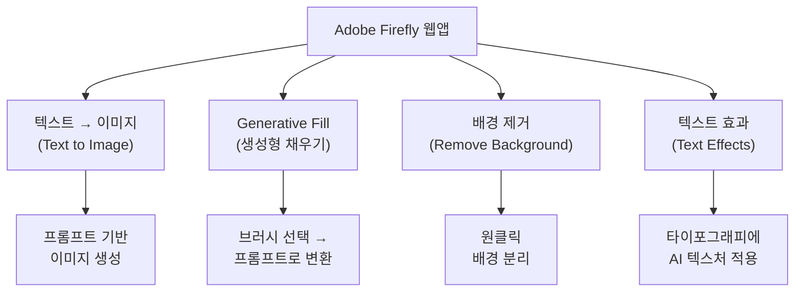
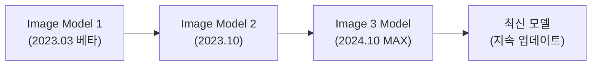
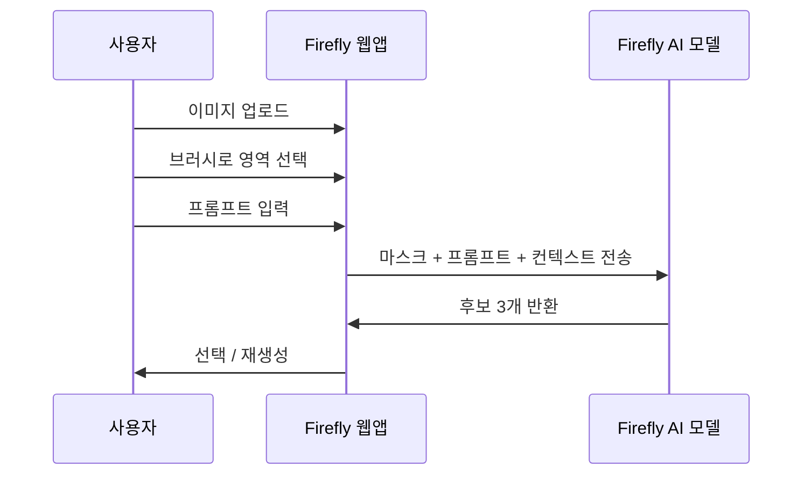

# 01. Adobe Firefly 웹앱 핵심 기능

> Firefly 웹앱 하나로 텍스트→이미지, Generative Fill, 배경 제거, 텍스트 효과까지 — 상업적으로 안전한 AI 크리에이티브 워크플로우를 시작합니다.

## 개요

Adobe Firefly 웹앱(firefly.adobe.com)은 브라우저에서 바로 사용할 수 있는 올인원 AI 크리에이티브 스튜디오입니다. Adobe Stock 라이선스 이미지, Creative Commons, 퍼블릭 도메인 콘텐츠만으로 학습했기 때문에 생성 결과물을 상업적으로 안전하게 사용할 수 있으며, Photoshop·Illustrator·Express와 긴밀하게 연결되어 생성→편집→완성까지 하나의 파이프라인 안에서 끝낼 수 있습니다.

## Firefly 웹앱의 4대 핵심 기능

Firefly 웹앱에 접속하면 네 가지 핵심 기능이 대시보드 형태로 펼쳐집니다.



- **텍스트→이미지**: 프롬프트를 입력하면 한 번에 4장의 이미지를 생성합니다. 스타일 옵션 UI로 콘텐츠 유형, 색상, 조명, 구도를 세밀하게 제어할 수 있습니다.
- **Generative Fill**: 이미지를 업로드하고 브러시로 영역을 칠한 뒤 프롬프트를 입력하면 해당 영역만 AI가 새롭게 생성합니다. 객체 추가·교체·제거 세 가지 모드로 활용합니다.
- **배경 제거**: 이미지에서 피사체를 자동 감지하고 배경을 투명하게 분리합니다. 결과물은 투명 배경 PNG로 즉시 다운로드 가능합니다.
- **텍스트 효과**: 입력한 텍스트에 AI가 텍스처와 재질을 입혀 장식적 타이포그래피를 만들어냅니다. 투명 배경 PNG로 제공되어 디자인에 바로 활용할 수 있습니다.

이 네 기능은 **조합**할 때 진가를 발휘합니다. 텍스트→이미지로 배경 생성 → 배경 제거로 제품 피사체 분리 → Generative Fill로 합성 → 텍스트 효과로 헤드라인 제작, 이런 식이죠.

## 텍스트→이미지 — Firefly만의 차별점

Firefly의 이미지 모델은 지속적으로 업데이트됩니다. 웹앱에 접속하면 항상 최신 모델이 적용되어 있으므로 구체적인 모델 번호보다 최신 버전을 사용하고 있다는 점이 중요합니다.



**도구별 비교:**

| 비교 항목 | Firefly | ChatGPT (GPT-4o) | Midjourney |
|-----------|---------|-------------------|------------|
| 상업적 안전성 | 매우 높음 (라이선스 데이터 학습) | 보통 | 보통 |
| 프롬프트 스타일 | 자연어 + 스타일 옵션 UI | 대화형 자연어 | 키워드 + 파라미터 |
| 한 번에 생성 수 | 4장 | 1장 | 4장 |
| 스타일 조정 | UI 패널 (콘텐츠 유형, 색상, 조명 등) | 대화로 수정 | 파라미터 (--s, --ar 등) |
| 생태계 연동 | Photoshop, Illustrator, Express 직결 | 독립적 | 독립적 |

### 텍스트→이미지 프롬프트 실전

기본 제품 사진 생성:

```
A minimalist flat lay photo of skincare products on a marble surface, soft natural lighting, editorial style
```


건축 시각화:

```
Modern glass office building exterior at golden hour, surrounded by landscaped gardens, architectural photography
```

음식 촬영 스타일:

```
Overhead shot of Korean bibimbap in a stone bowl, steam rising, dark wooden table background, food photography
```


인물 포트레이트:

```
Professional headshot of a young woman in business attire, neutral gray background, studio lighting, sharp focus
```

## Generative Fill — 브러시로 정밀 편집

Generative Fill은 이미지의 특정 영역만 선택하여 AI로 새롭게 생성하는 기능입니다. 브라우저에서 별도 설치 없이 바로 사용할 수 있습니다.



### Generative Fill 프롬프트 실전

**객체 추가** — 빈 테이블 위에 소품 배치:

```
A steaming cup of latte with latte art on a white saucer
```


**객체 교체** — 모델 의상 변경:

```
Elegant red silk evening dress with V-neckline
```

**객체 제거** — 프롬프트 없이 영역만 선택하면 주변 맥락에 맞게 자연스럽게 채워집니다:

```
(프롬프트 비워두기 — 빈 입력으로 생성)
```


**배경 계절 변경:**

```
Snowy winter landscape with bare trees and soft overcast sky
```

## 배경 제거 — 원클릭 피사체 분리

이미지를 업로드하면 AI가 자동으로 피사체를 감지하고 배경을 투명하게 만들어줍니다. 제품 사진, SNS 콘텐츠 제작에서 가장 자주 쓰이는 기능입니다.

**결과물 품질 평가 포인트:**

| 평가 항목 | 우수 | 보통 | 미흡 |
|-----------|------|------|------|
| 머리카락/털 경계 | 자연스러운 반투명 처리 | 약간의 후광(Halo) | 뭉개지거나 잘림 |
| 반투명 객체 (유리, 그림자) | 반투명도 유지 | 일부 손실 | 완전 제거됨 |
| 복잡한 배경 | 정확한 분리 | 일부 오검출 | 배경 잔여물 남음 |
| 다중 피사체 | 모두 정확히 분리 | 주요 피사체만 분리 | 일부 누락 |

배경 제거 결과가 만족스럽지 않을 때는 Photoshop의 **Select and Mask**로 정밀 보정하는 것이 일반적인 실무 워크플로우입니다.


## 텍스트 효과 — 타이포그래피에 생명 불어넣기

텍스트 효과는 Firefly만의 독특한 기능으로, 글자 형태를 유지하면서 프롬프트로 지정한 텍스처와 스타일을 AI가 적용합니다.

### 텍스트 효과 프롬프트 실전

여름 세일 헤드라인:

```
Tropical ocean waves with white sand and seashells
```


금속 로고 시안:

```
Brushed stainless steel with subtle reflections
```

자연 테마 타이틀:

```
Fresh green moss and tiny wildflowers growing on stone
```


네온 사인 느낌:

```
Glowing pink and blue neon tubes against dark brick wall
```

## 실습: 적용해보기

### 기능 매칭 워크시트

아래 시나리오에 적합한 Firefly 기능을 매칭해보세요.

| 시나리오 | 적합한 기능 | 이유 |
|----------|------------|------|
| 쇼핑몰 제품 사진의 배경을 흰색으로 교체 | ? | |
| "SPRING COLLECTION" 타이틀에 꽃 텍스처 적용 | ? | |
| 카페 인테리어 사진에서 벽의 그림을 교체 | ? | |
| 완성되지 않은 건물의 완공 예상 이미지 | ? | |
| 팀 사진에서 빠진 동료를 자연스럽게 추가 | ? | |

**정답**: 1) 배경 제거 → 흰 배경 합성 / 2) 텍스트 효과 / 3) Generative Fill (교체) / 4) 텍스트→이미지 / 5) Generative Fill (추가)

### 품질 평가 체크리스트

Firefly로 이미지를 생성한 후 아래 기준으로 1~5점 채점합니다:

- **프롬프트 충실도**: 설명한 내용이 정확히 반영되었는가?
- **시각적 자연스러움**: 왜곡된 손가락, 비현실적 그림자 등이 없는가?
- **해상도와 디테일**: 확대했을 때 디테일이 살아있는가?
- **스타일 일관성**: 여러 장 생성 시 톤이 일관되는가?
- **실무 활용도**: 그대로 납품하거나 후보정 후 사용할 수 있는가?

## 팁과 주의사항

- **Photoshop 없이도 사용 가능**: Firefly 웹앱은 독립적인 웹 서비스로, Adobe 계정만 있으면 Photoshop 구독 없이도 모든 기능을 사용할 수 있습니다.
- **스타일 옵션 패널 적극 활용**: 프롬프트만으로 스타일을 제어하지 말고, 콘텐츠 유형(사진/아트), 스타일 프리셋, 색상 톤, 조명, 구도 옵션을 조합하면 훨씬 빠르게 원하는 결과에 도달합니다.
- **Generative Fill 브러시 크기**: 교체 영역보다 살짝 크게 잡아야 경계 블렌딩이 자연스럽습니다. 너무 딱 맞게 마스킹하면 경계선이 부자연스러워집니다.
- **Generative Credit 관리**: AI 생성 시마다 크레딧이 소모됩니다. 구독 플랜에 따라 월별 할당량이 다르며, 소진 후에도 속도가 느려질 뿐 완전 차단되지는 않습니다.
- **최신 모델은 고해상도 네이티브 생성**을 지원합니다. 이전 모델의 업스케일링 방식과 달리 처음부터 고해상도로 생성하므로 디테일 손실이 적습니다.

## 핵심 정리

| 개념 | 설명 |
|------|------|
| Firefly 웹앱 | 브라우저 접속 가능한 Adobe의 올인원 AI 크리에이티브 스튜디오 |
| 텍스트→이미지 | 프롬프트 + 스타일 옵션으로 4장 동시 생성. 고해상도 네이티브 지원 |
| Generative Fill | 브러시 영역 선택 → 프롬프트로 객체 추가/교체/제거 |
| 배경 제거 | 원클릭 피사체 분리, 투명 배경 PNG 제공 |
| 텍스트 효과 | 타이포그래피에 AI 텍스처 적용, 투명 배경으로 바로 활용 |
| 상업적 안전성 | Adobe Stock, CC 라이선스, 퍼블릭 도메인만으로 학습 |
| Generative Credit | AI 생성 시 소모되는 크레딧 시스템, 구독 플랜별 할당량 상이 |

## 다음 섹션 미리보기

다음 섹션 **Photoshop Generative Fill 마스터**에서는 웹앱보다 훨씬 정밀한 선택 도구(올가미, 펜 도구, Select and Mask)와 Generative Fill을 조합하여 전문가 수준의 합성과 편집을 수행하는 방법을 배웁니다.
