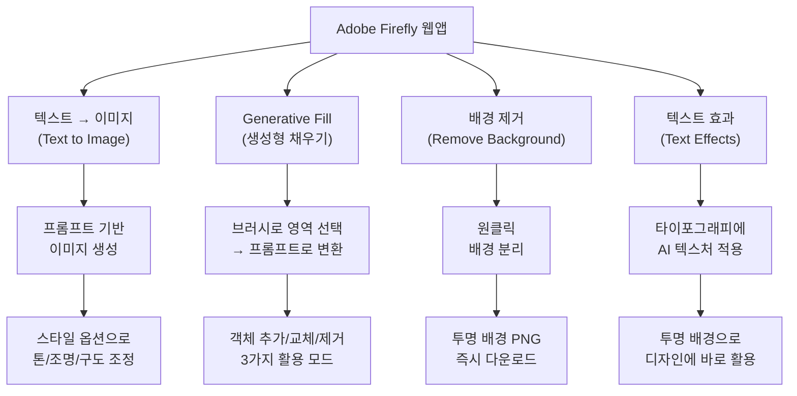
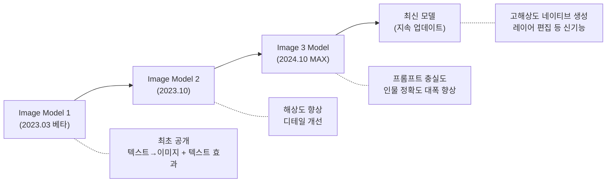
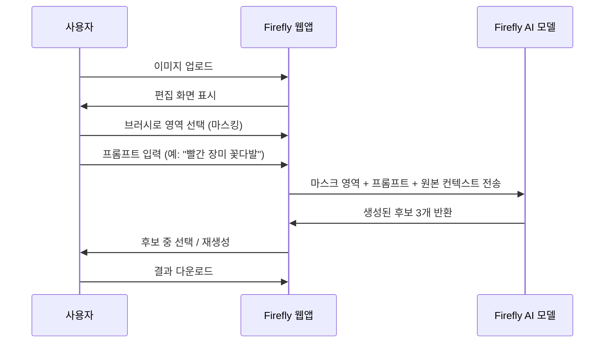
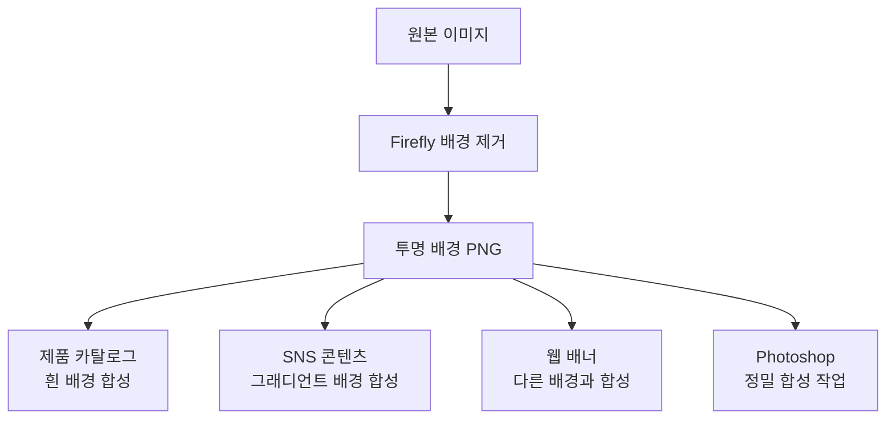
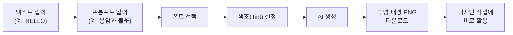

# 01. Adobe Firefly 웹앱 핵심 기능

> Adobe의 생성형 AI 플랫폼 Firefly 웹앱의 핵심 기능을 익히고, 텍스트→이미지 생성부터 Generative Fill, 배경 제거, 텍스트 효과까지 실무에서 바로 활용하는 방법을 배웁니다.

## 개요

이 섹션에서는 Adobe Firefly 웹앱에서 제공하는 주요 AI 기능을 하나씩 살펴봅니다. 지금까지 ChatGPT, Gemini, Midjourney로 이미지를 생성하고 편집하는 법을 배웠다면, 이제는 **전문 크리에이티브 도구 생태계** 안에서 AI를 활용하는 단계로 넘어갈 차례입니다. Firefly는 Photoshop, Illustrator, Express와 긴밀하게 연결되어 있어서, 생성한 결과물을 곧바로 전문 편집 워크플로우로 이어갈 수 있다는 점이 가장 큰 차이점이죠.

**선수 지식**: [Ch1에서 배운 Adobe Firefly와 크리에이티브 생태계 개요](01-ch1-ai-이미지-생성-개론/03-03-adobe-firefly와-크리에이티브-생태계.md), [Ch6의 인페인팅 기초](06-ch6-이미지-편집-기법-img2img인페인팅아웃페인팅/02-02-인페인팅-기초-부분-수정의-기술.md)

**학습 목표**:
- Firefly 웹앱의 4대 핵심 기능(텍스트→이미지, Generative Fill, 배경 제거, 텍스트 효과)을 이해하고 구분할 수 있다
- 각 기능의 실무 활용 시나리오를 파악하고 적합한 작업에 매칭할 수 있다
- Firefly에서 생성한 결과물의 품질을 평가하고 개선 방향을 판단할 수 있다
- 상업적으로 안전한(Commercially Safe) AI 콘텐츠 생성의 의미를 이해한다

## 왜 알아야 할까?

디자이너가 AI 이미지 생성 도구를 실무에 도입할 때 가장 먼저 부딪히는 벽이 뭘까요? 바로 **"이거 써도 되는 거야?"**라는 질문입니다. 클라이언트에게 납품할 이미지를 Midjourney로 만들었는데, 혹시 저작권 문제가 생기진 않을까? 포트폴리오에 AI 생성 이미지를 넣었는데, 학습 데이터에 다른 작가의 작품이 포함된 건 아닐까?

Adobe Firefly는 이 질문에 대해 업계에서 가장 명확한 답을 내놓은 도구입니다. Adobe Stock의 라이선스 이미지, Creative Commons, 퍼블릭 도메인 콘텐츠만으로 학습했기 때문에, 생성 결과물을 **상업적으로 안전하게** 사용할 수 있거든요. 게다가 Firefly는 단순히 이미지를 "만드는" 도구가 아닙니다. Photoshop과 연결되면 생성 → 편집 → 완성까지 하나의 파이프라인 안에서 끝낼 수 있죠.

이번 섹션에서 Firefly 웹앱의 핵심 기능을 확실히 익혀두면, 다음 섹션부터 배울 Photoshop Generative Fill과 통합 리터치 워크플로우의 기반이 됩니다.

## 핵심 개념

### 개념 1: Firefly 웹앱의 전체 구조 — AI 크리에이티브 스튜디오

> 💡 **비유**: Firefly 웹앱을 **올인원 요리 스튜디오**라고 생각해보세요. 식재료(프롬프트)를 넣으면 요리(이미지)가 나오는 자동 조리기가 있고, 완성된 요리의 특정 부분만 바꾸는 데코레이션 도구(Generative Fill)가 있고, 접시 위의 불필요한 장식을 깔끔히 치우는 도구(배경 제거)도 있고, 예쁜 메뉴판 글씨를 만드는 도구(텍스트 효과)도 있습니다. 모두 같은 스튜디오 안에 있으니, 도구 간 이동이 자연스럽죠.

Firefly 웹앱(firefly.adobe.com)에 접속하면 여러 AI 기능이 대시보드 형태로 펼쳐집니다. 2025년 4월에 대대적으로 리디자인된 이후로, 각 기능이 훨씬 직관적으로 정리되었는데요. 핵심은 크게 네 가지 영역으로 나뉩니다.

> 📊 **그림 1**: Firefly 웹앱의 4대 핵심 기능 구조

**텍스트→이미지(Text to Image)**: 텍스트 프롬프트를 입력하면 한 번에 4장의 이미지를 생성합니다. ChatGPT나 Midjourney와 비슷한 원리지만, Adobe의 자체 모델(Firefly Image Model)을 사용한다는 점이 다릅니다.

**Generative Fill(생성형 채우기)**: 이미지를 업로드한 뒤, 브러시로 특정 영역을 칠하고 프롬프트를 입력하면 해당 영역만 AI가 새롭게 생성합니다. Ch6에서 배운 [인페인팅](06-ch6-이미지-편집-기법-img2img인페인팅아웃페인팅/02-02-인페인팅-기초-부분-수정의-기술.md)과 같은 개념이에요.

**배경 제거(Remove Background)**: 이미지에서 피사체를 자동으로 감지하고 배경을 분리합니다. 포토샵의 "배경 제거" 기능과 동일한 AI 엔진을 사용하면서도, 브라우저에서 바로 실행할 수 있죠.

**텍스트 효과(Text Effects)**: 입력한 텍스트에 AI가 텍스처, 재질, 스타일을 입혀 장식적인 타이포그래피를 만들어냅니다. "불꽃으로 타오르는 글자", "꽃으로 덮인 알파벳" 같은 효과를 몇 초 만에 생성할 수 있습니다.

이 네 기능은 독립적으로 사용할 수도 있지만, 실무에서는 **조합**해서 쓸 때 진가를 발휘합니다. 예를 들어, 텍스트→이미지로 배경을 생성하고 → 배경 제거로 제품 사진의 피사체를 분리한 뒤 → Generative Fill로 합성하고 → 텍스트 효과로 헤드라인을 만드는 식이죠.

### 개념 2: 텍스트→이미지 — Firefly만의 차별점

> 💡 **비유**: 같은 레시피(프롬프트)를 줘도 셰프마다 다른 요리가 나오듯, Firefly의 텍스트→이미지는 다른 AI 도구와 **같은 프롬프트를 넣어도 성격이 다른 결과**를 냅니다. Firefly는 "상업적으로 안전한 스톡 사진" 느낌의 깔끔한 결과를 지향하고, Midjourney는 "아트 디렉터가 연출한 작품" 느낌을 지향하죠.

Firefly의 텍스트→이미지 기능은 지속적으로 모델이 업데이트되고 있습니다. 2024년 Adobe MAX에서 공개된 **Firefly Image 3 Model**은 프롬프트 충실도(Prompt Fidelity)와 사실감이 크게 향상되었으며, Adobe는 이후로도 꾸준히 새로운 버전을 발표하고 있습니다. Firefly 웹앱에 접속하면 항상 **그 시점의 최신 모델**이 적용되어 있으므로, 구체적인 모델 번호보다는 최신 버전을 사용하고 있다는 점이 중요합니다.

> 📊 **그림 2**: Firefly 이미지 모델 진화 방향

> ⚠️ **흔한 오해**: 인터넷에서 "Firefly Image Model 4", "Image Model 5" 같은 표현을 종종 볼 수 있는데요. Adobe의 공식 명칭은 **Firefly Image 3 Model**(2024년 MAX 발표 기준)이며, 이후 모델의 공식 명칭은 발표 시점에 확인이 필요합니다. 모델 번호보다는 **Firefly 웹앱에서 항상 최신 모델이 자동 적용된다**는 점을 기억하세요. Adobe 공식 블로그나 helpx.adobe.com에서 최신 모델 정보를 확인할 수 있습니다.

**Firefly 텍스트→이미지의 실무적 강점:**

| 비교 항목 | Firefly | ChatGPT (GPT-4o) | Midjourney |
|-----------|---------|-------------------|------------|
| 상업적 안전성 | 매우 높음 (라이선스 데이터 학습) | 보통 | 보통 |
| 프롬프트 스타일 | 자연어 + 스타일 옵션 UI | 대화형 자연어 | 키워드 + 파라미터 |
| 한 번에 생성 수 | 4장 | 1장 | 4장 |
| 스타일 조정 | UI 패널 (콘텐츠 유형, 스타일, 색상, 조명 등) | 대화로 수정 | 파라미터 (--s, --ar 등) |
| 생태계 연동 | Photoshop, Illustrator, Express 직결 | 독립적 | 독립적 |

Firefly에서 텍스트→이미지를 사용하는 워크플로우는 이렇습니다:

1. **프롬프트 입력**: 텍스트 필드에 원하는 이미지를 설명합니다
2. **스타일 옵션 설정**: 우측 패널에서 콘텐츠 유형(사진/아트), 스타일 프리셋, 색상 톤, 조명, 카메라 앵글 등을 선택합니다
3. **생성 및 선택**: "Generate" 버튼을 누르면 4장의 후보가 생성되고, 마음에 드는 것을 선택합니다
4. **반복 수정**: 프롬프트를 수정하거나 설정을 변경해 다시 생성합니다

> 🔥 **실무 팁**: "Firefly는 Midjourney보다 품질이 떨어진다"라고 생각하는 분이 많은데요. Firefly Image 3 Model 이후부터는 포토리얼리즘 영역에서 매우 경쟁력 있는 결과를 보여줍니다. 특히 인물, 건축, 제품 사진 같은 상업 이미지 분야에서는 Firefly가 오히려 더 자연스러운 결과를 내는 경우도 많아요. 최신 모델은 계속 개선되고 있으니, 과거 경험으로 판단하지 말고 직접 시도해보세요.

### 개념 3: Generative Fill — 브러시 한 번으로 마법 같은 편집

> 💡 **비유**: 종이 위에 그려진 그림에서 특정 부분에 수정 테이프를 붙이고, 그 위에 새로운 그림을 그려달라고 주문하는 것과 비슷합니다. 다만 AI가 주변 맥락을 완벽하게 파악해서, 수정한 부분이 원래부터 거기 있었던 것처럼 자연스럽게 채워넣죠.

Generative Fill은 이미 존재하는 이미지에서 **특정 영역만** 선택하여 AI로 새롭게 생성하는 기능입니다. [Ch6에서 배운 인페인팅](06-ch6-이미지-편집-기법-img2img인페인팅아웃페인팅/02-02-인페인팅-기초-부분-수정의-기술.md)의 Adobe 버전이라고 할 수 있는데요, Firefly 웹앱에서는 별도 소프트웨어 설치 없이 브라우저에서 바로 사용할 수 있다는 장점이 있습니다.

> 📊 **그림 3**: Generative Fill 작업 흐름

**Generative Fill의 3가지 주요 활용 시나리오:**

**1) 객체 추가(Insert)**: 빈 테이블 위에 커피잔을 추가하거나, 풍경 사진에 사람을 넣는 작업. 브러시로 원하는 위치를 칠한 뒤, 추가할 객체를 프롬프트로 설명합니다.

**2) 객체 교체(Replace)**: 이미 있는 요소를 다른 것으로 바꾸는 작업. 예를 들어, 모델이 입고 있는 파란 셔츠를 빨간 드레스로 교체하거나, 배경의 여름 풍경을 겨울 풍경으로 바꿀 수 있습니다.

**3) 객체 제거(Remove)**: 불필요한 요소를 지우는 작업. 사진 속 지나가는 행인, 전선, 불필요한 간판 등을 선택하고 프롬프트 없이 생성하면 주변 맥락에 맞게 자연스럽게 채워집니다.

> 🔥 **실무 팁**: Generative Fill에서 브러시 크기는 교체하려는 영역보다 **살짝 크게** 잡는 것이 좋습니다. 경계 부분을 넉넉히 포함해야 AI가 자연스러운 블렌딩을 할 수 있거든요. 너무 딱 맞게 마스킹하면 경계선이 부자연스럽게 보일 수 있습니다.

### 개념 4: 배경 제거 — 원클릭 피사체 분리

> 💡 **비유**: 가위로 사진을 오려내는 대신, AI가 알아서 피사체의 윤곽을 머리카락 한 올까지 정교하게 따서 분리해주는 것과 같습니다. 예전에는 포토샵에서 펜 도구나 채널 마스킹으로 30분~1시간씩 걸리던 작업이 5초면 끝나죠.

배경 제거는 Firefly의 기능 중 가장 간단하면서도 실무에서 가장 많이 쓰이는 기능 중 하나입니다. 이미지를 업로드하면 AI가 자동으로 피사체를 감지하고 배경을 투명하게 만들어줍니다.

**결과물 품질 평가 포인트:**

| 평가 항목 | 우수 | 보통 | 미흡 |
|-----------|------|------|------|
| 머리카락/털 경계 | 자연스러운 반투명 처리 | 약간의 후광(Halo) | 뭉개지거나 잘림 |
| 반투명 객체 (유리, 그림자) | 반투명도 유지 | 일부 손실 | 완전 제거됨 |
| 복잡한 배경 (피사체와 유사한 색) | 정확한 분리 | 일부 오검출 | 배경 잔여물 남음 |
| 다중 피사체 | 모두 정확히 분리 | 주요 피사체만 분리 | 일부 누락 |

> 📊 **그림 4**: 배경 제거 후 실무 활용 파이프라인

배경 제거 결과가 만족스럽지 않을 때는 Photoshop으로 넘겨서 **Select and Mask** 기능으로 정밀 보정하는 것이 일반적인 실무 워크플로우입니다. 이 내용은 [다음 섹션 Photoshop Generative Fill](09-ch9-adobe-photoshop-firefly-리터치-워크플로우/02-02-photoshop-generative-fill-마스터.md)에서 더 자세히 다루겠습니다.

### 개념 5: 텍스트 효과 — 타이포그래피에 생명 불어넣기

> 💡 **비유**: 마치 3D 프린터가 글자 모양의 틀에 원하는 재료(불꽃, 꽃잎, 초콜릿, 금속)를 채워넣는 것과 비슷합니다. 글자의 형태는 유지하면서, 표면에 AI가 프롬프트에 맞는 텍스처를 입혀주는 거죠.

텍스트 효과(Text Effects)는 Firefly만의 독특한 기능으로, 다른 AI 이미지 생성 도구에서는 찾기 어려운 특화된 기능입니다. 입력한 텍스트의 글자 형태를 유지하면서, 프롬프트로 지정한 텍스처와 스타일을 AI가 적용하는 방식으로 작동합니다.

**텍스트 효과 활용 시나리오:**

- **SNS 헤드라인**: "SUMMER SALE" 글자를 해변과 파도 텍스처로 채우기
- **브랜드 로고 시안**: 회사명을 다양한 재질(금속, 나무, 네온)로 빠르게 시각화
- **이벤트 포스터**: 행사 제목을 주제에 맞는 텍스처(크리스마스 → 눈과 홀리, 할로윈 → 호박과 거미줄)로 장식
- **유튜브 썸네일**: 시선을 끄는 장식적 타이틀 텍스트 생성

> 📊 **그림 5**: 텍스트 효과 생성 워크플로우

텍스트 효과의 특별한 점은, 결과물이 **투명 배경 PNG**로 제공된다는 겁니다. 별도의 배경 제거 과정 없이, 생성된 텍스트를 바로 포스터나 배너 디자인에 올려놓을 수 있죠.

> 💡 **알고 계셨나요?**: 텍스트 효과 기능은 사실 Firefly가 2023년 3월 처음 공개될 때 **가장 먼저 시연된 기능** 중 하나였습니다. Adobe는 기존에도 Sensei AI로 다양한 자동화 기능을 제공해왔지만, "생성형 AI"라는 이름을 달고 대중에게 공개한 첫 번째 기능이 바로 이 텍스트 효과와 텍스트→이미지였어요. 당시 Adobe는 "우리는 크리에이터를 대체하는 게 아니라, 크리에이터에게 초능력을 주는 것"이라는 메시지로 크리에이티브 업계의 AI에 대한 불안감을 정면으로 다뤘습니다.

## 실습: 적용해보기

### 활동 1: Firefly 기능 매칭 워크시트

아래의 실무 시나리오를 읽고, 어떤 Firefly 기능을 사용해야 가장 효율적인지 매칭해보세요.

| 시나리오 | 적합한 기능 | 이유 |
|----------|------------|------|
| 쇼핑몰에 올릴 제품 사진의 배경을 흰색으로 교체해야 한다 | ? | |
| "SPRING COLLECTION" 타이틀에 꽃과 나비 텍스처를 입히고 싶다 | ? | |
| 카페 인테리어 사진에서 벽에 걸린 그림을 다른 그림으로 바꾸고 싶다 | ? | |
| 아직 완성되지 않은 건물의 완공 후 예상 이미지가 필요하다 | ? | |
| 팀 사진에서 빠진 동료를 자연스럽게 추가해야 한다 | ? | |

**정답 가이드:**
1. 배경 제거 → 투명 배경 PNG 생성 후 흰 배경에 합성
2. 텍스트 효과 → 프롬프트에 "flowers, butterflies, spring garden" 입력
3. Generative Fill → 그림 영역을 브러시로 선택 후 새로운 그림 설명 입력
4. 텍스트→이미지 → 건물 설계도나 참조 이미지를 바탕으로 완공 모습 프롬프트 작성
5. Generative Fill → 동료가 서야 할 위치를 선택하고 인물 설명 입력

### 활동 2: 품질 평가 체크리스트

Firefly로 이미지를 생성한 후, 아래 기준으로 결과물의 품질을 평가해보세요. 각 항목을 1~5점으로 채점합니다.

- **프롬프트 충실도**: 내가 설명한 내용이 얼마나 정확히 반영되었는가?
- **시각적 자연스러움**: 부자연스러운 요소(왜곡된 손가락, 비현실적인 그림자 등)가 없는가?
- **해상도와 디테일**: 확대했을 때 디테일이 살아있는가?
- **스타일 일관성**: 여러 장을 생성했을 때 톤과 스타일이 일관되는가?
- **실무 활용도**: 이 결과물을 그대로 납품하거나 후보정 후 사용할 수 있는가?

### 토론 질문

1. Firefly의 "상업적으로 안전한" 학습 데이터 정책이 디자이너에게 어떤 실질적인 이점을 줄까요? 반대로, 이 정책 때문에 생길 수 있는 제약은 무엇일까요?
2. 텍스트→이미지 생성에서 Firefly와 Midjourney를 각각 어떤 프로젝트에 쓰는 것이 좋을까요? 둘의 결과물 성격 차이를 고려해 나만의 기준을 세워보세요.

## 더 깊이 알아보기

### Adobe Firefly의 탄생 스토리

Adobe Firefly의 뿌리는 Adobe의 오래된 AI 플랫폼 **Adobe Sensei**까지 거슬러 올라갑니다. Sensei는 2016년부터 Photoshop의 "콘텐츠 인식 채우기(Content-Aware Fill)"나 Lightroom의 자동 보정 같은 기능에 AI를 접목해왔죠. 하지만 2022년, Stable Diffusion과 DALL-E 2가 등장하면서 "생성형 AI" 열풍이 불자, Adobe는 완전히 새로운 접근이 필요하다고 판단했습니다.

핵심 결정은 **학습 데이터**에 있었습니다. Stable Diffusion이 인터넷에서 무차별적으로 수집한 수십억 장의 이미지로 학습한 것과 달리, Adobe는 **자사가 라이선스를 보유한 Adobe Stock 이미지, Creative Commons 라이선스 이미지, 퍼블릭 도메인 콘텐츠**만으로 모델을 학습시키기로 결정했습니다. 이 결정은 당시 "품질이 떨어지지 않겠느냐"는 우려를 받았지만, 상업적 안전성이라는 확실한 차별점을 만들어냈죠.

2023년 3월 21일 Adobe Summit에서 Firefly가 공개되었을 때, 베타 첫 달에만 **7,000만 장 이상의 이미지**가 생성되며 Adobe 40년 역사상 가장 성공적인 베타 출시를 기록했습니다. 이후 Image Model 1 → 2 → Firefly Image 3 Model(2024년 MAX 발표)로 빠르게 진화하며, 단순한 "상업적 안전" 도구를 넘어 품질 면에서도 정상급 도구로 자리잡았습니다. Adobe는 매년 MAX 컨퍼런스에서 새로운 Firefly 모델과 기능을 발표하고 있으므로, 최신 업데이트는 Adobe 공식 블로그에서 확인하는 것이 좋습니다.

### Generative Credit 시스템

Firefly의 AI 기능은 **Generative Credit** 시스템으로 운영됩니다. 이미지를 생성할 때마다 크레딧이 소모되는 방식인데, Adobe Creative Cloud 구독 플랜에 따라 월별 크레딧 할당량이 다릅니다. 무료 계정도 제한된 크레딧을 제공하므로 기능을 체험해볼 수는 있지만, 실무에서 본격적으로 사용하려면 유료 플랜이 필요합니다. 크레딧이 소진되면 생성 속도가 느려지지만 완전히 차단되지는 않는 정책을 적용하고 있어요.

## 흔한 오해와 팁

> ⚠️ **흔한 오해**: "Firefly는 Photoshop이 있어야 쓸 수 있다"고 생각하시는 분들이 많습니다. 사실 Firefly 웹앱(firefly.adobe.com)은 **독립적인 웹 서비스**로, Photoshop 구독 없이도 Adobe 계정만 있으면 사용할 수 있습니다. 물론 Photoshop과 함께 쓸 때 시너지가 크지만, 웹앱만으로도 텍스트→이미지, Generative Fill, 배경 제거, 텍스트 효과를 모두 사용할 수 있어요.

> 💡 **알고 계셨나요?**: Firefly의 최신 모델은 **고해상도 네이티브 생성**을 지원합니다. 이전 모델들이 저해상도에서 생성 후 업스케일링을 거쳤던 것과 달리, 최신 모델은 처음부터 고해상도로 생성하기 때문에 디테일 손실이 크게 줄었습니다. Adobe는 또한 자연어 대화로 이미지를 수정할 수 있는 편집 기능도 계속 발전시키고 있어요. 정확한 지원 범위는 Firefly 웹앱에서 직접 확인해보세요.

> 🔥 **실무 팁**: Firefly에서 텍스트→이미지를 사용할 때, 우측의 **스타일 옵션 패널을 적극 활용**하세요. 프롬프트만으로 스타일을 제어하려 하지 말고, "콘텐츠 유형(사진/아트)", "스타일 프리셋", "색상과 톤", "조명", "구도" 옵션을 조합하면 훨씬 빠르게 원하는 결과에 도달할 수 있습니다. 특히 "사진" 콘텐츠 유형을 선택한 상태에서 조명 옵션을 세밀하게 조정하면, 스톡 사진 수준의 퀄리티를 낼 수 있어요.

## 핵심 정리

| 개념 | 설명 |
|------|------|
| Firefly 웹앱 | 브라우저에서 접속 가능한 Adobe의 올인원 AI 크리에이티브 스튜디오 |
| 텍스트→이미지 | 프롬프트 + 스타일 옵션으로 4장 동시 생성. 최신 모델은 고해상도 네이티브 생성 지원 |
| Generative Fill | 브러시로 영역 선택 → 프롬프트로 객체 추가/교체/제거. 인페인팅의 Adobe 버전 |
| 배경 제거 | 원클릭 피사체 분리, 투명 배경 PNG 제공. 제품 사진, SNS 콘텐츠 제작에 필수 |
| 텍스트 효과 | 타이포그래피에 AI 텍스처 적용. 투명 배경으로 바로 디자인에 활용 가능 |
| 상업적 안전성 | Adobe Stock, CC 라이선스, 퍼블릭 도메인만으로 학습 — 상업적 사용에 안전 |
| Generative Credit | AI 생성 시 소모되는 크레딧 시스템. 구독 플랜에 따라 월별 할당량 상이 |
| Firefly Image Model | 지속적으로 업데이트되는 Adobe의 이미지 생성 모델. 최신 버전은 웹앱에 자동 적용 |

## 다음 섹션 미리보기

Firefly 웹앱에서 각 기능의 기본 개념과 활용법을 익혔으니, 다음 섹션에서는 **Photoshop 안에서의 Generative Fill**을 본격적으로 다룹니다. [Photoshop Generative Fill 마스터](09-ch9-adobe-photoshop-firefly-리터치-워크플로우/02-02-photoshop-generative-fill-마스터.md)에서는 웹앱보다 훨씬 정밀한 선택 도구(올가미, 펜 도구, Select and Mask)와 Generative Fill을 조합하여, 전문가 수준의 합성과 편집을 수행하는 방법을 배웁니다. Firefly 웹앱이 "빠른 초안"이라면, Photoshop은 "최종 완성"을 담당하는 도구라고 할 수 있죠.

## 참고 자료

- [Adobe Firefly 공식 도움말 및 튜토리얼](https://helpx.adobe.com/firefly/web.html) - Firefly 웹앱의 모든 기능에 대한 공식 가이드
- [Adobe Firefly Features Overview](https://www.adobe.com/products/firefly/features.html) - Firefly의 전체 기능 소개 및 최신 업데이트
- [Adobe Firefly: The Next Evolution of Creative AI (Adobe Blog)](https://blog.adobe.com/en/publish/2025/04/24/adobe-firefly-next-evolution-creative-ai-is-here) - Firefly 웹앱 리디자인 및 최신 모델 소식
- [Adobe Firefly Image 3 Model (Adobe Help)](https://helpx.adobe.com/firefly/using/firefly-image-3-model.html) - Firefly Image 3 Model의 공식 기능 및 사용법
- [Adobe MAX 2024: Firefly AI Innovations](https://news.adobe.com/news/2024/10/adobe-max-2024) - Firefly Image 3 Model 발표 및 최신 AI 혁신 소식
- [How to Create AI Art with Adobe Firefly (Elegant Themes)](https://www.elegantthemes.com/blog/design/adobe-firefly) - 단계별 Firefly 활용 튜토리얼