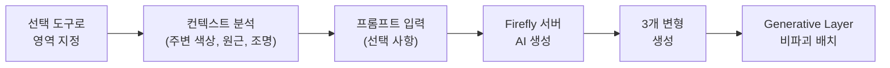
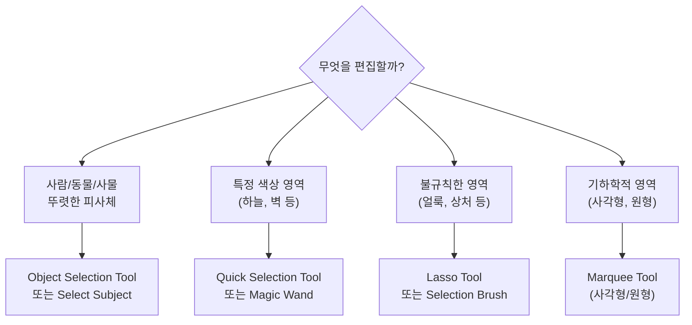
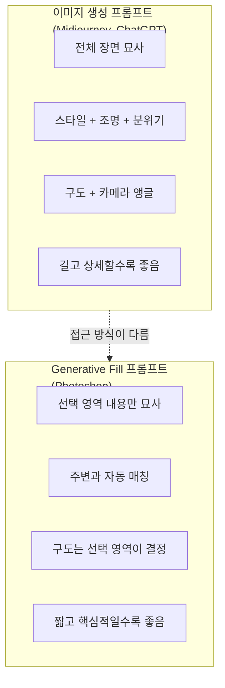
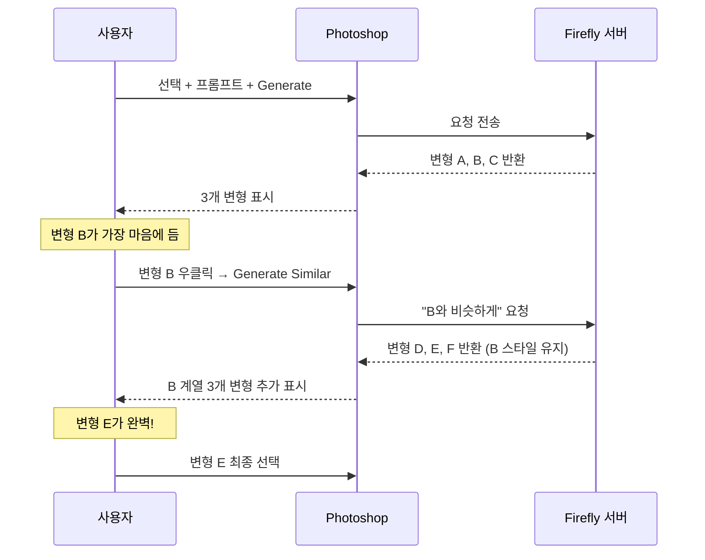

# Photoshop Generative Fill 마스터

> 선택 영역 하나와 짧은 프롬프트만으로 이미지를 전문가처럼 편집하는 Photoshop AI의 핵심 기능을 완전 정복합니다

## 개요

이 섹션에서는 Adobe Photoshop의 Generative Fill 기능을 깊이 있게 다룹니다. 앞서 [01. Adobe Firefly 웹앱 핵심 기능](09-ch9-adobe-photoshop-firefly-리터치-워크플로우/01-01-adobe-firefly-웹앱-핵심-기능.md)에서 Firefly 웹앱의 4대 기능과 상업적 안전성을 배웠는데요, 이번에는 그 Firefly 엔진이 Photoshop 안에서 어떻게 **선택 도구와 결합**하여 훨씬 정밀한 편집을 가능하게 하는지 집중적으로 살펴봅니다.

**선수 지식**: Firefly의 기본 개념(Generative Fill, Generative Credit), 기본적인 Photoshop 인터페이스 이해
**학습 목표**:
- 선택 도구와 Generative Fill을 조합하여 오브젝트를 추가·제거할 수 있다
- 배경 교체, 의상 변경 등 실무 편집 시나리오를 수행할 수 있다
- Generative Fill 전용 프롬프트 작성 원칙을 적용할 수 있다
- 3개 변형 중 최적 결과를 선택하고 Generate Similar로 수렴시킬 수 있다

## 왜 알아야 할까?

AI로 멋진 이미지를 생성했는데, 한 가지만 아쉬운 경우가 많죠. 배경에 어울리지 않는 물체가 있다거나, 인물의 의상을 바꾸고 싶다거나, 빈 공간에 소품을 추가하고 싶을 때요. 예전에는 이런 작업에 수십 분에서 수 시간이 걸렸습니다. 레이어 마스킹, 클론 스탬프, 주파수 분리... 전문 리터처의 영역이었거든요.

Generative Fill은 이 모든 것을 **"선택하고 → 입력하고 → 클릭"** 세 단계로 압축했습니다. Generative Fill을 포함한 Adobe Firefly 플랫폼 전체에서 출시 이후 20억 건 이상의 이미지가 생성될 만큼 폭발적인 반응을 얻었고, 지금은 디자이너의 필수 도구가 되었습니다. 특히 [Ch6에서 배운 인페인팅](06-ch6-이미지-편집-기법-img2img인페인팅아웃페인팅/02-02-인페인팅-기초-부분-수정의-기술.md) 개념이 Photoshop이라는 전문 환경에서 얼마나 강력해지는지 직접 확인하게 될 겁니다.

## 핵심 개념

### 개념 1: Generative Fill의 작동 원리 — "마법의 스텐실"

> 💡 **비유**: Generative Fill은 **스텐실 + AI 화가**의 조합이라고 생각하면 됩니다. 벽에 페인트칠을 할 때 스텐실(구멍 뚫린 판)을 대고 스프레이를 뿌리면, 구멍 모양대로만 색이 칠해지죠? Generative Fill도 마찬가지입니다. 여러분이 선택 도구로 "구멍"(선택 영역)을 만들면, AI 화가가 그 구멍 안에만 새로운 콘텐츠를 그려 넣습니다. 주변 벽의 색상과 질감을 자동으로 파악해서 자연스럽게 이어지도록요.

Generative Fill의 내부 동작은 세 단계로 이루어집니다:

1. **선택 영역 분석**: Photoshop이 선택된 영역의 경계와 주변 컨텍스트(색상, 질감, 원근, 조명)를 분석합니다
2. **Firefly 모델 처리**: 선택 영역 정보와 프롬프트를 Adobe Firefly 서버로 전송하여 1024×1024 픽셀 블록 단위로 콘텐츠를 생성합니다
3. **비파괴 레이어 생성**: 결과물이 새로운 "Generative Layer"에 배치되어 원본 이미지를 보존합니다

> 📊 **그림 1**: Generative Fill 처리 파이프라인

여기서 핵심은 **비파괴(Non-destructive)** 편집이라는 점입니다. 생성된 콘텐츠는 별도 레이어에 올라가기 때문에, 마음에 들지 않으면 언제든 삭제하거나 다른 변형으로 교체할 수 있습니다. 전통적인 클론 스탬프나 힐링 브러시와는 근본적으로 다른 접근이죠.

> ⚠️ **흔한 오해**: "Generative Fill은 원본 이미지를 직접 수정한다" — 아닙니다! 항상 새로운 Generative Layer가 생성되므로, 원본 픽셀은 그대로 보존됩니다. PSD 파일로 저장하면 나중에 변형을 전환하거나 삭제할 수 있어요.

**기술 요구사항도 알아두세요:**
- 파일 모드: RGB, 8비트 (16비트/32비트 미지원)
- 최대 생성 영역: 2,000 × 2,000 픽셀
- 인터넷 연결 필수 (클라우드 기반 처리)
- Generative Credit 소모 (Adobe 구독에 포함)

---

### 개념 2: 선택 도구 마스터 — "정확한 구멍 뚫기"

> 💡 **비유**: 요리할 때 쿠키 커터의 모양이 쿠키 모양을 결정하듯, **선택 영역의 크기와 모양이 생성 결과를 직접 좌우**합니다. 넓은 선택 → 넓은 모자, 좁은 선택 → 좁은 모자. 선택 도구를 잘 쓰는 것이 Generative Fill 결과의 70%를 결정한다고 해도 과언이 아닙니다.

Photoshop에는 Generative Fill과 함께 사용할 수 있는 다양한 선택 도구가 있습니다. 각각의 특성을 이해하고 상황에 맞게 골라 쓰는 것이 핵심이에요.

> 📊 **그림 2**: 상황별 최적 선택 도구 매칭

**주요 선택 도구와 활용 시나리오:**

| 도구 | 특징 | 최적 상황 |
|------|------|-----------|
| **Object Selection Tool** | AI가 피사체 자동 감지, 클릭만으로 선택 | 사람, 동물, 차량 등 뚜렷한 오브젝트 |
| **Quick Selection Tool** | 브러시로 칠하면 가장자리 자동 추적 | 머리카락, 나뭇잎 등 복잡한 경계 |
| **Lasso Tool** | 자유롭게 그리는 프리핸드 선택 | 대략적인 영역, 빠른 작업 |
| **Selection Brush** | 브러시 경도·불투명도 조절 가능 | 반투명 효과, 부드러운 경계 |
| **Select Subject** | 원클릭 AI 주체 분리 | 배경 교체 시 전경 분리 |
| **Marquee Tool** | 사각형/원형 기하학적 선택 | 로고 영역, 프레임 내부 |

**선택 영역의 황금 규칙:**

선택 시 가장 중요한 원칙은 **"보존하고 싶은 것은 빼고, 바꾸고 싶은 것만 포함"**하는 것입니다. 예를 들어 인물의 재킷만 바꾸고 싶다면:
- 재킷 영역만 선택 (얼굴, 머리카락은 제외)
- 소매까지 포함하려면 팔 전체를 선택 (좁게 선택하면 민소매가 될 수 있음)
- 선택 영역 경계에 약간의 여유(padding)를 두면 자연스러운 이음새 생성

> 🔥 **실무 팁**: 선택이 복잡한 경우, 여러 선택 도구를 **조합**하세요. Object Selection Tool로 대략 선택한 뒤, Shift 키를 누르고 Lasso Tool로 빠진 부분을 추가하거나, Alt(Option) 키로 불필요한 부분을 빼는 방식이 가장 효율적입니다.

---

### 개념 3: Generative Fill 프롬프트 작성법 — "지시가 아닌 묘사"

> 💡 **비유**: 인테리어 디자이너에게 방을 꾸며달라고 할 때, "소파를 놓아주세요"(지시)보다 "미드센추리 모던 스타일의 베이지 가죽 소파"(묘사)라고 말하는 게 원하는 결과에 가깝겠죠? Generative Fill 프롬프트도 마찬가지입니다. **"추가해줘", "제거해줘" 같은 동사는 쓰지 않습니다.** 원하는 결과의 모습만 묘사하면 돼요.

Generative Fill의 프롬프트는 Midjourney나 ChatGPT의 이미지 생성 프롬프트와 근본적으로 다릅니다. [Ch2에서 배운 6요소 프레임워크](02-ch2-프롬프트-구조-마스터/01-01-프롬프트-해부학-6요소-프레임워크.md)를 적용하되, 핵심적인 차이가 있어요.

> 📊 **그림 3**: 이미지 생성 프롬프트 vs Generative Fill 프롬프트 비교

**Generative Fill 프롬프트 5대 원칙:**

**원칙 1 — 묘사하되, 지시하지 말 것**
- ❌ "배경에 산을 추가해줘" → ✅ "눈 덮인 알프스 산맥"
- ❌ "이 사람을 제거해줘" → ✅ 프롬프트를 **비워두고** Generate 클릭
- ❌ "색상을 바꿔줘" → ✅ "빨간색 가죽 재킷"

**원칙 2 — 짧고 핵심적으로**
- ❌ "아름다운 열대 해변의 푸른 바다와 하얀 모래사장, 야자수가 있고 석양이 지는 풍경"
- ✅ "열대 해변, 야자수, 석양"

**원칙 3 — 제거할 때는 프롬프트를 비울 것**
- 오브젝트 제거 시 가장 흔한 실수: "remove" 또는 "제거"라고 쓰는 것
- 올바른 방법: 제거할 대상을 선택 → 프롬프트 비움 → Generate → AI가 주변 맥락으로 자연스럽게 채움

**원칙 4 — 선택 영역의 크기를 활용할 것**
- 큰 모자를 원하면 → 머리 위 넓은 영역 선택
- 소매 있는 재킷을 원하면 → 팔까지 포함하여 선택
- 선택 영역의 형태 자체가 생성물의 비율을 결정

**원칙 5 — 문제 발생 시 마침표(.) 활용**
- 인물 사진 편집 시 콘텐츠 정책 경고가 뜨는 경우
- 프롬프트에 마침표 `.` 하나만 입력하면 우회 가능
- 이는 Adobe 커뮤니티에서 공유된 공식 워크어라운드

---

### 개념 4: 변형 선택과 Generate Similar — "수렴의 기술"

> 💡 **비유**: 옷 가게에서 마음에 드는 재킷을 발견했는데, 색상이 조금 아쉬운 상황을 상상해보세요. 점원에게 "이것과 비슷한 스타일인데 다른 옵션 있나요?"라고 물으면 비슷한 계열의 재킷들을 가져다주죠. Generate Similar가 바로 그 점원입니다. 랜덤하게 완전히 다른 스타일을 보여주는 게 아니라, **마음에 든 방향으로 수렴**시켜줍니다.

Generative Fill은 한 번 클릭할 때마다 **3개의 변형(Variation)**을 생성합니다. Properties 패널에서 변형을 전환하며 비교할 수 있고, 마음에 드는 게 없으면 다시 Generate를 눌러 3개를 더 만들 수 있어요. 이전 변형들도 모두 보존되므로 언제든 돌아갈 수 있습니다.

> 📊 **그림 4**: 변형 생성과 수렴 워크플로우

**Photoshop 2025의 Generate Similar (2024년 10월 추가):**

이전에는 Generate를 반복할 때마다 완전히 랜덤한 결과가 나왔습니다. 20~30번 반복해도 원하는 결과를 못 찾는 경우가 흔했죠. Generate Similar는 이 문제를 해결합니다:

1. 3개 변형 중 **방향성이 맞는 것**을 우클릭
2. **Generate Similar** 선택
3. 해당 변형과 **스타일·구조가 유사한** 새로운 3개 변형 생성
4. 이 과정을 반복하여 점점 원하는 결과로 **수렴**

이것은 마치 [Ch5에서 배운 Midjourney의 Variation 기능](05-ch5-midjourney-기본과-파라미터-튜닝/06-06-파라미터-조합과-remixvariation-활용.md)과 유사한 철학인데요, Photoshop에서는 **부분 편집**에 이 수렴 전략을 적용할 수 있다는 점이 더욱 강력합니다.

> 🔥 **실무 팁**: 사용하지 않는 변형은 삭제하세요! 각 변형이 Generative Layer에 저장되므로 PSD 파일 용량이 급격히 커질 수 있습니다. 최종 결과를 확정한 뒤 불필요한 변형을 정리하면 파일 크기를 크게 줄일 수 있어요.

---

### 개념 5: 실전 편집 시나리오 4가지

지금까지 배운 원리를 실제 편집 시나리오에 적용해봅시다. 디자이너가 가장 자주 마주치는 네 가지 상황입니다.

> 📊 **그림 5**: 4대 실전 시나리오 워크플로우

```mermaid
flowchart TD
    subgraph S1["시나리오 1: 오브젝트 제거"]
        S1A["대상 선택<br/>(Object Selection)"] --> S1B["프롬프트 비움"] --> S1C["Generate<br/>주변 맥락으로 자동 채움"]
    end
    
    subgraph S2["시나리오 2: 오브젝트 추가"]
        S2A["빈 영역 선택<br/>(Lasso/Marquee)"] --> S2B["대상 묘사<br/>예: golden retriever"] --> S2C["Generate<br/>원근·조명 자동 매칭"]
    end
    
    subgraph S3["시나리오 3: 배경 교체"]
        S3A["Select Subject<br/>전경 분리"] --> S3B["선택 영역 반전<br/>(Ctrl/Cmd+Shift+I)"] --> S3C["새 배경 묘사<br/>예: 도쿄 야경"]
    end
    
    subgraph S4["시나리오 4: 의상 변경"]
        S4A["의상 영역 선택<br/>(Lasso + 여유 공간)"] --> S4B["새 의상 묘사<br/>예: navy blazer"] --> S4C["Generate Similar로<br/>핏 조정"]
    end
```

**시나리오 1: 오브젝트 제거 — "없었던 것처럼"**

여행 사진에서 지나가는 행인을 지우거나, 제품 사진에서 불필요한 배경 요소를 제거하는 상황입니다.

- **도구**: Object Selection Tool 또는 Lasso Tool
- **프롬프트**: 비움 (가장 중요!)
- **팁**: 선택 영역을 대상보다 약간 넓게 잡으면 그림자와 반사까지 깔끔하게 제거됩니다
- **주의**: "remove"라고 입력하면 오히려 이상한 결과가 나옵니다. 반드시 빈 프롬프트로!

**시나리오 2: 오브젝트 추가 — "원래 있었던 것처럼"**

빈 테이블에 커피잔을 놓거나, 풍경에 열기구를 추가하는 상황입니다.

- **도구**: Lasso Tool (원하는 위치와 크기를 자유롭게 지정)
- **프롬프트**: 추가할 대상만 간결하게 묘사 (예: "steaming coffee cup", "빈티지 탁상시계")
- **팁**: 선택 영역의 위치가 원근감에 맞아야 자연스럽습니다. 먼 거리의 바닥에 큰 선택 영역을 잡으면 비현실적인 크기의 물체가 생성될 수 있어요.

**시나리오 3: 배경 교체 — "완전히 다른 세계로"**

인물 사진의 배경을 스튜디오에서 야외로, 또는 한국에서 파리로 바꾸는 상황입니다.

- **도구**: Select Subject (원클릭) → 선택 영역 반전 (Ctrl/Cmd+Shift+I)
- **프롬프트**: 원하는 배경 묘사 (예: "1920s art deco ballroom", "눈 덮인 알프스 산장")
- **팁**: 조명 방향을 프롬프트에 포함하면 더 자연스럽습니다. "soft window light from left" 같은 힌트가 인물과 배경의 일체감을 높여줍니다.

**시나리오 4: 의상 변경 — "피팅룸 없이 스타일링"**

패션 컨셉이나 룩북 제작 시, 같은 모델에게 다른 의상을 입히는 상황입니다.

- **도구**: Lasso Tool (의상 윤곽을 따라 선택, 소매까지 포함)
- **프롬프트**: 새 의상 묘사 (예: "puffer jacket", "린넨 셔츠")
- **팁**: 피부가 노출되는 경계(목, 손목)를 선택에서 약간 포함하면 의상 경계가 자연스럽습니다. 너무 타이트하게 선택하면 이음새가 부자연스러울 수 있어요.

## 실습: 적용해보기

### 활동 1: 선택 도구 + 프롬프트 매칭 워크시트

아래 편집 과제에 대해, (1) 어떤 선택 도구를 쓸지, (2) 프롬프트를 어떻게 작성할지 적어보세요.

| 과제 | 선택 도구 | 프롬프트 |
|------|-----------|----------|
| 카페 테이블 위의 빈 접시 제거 | ? | ? |
| 초원 풍경에 양 떼 추가 | ? | ? |
| 인물 사진의 배경을 해변으로 교체 | ? | ? |
| 모델의 데님 재킷을 트렌치코트로 변경 | ? | ? |
| 제품 사진에서 로고가 인쇄된 머그컵 추가 | ? | ? |

**정답 가이드:**
- 빈 접시 제거: Object Selection Tool / 프롬프트 비움
- 양 떼 추가: Lasso Tool (초원 위 넓은 영역) / "flock of sheep grazing"
- 배경 교체: Select Subject → 반전 / "tropical beach, palm trees, golden hour"
- 의상 변경: Lasso Tool (재킷 전체+소매) / "beige trench coat"
- 머그컵 추가: Lasso Tool (테이블 위 적절한 위치) / "white ceramic mug"

### 활동 2: Generate Similar 수렴 전략 분석

다음 상황에서 어떻게 최적의 결과를 찾을 수 있을지 단계별로 설계해보세요:

**시나리오**: 패션 브랜드 SNS용 이미지. 모델이 입은 무지 흰색 티셔츠를 "빈티지 밴드 티셔츠"로 교체하고 싶다.

1단계 — 첫 번째 Generate에서 3개 변형을 확인합니다. 어떤 기준으로 "가장 나은 것"을 판단할까요?
- 판단 기준 예시: 직물 질감의 사실성, 그래픽 디자인의 빈티지 느낌, 몸에 맞는 핏, 주름 표현의 자연스러움

2단계 — 방향이 맞는 변형을 하나 골랐다면, Generate Similar를 몇 번 반복하는 것이 적절할까요?
- 권장: 2~3회. 그 이상은 큰 차이가 없는 경우가 많음

3단계 — 최종 결과를 확정한 후, 파일 관리 측면에서 무엇을 해야 할까요?
- 사용하지 않는 변형 삭제 → PSD 용량 최적화

### 토론 질문

1. Generative Fill의 "비파괴 편집"이 디자인 워크플로우에서 왜 중요할까요? 클라이언트 수정 요청이 잦은 상황을 예로 들어 설명해보세요.
2. [인페인팅](06-ch6-이미지-편집-기법-img2img인페인팅아웃페인팅/02-02-인페인팅-기초-부분-수정의-기술.md)과 Photoshop Generative Fill의 차이는 무엇인가요? 각각 어떤 상황에서 유리할까요?
3. 프롬프트를 "비워두는 것"이 최선의 전략인 경우는 어떤 상황들이 있을까요?

## 더 깊이 알아보기

### Generative Fill의 탄생 — Adobe의 "Firefly 선언"

2023년 3월 21일, Adobe는 Firefly를 공개하면서 AI 이미지 생성 시장에 독특한 포지션을 잡았습니다. 당시 Stable Diffusion과 Midjourney가 시장을 지배하고 있었는데, Adobe는 한 가지 차별점을 강하게 밀었습니다: **"상업적으로 안전한(Commercially Safe) AI"**. Firefly의 학습 데이터를 Adobe Stock 이미지, 오픈 라이선스 콘텐츠, 퍼블릭 도메인 자료로 한정한 거죠.

불과 두 달 뒤인 2023년 5월 23일, Adobe는 놀라운 발표를 합니다. Firefly를 **Photoshop 안에 직접 통합**한 Generative Fill을 베타로 공개한 것이죠. 이것은 AI 이미지 생성 도구가 **독립 앱**이 아닌 **기존 전문 도구의 기능**으로 자리잡은 최초의 사례였습니다.

반응은 폭발적이었습니다. Generative Fill을 포함한 Firefly 플랫폼 전체에서 베타 기간 동안 **20억 건 이상**의 이미지가 생성되었고, 2023년 9월에 정식 출시되었습니다. 2024년 10월까지 Firefly 플랫폼 누적 **130억 건**을 돌파했는데, 이는 Photoshop이라는 이미 확립된 생태계의 힘이었죠.

재미있는 건, 초기 Generative Fill은 **영어 프롬프트만** 지원했다는 점입니다. 한국어를 포함한 100개 이상 언어 지원은 2023년 7월에야 추가되었어요. 지금은 어떤 언어로든 자유롭게 프롬프트를 작성할 수 있습니다.

### 미래: 멀티 모델 시대의 개막

2025년 9월, Adobe는 또 한 번 판을 흔들었습니다. Photoshop 베타에서 Generative Fill 사용 시 **여러 AI 모델 중 선택**할 수 있게 한 것이죠. Adobe Firefly뿐 아니라 Google Gemini, Black Forest Labs의 FLUX 등 파트너 모델을 같은 인터페이스에서 비교할 수 있게 되었습니다. 이는 Photoshop이 "하나의 AI 엔진"이 아닌 **"AI 모델의 플랫폼"**으로 진화하고 있음을 보여주는 중요한 이정표입니다.

## 흔한 오해와 팁

> ⚠️ **흔한 오해**: "프롬프트를 길고 상세하게 쓰면 더 좋은 결과가 나온다" — Generative Fill에서는 정반대입니다! 프롬프트가 길어질수록 AI가 해석해야 할 요소가 많아져 오히려 혼란스러운 결과가 나올 수 있어요. Midjourney 프롬프트의 습관을 버리고, 핵심 키워드 2~5개로 간결하게 작성하세요.

> 💡 **알고 계셨나요?**: Generative Fill은 내부적으로 1024×1024 픽셀 블록 단위로 작동합니다. 그래서 매우 넓은 영역을 한꺼번에 선택하면 여러 블록을 이어 붙이는 과정에서 이음새가 보일 수 있어요. 넓은 영역은 여러 번 나눠서 처리하면 더 자연스러운 결과를 얻을 수 있습니다.

> 🔥 **실무 팁**: "Generative Fill이 회색으로 비활성화돼요!"라는 문제를 겪는 경우, 3가지를 체크하세요: (1) 이미지가 RGB 모드 8비트인지 (`Image > Mode`), (2) 레이어가 잠겨있지 않은지 (자물쇠 아이콘 해제), (3) 활성 선택 영역이 있는지. 이 세 가지를 확인하면 대부분 해결됩니다.

> 🔥 **실무 팁**: 배경 교체 시 **Harmonize Tool**을 함께 활용하세요. Generative Fill로 배경을 바꾼 뒤, 전경 인물에 Harmonize를 적용하면 조명과 색온도가 새 배경에 맞게 자동 조정되어 합성 티가 크게 줄어듭니다.

## 핵심 정리

| 개념 | 설명 |
|------|------|
| Generative Fill 원리 | 선택 영역 + 프롬프트 → Firefly 서버에서 3개 변형 생성 → 비파괴 Generative Layer에 배치 |
| 프롬프트 핵심 원칙 | "지시"가 아닌 "묘사", 짧고 간결하게. 제거 시 프롬프트 비움 |
| 선택 영역의 중요성 | 영역의 크기·모양이 생성 결과의 비율과 방향을 직접 결정 |
| Generate Similar | 마음에 드는 변형 우클릭 → 유사 스타일로 3개 추가 생성, 반복으로 수렴 |
| 4대 시나리오 | 오브젝트 제거(빈 프롬프트), 추가(대상 묘사), 배경 교체(Select Subject+반전), 의상 변경(Lasso+묘사) |
| 기술 요건 | RGB 8비트, 최대 2000×2000px 생성, 인터넷 필수, Generative Credit 소모 |

## 다음 섹션 미리보기

Generative Fill이 **선택 영역 안**을 채우는 기능이라면, 다음에 배울 [03. Generative Expand와 이미지 확장](09-ch9-adobe-photoshop-firefly-리터치-워크플로우/03-03-generative-expand와-이미지-확장.md)은 **선택 영역 밖**으로 캔버스를 확장하는 기능입니다. 세로 사진을 가로로 넓히거나, 잘린 구도를 보완하는 등 Generative Fill과 짝을 이루는 필수 기능을 마스터하게 됩니다.

## 참고 자료

- [Edit images with Generative Fill — Adobe 공식 가이드](https://helpx.adobe.com/photoshop/desktop/create-open-import-images/create-images/edit-images-with-generative-fill.html) - Generative Fill의 전체 기능과 사용법을 다루는 공식 문서
- [Photoshop 2025: Generate Similar with Generative Fill](https://www.photoshopessentials.com/photo-editing/new-in-photoshop-2025-use-generate-similar-with-generative-fill/) - Generate Similar 기능의 상세 튜토리얼
- [Photoshop Generative Fill — 16 Fast Tips (PhotoshopCAFE)](https://photoshopcafe.com/photoshop-2024-generative-fill-tips-16-fast-tips-and-tricks/) - 실무에서 바로 쓸 수 있는 16가지 팁 모음
- [Photoshop Beta Expands Generative Fill — Adobe Blog](https://blog.adobe.com/en/publish/2025/09/25/photoshop-beta-expands-generative-fillmore-ai-models-more-possibilities) - 멀티 AI 모델 지원 등 최신 업데이트 소식
- [Common Generative AI Issues in Photoshop — Adobe 트러블슈팅](https://helpx.adobe.com/photoshop/kb/troubleshoot-generative-ai-features.html) - Generative Fill 비활성화 등 일반적인 문제 해결 가이드

---
### 🔗 Related Sessions
- [6요소 프레임워크](02-ch2-프롬프트-구조-마스터/01-01-프롬프트-해부학-6요소-프레임워크.md) (prerequisite)
- [firefly 웹앱 4대 기능](09-ch9-adobe-photoshop-firefly-리터치-워크플로우/01-01-adobe-firefly-웹앱-핵심-기능.md) (prerequisite)
- [generative credit 시스템](09-ch9-adobe-photoshop-firefly-리터치-워크플로우/01-01-adobe-firefly-웹앱-핵심-기능.md) (prerequisite)
- [상업적으로 안전한(commercially safe) ai](09-ch9-adobe-photoshop-firefly-리터치-워크플로우/01-01-adobe-firefly-웹앱-핵심-기능.md) (prerequisite)
- [인페인팅(inpainting)](06-ch6-이미지-편집-기법-img2img인페인팅아웃페인팅/02-02-인페인팅-기초-부분-수정의-기술.md) (prerequisite)
