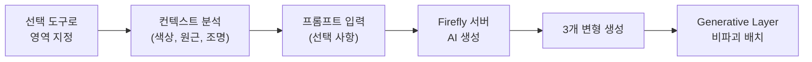
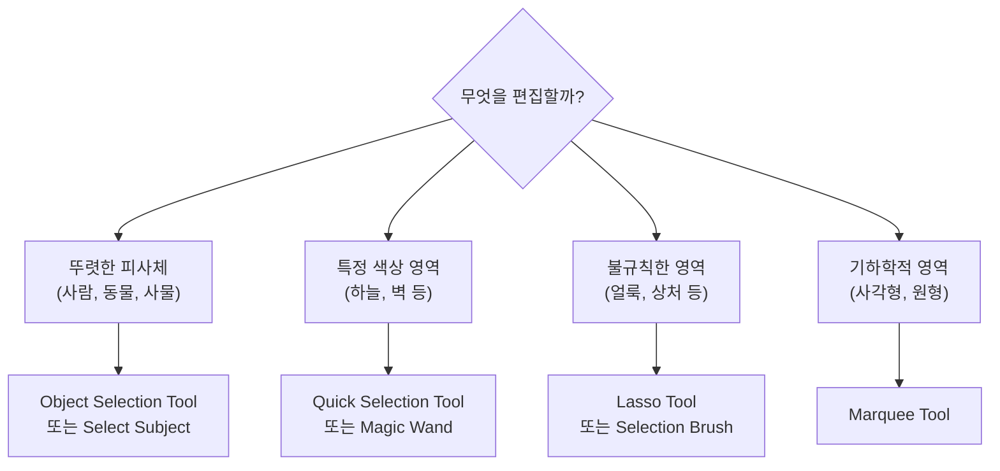
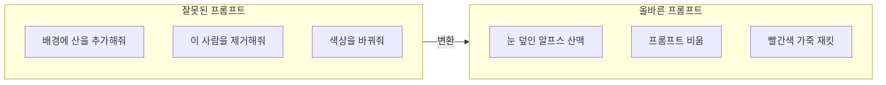

# Photoshop Generative Fill 마스터

> 선택 영역 하나와 짧은 프롬프트만으로 이미지를 전문가처럼 편집하는 Photoshop AI의 핵심 기능을 완전 정복합니다

## 개요

Adobe Photoshop의 Generative Fill은 Firefly 엔진을 기반으로, 선택 도구와 결합하여 정밀한 이미지 편집을 가능하게 합니다. 오브젝트 추가·제거, 배경 교체, 의상 변경 등 전통적으로 수십 분이 걸리던 작업을 "선택 → 입력 → 클릭" 세 단계로 압축한 기능입니다. 이 섹션에서는 선택 도구 활용법부터 프롬프트 작성 원칙, 변형 수렴 전략까지 실전 중심으로 다룹니다.

## Generative Fill 작동 원리

Generative Fill은 스텐실과 AI 화가의 조합입니다. 선택 도구로 "구멍"을 만들면, AI가 주변 맥락을 파악하여 그 안에 자연스러운 콘텐츠를 채워 넣습니다.



**내부 처리 3단계:**

1. **선택 영역 분석** — 경계와 주변 컨텍스트(색상, 질감, 원근, 조명) 파악
2. **Firefly 모델 처리** — 선택 영역 + 프롬프트를 서버로 전송, 1024x1024 블록 단위 생성
3. **비파괴 레이어 생성** — 결과가 새 Generative Layer에 배치, 원본 보존

**기술 요구사항:**
- RGB 8비트 모드 (16/32비트 미지원)
- 최대 생성 영역: 2,000 x 2,000 픽셀
- 인터넷 연결 필수, Generative Credit 소모

## 선택 도구 마스터

선택 영역의 크기와 모양이 생성 결과를 직접 좌우합니다. 상황에 맞는 도구 선택이 결과 품질의 70%를 결정합니다.



| 도구 | 특징 | 최적 상황 |
|------|------|-----------|
| **Object Selection Tool** | AI가 피사체 자동 감지, 클릭만으로 선택 | 사람, 동물, 차량 등 뚜렷한 오브젝트 |
| **Quick Selection Tool** | 브러시로 칠하면 가장자리 자동 추적 | 머리카락, 나뭇잎 등 복잡한 경계 |
| **Lasso Tool** | 자유롭게 그리는 프리핸드 선택 | 대략적 영역, 빠른 작업 |
| **Selection Brush** | 브러시 경도·불투명도 조절 가능 | 반투명 효과, 부드러운 경계 |
| **Select Subject** | 원클릭 AI 주체 분리 | 배경 교체 시 전경 분리 |
| **Marquee Tool** | 사각형/원형 기하학적 선택 | 로고 영역, 프레임 내부 |

**선택 영역 황금 규칙** — 보존할 것은 빼고, 바꿀 것만 포함합니다. 경계에 약간의 여유(padding)를 두면 이음새가 자연스럽습니다.

## Generative Fill 프롬프트 작성법

Generative Fill 프롬프트는 일반 이미지 생성 프롬프트와 근본적으로 다릅니다. **동사("추가해줘", "제거해줘") 없이, 원하는 결과의 모습만 짧게 묘사**하는 것이 핵심입니다.



**프롬프트 5대 원칙:**

**원칙 1 — 묘사하되 지시하지 말 것**

```
snow-covered Alps mountains, dramatic peaks
```


**원칙 2 — 짧고 핵심적으로 (키워드 2~5개)**

```
tropical beach, palm trees, sunset
```

**원칙 3 — 제거할 때는 프롬프트를 비울 것**

```
(프롬프트 비움 — 빈 상태로 Generate 클릭)
```


**원칙 4 — 선택 영역의 크기를 활용할 것**
- 큰 모자 → 머리 위 넓은 영역 선택
- 소매 있는 재킷 → 팔까지 포함 선택

**원칙 5 — 콘텐츠 정책 경고 시 마침표(.) 활용**

```
.
```

인물 사진 편집 시 정책 경고가 뜨면, 프롬프트에 마침표 하나만 입력하여 우회합니다.

## 변형 선택과 Generate Similar

Generative Fill은 매 클릭마다 3개 변형을 생성합니다. **Generate Similar**(2024년 10월 추가)를 사용하면 마음에 드는 변형 방향으로 수렴시킬 수 있습니다.

1. 3개 변형 중 방향성이 맞는 것을 우클릭
2. Generate Similar 선택
3. 유사 스타일의 새 3개 변형 생성
4. 2~3회 반복하여 최적 결과로 수렴

## 실전 편집 시나리오 4가지

### 시나리오 1: 오브젝트 제거

```
(프롬프트 비움)
```

- Object Selection Tool로 대상 선택, 대상보다 약간 넓게 잡아 그림자까지 제거


### 시나리오 2: 오브젝트 추가

```
steaming coffee cup, ceramic, white
```

```
vintage brass desk clock
```

- Lasso Tool로 원하는 위치에 선택 영역 생성, 원근감에 맞는 크기로 지정


### 시나리오 3: 배경 교체

```
1920s art deco ballroom, golden chandeliers
```

```
snowy Alpine cabin, warm window light
```

```
Tokyo cityscape at night, neon lights
```

- Select Subject → 선택 영역 반전(Ctrl/Cmd+Shift+I) → 새 배경 묘사


### 시나리오 4: 의상 변경

```
navy blue wool blazer, slim fit
```

```
beige linen trench coat, belted
```

```
black leather biker jacket, zippered
```

- Lasso Tool로 의상 윤곽 + 소매까지 선택, 피부 노출 경계를 약간 포함


## 실습

### 활동: 선택 도구 + 프롬프트 매칭

아래 편집 과제에 대해 최적 선택 도구와 프롬프트를 작성해보세요.

| 과제 | 선택 도구 | 프롬프트 |
|------|-----------|----------|
| 카페 테이블 위의 빈 접시 제거 | ? | ? |
| 초원 풍경에 양 떼 추가 | ? | ? |
| 인물 배경을 해변으로 교체 | ? | ? |
| 데님 재킷을 트렌치코트로 변경 | ? | ? |

**정답 가이드:**

빈 접시 제거:
```
(프롬프트 비움 — Object Selection Tool)
```

양 떼 추가:
```
flock of sheep grazing on green meadow
```

배경 교체:
```
tropical beach, palm trees, golden hour light
```

의상 변경:
```
beige trench coat, classic style
```

## 팁과 주의사항

- **선택 도구 조합**: Object Selection Tool로 대략 선택 후, Shift+Lasso로 추가, Alt(Option)+Lasso로 제거하면 효율적입니다
- **프롬프트 길이 주의**: 길수록 좋은 것이 아닙니다. Midjourney 습관을 버리고 키워드 2~5개로 간결하게 작성하세요
- **넓은 영역 분할 처리**: 1024x1024 블록 단위로 작동하므로, 넓은 영역은 나눠서 처리하면 이음새가 줄어듭니다
- **비활성화 문제 해결**: (1) RGB 8비트 모드 확인 (`Image > Mode`), (2) 레이어 잠금 해제, (3) 활성 선택 영역 존재 여부 확인
- **Harmonize Tool 병용**: 배경 교체 후 전경에 Harmonize를 적용하면 조명·색온도가 자동 조정되어 합성 티가 줄어듭니다
- **변형 정리**: 최종 확정 후 사용하지 않는 변형을 삭제하여 PSD 파일 용량을 관리하세요
- **비파괴 편집 활용**: 생성 결과는 별도 Generative Layer에 저장되므로, PSD로 저장하면 언제든 변형 전환·삭제가 가능합니다

## 핵심 정리

| 개념 | 설명 |
|------|------|
| Generative Fill 원리 | 선택 영역 + 프롬프트 → Firefly 서버에서 3개 변형 생성 → 비파괴 Generative Layer 배치 |
| 프롬프트 핵심 원칙 | '지시'가 아닌 '묘사', 짧고 간결하게. 제거 시 프롬프트 비움 |
| 선택 영역의 중요성 | 영역의 크기·모양이 생성 결과의 비율과 방향을 직접 결정 |
| Generate Similar | 마음에 드는 변형 우클릭 → 유사 스타일로 3개 추가 생성, 반복으로 수렴 |
| 4대 시나리오 | 오브젝트 제거(빈 프롬프트), 추가(대상 묘사), 배경 교체(Select Subject+반전), 의상 변경(Lasso+묘사) |
| 기술 요건 | RGB 8비트, 최대 2000x2000px, 인터넷 필수, Generative Credit 소모 |

## 다음 섹션 미리보기

다음 [03. Generative Expand와 이미지 확장](09-ch9-adobe-photoshop-firefly-리터치-워크플로우/03-03-generative-expand와-이미지-확장.md)에서는 선택 영역 밖으로 캔버스를 확장하는 기능을 다룹니다. 세로 사진을 가로로 넓히거나 잘린 구도를 보완하는 등 Generative Fill과 짝을 이루는 필수 기능입니다.
