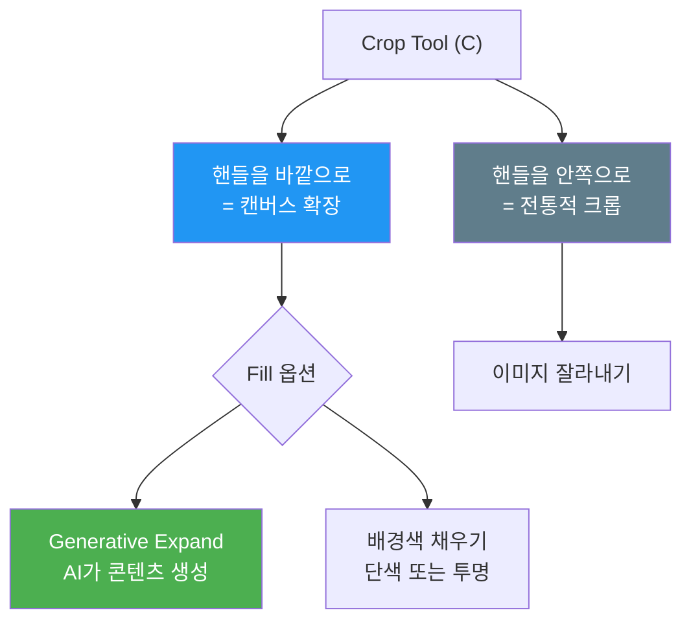
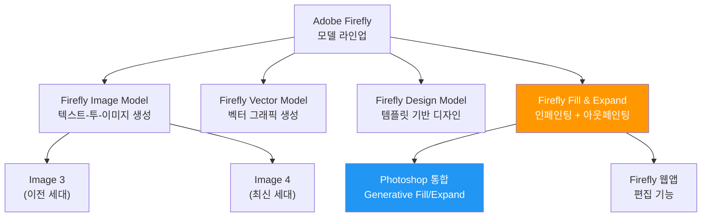
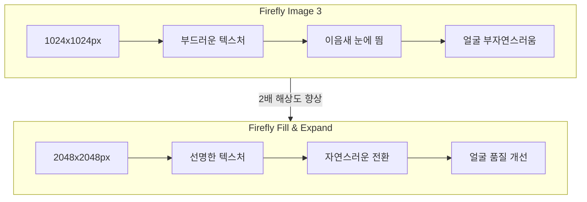
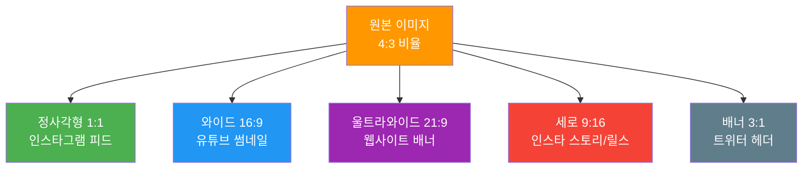
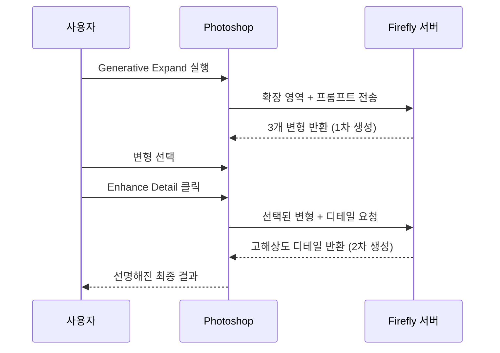
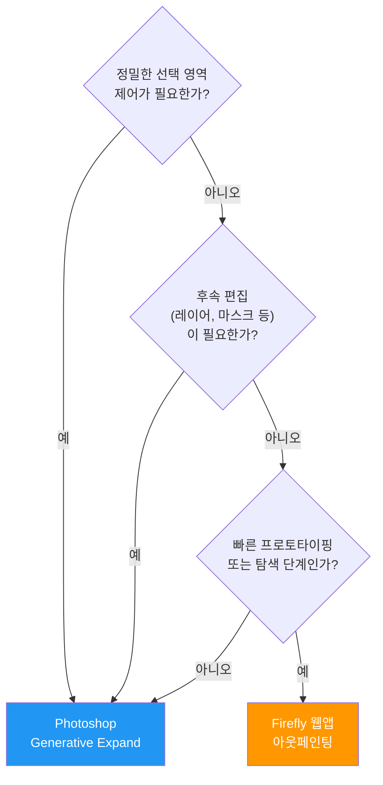

# Generative Expand와 이미지 확장

> Photoshop의 Generative Expand로 캔버스를 자유롭게 확장하고, 종횡비를 변환하며, 크롭된 이미지를 복원하는 실무 기법을 마스터합니다.

## 개요

이 섹션에서는 Adobe Photoshop의 **Generative Expand** 기능을 깊이 있게 다룹니다. 앞서 [02. Photoshop Generative Fill 마스터](09-ch9-adobe-photoshop-firefly-리터치-워크플로우/02-02-photoshop-generative-fill-마스터.md)에서 선택 영역 '안'을 채우는 방법을 배웠다면, 이번에는 이미지의 경계를 '밖'으로 확장하는 아웃페인팅(Outpainting)의 Photoshop 구현을 학습합니다.

**선수 지식**: Photoshop Generative Fill의 기본 작동 원리, 선택 도구 사용법, Generative Layer 개념
**학습 목표**:
- Generative Expand의 두 가지 접근 방식(Crop Tool / Canvas Size)을 이해하고 상황별로 선택할 수 있다
- 종횡비 변환(세로→가로, 정사각형→와이드 등)을 자유롭게 수행할 수 있다
- 크롭된 이미지나 타이트한 프레이밍을 자연스럽게 복원할 수 있다
- Firefly 모델 라인업 내에서 Fill & Expand 모델의 위치를 이해하고, Enhance Detail로 품질을 높일 수 있다

## 왜 알아야 할까?

촬영 현장에서 완벽한 구도를 잡는 건 쉽지 않습니다. 급하게 찍은 사진이 너무 타이트하게 크롭되어 있거나, 인스타그램용 정사각형(1:1)으로 찍었는데 유튜브 썸네일(16:9)이 필요해진 경험, 한 번쯤 있지 않나요?

예전이라면 포기하거나 처음부터 다시 촬영해야 했을 겁니다. 하지만 Generative Expand가 있으면 이야기가 달라집니다. AI가 원본 이미지의 맥락을 이해하고, 캔버스 밖에 있었을 법한 장면을 자연스럽게 생성해주거든요.

특히 AI 이미지 생성 도구로 만든 작업물은 종횡비가 제한적인 경우가 많습니다. Midjourney에서 `--ar 1:1`로 생성한 캐릭터를 배너 광고(3:1)에 넣어야 한다면? Generative Expand가 바로 그 다리 역할을 합니다. [아웃페인팅 — 캔버스 확장과 구도 재구성](06-ch6-이미지-편집-기법-img2img인페인팅아웃페인팅/04-04-아웃페인팅-캔버스-확장과-구도-재구성.md)에서 배운 아웃페인팅 개념이 Photoshop이라는 전문 도구 안에서 어떻게 구현되는지 직접 확인해보겠습니다.

## 핵심 개념

### 개념 1: Generative Expand의 작동 원리 — "퍼즐 조각 맞추기"

> 💡 **비유**: 직소 퍼즐을 떠올려보세요. 완성된 퍼즐 조각이 중앙에 놓여 있고, 주변의 빈 공간에 어떤 조각이 와야 할지 추측하는 것과 비슷합니다. AI는 기존 이미지의 색감, 질감, 원근법, 조명 방향을 분석해서 "이 바깥에는 이런 장면이 있었을 거야"라고 예측한 뒤, 그에 맞는 콘텐츠를 생성합니다.

Generative Expand는 Photoshop의 **Crop Tool(자르기 도구)**과 통합되어 작동합니다. 일반적으로 Crop Tool은 이미지를 '잘라내는' 도구이지만, Generative Expand 모드에서는 반대로 크롭 핸들을 **바깥으로 드래그**하여 캔버스를 확장합니다.

> 📊 **그림 1**: Generative Expand 작동 흐름

작동 과정을 단계별로 살펴보면:

1. **Crop Tool 활성화**: 도구 패널에서 Crop Tool(단축키 C)을 선택합니다.
2. **캔버스 확장**: 크롭 핸들을 원본 이미지 바깥으로 드래그합니다. 이때 확장될 영역이 체크 패턴으로 표시됩니다.
3. **Generative Expand 선택**: Contextual Task Bar에서 Fill 옵션을 **Generative Expand**로 설정합니다.
4. **모델 선택**: Firefly Fill & Expand, Firefly Image 3 중 원하는 모델을 선택합니다.
5. **프롬프트 입력(선택)**: 빈칸으로 두면 AI가 자동 판단하고, 특정 요소를 원하면 프롬프트를 입력합니다.
6. **Generate 클릭**: 3개의 변형이 생성되며, Properties 패널에서 선택합니다.

> 📊 **그림 2**: Crop Tool의 두 가지 모드 — 전통적 크롭 vs Generative Expand

Canvas Size(Image > Canvas Size) 메뉴를 통해서도 캔버스를 확장할 수 있는데요, 이 방법은 **픽셀 단위로 정밀하게** 확장 크기를 지정해야 할 때 유용합니다. 캔버스를 먼저 늘린 뒤, 투명 영역을 선택하고 Generative Fill로 채우는 방식이죠. Crop Tool 방식보다 단계가 하나 더 많지만, 상하좌우 확장량을 개별 제어할 수 있다는 장점이 있습니다.

> ⚠️ **흔한 오해**: "Generative Expand와 Generative Fill은 완전히 다른 기능이다"라고 생각하시는 분이 많은데요, 사실 Generative Expand는 Generative Fill의 **확장 모드**입니다. 둘 다 Adobe Firefly 엔진을 사용하며, Fill이 선택 영역 안을 채운다면 Expand는 캔버스 바깥을 채우는 거죠. 내부적으로는 같은 AI 모델이 작동합니다.

### 개념 2: Firefly Fill & Expand 모델 — 진화하는 AI 엔진

> 💡 **비유**: 스마트폰 카메라가 세대별로 화질이 좋아지는 것처럼, Firefly 모델도 세대별로 생성 품질이 크게 향상되었습니다. 최신 모델은 같은 "사진 확장" 요청에도 더 자연스러운 질감과 정확한 원근감을 보여줍니다.

[01. Adobe Firefly 웹앱 핵심 기능](09-ch9-adobe-photoshop-firefly-리터치-워크플로우/01-01-adobe-firefly-웹앱-핵심-기능.md)에서 Firefly의 모델 라인업을 소개했는데요, 여기서 잠시 전체 그림을 정리해볼게요. Adobe Firefly는 용도별로 특화된 여러 모델을 운영합니다:

> 📊 **그림 3**: Firefly 모델 라인업과 Fill & Expand의 위치

**Firefly Fill & Expand**는 이름 그대로 **채우기(Fill)**와 **확장(Expand)**에 특화된 모델입니다. 텍스트에서 이미지를 처음부터 생성하는 Image Model과 달리, 기존 이미지의 맥락을 분석하고 빈 영역을 채우는 데 최적화되어 있죠. Photoshop의 Generative Fill과 Generative Expand가 바로 이 모델을 사용합니다.

Photoshop 2025~2026에서는 Generative Expand에 사용할 AI 모델을 직접 선택할 수 있습니다:

| 모델 | 최대 해상도 | 특징 | 추천 용도 |
|------|-----------|------|----------|
| **Firefly Fill & Expand** (최신) | 2048×2048px | 질감 연속성 우수, 얼굴 생성 개선, 이음새 최소화 | 대부분의 실무 작업 |
| **Firefly Image 3** | 1024×1024px | 안정적이지만 텍스처가 다소 부드러움 | 레거시 프로젝트 호환 |

> 📊 **그림 4**: Firefly 모델 세대별 품질 비교

가장 큰 변화는 **해상도가 2배로 증가**(1024→2048)한 점입니다. 이전에는 큰 영역을 확장하면 AI가 1024px로 생성한 뒤 늘려서 채우다 보니 흐릿한 결과가 나오곤 했는데, 최신 모델에서는 이 문제가 크게 개선되었습니다. 특히 모래사장, 잔디밭 같은 반복 텍스처의 자연스러움이 눈에 띄게 좋아졌어요.

왜 별도의 Fill & Expand 모델이 필요한 걸까요? 텍스트-투-이미지 모델(Image 3/4)은 '무에서 유를 창조'하도록 훈련되었지만, 인페인팅과 아웃페인팅은 '기존 이미지와의 연속성'이 핵심입니다. 색상 톤 매칭, 텍스처 경계의 자연스러운 블렌딩, 원근법과 조명 방향의 일관성 — 이런 조건부 생성(conditional generation)에 특화된 아키텍처와 훈련 데이터가 필요하기 때문에 Adobe는 별도 모델로 분리한 것이죠.

> 🔥 **실무 팁**: Contextual Task Bar의 모델 피커에서 **Firefly Fill & Expand**가 기본 선택되어 있는지 항상 확인하세요. 간혹 이전 세션의 설정이 남아 구형 모델로 작업하는 실수가 생깁니다.

### 개념 3: 종횡비 변환 — 하나의 원본, 무한한 포맷

> 💡 **비유**: 같은 풍경을 창문으로 보는 것과 파노라마 유리벽으로 보는 것의 차이를 생각해보세요. 풍경 자체는 같지만, 프레임이 넓어지면 더 많은 이야기가 보입니다. Generative Expand는 그 넓어진 프레임을 AI로 채워주는 셈이죠.

실무에서 가장 빈번한 Generative Expand 사용 사례가 바로 **종횡비 변환**입니다.

> 📊 **그림 5**: 하나의 원본에서 다양한 종횡비로 확장하는 워크플로우

실전에서 자주 필요한 종횡비 변환 시나리오를 정리하면:

| 변환 방향 | 사용처 | Crop Tool 설정 |
|----------|--------|---------------|
| 4:3 → 16:9 | 유튜브 썸네일, 프레젠테이션 | Ratio: 16×9 → 좌우 확장 |
| 1:1 → 9:16 | 인스타 릴스, 틱톡 | Ratio: 9×16 → 상하 확장 |
| 3:2 → 1:1 | 인스타그램 피드 | Ratio: 1×1 → 짧은 쪽 확장 |
| 세로 → 가로 | 배너 광고, 웹 히어로 | Ratio: 3×1 또는 자유 비율 |
| AI 생성물(1:1) → 다양한 비율 | 멀티 플랫폼 배포 | 플랫폼별 비율 설정 |

**실전 워크플로우:**

1. Crop Tool을 선택하고 상단 옵션바의 **Ratio 드롭다운**에서 원하는 비율을 선택합니다(예: 16×9).
2. 크롭 프레임이 원본보다 커지면서 빈 영역이 나타납니다.
3. Fill 옵션을 Generative Expand로 설정한 뒤 **Generate**를 클릭합니다.
4. 3개의 변형 중 가장 자연스러운 것을 선택합니다.
5. 필요하면 **Enhance Detail**로 선명도를 높입니다.

### 개념 4: Enhance Detail — 생성 품질 한 단계 끌어올리기

> 💡 **비유**: 스케치를 먼저 빠르게 그린 뒤, 그 위에 정밀하게 디테일을 추가하는 화가의 작업 과정과 비슷합니다. 첫 번째 생성이 '스케치'라면, Enhance Detail은 그 위에 '디테일 패스'를 추가로 실행하는 거예요.

Generative Expand로 확장한 영역이 다소 흐릿하거나 디테일이 부족할 때, **Enhance Detail** 기능이 빛을 발합니다.

> 📊 **그림 6**: Enhance Detail 적용 프로세스

**사용 방법:**
1. Generative Expand 후 Properties 패널을 엽니다.
2. 생성된 변형 중 하나를 선택합니다.
3. **Enhance Detail 아이콘**(돋보기 모양)을 클릭합니다.
4. 2차 생성이 실행되며, 텍스처와 선명도가 개선됩니다.

**주의할 점:**
- Enhance Detail은 **추가 1 크레딧**을 소모합니다(기본 생성 1크레딧 + Enhance 1크레딧).
- 확장 영역이 양쪽 모두 **1000px 미만**이면 "This result is too small to enhance" 메시지가 나옵니다. 충분히 넓은 영역을 확장할 때 효과적입니다.
- 웹용이나 소셜 미디어용이라면 기본 생성만으로도 충분한 경우가 많습니다. 인쇄물이나 대형 디스플레이용일 때 Enhance Detail을 적극 활용하세요.

### 개념 5: Firefly 웹앱 아웃페인팅 vs Photoshop Generative Expand

앞서 [01. Adobe Firefly 웹앱 핵심 기능](09-ch9-adobe-photoshop-firefly-리터치-워크플로우/01-01-adobe-firefly-웹앱-핵심-기능.md)에서 배운 Firefly 웹앱에서도 이미지 확장(아웃페인팅)이 가능합니다. 그렇다면 어떤 상황에서 어떤 도구를 선택해야 할까요?

> 📊 **그림 7**: Firefly 웹앱 vs Photoshop Generative Expand 선택 가이드

| 비교 항목 | Firefly 웹앱 | Photoshop Generative Expand |
|----------|-------------|---------------------------|
| **접근성** | 브라우저만 있으면 OK | Photoshop 설치 필요 |
| **선택 도구** | 기본 브러시만 제공 | 올가미, 펜, 빠른 선택 등 전체 |
| **비파괴 편집** | 제한적 | Generative Layer로 완전 지원 |
| **후속 편집** | 다운로드 후 별도 작업 | 같은 파일 내 연속 작업 |
| **Enhance Detail** | 미지원 | 지원 |
| **해상도** | 웹 기준 제한 | 2048×2048px (Fill & Expand) |
| **추천 상황** | 빠른 탐색, 방향 확인 | 최종 작업물 제작 |

정리하면, **탐색과 프로토타이핑은 Firefly 웹앱**으로, **최종 퀄리티 작업은 Photoshop Generative Expand**로 진행하는 것이 효율적입니다.

## 실습: 적용해보기

### 실습 1: AI 생성 이미지의 멀티 플랫폼 변환

**시나리오**: Midjourney에서 `--ar 1:1`로 생성한 카페 인테리어 이미지가 있습니다. 이 이미지를 3가지 플랫폼에 맞게 확장해야 합니다.

**워크시트:**

| 단계 | 작업 | 체크 |
|------|------|------|
| 1 | 원본 1:1 이미지를 Photoshop에서 열기 | ☐ |
| 2 | Crop Tool 선택 → Ratio를 **16:9**로 설정 | ☐ |
| 3 | 핸들을 좌우로 드래그하여 캔버스 확장 | ☐ |
| 4 | Generative Expand 선택 → 프롬프트: "cozy cafe interior with warm lighting" | ☐ |
| 5 | Generate → 3개 변형 중 최적 선택 | ☐ |
| 6 | **File > Save As**로 유튜브 썸네일용 저장 | ☐ |
| 7 | **Edit > Undo**로 원본 복귀 | ☐ |
| 8 | Ratio를 **9:16**으로 변경 → 인스타 스토리용 반복 | ☐ |
| 9 | Ratio를 **3:1**로 변경 → 웹 배너용 반복 | ☐ |

**분석 질문:**
- 각 종횡비에서 AI가 어떤 요소를 추가했나요? 세로 확장과 가로 확장의 결과가 어떻게 다른가요?
- 프롬프트를 비워두었을 때와 입력했을 때, 결과의 차이가 있었나요?
- 3개 변형 중 선택 기준은 무엇이었나요? (자연스러움, 원본과의 톤 일치, 디테일 등)

### 실습 2: 크롭된 인물 사진 복원

**시나리오**: 촬영 시 타이트하게 크롭된 인물 사진이 있습니다. 상반신만 보이는데, 허리 아래까지 보이도록 확장해야 합니다.

**토론 질문:**
1. 인물 확장 시 AI가 생성한 의상이 원본과 일치하지 않을 수 있습니다. 이때 어떤 전략을 사용하시겠습니까?
2. Generative Expand로 인물의 얼굴이 잘리지 않도록 상단을 확장할 때, 프롬프트에 어떤 정보를 넣는 것이 효과적일까요?
3. [Generative Fill](09-ch9-adobe-photoshop-firefly-리터치-워크플로우/02-02-photoshop-generative-fill-마스터.md)과 Generative Expand를 **조합**해야 하는 상황은 언제일까요?

## 더 깊이 알아보기

### 아웃페인팅의 탄생 — DALL-E 2에서 Photoshop까지

아웃페인팅이라는 개념이 대중에게 처음 알려진 건 **2022년 8월, OpenAI가 DALL-E 2에 아웃페인팅 기능을 추가**하면서입니다. 당시 예술가 August Kamp이 요하네스 페르메이르의 명화 "진주 귀걸이를 한 소녀"를 아웃페인팅으로 확장한 데모가 큰 화제가 되었죠. 350년 된 그림의 '보이지 않던 배경'을 AI가 상상해서 그려낸 건 당시로서는 놀라운 일이었습니다.

Adobe는 이 흐름을 Photoshop이라는 전문 도구 안에 녹여냈습니다. 2023년 5월 Photoshop에 Generative Fill이 베타로 등장했고, 같은 해 가을 정식 버전에서 **Crop Tool과 통합된 Generative Expand**가 공개되었습니다. 기존 아웃페인팅 도구들이 별도 앱이나 웹 서비스였다면, Adobe는 사진작가와 디자이너가 이미 매일 쓰고 있는 Crop Tool에 AI를 자연스럽게 녹여넣은 것이 핵심 전략이었어요.

2025년에는 **Firefly Fill & Expand** 모델이 등장하면서 해상도가 2048px로 두 배가 되었고, 2026년 초에는 **Reference Image** 기능이 강화되어 참조 오브젝트의 기하학적 특성(크기, 회전, 조명, 원근)까지 보존하는 수준으로 발전했습니다. 그리고 서드파티 AI 모델(Nano Banana, Flux 등)도 Photoshop 내에서 선택할 수 있게 열어두며, 단일 생태계에 갇히지 않는 개방형 전략을 펼치고 있죠.

> 💡 **알고 계셨나요?**: Photoshop의 Crop Tool은 1990년 Photoshop 1.0부터 존재한 도구입니다. 30년이 넘은 가장 기본적인 도구에 최첨단 AI가 결합된 셈이죠. Adobe가 새로운 도구를 만들지 않고 기존 도구에 AI를 통합한 것은, 사용자의 학습 곡선을 최소화하려는 의도적 설계였습니다.

## 흔한 오해와 팁

> ⚠️ **흔한 오해**: "Generative Expand로 무한히 확장할 수 있다"고 생각하기 쉬운데, 실제로는 **한 번에 너무 넓은 영역**을 확장하면 품질이 급격히 떨어집니다. AI가 생성할 수 있는 최대 해상도(2048px)를 넘으면 픽셀을 늘려서 채우기 때문이에요. 넓은 확장이 필요하면 **여러 번에 나눠서** 단계적으로 확장하는 게 훨씬 자연스럽습니다.

> 💡 **알고 계셨나요?**: Generative Expand의 크레딧 비용은 기본 생성 **1크레딧에 3개 변형**이 포함됩니다. Enhance Detail을 추가하면 +1크레딧. 즉, 최대 품질의 확장 한 번에 총 2크레딧이면 충분합니다. Creative Cloud 유료 플랜에는 매월 250 표준 크레딧이 포함되어 있으니, 크레딧 걱정 없이 여러 번 시도해보세요.

> 🔥 **실무 팁**: 프롬프트를 **비워두는 것**이 의외로 좋은 결과를 낼 때가 많습니다. AI가 원본의 맥락을 자동으로 파악하기 때문이에요. 하지만 특정 방향으로 유도하고 싶다면 "mountain landscape with fog" 같은 **장면 묘사**를 넣으세요. "beautiful", "high quality" 같은 추상적 형용사는 거의 효과가 없습니다. 이것은 [프롬프트 해부학 — 6요소 프레임워크](02-ch2-프롬프트-구조-마스터/01-01-프롬프트-해부학-6요소-프레임워크.md)에서 배운 '구체적 묘사' 원칙과 같습니다.

> 🔥 **실무 팁**: 인물 사진 확장 시, 확장 영역에 **얼굴이 포함되지 않도록** 프레이밍하세요. AI가 생성한 얼굴은 아직 부자연스러운 경우가 있습니다. 배경이나 의상 영역 위주로 확장하면 훨씬 안정적인 결과를 얻을 수 있어요.

## 핵심 정리

| 개념 | 설명 |
|------|------|
| **Generative Expand** | Crop Tool과 통합된 아웃페인팅 기능. 캔버스 바깥을 AI가 자연스럽게 생성 |
| **Firefly Fill & Expand** | 인페인팅/아웃페인팅 특화 모델. 2048×2048px, 이음새 최소화, 텍스처 연속성 우수. Image Model과는 별도 라인업 |
| **Enhance Detail** | 생성 결과의 2차 정밀화. 추가 1크레딧, 1000px 이상 영역에서 유효 |
| **종횡비 변환** | Crop Tool의 Ratio 설정으로 1:1 → 16:9, 9:16 등 자유롭게 변환 |
| **단계적 확장** | 넓은 확장은 한 번에 하지 않고 여러 번 나눠서 진행하면 품질 유지 |
| **프롬프트 전략** | 비워두기(자동 맥락 파악) vs 장면 묘사 입력(방향 유도) |
| **Firefly 웹앱 vs Photoshop** | 탐색은 웹앱, 최종 작업은 Photoshop에서 |

## 다음 섹션 미리보기

Generative Expand로 캔버스를 확장하는 법을 배웠으니, 이제 AI가 생성한 이미지의 **결함을 보정**하는 단계로 넘어갑니다. [04. AI 생성 이미지 결함 보정 기법](09-ch9-adobe-photoshop-firefly-리터치-워크플로우/04-04-ai-생성-이미지-결함-보정-기법.md)에서는 AI 이미지에서 흔히 발생하는 손가락 이상, 텍스트 왜곡, 비대칭 등의 결함을 Photoshop 도구로 정밀하게 수정하는 기법을 다룹니다. Generative Fill과 Generative Expand를 결함 보정에 어떻게 조합하는지도 함께 살펴보겠습니다.

## 참고 자료

- [Explore beyond the canvas with Generative Expand — Adobe Help Center](https://helpx.adobe.com/photoshop/desktop/create-open-import-images/create-images/explore-beyond-the-canvas-with-generative-expand.html) - Generative Expand 공식 가이드. 단계별 사용법과 Enhance Detail 설명 포함
- [Photoshop Firefly Fill and Expand Model — PhotoshopCAFE](https://photoshopcafe.com/photoshop-firefly-fill-and-expand-model-new-features-and-comparision/) - Firefly Fill & Expand 모델의 새 기능과 이전 모델과의 비교
- [Firefly Fill and Expand vs Image 3: Real Improvements — Fstoppers](https://fstoppers.com/photoshop/photoshop-firefly-fill-and-expand-vs-firefly-image-3-what-actually-improved-900363) - 두 모델의 실제 비교 테스트 결과와 품질 차이 분석
- [Master Photoshop Generative Expand for Tight Frames — Fstoppers](https://fstoppers.com/photoshop/how-master-photoshop-generative-expand-rescue-tight-compositions-718729) - 타이트한 구도 복원 실전 기법
- [How to Crop to Any Ratio & Expand with AI — PHLEARN](https://phlearn.com/tutorial/expand-aspect-ratios-in-photoshop/) - 종횡비 변환 실전 튜토리얼
- [Adobe Firefly Features Overview](https://www.adobe.com/products/firefly/features.html) - Firefly 전체 기능 공식 소개 페이지

---
### 🔗 Related Sessions
- [6요소 프레임워크](02-ch2-프롬프트-구조-마스터/01-01-프롬프트-해부학-6요소-프레임워크.md) (prerequisite)
- [generative fill](06-ch6-이미지-편집-기법-img2img인페인팅아웃페인팅/02-02-인페인팅-기초-부분-수정의-기술.md) (prerequisite)
- [generative layer](09-ch9-adobe-photoshop-firefly-리터치-워크플로우/02-02-photoshop-generative-fill-마스터.md) (prerequisite)
