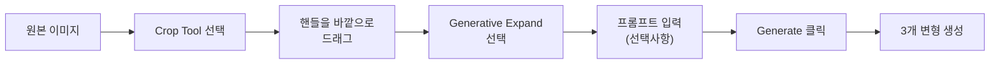
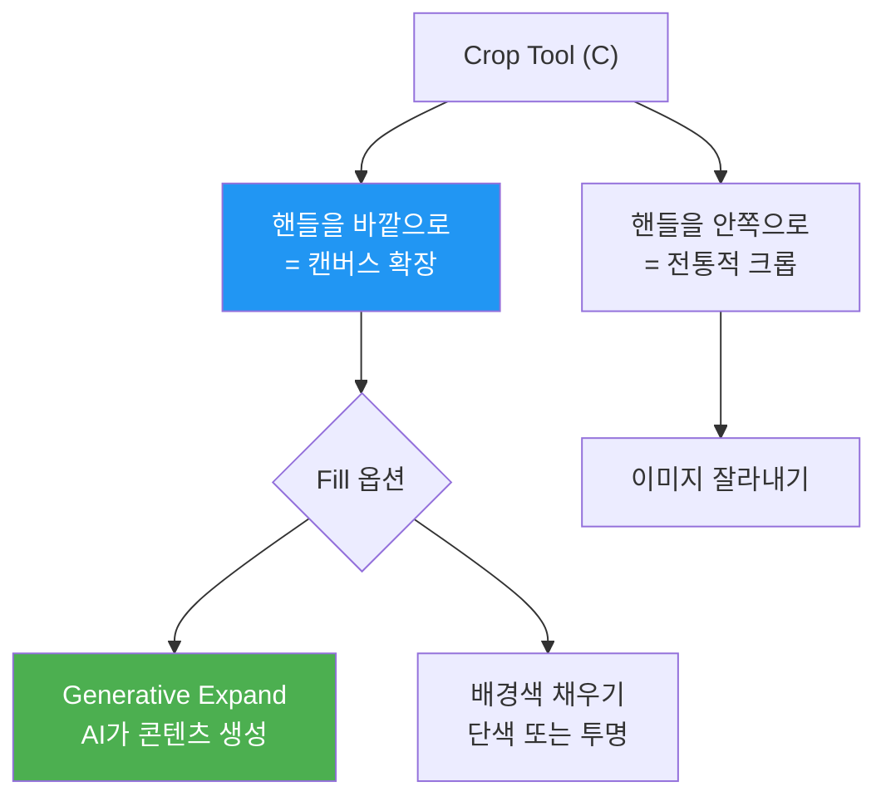
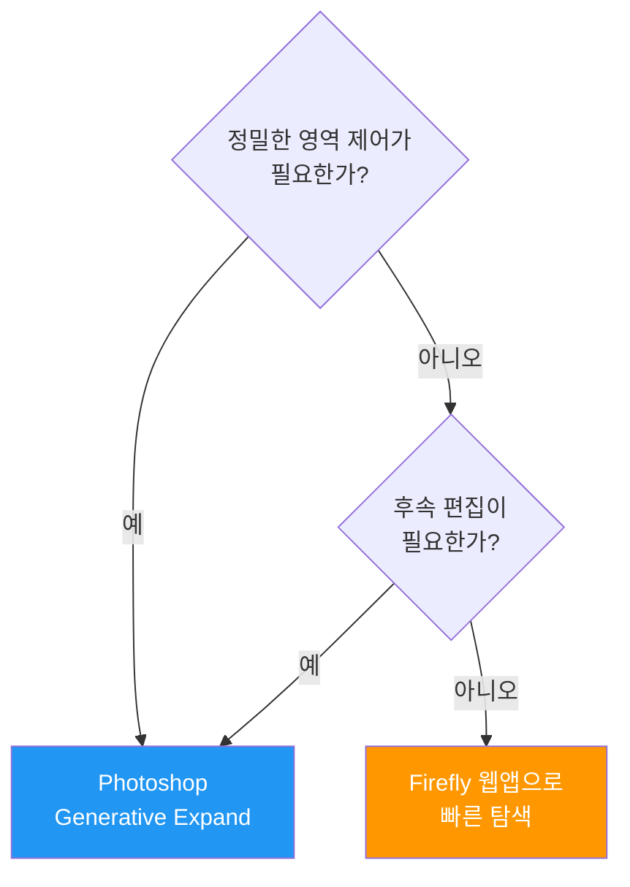

# Generative Expand와 이미지 확장

> Crop Tool 하나로 캔버스를 넓히고, AI가 바깥 장면을 자연스럽게 채워주는 아웃페인팅의 Photoshop 구현을 익힙니다.

## 개요

Adobe Photoshop의 **Generative Expand**는 이미지 경계를 바깥으로 확장하는 아웃페인팅 기능입니다. Generative Fill이 선택 영역 '안'을 채운다면, Generative Expand는 캔버스 '밖'을 채웁니다. 종횡비 변환, 크롭 복원, 멀티 플랫폼 대응까지 하나의 워크플로우로 해결할 수 있습니다.

## Generative Expand 작동 원리

Generative Expand는 **Crop Tool(단축키 C)**과 통합되어 작동합니다. 크롭 핸들을 바깥으로 드래그하면 캔버스가 확장되고, AI가 원본의 색감, 질감, 원근법을 분석해 빈 영역을 채웁니다.



**단계별 진행:**

1. **Crop Tool 활성화**: 도구 패널에서 Crop Tool(C)을 선택합니다.
2. **캔버스 확장**: 크롭 핸들을 원본 바깥으로 드래그합니다. 확장 영역이 체크 패턴으로 표시됩니다.
3. **Generative Expand 선택**: Contextual Task Bar에서 Fill 옵션을 Generative Expand로 설정합니다.
4. **프롬프트 입력(선택)**: 빈칸이면 AI가 자동 판단, 특정 요소를 원하면 프롬프트를 입력합니다.
5. **Generate 클릭**: 3개의 변형이 생성되며 Properties 패널에서 선택합니다.

```
cozy cafe interior with warm lighting, wooden furniture
```


Canvas Size(Image > Canvas Size) 메뉴로도 캔버스를 확장할 수 있습니다. 픽셀 단위로 정밀하게 크기를 지정해야 할 때 유용하며, 상하좌우 확장량을 개별 제어할 수 있습니다. 캔버스를 먼저 늘린 뒤 투명 영역을 선택하고 Generative Fill로 채우는 방식입니다.



## Firefly Fill & Expand 모델

Photoshop 2025~2026에서는 Generative Expand에 사용할 AI 모델을 직접 선택할 수 있습니다.

| 모델 | 최대 해상도 | 특징 | 추천 용도 |
|------|-----------|------|----------|
| **Firefly Fill & Expand** (최신) | 2048x2048px | 질감 연속성 우수, 이음새 최소화 | 대부분의 실무 작업 |
| **Firefly Image Model 4** | 1024x1024px | Fill & Expand보다 가벼움 | 레거시 프로젝트 호환 |

해상도가 2배(1024 -> 2048)로 증가한 것이 가장 큰 변화입니다. 모래사장, 잔디밭 같은 반복 텍스처의 자연스러움이 크게 개선되었습니다. Fill & Expand 모델은 기존 이미지와의 연속성(색상 톤 매칭, 텍스처 블렌딩, 원근법 일관성)에 특화되어 있어 아웃페인팅에 최적화되어 있습니다.

## 종횡비 변환 워크플로우

실무에서 가장 빈번한 Generative Expand 사용 사례가 **종횡비 변환**입니다.

| 변환 방향 | 사용처 | Crop Tool 설정 |
|----------|--------|---------------|
| 4:3 -> 16:9 | 유튜브 썸네일, 프레젠테이션 | Ratio: 16x9, 좌우 확장 |
| 1:1 -> 9:16 | 인스타 릴스, 틱톡 | Ratio: 9x16, 상하 확장 |
| 3:2 -> 1:1 | 인스타그램 피드 | Ratio: 1x1, 짧은 쪽 확장 |
| 세로 -> 가로 | 배너 광고, 웹 히어로 | Ratio: 3x1 또는 자유 비율 |

**프롬프트 예시 - 풍경 확장:**

```
sunset mountain landscape, golden hour lighting
```

```
ocean waves crashing on rocky shore, overcast sky
```


**프롬프트 예시 - 실내 공간 확장:**

```
modern office space with glass walls, natural light
```

```
minimalist living room, white walls, wooden floor
```


## Enhance Detail 활용

확장 영역이 흐릿하거나 디테일이 부족할 때 **Enhance Detail**로 2차 정밀화를 실행합니다.

1. Generative Expand 후 Properties 패널을 엽니다.
2. 생성된 변형 중 하나를 선택합니다.
3. **Enhance Detail 아이콘**(돋보기 모양)을 클릭합니다.
4. 텍스처와 선명도가 개선된 결과가 반환됩니다.

Enhance Detail은 추가 1크레딧을 소모하며, 확장 영역이 양쪽 모두 1000px 이상일 때 유효합니다. 웹용이나 소셜 미디어용이라면 기본 생성만으로 충분한 경우가 많고, 인쇄물이나 대형 디스플레이용일 때 적극 활용하세요.

## Firefly 웹앱 vs Photoshop 비교

| 비교 항목 | Firefly 웹앱 | Photoshop Generative Expand |
|----------|-------------|---------------------------|
| **접근성** | 브라우저만 있으면 OK | Photoshop 설치 필요 |
| **선택 도구** | 기본 브러시만 제공 | 올가미, 펜, 빠른 선택 등 전체 |
| **비파괴 편집** | 제한적 | Generative Layer로 완전 지원 |
| **Enhance Detail** | 미지원 | 지원 |
| **해상도** | 웹 기준 제한 | 2048x2048px |
| **추천 상황** | 빠른 탐색, 방향 확인 | 최종 작업물 제작 |

## 실습: 멀티 플랫폼 이미지 확장

**시나리오**: Midjourney에서 1:1로 생성한 카페 인테리어 이미지를 3가지 플랫폼에 맞게 확장합니다.

**유튜브 썸네일 (16:9):**

```
cozy cafe interior, exposed brick wall, hanging plants, warm ambient lighting
```


**인스타 스토리 (9:16):**

```
cafe ceiling with industrial pendant lights, wooden beams
```


**웹 배너 (3:1):**

```
wide cafe counter with pastry display, barista in background
```


**제품 사진 배경 확장:**

```
clean white studio backdrop, soft shadow underneath product
```


**크롭된 인물 사진 복원:**

```
professional studio background, soft gradient lighting
```

```
outdoor park setting, blurred green foliage bokeh
```


**풍경 파노라마 확장:**

```
continuation of mountain range, misty valleys, pine forest
```

```
sandy beach extending to horizon, gentle waves, clear blue sky
```




## 팁과 주의사항

- **단계적 확장**: 한 번에 너무 넓은 영역을 확장하면 품질이 떨어집니다. 2048px 한계를 넘으면 픽셀을 늘려 채우므로, 넓은 확장은 여러 번 나눠서 진행하세요.
- **프롬프트 전략**: 빈 프롬프트가 의외로 좋은 결과를 냅니다. 방향 유도가 필요하면 장면 묘사를 넣되, "beautiful", "high quality" 같은 추상적 형용사는 효과가 없습니다.
- **인물 사진 주의**: 확장 영역에 얼굴이 포함되지 않도록 프레이밍하세요. 배경이나 의상 영역 위주로 확장하면 안정적입니다.
- **모델 확인**: Contextual Task Bar에서 Firefly Fill & Expand가 선택되어 있는지 항상 확인하세요. 이전 세션 설정이 남아 구형 모델로 작업하는 실수가 생길 수 있습니다.
- **크레딧 관리**: 기본 생성 1크레딧에 3개 변형 포함, Enhance Detail 추가 시 +1크레딧. Creative Cloud 유료 플랜에는 매월 250 크레딧이 포함됩니다.
- **Generative Fill 조합**: 확장 후 특정 부분이 어색하면 해당 영역을 선택하고 Generative Fill로 부분 수정할 수 있습니다.

## 핵심 정리

| 개념 | 설명 |
|------|------|
| **Generative Expand** | Crop Tool과 통합된 아웃페인팅 기능. 캔버스 바깥을 AI가 자연스럽게 생성 |
| **Firefly Fill & Expand** | 아웃페인팅 특화 모델. 2048x2048px, 이음새 최소화, 텍스처 연속성 우수 |
| **Enhance Detail** | 생성 결과의 2차 정밀화. 추가 1크레딧, 1000px 이상 영역에서 유효 |
| **종횡비 변환** | Crop Tool의 Ratio 설정으로 1:1, 16:9, 9:16 등 자유롭게 변환 |
| **단계적 확장** | 넓은 확장은 여러 번 나눠서 진행하면 품질 유지 |
| **프롬프트 전략** | 비워두기(자동 맥락 파악) vs 장면 묘사 입력(방향 유도) |

## 다음 섹션 미리보기

다음 [04. AI 생성 이미지 결함 보정 기법](09-ch9-adobe-photoshop-firefly-리터치-워크플로우/04-04-ai-생성-이미지-결함-보정-기법.md)에서는 AI 이미지에서 흔히 발생하는 손가락 이상, 텍스트 왜곡, 비대칭 등의 결함을 Photoshop 도구로 정밀하게 수정하는 기법을 다룹니다.
