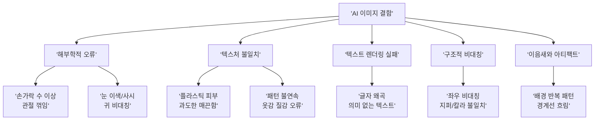
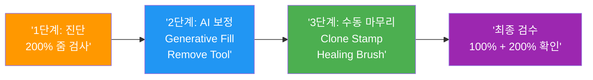
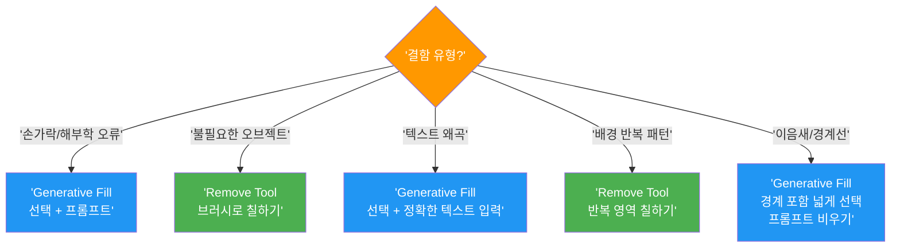

# AI 생성 이미지 결함 보정 기법

> AI가 만든 이미지의 흔한 결함을 Photoshop AI 도구와 전통 보정 도구로 전문가 수준으로 수정하는 실전 기법

## 개요

AI 생성 이미지는 대부분 "거의 완벽"하지만, 손가락 오류·텍스처 불일치·텍스트 왜곡 같은 결함이 아마추어와 프로의 차이를 만듭니다. 이 섹션에서는 결함을 체계적으로 진단하고, Generative Fill·Remove Tool·전통 보정 도구·Camera Raw Filter를 조합해 상업 품질로 끌어올리는 워크플로우를 학습합니다.

## AI 생성 이미지의 5대 결함 유형

> AI 이미지 생성은 꿈을 꾸는 것과 비슷합니다. 전체 장면은 그럴듯하지만, 자세히 보면 시계 숫자가 뒤죽박죽이거나 손가락 수가 이상하죠. AI도 "전체 인상"은 잘 잡지만 세밀한 구조적 논리에서 실수합니다.



| 결함 유형 | 원인 | 대표 증상 |
|----------|------|----------|
| 해부학적 오류 | 구조적 관계 학습 부족 | 손가락 6개, 관절 비정상 꺾임 |
| 텍스처 불일치 | 고주파 디테일 평활화 | 플라스틱 피부, 패턴 끊김 |
| 텍스트 렌더링 실패 | 철자 규칙 미인코딩 | 간판 글자 왜곡, 의미 없는 문자 |
| 구조적 비대칭 | 장거리 의존성 처리 한계 | 안경·칼라 좌우 불일치 |
| 이음새/아티팩트 | 생성 영역 경계 불일치 | 배경 반복, 경계 흐림 |


## 결함 보정 3단계 전략



### 1단계 — 체계적 진단

200% 이상 확대 후 체크리스트 기반으로 순서대로 검사합니다.

| 검사 순서 | 대상 | 확인 포인트 |
|-----------|------|------------|
| 1 | 얼굴 | 눈(동공 크기, 시선 방향), 치아, 귀 대칭 |
| 2 | 손/발 | 손가락 수, 관절 방향, 손톱 형태 |
| 3 | 텍스트 | 글자 정확성, 로고 왜곡 여부 |
| 4 | 의상/액세서리 | 좌우 대칭, 패턴 연속성 |
| 5 | 배경 | 반복 패턴, 직선 왜곡, 원근법 일관성 |
| 6 | 조명/그림자 | 광원 방향 일치, 그림자 위치 논리성 |

### 2단계 — AI 도구로 구조적 보정

결함 유형별 최적 AI 도구를 매칭합니다.



#### Generative Fill — 150% 규칙

Generative Fill로 결함을 보정할 때 선택 영역을 결함보다 약 1.5배 넓게 잡는 원칙입니다. AI가 선택 영역 바깥의 픽셀에서 조명·톤·스타일 맥락을 파악하므로, 넉넉하게 선택해야 자연스러운 결과가 나옵니다.

| 결함 부위 | 잘못된 선택 (100%) | 올바른 선택 (150%) |
|----------|-------------------|-------------------|
| 손가락 오류 | 손만 선택 | 손 + 손목 + 소매 일부 |
| 귀 비대칭 | 귀만 선택 | 귀 + 측면 머리카락 + 목 일부 |
| 칼라 불일치 | 칼라만 선택 | 칼라 + 어깨선 + 목 아래 |

**손가락 보정 프롬프트 예시**:

```
natural hand with five fingers, relaxed pose
```


```
five fingers, natural hand resting on table
```

```
realistic human hand, proper finger anatomy
```

빈 프롬프트로 3회 시도해도 결과가 불만족스러우면 위와 같은 최소한의 지시를 추가합니다.


#### Remove Tool 모드 비교

| 모드 | 원리 | 적합한 상황 | 크레딧 소모 |
|------|------|------------|------------|
| 일반 모드 | 주변 픽셀 복제·블렌딩 | 작은 아티팩트, 점, 먼지 | 없음 |
| Generative AI 모드 | Firefly로 새 픽셀 생성 | 큰 영역, 복잡한 배경 | 2026부터 무료 |

```
Remove Tool (AI mode) → 배경의 반복 패턴 영역을 브러시로 칠하기
```


### 3단계 — 전통 도구로 미세 마무리

AI 보정 후 남은 이음새·색상 불일치·텍스처 불연속은 전통 도구로 다듬습니다.

**Clone Stamp** — 텍스처 연속성 복원. 불투명도 30-50%로 여러 번 가볍게 칠하기:

```
Alt+Click으로 소스 지정 → Opacity 30-50% → 경계 부분 부드럽게 스탬프
```

**Healing Brush** — 피부 플라스틱 질감 보정. 톤 유지하면서 텍스처만 전이:

```
피부 결이 살아있는 영역을 소스로 → 매끈한 부분 위에 칠하기 → 자동 톤 매칭
```

**Patch Tool** — Content-Aware 모드로 넓은 영역 텍스처 교체:

```
문제 영역 선택 → 자연스러운 영역으로 드래그 → 자동 블렌딩
```


## Camera Raw Filter 마무리

모든 보정을 마친 후 톤·선명도·노이즈를 최종 정리합니다. Smart Object로 변환 후 적용하면 비파괴 워크플로우가 됩니다.

```
Ctrl+Shift+Alt+E (레이어 병합 복사) → Convert to Smart Object → Filter > Camera Raw Filter
```

| 패널 | 조정 항목 | AI 이미지 권장 설정 |
|------|----------|-------------------|
| Basic | Contrast | -5~-15 (AI 이미지의 과대비 완화) |
| Basic | Highlights / Shadows | 하이라이트 -20~-40, 섀도 +10~+30 |
| HSL | Saturation | 과채도 색상 개별 조정 |
| Detail | Sharpening | Amount 40-60, Masking 60-80 |
| Detail | Noise Reduction | Luminance 15-30 |
| Effects | Vignetting | -10~-20 (선택) |

```
Vibrance -10~-20, Contrast -5~-15 → 실제 사진과 나란히 비교하며 조정
```


## 실습

### 활동 1: 결함 진단 및 보정 실전

AI로 생성한 인물 이미지 하나를 골라 200% 확대 검사 후, 발견된 결함마다 보정 계획을 세우고 실행합니다.

```
1. 이미지 열기 → 200% 줌 → 체크리스트 순서대로 검사
2. 발견된 결함을 유형별로 분류
3. 결함별 도구 선택 (Generative Fill / Remove Tool / 전통 도구)
4. 150% 규칙 적용하여 선택 영역 설정
5. 보정 실행 → 3개 변형 중 최적 선택
6. 전통 도구로 이음새 마무리
7. Camera Raw Filter로 최종 톤 정리
```

### 활동 2: 보정 전략 설계 연습

| 결함 | 보정 도구 | 선택 영역 전략 | 프롬프트 |
|------|----------|--------------|---------|
| 왼손 손가락 6개 | Generative Fill | 손+손목+소매 150% → Expand 15px | 빈 프롬프트 |
| 오른쪽 귀 형태 이상 | Generative Fill | 귀+머리카락+목 150% | 빈 프롬프트 |
| 배경 나무 반복 | Remove Tool (AI) | 반복 영역 브러시 | — |
| 피부 플라스틱 질감 | Healing Brush | 소스: 텍스처 살아있는 영역 | — |

```
보정 vs 재생성 판단 기준:
- 결함이 핵심 피사체에 있고 작은 범위 → 보정
- 결함이 구도/전체 분위기 수준 → 재생성
- 나머지 90%가 만족스러운 경우 → 보정이 효율적
```

## 팁과 주의사항

- 같은 영역에 Generative Fill을 3회 이상 반복하면 텍스처가 뭉개집니다. **한 번의 Generative Fill + 전통 도구 마무리**가 더 좋은 결과를 줍니다.
- 손가락 보정 시 **프롬프트를 비워두는 것**이 의외로 효과적입니다. AI가 주변 맥락만으로 자연스러운 손을 생성하기 때문입니다.
- 보정 작업 전에 반드시 **원본 레이어를 복제**해두세요. Clone Stamp·Healing Brush는 직접 픽셀을 수정하므로, 새 빈 레이어 + "Sample All Layers" 옵션으로 비파괴 작업하세요.
- Photoshop 2026부터 Remove Tool의 Generative AI 모드가 **크레딧을 소모하지 않습니다**. 부담 없이 AI 모드를 활용하세요.
- 2026년 현재 어떤 AI 모델도 100% 완벽한 이미지를 보장하지 못합니다. 중요한 건 "결함을 빠르게 발견하고 수정하는 능력"입니다.

## 핵심 정리

| 개념 | 설명 |
|------|------|
| 5대 결함 유형 | 해부학적 오류, 텍스처 불일치, 텍스트 렌더링 실패, 구조적 비대칭, 이음새/아티팩트 |
| 3단계 보정 전략 | 진단(200% 줌 체크리스트) → AI 보정(Generative Fill/Remove Tool) → 수동 마무리(전통 도구 + Camera Raw) |
| 150% 규칙 | Generative Fill 사용 시 선택 영역을 결함보다 약 1.5배 넓게 잡아 주변 맥락을 AI에 제공 |
| Remove Tool 모드 | 일반 모드(작은 결함) vs AI 모드(큰 영역, 2026부터 크레딧 무료) |
| 전통 도구 3종 | Clone Stamp(텍스처 복제), Healing Brush(자동 블렌딩), Patch Tool(영역 교체) |
| Camera Raw 마무리 | 과채도/과대비 완화, 선명도 + 노이즈 감소, Smart Object 비파괴 적용 |

## 다음 섹션 미리보기

다음 [통합 리터치 워크플로우 프로젝트](09-ch9-adobe-photoshop-firefly-리터치-워크플로우/05-05-통합-리터치-워크플로우-프로젝트.md)에서는 Firefly 웹앱, Generative Fill, Generative Expand, 결함 보정을 하나의 파이프라인으로 통합하여 AI 생성부터 최종 납품까지의 전체 워크플로우를 실전 프로젝트로 완성합니다.
