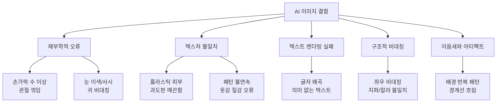
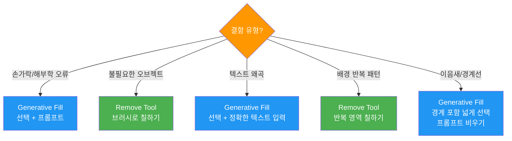
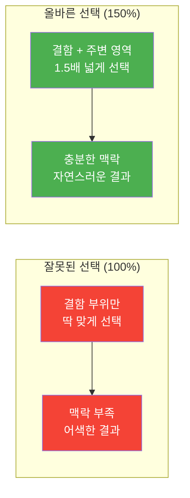
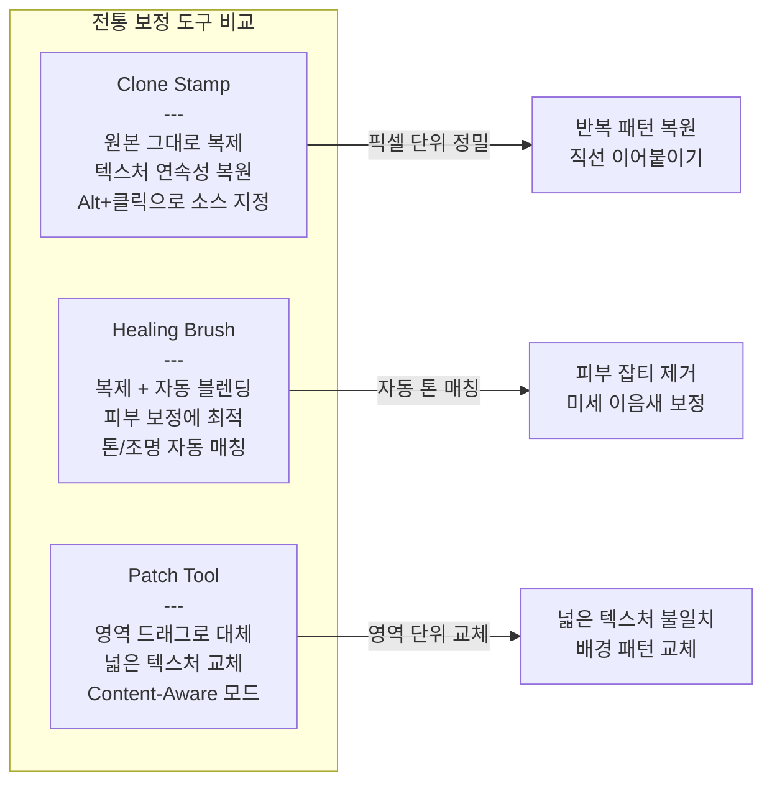
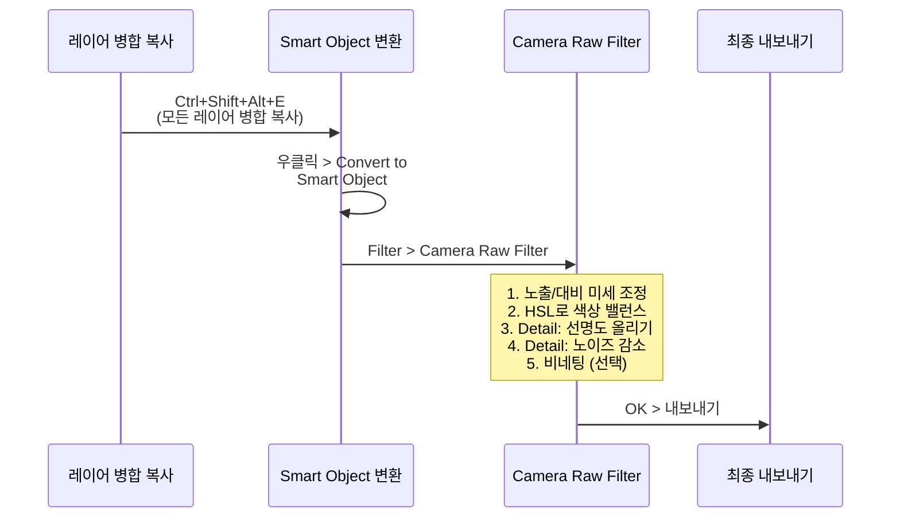

# AI 생성 이미지 결함 보정 기법

> AI가 만든 이미지의 흔한 결함을 Photoshop의 AI 도구와 전통 보정 도구로 전문가 수준으로 수정하는 실전 기법

## 개요

이 섹션에서는 AI가 생성한 이미지에서 자주 나타나는 결함 유형을 체계적으로 분류하고, Photoshop의 다양한 도구를 조합해 이를 보정하는 워크플로우를 학습합니다.

**선수 지식**: [Generative Fill의 선택 영역 + 프롬프트 기반 편집](09-ch9-adobe-photoshop-firefly-리터치-워크플로우/02-02-photoshop-generative-fill-마스터.md)과 [Generative Expand의 이미지 확장 원리](09-ch9-adobe-photoshop-firefly-리터치-워크플로우/03-03-generative-expand와-이미지-확장.md)를 이해하고 있어야 합니다.

**학습 목표**:
- AI 생성 이미지의 5대 결함 유형을 식별하고 분류할 수 있다
- Generative Fill + Remove Tool로 구조적 결함을 보정할 수 있다
- Clone Stamp, Healing Brush 등 전통 도구로 미세 결함을 다듬을 수 있다
- Camera Raw Filter로 색보정, 선명도, 노이즈 제거까지 마무리할 수 있다

## 왜 알아야 할까?

AI로 이미지를 생성하면 90%는 "거의 완벽"합니다. 하지만 나머지 10%의 결함 — 손가락이 6개라든가, 텍스트가 깨져 있다든가, 피부 질감이 플라스틱처럼 보인다든가 — 이것이 아마추어와 프로의 차이를 만들죠.

클라이언트에게 AI 생성 이미지를 납품할 때, "AI가 만들었네요"라는 말을 듣는 순간 신뢰가 무너집니다. 반대로, AI로 생성한 후 Photoshop에서 결함을 말끔히 보정하면? 클라이언트는 "어떻게 이렇게 빨리 이런 퀄리티를?"이라고 놀랍니다. 결함 보정은 단순한 수정이 아니라, **AI 이미지를 상업 품질로 승격시키는 핵심 스킬**입니다.

[Ch6에서 배운 인페인팅](06-ch6-이미지-편집-기법-img2img인페인팅아웃페인팅/02-02-인페인팅-기초-부분-수정의-기술.md)이 "특정 영역을 새로 그리는 기법"이었다면, 이번 섹션은 그 기법을 Photoshop의 전문 도구와 결합해 **실무 납품 수준의 완성도**를 달성하는 방법을 다룹니다.

## 핵심 개념

### 개념 1: AI 생성 이미지의 5대 결함 유형

> 💡 **비유**: AI 이미지 생성은 꿈을 꾸는 것과 비슷합니다. 꿈속에서는 전체 장면이 그럴듯하게 느껴지지만, 자세히 보면 시계의 숫자가 뒤죽박죽이거나 손가락 수가 이상하죠. AI도 "전체 인상"은 잘 잡지만, 세밀한 구조적 논리에서 실수합니다.

AI 이미지의 결함은 크게 다섯 가지 카테고리로 분류할 수 있는데요. 각각의 원인과 특징을 이해하면 보정 전략을 훨씬 효율적으로 세울 수 있습니다.

> 📊 **그림 1**: AI 생성 이미지의 5대 결함 분류 체계

**1. 해부학적 오류(Anatomical Errors)**: 가장 눈에 띄는 결함입니다. 손가락이 6개, 치아 배열 이상, 관절이 비정상적으로 꺾이는 등의 문제가 대표적이죠. 왜 이런 일이 생길까요? AI에게 "손"은 하나의 개념이 아니라 "손가락", "손바닥", "손목", "손톱" 등 여러 토큰으로 분해되는데, 이들 사이의 구조적 관계를 완벽히 학습하지 못했기 때문입니다. 즉, AI는 "손가락이 다섯 개여야 한다"는 규칙을 명시적으로 아는 게 아니라, 수억 장의 학습 이미지에서 통계적 패턴을 추론할 뿐이에요. 그래서 복잡한 포즈나 여러 손이 겹치는 장면에서 "통계적으로 가장 그럴듯한" 결과가 해부학적으로는 불가능한 형태가 되곤 하는 거죠.

**2. 텍스처 불일치(Texture Inconsistency)**: 피부가 플라스틱처럼 매끈하거나, 옷감의 패턴이 중간에 끊기거나, 머리카락이 한 덩어리로 뭉쳐 보이는 현상입니다. AI가 "그럴듯한 질감"을 생성하지만, 실제 물리적 특성까지 모사하지 못해서 생깁니다. 특히 디퓨전 모델은 노이즈 제거(denoising) 과정에서 고주파 디테일을 과도하게 평활화하는 경향이 있는데, 이것이 "AI 특유의 매끈한 플라스틱 느낌"의 원인입니다.

**3. 텍스트 렌더링 실패(Text Rendering Failure)**: AI가 이미지 속 글자를 정확히 렌더링하지 못하는 문제입니다. 간판, 로고, 책 표지 등에서 글자가 뒤섞이거나 의미 없는 문자가 나타나죠. GPT-4o가 이 분야에서 큰 발전을 이루었지만, 여전히 완벽하지는 않습니다. 이는 이미지 생성 모델이 "글자의 시각적 형태"는 학습하지만, "글자의 의미와 철자 규칙"은 별도로 인코딩하지 않기 때문입니다.

**4. 구조적 비대칭(Structural Asymmetry)**: 안경의 좌우가 다르거나, 셔츠 칼라의 형태가 좌우 불일치하거나, 귀걸이가 한쪽만 있는 등의 문제입니다. AI는 이미지 전체의 장거리 의존성(long-range dependency)을 처리하는 데 어려움이 있어서 발생합니다.

**5. 이음새와 아티팩트(Seams & Artifacts)**: 배경에서 같은 패턴이 반복되거나, 이미지 경계 부근에 흐릿한 영역이 생기거나, 색상이 부자연스럽게 전환되는 현상입니다. 특히 [Generative Expand](09-ch9-adobe-photoshop-firefly-리터치-워크플로우/03-03-generative-expand와-이미지-확장.md)로 확장한 이미지에서 원본과 확장부의 경계에서 자주 나타납니다.

> ⚠️ **흔한 오해**: "최신 AI 모델을 쓰면 결함이 없다"고 생각하기 쉽지만, 2026년 현재 어떤 모델도 100% 완벽한 이미지를 보장하지 못합니다. Midjourney V7, GPT-4o, Gemini 모두 각자의 약점이 있어요. 중요한 건 "결함 없는 생성"이 아니라 "결함을 빠르게 발견하고 수정하는 능력"입니다.

### 개념 2: 결함 보정의 3단계 전략 — 진단 → AI 보정 → 수동 마무리

> 💡 **비유**: 자동차 정비를 생각해보세요. 먼저 어디가 고장인지 진단하고(1단계), 부품을 교체하고(2단계), 마지막으로 도색과 광택을 내죠(3단계). AI 이미지 보정도 똑같습니다 — 결함 진단, AI 도구로 큰 수정, 전통 도구로 미세 마무리.

> 📊 **그림 2**: 결함 보정 3단계 워크플로우

**1단계 — 체계적 진단**: 이미지를 200% 이상으로 확대하여 결함을 찾는 단계입니다. 무작정 확대하는 게 아니라 **체크리스트 기반으로 순서대로 검사**하는 것이 핵심이에요.

| 검사 순서 | 대상 | 확인 포인트 |
|-----------|------|------------|
| 1 | 얼굴 | 눈(동공 크기, 시선 방향), 치아, 귀 대칭 |
| 2 | 손/발 | 손가락 수, 관절 방향, 손톱 형태 |
| 3 | 텍스트 | 글자 정확성, 로고 왜곡 여부 |
| 4 | 의상/액세서리 | 좌우 대칭, 패턴 연속성, 지퍼/단추 위치 |
| 5 | 배경 | 반복 패턴, 직선의 왜곡, 원근법 일관성 |
| 6 | 조명/그림자 | 광원 방향 일치, 그림자 위치 논리성 |

**2단계 — AI 도구로 구조적 보정**: 손가락 수정, 텍스트 교체, 배경 아티팩트 제거 등 "새로운 픽셀을 생성해야 하는" 큰 수정은 Generative Fill과 Remove Tool의 영역입니다.

**3단계 — 전통 도구로 미세 마무리**: AI 보정 후 남은 미세한 이음새, 색상 불일치, 텍스처 불연속은 Clone Stamp, Healing Brush, Patch Tool 등 전통 도구로 다듬습니다. 마지막으로 Camera Raw Filter로 전체 톤, 선명도, 노이즈를 정리합니다.

### 개념 3: AI 도구 — Generative Fill + Remove Tool 실전 보정

> 💡 **비유**: Generative Fill은 "AI 외과의사"이고, Remove Tool은 "AI 지우개"입니다. 외과의사는 정확한 부위를 잘라내고 새 조직을 이식하죠(선택 영역 + 프롬프트). 지우개는 단순히 문질러서 없애고 주변으로 자연스럽게 메웁니다(브러시로 칠하기).

> 📊 **그림 3**: 결함 유형별 최적 AI 도구 매칭

#### Generative Fill로 손가락 보정 — "150% 규칙"

AI 이미지에서 가장 흔하고 눈에 띄는 결함인 손가락 오류를 보정하는 핵심 기법입니다. 여기서 말하는 **150% 규칙**이란, Generative Fill로 결함 부위를 보정할 때 **선택 영역을 결함 영역 자체보다 약 1.5배(150%) 넓게 잡는 원칙**입니다.

왜 이 규칙이 중요할까요? Generative Fill은 선택 영역 **바깥**의 픽셀을 분석해서 조명 방향, 피부 톤, 의상 스타일 등의 맥락을 파악합니다. 결함 부위만 딱 맞게 선택하면 AI가 참조할 주변 맥락이 부족해서 어색한 결과가 나오거든요. 넉넉하게 선택해야 AI가 "이 팔에 자연스럽게 연결되는 손"처럼 전후 문맥을 이해하고 일관된 결과를 생성할 수 있습니다.

> 📊 **그림 6**: 150% 규칙 — 선택 영역 비교

구체적인 예시로 보면:

| 결함 부위 | 잘못된 선택 (100%) | 올바른 선택 (150%) |
|----------|-------------------|-------------------|
| 손가락 오류 | 손만 선택 | 손 + 손목 + 소매 일부까지 포함 |
| 귀 비대칭 | 귀만 선택 | 귀 + 측면 머리카락 + 목 일부 |
| 칼라 불일치 | 칼라만 선택 | 칼라 + 어깨선 + 목 아래까지 |
| 눈 이색증 | 눈만 선택 | 눈 + 눈썹 + 콧대 일부 |

이 150%라는 수치가 절대적인 것은 아니지만, 실무에서 검증된 경험 법칙입니다. 결함이 복잡할수록 더 넓게(200%까지) 잡는 것이 안전하고, 단순한 점이나 작은 아티팩트는 120% 정도로도 충분합니다.

**보정 순서**:
1. Lasso Tool로 문제 있는 손 + 손목 + 소매 일부를 선택 (150% 규칙 적용)
2. Select > Modify > Expand로 10-20px 확장 (경계 자연스럽게)
3. Generative Fill 실행 → 프롬프트: "natural hand with five fingers" 또는 빈 프롬프트
4. 3개의 변형 중 가장 자연스러운 것 선택
5. 마음에 드는 게 없으면 Generate Similar로 추가 변형 생성

> 🔥 **실무 팁**: 손가락 보정 시 프롬프트를 비워두는 것이 의외로 효과적일 때가 많습니다. AI가 주변 맥락만으로 자연스러운 손을 생성하니까요. 프롬프트를 넣으면 오히려 과도한 지시가 되어 부자연스러운 결과가 나올 수 있습니다. 다만 빈 프롬프트로 3회 이상 시도해도 손가락 수가 안 맞으면, 그때 "five fingers, natural pose"처럼 최소한의 지시를 추가해보세요.

#### Remove Tool — "안 쓰고 가장 많이 쓰는" 도구

Photoshop 2025에서 대폭 업그레이드된 Remove Tool은 두 가지 모드를 제공합니다:

| 모드 | 원리 | 적합한 상황 | 크레딧 소모 |
|------|------|------------|------------|
| **일반 모드** | 주변 픽셀을 복제·블렌딩 | 작은 아티팩트, 점, 먼지 | 없음 |
| **Generative AI 모드** | Firefly로 새 픽셀 생성 | 큰 영역, 복잡한 배경 보정 | Photoshop 2026부터 무료 |

Photoshop 2026에서는 Remove Tool 3가 도입되어, Generative Remove 옵션이 **Generative Credit을 소모하지 않게** 되었습니다. 이전에는 큰 영역 제거 시 크레딧이 걱정되었지만, 이제 부담 없이 사용할 수 있죠.

### 개념 4: 전통 보정 도구 — Clone Stamp, Healing Brush, Patch Tool

> 💡 **비유**: AI 도구가 "대형 공사"라면, 전통 보정 도구는 "인테리어 마감"입니다. 벽을 허물고 새로 세우는 건 AI가 하지만, 벽지 이음새를 매끄럽게 붙이고 페인트를 고르게 칠하는 건 장인의 손이 필요하죠.

> 📊 **그림 4**: 전통 보정 도구 3종 비교

#### 도구별 최적 활용 시나리오

**Clone Stamp Tool** — Generative Fill이 생성한 영역과 원본 사이에 텍스처가 미세하게 다를 때 사용합니다. `Alt + 클릭`으로 원본 영역의 텍스처를 소스로 잡고, 경계 부분에 부드럽게 스탬프를 찍어주면 이음새가 사라집니다. 브러시 불투명도를 30-50%로 낮추고 여러 번 가볍게 칠하는 것이 자연스러운 결과의 비결이에요.

**Healing Brush Tool** — 피부의 플라스틱 질감을 보정할 때 특히 유용합니다. AI가 생성한 과도하게 매끈한 피부에 실제 피부 텍스처를 입혀줄 수 있죠. 피부 결이 살아있는 영역을 소스로 잡고 매끈한 부분 위에 칠하면, 톤은 유지하면서 텍스처만 전이됩니다.

**Patch Tool** — Content-Aware 모드로 사용하면 넓은 영역의 텍스처를 한 번에 교체할 수 있습니다. 배경의 반복 패턴이 눈에 거슬릴 때, 문제 영역을 선택하고 자연스러운 영역으로 드래그하면 Photoshop이 자동으로 블렌딩해줍니다.

### 개념 5: 최종 마무리 — Camera Raw Filter로 톤·선명도·노이즈 정리

> 💡 **비유**: 모든 보정을 마친 이미지에 Camera Raw Filter를 적용하는 건, 요리의 마지막에 소금과 후추로 간을 맞추는 것과 같습니다. 재료(보정)가 완벽해도 마지막 시즈닝(톤 조정)이 없으면 완성도가 떨어지죠.

> 📊 **그림 5**: Camera Raw Filter 마무리 워크플로우

Camera Raw Filter는 RAW 파일이 아니어도 사용 가능합니다. Smart Object로 변환한 뒤 적용하면 언제든 설정을 수정할 수 있는 비파괴 워크플로우가 됩니다.

**핵심 조정 항목**:

| 패널 | 조정 항목 | AI 이미지 권장 설정 |
|------|----------|-------------------|
| Basic | Exposure, Contrast | AI 이미지는 대비가 과한 경우가 많아 Contrast를 -5~-15 정도 낮추기 |
| Basic | Highlights, Shadows | 하이라이트 -20~-40, 섀도 +10~+30으로 다이내믹 레인지 확보 |
| HSL/Color | Saturation, Luminance | 과채도 색상 개별 조정 (AI가 채도를 높이는 경향) |
| Detail | Sharpening | Amount 40-60, Masking 60-80 (엣지만 샤프닝) |
| Detail | Noise Reduction | Luminance 15-30 (AI 특유의 미세 노이즈 제거) |
| Effects | Vignetting | -10~-20 (시선 집중 효과, 선택) |

> 🔥 **실무 팁**: AI 생성 이미지의 가장 흔한 톤 문제는 **과채도**와 **과대비**입니다. Camera Raw의 Vibrance를 -10~-20, Contrast를 -5~-15 정도 낮추면 훨씬 자연스러운 느낌이 됩니다. 실제 사진과 나란히 놓고 비교하면서 조정하는 것이 가장 정확해요.

## 실습: 적용해보기

### 활동 1: 결함 진단 체크리스트 실전 적용

자신이 Midjourney, ChatGPT, 또는 Gemini로 생성한 인물 이미지 하나를 골라 아래 체크리스트로 200% 확대 검사를 진행해보세요.

| 검사 항목 | 체크 | 발견된 결함 메모 |
|----------|------|----------------|
| 눈동자 크기/색상 대칭 | ☐ | |
| 손가락 수 (양손 모두) | ☐ | |
| 치아/입술 형태 | ☐ | |
| 의상 좌우 대칭 (칼라, 단추 등) | ☐ | |
| 텍스트/로고 정확성 | ☐ | |
| 배경 반복 패턴 유무 | ☐ | |
| 피부 텍스처 자연스러움 | ☐ | |
| 조명/그림자 방향 일치 | ☐ | |

### 활동 2: 보정 전략 설계와 150% 규칙 적용

진단에서 발견한 결함 각각에 대해, 어떤 도구를 어떤 순서로 사용할지 계획을 세워보세요. 특히 Generative Fill을 사용할 결함에는 150% 규칙을 적용한 선택 영역 전략을 구체적으로 기술해보세요.

| 결함 | 보정 도구 | 선택 영역 전략 (150% 규칙 적용) | 프롬프트 (해당 시) |
|------|----------|-------------------------------|-------------------|
| 예: 왼손 손가락 6개 | Generative Fill | 손+손목+소매 150% 선택 → Expand 15px | 빈 프롬프트 |
| 예: 오른쪽 귀 형태 이상 | Generative Fill | 귀+측면 머리카락+목 일부 150% | 빈 프롬프트 |
| 예: 배경 나무 반복 | Remove Tool (AI 모드) | 반복 영역 브러시 (150% 불필요) | — |
| 예: 피부 플라스틱 질감 | Healing Brush | 소스: 텍스처 살아있는 영역 | — |
| (직접 작성) | | | |

### 토론 질문

"AI 이미지의 보정에 시간을 투자하는 것과, 프롬프트를 다듬어 더 나은 결과를 재생성하는 것 중 어느 쪽이 더 효율적일까요? 어떤 기준으로 '보정'과 '재생성'을 선택해야 할까요?"

힌트: 결함의 위치(핵심 주제 vs 배경), 결함의 크기, 나머지 영역의 만족도를 기준으로 생각해보세요.

## 더 깊이 알아보기

### "괴물 손" 문제의 기술적 배경

AI가 손을 잘 못 그리는 이유는 흥미로운 기술적 배경이 있습니다. 디퓨전 모델은 이미지를 픽셀 단위로 생성하는데, "손"이라는 개념은 토큰 수준에서 "손가락(fingers)", "손바닥(palm)", "손목(wrist)", "손톱(nail)" 등 여러 조각으로 분해됩니다. 문제는 이 조각들 사이의 **구조적 관계**(손가락은 5개여야 하고, 각각 3개의 마디가 있고, 엄지만 2개의 마디를 가진다)를 학습 데이터에서 일관되게 추출하기 어렵다는 점이에요.

훈련 데이터에서 손은 다양한 각도, 포즈, 조명으로 촬영되어 있고, 자주 가려지거나 흐릿하게 찍혀 있습니다. AI 입장에서는 "손가락이 5개"라는 규칙을 명시적으로 학습하는 게 아니라, 수많은 이미지의 통계적 패턴에서 추론해야 하는 거죠. 2023년의 Stable Diffusion 1.5 시절에는 이 문제가 심각했지만, 2025-2026년의 최신 모델들은 크게 개선되었습니다. 그래도 복잡한 포즈나 여러 사람의 교차하는 손에서는 여전히 실수가 나타나곤 합니다.

### Adobe의 "Content Credentials" — AI 보정의 투명성

흥미롭게도, Adobe는 AI로 이미지를 편집한 이력을 추적하는 Content Credentials 시스템을 Photoshop에 내장했습니다. Generative Fill이나 Remove Tool을 사용하면 해당 편집 이력이 메타데이터에 기록되죠. 이는 "이 이미지가 AI의 도움을 받았는가?"라는 질문에 투명하게 답하려는 업계의 움직임입니다. 상업 작업에서 이 기능의 존재를 인지하고, 클라이언트와 AI 사용 여부에 대해 사전에 합의하는 것이 점점 중요해지고 있습니다.

## 흔한 오해와 팁

> ⚠️ **흔한 오해**: "Generative Fill을 여러 번 반복하면 품질이 좋아진다"고 생각하기 쉽지만, 같은 영역에 Generative Fill을 3회 이상 반복하면 오히려 텍스처가 뭉개지고 디테일이 손실됩니다. 한 번의 Generative Fill + 전통 도구 마무리가 세 번의 Generative Fill보다 훨씬 나은 결과를 줍니다.

> 💡 **알고 계셨나요?**: Photoshop 2026부터 Remove Tool의 Generative AI 모드가 Generative Credit을 소모하지 않게 되었습니다. 이전에는 크레딧 절약을 위해 일반 모드만 쓰던 사용자들도 이제 부담 없이 AI 모드를 활용할 수 있게 되었죠. 또한 Generative Fill에서 Adobe Firefly 외에 Nano Banana, Flux 등 파트너 모델도 선택할 수 있게 되어, 상황에 따라 최적의 모델을 고를 수 있습니다.

> 🔥 **실무 팁**: 보정 작업 전에 반드시 **원본 레이어를 복제**해두세요. Generative Fill은 새 Generative Layer를 만들지만, Clone Stamp이나 Healing Brush는 직접 픽셀을 수정합니다. 새 빈 레이어를 만들고 "Sample All Layers" 옵션을 켜면 비파괴 방식으로 전통 도구를 사용할 수 있습니다. 이렇게 하면 언제든 보정 전후를 비교하거나 되돌릴 수 있죠.

## 핵심 정리

| 개념 | 설명 |
|------|------|
| 5대 결함 유형 | 해부학적 오류, 텍스처 불일치, 텍스트 렌더링 실패, 구조적 비대칭, 이음새/아티팩트 |
| 3단계 보정 전략 | 진단(200% 줌 체크리스트) → AI 보정(Generative Fill/Remove Tool) → 수동 마무리(전통 도구 + Camera Raw) |
| 150% 규칙 | Generative Fill 사용 시 선택 영역을 결함 부위보다 약 1.5배 넓게 잡는 원칙. 주변 맥락(조명, 톤, 의상)을 AI에게 충분히 제공하여 자연스러운 결과를 유도 |
| Remove Tool 모드 | 일반 모드(작은 결함, 빠름) vs AI 모드(큰 영역, Firefly 기반, 2026부터 크레딧 무료) |
| 전통 도구 3종 | Clone Stamp(텍스처 복제), Healing Brush(자동 블렌딩), Patch Tool(영역 교체) |
| Camera Raw 마무리 | 과채도/과대비 낮추기, 선명도 + 노이즈 감소, Smart Object로 비파괴 적용 |

## 다음 섹션 미리보기

결함 보정까지 마쳤다면, 이제 [통합 리터치 워크플로우 프로젝트](09-ch9-adobe-photoshop-firefly-리터치-워크플로우/05-05-통합-리터치-워크플로우-프로젝트.md)에서 지금까지 배운 Firefly 웹앱, Generative Fill, Generative Expand, 결함 보정을 하나의 파이프라인으로 통합합니다. AI 생성부터 최종 납품까지의 전체 워크플로우를 하나의 실전 프로젝트로 완성해볼 거예요.

## 참고 자료

- [Photoshop & Generative Fill: How To Fix AI Glitches And Remove the "AI Look"](https://aicreativehub.eu/fix-ai-glitches/) - AI 이미지의 결함을 Generative Fill로 수정하고 "AI 느낌"을 제거하는 실전 가이드
- [Adobe Photoshop Remove Tool 공식 문서](https://helpx.adobe.com/photoshop/using/remove-tool.html) - Remove Tool의 일반 모드와 Generative AI 모드 사용법 공식 가이드
- [Best Way to Fix Fingers & Hands on AI Photos](https://blog.pincel.app/fix-ai-fingers/) - AI 이미지의 손가락 결함을 수정하는 다양한 방법과 150% 규칙 설명
- [New Photoshop 2026 AI Innovations (Adobe Blog)](https://blog.adobe.com/en/publish/2026/01/27/new-photoshop-innovations-provide-creative-pros-more-control-realism-precision) - Photoshop 2026의 AI 기능 향상과 2K 출력, 파트너 모델 지원 등 최신 업데이트
- [Sharpening and Noise Reduction in Camera Raw (Adobe)](https://helpx.adobe.com/camera-raw/using/sharpening-noise-reduction-camera-raw.html) - Camera Raw의 디테일 패널 선명도/노이즈 감소 공식 문서
- [Characterizing Photorealism and Artifacts in Diffusion Model-Generated Images (CHI 2025)](https://dl.acm.org/doi/full/10.1145/3706598.3713962) - AI 생성 이미지의 아티팩트 특성을 체계적으로 분석한 학술 연구

---
### 🔗 Related Sessions
- [generative layer](09-ch9-adobe-photoshop-firefly-리터치-워크플로우/02-02-photoshop-generative-fill-마스터.md) (prerequisite)
- [generative fill 프롬프트 5대 원칙](09-ch9-adobe-photoshop-firefly-리터치-워크플로우/02-02-photoshop-generative-fill-마스터.md) (prerequisite)
- [선택 영역 황금 규칙](09-ch9-adobe-photoshop-firefly-리터치-워크플로우/02-02-photoshop-generative-fill-마스터.md) (prerequisite)
- [generative expand 워크플로우](09-ch9-adobe-photoshop-firefly-리터치-워크플로우/03-03-generative-expand와-이미지-확장.md) (prerequisite)
