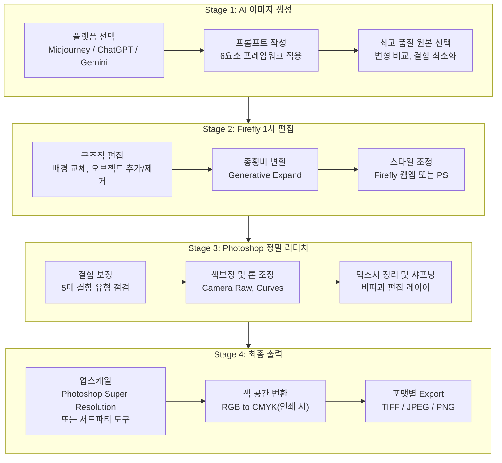
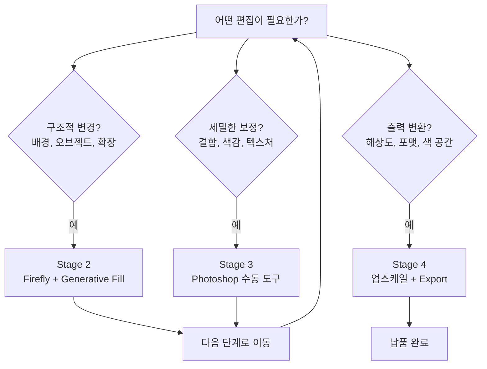
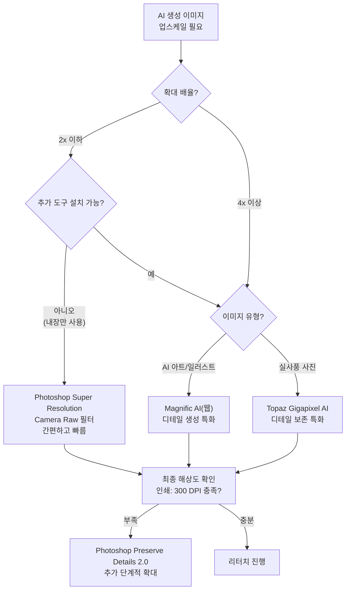
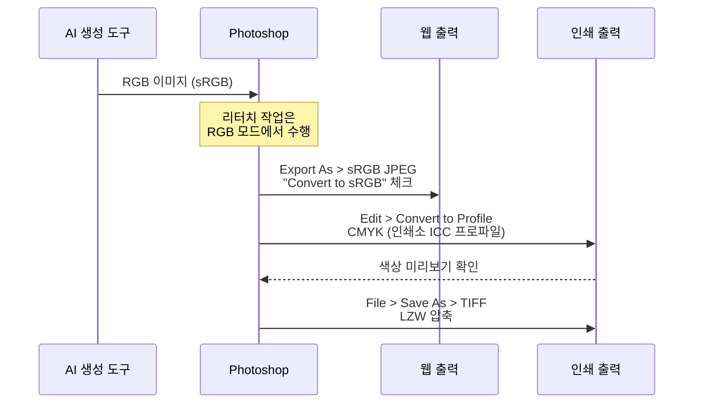
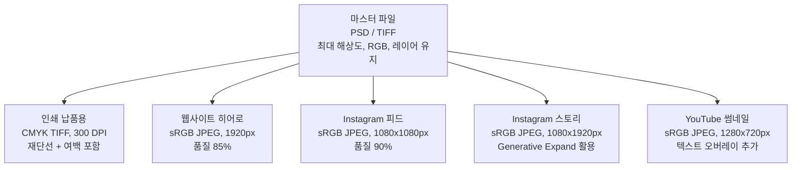

# 통합 리터치 워크플로우 프로젝트

> AI 이미지 생성부터 Firefly 편집, Photoshop 정밀 리터치, 최종 출력까지 — 상업 품질 완성의 전체 여정을 하나의 프로젝트로 체험합니다.

## 개요

이번 섹션은 Chapter 9의 대미를 장식하는 **종합 프로젝트**입니다. 지금까지 개별적으로 배운 Firefly 웹앱, Generative Fill, Generative Expand, 결함 보정 기법을 하나의 **엔드-투-엔드(end-to-end) 워크플로우**로 통합합니다. 단순히 "이미지를 예쁘게 만드는 것"을 넘어, 해상도 최적화, 파일 포맷 선택, 인쇄/디지털 출력 설정까지 **납품 가능한 최종 결과물**을 만드는 과정을 다룹니다.

**선수 지식**:
- [Firefly 웹앱 4대 기능](09-ch9-adobe-photoshop-firefly-리터치-워크플로우/01-01-adobe-firefly-웹앱-핵심-기능.md)의 이해
- [Generative Fill 프롬프트 5대 원칙](09-ch9-adobe-photoshop-firefly-리터치-워크플로우/02-02-photoshop-generative-fill-마스터.md)
- [Generative Expand 워크플로우](09-ch9-adobe-photoshop-firefly-리터치-워크플로우/03-03-generative-expand와-이미지-확장.md)
- [AI 이미지 5대 결함 유형과 3단계 보정 전략](09-ch9-adobe-photoshop-firefly-리터치-워크플로우/04-04-ai-생성-이미지-결함-보정-기법.md)

**학습 목표**:
- AI 생성 → 1차 편집 → 정밀 리터치 → 최종 출력의 4단계 워크플로우를 설계하고 실행할 수 있다
- 용도별(인쇄, 웹, SNS) 해상도와 파일 포맷을 올바르게 선택할 수 있다
- Photoshop의 업스케일 기능과 서드파티 업스케일 도구를 활용하여 AI 이미지를 인쇄 해상도로 확대할 수 있다
- 실제 클라이언트 브리프를 기반으로 상업 품질의 최종 결과물을 완성할 수 있다

## 왜 알아야 할까?

AI로 멋진 이미지를 만들었다고 해서 끝이 아닙니다. 클라이언트에게 "이 이미지를 A3 포스터로 인쇄해주세요"라는 요청을 받았을 때, 1024×1024px짜리 AI 생성 이미지를 그대로 넘기면 어떻게 될까요? 인쇄물에서 픽셀이 눈에 보이는 **저해상도 참사**가 벌어집니다.

실무에서 디자이너가 마주하는 현실은 이렇습니다:

- **"이 이미지 인스타그램 피드용이랑 배너용 두 가지로 주세요"** → 종횡비, 해상도, 색 공간이 전부 다릅니다
- **"인쇄소에서 CMYK TIFF로 달라고 하는데요?"** → RGB로 생성된 AI 이미지를 변환해야 합니다
- **"손가락이 6개인데 내일 납품이에요"** → 결함 보정부터 출력까지 한 번에 처리해야 합니다

이 모든 상황을 체계적으로 해결하는 것이 바로 **통합 리터치 워크플로우**입니다. 이 워크플로우를 익히면, AI 생성 이미지를 **상업적으로 사용 가능한 프로 수준의 결과물**로 전환하는 능력을 갖추게 됩니다.

## 핵심 개념

### 개념 1: 4단계 통합 워크플로우 아키텍처

> 💡 **비유**: 영화 제작에 비유해볼까요? AI 이미지 생성은 **촬영(Production)**, Firefly 1차 편집은 **편집(Editing)**, Photoshop 정밀 리터치는 **후반 작업(Post-Production)**, 최종 출력은 **배급(Distribution)**에 해당합니다. 영화도 촬영만 잘한다고 극장에 걸 수 없듯, AI 이미지도 생성만 잘한다고 납품할 수 없습니다.

통합 리터치 워크플로우는 4개의 명확한 단계로 구성됩니다. 각 단계는 이전 단계의 결과물을 받아 품질을 한 단계씩 끌어올리는 **파이프라인** 구조입니다.

> 📊 **그림 1**: 4단계 통합 리터치 워크플로우

**Stage 1 — AI 이미지 생성**: Midjourney, ChatGPT, Gemini 등에서 초안 이미지를 만듭니다. 이 단계에서 가장 중요한 것은 **최고 품질의 원본**을 확보하는 것입니다. [프롬프트 6요소 프레임워크](02-ch2-프롬프트-구조-마스터/01-01-프롬프트-해부학-6요소-프레임워크.md)를 충실히 적용하고, 여러 변형 중 가장 완성도 높은 버전을 선택하세요.

**Stage 2 — Firefly 1차 편집**: Firefly 웹앱 또는 Photoshop의 Generative Fill로 대형 변경을 처리합니다. 배경 교체, 오브젝트 추가/제거, 종횡비 변환 등 **구조적 편집**이 이 단계에 해당합니다.

**Stage 3 — Photoshop 정밀 리터치**: 세밀한 결함 보정, 색보정, 톤 조정, 텍스처 정리 등 **픽셀 단위의 마무리 작업**을 수행합니다. [3단계 보정 전략](09-ch9-adobe-photoshop-firefly-리터치-워크플로우/04-04-ai-생성-이미지-결함-보정-기법.md)이 여기서 빛을 발합니다.

**Stage 4 — 최종 출력**: 용도에 맞는 해상도, 색 공간, 파일 포맷으로 내보냅니다. 이 단계를 소홀히 하면 앞의 모든 노력이 물거품이 됩니다.

각 단계 사이에는 **체크포인트**가 있어야 합니다. "이 단계에서 해결할 수 있는 문제인가, 다음 단계로 넘겨야 하는 문제인가"를 판단하는 것이 워크플로우 효율의 핵심이거든요.

> 📊 **그림 2**: 단계별 도구 선택 의사결정 트리

### 개념 2: 해상도와 업스케일 전략

> 💡 **비유**: AI가 생성하는 이미지는 작은 캔버스에 그린 수채화와 비슷합니다. 그림 자체는 아름답지만, 이것을 벽면 크기의 포스터로 확대하면 붓 터치가 뭉개지죠. **AI 업스케일 도구**는 마치 원래 큰 캔버스에 그린 것처럼 디테일을 새로 만들어주는 마법의 돋보기입니다.

AI 이미지 생성 플랫폼마다 기본 출력 해상도가 다릅니다:

| 플랫폼 | 기본 출력 해상도 | 인쇄 가능 크기 (300 DPI 기준) |
|--------|-----------------|---------------------------|
| Midjourney (V6) | 1024×1024px | 약 8.7×8.7cm |
| ChatGPT (GPT-4o) | 1024×1024px | 약 8.7×8.7cm |
| Midjourney (Upscale 2x) | 2048×2048px | 약 17.3×17.3cm |
| Firefly (웹앱) | 최대 2048×2048px | 약 17.3×17.3cm |

보시다시피, AI 생성 이미지의 기본 해상도로는 A4 크기의 인쇄물도 고품질로 만들기 어렵습니다. 여기서 **업스케일 도구**가 결정적인 역할을 합니다.

**업스케일 옵션 비교 — Adobe 내장 vs 서드파티**:

Photoshop에는 자체 업스케일 기능이 내장되어 있고, 필요에 따라 서드파티 전문 도구를 함께 활용할 수 있습니다.

| 도구 | 유형 | 최대 확대 | 특징 | 적합한 용도 |
|------|------|----------|------|------------|
| **Photoshop Super Resolution** | Adobe 내장 (Camera Raw) | 2x (면적 4배) | Adobe Camera Raw 필터에서 바로 사용. 추가 설치 불필요 | 일반 사진, 빠른 워크플로우 |
| **Photoshop Preserve Details 2.0** | Adobe 내장 (Image Size) | 제한 없음 (권장 2-4x) | Image Size > Resample > Preserve Details 2.0. 노이즈 조절 가능 | 단계적 확대, 세밀 제어 |
| **Topaz Gigapixel AI** | 서드파티 (별도 구매) | 최대 6x | 독립 앱 또는 PS 플러그인. 실사 사진의 디테일 보존에 강점 | 대형 인쇄, 실사 사진 |
| **Magnific AI** | 서드파티 (웹 서비스) | 최대 16x | 웹 기반. AI 생성 이미지에 특화된 "hallucinate" 모드로 디테일 추가 | AI 아트워크, 일러스트 |

> ⚠️ **흔한 오해**: Topaz Gigapixel AI나 Magnific AI를 Photoshop에 "내장된" 기능으로 오해하는 분들이 있는데, 이들은 **별도 구매/구독이 필요한 서드파티 도구**입니다. Photoshop에 기본 내장된 업스케일 기능은 Super Resolution(Camera Raw)과 Preserve Details 2.0(Image Size)이에요. 서드파티 도구는 더 강력한 결과를 제공하지만, 추가 비용과 별도 설치가 필요하다는 점을 기억하세요.

> 📊 **그림 3**: 업스케일 도구 선택 가이드

**업스케일 실무 공식**:

인쇄물 크기를 결정했다면, 필요한 픽셀 수를 계산하세요:

$$\text{필요 픽셀} = \text{인쇄 크기(inch)} \times \text{DPI}$$

- **인쇄 크기(inch)**: 출력할 물리적 크기 (1인치 = 2.54cm)
- **DPI**: 인쇄 해상도 (일반 인쇄: 300 DPI, 대형 배너: 150 DPI)

예를 들어, A3 포스터(약 11.7×16.5인치)를 300 DPI로 인쇄하려면 3510×4950px이 필요합니다. 1024px 원본이라면 약 **4배 업스케일**이 필요한 셈이죠. Photoshop Super Resolution으로 2x → 다시 2x 단계를 거치거나, Topaz Gigapixel AI로 한 번에 4x 처리하는 방법을 선택할 수 있습니다.

### 개념 3: 용도별 파일 포맷과 색 공간

> 💡 **비유**: 파일 포맷은 음식을 담는 **그릇**과 같습니다. 같은 요리라도 도시락 용기(JPEG — 가볍고 실용적), 유리 밀폐용기(PNG — 투명도 지원, 손실 없음), 고급 접시 세트(TIFF — 완벽한 품질, 무겁지만 격조 있음)에 담느냐에 따라 용도가 달라지거든요.

출력 용도에 따라 올바른 포맷과 설정을 선택하는 것은 전문 디자이너의 **기본기** 중 기본기입니다.

| 용도 | 파일 포맷 | 색 공간 | 해상도 | 비고 |
|------|----------|--------|--------|------|
| **인쇄 납품** | TIFF (무손실) | CMYK | 300 DPI | 인쇄소 ICC 프로파일 적용 |
| **인쇄 작업용** | PSD (레이어 유지) | CMYK | 300 DPI | 수정 가능하도록 레이어 보존 |
| **웹사이트** | JPEG (품질 80-90%) | sRGB | 72 DPI | 파일 크기 최적화 |
| **SNS 업로드** | JPEG 또는 PNG | sRGB | 72 DPI | 플랫폼별 권장 크기 준수 |
| **투명 배경** | PNG-24 | sRGB | 72-150 DPI | 알파 채널 포함 |
| **대형 배너** | TIFF | CMYK | 150 DPI | 관람 거리 고려하여 DPI 하향 |

> ⚠️ **흔한 오해**: "DPI가 높으면 무조건 좋다"고 생각하기 쉽지만, 웹용 이미지에 300 DPI를 적용하면 파일 크기만 불필요하게 커질 뿐, 화면에서의 표시 품질은 72 DPI와 동일합니다. 웹에서는 DPI가 아닌 **픽셀 치수**가 품질을 결정합니다.

> 📊 **그림 4**: 색 공간 변환 워크플로우

**핵심 포인트**: AI 생성 이미지는 항상 **RGB**로 만들어집니다. 리터치 작업도 RGB에서 수행하고, **CMYK 변환은 최종 출력 직전**에 합니다. 왜냐하면 CMYK는 RGB보다 색 재현 범위(Gamut)가 좁아서, 변환 후에는 일부 선명한 색상이 탁해질 수 있기 때문이에요. 너무 일찍 변환하면 리터치 과정에서 색상 판단이 어려워집니다.

### 개념 4: 멀티 플랫폼 출력 전략

> 💡 **비유**: 하나의 AI 이미지에서 여러 출력물을 만드는 것은 **원단 한 벌로 여러 옷을 재단**하는 것과 같습니다. 같은 원단이지만 코트, 재킷, 조끼를 만들려면 각각 다른 패턴과 재단법이 필요하듯, 하나의 이미지도 포스터, 인스타그램, 웹 배너에 맞게 각각 다른 설정으로 내보내야 합니다.

실무에서는 하나의 이미지를 여러 매체에 맞게 변환하는 일이 빈번합니다. 이때 효율적인 전략은 **마스터 파일** 하나를 만들고, 여기서 각 용도별 버전을 파생시키는 것입니다.

> 📊 **그림 5**: 마스터 파일 기반 멀티 출력 전략

**마스터 파일 구성 원칙**:

1. **최대 해상도 유지**: 업스케일 도구로 가능한 최대 크기로 확대한 상태
2. **RGB 색 공간**: CMYK 변환은 인쇄 출력 시에만
3. **레이어 보존**: Generative Layer, 보정 레이어, 텍스트 레이어를 모두 유지
4. **PSD 또는 TIFF 포맷**: 무손실 + 레이어 지원

이렇게 마스터 파일을 유지하면, 나중에 클라이언트가 "LinkedIn 배너 버전도 추가해주세요"라고 요청해도 마스터에서 바로 파생시킬 수 있습니다.

## 실습: 적용해보기

### 프로젝트 시나리오: "카페 브랜딩 비주얼 제작"

가상의 클라이언트 브리프를 기반으로 통합 워크플로우를 실행해봅시다.

**클라이언트 브리프**:
- 브랜드: "숲속의 찻잔" (자연 친화적 카페)
- 필요 결과물:
  - A3 포스터 1장 (인쇄용)
  - 인스타그램 피드 이미지 1장 (1080×1080)
  - 웹사이트 히어로 배너 1장 (1920×600)
- 분위기: 따뜻하고 아늑한, 숲속의 평온함
- 핵심 요소: 세라믹 찻잔, 자연광, 나무 테이블, 허브 식물

---

**워크시트: 단계별 작업 계획서**

아래 워크시트를 채워보면서 자신만의 워크플로우를 설계해보세요.

**Stage 1 — AI 이미지 생성**

| 항목 | 내 계획 |
|------|--------|
| 선택한 플랫폼 | (예: Midjourney / ChatGPT / Gemini) |
| 프롬프트 초안 | (6요소 프레임워크에 맞춰 작성) |
| 종횡비 설정 | (최종 용도 중 가장 큰 것 기준) |
| 생성 후 선택 기준 | (구도? 분위기? 결함 최소?) |

**Stage 2 — Firefly 1차 편집 체크리스트**

- [ ] 배경에서 제거하거나 교체할 요소가 있는가?
- [ ] 오브젝트를 추가해야 하는가? (예: 허브 식물)
- [ ] 종횡비 변환이 필요한가? (Generative Expand)
- [ ] Firefly 웹앱 vs Photoshop Generative Fill 중 어디서 작업할 것인가?

**Stage 3 — Photoshop 정밀 리터치 체크리스트**

- [ ] [5대 결함 유형](09-ch9-adobe-photoshop-firefly-리터치-워크플로우/04-04-ai-생성-이미지-결함-보정-기법.md) 점검 완료
- [ ] 색보정 (Camera Raw Filter / Curves / Color Balance)
- [ ] 샤프닝 적용 (출력 매체별 강도 조절)
- [ ] 비파괴 편집 레이어 구조 확인

**Stage 4 — 최종 출력 매트릭스**

| 출력물 | 포맷 | 색 공간 | 해상도 | 크기 |
|--------|------|--------|--------|------|
| A3 포스터 | TIFF | CMYK | 300 DPI | 3508×4961px |
| 인스타그램 피드 | JPEG | sRGB | 72 DPI | 1080×1080px |
| 웹 히어로 배너 | JPEG | sRGB | 72 DPI | 1920×600px |

---

### 토론 질문

1. **도구 선택**: 이 프로젝트에서 Stage 1의 AI 생성 플랫폼으로 어떤 것을 선택하시겠습니까? [플랫폼별 비교](01-ch1-ai-이미지-생성-개론/02-02-주요-플랫폼-비교-chatgpt-vs-gemini-vs-midjourney.md)를 참고하여 이유를 설명해보세요.

2. **효율 vs 품질**: Stage 2에서 Firefly 웹앱과 Photoshop Generative Fill 중 어떤 것을 먼저 사용할지 어떤 기준으로 결정하시겠습니까?

3. **해상도 전략**: A3 포스터용으로 Photoshop 내장 기능(Super Resolution, Preserve Details 2.0)과 서드파티 도구(Topaz Gigapixel AI, Magnific AI) 중 어떤 것을 선택하시겠습니까? 이미지 스타일과 예산에 따라 달라질 수 있는 이유는 무엇일까요?

## 더 깊이 알아보기

### Photoshop의 출력 혁명: 30년의 여정

Photoshop이 처음 세상에 나온 1990년, 이미지 편집의 최종 출력이란 거의 **인쇄** 한 가지뿐이었습니다. Thomas Knoll과 John Knoll 형제가 만든 초기 Photoshop은 사실상 **스캐너로 가져온 사진을 인쇄에 맞게 보정하는 도구**였죠.

당시의 워크플로우는 놀라울 정도로 단순했습니다: 스캔 → 보정 → CMYK TIFF로 저장 → 인쇄소에 디스크 전달. "해상도"라는 개념도 오로지 인쇄 DPI를 의미했습니다.

그런데 1990년대 중반 **월드 와이드 웹**이 등장하면서 상황이 완전히 달라졌습니다. 갑자기 "72 DPI의 작은 JPEG"라는 새로운 출력 형식이 필요해진 거예요. Photoshop 5.5(1999년)에서 처음 "Save for Web" 기능이 추가된 것이 바로 이 변화에 대한 응답이었습니다.

2010년대에 접어들면서 스마트폰, 태블릿, 레티나 디스플레이의 등장으로 출력 형식은 폭발적으로 늘어났고, 2020년대에는 AI 이미지 생성이라는 전혀 새로운 입력 소스가 추가되었습니다. Photoshop의 최신 업스케일 기능들은 이 30년 여정의 최신 장(chapter)으로, **AI가 만든 저해상도 이미지를 인쇄 품질로 끌어올리는** 역할을 합니다. 스캔 → 보정 → 인쇄의 단순한 흐름이, AI 생성 → 리터치 → 업스케일 → 멀티 플랫폼 출력이라는 복잡한 파이프라인으로 진화한 셈이죠.

### "Export As" vs "Save for Web" — 끝나지 않은 논쟁

Photoshop에는 웹용 이미지를 내보내는 두 가지 방법이 공존합니다. CC 2015에서 도입된 "Export As"와 1999년부터 존재한 레거시 "Save for Web"이죠. Adobe는 "Export As"를 권장하지만, 많은 베테랑 디자이너들은 여전히 "Save for Web"의 세밀한 제어를 선호합니다. 이 논쟁은 25년이 넘도록 이어지고 있는데, 실은 둘 다 알아두는 것이 정답입니다 — Export As는 빠른 작업에, Save for Web은 파일 크기를 극한까지 줄여야 할 때 유용하거든요.

## 흔한 오해와 팁

> ⚠️ **흔한 오해**: "RGB로 작업한 이미지를 CMYK로 변환하면 색이 완전히 달라진다"는 과장된 공포가 있는데요. 실제로는 대부분의 색상이 잘 보존되고, 문제가 되는 것은 **매우 채도 높은 파란색, 녹색, 보라색** 계열뿐입니다. Photoshop에서 View > Proof Colors (Ctrl/Cmd+Y)로 미리 CMYK 시뮬레이션을 보면서 작업하면, 변환 후 놀랄 일이 없습니다.

> 💡 **알고 계셨나요?**: AI 이미지 업스케일 기술은 크게 두 가지 철학으로 나뉩니다. 하나는 **보존(preservation)** — 기존 디테일을 최대한 살리면서 확대하는 방식(Topaz Gigapixel AI가 대표적)이고, 다른 하나는 **생성(hallucination)** — AI가 원본에 없던 디테일을 창의적으로 추가하는 방식(Magnific AI 등)입니다. AI 생성 이미지처럼 원본 디테일이 부족한 경우에는 생성 방식이 더 자연스러운 결과를 만들어내는 경우가 많습니다.

> 🔥 **실무 팁**: 멀티 플랫폼 출력 작업 시 Photoshop의 **Image > Canvas Size**로 종횡비를 먼저 변경한 뒤 빈 영역을 Generative Expand로 채우면, 하나의 마스터 이미지에서 정사각형(인스타), 16:9(유튜브), 3:1(웹 배너) 등 다양한 비율의 이미지를 빠르게 파생시킬 수 있습니다. 매번 새로 생성하는 것보다 **시각적 일관성**도 유지됩니다.

> 🔥 **실무 팁**: 최종 출력 시 샤프닝은 **용도별로 다르게** 적용해야 합니다. 인쇄용은 화면에서 보기에 살짝 과한 느낌이 나야 정상이고, 웹용은 화면에서 자연스러운 수준이면 됩니다. 이를 위해 마스터 파일에는 샤프닝을 적용하지 않고, 각 출력 버전을 만들 때 **Smart Sharpen 또는 Unsharp Mask**를 매체에 맞게 따로 적용하세요.

## 핵심 정리

| 개념 | 설명 |
|------|------|
| 4단계 워크플로우 | AI 생성 → Firefly 1차 편집 → Photoshop 정밀 리터치 → 최종 출력 |
| 마스터 파일 | 최대 해상도, RGB, 레이어 유지된 PSD/TIFF — 모든 출력의 원본 |
| Adobe 내장 업스케일 | Super Resolution(Camera Raw, 2x) / Preserve Details 2.0(Image Size) |
| 서드파티 업스케일 | Topaz Gigapixel AI(실사 특화) / Magnific AI(AI 아트 특화) — 별도 구매 필요 |
| 인쇄 출력 설정 | CMYK, 300 DPI, TIFF, 인쇄소 ICC 프로파일 적용 |
| 디지털 출력 설정 | sRGB, 72 DPI, JPEG(품질 80-90%), "Convert to sRGB" 체크 |
| 색 공간 변환 시점 | 리터치는 RGB에서 완료, CMYK 변환은 최종 출력 직전에 수행 |
| 멀티 플랫폼 전략 | 마스터 파일에서 용도별 버전 파생 — Generative Expand로 종횡비 대응 |
| 업스케일 공식 | 필요 픽셀 = 인쇄 크기(inch) x DPI |

## 다음 섹션 미리보기

Chapter 9에서 익힌 리터치와 출력 역량을 바탕으로, 다음 [Ch10. Midjourney 영상 생성](10-ch10-midjourney-영상-생성/01-01-midjourney-비디오-모델-소개.md)에서는 정지 이미지를 넘어 **동영상 생성**의 세계로 발을 내딛습니다. Midjourney의 비디오 모델을 소개하고, 우리가 만든 이미지에 생명을 불어넣는 Image-to-Video 기법을 배울 예정입니다. AI로 생성하고, Photoshop으로 완성한 이미지가 움직이기 시작하는 경험 — 기대해주세요.

## 참고 자료

- [Adobe Photoshop Generative Fill 공식 가이드](https://helpx.adobe.com/photoshop/desktop/create-open-import-images/create-images/edit-images-with-generative-fill.html) - Generative Fill의 최신 기능과 사용법을 공식 문서에서 확인
- [Adobe Camera Raw Super Resolution 공식 가이드](https://helpx.adobe.com/camera-raw/using/super-resolution.html) - Photoshop 내장 Super Resolution 기능의 공식 사용법
- [Adobe 공식: Export 설정과 환경설정](https://helpx.adobe.com/photoshop/desktop/save-and-export/export-files-to-different-formats/export-settings-and-export-location-preferences.html) - 파일 포맷별 Export 설정 상세 가이드
- [Topaz Gigapixel AI 공식 사이트](https://www.topazlabs.com/gigapixel) - 서드파티 업스케일 도구의 기능과 가격 확인
- [JPEG vs TIFF 비교 (Adobe 공식)](https://www.adobe.com/creativecloud/file-types/image/comparison/jpeg-vs-tiff.html) - 인쇄와 웹 출력에서의 포맷 차이를 공식 가이드로 학습
- [AI 이미지 인쇄용 업스케일 가이드 (Let's Enhance)](https://letsenhance.io/blog/guide/upscale-ai-generated-image-for-print/) - AI 생성 이미지를 대형 인쇄물로 변환하는 실전 가이드

---
### 🔗 Related Sessions
- [6요소 프레임워크](02-ch2-프롬프트-구조-마스터/01-01-프롬프트-해부학-6요소-프레임워크.md) (prerequisite)
- [firefly 웹앱 4대 기능](09-ch9-adobe-photoshop-firefly-리터치-워크플로우/01-01-adobe-firefly-웹앱-핵심-기능.md) (prerequisite)
- [generative fill 프롬프트 5대 원칙](09-ch9-adobe-photoshop-firefly-리터치-워크플로우/02-02-photoshop-generative-fill-마스터.md) (prerequisite)
- [generative expand 워크플로우](09-ch9-adobe-photoshop-firefly-리터치-워크플로우/03-03-generative-expand와-이미지-확장.md) (prerequisite)
- [5대 결함 분류 체계](09-ch9-adobe-photoshop-firefly-리터치-워크플로우/04-04-ai-생성-이미지-결함-보정-기법.md) (prerequisite)
- [3단계 보정 워크플로우](09-ch9-adobe-photoshop-firefly-리터치-워크플로우/04-04-ai-생성-이미지-결함-보정-기법.md) (prerequisite)
