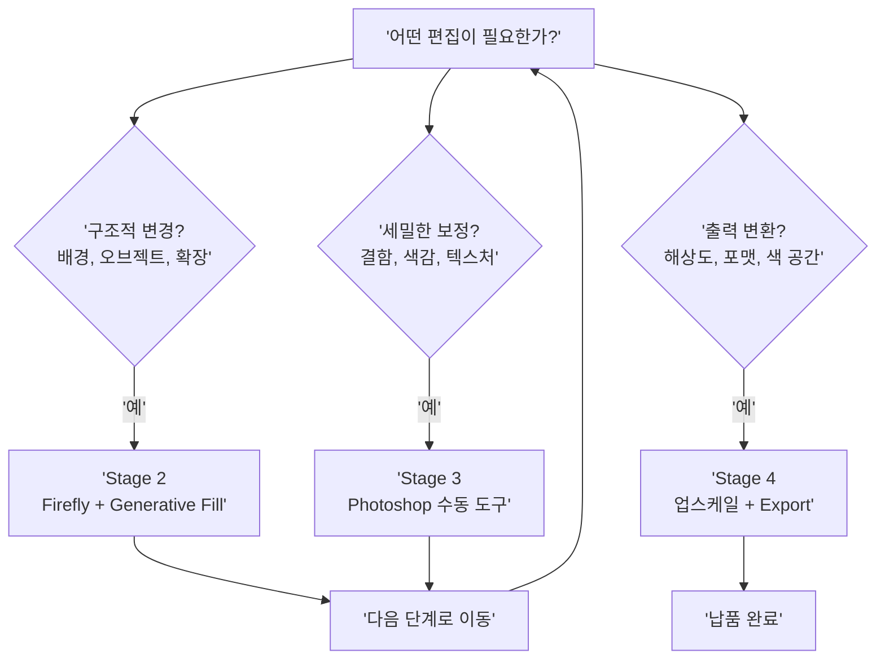

# 통합 리터치 워크플로우 프로젝트

> AI 생성부터 Firefly 편집, Photoshop 리터치, 최종 출력까지 — 상업 품질 완성의 전체 여정을 하나의 프로젝트로 체험합니다.

## 개요

이번 섹션은 Chapter 9의 종합 프로젝트입니다. Firefly 웹앱, Generative Fill, Generative Expand, 결함 보정 기법을 하나의 **엔드-투-엔드 워크플로우**로 통합합니다. 해상도 최적화, 파일 포맷 선택, 인쇄/디지털 출력 설정까지 **납품 가능한 최종 결과물**을 만드는 전 과정을 다룹니다.

## 4단계 통합 워크플로우 아키텍처

> 영화 제작에 비유하면, AI 이미지 생성은 촬영(Production), Firefly 1차 편집은 편집(Editing), Photoshop 정밀 리터치는 후반 작업(Post-Production), 최종 출력은 배급(Distribution)에 해당합니다.

```mermaid
flowchart TD
    subgraph S1['Stage 1: AI 이미지 생성']
        A1['플랫폼 선택<br/>Midjourney / ChatGPT / Gemini'] --> A2['프롬프트 작성<br/>6요소 프레임워크 적용']
        A2 --> A3['최고 품질 원본 선택<br/>변형 비교, 결함 최소화']
    end
    subgraph S2['Stage 2: Firefly 1차 편집']
        B1['구조적 편집<br/>배경 교체, 오브젝트 추가/제거'] --> B2['종횡비 변환<br/>Generative Expand']
        B2 --> B3['스타일 조정<br/>Firefly 웹앱 또는 PS']
    end
    subgraph S3['Stage 3: Photoshop 정밀 리터치']
        C1['결함 보정<br/>5대 결함 유형 점검'] --> C2['색보정 및 톤 조정<br/>Camera Raw, Curves']
        C2 --> C3['텍스처 정리 및 샤프닝<br/>비파괴 편집 레이어']
    end
    subgraph S4['Stage 4: 최종 출력']
        D1['업스케일<br/>Photoshop Super Resolution<br/>또는 서드파티 도구'] --> D2['색 공간 변환<br/>RGB to CMYK(인쇄 시)']
        D2 --> D3['포맷별 Export<br/>TIFF / JPEG / PNG']
    end
    S1 --> S2 --> S3 --> S4
```

**Stage 1 — AI 이미지 생성**: 플랫폼에서 초안 이미지를 만들고 **최고 품질의 원본**을 확보합니다. 6요소 프레임워크를 적용하고, 여러 변형 중 가장 완성도 높은 버전을 선택하세요.

**Stage 2 — Firefly 1차 편집**: 배경 교체, 오브젝트 추가/제거, 종횡비 변환 등 **구조적 편집**을 처리합니다.

**Stage 3 — Photoshop 정밀 리터치**: 결함 보정, 색보정, 톤 조정, 텍스처 정리 등 **픽셀 단위의 마무리 작업**을 수행합니다.

**Stage 4 — 최종 출력**: 용도에 맞는 해상도, 색 공간, 파일 포맷으로 내보냅니다.



## 해상도와 업스케일 전략

AI 이미지 생성 플랫폼마다 기본 출력 해상도가 다릅니다:

| 플랫폼 | 기본 출력 해상도 | 인쇄 가능 크기 (300 DPI 기준) |
|--------|-----------------|---------------------------|
| Midjourney (V7) | 1024x1024px | 약 8.7x8.7cm |
| ChatGPT (GPT-4o) | 1024x1024px | 약 8.7x8.7cm |
| Midjourney (Upscale 2x) | 2048x2048px | 약 17.3x17.3cm |
| Firefly (웹앱) | 최대 2048x2048px | 약 17.3x17.3cm |

**업스케일 옵션 비교**:

| 도구 | 유형 | 최대 확대 | 적합한 용도 |
|------|------|----------|------------|
| **Photoshop Super Resolution** | Adobe 내장 (Camera Raw) | 2x (면적 4배) | 일반 사진, 빠른 워크플로우 |
| **Photoshop Preserve Details 2.0** | Adobe 내장 (Image Size) | 권장 2-4x | 단계적 확대, 세밀 제어 |
| **Topaz Gigapixel AI** | 서드파티 (별도 구매) | 최대 6x | 대형 인쇄, 실사 사진 |
| **Magnific AI** | 서드파티 (웹 서비스) | 최대 16x | AI 아트워크, 일러스트 |

**업스케일 실무 공식**: 필요 픽셀 = 인쇄 크기(inch) x DPI

예를 들어, A3 포스터(약 11.7x16.5인치)를 300 DPI로 인쇄하려면 3510x4950px이 필요합니다. 1024px 원본이라면 약 **4배 업스케일**이 필요합니다.

## 용도별 파일 포맷과 색 공간

| 용도 | 파일 포맷 | 색 공간 | 해상도 | 비고 |
|------|----------|--------|--------|------|
| **인쇄 납품** | TIFF (무손실) | CMYK | 300 DPI | 인쇄소 ICC 프로파일 적용 |
| **인쇄 작업용** | PSD (레이어 유지) | CMYK | 300 DPI | 수정 가능하도록 레이어 보존 |
| **웹사이트** | JPEG (품질 80-90%) | sRGB | 72 DPI | 파일 크기 최적화 |
| **SNS 업로드** | JPEG 또는 PNG | sRGB | 72 DPI | 플랫폼별 권장 크기 준수 |
| **투명 배경** | PNG-24 | sRGB | 72-150 DPI | 알파 채널 포함 |
| **대형 배너** | TIFF | CMYK | 150 DPI | 관람 거리 고려하여 DPI 하향 |

AI 생성 이미지는 항상 **RGB**로 만들어집니다. 리터치 작업도 RGB에서 수행하고, **CMYK 변환은 최종 출력 직전**에 합니다. CMYK는 RGB보다 색 재현 범위(Gamut)가 좁아서, 너무 일찍 변환하면 리터치 과정에서 색상 판단이 어려워집니다.


## 멀티 플랫폼 출력 전략

실무에서는 하나의 이미지를 여러 매체에 맞게 변환해야 합니다. **마스터 파일** 하나를 만들고, 여기서 각 용도별 버전을 파생시키는 것이 효율적입니다.

**마스터 파일 구성 원칙**:

1. **최대 해상도 유지**: 업스케일 도구로 가능한 최대 크기로 확대
2. **RGB 색 공간**: CMYK 변환은 인쇄 출력 시에만
3. **레이어 보존**: Generative Layer, 보정 레이어, 텍스트 레이어 모두 유지
4. **PSD 또는 TIFF 포맷**: 무손실 + 레이어 지원

## 실습: 카페 브랜딩 비주얼 제작

**클라이언트 브리프**:
- 브랜드: "숲속의 찻잔" (자연 친화적 카페)
- 필요 결과물: A3 포스터 1장(인쇄용), 인스타그램 피드 1장(1080x1080), 웹 히어로 배너 1장(1920x600)
- 분위기: 따뜻하고 아늑한, 숲속의 평온함
- 핵심 요소: 세라믹 찻잔, 자연광, 나무 테이블, 허브 식물

### Stage 1 — AI 이미지 생성

카페 분위기에 맞는 이미지를 생성합니다. 여러 프롬프트를 시도하고 최고 품질 원본을 선택하세요.

```
A ceramic tea cup on a wooden table in a forest cafe, warm natural sunlight streaming through windows, fresh herb plants nearby, cozy atmosphere, soft bokeh background, professional food photography, 4K, high detail
```


종횡비를 가장 큰 출력물(A3 포스터, 세로형) 기준으로 설정합니다:

```
--ar 2:3 --style raw --v 6
```

더 따뜻한 분위기가 필요하면 프롬프트를 조정합니다:

```
A handcrafted ceramic cup filled with herbal tea, steam rising gently, rustic wooden table surface, potted rosemary and mint plants, warm golden hour lighting, forest visible through large window, hygge aesthetic, shot on Canon EOS R5, 85mm lens, shallow depth of field
```


### Stage 2 — Firefly 1차 편집

배경이나 구성 요소를 수정합니다. Generative Fill로 오브젝트를 추가/제거하세요.

```
Photoshop > Select subject > Inverse selection > Generative Fill: "warm forest cafe interior with large windows and natural light, wooden shelves with plants"
```


웹 배너용 종횡비 확장도 이 단계에서 처리합니다:

```
Canvas Size: 1920x600 기준 비율로 확장 > Generative Expand로 빈 영역 채우기
```


허브 식물을 추가해야 한다면:

```
Generative Fill (선택 영역 지정 후): "small potted rosemary plant on the table corner, natural lighting"
```

### Stage 3 — Photoshop 정밀 리터치

5대 결함 유형을 점검하고 보정합니다.

```
Camera Raw Filter > Temperature: +8 > Tint: +3 > Exposure: +0.2 > Highlights: -15 > Shadows: +20 > Vibrance: +12
```


텍스처와 디테일을 정리합니다:

```
Smart Sharpen > Amount: 120% > Radius: 1.0px > Reduce Noise: 10% (새 레이어에 비파괴 적용)
```

결함이 발견되면 Clone Stamp과 Healing Brush로 수정합니다:

```
Clone Stamp Tool (S) > Sample: Current & Below > Opacity: 80% > 결함 영역 수동 보정
```

### Stage 4 — 최종 출력

**출력 매트릭스**:

| 출력물 | 포맷 | 색 공간 | 해상도 | 크기 |
|--------|------|--------|--------|------|
| A3 포스터 | TIFF | CMYK | 300 DPI | 3508x4961px |
| 인스타그램 피드 | JPEG | sRGB | 72 DPI | 1080x1080px |
| 웹 히어로 배너 | JPEG | sRGB | 72 DPI | 1920x600px |

A3 포스터용 업스케일:

```
Camera Raw Filter > 우클릭 > Enhance > Super Resolution 체크 > Enhance (2x 적용, 필요시 반복)
```


인쇄용 CMYK 변환:

```
Edit > Convert to Profile > Destination Space: 인쇄소 제공 ICC 프로파일 (없으면 Japan Color 2001 Coated) > Intent: Relative Colorimetric > Black Point Compensation 체크
```

각 용도별 Export:

```
인쇄: File > Save As > TIFF > LZW 압축 > ICC Profile 포함
웹/SNS: File > Export As > JPEG > Quality 85% > Convert to sRGB 체크 > 크기 지정
```


## 팁과 주의사항

- **Topaz Gigapixel AI, Magnific AI는 서드파티 도구**로 별도 구매/구독이 필요합니다. Photoshop에 기본 내장된 업스케일 기능은 Super Resolution(Camera Raw)과 Preserve Details 2.0(Image Size)입니다.
- **웹용 이미지에 300 DPI를 적용하면** 파일 크기만 커질 뿐 화면 품질은 72 DPI와 동일합니다. 웹에서는 DPI가 아닌 **픽셀 치수**가 품질을 결정합니다.
- **RGB에서 CMYK 변환 시** 대부분의 색상은 잘 보존되고, 문제가 되는 것은 채도 높은 파란색, 녹색, 보라색 계열뿐입니다. View > Proof Colors (Cmd+Y)로 미리 시뮬레이션하세요.
- **멀티 플랫폼 출력 시** Canvas Size로 종횡비를 변경한 뒤 Generative Expand로 빈 영역을 채우면 시각적 일관성을 유지하면서 다양한 비율을 빠르게 만들 수 있습니다.
- **샤프닝은 용도별로 다르게** 적용합니다. 마스터 파일에는 샤프닝을 적용하지 않고, 각 출력 버전에 Smart Sharpen 또는 Unsharp Mask를 매체에 맞게 따로 적용하세요.
- AI 업스케일은 **보존(preservation)** 방식(Topaz — 기존 디테일 유지)과 **생성(hallucination)** 방식(Magnific — 디테일 추가)으로 나뉩니다. AI 생성 이미지처럼 원본 디테일이 부족한 경우 생성 방식이 더 자연스러울 수 있습니다.

## 핵심 정리

| 개념 | 설명 |
|------|------|
| 4단계 워크플로우 | AI 생성 → Firefly 1차 편집 → Photoshop 정밀 리터치 → 최종 출력 |
| 마스터 파일 | 최대 해상도, RGB, 레이어 유지된 PSD/TIFF — 모든 출력의 원본 |
| Adobe 내장 업스케일 | Super Resolution(Camera Raw, 2x) / Preserve Details 2.0(Image Size) |
| 서드파티 업스케일 | Topaz Gigapixel AI(실사 특화) / Magnific AI(AI 아트 특화) — 별도 구매 필요 |
| 인쇄 출력 설정 | CMYK, 300 DPI, TIFF, 인쇄소 ICC 프로파일 적용 |
| 디지털 출력 설정 | sRGB, 72 DPI, JPEG(품질 80-90%), Convert to sRGB 체크 |
| 색 공간 변환 시점 | 리터치는 RGB에서 완료, CMYK 변환은 최종 출력 직전에 수행 |
| 멀티 플랫폼 전략 | 마스터 파일에서 용도별 버전 파생 — Generative Expand로 종횡비 대응 |
| 업스케일 공식 | 필요 픽셀 = 인쇄 크기(inch) x DPI |

## 다음 섹션 미리보기

다음 챕터 [Ch10. Midjourney 영상 생성](10-ch10-midjourney-영상-생성/01-01-midjourney-비디오-모델-소개.md)에서는 정지 이미지를 넘어 **동영상 생성**의 세계로 진입합니다. Midjourney의 비디오 모델을 소개하고, 완성된 이미지에 생명을 불어넣는 Image-to-Video 기법을 배웁니다.
