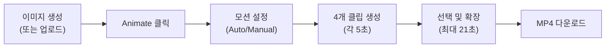
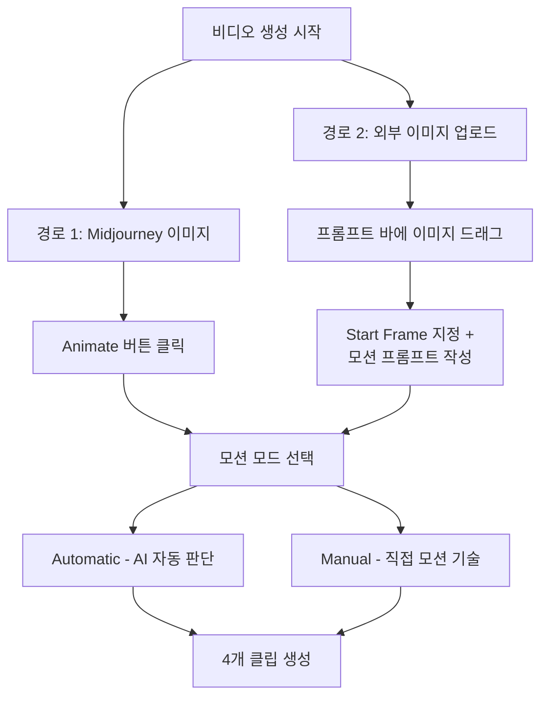
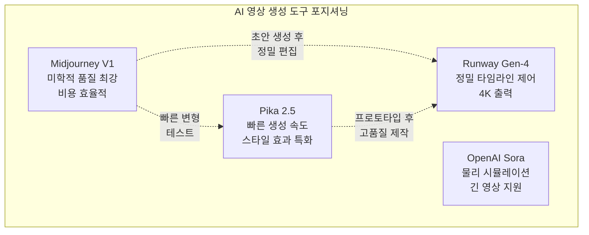

# Midjourney 비디오 모델 소개

> 정지 이미지에 움직임을 불어넣는 Midjourney V1, 그 가능성과 한계를 정확히 파악하자.

## 개요

Midjourney V1은 2025년 6월에 출시된 첫 번째 비디오 생성 모델로, 정지 이미지를 5초 영상 클립으로 변환하는 Image-to-Video 방식을 채택했습니다. 이 섹션에서는 V1의 핵심 사양, 워크플로우, 그리고 Runway·Pika·Sora와의 차별점을 살펴봅니다.

## V1 비디오 모델의 핵심 사양

Midjourney V1은 텍스트에서 바로 영상을 만드는 Text-to-Video가 아니라, 이미 생성된 이미지를 출발점으로 삼는 Image-to-Video 방식입니다. 이미지 단계에서 구도, 스타일, 색감을 완벽히 잡은 뒤 움직임만 추가할 수 있다는 것이 핵심 장점입니다.

> 사진 속 나뭇잎이 바람에 살랑이고, 구름이 흘러가고, 물결이 일렁이는 장면을 상상해보세요. V1은 정지 이미지에 이런 자연스러운 움직임을 부여하는 도구입니다.



| 사양 | 내용 |
|------|------|
| **워크플로우** | Image-to-Video (이미지 → 영상) |
| **기본 해상도** | 480p (SD) |
| **HD 해상도** | 720p (Standard/Pro/Mega 플랜) |
| **기본 클립 길이** | 5초 |
| **최대 확장** | 약 21초 (4초 단위) |
| **1회 생성** | 기본 4개 클립 (`--bs`로 조절 가능) |
| **프레임 레이트** | 24fps |
| **오디오** | 미지원 (무음) |
| **GPU 비용** | 이미지 생성 대비 약 8배 |
| **접근 방법** | Midjourney 웹사이트 전용 |

## Image-to-Video 워크플로우

V1의 워크플로우는 두 가지 경로로 나뉩니다.

**경로 1 — Midjourney 이미지에서 시작**: 이미지 생성 후 **Animate** 버튼을 클릭합니다. Midjourney 생태계 안에서 만든 이미지이므로 가장 자연스러운 결과를 얻을 수 있습니다.

```
a cinematic forest landscape, golden hour lighting, mist rising --ar 16:9 --v 6.1
→ [Animate 클릭] → 안개가 서서히 피어오르는 5초 영상
```


**경로 2 — 외부 이미지 업로드**: 직접 촬영한 사진이나 다른 도구로 만든 이미지를 프롬프트 바에 드래그한 뒤, **Start Frame**으로 지정하고 모션 프롬프트를 작성합니다.

```
[외부 이미지 업로드] + "gentle waves lapping on shore, camera slowly panning right"
```

**모션 모드 선택**:

- **Automatic**: AI가 이미지를 분석하여 적절한 움직임을 자동 결정
- **Manual**: 직접 모션 프롬프트 작성 ("바람에 머리카락이 날린다", "카메라가 천천히 줌인한다" 등)

**모션 강도 설정**:

- **Low Motion**: 잔잔한 물결, 부드러운 조명 변화, 미세한 바람 — 안정적이고 자연스러운 결과
- **High Motion**: 격렬한 파도, 빠르게 달리는 인물, 역동적 카메라 워크 — 글리치 발생 가능성 높음



## 핵심 파라미터

**`--motion` 파라미터**: `low` 또는 `high`로 움직임 강도를 제어합니다. 기본값은 Low입니다.

```
a serene mountain lake at dawn --ar 16:9 --v 6.1
→ [Animate] --motion low
```


**`--bs` (Batch Size) 파라미터**: 한 번에 생성할 클립 수를 조절합니다. 기본값 4, 줄이면 GPU 절약 가능합니다.

```
→ [Animate] --motion low --bs 2
```

**`--raw` 파라미터**: Midjourney의 미학적 해석을 줄이고 프롬프트에 더 충실한 결과를 만듭니다.

```
→ [Animate] --motion high --raw
```

**종횡비**: 별도의 `--ar` 설정이 아니라, 시작 이미지의 종횡비가 그대로 영상에 적용됩니다.

```
a vertical portrait of a woman in rain --ar 9:16 --v 6.1
→ [Animate] → 9:16 세로 영상 출력
```


## 경쟁 도구 비교

| 비교 항목 | Midjourney V1 | Runway Gen-4 | Pika 2.5 | OpenAI Sora |
|-----------|--------------|-------------|---------|------------|
| **입력 방식** | Image-to-Video | 텍스트/이미지/영상 | 텍스트/이미지 | 텍스트/이미지 |
| **최대 해상도** | 720p | 4K | 1080p | 1080p |
| **기본 클립 길이** | 5초 | 10~16초 | 3~5초 | 5~20초 |
| **최대 길이** | 21초 | 체이닝으로 확장 | 10초 | 20초 |
| **강점** | 미학적 품질, 비용 효율 | 정밀 제어, 전문 기능 | 빠른 속도, 스타일 효과 | 물리 시뮬레이션, 긴 영상 |
| **무료 티어** | 없음 | 있음 | 있음 | 있음 |



**Midjourney V1의 차별점**: 이미지 생성에서 입증된 미적 감각을 영상에 그대로 적용하며, 기존 Midjourney 플랜 내에서 추가 구독 없이 사용 가능합니다. 반면 정밀한 카메라 워크는 Runway, 빠른 프로토타이핑은 Pika가 더 적합합니다.

## 실습: 적용해보기

### 활동 1: 영상 생성 계획 수립

아래 워크시트를 채워 첫 비디오 생성 계획을 세워보세요.

| 단계 | 내 계획 |
|------|---------|
| **시작 이미지 구상** | 어떤 장면을 이미지로 만들 것인가? |
| **종횡비 선택** | 16:9(와이드)? 9:16(세로)? 1:1(정사각)? |
| **모션 모드** | Automatic vs Manual? |
| **모션 강도** | Low vs High? 이유는? |
| **기대하는 움직임** | 구체적으로 무엇이 어떻게 움직이길 원하는가? |

### 활동 2: 용도별 프롬프트 연습

다음 시나리오별로 이미지 프롬프트와 모션 설정을 작성해보세요.

**시나리오 A: 인스타그램 루프 영상**

```
a dreamy field of lavender swaying in breeze, soft pastel sky --ar 1:1 --v 6.1
→ [Animate] --motion low
```

**시나리오 B: 유튜브 배경 영상**

```
aerial view of ocean waves crashing on rocky coastline, dramatic lighting --ar 16:9 --v 6.1
→ [Animate] --motion high
```

**시나리오 C: 틱톡 세로 영상**

```
a cat sitting on windowsill watching rain, cozy interior --ar 9:16 --v 6.1
→ [Animate] --motion low
```


### 활동 3: 도구 선택 판단

다음 상황에서 어떤 도구가 적합한지 판단해보세요.

- **3초 루프 분위기 영상** → Midjourney V1 (미학적 품질)
- **10초 로고 모션 그래픽** → Pika (빠른 스타일 효과)
- **4K 제품 회전 영상** → Runway (정밀 제어 + 고해상도)
- **15초 스토리 시퀀스** → 여러 도구 조합

## 팁과 주의사항

- **Low Motion부터 시작하세요**: High Motion이 더 좋을 것 같지만, 실제로는 Low Motion이 훨씬 안정적이고 자연스러운 결과를 만듭니다
- **좋은 영상은 좋은 이미지에서 시작됩니다**: 비디오 결과가 불만족스러우면 모션 프롬프트보다 시작 이미지를 먼저 점검하세요. 구도가 명확하고 주제가 뚜렷한 이미지일수록 좋은 결과를 얻습니다
- **V1은 Image-to-Video 전용입니다**: 텍스트만으로 영상을 만들고 싶다면 Runway나 Sora를 고려하세요
- **"seamless loop"를 모션 프롬프트에 포함하면** 완벽한 루프 영상을 만들 수 있습니다. 배경 영상, SNS 루프 콘텐츠에 특히 유용합니다
- **GPU 리소스를 아끼려면** 이미지 단계에서 충분히 다듬은 뒤 Animate하고, `--bs` 값을 줄여 배치 사이즈를 조절하세요
- **480p가 낮아 보여도** SNS 숏폼에서는 충분하며, Standard 이상 플랜에서는 720p 출력이 가능합니다

## 핵심 정리

| 개념 | 설명 |
|------|------|
| **V1 비디오 모델** | Midjourney의 첫 비디오 생성 모델. 2025년 6월 출시 |
| **Image-to-Video** | 정지 이미지를 입력으로 받아 5초 영상 클립으로 변환하는 방식 |
| **Animate 버튼** | Midjourney 웹에서 이미지를 영상으로 전환하는 원클릭 기능 |
| **모션 모드** | Automatic(AI 자동 판단)과 Manual(직접 프롬프트 작성) 두 가지 |
| **Low/High Motion** | 움직임 강도 설정. Low는 안정적, High는 역동적이나 글리치 위험 |
| **--bs (Batch Size)** | 한 번에 생성할 클립 수. 기본 4개, 조절 가능 |
| **해상도** | 기본 480p, Standard 이상 플랜에서 720p 지원 |
| **클립 확장** | 5초 기본 → 4초 단위로 최대 21초까지 확장 가능 |
| **경쟁 도구** | Runway(정밀 제어), Pika(속도), Sora(범용) — 용도에 맞게 선택 |

## 다음 섹션 미리보기

다음 섹션 [Image-to-Video: 정지 이미지에 생명 불어넣기](10-ch10-midjourney-영상-생성/02-02-image-to-video-정지-이미지에-생명-불어넣기.md)에서는 실제로 이미지를 영상으로 변환하는 구체적인 실전 테크닉을 다룹니다. 어떤 이미지가 좋은 영상의 출발점이 되는지, 모션 프롬프트 작성 노하우를 배우게 됩니다.
