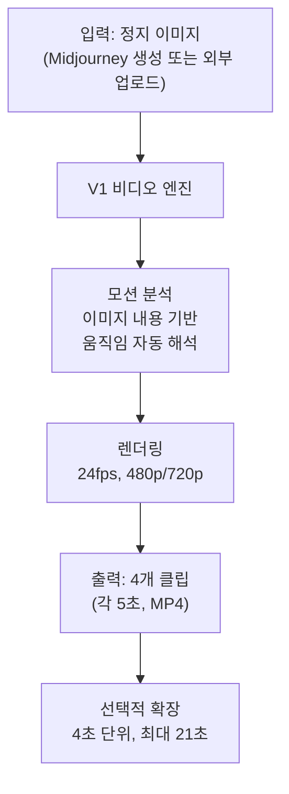
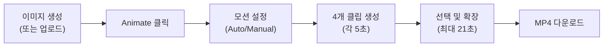
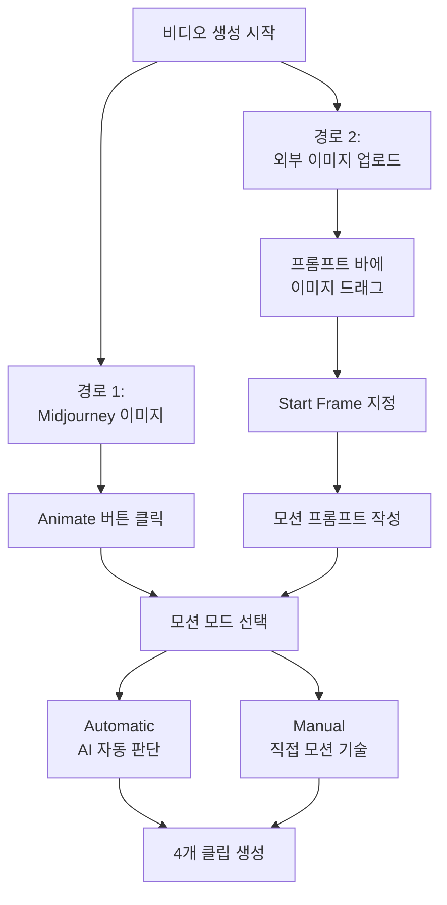
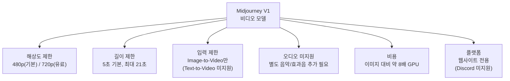
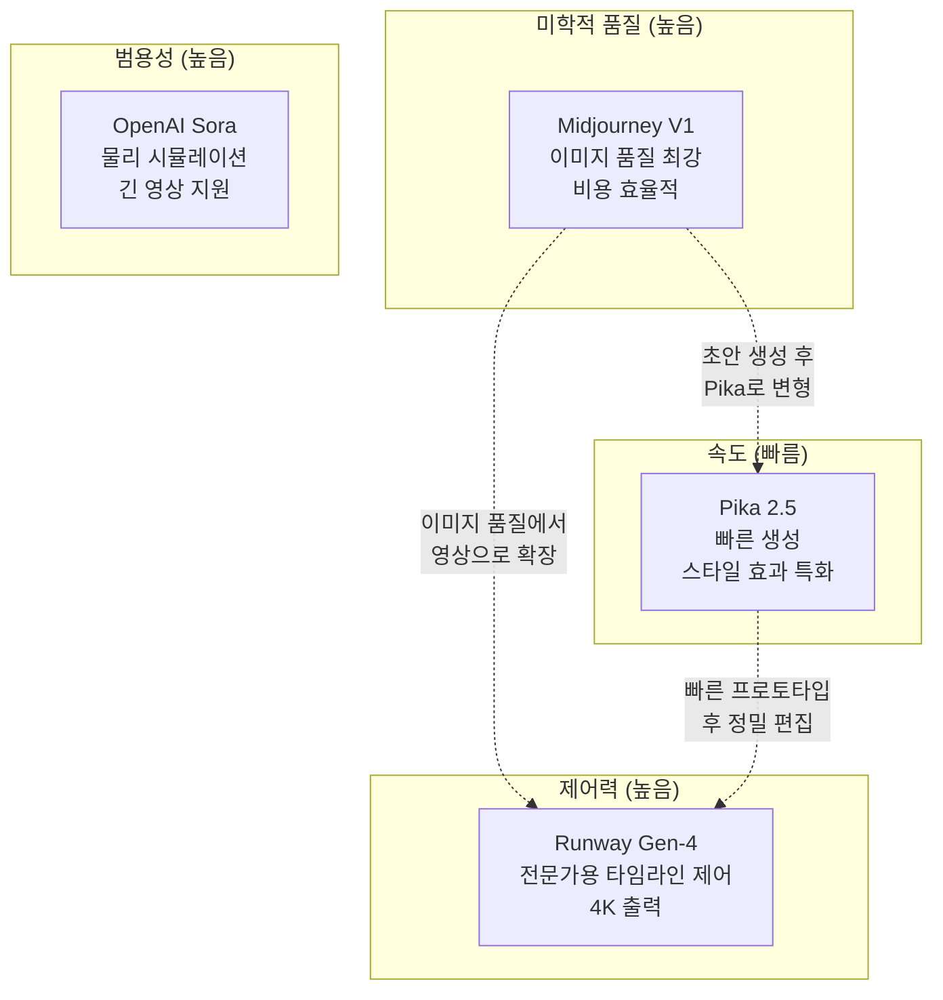

# Midjourney 비디오 모델 소개

> Midjourney V1 비디오 모델의 특성과 기본 워크플로우를 이해하고, 다른 영상 생성 도구와의 차이를 파악합니다.

## 개요

이 섹션에서는 Midjourney가 2025년 6월에 출시한 첫 번째 비디오 모델 V1의 핵심 특성을 살펴봅니다. 이미지 생성에서 한 걸음 나아가, 정지 이미지에 움직임을 부여하는 Image-to-Video 워크플로우의 기본 개념과 흐름을 이해하게 됩니다.

**선수 지식**: [Midjourney 인터페이스와 기본 생성](05-ch5-midjourney-기본과-파라미터-튜닝/01-01-midjourney-인터페이스와-기본-생성.md)에서 배운 Midjourney 웹 인터페이스 사용법과 기본 이미지 생성 경험

**학습 목표**:
- Midjourney V1 비디오 모델의 핵심 사양과 제약사항을 설명할 수 있다
- Image-to-Video 워크플로우의 전체 흐름을 이해한다
- Midjourney 비디오와 다른 AI 영상 도구(Runway, Pika, Sora)의 차별점을 비교할 수 있다

## 왜 알아야 할까?

여러분이 SNS 피드를 스크롤하다 보면, 정지 이미지보다 **짧은 영상 클립**에 시선이 더 오래 머무는 경험을 해본 적 있을 겁니다. 실제로 2025년 기준 소셜 미디어에서 영상 콘텐츠의 평균 참여율(engagement rate)은 정지 이미지의 약 1.5~3배에 달합니다. 디자이너와 크리에이터에게 영상은 더 이상 "있으면 좋은 것"이 아니라 **필수 역량**이 되었죠.

하지만 전통적인 영상 제작은 촬영 장비, 편집 소프트웨어, 모션 그래픽 기술 등 높은 진입 장벽이 있었습니다. Midjourney V1 비디오 모델은 이 장벽을 획기적으로 낮춰줍니다. 여러분이 이미 익숙한 Midjourney 이미지 생성 워크플로우에서 **버튼 하나**로 이미지를 움직이는 영상으로 변환할 수 있거든요.

이 섹션을 통해 Midjourney 비디오의 가능성과 한계를 정확히 파악하면, Ch10 전체를 통해 실제 숏폼 영상 콘텐츠를 기획하고 제작하는 데 탄탄한 기초를 다질 수 있습니다.

## 핵심 개념

### 개념 1: V1 비디오 모델이란?

> 💡 **비유**: 여러분이 아름다운 풍경 사진을 찍었다고 상상해보세요. 이 사진 속 나뭇잎이 바람에 살랑이고, 구름이 천천히 흘러가고, 물결이 일렁이면 얼마나 멋질까요? Midjourney V1 비디오 모델은 마치 **사진에 마법을 거는 것**처럼, 정지된 이미지에 자연스러운 움직임을 불어넣는 도구입니다.

Midjourney V1은 2025년 6월에 공개된 Midjourney의 **첫 번째 비디오 생성 모델**입니다. "V1"이라는 이름에서 알 수 있듯, 이 모델은 아직 초기 버전이지만 Midjourney 특유의 미학적 품질을 영상으로 확장했다는 점에서 큰 의미가 있습니다.

> 📊 **그림 1**: Midjourney V1 비디오 모델의 핵심 구조

V1의 핵심 특징을 정리하면 다음과 같습니다:

| 사양 | 내용 |
|------|------|
| **워크플로우** | Image-to-Video (이미지 → 영상) |
| **기본 해상도** | 480p (SD) |
| **HD 해상도** | 720p (Standard/Pro/Mega 플랜) |
| **기본 클립 길이** | 5초 |
| **최대 확장** | 약 21초 (4초 단위로 확장) |
| **1회 생성** | 기본 4개 클립 동시 생성 (`--bs` 파라미터로 배치 사이즈 조절 가능, [비디오 파라미터 심화](10-ch10-midjourney-영상-생성/04-04-비디오-파라미터-심화-motion-raw-seed-활용.md)에서 상세 설명) |
| **프레임 레이트** | 24fps |
| **오디오** | 미지원 (무음) |
| **GPU 비용** | 이미지 생성 대비 약 8배 |
| **접근 방법** | Midjourney 웹사이트 전용 |

> 💡 **알고 계셨나요?**: 위 사양은 [Midjourney Video 공식 문서](https://docs.midjourney.com/hc/en-us/articles/37460773864589-Video)에서 확인할 수 있습니다. V1은 빠르게 업데이트되는 모델이므로, 해상도나 기능이 변경될 수 있습니다. 최신 사양은 항상 공식 문서를 기준으로 확인하세요.

여기서 주목할 점은 V1이 **텍스트에서 바로 영상을 만드는 Text-to-Video가 아니라**, 이미 생성된 이미지를 출발점으로 삼는 **Image-to-Video 방식**이라는 것입니다. 이 접근법 덕분에 여러분은 이미지 생성 단계에서 원하는 구도, 스타일, 색감을 완벽히 잡은 뒤, 그 결과물에 움직임만 추가할 수 있죠.

> 📊 **그림 2**: Midjourney V1 비디오 생성의 기본 흐름

### 개념 2: Image-to-Video 워크플로우

> 💡 **비유**: 만화책의 한 장면을 떠올려보세요. 만화가는 "속도선"이나 "효과선"을 그려서 정지된 그림에 움직임의 느낌을 줍니다. Midjourney V1은 여러분의 이미지를 보고 "이 장면에서 무엇이 어떻게 움직여야 자연스러울까?"를 AI가 판단해서 실제로 움직이게 만드는 것과 비슷합니다.

V1의 워크플로우는 놀라울 만큼 단순합니다. 크게 두 가지 경로가 있는데요:

**경로 1 — Midjourney 이미지에서 시작**: Midjourney로 이미지를 생성한 뒤, 해당 이미지의 **Animate** 버튼을 클릭합니다. 이미 Midjourney 생태계 안에서 만든 이미지이므로 가장 자연스러운 결과를 얻을 수 있습니다.

**경로 2 — 외부 이미지 업로드**: 직접 촬영한 사진이나 다른 도구로 만든 이미지를 Midjourney 프롬프트 바에 드래그합니다. 이때 해당 이미지를 **"시작 프레임(Start Frame)"**으로 지정한 뒤, 원하는 움직임을 텍스트로 설명하면 됩니다.

두 경로 모두에서 **모션 프롬프트(Motion Prompt)** 설정이 핵심입니다:

- **Automatic**: AI가 이미지를 분석하여 자동으로 적절한 움직임을 결정합니다. "이 이미지에서 무엇이 움직여야 자연스러울까?"를 AI가 판단하죠.
- **Manual**: 여러분이 직접 "바람에 머리카락이 날린다", "카메라가 천천히 줌인한다" 같은 모션 프롬프트를 작성합니다.

> 📊 **그림 3**: 두 가지 비디오 생성 경로

또한 모션의 강도를 두 단계로 조절할 수 있습니다:

- **Low Motion**: 잔잔한 물결, 부드러운 조명 변화, 미세한 바람 같은 **은은한 움직임**에 적합합니다. 카메라는 거의 고정되어 있고, 장면 속 요소들이 미묘하게 움직이죠.
- **High Motion**: 격렬한 파도, 빠르게 달리는 인물, 역동적인 카메라 워크 같은 **큰 움직임**에 적합합니다. 다만 움직임이 클수록 비현실적이거나 글리치가 발생할 확률도 높아집니다.

> ⚠️ **흔한 오해**: "High Motion이 항상 더 좋은 결과를 내겠지?"라고 생각하기 쉽지만, 실제로는 **Low Motion이 더 안정적이고 자연스러운 결과**를 만들어냅니다. 특히 초보자라면 Low Motion부터 시작하는 것을 강력히 추천합니다.

### 개념 3: 핵심 파라미터와 제약사항

> 💡 **비유**: 놀이공원의 놀이기구를 생각해보세요. 어떤 놀이기구는 키 제한이 있고, 어떤 놀이기구는 탑승 인원 제한이 있죠. Midjourney V1도 마찬가지로 아직 "놀이공원 오픈 초기"이기 때문에 이용할 수 있는 놀이기구(기능)와 제한사항이 명확히 정해져 있습니다.

V1에서 사용 가능한 비디오 관련 핵심 파라미터는 다음과 같습니다:

**`--motion` 파라미터**: `low` 또는 `high` 값을 설정하여 움직임의 강도를 제어합니다. 별도 설정이 없으면 기본값은 Low Motion입니다.

**`--bs` (Batch Size) 파라미터**: 한 번에 생성할 클립 수를 조절합니다. 기본값은 4이며, 값을 줄이면 GPU 리소스를 절약할 수 있습니다. 이 파라미터의 상세한 활용법은 [비디오 파라미터 심화](10-ch10-midjourney-영상-생성/04-04-비디오-파라미터-심화-motion-raw-seed-활용.md)에서 다룹니다.

**`--raw` 파라미터**: Midjourney의 기본 미학적 해석을 줄이고, 여러분의 텍스트 프롬프트에 더 충실한 결과를 만듭니다. 이미지 생성에서 사용하던 `--raw`와 동일한 개념이죠.

**종횡비(Aspect Ratio)**: 별도의 `--ar` 파라미터를 비디오에 설정하는 것이 아니라, **시작 이미지의 종횡비가 그대로 영상에 적용**됩니다. 16:9 이미지로 시작하면 16:9 영상이, 9:16 이미지로 시작하면 세로 영상이 만들어지죠. 이는 [종횡비 --ar와 구도 제어](05-ch5-midjourney-기본과-파라미터-튜닝/02-02-종횡비--ar와-구도-제어.md)에서 배운 내용을 그대로 활용할 수 있다는 의미입니다.

> 📊 **그림 4**: V1 비디오의 주요 제약사항

**현재 V1에서 지원하지 않는 기능들:**
- Text-to-Video (텍스트만으로 바로 영상 생성)
- 오디오/사운드 생성
- 4K 이상 고해상도 출력
- 1분 이상의 긴 영상

이러한 제약에도 불구하고, V1은 Midjourney 특유의 **미학적 품질**을 영상으로 확장했다는 점에서 의미가 큽니다. 특히 5초짜리 루프 영상이나 소셜 미디어용 짧은 클립에는 충분한 성능을 보여줍니다.

### 개념 4: 경쟁 도구 비교 — Runway, Pika, Sora

> 💡 **비유**: 스마트폰 시장을 생각해보세요. iPhone은 디자인과 생태계, Galaxy는 커스터마이징, Pixel은 카메라에 강점이 있듯, AI 영상 생성 도구들도 각자의 개성이 뚜렷합니다.

2025년 현재 AI 영상 생성 시장에는 여러 강력한 플레이어가 있습니다. Midjourney V1이 이 시장에서 어떤 위치에 있는지 비교해볼까요?

| 비교 항목 | Midjourney V1 | Runway Gen-4 | Pika 2.5 | OpenAI Sora |
|-----------|--------------|-------------|---------|------------|
| **입력 방식** | Image-to-Video | 텍스트/이미지/영상 | 텍스트/이미지 | 텍스트/이미지 |
| **최대 해상도** | 720p | 4K | 1080p | 1080p |
| **기본 클립 길이** | 5초 | 10~16초 | 3~5초 | 5~20초 |
| **최대 길이** | 21초 | 체이닝으로 확장 | 10초 | 20초 |
| **강점** | 미학적 품질, 비용 효율 | 정밀 제어, 전문 기능 | 빠른 속도, 스타일 효과 | 물리 시뮬레이션, 긴 영상 |
| **무료 티어** | 없음 | 있음 | 있음 | 있음 |

> 📊 **그림 5**: AI 영상 생성 도구 포지셔닝 맵

**Midjourney V1의 차별점은 명확합니다:**

1. **미학적 품질**: Midjourney는 이미지 생성에서 이미 입증된 미적 감각을 영상에도 그대로 가져옵니다. 다른 도구 대비 "예쁜 영상"을 만드는 데 강점이 있죠.
2. **기존 워크플로우 통합**: 이미 Midjourney로 이미지를 만들고 있다면, 추가 학습 없이 Animate 버튼 하나로 영상 제작이 가능합니다.
3. **비용 효율**: 별도 구독 없이 기존 Midjourney 플랜 내에서 사용할 수 있어, 여러 도구를 동시에 구독하는 부담이 적습니다.

반면 **정밀한 카메라 워크**나 **긴 영상 제작**이 필요하다면 Runway가, **빠른 프로토타이핑**이 목적이라면 Pika가 더 적합할 수 있습니다. 실무에서는 이 도구들을 **조합하여 사용**하는 것이 가장 효과적인 전략입니다.

## 실습: 적용해보기

### 활동 1: 나의 영상 콘텐츠 니즈 분석

아래 질문에 답하며 V1 비디오 모델이 여러분의 작업에 어떻게 활용될 수 있을지 분석해보세요.

| 질문 | 나의 답변 |
|------|-----------|
| 주로 만드는 비주얼 콘텐츠 유형은? (SNS 포스트, 배너, 제품 이미지 등) | |
| 그 콘텐츠에 움직임을 추가한다면 어떤 효과를 기대하나요? | |
| 필요한 영상 길이는? (3초 루프? 15초 숏폼? 1분 이상?) | |
| 필요한 해상도는? (SNS용 480p? 프레젠테이션용 720p 이상?) | |
| V1의 제약(480p, 최대 21초)이 내 용도에 충분한가? | |

### 활동 2: 도구 선택 시나리오 분석

다음 시나리오에서 어떤 AI 영상 도구가 가장 적합할지 판단하고 이유를 적어보세요.

1. **인스타그램 릴스용 3초 루프 영상** — 꽃잎이 바람에 흩날리는 분위기 영상
2. **유튜브 인트로 10초 영상** — 로고가 역동적으로 등장하는 모션 그래픽
3. **클라이언트 프레젠테이션용 제품 영상** — 신발이 360도 회전하는 4K 영상
4. **틱톡용 15초 스토리 영상** — 캐릭터가 여러 장면을 걸어다니는 시퀀스

> 🔥 **실무 팁**: 정답은 하나가 아닙니다. 실무에서는 시나리오 1은 Midjourney V1, 시나리오 2는 Pika, 시나리오 3은 Runway, 시나리오 4는 여러 도구 조합이 효과적일 수 있습니다. **"어떤 도구가 최고인가"보다 "이 상황에 어떤 도구가 맞는가"**를 묻는 습관이 중요합니다.

### 활동 3: V1 비디오 생성 시뮬레이션

아직 직접 생성하지 않더라도, 아래 워크시트를 채워 비디오 생성 계획을 세워보세요.

| 단계 | 내 계획 |
|------|---------|
| **시작 이미지 구상** | 어떤 장면을 이미지로 만들 것인가? |
| **종횡비 선택** | 16:9(와이드)? 9:16(세로)? 1:1(정사각)? |
| **모션 모드** | Automatic vs Manual 중 어떤 것을 선택할 것인가? |
| **모션 강도** | Low Motion vs High Motion? 왜? |
| **배치 사이즈** | 기본 4개? 줄여서 GPU 절약? |
| **기대하는 움직임** | 구체적으로 무엇이 어떻게 움직이길 원하는가? |

## 더 깊이 알아보기

### Midjourney의 비디오 진출 — 늦었지만 전략적이었던 타이밍

Midjourney가 비디오 모델을 출시한 시점은 흥미롭습니다. Runway는 이미 2023년부터 Gen-1, Gen-2를 거쳐 Gen-4까지 발전했고, Pika Labs도 2023년부터 서비스를 제공하고 있었죠. OpenAI의 Sora도 2024년에 큰 화제를 모았습니다. 왜 Midjourney는 2025년 6월까지 기다렸을까요?

Midjourney의 창립자 데이비드 홀즈(David Holz)는 "우리는 이미지 품질에 대한 기준을 먼저 확립하고 싶었다"고 밝힌 바 있습니다. 실제로 Midjourney는 V5, V6을 거치며 **이미지 생성 품질에서 업계 최고 수준**을 달성한 후에야 비디오로 확장했습니다. 이는 "빠르게 출시하고 개선하자"는 접근법 대신 **"기반이 탄탄할 때 확장하자"**는 전략이었죠.

또한 V1이 Text-to-Video가 아닌 **Image-to-Video를 먼저 선택한 것**도 전략적입니다. Midjourney의 핵심 강점인 이미지 품질을 레버리지로 활용하면서, 사용자에게 "이미 완벽한 이미지를 만들었으니 이제 움직여보세요"라는 자연스러운 확장 경험을 제공한 것이죠.

> 💡 **알고 계셨나요?**: Midjourney는 원래 Leap Motion이라는 VR 하드웨어 회사에서 시작했습니다. 창립자 데이비드 홀즈가 NASA와 함께 가상현실 연구를 하다가, "인간의 상상력을 시각화하는 도구"에 관심을 갖게 되면서 Midjourney가 탄생했죠. VR에서 이미지, 이미지에서 비디오로 — 시각적 경험을 확장하려는 비전은 처음부터 일관되었던 셈입니다.

### "V1"이라는 이름의 의미

Midjourney가 이 모델을 "V1"이라고 명명한 것은 매우 의도적입니다. 이미지 모델은 V1에서 V6까지 발전하며 품질이 비약적으로 향상되었는데, 비디오 모델도 같은 여정을 거칠 것임을 예고하는 것이죠. 현재 480p라는 해상도 제한이 있지만, 이미지 모델의 발전 궤적을 보면 향후 버전에서 해상도, 길이, 제어력 모두 크게 개선될 것을 기대할 수 있습니다.

## 흔한 오해와 팁

> ⚠️ **흔한 오해**: "Midjourney V1 비디오는 텍스트만 입력하면 바로 영상이 나온다" — 아닙니다! V1은 반드시 이미지를 먼저 만들거나 업로드해야 하는 **Image-to-Video** 모델입니다. 텍스트만으로 영상을 만들고 싶다면 Runway나 Sora를 고려해야 합니다.

> ⚠️ **흔한 오해**: "480p면 너무 낮은 해상도 아닌가?" — 사용 맥락에 따라 다릅니다. 인스타그램 스토리나 틱톡 숏폼에서는 480p도 충분히 매력적인 결과를 만들어냅니다. 또한 Standard 이상 플랜에서는 720p로 생성할 수 있고, 매크로 줌인(macro push-in) 같은 테크닉을 활용하면 저해상도를 효과적으로 숨길 수 있습니다.

> ⚠️ **흔한 오해**: "한 번에 무조건 4개 클립이 생성된다" — 기본값이 4개일 뿐, `--bs` (Batch Size) 파라미터로 조절할 수 있습니다. GPU 리소스를 아끼고 싶다면 배치 사이즈를 줄이는 것도 방법이에요. 자세한 내용은 [비디오 파라미터 심화](10-ch10-midjourney-영상-생성/04-04-비디오-파라미터-심화-motion-raw-seed-활용.md)에서 다룹니다.

> 💡 **알고 계셨나요?**: Midjourney V1 비디오 생성 시 이미지 대비 약 **8배의 GPU 리소스**를 소모합니다. Basic 플랜($10/월)에서도 사용 가능하지만, 무제한 이미지 생성처럼 마음껏 쓸 수 있는 것은 아닙니다. 비디오 생성 전에 이미지 단계에서 구도와 스타일을 충분히 다듬은 뒤 Animate하는 것이 리소스를 아끼는 현명한 방법입니다.

> 🔥 **실무 팁**: 비디오 결과가 마음에 들지 않을 때, 모션 프롬프트를 바꾸기 전에 **시작 이미지를 먼저 점검**하세요. 구도가 명확하고 주제가 뚜렷한 이미지일수록 더 좋은 영상 결과를 얻을 수 있습니다. "좋은 영상은 좋은 이미지에서 시작된다"는 것이 V1 사용자들 사이의 공통된 경험입니다.

> 🔥 **실무 팁**: "seamless loop"를 모션 프롬프트에 포함하면 완벽한 루프 영상을 만들 수 있습니다. 배경 영상, 화면 보호기, SNS 루프 콘텐츠에 특히 유용하죠.

## 핵심 정리

| 개념 | 설명 |
|------|------|
| **V1 비디오 모델** | Midjourney의 첫 비디오 생성 모델. 2025년 6월 출시 |
| **Image-to-Video** | 정지 이미지를 입력으로 받아 5초 영상 클립으로 변환하는 방식 |
| **Animate 버튼** | Midjourney 웹에서 이미지를 영상으로 전환하는 원클릭 기능 |
| **모션 모드** | Automatic(AI 자동 판단)과 Manual(직접 프롬프트 작성) 두 가지 |
| **Low/High Motion** | 움직임 강도 설정. Low는 안정적, High는 역동적이나 글리치 위험 |
| **--bs (Batch Size)** | 한 번에 생성할 클립 수. 기본 4개, 조절 가능 |
| **해상도** | 기본 480p, Standard 이상 플랜에서 720p 지원 |
| **클립 확장** | 5초 기본 → 4초 단위로 최대 21초까지 확장 가능 |
| **경쟁 도구** | Runway(정밀 제어), Pika(속도), Sora(범용) — 용도에 맞게 선택 |

## 다음 섹션 미리보기

이번 섹션에서 V1 비디오 모델의 전체 그림을 파악했다면, 다음 섹션 [Image-to-Video: 정지 이미지에 생명 불어넣기](10-ch10-midjourney-영상-생성/02-02-image-to-video-정지-이미지에-생명-불어넣기.md)에서는 **실제로 이미지를 영상으로 변환하는 구체적인 실전 테크닉**을 다룹니다. 어떤 이미지가 좋은 영상의 출발점이 되는지, 모션 프롬프트를 어떻게 작성하면 원하는 움직임을 얻을 수 있는지, 그리고 실제 생성 과정에서의 노하우를 배우게 됩니다.

## 참고 자료

- [Midjourney Video 공식 문서](https://docs.midjourney.com/hc/en-us/articles/37460773864589-Video) - V1 비디오 모델의 공식 사양과 사용법을 담은 문서. 해상도, 파라미터, 제약사항의 최신 정보를 확인할 수 있습니다
- [Introducing Our V1 Video Model — Midjourney Updates](https://updates.midjourney.com/introducing-our-v1-video-model/) - Midjourney 팀의 공식 V1 출시 발표 블로그
- [Midjourney Launches Its First AI Video Generation Model, V1 — TechCrunch](https://techcrunch.com/2025/06/18/midjourney-launches-its-first-ai-video-generation-model-v1/) - V1 출시에 대한 기술 미디어의 분석과 업계 반응
- [Midjourney Video V1 Model: First Look, Key Features & Practical Workflows — BasedLabs](https://www.basedlabs.ai/articles/midjourney-video-v1-model-first-look) - V1의 실전 워크플로우와 주요 기능을 정리한 가이드
- [Midjourney Debuts V1 AI Video Model — InfoQ](https://www.infoq.com/news/2025/06/midjourney-v1-video/) - V1의 기술적 스펙과 다른 도구와의 비교 분석

---
### 🔗 Related Sessions
- [midjourney 웹 인터페이스](01-ch1-ai-이미지-생성-개론/04-04-플랫폼별-계정-설정과-인터페이스-탐색.md) (prerequisite)
