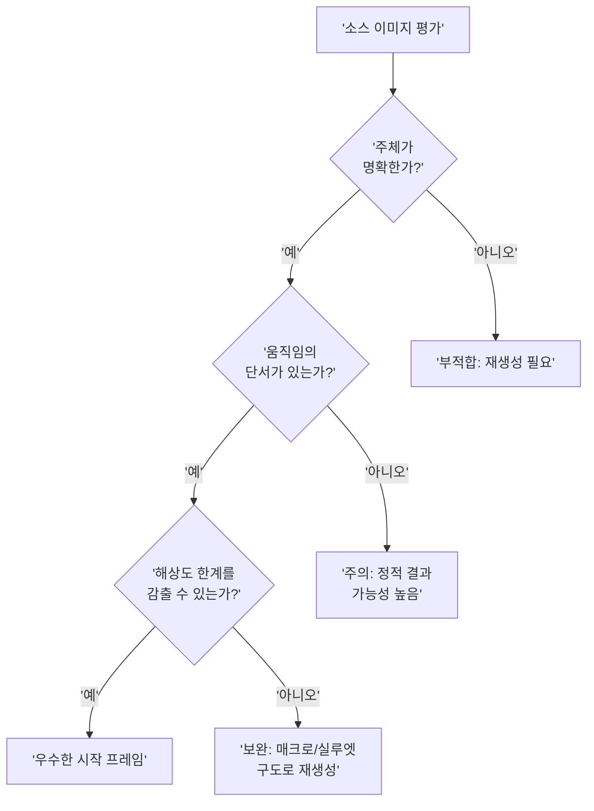
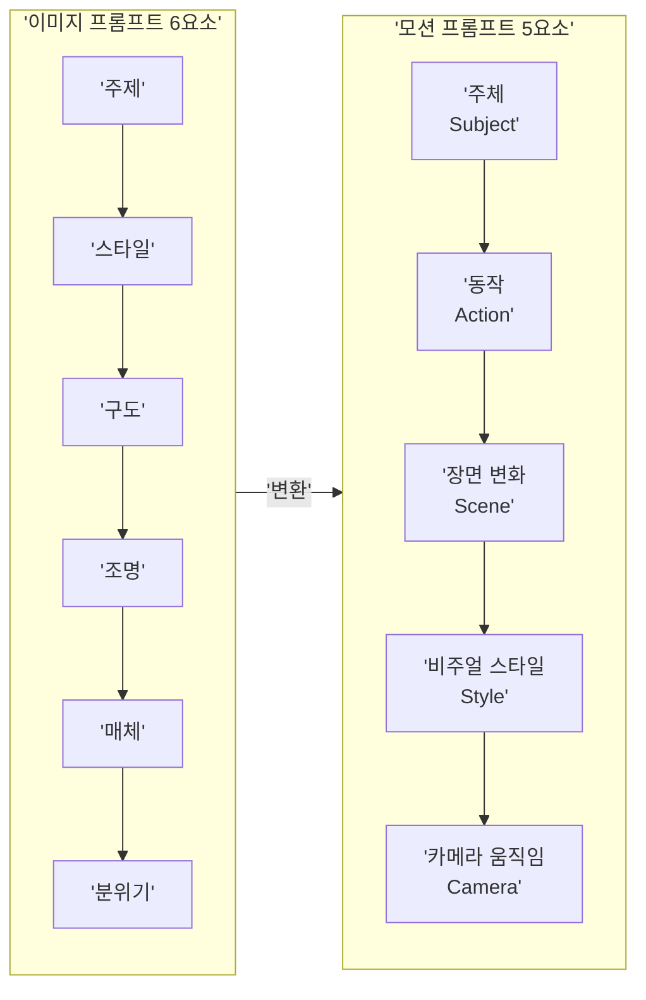
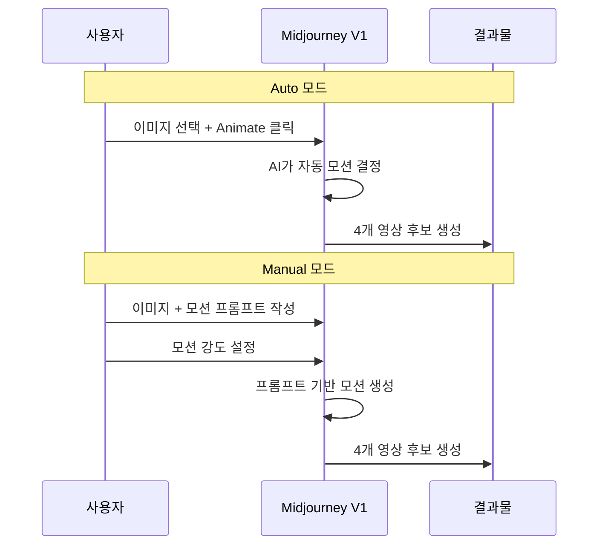

# Image-to-Video — 정지 이미지에 생명 불어넣기

> 정지 이미지 한 장이 5초짜리 영상이 되는 순간, 콘텐츠의 존재감이 완전히 달라집니다

## 개요

Midjourney V1의 Image-to-Video 기능을 실전에서 활용하는 방법을 다룹니다. 어떤 이미지가 좋은 시작 프레임이 되는지, 모션 프롬프트를 어떻게 작성해야 원하는 움직임을 얻는지, 파라미터로 결과물을 최적화하는 전략까지 하나씩 풀어보겠습니다.

## 좋은 시작 프레임의 조건

V1 모델은 Image-to-Video 방식이기 때문에, 시작 이미지의 선택이 결과의 80%를 좌우합니다. 좋은 시작 프레임에는 4가지 조건이 있습니다.

1. **명확한 주체** — AI가 "무엇을 움직여야 하는지" 인식할 수 있어야 합니다
2. **움직임의 여지** — 바람에 날릴 머리카락, 흔들릴 천, 흐를 물 같은 자연스러운 동작 단서
3. **강한 콘트라스트와 깊이감** — 480p 해상도의 한계를 감추는 시각적 장치
4. **적절한 종횡비** — 인스타그램/유튜브 쇼츠는 9:16, 일반 영상은 16:9



**해상도 한계를 감추는 구도 전략**:

| 전략 | 설명 | 적합한 장르 |
|------|------|------------|
| **매크로 샷** | 극도의 클로즈업으로 해상도 문제 최소화 | 제품, 음식, 자연 |
| **실루엣** | 고대비 역광으로 디테일 의존도 줄임 | 인물, 풍경, 무드 |
| **안개/연기 효과** | 대기 효과가 저해상도를 자연스럽게 가림 | 판타지, 분위기 영상 |
| **타이트 프레이밍** | 좁은 구도로 시선을 집중 | 인물, 캐릭터 |

시작 프레임 선택 후 Upscale(U1~U4)을 먼저 적용하고 영상 변환을 시작하면 텍스처가 더 선명한 결과를 얻을 수 있습니다.

```
/imagine prompt: a lone warrior standing on a cliff edge,
dramatic backlight silhouette, wind-blown cape,
misty valley below --ar 16:9 --v 6.1
```


```
/imagine prompt: extreme macro shot of coffee surface,
golden morning light reflecting, tiny ripples visible,
shallow depth of field --ar 16:9 --v 6.1
```


## 모션 프롬프트 5요소 구조

이미지 프롬프트가 화가에게 건네는 스케치 지시서라면, 모션 프롬프트는 영화 감독이 배우에게 주는 연기 지시입니다. 정지된 묘사가 아닌, **일어나는 사건**을 써야 합니다.



| 요소 | 핵심 질문 | 예시 키워드 |
|------|----------|------------|
| **주체(Subject)** | 누가 움직이는가? | a woman, the cat, coffee |
| **동작(Action)** | 어떤 움직임? | walks slowly, turns head, ripples |
| **장면 변화(Scene)** | 배경이 어떻게 변하나? | sun sets, clouds drift, lights flicker |
| **비주얼 스타일(Style)** | 어떤 느낌? | cinematic, film noir, dreamy |
| **카메라(Camera)** | 시점 이동은? | slow zoom in, tracking shot, aerial |

**실전 프롬프트 예시 — 약한 것 vs 강한 것**:

```
(X) 약한 프롬프트:
a knight in a forest

(O) 강한 프롬프트:
A knight in shining armor walks slowly through a misty ancient forest,
cinematic lighting, camera tracking alongside him
```


**장르별 모션 프롬프트 예시**:

```
[인물 포트레이트]
A woman slowly turns her head toward camera,
hair gently moves in breeze, warm golden hour light shifts,
cinematic shallow depth of field, slow push-in --motion low
```

```
[풍경/분위기]
Mist slowly drifts through ancient temple ruins,
sunbeams shift through broken ceiling, ethereal atmosphere,
slow aerial crane shot descending --motion low
```

```
[제품/음식]
Steam gently rises from coffee cup on wooden table,
morning sunlight slowly shifts across surface,
warm cinematic tone, slow push-in macro shot --motion low
```


```
[액션/다이나믹]
A wolf runs through deep snow, powder flying behind,
dramatic storm clouds rolling overhead,
epic cinematic style, tracking shot from side --motion high
```

```
[판타지/초현실]
A floating island slowly rotates in sunset sky,
waterfalls pour from edges into clouds below,
dreamlike fantasy atmosphere, slow orbit camera --motion low
```

```
[도시/건축]
City traffic flows through neon-lit streets at night,
rain reflects colorful lights on wet asphalt,
cyberpunk atmosphere, slow overhead drone shot --motion high
```


## Auto 모드 vs Manual 모드



| 상황 | 추천 모드 | 이유 |
|------|----------|------|
| 첫 실험, 영감 탐색 | Auto | 빠르게 가능성 확인 |
| 분위기 영상, 배경 루프 | Manual + Low Motion | 정적이고 우아한 결과 |
| 액션, 역동적 장면 | Manual + High Motion | 큰 움직임 표현 |
| SNS 콘텐츠 빠른 제작 | Auto 반복 → 선별 | 효율적 워크플로우 |
| 클라이언트 프로젝트 | Manual | 의도한 연출 필수 |

## 파라미터로 결과 다듬기
- **`--motion low`**: 잔잔한 바람, 부드러운 구름. 명상적이고 우아한 분위기에 적합
- **`--motion high`**: 달리는 동물, 격렬한 파도. 역동적이지만 글리치 확률 높음
- **`--raw`**: Midjourney 미학 최소화, 프롬프트를 문자 그대로 해석

```
[motion low + raw 조합 — 최소한의 움직임으로 분위기 살리기]
Gentle breeze moves through sheer curtains,
soft afternoon light shifts slowly across floor,
quiet intimate atmosphere, static wide shot --motion low --raw
```

```
[motion high — 역동적 자연 장면]
Powerful ocean wave crashes against rocky coastline,
spray flies into golden sunset light,
dramatic cinematic style, low angle shot --motion high
```


**비디오 파라미터 호환성 정리**:

| 사용 가능 | 사용 불가 (조용히 무시됨) |
|----------|----------------------|
| `--motion low/high` | `--sref` (스타일 레퍼런스) |
| `--raw` | `--cref` (캐릭터 레퍼런스) |
| `--ar` | `--stylize` (`--s`) |
| `--personalize` (`--p`) | `--chaos` (`--c`) |
| | `--quality` (`--q`) |
| | `--tile`, `--weird` (`--w`) |
| | Image Prompts (다중 이미지) |

비디오에서 안 되는 파라미터를 넣어도 에러 없이 조용히 무시됩니다. 비디오 전환 전 불가 파라미터를 반드시 제거하세요.

```
[변환 전] a cyberpunk warrior in neon city --sref 12345 --s 800 --ar 16:9 --v 6.1
[변환 후] A cyberpunk warrior walks forward through neon-lit rain,
reflections shimmer on wet ground, cinematic tracking shot --ar 16:9 --motion high
```

## 영상 확장과 비용

기본 영상은 5초이며, Extend로 약 4초씩 최대 4회 확장하여 약 21초까지 가능합니다. 영상 1회 생성은 이미지의 약 8배 GPU 시간을 소모하며, Relax 모드 영상 생성은 Pro($60/월) 이상에서만 가능합니다.

## 실습

이미지 프롬프트 "A cat sitting on a windowsill, golden hour light, warm atmosphere"를 5요소 모션 프롬프트로 변환하고, 같은 이미지로 Auto / Manual `--motion low` / Manual `--motion high` / Manual `--motion low --raw` 4가지 조합을 비교해보세요.

```
[모범 답안]
A cat slowly blinks and turns head on windowsill,
golden hour light gradually shifts across fur,
warm cinematic atmosphere, gentle slow zoom in --motion low
```

## 팁과 주의사항

- **동작 동사를 구체적으로**: "moves"보다 "saunters", "glides", "stumbles"처럼 뉘앙스 있는 동사를 선택하세요
- **220자 이내로 작성**: Midjourney 프롬프트 글자 제한을 지키되 핵심만 압축적으로 작성합니다
- **자연적 움직임 단서 추가**: "wind blows through hair", "fabric sways" 같은 환경적 움직임을 함께 넣으면 생동감이 올라갑니다
- **`--motion low`가 너무 정적일 때**: "gentle breeze moves through curtains", "subtle light shifts across face" 같은 환경적 동작을 프롬프트에 추가하세요
- **Extend는 신중하게**: 무리하게 4회 반복하면 후반부 물리적 왜곡이 심해집니다. SNS 숏폼에서는 5초면 충분한 경우가 대부분입니다
- **여러 번 생성하고 선별하기**: 같은 프롬프트로도 4개 후보가 전혀 다르게 나올 수 있으므로, 프롬프트 수정보다 반복 생성 후 선별이 효율적입니다
- **Pro 이상이라면 Relax 모드 활용**: 밤새 배치 생성하면 비용을 절약할 수 있습니다
- **해상도 키워드는 비효과적**: '8K', 'ultra realistic' 같은 키워드 대신 동작 동사와 속도 수식어(slowly, gently, dramatically)에 집중하세요

## 핵심 정리

| 개념 | 설명 |
|------|------|
| 시작 프레임 4조건 | 명확한 주체, 움직임의 여지, 강한 콘트라스트, 적절한 종횡비 |
| 모션 프롬프트 5요소 | 주체 + 동작 + 장면 변화 + 비주얼 스타일 + 카메라 움직임 |
| Auto 모드 | AI 자동 분석, 실험/영감 탐색용 |
| Manual 모드 | 사용자 프롬프트 기반, 정밀 제어 |
| `--motion low/high` | 잔잔한 vs 역동적 움직임 제어 |
| `--raw` | Midjourney 미학 최소화, 프롬프트에 충실 |
| 비용 | 영상 1회 = 이미지 약 8배 GPU |
| Extend | 5초 기본 → 최대 약 21초 (4회 확장) |
| 비디오 불가 파라미터 | `--sref`, `--cref`, `--stylize`, `--chaos`, `--quality`, `--tile`, `--weird` |

## 다음 섹션 미리보기

다음 섹션 [모션과 카메라 제어](10-ch10-midjourney-영상-생성/03-03-모션과-카메라-제어.md)에서는 5요소 구조를 바탕으로 카메라 움직임에 집중한 **4가지 작성 원칙**을 배웁니다. 팬, 틸트, 줌, 트래킹 같은 시네마틱 카메라 워크를 프롬프트로 구현하는 방법을 다룹니다.
