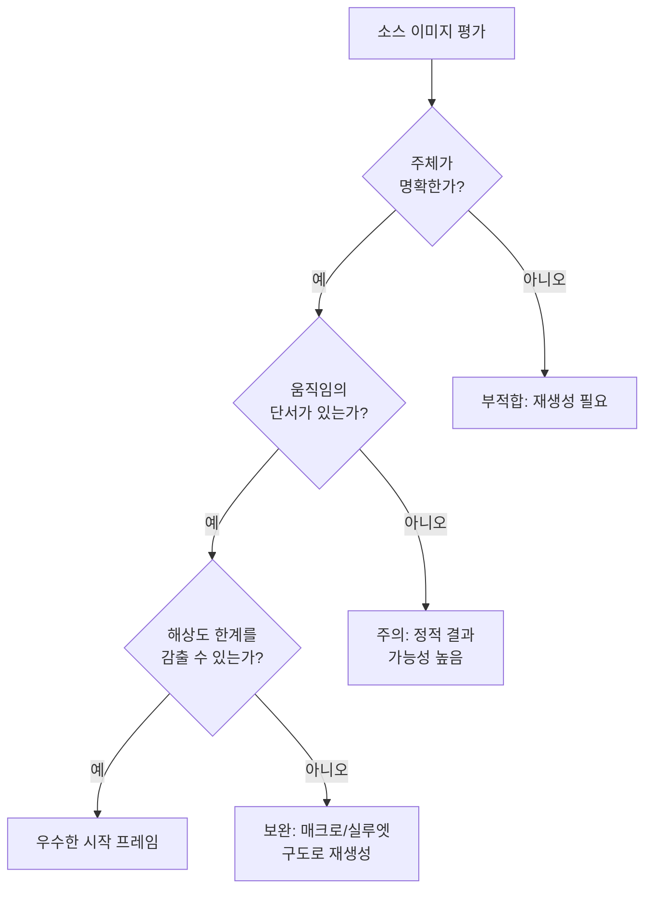
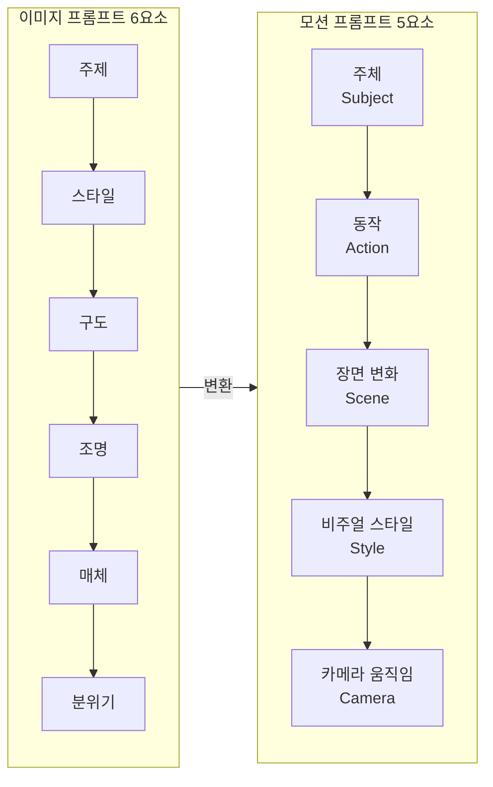
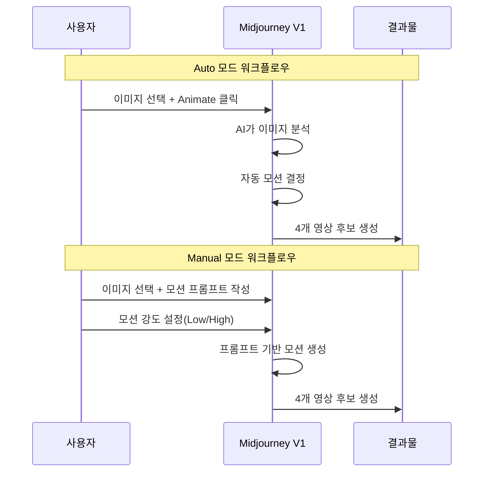
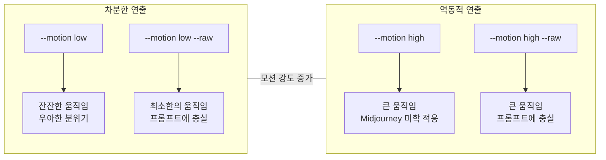
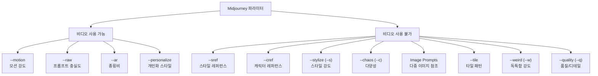

# Image-to-Video — 정지 이미지에 생명 불어넣기

> Midjourney V1 모델로 정지 이미지를 움직이는 영상으로 변환하는 전체 워크플로우를 마스터합니다

## 개요

이 섹션에서는 Midjourney의 Image-to-Video 기능을 실전에서 활용하는 방법을 집중적으로 다룹니다. 어떤 이미지가 좋은 시작 프레임이 되는지, 모션 프롬프트를 어떻게 작성해야 원하는 움직임을 얻는지, 그리고 결과물의 품질을 최적화하는 전략까지 하나씩 풀어보겠습니다.

**선수 지식**: [Midjourney 비디오 모델 소개](10-ch10-midjourney-영상-생성/01-01-midjourney-비디오-모델-소개.md)에서 배운 V1 모델의 기본 사양(480p/720p, 5초~21초, Auto/Manual 모드)과 기본 워크플로우
**학습 목표**:
- 영상 변환에 적합한 소스 이미지의 조건을 판별할 수 있다
- 모션 프롬프트의 5요소 구조를 활용하여 원하는 움직임을 지시할 수 있다
- Auto 모드와 Manual 모드를 상황에 맞게 선택하고 활용할 수 있다
- `--motion`, `--raw` 등 비디오 파라미터로 결과물을 최적화할 수 있다
- 비디오에서 사용 불가한 이미지 파라미터를 명확히 구분할 수 있다

## 왜 알아야 할까?

여러분이 멋진 Midjourney 이미지를 수백 장 갖고 있다고 상상해보세요. 그 이미지들이 5초만 움직여도 소셜 미디어 피드에서의 존재감이 완전히 달라집니다. 정지 이미지는 스크롤하며 지나치지만, 살짝 움직이는 영상은 시선을 붙잡거든요.

문제는 "아무 이미지나 넣으면 좋은 영상이 나오는 게 아니다"라는 점입니다. 소스 이미지 선택부터 모션 프롬프트 작성까지, 각 단계에서의 작은 차이가 "와, 이게 AI로 만든 거야?"와 "음... AI 느낌이 나네"의 갈림길이 됩니다.

이 섹션은 그 갈림길에서 항상 전자의 방향으로 가는 법을 알려드립니다. 특히 [프롬프트 구조 마스터](02-ch2-프롬프트-구조-마스터/01-01-프롬프트-해부학-6요소-프레임워크.md)에서 배운 이미지 프롬프트 기술이 영상 프롬프트에서는 어떻게 변환되는지 비교하면서 배워보겠습니다.

## 핵심 개념

### 좋은 시작 프레임의 조건 — 모든 영상은 한 장의 사진에서 시작된다

> 💡 **비유**: 영화 감독이 "액션!" 하고 외치기 직전의 첫 컷을 떠올려보세요. 배우의 위치, 조명, 배경이 모두 완벽하게 세팅된 상태입니다. Midjourney의 시작 프레임(Start Frame)도 마찬가지예요. AI가 "액션!"을 외치고 움직임을 만들어낼 때, 그 첫 장면의 퀄리티가 전체 영상의 품질을 결정합니다.

V1 모델은 Image-to-Video 방식이기 때문에, 시작 이미지의 선택이 결과의 80%를 좌우합니다. 아무리 훌륭한 모션 프롬프트를 써도 소스 이미지가 적합하지 않으면 좋은 결과를 얻기 어렵습니다.

**좋은 시작 프레임의 4가지 조건**:

1. **명확한 주체(Subject)**: AI가 "무엇을 움직여야 하는지" 명확히 인식할 수 있어야 합니다. 복잡한 군중 장면보다는 한두 명의 인물, 하나의 오브젝트가 뚜렷한 이미지가 유리합니다.

2. **움직임의 여지(Room for Motion)**: 바람에 날릴 수 있는 머리카락, 흔들릴 수 있는 천, 흐를 수 있는 물 — 자연스러운 움직임의 단서가 있는 이미지가 좋습니다.

3. **강한 콘트라스트와 깊이감**: 480p 해상도의 한계를 감추려면 고대비, 실루엣, 역광 같은 시각적 장치가 효과적입니다.

4. **적절한 종횡비**: 용도에 맞는 비율을 미리 설정하세요. 인스타그램 릴스라면 9:16, 유튜브 쇼츠라면 9:16, 일반 영상이라면 16:9가 적합합니다.

> 📊 **그림 1**: 좋은 시작 프레임 vs 부적합한 시작 프레임 비교



**해상도 한계를 감추는 스마트 구도 전략**:

V1의 출력은 480p(기본)~720p 수준이므로, 세밀한 디테일이 필요한 와이드 샷보다는 다음과 같은 접근이 효과적입니다:

| 전략 | 설명 | 적합한 장르 |
|------|------|------------|
| **매크로 샷** | 극도의 클로즈업으로 해상도 문제 최소화 | 제품, 음식, 자연 |
| **실루엣** | 고대비 역광으로 디테일 의존도 줄임 | 인물, 풍경, 무드 |
| **안개/연기 효과** | 대기 효과가 저해상도를 자연스럽게 가림 | 판타지, 분위기 영상 |
| **타이트 프레이밍** | 좁은 구도로 시선을 집중 | 인물, 캐릭터 |

> 🔥 **실무 팁**: Midjourney에서 이미지를 생성한 후, 반드시 **Upscale(U1~U4)을 먼저 적용**하고 나서 영상 변환을 시작하세요. 업스케일된 이미지에서 출발하면 텍스처가 더 선명한 결과를 얻을 수 있습니다.

### 모션 프롬프트의 5요소 구조 — "움직이는 문장"을 쓰는 법

> 💡 **비유**: 이미지 프롬프트가 화가에게 건네는 스케치 지시서라면, 모션 프롬프트는 영화 감독이 배우에게 주는 연기 지시입니다. "숲 속의 기사"가 아니라 "빛나는 갑옷을 입은 기사가 안개 낀 고대 숲을 천천히 걸어간다"라고 써야 하죠. 정지된 묘사가 아닌, **일어나는 사건**을 쓰는 겁니다.

[6요소 프레임워크](02-ch2-프롬프트-구조-마스터/01-01-프롬프트-해부학-6요소-프레임워크.md)에서 배운 이미지 프롬프트 구조를 기억하시죠? 영상 프롬프트에서는 이것이 **5요소 모션 구조**로 변환됩니다:

> 📊 **그림 2**: 이미지 프롬프트 vs 모션 프롬프트 구조 비교



**모션 프롬프트 5요소 상세**:

| 요소 | 역할 | 핵심 질문 | 예시 키워드 |
|------|------|----------|------------|
| **주체(Subject)** | 누가/무엇이 움직이는가 | "화면의 주인공은?" | a woman, the cat, coffee |
| **동작(Action)** | 어떤 움직임이 일어나는가 | "무슨 일이 벌어지지?" | walks slowly, turns head, ripples |
| **장면 변화(Scene)** | 배경은 어떻게 변하는가 | "주변에서 뭐가 달라지지?" | sun sets, clouds drift, lights flicker |
| **비주얼 스타일(Style)** | 영상의 톤과 느낌 | "어떤 영화 같은 느낌?" | cinematic, film noir, dreamy |
| **카메라(Camera)** | 시점이 어떻게 이동하는가 | "카메라가 어떻게 움직이지?" | slow zoom in, tracking shot, aerial |

이 5요소는 모션 프롬프트의 **구조적 뼈대**입니다. 다음 섹션 [모션과 카메라 제어](10-ch10-midjourney-영상-생성/03-03-모션과-카메라-제어.md)에서는 이 5요소 구조를 바탕으로, 특히 **카메라 움직임(5번째 요소)에 집중한 4가지 작성 원칙** — 방향 명시, 속도 지정, 전환 제한, 물리적 일관성 — 을 배우게 됩니다. 5요소가 "무엇을 넣을까"에 대한 답이라면, 4원칙은 "어떻게 써야 효과적인가"에 대한 실전 가이드라고 이해하시면 됩니다.

**약한 프롬프트 vs 강한 프롬프트 비교**:

```
❌ 약한 프롬프트:
"a knight in a forest"
→ 정지된 묘사, 움직임 지시 없음

✅ 강한 프롬프트:
"A knight in shining armor walks slowly through a misty ancient forest,
cinematic lighting, camera tracking alongside him"
→ 주체 + 동작 + 장면 + 스타일 + 카메라 모두 포함
```

> ⚠️ **흔한 오해**: "이미지 프롬프트에서 쓰던 '8K', 'ultra realistic', 'shot with Canon lens' 같은 키워드가 영상에서도 효과적이다" — **아닙니다!** 영상 프롬프트에서는 해상도 키워드나 카메라 장비 키워드가 거의 효과가 없습니다. 대신 **동작 동사**와 **속도 수식어**(slowly, gently, dramatically)에 집중하세요.

**모션 프롬프트 작성 실전 팁**:

- **동작 동사를 구체적으로**: "moves"보다 "saunters", "glides", "stumbles"처럼 뉘앙스가 있는 동사를 선택하세요
- **속도 수식어 활용**: "slowly", "gently", "quickly", "dramatically" 등으로 움직임의 템포를 지정합니다
- **220자 이내로 작성**: Midjourney의 프롬프트 글자 제한을 기억하세요. 핵심만 압축적으로!
- **자연적 움직임 단서 포함**: "wind blows through hair", "fabric sways", "leaves fall" 같은 환경적 움직임도 함께 지시하면 더 생동감 있는 결과를 얻습니다

### Auto 모드 vs Manual 모드 — 언제 무엇을 쓸까

> 💡 **비유**: 자동차의 자동 변속기(Auto)와 수동 변속기(Manual)를 떠올려보세요. 자동은 편하고 실수가 적지만, 수동은 원하는 RPM과 토크를 정밀하게 제어할 수 있죠. Midjourney의 두 모드도 정확히 같은 관계입니다.

> 📊 **그림 3**: Auto 모드와 Manual 모드의 워크플로우 비교



**Auto 모드**:
- AI가 이미지를 분석하여 자동으로 움직임을 결정합니다
- 프롬프트 없이 Animate 버튼만 클릭하면 됩니다
- 예상치 못한 재미있는 결과가 나올 수 있어서 실험과 영감 탐색에 적합합니다
- 다만, 원하는 방향과 다른 움직임이 나올 가능성이 높습니다

**Manual 모드**:
- 사용자가 모션 프롬프트를 직접 작성하여 움직임을 지정합니다
- `--motion low` 또는 `--motion high`로 강도를 제어합니다
- 특정 연출 의도가 있을 때 필수적입니다
- 프롬프트 실력에 따라 결과 품질이 크게 달라집니다

**모드 선택 가이드**:

| 상황 | 추천 모드 | 이유 |
|------|----------|------|
| 첫 실험, 영감 탐색 | Auto | 빠르게 가능성 확인 |
| 분위기 영상, 배경 루프 | Manual + Low Motion | 정적이고 우아한 결과 |
| 액션, 역동적 장면 | Manual + High Motion | 큰 움직임 표현 |
| SNS 콘텐츠 빠른 제작 | Auto → 마음에 드는 것 선택 | 효율적 워크플로우 |
| 클라이언트 프로젝트 | Manual | 의도한 연출 필수 |

### --motion, --raw 파라미터로 결과 다듬기

> 💡 **비유**: 커피를 내릴 때 원두의 분쇄도와 물의 온도를 조절하듯이, `--motion`과 `--raw` 파라미터는 영상의 "맛"을 세밀하게 조절하는 레시피 변수입니다.

**`--motion low` vs `--motion high`**:

- **`--motion low`**: 잔잔한 바람에 흔들리는 풀잎, 천천히 깜빡이는 눈, 부드럽게 흐르는 구름 — "거의 움직이지 않지만 살아있는" 느낌을 만듭니다. 명상적이고 우아한 분위기의 영상에 적합합니다. 단, 너무 정적이면 "거의 정지 이미지"처럼 보일 수 있으니 주의하세요.

- **`--motion high`**: 달리는 동물, 격렬한 파도, 빠른 카메라 이동 — 역동적이고 드라마틱한 장면에 적합합니다. 하지만 물리 법칙을 무시하는 기이한 움직임이나 글리치가 발생할 확률도 높아집니다.

**`--raw` 파라미터**:

Midjourney 특유의 미학적 스타일링을 줄이고, 프롬프트를 더 **문자 그대로** 해석하게 만듭니다. 이미지 생성에서의 `--raw`와 같은 원리인데요, 영상에서는 특히 카메라 움직임이나 동작 방향을 정확히 제어하고 싶을 때 유용합니다.

> 📊 **그림 4**: 파라미터 조합에 따른 결과 스펙트럼



### 비디오 불가 파라미터 — 이미지와 영상의 경계

영상 생성에서는 이미지 생성에서 사용하던 여러 파라미터가 **자동으로 무시**됩니다. [파라미터 마스터 클래스](05-ch5-파라미터-마스터-클래스/01-01-파라미터-완전-가이드.md)에서 배운 파라미터 중 비디오에서 작동하지 않는 것들을 명확히 정리해두겠습니다.

> 📊 **그림 5**: 비디오 모드에서의 파라미터 호환성



**비디오 사용 불가 파라미터 상세**:

| 파라미터 | 이미지에서의 역할 | 비디오에서 무시되는 이유 |
|----------|------------------|----------------------|
| `--sref` | [스타일 레퍼런스](07-ch7-controlnet과-참조-이미지-활용/04-04-midjourney---sref-스타일-레퍼런스.md)로 특정 미학 복제 | V1 모델이 스타일 참조 기능 미지원 |
| `--cref` | [캐릭터 레퍼런스](07-ch7-controlnet과-참조-이미지-활용/05-05-midjourney---cref-캐릭터-레퍼런스.md)로 동일 캐릭터 유지 | V1 모델이 캐릭터 참조 기능 미지원 |
| `--stylize` (`--s`) | AI의 미학적 해석 강도 조절 | 비디오 렌더링 파이프라인 비호환 |
| `--chaos` (`--c`) | 결과의 다양성/예측불가성 | 영상에서는 4개 후보 자체가 충분한 다양성 제공 |
| `--quality` (`--q`) | 디테일 수준 / GPU 사용량 | 비디오는 고정된 품질 파이프라인 사용 |
| `--tile` | 반복 패턴 생성 | 영상에서 타일링 개념 미적용 |
| `--weird` (`--w`) | 실험적/독특한 결과 | V1 모델 미지원 |
| Image Prompts | 다중 이미지를 참조하여 블렌딩 | 시작 프레임 1장만 입력 가능 |

> ⚠️ **흔한 오해**: "비디오에서 안 되는 파라미터를 넣으면 에러가 난다" — 아닙니다! Midjourney는 인식하지 못하는 파라미터를 **조용히 무시**합니다. 에러 메시지 없이 해당 파라미터만 빠진 채 영상이 생성되므로, "왜 내 스타일 레퍼런스가 적용 안 되지?" 하고 한참을 헤맬 수 있습니다. 비디오 생성 전에 이 불가 목록을 꼭 확인하세요.

**비디오 사용 가능 파라미터**:

반대로, 비디오에서 **작동하는** 파라미터도 정리해두겠습니다:

| 파라미터 | 비디오에서의 역할 | 사용 예시 |
|----------|------------------|----------|
| `--motion low/high` | 모션 강도 조절 | `--motion low` (잔잔), `--motion high` (역동) |
| `--raw` | Midjourney 미학 최소화 | 프롬프트에 더 충실한 결과 |
| `--ar` | 종횡비 설정 | `--ar 16:9`, `--ar 9:16` |
| `--personalize` (`--p`) | 개인화 스타일 적용 | 학습된 개인 취향 반영 |

### 영상 확장과 비용 전략

V1에서 생성되는 기본 영상은 **5초(약 90프레임, 30fps)** 입니다. 여기서 **Extend** 기능을 사용하면 약 4초씩, 최대 4회까지 확장하여 **약 21초**의 영상을 만들 수 있습니다.

**비용을 반드시 고려하세요**:

영상 1회 생성은 이미지 생성의 **약 8배** GPU 시간을 소모합니다. 즉, Fast 모드에서 이미지 1장이 약 1분이라면 영상 1개는 약 8분입니다. 4개의 후보가 생성되니 실질적으로 한 번의 시도에 상당한 리소스가 투입되는 셈이죠.

| 구독 플랜 | Fast 모드 | Relax 모드 |
|-----------|----------|-----------|
| Standard ($30/월) | 가능 (제한적) | 영상 불가 |
| Pro ($60/월) | 가능 | 영상 가능 (무제한) |
| Mega ($120/월) | 가능 | 영상 가능 (무제한) |

> 🔥 **실무 팁**: Pro 이상 플랜이라면 **Relax 모드로 밤새 배치 생성**하는 전략이 경제적입니다. 여러 이미지를 미리 선별해두고, 잠들기 전에 하나씩 Animate를 걸어두면 아침에 결과를 확인할 수 있습니다.

## 실습: 적용해보기

### 활동 1: 시작 프레임 평가 워크시트

여러분의 Midjourney 갤러리(또는 새로 생성한 이미지)에서 5장의 이미지를 선택하고, 아래 기준으로 각각 평가해보세요:

| 평가 항목 | 이미지 A | 이미지 B | 이미지 C | 이미지 D | 이미지 E |
|-----------|---------|---------|---------|---------|---------|
| 주체가 명확한가? (1~5) | | | | | |
| 움직임 단서가 있는가? (1~5) | | | | | |
| 해상도 한계를 감출 수 있는 구도인가? (1~5) | | | | | |
| 용도에 맞는 종횡비인가? (예/아니오) | | | | | |
| **총점** | | | | | |

총점 12점 이상인 이미지를 우선 후보로 선정하세요.

### 활동 2: 모션 프롬프트 변환 연습

아래 이미지 프롬프트를 모션 프롬프트(5요소 구조)로 변환해보세요:

**이미지 프롬프트 1**: "A cat sitting on a windowsill, golden hour light, warm atmosphere"
- 주체: _______________
- 동작: _______________
- 장면 변화: _______________
- 비주얼 스타일: _______________
- 카메라: _______________
- 완성 모션 프롬프트: _______________

**이미지 프롬프트 2**: "A coffee cup on a wooden table, steam rising, morning light, minimalist"
- 주체: _______________
- 동작: _______________
- 장면 변화: _______________
- 비주얼 스타일: _______________
- 카메라: _______________
- 완성 모션 프롬프트: _______________

**모범 답안 예시** (프롬프트 2):
"Steam gently rises from coffee cup on wooden table, morning sunlight slowly shifts across surface, warm cinematic tone, slow push-in macro shot"

### 활동 3: Auto vs Manual 비교 실험 설계

같은 이미지 하나를 선택하여 다음 4가지 조합을 시도하고 결과를 비교하는 실험을 계획해보세요:

1. Auto 모드 (프롬프트 없음)
2. Manual + `--motion low`
3. Manual + `--motion high`
4. Manual + `--motion low --raw`

각 결과에 대해 "움직임의 자연스러움", "의도 반영도", "미학적 완성도"를 1~5점으로 평가해보세요.

### 활동 4: 비디오 불가 파라미터 체크리스트

여러분이 자주 사용하는 이미지 프롬프트 3개를 가져와서, 비디오 변환 시 제거해야 할 파라미터를 식별해보세요:

| 기존 이미지 프롬프트 | 제거할 파라미터 | 비디오용 수정 프롬프트 |
|---------------------|---------------|---------------------|
| 예: "warrior --sref 12345 --s 800 --ar 16:9" | `--sref 12345`, `--s 800` | "warrior walks forward --ar 16:9 --motion high" |
| 내 프롬프트 1: | | |
| 내 프롬프트 2: | | |
| 내 프롬프트 3: | | |

## 더 깊이 알아보기

### Image-to-Video의 기원 — 정지 이미지에서 영화까지

이미지에 움직임을 부여한다는 아이디어는 사실 사진이 발명되기 전부터 존재했습니다. 1834년, 영국의 수학자 윌리엄 조지 호너(William George Horner)가 발명한 **조트로프(Zoetrope)** 는 연속된 정지 그림을 원통 안에 배치하고 회전시켜 움직이는 것처럼 보이게 만든 장치였습니다. 본질적으로, 지금 Midjourney V1이 하는 일과 같은 원리 — "정지된 이미지들 사이의 틈을 채워서 움직임의 환영(illusion of motion)을 만드는 것" — 의 아날로그 버전이었죠.

현대 AI 영상 생성의 직접적인 계보는 2022~2023년으로 거슬러 올라갑니다. **Runway Gen-1**(2023)이 이미지를 입력받아 짧은 클립을 만드는 Image-to-Video 개념을 대중화했고, **Pika Labs**가 이를 더 접근 가능하게 만들었습니다. 2024년 OpenAI의 **Sora** 발표가 업계를 뒤흔들었고, Google의 **Veo**, Adobe의 **Firefly Video** 등이 잇따라 등장했습니다.

Midjourney는 이 경쟁에 상대적으로 늦게(2025년 6월) 뛰어들었지만, **"이미지 품질의 왕"이라는 기존 강점**을 영상에 그대로 이식하는 전략을 택했습니다. 텍스트에서 바로 영상을 만드는 대신 "이미 완성된 아름다운 이미지를 움직이게 하자"는 접근은, 약 2천만 명의 사용자가 보유한 방대한 이미지 갤러리를 즉시 영상 소스로 활용할 수 있게 만들었습니다.

> 💡 **알고 계셨나요?**: Midjourney의 창업자 데이비드 홀츠(David Holz)는 원래 Leap Motion이라는 손동작 인식 하드웨어 회사를 운영했습니다. "움직임"에 대한 그의 오랜 관심이 결국 정지 이미지를 "움직이게 하는" V1 모델로 이어진 셈이죠.

## 흔한 오해와 팁

> ⚠️ **흔한 오해**: "영상 결과가 마음에 안 들면 프롬프트만 수정하면 된다" — Image-to-Video는 이미지 생성보다 **훨씬 더 랜덤한 결과**를 냅니다. 같은 이미지 + 같은 프롬프트로도 4개의 후보가 전혀 다르게 나올 수 있습니다. 프롬프트 수정보다는 **여러 번 생성하고 가장 좋은 것을 선택**하는 "선별(curation)" 전략이 더 효율적인 경우가 많습니다.

> 💡 **알고 계셨나요?**: Midjourney에서 모더레이션 필터에 걸려 차단된 영상 생성 요청은 **GPU 시간을 소모하지 않습니다**. "혹시 안 될까?" 걱정하지 말고 일단 시도해보세요. 차단되면 비용이 들지 않으니까요.

> 🔥 **실무 팁**: `--motion low`가 예상보다 너무 정적인 결과를 만들 때가 있습니다. 이럴 때는 모션 프롬프트에 **자연적 움직임 요소**를 추가해보세요. "gentle breeze moves through curtains", "subtle light shifts across face" 같은 환경적 동작을 넣으면, Low 모드에서도 "살아있는 느낌"을 유지할 수 있습니다.

> 🔥 **실무 팁**: 영상의 후반부가 부자연스러울 때는 5초 기본 영상을 그대로 사용하세요. 무리하게 Extend를 4회 반복하면 후반부로 갈수록 물리적 왜곡이 심해질 수 있습니다. SNS 숏폼 콘텐츠에서는 5초면 충분한 경우가 대부분입니다.

> 🔥 **실무 팁**: 이미지 프롬프트에서 영상 프롬프트로 전환할 때, 기존에 사용하던 `--sref`, `--cref`, `--stylize`, `--chaos` 등을 **반드시 제거**하세요. 이 파라미터들이 남아있으면 에러 없이 조용히 무시되기 때문에, "왜 스타일이 안 먹히지?"라고 한참 삽질할 수 있습니다. 비디오 전환 전 파라미터 정리를 습관화하세요.

## 핵심 정리

| 개념 | 설명 |
|------|------|
| 시작 프레임 4조건 | 명확한 주체, 움직임의 여지, 강한 콘트라스트, 적절한 종횡비 |
| 모션 프롬프트 5요소 | 주체 + 동작 + 장면 변화 + 비주얼 스타일 + 카메라 움직임 (구조적 뼈대) |
| 5요소 vs 4원칙 | 5요소는 "무엇을 넣을까", 10.3의 4원칙은 "어떻게 쓸까" (카메라 중심 작성법) |
| Auto 모드 | AI 자동 분석, 실험/영감 탐색용, 프롬프트 불필요 |
| Manual 모드 | 사용자 프롬프트 기반, 정밀 제어, 프로젝트 작업 필수 |
| `--motion low` | 잔잔하고 우아한 움직임, 분위기 영상에 적합 |
| `--motion high` | 역동적 큰 움직임, 글리치 위험 존재 |
| `--raw` | Midjourney 미학 최소화, 프롬프트 문자 그대로 해석 |
| 비용 | 영상 1회 = 이미지 약 8배 GPU, Pro 이상에서 Relax 모드 가능 |
| Extend | 5초 기본 → 최대 약 21초 (4회 확장) |
| 비디오 불가 파라미터 | `--sref`, `--cref`, `--stylize`, `--chaos`, `--quality`, `--tile`, `--weird`, Image Prompts |
| 비디오 가능 파라미터 | `--motion`, `--raw`, `--ar`, `--personalize` |

## 다음 섹션 미리보기

좋은 시작 프레임을 고르고, 모션 프롬프트를 작성하여 영상을 만들 수 있게 되었습니다. 하지만 영상의 느낌을 더 정교하게 조절하고 싶다면? 다음 섹션 [모션과 카메라 제어](10-ch10-midjourney-영상-생성/03-03-모션과-카메라-제어.md)에서는 여기서 배운 5요소 구조를 바탕으로, 특히 카메라 움직임에 집중한 **4가지 작성 원칙**을 배웁니다. 팬, 틸트, 줌, 트래킹 같은 시네마틱 카메라 워크를 프롬프트로 구현하는 방법과, `--motion` 파라미터의 고급 활용법을 집중적으로 다룹니다.

## 참고 자료

- [Midjourney Video 공식 문서](https://docs.midjourney.com/hc/en-us/articles/37460773864589-Video) - V1 모델의 공식 사양, 파라미터, 사용법을 확인할 수 있는 기본 레퍼런스
- [Midjourney V1 Video Model 소개 (공식 블로그)](https://updates.midjourney.com/introducing-our-v1-video-model/) - V1 출시 공지와 핵심 기능 설명
- [Midjourney Video: The Ultimate Guide (Chaipeau)](https://www.chaipeau.com/blogs/news/midjourney-video-the-ultimate-guide-to-creating-ai-videos-v1-review-deep-dive) - Auto/Manual 모드, 비용 구조, 최적화 팁을 포괄하는 심층 가이드
- [Midjourney Motion Complete Guide — 60+ 프롬프트 (SuperDuperAI)](https://superduperai.co/en/blog/midjourney-v1-video) - 장르별 60개 이상의 모션 프롬프트 예시와 파라미터 조합 전략
- [How to Write Midjourney Video Prompts That Actually Work (Geeky Curiosity)](https://geekycuriosity.substack.com/p/how-to-write-midjourney-video-prompts) - 모션 프롬프트 작성의 실전 노하우

---
### 🔗 Related Sessions
- [프롬프트](01-ch1-ai-이미지-생성-개론/01-01-생성형-ai가-바꾸는-디자인-워크플로우.md) (prerequisite)
- [6요소 프레임워크](02-ch2-프롬프트-구조-마스터/01-01-프롬프트-해부학-6요소-프레임워크.md) (prerequisite)
- [v1 비디오 모델](10-ch10-midjourney-영상-생성/01-01-midjourney-비디오-모델-소개.md) (prerequisite)
- [image-to-video 워크플로우](10-ch10-midjourney-영상-생성/01-01-midjourney-비디오-모델-소개.md) (prerequisite)
- [animate 버튼](10-ch10-midjourney-영상-생성/01-01-midjourney-비디오-모델-소개.md) (prerequisite)
- [low motion](10-ch10-midjourney-영상-생성/01-01-midjourney-비디오-모델-소개.md) (prerequisite)
- [high motion](10-ch10-midjourney-영상-생성/01-01-midjourney-비디오-모델-소개.md) (prerequisite)
