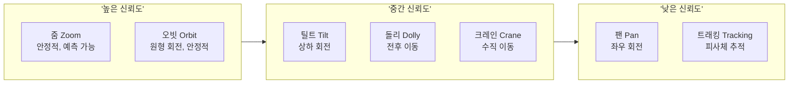
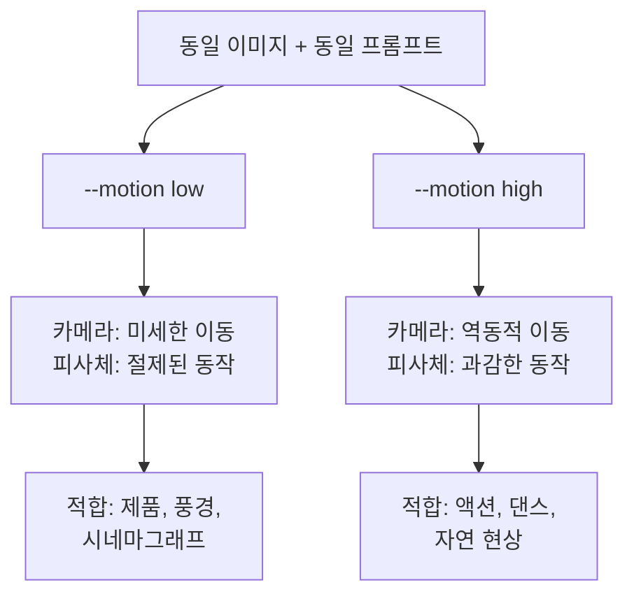
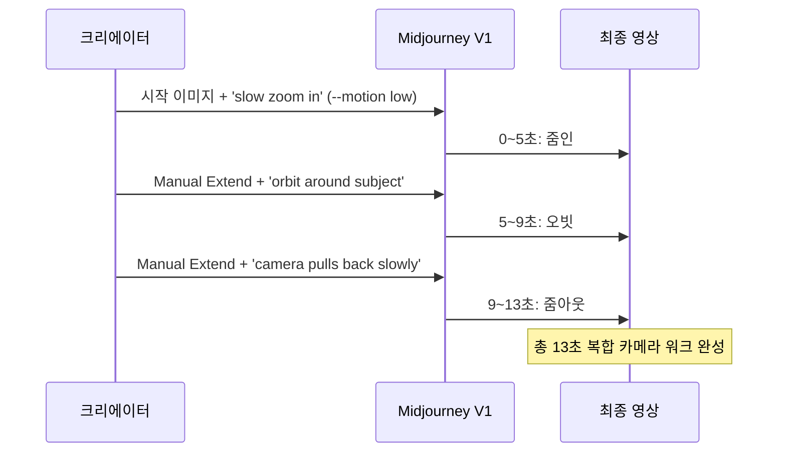

# 모션과 카메라 제어

> 프롬프트 한 줄로 카메라를 움직이는 법 — AI 영상의 핵심은 "어떻게 보여줄 것인가"입니다.

## 개요

Midjourney V1 비디오에서 카메라 무브먼트와 모션 강도를 프롬프트로 제어하는 방법을 다룹니다. 줌, 팬, 오빗 등 카메라 동작의 종류와 신뢰도를 이해하고, `--motion`, `--raw`, `--end` 파라미터를 조합하여 의도한 영상을 만드는 실전 기법을 익힙니다.

## 카메라 무브먼트의 종류

V1에서 프롬프트로 구현할 수 있는 카메라 동작은 크게 7가지입니다. 동작마다 AI의 해석 신뢰도가 다르므로, 신뢰도를 고려한 선택이 중요합니다.



| 카메라 동작 | 프롬프트 키워드 | 신뢰도 | 적합한 장면 |
|------------|----------------|--------|------------|
| 줌인 | `zoom in`, `push in`, `close up` | 높음 | 인물, 디테일, 감정 |
| 줌아웃 | `zoom out`, `pull back`, `reveal` | 높음 | 풍경, 공간, 반전 |
| 팬 | `pan left/right`, `sweep` | 중간 | 파노라마, 군중 |
| 틸트 | `tilt up/down`, `crane up` | 중간 | 건축, 수직 구조 |
| 오빗 | `orbit`, `rotate around`, `360` | 높음 | 제품, 오브제, 인물 |
| 돌리 | `dolly in`, `camera moves forward` | 중간 | 복도, 거리, 영화적 |
| 크레인 | `camera rises`, `aerial descent` | 중간 | 도시, 대규모 장면 |
| 트래킹 | `follow`, `track`, `chase` | 낮음 | 이동하는 피사체 |

**줌(Zoom)** 은 가장 안정적인 카메라 동작입니다. `zoom in`은 몰입감, `zoom out`은 개방감을 만듭니다.

```
slow zoom in on a porcelain teacup, steam rising, soft window light --motion low
```


**오빗(Orbit)** 은 피사체 주위를 원형으로 도는 동작으로, 제품 촬영에 특히 효과적입니다.

```
soft orbital move around vintage camera on wooden desk, warm studio light --motion low --raw
```


**돌리(Dolly)** 는 카메라 자체가 전후로 이동하며, 줌과 달리 원근감이 변해 더 영화적입니다.

```
camera pushes in slowly through misty forest path, golden hour, cinematic --motion low
```

**트래킹(Tracking)** 은 피사체를 따라가는 동작으로, 결과 예측이 가장 어렵습니다.

```
camera follows running horse along beach shoreline, dramatic sunset --motion high
```


## 모션 파라미터 — `--motion`, `--raw`, `--end`



**`--motion low`** (기본값)은 카메라와 피사체 모두 절제된 움직임을 보입니다. 분위기 있는 시네마그래프, 제품 촬영, 풍경 영상에 적합합니다.

```
ocean waves gently lapping against rocks, soft morning mist, still camera --motion low
```

**`--motion high`** 는 역동적인 장면에 사용합니다. 과도하면 비현실적 왜곡이 생길 수 있으므로 주의가 필요합니다.

```
phoenix reborn from ashes, reverse time burst, sparks flying upward --motion high
```

와 high(우) 비교")

**`--raw`** 는 AI의 창의적 개입을 줄여 프롬프트의 카메라 지시가 더 정확히 반영됩니다. 정밀 제어가 필요할 때 사용하세요.

```
slow dolly forward through narrow alley, neon signs reflecting on wet ground --motion low --raw
```

**`--end [이미지URL]`** 은 영상의 마지막 프레임을 지정합니다. 시작-끝 이미지의 구도 차이로 카메라 경로를 간접 제어하는 강력한 방법입니다.

- **줌인 유도**: 시작 = 전경, 끝 = 클로즈업
- **팬 유도**: 시작 = 왼쪽 구도, 끝 = 오른쪽 구도
- **틸트업 유도**: 시작 = 지면, 끝 = 하늘

| 파라미터 | 기능 | 사용 팁 |
|---------|------|---------|
| `--motion low` | 모션 강도 낮춤 (기본값) | 분위기, 제품, 풍경 |
| `--motion high` | 모션 강도 높임 | 액션, 역동적 장면 |
| `--raw` | AI 창의적 개입 최소화 | 정밀 카메라 제어 시 |
| `--end [URL]` | 마지막 프레임 지정 | 카메라 경로 유도 |
| `--loop` | 시작-끝 자연 연결 | 반복 재생 콘텐츠 |

## 모션 프롬프트 작성법

효과적인 모션 프롬프트에는 4가지 원칙이 있습니다.

**원칙 1: 서술적 카메라 동사를 사용하라** — 기술 용어보다 묘사적 표현이 더 잘 작동합니다.

| 의도 | 기술 용어 | 서술적 표현 (추천) |
|------|----------|-------------------|
| 줌인 | `zoom in` | `camera slowly pushes closer` |
| 팬 | `pan right` | `camera sweeps across the scene` |
| 오빗 | `orbit` | `soft orbital move around the subject` |
| 크레인 업 | `crane up` | `camera rises to reveal the skyline` |

**원칙 2: 속도를 반드시 명시하라** — `slowly`, `gently`, `fast` 같은 수식어 없이는 AI가 임의로 결정합니다.

```
camera sweeps right gently across neon-lit Tokyo street, rain reflections, cinematic --motion low
```

**원칙 3: 하나의 동작에 집중하라** — 복합 지시(`zoom in while panning left and orbiting`)는 AI를 혼란에 빠뜨립니다.

**원칙 4: 220자 이내로 압축하라** — V1 비디오 프롬프트는 220자 제한이 있습니다.

## 장면별 프롬프트 예시

제품 회전:
```
matte-black watch rotating on mirrored plinth, studio rim light, soft fog --motion low --raw
```


풍경 리빌:
```
camera rises slightly to reveal mountain lake at sunrise, misty atmosphere --motion low
```

인물 클로즈업:
```
slow zoom in on woman's face, rain droplets on window, moody cinematic lighting --motion low --raw
```


루프 콘텐츠:
```
ocean waves crashing on rocks, seamless loop, soft orbital camera --motion low --loop
```

## 고급 전략 — Extend 체인으로 복합 카메라 워크

5초 영상 하나에는 하나의 카메라 동작만 넣되, Extend로 이어 붙이면서 새로운 동작을 추가할 수 있습니다. 최대 21초까지 다양한 카메라 워크를 연결합니다.



480p 해상도 한계를 극복하는 매크로 전략:
```
extreme close-up macro shot, dewdrop on leaf surface, shallow depth of field, bokeh --motion low --raw
```


## 실습

### 실습 1: 프롬프트 개선

아래 초보자 프롬프트를 개선해보세요.

**Before**: `zoom in on a flower`
**After (예시)**:
```
slow macro push-in on dewdrop resting on rose petal, soft morning light, bokeh background --motion low --raw
```

**Before**: `pan across city at night`
**After (예시)**:
```
camera sweeps slowly across neon-lit Tokyo street, rain reflections on asphalt, cinematic --motion low
```

### 실습 2: `--end` 파라미터로 카메라 경로 설계

시작/끝 이미지의 구도를 설계하여 원하는 카메라 동작을 유도해보세요.

| 원하는 동작 | 시작 이미지 구도 | 끝 이미지 구도 | 프롬프트 |
|------------|----------------|---------------|---------|
| 느린 줌인 | 인물 상반신 미디엄 샷 | 눈 클로즈업 | `emotional close-up, soft light --motion low --raw` |
| 팬 라이트 | 도시 좌측 절반 | 도시 우측 절반 | `city panorama, golden hour --motion low` |
| 크레인 업 | 건물 입구 지면 레벨 | 건물 꼭대기 + 하늘 | `camera rises to reveal architecture --motion low` |

## 팁과 주의사항

- V1의 카메라 지시는 **제안(suggestion)**에 가깝습니다. 줌은 거의 확실히 반영되지만, 트래킹 같은 복잡한 동작은 모델이 재해석할 수 있습니다.
- V1은 4개의 변형을 동시에 생성합니다. "한 번에 완벽한 결과"보다 **4개 중 최선을 선택하고 Extend하는 전략**이 효율적입니다.
- 속도 수식어를 반드시 붙이세요. `zoom out`보다 `zoom out slowly`가 훨씬 안정적입니다.
- 480p 해상도가 아쉬울 때는 매크로 푸시인, 안개, 보케, 실루엣 등으로 해상도 한계를 감출 수 있습니다.
- 한 클립에 여러 카메라 동작을 넣지 마세요. 복합 워크가 필요하면 Extend 체인을 활용하세요.
- `--raw` 사용 시 프롬프트를 더 구체적으로 작성해야 합니다. AI의 자유 해석이 줄어드는 만큼 지시가 명확해야 합니다.

## 핵심 정리

| 개념 | 설명 |
|------|------|
| 카메라 무브먼트 | 줌, 팬, 틸트, 오빗, 돌리, 크레인, 트래킹 — 줌과 오빗이 가장 신뢰도 높음 |
| `--motion low/high` | 모션 강도 제어. low는 절제된 움직임, high는 역동적 움직임 |
| `--raw` | AI 창의적 개입 최소화. 프롬프트 카메라 지시에 더 충실한 결과 |
| `--end` | 마지막 프레임 지정. 시작-끝 구도 차이로 카메라 경로 간접 제어 |
| 속도 수식어 | `slowly`, `gently`, `fast` 등 반드시 명시해야 안정적 결과 |
| 하나의 동작 원칙 | 한 클립에 하나의 카메라 동작만. 복합 워크는 Extend 체인으로 |
| 220자 제한 | 비디오 프롬프트는 220자 이내. 핵심만 간결하게 |
| Extend 체인 | 5초 단위로 이어 붙이며 카메라 동작 변경. 최대 21초 |

## 다음 섹션 미리보기

다음 섹션 [영상 확장과 반복 생성](10-ch10-midjourney-영상-생성/04-04-영상-확장과-반복-생성.md)에서는 `--end` 파라미터를 활용한 Start/End Frame 전환 품질 최적화, Extend 체인으로 5초를 21초까지 확장하는 기법, `--loop`로 완벽한 루프 영상을 만드는 방법을 다룹니다.
