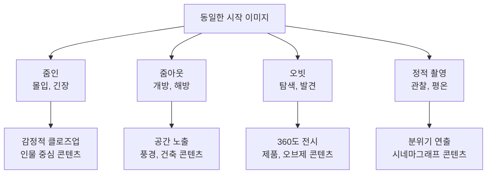
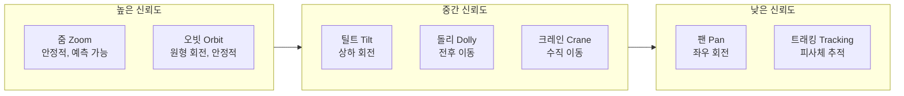
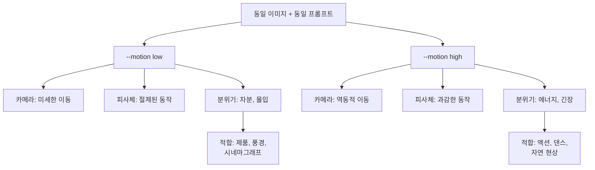
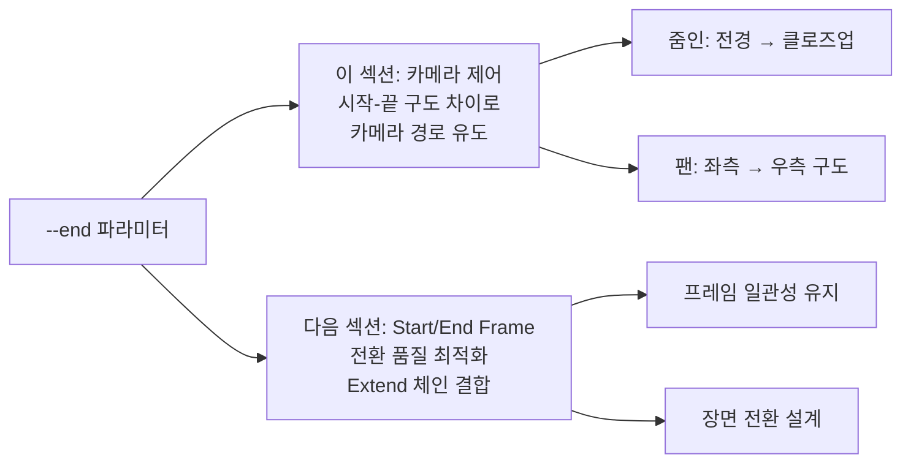
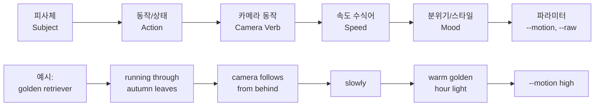
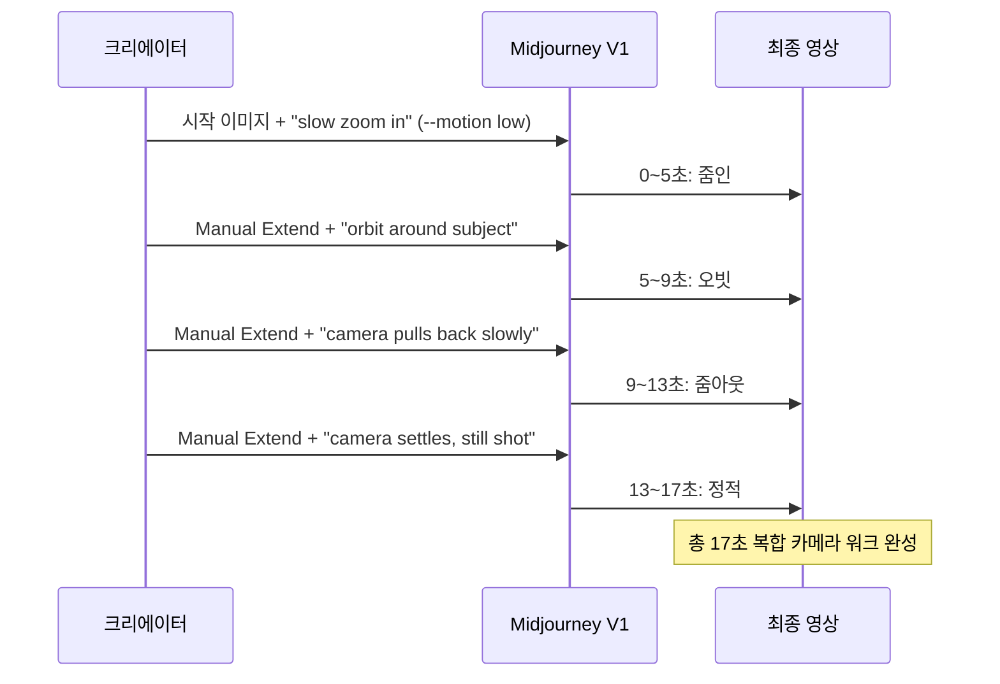

# 모션과 카메라 제어

> Midjourney V1 비디오의 모션 방향, 속도, 카메라 무브먼트를 프롬프트로 제어하는 기법을 마스터합니다.

## 개요

이 섹션에서는 Midjourney V1 비디오 생성에서 가장 창의적인 영역인 **모션과 카메라 제어**를 깊이 있게 다룹니다. 앞서 [Midjourney 비디오 모델 소개](10-ch10-midjourney-영상-생성/01-01-midjourney-비디오-모델-소개.md)에서 V1 모델의 기본 사양을 배웠고, [Image-to-Video](10-ch10-midjourney-영상-생성/02-02-image-to-video-정지-이미지에-생명-불어넣기.md)에서 정지 이미지에 생명을 불어넣는 워크플로우를 익혔습니다. 이제 그 영상 안에서 **카메라가 어떻게 움직이고**, **피사체가 어떤 속도로 변화하는지**를 의도대로 제어하는 방법을 배울 차례입니다.

**선수 지식**: V1 비디오 모델의 기본 사양, Auto/Manual 모드, `--motion` 파라미터의 기초 개념
**학습 목표**:
- 카메라 무브먼트 유형(팬, 틸트, 줌, 오빗, 돌리 등)을 프롬프트로 구현할 수 있다
- `--motion`, `--raw`, `--end` 파라미터를 조합하여 모션 강도와 방향을 세밀하게 제어할 수 있다
- 장면의 의도에 맞는 카메라 워크를 설계하고 최적화할 수 있다

## 왜 알아야 할까?

영상의 힘은 **움직임**에서 나옵니다. 같은 풍경 사진이라도 카메라가 천천히 줌인하면 몰입감이 생기고, 빠르게 팬하면 역동적인 느낌이 됩니다. 할리우드 영화감독들이 수십 년간 연마해 온 "카메라 언어"가 있는데요, AI 영상 시대에도 이 원리는 똑같이 적용됩니다.

문제는 Midjourney V1이 아직 전용 카메라 컨트롤 UI를 제공하지 않는다는 점입니다. 줌인 슬라이더나 팬 방향 버튼 같은 것이 없어요. 대신 **프롬프트 텍스트**로 카메라의 움직임을 "제안"해야 합니다. 이것은 한계이자 동시에 기회인데요 — 프롬프트 작성법을 제대로 알면, 누구보다 정교한 카메라 워크를 구현할 수 있기 때문입니다.

> 📊 **그림 1**: 카메라 제어가 영상 감성에 미치는 영향

## 핵심 개념

### 개념 1: 카메라 무브먼트의 종류 — 영상 문법의 기초

> 💡 **비유**: 카메라 무브먼트는 글쓰기에서의 **문장 부호**와 같습니다. 마침표(정적 쇼트)는 문장을 끊고, 쉼표(느린 팬)는 흐름을 이어가고, 느낌표(빠른 줌)는 강조를 만듭니다. 어떤 부호를 쓰느냐에 따라 같은 단어도 전혀 다른 느낌을 주듯, 같은 장면도 카메라 움직임에 따라 완전히 다른 이야기가 됩니다.

Midjourney V1에서 프롬프트로 구현할 수 있는 주요 카메라 무브먼트를 살펴보겠습니다.

**줌(Zoom)** — 가장 안정적으로 작동하는 카메라 동작입니다. `zoom in`은 피사체에 점점 가까워지며 몰입감을 만들고, `zoom out`은 전체 풍경을 드러내며 개방감을 줍니다. V1에서 가장 신뢰도가 높은 카메라 동작이에요.

**팬(Pan)** — 카메라가 고정된 위치에서 좌우로 회전합니다. `pan left`, `pan right`로 지시하는데, 줌보다는 결과의 일관성이 낮은 편입니다. 넓은 풍경이나 다수의 인물이 있는 장면에서 효과적입니다.

**틸트(Tilt)** — 카메라가 고정된 위치에서 위아래로 회전합니다. `tilt up`으로 건물의 전체 높이를 드러내거나, `tilt down`으로 하늘에서 지면으로 시선을 내리는 연출이 가능합니다. 수직 구조물이 있는 장면 — 마천루, 폭포, 거대한 나무 — 에서 특히 효과적이에요.

**오빗(Orbit)** — 카메라가 피사체 주위를 원형으로 돕니다. 제품 촬영이나 조각상 전시에 매우 효과적이에요. `slow orbit around the subject` 같은 프롬프트가 잘 작동합니다.

**돌리(Dolly)** — 카메라 자체가 앞뒤로 이동합니다. 줌과 비슷해 보이지만, 돌리는 원근감이 변하면서 더 영화적인 느낌을 줍니다. `camera pushes in slowly`라고 쓰면 줌보다 돌리에 가까운 결과를 얻을 수 있습니다.

**크레인(Crane)** — 카메라가 수직으로 상승하거나 하강합니다. 틸트와 혼동하기 쉬운데, 틸트는 카메라 위치가 고정된 채 각도만 변하는 반면, 크레인은 카메라 자체가 위아래로 이동합니다. `camera rises above the rooftops`처럼 물리적 상승감을 표현하는 프롬프트가 효과적이에요.

**트래킹(Tracking)** — 카메라가 움직이는 피사체를 따라갑니다. `camera follows the subject` 같은 프롬프트로 구현하는데, 결과의 예측 가능성은 가장 낮습니다. 피사체의 움직임과 카메라의 움직임을 동시에 제어해야 하므로 AI가 해석할 여지가 큰 편입니다.

> 📊 **그림 2**: 카메라 무브먼트 유형별 특성 비교

| 카메라 동작 | 프롬프트 키워드 | 신뢰도 | 적합한 장면 |
|------------|----------------|--------|------------|
| 줌인 | `zoom in`, `push in`, `close up` | 높음 | 인물, 디테일, 감정 |
| 줌아웃 | `zoom out`, `pull back`, `reveal` | 높음 | 풍경, 공간, 반전 |
| 팬 | `pan left/right`, `sweep` | 중간 | 파노라마, 군중 |
| 틸트 | `tilt up/down`, `crane up` | 중간 | 건축, 수직 구조 |
| 오빗 | `orbit`, `rotate around`, `360` | 높음 | 제품, 오브제, 인물 |
| 돌리 | `dolly in`, `camera moves forward` | 중간 | 복도, 거리, 영화적 |
| 크레인 | `camera rises`, `aerial descent` | 중간 | 도시, 군중, 대규모 장면 |
| 트래킹 | `follow`, `track`, `chase` | 낮음 | 이동하는 피사체 |

> ⚠️ **흔한 오해**: "카메라 동작을 정확히 지시하면 100% 반영된다"고 생각하기 쉽지만, V1 모델에서 카메라 지시는 **제안(suggestion)**에 가깝습니다. 줌은 거의 확실히 반영되지만, 복잡한 트래킹 샷은 모델이 재해석할 수 있어요.

### 개념 2: 모션 파라미터 완전 정복 — `--motion`, `--raw`, `--end`

> 💡 **비유**: 모션 파라미터는 자동차의 **기어**와 같습니다. `--motion low`는 1단 기어 — 천천히 부드럽게 출발합니다. `--motion high`는 5단 기어 — 빠르고 역동적이지만 통제를 잃을 수도 있어요. `--raw`는 **매뉴얼 기어** — 운전자(프롬프터)의 의도가 더 직접적으로 반영되지만, 그만큼 숙련이 필요합니다.

V1 비디오에서 사용할 수 있는 핵심 파라미터 세 가지를 깊이 파헤쳐 보겠습니다.

**`--motion low` vs `--motion high`**

이 파라미터는 영상 전체의 움직임 강도를 결정합니다. 단순히 "느리다/빠르다"가 아니라, 모션의 **성격 자체**가 달라진다는 점이 중요해요.

- **Low Motion** (기본값): 카메라가 거의 고정되거나 미세하게 움직입니다. 피사체도 천천히, 절제된 동작을 보여줍니다. 분위기 있는 시네마그래프, 제품 촬영, 풍경 영상에 적합합니다.
- **High Motion**: 카메라와 피사체 모두 크게 움직입니다. 역동적인 액션, 댄스, 자연 현상(폭풍, 파도) 등에 효과적이지만, 과도하면 비현실적인 왜곡이 생길 수 있어요.

> 📊 **그림 3**: `--motion` 파라미터에 따른 결과 비교

**`--raw` 파라미터의 전략적 활용**

`--raw`는 원래 이미지 생성에서 Midjourney의 미학적 개입을 줄이는 파라미터였는데, 비디오에서도 비슷하게 작동합니다. `--raw`를 추가하면 모델이 자체적으로 추가하는 "창의적 연출"이 줄어들고, **프롬프트 텍스트에 더 충실한 결과**를 만들어냅니다.

언제 `--raw`를 쓸까요?
- 카메라 동작을 정확히 제어하고 싶을 때
- 모델이 과도한 움직임을 추가하는 것을 방지하고 싶을 때
- 미니멀하고 절제된 영상이 필요할 때

**`--end` 파라미터 — 종착점 지정**

`--end [이미지URL]`을 사용하면 영상의 **마지막 프레임**을 지정할 수 있습니다. 시작 이미지(Start Frame)와 끝 이미지(End Frame) 사이를 AI가 자연스럽게 연결하는 방식인데요, 이것은 카메라 움직임을 간접적으로 제어하는 강력한 방법입니다.

예를 들어, 시작 이미지가 건물의 전경이고 끝 이미지가 건물 입구의 클로즈업이라면, AI는 자연스럽게 "줌인" 또는 "돌리인" 카메라 워크를 생성합니다.

> 💡 **`--end`와 Start/End Frame의 관계**: 여기서 배우는 `--end` 파라미터는 다음 섹션 [영상 확장과 반복 생성](10-ch10-midjourney-영상-생성/04-04-영상-확장과-반복-생성.md)에서 다루는 **Start/End Frame 제어**의 핵심 도구입니다. 이 섹션에서는 `--end`를 "카메라 경로를 간접 제어하는 수단"으로 배우고, 다음 섹션에서는 이 파라미터를 활용해 Start Frame과 End Frame 사이의 **전환 품질을 최적화**하고, Extend 체인과 결합하여 **장면 간 연결을 설계**하는 고급 워크플로우로 확장합니다. 지금은 `--end`의 카메라 제어 측면에 집중하세요.

> 📊 **그림 6**: `--end` 파라미터의 활용 범위 — 이 섹션 vs 다음 섹션

| 파라미터 | 기능 | 사용 팁 |
|---------|------|---------|
| `--motion low` | 모션 강도 낮춤 (기본값) | 분위기, 제품, 풍경 |
| `--motion high` | 모션 강도 높임 | 액션, 역동적 장면 |
| `--raw` | AI 창의적 개입 최소화 | 정밀 카메라 제어 시 |
| `--end [URL]` | 마지막 프레임 지정 | 시작-끝 전환 효과, 카메라 경로 유도 |
| `--loop` | 시작-끝 자연 연결 | 반복 재생 콘텐츠 |

### 개념 3: 모션 프롬프트 작성법 — 카메라 언어를 텍스트로 번역하기

> 💡 **비유**: 모션 프롬프트를 쓰는 것은 **길 안내**를 해주는 것과 비슷합니다. "서울역 가주세요"라고만 하면 택시 기사가 알아서 경로를 정하듯, "zoom in on the subject"라고 하면 AI가 알아서 줌인합니다. 하지만 "명동 지나서 남대문 쪽으로 천천히 가주세요"처럼 **경로와 속도를 함께** 알려주면 원하는 결과에 훨씬 가까워지죠.

모션 프롬프트 작성에는 몇 가지 핵심 원칙이 있습니다.

**원칙 1: 카메라 동사(Camera Verb)를 명확하게**

기술 용어보다 **서술적 표현**이 더 잘 작동할 때가 많습니다.

| 의도 | 기술 용어 (보통) | 서술적 표현 (추천) |
|------|-----------------|-------------------|
| 줌인 | `zoom in` | `camera slowly pushes closer` |
| 팬 | `pan right` | `camera sweeps across the scene` |
| 오빗 | `orbit` | `soft orbital move around the subject` |
| 크레인 업 | `crane up` | `camera rises to reveal the skyline` |

**원칙 2: 속도를 반드시 명시하라**

속도 지시가 없으면 AI가 임의로 결정합니다. `slow`, `slowly`, `gradual`, `fast`, `rapid` 같은 속도 수식어를 반드시 붙이세요.

`zoom out`보다 `zoom out slowly`가 훨씬 안정적인 결과를 만들어냅니다.

**원칙 3: 하나의 동작에 집중하라**

한 프롬프트에 여러 카메라 동작을 넣으면 AI가 혼란스러워합니다. "zoom in while panning left and tilting up"보다 **하나의 주요 동작**을 선택하세요.

**원칙 4: 220자 이내로 압축하라**

V1 비디오 프롬프트는 220자 제한이 있습니다. 이미지 프롬프트처럼 장황하게 쓰면 뒷부분이 잘릴 수 있어요. 핵심 동작과 분위기만 간결하게 담으세요.

> 📊 **그림 4**: 효과적인 모션 프롬프트 구성 공식

**장면별 프롬프트 예시**

| 장면 유형 | 프롬프트 예시 | 파라미터 |
|----------|-------------|---------|
| 제품 회전 | `matte-black watch rotating on mirrored plinth, studio rim light, soft fog` | `--motion low --raw` |
| 풍경 리빌 | `camera rises slightly to reveal mountain lake at sunrise, misty atmosphere` | `--motion low` |
| 인물 클로즈업 | `slow zoom in on woman's face, rain droplets on window, moody lighting` | `--motion low --raw` |
| 액션 씬 | `phoenix reborn from ashes, reverse time burst, sparks flying` | `--motion high` |
| 루프 콘텐츠 | `ocean waves crashing on rocks, seamless loop, soft orbital camera` | `--motion low --loop` |

### 개념 4: 고급 카메라 제어 전략 — 한계를 기회로

> 💡 **비유**: V1의 카메라 제어는 **수채화 그리기**와 비슷합니다. 유화처럼 정확히 원하는 곳에 색을 올릴 순 없지만, 물과 안료의 흐름을 이해하면 유화로는 불가능한 아름다운 번짐과 우연의 효과를 만들 수 있습니다. V1도 "완벽한 통제"보다 "영리한 유도"가 핵심이에요.

**전략 1: `--end` 파라미터로 카메라 경로 강제하기**

시작 이미지와 끝 이미지의 구도 차이를 이용하면, AI에게 카메라 움직임의 방향을 사실상 강제할 수 있습니다.

- **줌인 효과**: 시작 = 전경, 끝 = 클로즈업
- **줌아웃 효과**: 시작 = 클로즈업, 끝 = 전경
- **팬 효과**: 시작 = 왼쪽 구도, 끝 = 오른쪽 구도
- **틸트업 효과**: 시작 = 지면, 끝 = 하늘

**전략 2: `--raw` + 서술적 프롬프트 조합**

`--raw`는 AI의 자유 해석을 줄이므로, 프롬프트의 카메라 지시가 더 정확히 반영됩니다. 다만 그만큼 프롬프트를 더 구체적으로 써야 해요.

**전략 3: 해상도 한계를 카메라로 극복하기**

V1의 기본 해상도는 480p로 낮은 편인데요, 매크로 푸시인(macro push-in)이나 실루엣 샷처럼 디테일이 적은 구도를 선택하면 해상도 한계가 덜 눈에 띕니다. 안개, 연기, 보케 같은 분위기 효과도 낮은 해상도를 자연스럽게 감춰줍니다.

**전략 4: Extend 체인으로 복합 카메라 워크 구현**

5초짜리 영상 하나에는 하나의 카메라 동작만 넣되, Extend 기능으로 이어 붙이면서 **새로운 카메라 동작을 추가**할 수 있습니다. 첫 5초는 줌인, 다음 4초는 오빗, 그 다음 4초는 줌아웃 — 이런 식으로 최대 21초까지 다양한 카메라 워크를 연결할 수 있어요.

> 📊 **그림 5**: Extend 체인을 활용한 복합 카메라 워크

## 실습: 적용해보기

### 실습 1: 카메라 무브먼트 매칭 워크시트

아래 장면 설명을 읽고, 가장 적합한 카메라 무브먼트와 파라미터를 선택해보세요.

| # | 장면 설명 | 카메라 동작 | 파라미터 | 이유 |
|---|----------|-----------|---------|------|
| 1 | 신제품 운동화를 360도로 보여주는 SNS 광고 | ? | ? | |
| 2 | 안개 낀 새벽 호수의 고요한 분위기 영상 | ? | ? | |
| 3 | 도시의 스카이라인을 아래에서 위로 드러내는 시네마틱 숏 | ? | ? | |
| 4 | 달리는 강아지를 따라가는 역동적인 영상 | ? | ? | |

**모범 답안 가이드**:
1. 오빗(`orbit around the sneaker`) + `--motion low --raw` → 안정적인 360도 회전
2. 줌인(`slow zoom in`) + `--motion low` → 고요함 유지하며 몰입감
3. 틸트업(`camera rises to reveal skyline`) + `--motion low` → 수직 구조 노출
4. 트래킹(`camera follows from behind`) + `--motion high` → 역동적 추적

### 실습 2: 프롬프트 개선 연습

아래의 "초보자 프롬프트"를 개선해보세요.

**Before**: `zoom in on a flower`
**개선 포인트**: 속도 없음, 분위기 없음, 파라미터 없음
**After (예시)**: `slow macro push-in on dewdrop resting on rose petal, soft morning light, bokeh background --motion low --raw`

**Before**: `pan across city at night`
**개선 포인트**: 구체적 묘사 부족, 방향 불명확
**After (예시)**: `camera sweeps slowly across neon-lit Tokyo street, rain reflections on asphalt, cinematic --motion low`

### 실습 3: `--end` 파라미터로 카메라 경로 설계하기

아래 시나리오에서 시작 이미지와 끝 이미지의 구도를 설계하여, 원하는 카메라 움직임을 유도해보세요.

| # | 원하는 카메라 동작 | 시작 이미지 구도 | 끝 이미지 구도 | 프롬프트 |
|---|------------------|----------------|---------------|---------|
| 1 | 느린 줌인 (인물 감정 강조) | ? | ? | ? |
| 2 | 팬 라이트 (도시 파노라마) | ? | ? | ? |
| 3 | 크레인 업 (건물 리빌) | ? | ? | ? |

**모범 답안 가이드**:
1. 시작 = 인물 상반신 미디엄 샷, 끝 = 눈 클로즈업 → `emotional close-up, soft light --motion low --raw`
2. 시작 = 도시 좌측 절반, 끝 = 도시 우측 절반 → `city panorama, golden hour --motion low`
3. 시작 = 건물 입구 지면 레벨, 끝 = 건물 꼭대기 + 하늘 → `camera rises to reveal architecture --motion low`

### 토론 질문

1. `--motion high`를 사용했을 때 비현실적인 왜곡이 발생했다면, 어떤 대안 전략을 쓸 수 있을까요?
2. `--end` 파라미터로 시작/끝 프레임을 지정하는 방식과, 프롬프트 텍스트로 카메라를 제어하는 방식 중 어떤 것이 더 예측 가능할까요? 각각의 장단점은?
3. 5초짜리 SNS 릴스 광고와 21초짜리 브랜드 영상에서, 카메라 워크 전략은 어떻게 달라져야 할까요?

## 더 깊이 알아보기

### 카메라 무브먼트의 영화사적 배경

카메라 움직임의 역사는 영화의 역사 자체이기도 합니다. 1903년 에드윈 포터의 《대열차 강도》에서 처음으로 팬(pan) 촬영이 사용되었고, 이것만으로도 당시 관객들은 경악했다고 합니다. 카메라가 움직인다는 것 자체가 혁명이었거든요.

1920년대 독일 표현주의 영화감독 F.W. 무르나우는 《마지막 웃음(Der letzte Mann, 1924)》에서 카메라를 자전거에 묶고 촬영하며 최초의 "돌리 샷"을 구현했습니다. 지금 우리가 Midjourney에 `dolly in`이라고 타이핑하는 그 기법을 100년 전에 자전거로 만들었다니, 기술의 민주화가 얼마나 빠르게 진행되고 있는지 실감나죠?

유명한 "돌리 줌(Dolly Zoom)"은 알프레드 히치콕의 《현기증(Vertigo, 1958)》에서 탄생했는데요, 카메라가 전진하면서 동시에 줌아웃하여 배경이 왜곡되는 불안한 효과를 만듭니다. 이 기법은 이후 스필버그의 《죠스》, 피터 잭슨의 《반지의 제왕》 등 수많은 영화에서 "공포와 불안"을 표현하는 데 사용되었습니다. Midjourney V1에서 정확한 돌리 줌을 구현하기는 아직 어렵지만, `--end` 파라미터와 원근감이 다른 두 프레임을 조합하면 유사한 효과를 시도해볼 수 있습니다.

> 💡 **알고 계셨나요?**: "오빗 샷(Orbit Shot)"이라는 이름은 우주선이 행성 궤도를 도는 것에서 유래했습니다. 영화에서는 《매트릭스(1999)》의 "불렛 타임"이 오빗 샷의 극단적 형태인데요, 120대의 카메라를 원형으로 배치하여 촬영한 것입니다. Midjourney에서는 `orbit` 한 단어만으로 비슷한 효과를 만들 수 있으니, 100년간의 기술 발전이 프롬프트 한 줄에 압축된 셈입니다.

## 흔한 오해와 팁

> ⚠️ **흔한 오해**: "카메라 동작을 여러 개 넣으면 더 멋진 영상이 나온다." 실제로는 정반대입니다. V1 모델은 **하나의 명확한 카메라 동작**에 가장 잘 반응합니다. `zoom in while panning left and orbiting`같이 복합 지시를 넣으면, 모델이 혼란스러워서 어떤 동작도 제대로 실행하지 못하는 경우가 많아요. 한 클립에 하나의 동작, 복합 카메라 워크가 필요하면 Extend로 이어 붙이세요.

> 💡 **알고 계셨나요?**: Midjourney V1은 4개의 비디오 변형을 동시에 생성하는데, 각각 다른 모션 경로와 카메라 각도를 사용합니다. 같은 프롬프트라도 4가지 해석이 나오므로, "한 번에 완벽한 결과"를 기대하기보다 **4개 중 가장 좋은 것을 선택하고 Extend하는 전략**이 효율적입니다.

> 🔥 **실무 팁**: 카메라 동작의 신뢰도를 높이는 가장 실용적인 방법은 **속도 수식어를 반드시 붙이는 것**입니다. `zoom out`보다 `zoom out slowly`가, `pan right`보다 `camera sweeps right gently`가 훨씬 안정적인 결과를 만듭니다. 속도 지시가 없으면 AI가 임의로 결정하면서 의도와 다른 결과가 나올 확률이 높아집니다.

> 🔥 **실무 팁**: 480p 해상도가 아쉬울 때는 **매크로 푸시인** 전략을 사용하세요. 아주 가까운 거리에서 촬영하는 것처럼 프롬프트를 쓰면(`extreme close-up, macro shot`), 디테일이 적은 장면이 되어 해상도 한계가 거의 느껴지지 않습니다. 안개, 보케, 실루엣 등 분위기 요소도 해상도를 자연스럽게 감추는 좋은 도구입니다.

## 핵심 정리

| 개념 | 설명 |
|------|------|
| 카메라 무브먼트 | 줌, 팬, 틸트, 오빗, 돌리, 크레인, 트래킹 — 줌과 오빗이 가장 신뢰도 높음 |
| `--motion low/high` | 모션 강도 제어. low는 절제된 움직임, high는 역동적 움직임 |
| `--raw` | AI 창의적 개입 최소화. 프롬프트 카메라 지시에 더 충실한 결과 |
| `--end` | 마지막 프레임 이미지 지정. 시작-끝 구도 차이로 카메라 경로 간접 제어. 다음 섹션의 Start/End Frame 워크플로우의 기반 |
| 속도 수식어 | `slowly`, `gently`, `fast` 등 속도를 반드시 명시해야 안정적 결과 |
| 하나의 동작 원칙 | 한 클립에 하나의 카메라 동작만. 복합 워크는 Extend 체인으로 해결 |
| 220자 제한 | 비디오 프롬프트는 220자 이내. 핵심 동작과 분위기만 간결하게 |
| Extend 체인 | 5초 단위로 이어 붙이며 카메라 동작 변경. 최대 21초까지 가능 |

## 다음 섹션 미리보기

카메라 제어를 마스터했다면, 다음으로 배울 것은 [영상 확장과 반복 생성](10-ch10-midjourney-영상-생성/04-04-영상-확장과-반복-생성.md)입니다. 이 섹션에서 배운 `--end` 파라미터를 활용하여 **Start Frame과 End Frame 사이의 전환 품질을 최적화**하는 방법, Extend 체인을 본격적으로 활용하여 5초 영상을 21초까지 확장하는 기법, `--loop` 파라미터로 완벽한 루프 영상을 만드는 방법, 그리고 여러 번의 생성과 선택을 반복하여 최적의 결과물을 얻는 반복 생성 전략을 다룹니다.

## 참고 자료

- [Midjourney V1 Video 공식 문서](https://docs.midjourney.com/hc/en-us/articles/37460773864589-Video) - V1 비디오 모델의 공식 파라미터 목록과 사용법
- [Midjourney Motion Complete Guide 2025 — SuperDuperAI](https://superduperai.co/en/blog/midjourney-v1-video) - 60개 이상의 비디오 프롬프트 예시와 카메라 무브먼트별 테크닉 정리
- [Midjourney Video Camera Prompts: 40+ Free Motion Prompts](https://promptsref.com/guide/midjourney-video-camera-prompts-40-free-motion-prompts-to-copy-1764256867004) - 장르별/카메라 동작별 복사해서 쓸 수 있는 프롬프트 모음
- [Midjourney Camera Control Basics — Geeky Gadgets](https://www.geeky-gadgets.com/midjourney-camera-movements-guide/) - 초보자를 위한 카메라 컨트롤 기초 가이드
- [Introducing Our V1 Video Model — Midjourney Updates](https://updates.midjourney.com/introducing-our-v1-video-model/) - V1 모델 공식 발표 및 핵심 기능 소개

---
### 🔗 Related Sessions
- [v1 비디오 모델](10-ch10-midjourney-영상-생성/01-01-midjourney-비디오-모델-소개.md) (prerequisite)
- [image-to-video 워크플로우](10-ch10-midjourney-영상-생성/01-01-midjourney-비디오-모델-소개.md) (prerequisite)
- [animate 버튼](10-ch10-midjourney-영상-생성/01-01-midjourney-비디오-모델-소개.md) (prerequisite)
- [--motion low](10-ch10-midjourney-영상-생성/02-02-image-to-video-정지-이미지에-생명-불어넣기.md) (prerequisite)
- [--motion high](10-ch10-midjourney-영상-생성/02-02-image-to-video-정지-이미지에-생명-불어넣기.md) (prerequisite)
- [모션 프롬프트](10-ch10-midjourney-영상-생성/01-01-midjourney-비디오-모델-소개.md) (prerequisite)
- [start frame](10-ch10-midjourney-영상-생성/01-01-midjourney-비디오-모델-소개.md) (prerequisite)
